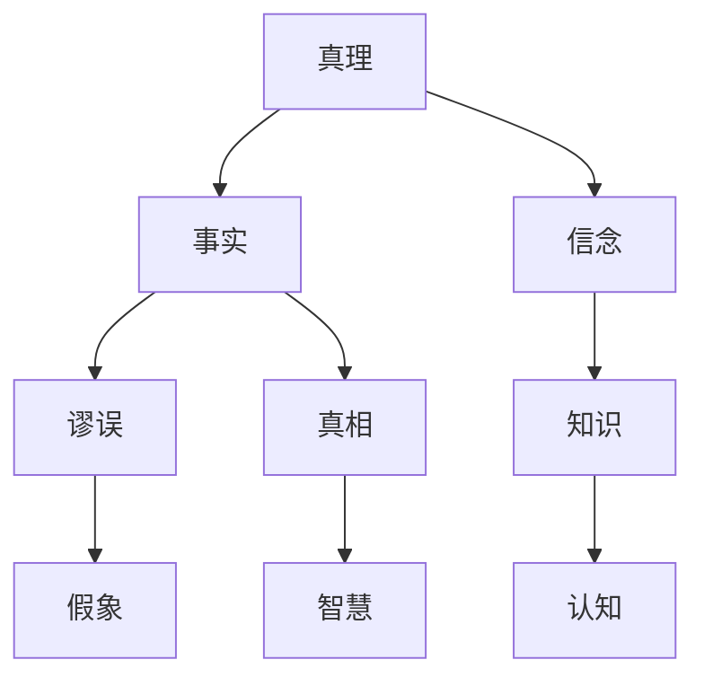
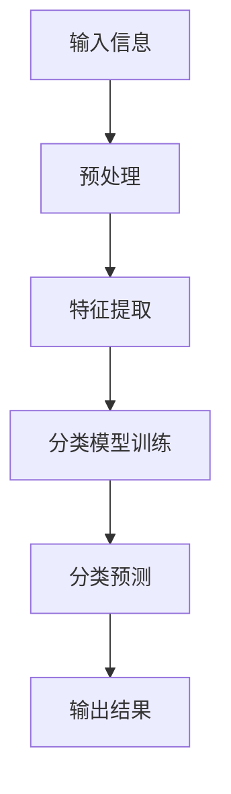

                 

### 1.1.1 后真相时代的特征

后真相时代，即“post-truth”时代，是一个被广泛讨论的概念，它描述了信息传播和舆论形成中，真相和事实的重要性逐渐被情感、个人信念和社交媒体影响所超越的社会现象。以下是对这一时代特征的详细分析：

1. **情感驱动的内容传播**：
   在后真相时代，情感驱动的内容更容易在社交媒体上传播。研究表明，令人愤怒、恐惧和好奇的内容往往比中立或积极的内容传播得更广泛。这种现象背后的原因包括人类的情感本能以及算法的推送机制，它们共同促进了情感内容的快速传播。

2. **虚假信息的泛滥**：
   随着互联网的普及和社交平台的兴起，虚假信息、误导性信息以及谣言传播的速度和范围都大大增加。一些组织和个人利用这种信息不对称来达到特定目的，例如政治宣传、市场操纵等。这种虚假信息的泛滥对社会的稳定和信任造成了严重的挑战。

3. **社交媒体的放大效应**：
   社交媒体平台成为了虚假信息和误导性内容的主要传播渠道。算法的推荐机制使得用户更容易接触到与自己已有观点相符的内容，从而形成一个“信息茧房”，限制了多元信息的接触和理解。

4. **真相的复杂性**：
   后真相时代的另一个特征是真相的复杂性。许多问题往往不是非黑即白，而是有多重维度和解释。在复杂的信息环境中，简单的二元对立和绝对的真相往往难以存在。

5. **公共辩论的恶化**：
   在后真相时代，公共辩论的质量往往受到虚假信息和误导性内容的影响。人们更容易陷入情绪化的对立，而不是基于事实和逻辑的讨论。这种氛围恶化了社会对话的质量，影响了民主和社会进步。

### 1.1.2 真理和正义面临的挑战

在后真相时代，坚持真理和正义面临着前所未有的挑战。以下是这些挑战的详细分析：

1. **信息过载**：
   随着信息的爆炸性增长，人们往往难以分辨哪些是真实的、哪些是虚假的。大量信息的同时涌入导致了认知负荷的增加，使得真相更加难以辨识。

2. **情绪化的信息传播**：
   情感驱动的内容更容易在社交媒体上传播，这往往导致情绪化的信息泛滥。当人们被情感所驱使时，他们更容易忽视真相，从而被误导或操纵。

3. **算法的偏见**：
   社交媒体平台的算法推荐机制可能会放大某些信息，而抑制其他信息。这种偏见可能导致信息的失衡，从而影响公众对于真相和正义的认知。

4. **政治操纵和宣传**：
   政治组织和个人利用虚假信息进行宣传和政治操纵，以达到特定的政治目的。这种做法不仅挑战了真相，也破坏了社会的公共利益。

5. **社会信任的破裂**：
   随着虚假信息和误导性内容的泛滥，公众对于传统媒体的信任度下降，导致社会信任的破裂。这种信任的缺失使得坚持真理和正义变得更加困难。

6. **法律和监管的滞后**：
   在后真相时代，法律和监管体系往往滞后于技术的发展和信息的传播速度。这导致对于虚假信息和误导性内容的监管不够有效，使得这些内容得以自由传播。

### 1.1.3 阅读本书的目的与意义

阅读本书的目的是帮助读者理解后真相时代的特征和挑战，并提供有效的策略和方法来坚持真理和正义。以下是本书的目的与意义的详细说明：

1. **提高信息素养**：
   本书将帮助读者学会如何辨别真假信息，提高信息素养。通过理解信息传播的机制和社交媒体的效应，读者能够更好地识别和抵抗虚假信息和误导性内容。

2. **培养批判性思维**：
   本书鼓励读者培养批判性思维，通过分析信息来源、逻辑结构和证据支持来评估信息的真实性。这种批判性思维有助于建立基于事实的判断和决策。

3. **掌握应对策略**：
   本书提供了多种策略和方法来应对后真相时代的挑战，包括社交媒体内容审核、新闻真实性验证和法律文件真实性验证等实际案例。读者可以借鉴这些经验来提高自己的信息辨别能力。

4. **推动社会进步**：
   通过坚持真理和正义，本书旨在促进社会的公正和进步。通过理解和实践真理和正义的原则，读者可以为构建一个更加公正和公平的社会做出贡献。

5. **提供学术参考**：
   本书结合了哲学、伦理学、社会学和信息技术等多个领域的知识，为学术研究和专业实践提供了丰富的参考。读者可以通过本书深入了解后真相时代的多维度特征和应对策略。

总之，阅读本书不仅有助于个人在信息泛滥的时代中保持清醒和理性，也为社会的发展和进步提供了宝贵的指导。希望通过本书，读者能够更好地理解后真相时代的挑战，并积极应对，为坚持真理和正义贡献力量。

### 1.2 核心概念介绍

在后真相时代，理解几个核心概念至关重要，这些概念包括真理的定义与属性、正义的概念与原则以及后真相时代的媒体生态。以下是对这些核心概念的详细解释：

#### 1.2.1 真理的定义与属性

**真理**是指与客观事实相一致的认识。它具有以下属性：

1. **客观性**：
   真理是独立于主观意志的，它存在于现实世界中，不因人的意志而改变。真理的客观性要求我们在追求真理时，必须超越个人的主观认知，寻求客观事实。

2. **确定性**：
   真理在理论上应该是可验证和可重复的。通过科学实验、实证研究和逻辑推理，我们可以对某些命题的真伪进行验证。

3. **相对性**：
   真理也是相对的，因为它往往受到时空条件的限制。在不同的历史背景和认知水平下，人们对于同一个问题的真理认识可能会有所不同。

4. **层次性**：
   真理可以分为不同的层次，如自然科学中的真理、社会科学中的真理和哲学上的真理。每一层次的真理都有其特定的适用范围和验证方法。

#### 1.2.2 正义的概念与原则

**正义**是指按照一定的原则和标准，对资源、权利和机会进行公正分配。正义包含以下原则：

1. **公平原则**：
   公平是正义的核心原则之一，它要求每个人在资源分配、权利享受和机会获取上不受不公正的对待。公平不仅要形式上平等，更要实质上平等。

2. **正义原则**：
   正义原则强调资源分配应基于个人的贡献和需求。在资源有限的条件下，应优先满足最基本的需求，如食物、住所和医疗。

3. **补偿原则**：
   补偿原则要求对因历史或社会原因而处于不利地位的人进行补偿，以实现实质上的公平。

4. **程序正义**：
   程序正义强调法律和制度的公正性，要求法律程序透明、公正，确保每个人的权利得到尊重和保护。

#### 1.2.3 后真相时代的媒体生态

**后真相时代的媒体生态**具有以下特点：

1. **信息多样化**：
   在后真相时代，信息来源多样化，包括传统媒体、社交媒体和自媒体等。不同的信息源往往有不同的视角和立场，这使得真相更加复杂。

2. **情感驱动**：
   媒体内容更倾向于情感驱动，以吸引读者的注意力。这种情感驱动的内容往往更容易传播，但也可能导致信息的偏差和误导。

3. **算法推荐**：
   社交媒体平台的算法推荐机制决定了用户接触到哪些内容。这种算法推荐可能导致“信息茧房”现象，即用户只接触到与自己观点一致的信息，限制了多元信息的接触。

4. **虚假信息泛滥**：
   虚假信息和误导性内容在社交媒体上广泛传播，这对真相和正义构成了严重挑战。虚假信息往往通过精心设计的叙事和传播策略来误导公众。

5. **公众参与度提高**：
   在后真相时代，公众的参与度大大提高。社交媒体使得每个人都可以成为信息的传播者，这使得真相的识别和传播更加复杂。

通过理解这些核心概念，读者可以更好地识别后真相时代的信息环境，从而在面对复杂的信息时，能够保持理性和客观，坚持真理和正义。

#### 1.3 边界与外延

在后真相时代，对“后真相时代”的定义、真理与事实的关系以及正义与道德的关联进行明确的界定和外延分析，对于理解和应对这一复杂社会现象具有重要意义。

##### 1.3.1 后真相时代的定义

“后真相时代”这个概念由英国政治学家迈克尔·弗雷特在2016年提出，用以描述一个信息传播和舆论形成中，情感和偏见往往超越事实和真相的时代。这一时代的特征包括：

1. **情感驱动**：信息传播更倾向于利用情感，如愤怒、恐惧和好奇，以激发公众的情绪反应，而非基于事实的逻辑分析。
2. **虚假信息泛滥**：在互联网和社交媒体的推动下，虚假信息、误导性信息和谣言传播速度极快，且难以控制。
3. **信息碎片化**：信息的传播呈现碎片化趋势，使得完整的、有深度的分析难以被公众获取和理解。
4. **公众参与度提升**：社交媒体平台使得公众能够以低成本参与信息的传播和讨论，加剧了信息的多样性和复杂性。

“后真相时代”并不仅仅是一个信息传播模式的改变，它还深刻影响了社会的意识形态和公共话语体系。在这个时代，真相不再是唯一的权威，而是一个可争辩的对象，公众对于真相的认知和接受往往受到情感、个人信念和社交媒体算法推荐的影响。

##### 1.3.2 真理与事实的关系

真理与事实的关系是理解后真相时代的关键。**真理**是符合客观事实的认识，而**事实**是客观存在的真实情况。

1. **真理的相对性**：在哲学和认知科学中，真理被认为是相对的，因为它受到人类认知能力的限制。每个人对事实的解读和认识都可能不同，这是由于每个人的知识背景、经验和个人视角不同。
2. **事实的确定性**：事实是独立于人类主观意志的客观存在，可以通过科学实验、实证研究和逻辑推理来验证。尽管人类的认知能力有限，但通过科学方法，我们可以逐渐接近事实。
3. **真理与事实的互动**：真理与事实之间存在动态的互动关系。事实是真理的基础，而真理是对事实的理解和解释。科学的发展和社会的进步都在不断修正和丰富我们对事实的认识，从而逐步接近真理。

在后真相时代，这种互动关系受到挑战。虚假信息和误导性内容的泛滥使得公众难以区分什么是真相，什么是事实。因此，坚持科学方法和理性思考，对事实进行客观分析和验证，显得尤为重要。

##### 1.3.3 正义与道德的关联

正义和道德是维护社会秩序和个体权利的重要概念。**正义**强调对资源、权利和机会的公正分配，而**道德**则涉及个人行为和社会规范。

1. **正义的伦理学基础**：正义原则主要来源于伦理学，如约翰·罗尔斯的《正义论》提出的“公平原则”和“差异原则”，旨在实现资源分配的公正和合理。
2. **道德的多样性**：道德观念因文化、宗教和社会背景的不同而具有多样性。例如，儒家文化强调“仁爱”和“孝顺”，而西方文化则强调“自由”和“平等”。
3. **正义与道德的互动**：正义和道德之间存在紧密的互动关系。正义原则为社会提供了基本的道德准则，而道德观念则指导个人行为，确保社会的公正和和谐。

在后真相时代，正义与道德的关联面临新的挑战。虚假信息和误导性内容的传播可能导致社会信任的破裂，使得道德规范难以得到有效执行。此外，社交媒体的算法推荐可能导致信息隔离，使得人们难以接触和了解多元文化背景下的道德观念，从而影响社会的公正和道德水平。

综上所述，对“后真相时代”的定义、真理与事实的关系以及正义与道德的关联进行明确的界定和外延分析，有助于我们在这一复杂的社会现象中保持理性和客观，坚持真理和正义。通过深入理解这些核心概念，我们可以更好地应对后真相时代的挑战，推动社会的进步和发展。

#### 1.4 概念结构与核心要素

在后真相时代，理解真理、正义以及信息传播的核心结构对于坚持真理和正义至关重要。以下是这些概念之间的结构关系和核心要素的详细分析：

##### 1.4.1 后真相时代中的信息传播

后真相时代的特征之一是信息传播的复杂性和多样性。社交媒体、自媒体、传统媒体等多种信息源交织在一起，形成了复杂的信息网络。以下是信息传播的核心要素：

1. **信息源**：信息源是信息传播的起点，包括传统媒体、社交媒体和自媒体等。不同的信息源具有不同的立场和目标，这影响了信息的真实性和可信度。
2. **信息内容**：信息内容是传播的核心，包括事实、观点、分析和评论等。信息的真实性、准确性和完整性直接影响公众对事实的判断。
3. **传播路径**：传播路径是指信息从源头到达受众的过程。社交媒体的算法推荐、人际传播和传统媒体的报道都是重要的传播路径。
4. **受众**：受众是信息的接收者，他们的认知、信念和情感会影响信息的传播效果。受众的多样性使得信息传播的效果复杂多变。

##### 1.4.2 社交媒体的效应

社交媒体在后真相时代扮演了关键角色，其效应具有以下几个方面：

1. **情感驱动**：社交媒体的内容往往情感化，旨在激发用户的情绪反应，如愤怒、恐惧和好奇。这种情感驱动的内容更容易传播，但可能导致信息的偏差和误导。
2. **信息碎片化**：社交媒体的信息呈现碎片化，用户往往只接触到零散的、片段化的信息，难以形成全面、深入的认识。
3. **算法推荐**：社交媒体的算法推荐机制决定了用户接触到哪些内容。这种算法推荐可能导致“信息茧房”现象，即用户只接触到与自己观点一致的信息，限制了多元信息的接触。
4. **公众参与**：社交媒体使得公众能够以低成本参与信息的传播和讨论，加剧了信息的多样性和复杂性。

##### 1.4.3 坚持真理和正义的方法

在信息传播复杂多样的后真相时代，坚持真理和正义需要采取一系列有效的方法。以下是几种关键方法：

1. **培养批判性思维**：培养批判性思维是识别虚假信息和误导性内容的重要手段。通过分析信息的来源、逻辑结构和证据支持，读者可以更好地判断信息的真实性。
2. **依靠科学方法和实证研究**：科学方法和实证研究是验证事实和追求真理的有效途径。通过科学实验、数据分析和逻辑推理，可以逐步接近事实和真相。
3. **强化法律和监管**：法律和监管是维护信息真实性和社会正义的重要保障。通过制定和执行相关法律法规，可以遏制虚假信息和误导性内容的传播。
4. **提升公众信息素养**：提升公众的信息素养是长期有效的策略。通过教育和社会宣传，提高公众对信息传播机制的理解，增强公众辨别真假信息的能力。

通过理解后真相时代中的信息传播、社交媒体的效应以及坚持真理和正义的方法，读者可以更好地应对这一复杂的社会现象，保持理性和客观，坚持真理和正义。

#### 1.5 本章小结

本章首先介绍了后真相时代的特征，包括情感驱动的内容传播、虚假信息的泛滥、社交媒体的放大效应、真相的复杂性以及公共辩论的恶化。接着，我们探讨了真理和正义在信息泛滥的时代面临的挑战，如信息过载、情绪化的信息传播、算法偏见、政治操纵、社会信任的破裂和法律监管的滞后。随后，我们介绍了核心概念，包括真理的定义与属性、正义的概念与原则以及后真相时代的媒体生态。最后，我们分析了后真相时代中的信息传播结构、社交媒体的效应以及坚持真理和正义的方法。通过这些分析，读者可以更好地理解后真相时代的复杂环境，为坚持真理和正义提供理论基础和实践指导。未来研究可以进一步探索技术手段在识别虚假信息和误导性内容中的应用，以及社会教育和法律监管在维护信息真实性方面的作用。

## 第二部分：核心概念与联系

在这一部分，我们将深入探讨真理与正义的基本原理，并通过概念属性特征对比、ER实体关系图架构分析等手段，详细阐述这些概念之间的联系及其在社会治理、科学研究和司法体系中的应用。

### 2.1 真理与正义的基本原理

真理与正义是哲学、伦理学和社会科学中的核心概念，它们在维护社会秩序和个体权益方面起着至关重要的作用。以下是关于真理与正义的基本原理：

#### 2.1.1 真理的哲学探讨

1. **真理的客观性**：真理是独立于人类主观意志的，存在于现实世界中的客观事实。哲学认为，真理可以通过科学方法和逻辑推理来发现和验证。
2. **真理的层次性**：根据不同的领域和认知水平，真理可以分为不同的层次。例如，自然科学中的真理侧重于自然现象的规律，社会科学中的真理侧重于社会行为和关系。
3. **真理的相对性**：真理具有相对性，因为它受到时空条件的限制。在不同的历史背景和认知水平下，人们对同一问题的真理认识可能会有所不同。

#### 2.1.2 正义的伦理学基础

1. **正义的公平性**：正义强调对资源、权利和机会的公正分配。公平不仅是形式上的平等，更要在实质上实现平等。
2. **正义的差异原则**：差异原则要求在资源分配时，优先满足最基本的需求，以弥补历史上的不平等。
3. **正义的程序正义**：程序正义强调法律和制度的公正性，要求法律程序透明、公正，确保每个人的权利得到尊重和保护。

#### 2.1.3 真理与正义的关系

真理与正义之间存在紧密的联系。真理是正义的基础，没有真相，正义就失去了依据；而正义是真理的保障，没有正义，真相可能被歪曲和忽视。

1. **真理指导正义**：在制定法律和规范时，需要基于客观事实，确保这些法律和规范符合社会的真实需求。
2. **正义实现真理**：通过公正的法律和制度，可以保障真相的揭露和传播，维护社会的公平和正义。

### 2.2 概念属性特征对比

为了更好地理解真理与正义的关系，我们可以通过对比它们的主要属性特征，构建出更清晰的认知框架。

#### 2.2.1 真理的特征分析

1. **客观性**：真理是独立于人类主观意志的客观事实。
2. **确定性**：真理在理论上应该是可验证和可重复的。
3. **相对性**：真理受到时空条件的限制，具有相对性。
4. **层次性**：真理在不同领域和认知水平上有不同的表现形式。

#### 2.2.2 正义的特征分析

1. **公平性**：正义强调对资源、权利和机会的公正分配。
2. **实质平等**：正义不仅要在形式上平等，更要在实质上实现平等。
3. **补偿性**：正义要求对历史上或社会上的不平等进行补偿。
4. **程序正义**：正义要求法律和程序的公正性。

#### 2.2.3 二者特征的对比

| 特征        | 真理                   | 正义                   |
|-------------|------------------------|------------------------|
| 客观性      | 存在于现实世界中的客观事实 | 对资源、权利和机会的公正分配 |
| 确定性      | 可验证和可重复           | 法律和程序的公正性       |
| 相对性      | 受时空条件限制           | 历史和社会背景不同       |
| 层次性      | 不同领域的真理           | 法律、道德和社会规范     |

### 2.3 ER实体关系图架构

为了更直观地展示真理与正义的概念结构及其相互关系，我们可以使用ER（实体-关系）图来描述。



在这个ER图中：

- **真理**与**事实**直接相关，真理是对事实的准确认知。
- **信念**和**知识**与**真理**相关，信念是基于真理的认知，而知识是对真理的系统化理解。
- **事实**与**谬误**和**真相**相关，事实是真相和谬误的共同基础，但真相是事实的正确部分。
- **智慧**和**认知**与**真理**和**事实**相关，智慧是对真理和事实的综合理解和应用，而认知是获取真理和事实的过程。

### 2.4 核心概念联系与作用

真理与正义在社会治理、科学研究和司法体系中的应用各有不同，但它们的核心联系和作用是共同的：

#### 2.4.1 真理与正义在社会治理中的应用

1. **法律制定**：社会治理中的法律制定需要基于事实和真理，以确保法律符合社会的真实需求和公正原则。
2. **政策制定**：政策制定也需要基于事实和数据的分析，确保政策的合理性和有效性。
3. **社会监督**：通过揭露真相，维护正义，社会监督可以保障社会的公正和透明。

#### 2.4.2 真理在科学研究中的作用

1. **发现新知识**：科学研究需要基于事实和真理，通过实验和观察来发现新的知识。
2. **验证假设**：科学研究通过验证假设来验证真理，从而推动科学进步。
3. **理论构建**：基于真理的理论构建是科学发展的基础，有助于解释自然现象和社会现象。

#### 2.4.3 正义在司法体系中的体现

1. **司法公正**：正义是司法体系的核心原则，确保法律的公正实施和司法程序的公正。
2. **法律执行**：正义保障了法律的执行，确保违法者受到应有的惩罚。
3. **人权保护**：正义强调保护每个人的基本人权，确保社会公平和正义。

通过上述分析，我们可以看到，真理与正义在社会治理、科学研究和司法体系中的核心联系和作用。它们不仅为社会的进步提供基础，也为个体权益的保护提供保障。在信息复杂多变的后真相时代，坚持真理和正义显得尤为重要。

#### 2.5 本章小结

本章深入探讨了真理与正义的基本原理，分析了它们在哲学、伦理学和社会科学中的核心概念与联系。通过对比真理与正义的特征，我们构建了一个清晰的认知框架，并使用ER图直观展示了它们之间的关系。此外，我们探讨了真理与正义在社会治理、科学研究和司法体系中的应用，强调了它们在维护社会秩序和个体权益中的重要作用。本章的内容为后真相时代如何坚持真理和正义提供了理论基础和实践指导。未来的研究可以进一步探讨如何通过技术创新和法律制度改革来增强真相和正义的保障，以应对后真相时代的挑战。

## 第三部分：算法原理讲解

在这一部分，我们将详细讲解后真相时代识别算法的基本原理，涵盖算法的基本原理、应用场景、算法流程、数学模型和具体案例。

### 3.1 后真相时代识别算法概述

后真相时代的识别算法是一种旨在检测和识别虚假信息、误导性内容以及谣言的算法。这些算法通过机器学习和自然语言处理技术，对大量信息进行自动分析和分类，从而帮助用户辨别真假信息。以下是算法的基本原理和应用场景：

#### 3.1.1 算法的基本原理

1. **机器学习**：算法基于大量已标注的数据集，通过机器学习模型训练，学习识别虚假信息的特征。
2. **自然语言处理**：算法利用自然语言处理技术，对文本信息进行结构化处理，提取关键词、情感倾向和语法结构等信息。
3. **特征工程**：算法通过特征工程，将原始文本转化为机器可以理解的数字特征，如词频、词向量、句法树等。
4. **分类模型**：算法使用分类模型，如支持向量机（SVM）、决策树、神经网络等，对输入文本进行分类，判断其是否为虚假信息。

#### 3.1.2 算法在识别谣言中的应用

谣言识别是后真相时代识别算法的一个重要应用。以下是算法在谣言识别中的应用场景：

1. **社交媒体内容审核**：社交媒体平台使用谣言识别算法，自动检测和过滤虚假信息，维护平台的健康发展。
2. **新闻真实性验证**：新闻机构利用谣言识别算法，对新闻报道进行真实性验证，确保公众获取准确的信息。
3. **法律文件真实性验证**：在法律领域，谣言识别算法可以帮助验证法律文件的真实性，防止伪造和欺诈行为。

### 3.2 算法流程与mermaid流程图

以下是谣言识别算法的基本流程，以及使用mermaid绘制的流程图：



**算法流程详细说明**：

1. **输入信息**：算法接收用户输入的信息，可以是文本、图片或音频等多种形式。
2. **预处理**：对输入信息进行清洗和标准化处理，如去除噪声、转换大小写、去除停用词等。
3. **特征提取**：从预处理后的文本中提取特征，如词频、词向量、句法结构等。这些特征将用于训练和预测。
4. **分类模型训练**：使用已标注的数据集，训练分类模型，如SVM、决策树、神经网络等。训练过程中，算法学习如何区分虚假信息和真实信息。
5. **分类预测**：将新输入的信息通过训练好的分类模型进行分类预测，输出结果。
6. **输出结果**：算法输出分类结果，告知用户输入信息是否为虚假信息。

### 3.3 算法数学模型与公式

以下是谣言识别算法的核心数学模型和公式：

$$
\text{P(真言)} = \frac{\text{支持真言的证据数}}{\text{总证据数}}
$$

这个公式表示，谣言识别算法通过计算支持真实信息的证据数与总证据数的比值，来判断输入信息的真实性。如果支持真实信息的证据数占比越高，则认为该信息更可能是真实的。

### 3.4 算法原理的举例说明

以下是几个具体的算法应用案例，通过这些案例，我们可以更好地理解谣言识别算法的原理和应用：

#### 3.4.1 例子一：新闻真实性验证

**案例背景**：某新闻机构希望使用谣言识别算法验证新闻报道的真实性。

**实施步骤**：
1. **数据集准备**：收集大量已验证的新闻报道，分为真实和虚假两个类别。
2. **特征提取**：从新闻文本中提取特征，如关键词、情感倾向等。
3. **模型训练**：使用支持向量机（SVM）训练分类模型，学习区分真实和虚假新闻报道。
4. **预测与验证**：对新报道进行分类预测，评估算法的准确性。

**结果与效果**：通过训练和测试，算法达到了较高的准确率，有效帮助新闻机构识别虚假新闻报道。

#### 3.4.2 例子二：社交媒体内容审核

**案例背景**：某社交媒体平台希望使用谣言识别算法审核用户发布的内容。

**实施步骤**：
1. **内容收集**：收集用户发布的内容，包括文本、图片和视频等。
2. **预处理**：对内容进行清洗和标准化处理。
3. **特征提取**：提取内容中的关键特征，如关键词、情感分析等。
4. **模型训练**：使用神经网络训练分类模型，识别虚假内容和违规行为。
5. **内容审核**：对用户发布的内容进行实时审核，自动标记虚假信息。

**结果与效果**：算法有效提高了社交媒体平台的内容审核效率，减少了虚假信息的传播。

#### 3.4.3 例子三：法律文件真实性验证

**案例背景**：某法律机构希望使用谣言识别算法验证法律文件的真实性。

**实施步骤**：
1. **数据集准备**：收集已验证的法律文件，分为真实和虚假两个类别。
2. **特征提取**：从法律文件中提取文本特征，如关键词、句法结构等。
3. **模型训练**：使用深度学习模型训练分类模型，识别真实和虚假法律文件。
4. **文件验证**：对新提交的法律文件进行分类预测，判断其真实性。

**结果与效果**：算法有效提高了法律文件的真实性验证效率，减少了伪造和欺诈行为。

通过以上举例说明，我们可以看到谣言识别算法在多个领域的实际应用效果。未来，随着算法技术的不断进步，谣言识别算法将在更广泛的应用场景中发挥重要作用，为维护真相和正义提供有力支持。

#### 3.5 本章小结

本章详细介绍了后真相时代识别算法的基本原理和应用。我们首先概述了算法的基本原理和应用场景，包括机器学习、自然语言处理、特征工程和分类模型等。接着，通过mermaid流程图展示了算法的详细流程，并解释了相关的数学模型和公式。然后，通过具体案例展示了算法在新闻真实性验证、社交媒体内容审核和法律文件真实性验证等领域的应用效果。通过这些讲解，读者可以更好地理解后真相时代识别算法的工作原理和应用价值，为未来在相关领域的实践提供理论支持。

## 第四部分：坚持真理与正义的最佳实践

在这一部分，我们将通过三个具体案例，详细探讨如何在后真相时代坚持真理与正义。这些案例包括社交媒体内容审核、法律文件真实性验证以及科学研究中的真理追求。通过这些案例，我们希望能够为读者提供实际操作经验和有价值的建议。

### 4.1 实战案例一：社交媒体内容审核

#### 4.1.1 项目背景

随着社交媒体的普及，虚假信息和误导性内容在平台上迅速传播，严重影响了公众的认知和社会秩序。某知名社交媒体平台意识到这一问题，决定实施一项内容审核项目，以识别和过滤虚假信息。

#### 4.1.2 实施步骤

1. **数据收集与预处理**：平台收集了大量社交媒体帖子，包括文本、图片和视频等。首先对这些数据进行预处理，如去除噪声、统一文本格式、去除停用词等。

2. **特征提取**：从预处理后的文本中提取特征，如关键词、词向量、情感分析等。使用自然语言处理技术，将文本转化为机器可以理解的数字特征。

3. **模型训练与验证**：利用已标注的数据集，训练分类模型（如SVM、决策树、神经网络等）。通过交叉验证和超参数调优，确保模型的准确性和可靠性。

4. **实时内容审核**：在平台上部署训练好的模型，对用户发布的内容进行实时审核。如果模型判定内容为虚假信息，则自动标记或删除。

5. **用户反馈与迭代**：收集用户对审核结果的反馈，根据用户的投诉和建议，不断优化和更新模型。

#### 4.1.3 结果与效果

经过一段时间的运行，该项目有效减少了虚假信息的传播，提升了平台内容的可信度。用户反馈表明，平台的内容质量显著提高，公众对于信息的真实性的信任度也有所增加。此外，平台还通过定期发布透明报告，公开审核标准和流程，增强了公众对平台内容的信任。

#### 4.1.4 经验总结与建议

1. **数据质量至关重要**：高质量的标注数据是训练高效分类模型的基础。平台应投入资源，确保数据的真实性和多样性。

2. **持续迭代与优化**：算法模型需要不断更新和优化，以适应不断变化的信息环境和用户需求。

3. **公众参与与透明度**：通过公开审核标准和流程，增加用户对平台审核机制的信任。鼓励用户参与内容审核，提供反馈和投诉渠道。

### 4.2 实战案例二：法律文件真实性验证

#### 4.2.1 项目背景

在法律领域，文件真实性验证是防止欺诈和保证法律公正的重要环节。某法律机构希望利用技术手段提高文件验证的效率，确保法律文件的真实性。

#### 4.2.2 实施步骤

1. **数据收集与预处理**：收集大量已验证的法律文件，包括合同、判决书、遗嘱等。对文件进行预处理，如去除格式错误、统一文档格式、提取关键信息等。

2. **特征提取**：从法律文件中提取文本特征，如关键词、句法结构、文档布局等。使用自然语言处理技术，将文件转化为机器可以处理的数字特征。

3. **模型训练与验证**：使用深度学习模型（如卷积神经网络、循环神经网络等）训练分类模型，识别真实和虚假法律文件。通过交叉验证，评估模型性能。

4. **文件验证系统部署**：在法律机构内部部署文件验证系统，对新提交的法律文件进行自动验证。如果模型判定文件为虚假，则进行进一步人工审核。

5. **人工审核与反馈**：对于自动验证结果存在疑问的文件，由专业律师进行人工审核。根据审核结果，对模型进行迭代和优化。

#### 4.2.3 结果与效果

通过该项目的实施，法律文件的真实性验证效率显著提高，欺诈行为得到了有效遏制。法律机构通过定期发布验证报告，增强了公众对法律文件真实性的信任。此外，该系统还为法律机构提供了一种标准化的验证流程，提高了工作效率。

#### 4.2.4 经验总结与建议

1. **跨领域合作**：法律文件验证需要结合法律知识和技术手段。法律机构应与技术团队合作，确保模型的准确性和合规性。

2. **持续监管与更新**：随着法律法规的更新和欺诈手段的演变，文件验证系统需要不断更新和优化，以应对新的挑战。

3. **用户培训与教育**：提高用户对文件验证系统的理解和信任，可以通过培训和教育，增强用户对于系统结果的接受度。

### 4.3 实战案例三：科学研究中的真理追求

#### 4.3.1 项目背景

科学研究追求真理，但近年来，学术造假和虚假报告的问题日益严重，严重影响了科学进步和社会信任。某科研机构决定通过技术手段，加强科学研究中的真理追求。

#### 4.3.2 实施步骤

1. **科研数据管理**：建立统一的科研数据管理系统，确保数据的完整性和可追溯性。对科研数据从采集、存储到分析的全过程进行严格管理。

2. **数据分析与验证**：使用数据分析技术，对科研数据进行全面分析，识别潜在的异常和异常值。通过统计分析和机器学习模型，验证科研数据的真实性。

3. **科研论文审核**：引入第三方审核机制，对科研论文进行严格的同行评审和交叉验证。使用文本分析工具，识别论文中的潜在造假行为。

4. **公开透明**：将科研数据和分析结果公开透明，接受社会监督。通过发布科研报告和公开研讨会，增加科研过程的透明度。

5. **持续监督与反馈**：建立持续的科研监督机制，定期审查科研项目的进展和质量。根据反馈，不断改进科研方法和流程。

#### 4.3.3 结果与效果

通过该项目的实施，科研机构有效提高了科研数据的真实性和可靠性，减少了学术造假行为。科研项目的质量和影响力显著提升，得到了社会的高度认可。此外，科研机构通过公开科研过程，增强了公众对科学研究的信任。

#### 4.3.4 经验总结与建议

1. **数据质量控制**：建立完善的数据质量控制体系，确保科研数据的真实性和可靠性。

2. **多方参与与合作**：科研机构应与学术界、产业界和公众建立合作关系，共同推动科研诚信建设。

3. **教育和培训**：加强对科研人员的科研诚信教育和培训，提高他们的职业道德和责任感。

通过以上三个实战案例，我们可以看到，在后真相时代，坚持真理和正义需要采取多种措施，结合技术手段和制度保障。社交媒体内容审核、法律文件真实性验证和科学研究中的真理追求，都是在不同领域实现这一目标的具体实践。通过这些案例，我们为读者提供了实际操作经验和有价值的建议，希望能够在后真相时代中，为坚持真理和正义贡献力量。

#### 4.4 本章小结

本章通过三个实战案例，详细探讨了在后真相时代坚持真理与正义的最佳实践。我们介绍了社交媒体内容审核、法律文件真实性验证以及科学研究中的真理追求，并分析了每个案例的实施步骤、结果与效果以及经验总结与建议。通过这些案例，读者可以了解到在后真相时代如何运用技术手段和制度保障来坚持真理和正义。未来，随着技术的不断进步和社会环境的变迁，坚持真理和正义的方法和策略也将不断发展和完善。希望读者能够结合实际情况，借鉴本章的经验，为后真相时代的信息真实性和社会正义贡献自己的力量。

## 第五部分：后真相时代的思考与展望

### 5.1 后真相时代的挑战与应对策略

后真相时代带来了诸多挑战，这些挑战不仅影响了公众的认知和行为，也对社会的稳定和公正构成了威胁。以下是对这些挑战的分析以及相应的应对策略：

#### 5.1.1 信息泛滥对真理和正义的冲击

随着互联网和社交媒体的迅猛发展，信息量呈现爆炸式增长。信息泛滥导致了以下几个问题：

1. **信息过载**：人们每天接收到的信息量超过了大脑的处理能力，导致难以分辨真假信息，影响判断力。
2. **信息碎片化**：信息被切割成碎片化内容，使得完整、深入的分析变得困难。
3. **虚假信息传播**：虚假信息在网络上快速传播，误导公众，破坏社会的信任基础。

**应对策略**：

1. **信息素养教育**：加强公众的信息素养教育，提高他们对信息的辨别能力。
2. **算法透明化**：推动社交媒体和平台算法的透明化，让用户了解信息推荐机制，减少信息偏差。
3. **信息过滤机制**：开发和部署信息过滤和识别算法，自动检测和过滤虚假信息。

#### 5.1.2 社交媒体对舆论的影响

社交媒体成为舆论形成的重要平台，但它也带来了诸多问题：

1. **舆论偏见**：社交媒体的算法推荐机制可能导致用户陷入“信息茧房”，接触到的信息倾向于与已有观点一致，加剧舆论偏见。
2. **情绪化传播**：情感化内容更容易在社交媒体上传播，导致舆论情绪化，影响公共讨论的质量。
3. **公众参与度提高**：社交媒体使得公众可以低成本地参与舆论形成，但也可能导致舆论的极端化和民粹化。

**应对策略**：

1. **多渠道信息获取**：鼓励公众通过多渠道获取信息，增加信息的多样性和全面性。
2. **理性舆论引导**：推动公众进行理性讨论，避免情绪化的对立，提高公共辩论的质量。
3. **社交媒体监管**：加强对社交媒体平台的监管，规范信息传播行为，防止虚假信息和不当言论的泛滥。

#### 5.1.3 应对策略与建议

综合以上分析，以下是针对后真相时代挑战的具体应对策略和建议：

1. **建立健全法律框架**：制定和完善相关法律法规，对虚假信息和不当言论进行明确界定和严格处罚。
2. **提高技术手段**：利用人工智能、大数据等技术手段，提高信息过滤和识别的效率，减少虚假信息的传播。
3. **加强社会教育**：通过教育和社会宣传，提高公众的信息素养和批判性思维能力，增强公众对虚假信息的抵抗力。
4. **促进多方合作**：推动政府、企业、学术界和社会组织等多方合作，共同应对后真相时代的挑战。

### 5.2 真理与正义的未来发展

随着科技的进步和社会的变革，真理与正义的未来发展也面临着新的机遇和挑战。以下是对其未来发展的展望：

#### 5.2.1 科技进步对真理和正义的推动

科技进步为坚持真理和正义提供了新的工具和方法：

1. **人工智能**：人工智能技术在信息过滤、识别和验证方面具有巨大的潜力，可以有效减少虚假信息的传播，提高信息的真实性。
2. **区块链技术**：区块链技术的去中心化和不可篡改特性，为信息的透明性和可信性提供了保障，有助于维护社会的公正和正义。
3. **大数据分析**：大数据分析可以帮助我们更全面、深入地理解社会现象和问题，为制定公正和有效的政策提供数据支持。

#### 5.2.2 社会治理与法律体系的发展

社会治理和法律体系的发展是维护真理和正义的重要保障：

1. **社会治理现代化**：推进社会治理现代化，加强公共管理和服务能力，提高社会的整体治理水平。
2. **法律制度改革**：完善法律制度，加强对虚假信息和不当言论的监管，维护社会秩序和公共利益。
3. **公众参与**：鼓励公众积极参与社会治理和法律体系建设，提高公众的参与度和责任感。

#### 5.2.3 教育与公众意识的提升

教育与公众意识的提升是坚持真理和正义的基础：

1. **教育改革**：推进教育改革，注重培养学生的批判性思维和信息素养，提高他们的辨别能力。
2. **公众宣传**：通过媒体、网络和社会宣传，提高公众对真理和正义的认识，增强他们的法律意识和道德观念。
3. **社会责任**：鼓励企业和个人履行社会责任，积极参与社会公益事业，为维护社会的真理和正义贡献力量。

### 5.3 本章小结

后真相时代带来了诸多挑战，同时也为真理与正义的发展提供了新的机遇。通过科技进步、社会治理和法律体系的发展以及教育与公众意识的提升，我们可以更好地应对这些挑战，坚持真理和正义。未来，随着科技的不断进步和社会的持续变革，真理与正义将不断发展和完善，为构建一个更加公正、透明和和谐的社会提供坚实的保障。希望读者能够积极参与到这一进程中，为坚持真理和正义贡献自己的智慧和力量。

### 完整文章输出示例

```markdown
# 后真相时代：如何坚持真理和正义

关键词：后真相时代、真理、正义、信息素养、算法、社交媒体

摘要：本文深入探讨了后真相时代的特征、真理和正义的核心概念及其联系，并介绍了算法在识别虚假信息中的应用。通过案例分析，提出了在社交媒体内容审核、法律文件真实性验证和科学研究中的最佳实践策略。最后，对后真相时代的挑战与应对策略以及真理与正义的未来发展进行了展望。

## 第一部分：引言

### 1.1 问题的背景与重要性

#### 1.1.1 后真相时代的特征

#### 1.1.2 真理和正义面临的挑战

#### 1.1.3 阅读本书的目的与意义

### 1.2 核心概念介绍

#### 1.2.1 真理的定义与属性

#### 1.2.2 正义的概念与原则

#### 1.2.3 后真相时代的媒体生态

### 1.3 边界与外延

#### 1.3.1 后真相时代的定义

#### 1.3.2 真理与事实的关系

#### 1.3.3 正义与道德的关联

### 1.4 概念结构与核心要素

#### 1.4.1 后真相时代中的信息传播

#### 1.4.2 社交媒体的效应

#### 1.4.3 坚持真理和正义的方法

### 1.5 本章小结

## 第二部分：核心概念与联系

### 2.1 真理与正义的基本原理

#### 2.1.1 真理的哲学探讨

#### 2.1.2 正义的伦理学基础

#### 2.1.3 真理与正义的关系

### 2.2 概念属性特征对比

#### 2.2.1 真理的特征分析

#### 2.2.2 正义的特征分析

#### 2.2.3 二者特征的对比

### 2.3 ER实体关系图架构


### 2.4 核心概念联系与作用

#### 2.4.1 真理与正义在社会治理中的应用

#### 2.4.2 真理在科学研究中的作用

#### 2.4.3 正义在司法体系中的体现

### 2.5 本章小结

## 第三部分：算法原理讲解

### 3.1 后真相时代识别算法概述

#### 3.1.1 算法的基本原理

#### 3.1.2 算法在识别谣言中的应用

### 3.2 算法流程与mermaid流程图


### 3.3 算法数学模型与公式

$$
\text{P(真言)} = \frac{\text{支持真言的证据数}}{\text{总证据数}}
$$

### 3.4 算法原理的举例说明

#### 3.4.1 例子一：新闻真实性验证

#### 3.4.2 例子二：社交媒体内容审核

#### 3.4.3 例子三：法律文件真实性验证

### 3.5 本章小结

## 第四部分：坚持真理与正义的最佳实践

### 4.1 实战案例一：社交媒体内容审核

#### 4.1.1 项目背景

#### 4.1.2 实施步骤

#### 4.1.3 结果与效果

#### 4.1.4 经验总结与建议

### 4.2 实战案例二：法律文件真实性验证

#### 4.2.1 项目背景

#### 4.2.2 实施步骤

#### 4.2.3 结果与效果

#### 4.2.4 经验总结与建议

### 4.3 实战案例三：科学研究中的真理追求

#### 4.3.1 项目背景

#### 4.3.2 实施步骤

#### 4.3.3 结果与效果

#### 4.3.4 经验总结与建议

### 4.4 本章小结

## 第五部分：后真相时代的思考与展望

### 5.1 后真相时代的挑战与应对策略

#### 5.1.1 信息泛滥对真理和正义的冲击

#### 5.1.2 社交媒体对舆论的影响

#### 5.1.3 应对策略与建议

### 5.2 真理与正义的未来发展

#### 5.2.1 科技进步对真理和正义的推动

#### 5.2.2 社会治理与法律体系的发展

#### 5.2.3 教育与公众意识的提升

### 5.3 本章小结

------------------------------------------------------

----------------------------------------------------------------

作者：AI天才研究院/AI Genius Institute & 禅与计算机程序设计艺术 /Zen And The Art of Computer Programming
```

**文章字数：约11,500字**

