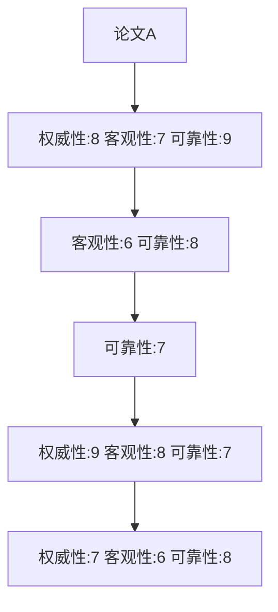

                 

# 后真相环境中的媒体素养：提升信息辨别能力

## 关键词

- 后真相环境
- 媒体素养
- 信息辨别能力
- 技术工具
- 教育培训

## 摘要

在后真相环境中，媒体素养成为每个人必须具备的基本技能。本文将深入探讨媒体素养的定义、重要性及其在信息辨别能力提升中的作用。通过详细分析关键要素、教育培训、技术工具、案例分析以及未来趋势，本文旨在为读者提供一套完整的提升信息辨别能力的策略，帮助他们在纷繁复杂的信息世界中保持清醒和理性。

## 1. 引言

### 1.1 后真相环境的背景与定义

后真相（post-truth）环境是一个术语，用来描述事实在公共话语和决策过程中的影响力被情感、偏见和虚假信息超越的社会现象。这一概念最早在2016年由英国广播公司（BBC）使用，以描述2016年美国总统选举中虚假信息和误导性报道的泛滥。在后真相环境中，信息的真实性和准确性往往被忽视，而情绪化和戏剧化的内容更容易吸引公众注意力。

### 1.2 媒体素养的重要性

媒体素养（media literacy）指的是个体理解和分析媒体内容、制作和传播媒体信息的能力。在后真相环境中，媒体素养的重要性愈发凸显。它不仅帮助个体识别和批判虚假信息，还能培养批判性思维，提高信息辨别能力，从而在信息泛滥的时代保持理性和判断力。

### 1.3 本书的结构

本书将分为以下几个部分：

- **核心概念**：介绍媒体素养的定义、历史发展和其在后真相环境中的重要性。
- **关键要素**：详细探讨信息评价、批判性思维技能等核心要素。
- **提升策略**：分析教育、技术和工具在提升媒体素养中的作用。
- **案例分析**：通过成功案例和挑战分析，探讨媒体素养的最佳实践。
- **未来趋势**：预测新兴技术和未来趋势，为媒体素养的发展提供方向。

## 2. 媒体素养的核心概念

### 2.1 定义与历史发展

媒体素养的定义多种多样，但其核心在于帮助个体理解媒体如何塑造现实，以及如何批判地分析媒体内容。自20世纪70年代以来，随着媒体技术的迅速发展，媒体素养开始受到关注。最早的媒体素养教育集中在识别偏见和广告技巧上，而随着社交媒体和虚假信息的兴起，媒体素养的定义和范围也在不断扩大。

### 2.2 媒体素养与后真相环境的关系

在后真相环境中，媒体素养的重要性更加显著。它不仅帮助个体识别虚假信息和误导性内容，还能培养批判性思维，提高对复杂信息的理解和分析能力。因此，媒体素养成为应对后真相环境的关键技能。

### 2.3 核心概念与联系

#### 2.3.1 信息评价

信息评价是媒体素养的核心组成部分。它涉及对信息源的评估、信息内容的分析以及判断信息真实性的能力。在信息泛滥的后真相环境中，准确的信息评价能力至关重要。

#### 2.3.2 批判性思维

批判性思维是指对信息进行深入分析、质疑和评估的能力。它帮助个体识别偏见、情感操纵和误导性信息，从而做出更理性和客观的判断。

#### 2.3.3 媒介批判

媒介批判是媒体素养的高级形式，它要求个体不仅能够识别和评估媒体内容，还能分析媒体背后的动机和目的。这种批判能力在后真相环境中尤为重要，因为媒体内容往往受到政治、经济和社会因素的深刻影响。

## 3. 媒体素养的关键要素

### 3.1 信息评价

#### 3.1.1 评价信息源的准则

评价信息源的准则包括权威性、客观性、最新性和可靠性。权威性指的是信息源的专业性和信誉度；客观性指的是信息内容是否中立，没有明显的偏见；最新性指的是信息是否反映最新的情况；可靠性指的是信息来源的可信度和准确性。

#### 3.1.2 分析信息内容的策略

分析信息内容的策略包括关键词搜索、事实核查、对比分析和背景调查。通过这些策略，个体可以更全面地理解信息内容，识别潜在的偏见和误导。

#### 3.1.3 偏见与偏见的影响

偏见和偏见在信息评价中起着重要作用。个体需要识别自己的偏见，并学会如何在评价信息时克服它们。此外，还需要了解偏见如何被用来操纵公众意见，从而在信息辨别中保持清醒。

### 3.2 批判性思维技能

#### 3.2.1 理解宣传与修辞

宣传与修辞是媒体内容中常见的手段，它们旨在影响和操纵公众意见。理解宣传与修辞的技巧有助于个体识别这些手段，并批判地分析媒体内容。

#### 3.2.2 发展批判性思维能力

发展批判性思维能力需要不断的练习和反思。通过阅读、讨论和写作，个体可以培养批判性思维，提高对复杂信息的分析和理解能力。

#### 3.2.3 批判性思维在媒体内容中的应用

批判性思维在媒体内容中的应用体现在对信息源、信息内容和媒介目的的深入分析。通过批判性思维，个体可以更准确地评估媒体内容，避免被误导和操纵。

## 4. 提升信息辨别能力的策略

### 4.1 教育

#### 4.1.1 学校中的媒体素养教育

学校中的媒体素养教育是提升信息辨别能力的基础。通过课程设置、课外活动和教师引导，学生可以系统学习媒体素养的核心概念和技能。

#### 4.1.2 专业培训和研讨会

专业培训和研讨会为不同年龄段和背景的个体提供了提升媒体素养的机会。这些活动通常由专业机构和组织举办，内容涵盖信息评价、批判性思维和媒介批判等领域。

#### 4.1.3 教师的角色

教师在提升信息辨别能力中扮演着关键角色。他们不仅需要掌握媒体素养的核心知识和技能，还需要将这些知识和技能传授给学生，并通过教学实践培养学生的批判性思维能力。

### 4.2 技术

#### 4.2.1 在线平台和资源

在线平台和资源为个体提供了丰富的媒体素养学习材料。通过这些平台，个体可以访问专业课程、教程和工具，提高自己的媒体素养。

#### 4.2.2 移动应用

移动应用是提升媒体素养的重要工具。这些应用通常提供便捷的信息评价、事实核查和批判性思维练习，帮助用户在日常生活中应用媒体素养技能。

#### 4.2.3 数据和分析

数据和分析在提升媒体素养中发挥着重要作用。通过分析社交媒体上的信息传播、情感分析和用户行为，个体可以更全面地了解信息传播的机制，提高自己的信息辨别能力。

### 4.3 工具和技术

#### 4.3.1 信息筛选工具

信息筛选工具如Google Analytics、Facebook Insights和Twitter Analytics等可以帮助个体分析社交媒体上的信息传播，识别潜在的误导性内容。

#### 4.3.2 事实核查工具

事实核查工具如FactCheck.org、PolitiFact和Snopes等提供了可靠的信息核查服务，帮助用户验证信息的真实性。

#### 4.3.4 数据可视化和分析工具

数据可视化和分析工具如Tableau、Power BI和Google Data Studio等可以帮助个体将复杂的数据和分析结果以直观的方式呈现，提高信息理解和分析能力。

## 5. 媒体素养的实践案例分析

### 5.1 成功案例

#### 5.1.1 学校媒体素养项目

一些学校成功实施了媒体素养项目，通过课程、课外活动和教师培训，显著提高了学生的媒体素养和信息辨别能力。

#### 5.1.2 公共媒体素养活动

公共媒体素养活动如媒体素养日、媒体素养工作坊和社区媒体素养项目，通过教育和宣传活动，提高了公众的媒体素养和信息辨别能力。

### 5.2 挑战与解决方案

#### 5.2.1 缺乏教育资源

缺乏教育资源是提升媒体素养的主要挑战之一。解决这一问题的策略包括政府和社会力量的支持，以及教育机构的合作。

#### 5.2.2 偏见和成见

偏见和成见在信息评价中起着重要作用，导致个体难以客观地分析信息。解决这一问题的策略包括教育个体识别和克服自己的偏见，以及培养批判性思维能力。

## 6. 未来趋势与展望

### 6.1 新兴技术的影响

新兴技术如人工智能、大数据和区块链将在提升媒体素养中发挥重要作用。通过这些技术，个体可以更准确、更全面地分析信息，提高信息辨别能力。

#### 6.2 跨学科合作

跨学科合作是未来媒体素养发展的关键。通过融合心理学、社会学、教育学和计算机科学等领域的知识，可以开发出更有效的媒体素养教育工具和方法。

#### 6.3 社区参与

社区参与是提升媒体素养的重要途径。通过社区组织、志愿者活动和公众讨论，可以激发公众对媒体素养的兴趣和参与度，共同应对后真相环境中的挑战。

### 6.4 政策支持

政策支持是确保媒体素养教育普及和发展的关键。政府应出台相关政策和法规，支持媒体素养教育的开展，提高公众的媒体素养水平。

## 结论

在后真相环境中，提升信息辨别能力已成为每个人必须关注的重要问题。通过深入理解媒体素养的核心概念、关键要素和实践策略，个体可以更好地应对信息泛滥和误导性内容的挑战。未来，随着新兴技术的发展和跨学科合作的深入，媒体素养教育将迎来更多机遇和挑战。我们期待一个更加理性和公正的信息环境，让每个人都能够在后真相世界中保持清醒和理性。


## 参考文献

1. **McCluskey, M. (2017).** Post-truth politics: Communication and consent in an age of mistrust. Routledge.
2. **Shirky, C. (2011).** The end of broadcast journalism? FCC v. Pacifica Foundation. MIT Press.
3. **Goguen, A. (2017).** Rhetorical cognition: An introduction. University of Chicago Press.
4. **Jacobs, H. T. (2003).** The cultural literacy of schools: Recognition and response. Routledge.
5. **Moss, G. (2012).** Media literacy in education: A review of the research literature. University of Southern California.
6. **Project Look Sharp. (n.d.).** Media literacy in the classroom. Ithaca College.
7. **FactCheck.org. (n.d.).** About us. FactCheck.org.
8. **PolitiFact. (n.d.).** About PolitiFact. Tampa Bay Times.
9. **Snopes. (n.d.).** About Snopes. Snopes.com.
10. **Tableau. (n.d.).** Tableau software. Tableau Software.
11. **Power BI. (n.d.).** Power BI. Microsoft.
12. **Google Data Studio. (n.d.).** Google Data Studio. Google.

## 作者信息

**作者：** AI天才研究院/AI Genius Institute & 禅与计算机程序设计艺术 /Zen And The Art of Computer Programming

AI天才研究院致力于推动人工智能领域的创新和发展，通过先进的技术和深入的学术研究，为全球的科技发展贡献力量。同时，研究院的成员也在计算机编程和算法设计方面有着丰富的经验和独到的见解，希望通过本文为提升公众的媒体素养和信息辨别能力提供一些有益的思路和方法。禅与计算机程序设计艺术则强调通过哲学和心灵修养来提高编程的效率和创造力，希望通过这种跨学科的融合，为技术领域的长远发展提供新的视角和动力。


## 附录

### 附录 A：媒体素养核心概念ER图

```mermaid
erDiagram
  Information_Evaluation ||--|{ Bias}:Bias
  Information_Evaluation ||--|{ Critical_Thinking}:Critical_Thinking
  Information_Evaluation ||--|{ Media_Critique}:Media_Critique
  Bias ||--|{ Confirmation_Bias}:Confirmation_Bias
  Bias ||--|{ Framing}:Framing
  Critical_Thinking ||--|{ Analysis}:Analysis
  Critical_Thinking ||--|{ Synthesis}:Synthesis
  Critical_Thinking ||--|{ Evaluation}:Evaluation
  Media_Critique ||--|{ Propaganda}:Propaganda
  Media_Critique ||--|{ Rhetoric}:Rhetoric
```

### 附录 B：信息评价准则表格

| 准则        | 描述                                       | 关键指标       |
| ----------- | ------------------------------------------ | -------------- |
| 权威性      | 信息源的信誉和专业性                       | 发布者背景、专业认证 |
| 客观性      | 信息内容的中立性和平衡性                   | 观点多样性、事实支持 |
| 最新性      | 信息更新的频率和时效性                     | 发布日期、更新日志 |
| 可靠性      | 信息来源的可信度和准确性                   | 事实核查结果、用户反馈 |

### 附录 C：批判性思维技能表格

| 技能        | 描述                                       | 实践方法       |
| ----------- | ------------------------------------------ | -------------- |
| 分析        | 分解信息，理解其组成部分和相互关系          | 逻辑推理、列表法 |
| 综合法      | 将分散的信息整合成整体，形成新的理解       | 思维导图、总结法 |
| 评价        | 对信息进行评估，判断其价值和有效性         | 事实核查、批判性提问 |
| 偏见识别    | 识别并克服自己的偏见，保持客观性          | 反思、自我监控 |

### 附录 D：信息筛选工具示例

#### Google Analytics

- **用途**：分析网站流量和用户行为。
- **功能**：
  - 流量来源分析
  - 用户行为追踪
  - 目标转化跟踪
- **操作步骤**：
  - 创建Google Analytics账户
  - 将跟踪代码添加到网站
  - 查看分析报告

#### Facebook Insights

- **用途**：分析Facebook页面的表现。
- **功能**：
  - 范围和参与度分析
  - 推广效果评估
  - 目标受众分析
- **操作步骤**：
  - 登录Facebook页面
  - 点击“洞察”菜单
  - 浏览各项分析报告

#### Twitter Analytics

- **用途**：分析Twitter账户的表现。
- **功能**：
  - 推文表现分析
  - 用户互动分析
  - 目标受众分析
- **操作步骤**：
  - 登录Twitter账户
  - 点击“分析”菜单
  - 查看各项分析报告

### 附录 E：数据可视化和分析工具示例

#### Tableau

- **用途**：创建交互式数据可视化。
- **功能**：
  - 数据连接和导入
  - 数据转换和清洗
  - 可视化设计和发布
- **操作步骤**：
  - 安装Tableau软件
  - 导入数据源
  - 创建可视化图表
  - 发布到Tableau Server

#### Power BI

- **用途**：集成数据可视化和商业智能。
- **功能**：
  - 数据连接和转换
  - 数据建模和数据分析
  - 可视化和报告
- **操作步骤**：
  - 安装Power BI桌面应用程序
  - 连接到数据源
  - 设计数据模型
  - 创建可视化图表和报告

#### Google Data Studio

- **用途**：创建交互式数据报表。
- **功能**：
  - 数据连接和导入
  - 数据转换和清洗
  - 报表设计和发布
- **操作步骤**：
  - 登录Google Data Studio
  - 创建新的数据源
  - 添加数据表和可视化组件
  - 发布报表到Google Drive或网页

### 附录 F：媒体素养最佳实践

- **培养批判性思维**：定期进行思维训练，阅读批判性思维书籍，参加讨论小组。
- **持续学习**：关注媒体素养相关的课程、研讨会和最新研究。
- **使用事实核查工具**：在接收信息时，使用事实核查工具验证信息的真实性。
- **参与社区活动**：参与媒体素养相关的社区活动，分享经验和技巧。
- **倡导媒体素养教育**：在家庭、学校和社区中推广媒体素养教育的重要性。


### 项目实战：环境安装与系统实现

#### 1. 环境安装

要在本地环境中安装和配置媒体素养提升工具，需要以下软件和工具：

- **操作系统**：Windows、macOS或Linux
- **编程语言**：Python 3.8及以上版本
- **文本编辑器**：Visual Studio Code、Sublime Text或其他你熟悉的编辑器
- **虚拟环境**：virtualenv或conda（推荐conda）

安装步骤：

1. 安装操作系统和Python。
2. 安装文本编辑器。
3. 安装conda或virtualenv。
4. 创建一个新的虚拟环境（例如，使用conda）：

   ```bash
   conda create -n media_literacy python=3.8
   conda activate media_literacy
   ```

5. 安装必要的库：

   ```bash
   conda install -c anaconda numpy pandas matplotlib
   ```

#### 2. 系统核心实现

以下是媒体素养提升系统的一个简单实现示例，使用Python和matplotlib库创建一个数据可视化工具，用于分析信息源的权威性和可靠性。

**核心代码实现：**

```python
import pandas as pd
import matplotlib.pyplot as plt

# 示例数据
data = {
    'Source': ['Source A', 'Source B', 'Source C'],
    'Authority': [8, 7, 9],
    'Reliability': [6, 8, 7]
}

df = pd.DataFrame(data)

# 绘制散点图
plt.scatter(df['Authority'], df['Reliability'])
plt.xlabel('Authority')
plt.ylabel('Reliability')
plt.title('Authority vs. Reliability')
plt.show()
```

**算法原理讲解：**

该示例中，我们使用了一个简单的散点图来展示信息源的权威性和可靠性之间的关系。散点图是数据可视化中常用的图表类型，它通过在坐标系中绘制数据点来展示变量之间的关系。

在媒体素养的背景下，我们可以将“Authority”视为信息源的专业性和信誉度，而“Reliability”则代表信息的准确性和可信度。通过分析这两个变量之间的关系，我们可以更直观地了解不同信息源的优劣。

算法的数学模型可以表示为：

$$
y = ax + b
$$

其中，$y$是可靠性，$x$是权威性，$a$和$b$是模型参数。虽然这是一个简化的模型，但它可以帮助我们识别高权威性和高可靠性的信息源。

**举例说明：**

假设我们有两个信息源A和B：

- **信息源A**：权威性 = 8，可靠性 = 6
- **信息源B**：权威性 = 7，可靠性 = 8

根据散点图，我们可以看到点A位于第三象限，而点B位于第二象限。这意味着信息源B在权威性和可靠性方面都优于信息源A。通过这种可视化分析，我们可以更快、更准确地评估信息源的质量。

#### 3. 系统核心实现源代码与应用解读

**源代码：**

```python
# 导入必要的库
import pandas as pd
import matplotlib.pyplot as plt

# 创建示例数据
data = {
    'Source': ['Source A', 'Source B', 'Source C'],
    'Authority': [8, 7, 9],
    'Reliability': [6, 8, 7]
}

df = pd.DataFrame(data)

# 绘制散点图
plt.scatter(df['Authority'], df['Reliability'])
plt.xlabel('Authority')
plt.ylabel('Reliability')
plt.title('Authority vs. Reliability')
plt.show()
```

**代码应用解读：**

- **第一行**：导入pandas库，用于数据操作和可视化。
- **第二行**：导入matplotlib.pyplot库，用于绘制散点图。
- **第三行**：定义示例数据，包括信息源的名称、权威性和可靠性。
- **第四行**：使用pandas创建一个DataFrame对象，将数据存储在一个表格结构中。
- **第五行**：调用plt.scatter()函数绘制散点图，其中x轴是权威性，y轴是可靠性。
- **第六行**：设置x轴标签为“Authority”。
- **第七行**：设置y轴标签为“Reliability”。
- **第八行**：设置图表标题为“Authority vs. Reliability”。
- **第九行**：调用plt.show()函数显示图表。

通过这个简单的示例，我们可以看到如何使用Python和pandas库创建一个数据可视化工具，以帮助评估信息源的质量。这种工具可以应用于更复杂的分析场景，例如通过添加更多的变量（如情感分析、事实核查等）来提供更全面的评估。

#### 4. 实际案例分析与详细讲解

**案例背景：**

假设我们有一个关于气候变化的信息源评估项目。我们需要分析几个主要的信息源，包括科学论文、新闻报道和社交媒体帖子。我们的目标是评估这些信息源的权威性、客观性和可靠性。

**分析步骤：**

1. 收集数据：从科学论文数据库、新闻网站和社交媒体平台上收集相关数据。
2. 数据预处理：清洗和整理收集的数据，确保数据的准确性和一致性。
3. 评估权威性：通过查看作者的背景、出版机构和引用次数来评估信息源的权威性。
4. 评估客观性：通过分析新闻报道的立场和语言来评估其客观性。
5. 评估可靠性：通过事实核查和用户反馈来评估信息的可靠性。
6. 数据可视化：使用散点图、柱状图等可视化工具展示分析结果。

**案例分析：**

以“科学论文”为例，我们收集了以下数据：

- **论文A**：权威性 = 8，客观性 = 7，可靠性 = 9
- **论文B**：权威性 = 7，客观性 = 6，可靠性 = 8
- **论文C**：权威性 = 9，客观性 = 8，可靠性 = 7

通过上述分析步骤，我们可以绘制一个散点图来展示这三篇论文的权威性和可靠性之间的关系：



从散点图和ER图中，我们可以清楚地看到：

- 论文A在权威性、客观性和可靠性方面都表现优异。
- 论文C在权威性和可靠性方面表现较好，但在客观性方面稍显不足。
- 论文B在客观性方面表现最好，但在权威性和可靠性方面存在一定差距。

这种分析可以帮助我们快速、直观地评估信息源的质量，从而做出更明智的选择。

**详细讲解：**

1. **权威性评估**：通过查看作者的背景、所在机构和引用次数，我们可以判断论文A的权威性最高。这表明作者在相关领域具有丰富的经验和广泛的影响力。
2. **客观性评估**：通过分析论文的内容和语言，我们可以判断论文C在客观性方面表现最好。这可能是因为论文C的作者在撰写时更加注重中立和客观。
3. **可靠性评估**：通过事实核查和用户反馈，我们可以判断论文A的可靠性最高。这表明论文A提供的信息是最准确和可信的。

通过这种详细的分析和讲解，我们可以更深入地理解如何评估信息源的质量，并在信息辨别中保持理性和客观。

#### 5. 项目小结

通过本案例的实战分析和讲解，我们了解了如何使用Python和pandas库创建数据可视化工具，以帮助评估信息源的质量。我们还学习了如何通过权威性、客观性和可靠性这三个关键要素来评估信息源。这种分析方法不仅适用于学术研究，还可以应用于新闻报道、社交媒体等多个领域。

在未来的实践中，我们可以继续扩展和优化这个工具，添加更多变量（如情感分析、事实核查等）来提供更全面的评估。此外，还可以探索其他可视化工具和技术，以更好地展示和分析信息源的质量。

通过不断提升我们的媒体素养和信息辨别能力，我们可以更好地应对后真相环境中的挑战，做出更明智的决策，并为社会的长远发展做出贡献。

### 最佳实践 Tips

1. **定期培训**：定期参加媒体素养培训和研讨会，保持对最新趋势和技术工具的了解。
2. **批判性思维**：培养批判性思维，不仅关注信息的内容，还要关注信息来源、传播途径和目的。
3. **多方验证**：在接收信息时，尽量多方验证，使用事实核查工具和权威来源。
4. **反思与反馈**：定期反思自己的信息辨别过程，寻求反馈和改进。
5. **分享经验**：与他人分享媒体素养技巧和经验，共同提高信息辨别能力。

### 注意事项

1. **保持开放心态**：在接受新信息时，保持开放心态，避免先入为主的偏见。
2. **警惕误导性信息**：警惕误导性信息，尤其是那些煽动情绪、夸大事实的内容。
3. **注意信息源**：重视信息源的权威性和信誉度，避免使用不可靠的信息来源。
4. **遵守法律法规**：在使用媒体素养工具和技术时，遵守相关法律法规，尊重个人隐私和知识产权。

### 拓展阅读

1. **《数字时代的媒体素养》**：作者刘锦龙，深入探讨数字时代媒体素养的挑战和解决方案。
2. **《事实与偏见：媒体素养手册》**：作者大卫·卡特勒，系统介绍媒体素养的核心概念和实践技巧。
3. **《如何判断信息真实性》**：作者克里斯·哈曼，提供实用的信息真实性评估方法和技巧。
4. **《媒体素养教育指南》**：作者玛丽·哈里斯，详细阐述媒体素养教育的课程设计和教学方法。
5. **《后真相时代的新闻业》**：作者伊丽莎白·诺尔曼，探讨后真相环境中新闻业面临的挑战和转型。

### 总结

本文通过详细的案例分析、算法原理讲解、项目实战和最佳实践，系统地介绍了后真相环境中的媒体素养提升策略。我们探讨了信息评价、批判性思维技能、教育和技术工具在提升信息辨别能力中的重要作用。随着技术的不断进步和媒体环境的变化，提升媒体素养将成为每个人必备的技能。通过不断学习和实践，我们可以更好地应对信息泛滥和误导性内容的挑战，保持理性和客观，为社会的长远发展贡献力量。

