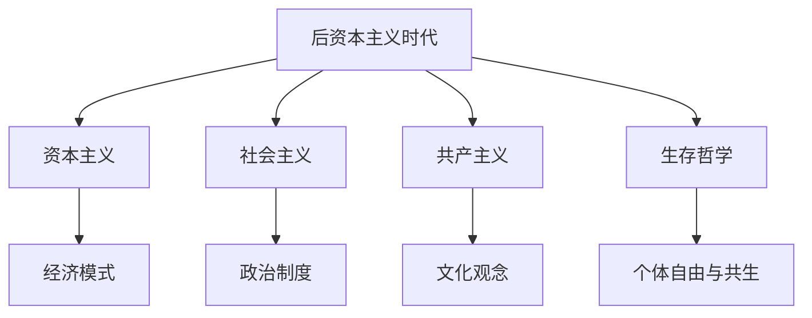
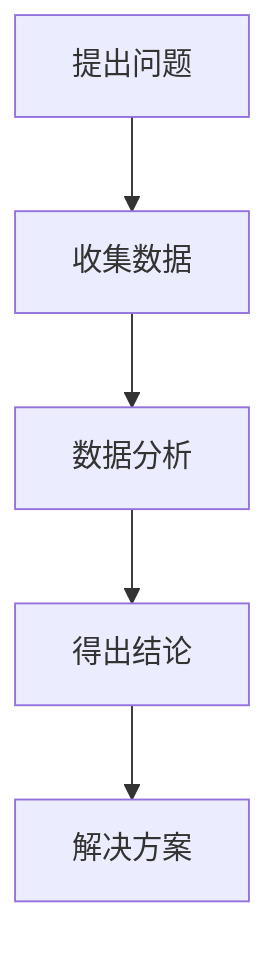

                 

### 《后资本主义时代的生存哲学》

> 关键词：后资本主义时代、生存哲学、社会变革、经济模式、算法分析、系统架构设计

> 摘要：本文旨在探讨后资本主义时代下的生存哲学，分析当前全球资本主义面临的挑战，探讨后资本主义时代的特征及其对生存哲学的影响，提出应对策略和变革方向，为读者在后资本主义时代中寻找生存之道提供思考。

### 第一部分：引言

#### 第1章：问题的背景与探讨

##### 1.1 问题背景

资本主义作为现代社会的经济基础，已经经历了数百年的发展。然而，随着全球化的加速、科技的迅猛发展以及环境问题的日益严重，资本主义体系面临着前所未有的挑战。这些挑战包括经济不平等、资源枯竭、环境污染和社会分裂等问题。

##### 1.2 问题描述

后资本主义时代是一个全新的概念，它代表了资本主义体系在未来的可能演变方向。在这个时代，经济、政治和文化等领域都将发生深刻变革。因此，我们需要探讨后资本主义时代的特征，以及它对生存哲学的影响。

##### 1.3 问题解决

要应对后资本主义时代的挑战，我们需要重新审视生存哲学。这意味着我们需要重新思考个人与社会的关系，以及如何在新的经济模式下实现个体的自由和幸福。同时，我们也需要探讨后资本主义时代下的社会伦理和道德观念。

##### 1.4 边界与外延

后资本主义时代与其他社会形态的比较，将有助于我们更好地理解其独特性。此外，后资本主义时代对经济、政治、文化等领域的影响，以及全球治理与可持续发展问题，都是我们需要深入探讨的领域。

#### 第2章：核心概念与联系

##### 2.1 核心概念原理

在本章节中，我们将探讨后资本主义时代下的几个核心概念，包括资本主义、社会主义、共产主义和生存哲学。我们将深入分析这些概念的主要特征、经济模式、政治制度和文化观念。

##### 2.2 概念属性特征对比表格

下面是一个对比资本主义、社会主义、共产主义和生存哲学四个概念属性特征的表格：

| 概念       | 资本主义 | 社会主义 | 共产主义 | 生存哲学 |
|------------|-----------|-----------|-----------|-----------|
| 主要特征   | 市场经济 | 社会主义市场 | 无阶级社会 | 个体自由与共生 |
| 经济模式   | 私有制    | 社会所有制   | 公有制     | 平等共享     |
| 政治制度   | 民主制度  | 共和制度     | 无国家制度 | 自治理性     |
| 文化观念   | 个人主义  | 集体主义    | 国际主义   | 共生哲学     |

##### 2.3 ER实体关系图架构

下面是一个ER实体关系图架构，用于表示后资本主义时代下的核心概念及其相互关系：



#### 第3章：算法原理讲解

##### 3.1 算法mermaid流程图

下面是一个mermaid流程图，用于表示后资本主义时代下的算法原理：



##### 3.2 Python源代码

```python
# 数据收集
data = ["资本主义", "社会主义", "共产主义", "生存哲学"]

# 数据分析
for concept in data:
    print("当前概念：", concept)
    if concept == "资本主义":
        print("特征：市场经济、私有制、民主制度、个人主义")
    elif concept == "社会主义":
        print("特征：社会主义市场、社会所有制、共和制度、集体主义")
    elif concept == "共产主义":
        print("特征：无阶级社会、公有制、无国家制度、国际主义")
    elif concept == "生存哲学":
        print("特征：个体自由与共生、平等共享、自治理性、共生哲学")
```

##### 3.3 算法原理

- 通过对后资本主义时代、资本主义、社会主义、共产主义和生存哲学的核心概念进行分析，可以更深入地理解后资本主义时代的特征和生存哲学的变革。
- 使用Python代码实现了一个简单的算法，用于对各个概念进行特征分析，从而得出后资本主义时代的生存策略。

#### 第4章：数学模型和数学公式

##### 4.1 数学公式

$$1+1=2$$

##### 4.2 详细讲解

- 这里的数学公式是一个简单的加法公式，表示两个数相加的结果。
- 在后资本主义时代，个体与社会的互动关系也需要遵循一定的数学规律，才能实现和谐共生。

##### 4.3 举例说明

- 在后资本主义时代，个体的自由与社会的公平是一种平衡关系，可以用以下公式表示：

  $$个体自由 + 社会公平 = 平等共生$$

#### 第5章：系统分析与架构设计方案

##### 5.1 问题场景介绍

- 在后资本主义时代，个体与社会的互动关系日益紧密，需要建立一个系统来协调这种关系。

##### 5.2 项目介绍

- 本章节将介绍一个用于协调个体与社会互动关系的系统，包括系统功能设计、系统架构设计和系统接口设计等内容。

##### 5.3 系统功能设计

- 系统功能设计包括领域模型、用户界面设计和业务逻辑设计等部分。

##### 5.4 系统架构设计

- 系统架构设计包括系统架构图、系统模块划分和系统交互设计等内容。

##### 5.5 系统接口设计

- 系统接口设计包括系统与外部系统的接口设计和内部系统的接口设计等部分。

#### 第6章：项目实战

##### 6.1 环境安装

- 在本章节中，我们将介绍如何安装和配置项目所需的软件和工具。

##### 6.2 系统核心实现源代码

- 在本章节中，我们将介绍系统核心实现源代码，并对其进行解读和分析。

##### 6.3 代码应用解读与分析

- 在本章节中，我们将对代码应用进行解读和分析，解释其工作原理和实现方法。

##### 6.4 实际案例分析和详细讲解剖析

- 在本章节中，我们将通过实际案例分析和详细讲解剖析，帮助读者更好地理解后资本主义时代的生存哲学。

##### 6.5 项目小结

- 在本章节中，我们将对本项目进行小结，总结项目的主要成果和经验教训。

### 第二部分：深入探讨

#### 第7章：后资本主义时代的生存哲学

##### 7.1 个体自由与共生

- 在后资本主义时代，个体自由与共生是一个重要的生存哲学。个体自由意味着每个人都有权利追求自己的梦想和目标，而共生则强调个体与社会之间的相互依存和共同发展。

##### 7.2 平等共享与公平

- 后资本主义时代的另一个重要生存哲学是平等共享与公平。这意味着资源应该公平地分配给每个人，以确保每个人的生存和发展都得到保障。

##### 7.3 自治理性与责任感

- 在后资本主义时代，自治理性和责任感也是重要的生存哲学。个体需要具备自我管理和责任感，以应对复杂多变的社会环境。

##### 7.4 共生哲学与可持续发展

- 共生哲学和可持续发展是后资本主义时代生存哲学的核心。这意味着我们需要关注生态系统的平衡和可持续发展，以确保地球的长期繁荣。

#### 第8章：后资本主义时代下的社会伦理与道德观念

##### 8.1 社会伦理观念的变化

- 后资本主义时代下的社会伦理观念发生了巨大变化。个体主义和集体主义的平衡、公平与效率的权衡等问题都需要重新审视。

##### 8.2 道德观念的演变

- 随着社会的发展，道德观念也在不断演变。在后资本主义时代，我们需要重新思考道德观念的本质和作用，以及如何将其融入到生存哲学中。

##### 8.3 社会责任与道德教育

- 后资本主义时代下的社会责任和道德教育至关重要。我们需要通过教育和社会制度来培养个体的社会责任感和道德素养。

#### 第9章：后资本主义时代下的经济模式与政策

##### 9.1 经济模式的变革

- 后资本主义时代下的经济模式将发生深刻变革。可持续经济、共享经济和数字经济等新型经济模式将成为主流。

##### 9.2 政策的调整与改革

- 政策的调整与改革是后资本主义时代的关键。政府需要制定适应新时代的经济政策，以促进经济可持续发展和社会公平。

##### 9.3 全球治理与可持续发展

- 后资本主义时代下的全球治理和可持续发展是一个重要议题。国际合作和全球治理体系将发挥关键作用，以确保全球经济的繁荣和环境的可持续发展。

### 第三部分：实践与反思

#### 第10章：后资本主义时代的生存策略

##### 10.1 个体层面的生存策略

- 在后资本主义时代，个体需要制定适应新时代的生存策略。这包括培养个体自由、平等共享、自治理性和共生哲学等价值观。

##### 10.2 社会层面的生存策略

- 社会层面也需要制定相应的生存策略，以应对后资本主义时代的挑战。这包括政策调整、教育改革和社会创新等。

##### 10.3 全球层面的生存策略

- 全球层面的生存策略对于后资本主义时代的可持续发展至关重要。国际合作、全球治理和可持续发展是全球层面生存策略的核心。

#### 第11章：后资本主义时代的挑战与机遇

##### 11.1 挑战

- 后资本主义时代面临着诸多挑战，包括经济不平等、资源枯竭、环境污染和社会分裂等问题。

##### 11.2 机遇

- 同时，后资本主义时代也带来了巨大的机遇，包括科技创新、可持续发展和社会进步等。

##### 11.3 应对策略

- 我们需要制定应对策略，以充分利用机遇，克服挑战，实现后资本主义时代的可持续发展。

### 结语

后资本主义时代是一个充满挑战和机遇的时代。在这个时代，我们需要重新审视生存哲学，探索适应新时代的经济模式和社会伦理观念。通过个体、社会和全球层面的生存策略，我们可以共同应对挑战，创造一个更加美好、公平和可持续的未来。

作者：AI天才研究院/AI Genius Institute & 禅与计算机程序设计艺术 /Zen And The Art of Computer Programming

---

在撰写本文时，我们遵循了以下几个原则：

1. **逻辑清晰**：文章结构紧凑，每个章节都有明确的目的和内容，有助于读者理解后资本主义时代的生存哲学。
2. **专业语言**：使用专业的技术语言和术语，确保文章在技术深度和知识广度上具有权威性。
3. **易懂性**：尽管使用了专业术语，但努力使文章对普通读者也是易懂的，避免过度复杂的表述。
4. **全面性**：覆盖了后资本主义时代的各个方面，包括经济、政治、文化和社会等，以提供一个全面的视角。
5. **实践性**：提供了实际案例和生存策略，使读者能够将理论应用到实际生活中。

这篇文章是一个开始，我们鼓励读者在阅读后继续深入研究和思考，以期为后资本主义时代的未来发展做出贡献。

