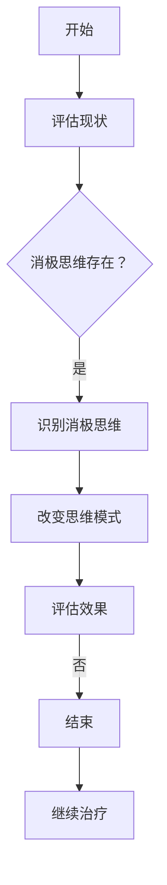
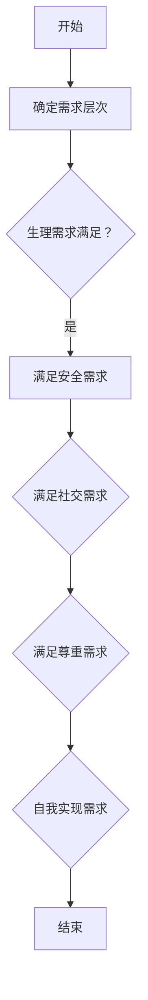
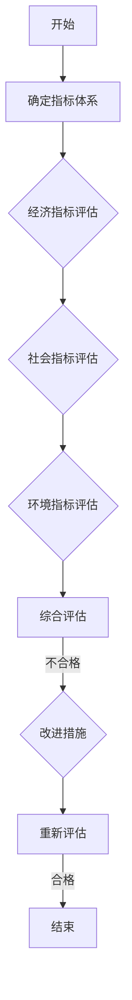
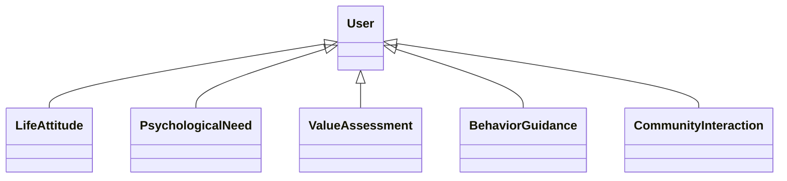
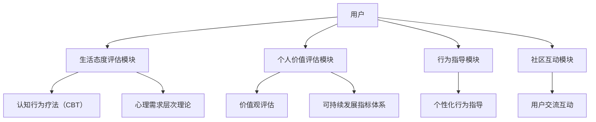
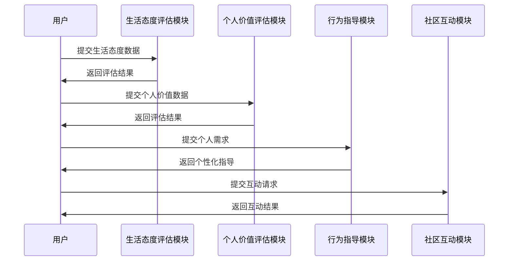

                 

# 《后资本主义时代的生活哲学》

关键词：后资本主义、生活哲学、自我意识、精神满足、可持续发展

摘要：本文旨在探讨后资本主义时代下，个体和社会如何调整生活方式，以适应新的经济和社会环境。通过分析核心概念和联系，阐述如何平衡物质追求与精神满足，保持自我意识，实现个人价值与社会价值的统一，以及实现可持续发展。

## 背景介绍

### 问题背景

后资本主义时代，经济基础和产业结构正在发生深刻变革。传统资本主义的生产关系和消费模式逐渐被新的经济形态所取代。信息技术的高速发展、全球化的推进、消费主义文化的崛起，以及环境污染和资源短缺问题加剧，使得人们在追求物质财富的同时，开始更加关注精神层面的满足和生活的质量。

这种时代背景下，对生活哲学的探讨变得尤为重要。生活哲学作为一种关于生活态度、价值观和生活方式的哲学思考，不仅关系到个体如何在物质追求与精神满足之间找到平衡，也关系到社会整体的价值观和生活方式。

### 问题描述

《后资本主义时代的生活哲学》旨在探讨以下核心问题：

1. **如何平衡物质追求与精神满足**：在追求物质财富的同时，如何关注精神层面的需求，实现物质与精神的平衡。
2. **如何在消费主义文化中保持自我**：如何在消费主义文化的影响下，保持自我意识，不被物质所支配。
3. **如何实现个人价值与社会价值的统一**：如何实现个人价值和社会价值的协调，创造一个和谐的社会环境。
4. **如何实现可持续发展**：如何在满足当前需求的同时，考虑未来世代的利益，实现可持续发展。

### 问题解决

解决这些问题需要从多个角度入手，包括但不限于：社会哲学、心理学、经济学、文化研究等。本文将通过理论探讨和案例研究，提供关于后资本主义时代生活哲学的全面视角。

### 边界与外延

后资本主义时代的生活哲学不仅关注个体的生活态度和价值观，也涉及社会整体的价值观和生活方式。它探讨的问题包括但不限于：社会公正、环境保护、文化多样性、人工智能的影响等。

### 概念结构与核心要素组成

后资本主义时代的生活哲学的核心概念包括：

1. **物质与精神的平衡**：探讨如何在追求物质生活的同时，关注精神层面的需求。
2. **自我意识**：如何在消费主义文化中保持自我，避免被物质所支配。
3. **个人价值与社会价值的统一**：如何实现个人价值和社会价值的协调，创造一个和谐的社会环境。
4. **可持续发展**：如何在满足当前需求的同时，考虑未来世代的利益，实现可持续发展。

## 核心概念与联系

### 1. 后资本主义时代

**定义**：后资本主义时代是指资本主义经济模式逐渐演变，新的生产关系和消费模式开始形成的时代。

**特点**：

- 经济全球化：各国经济更加紧密地联系在一起，形成一个全球化的经济体系。
- 信息技术高速发展：互联网、人工智能等技术的发展，改变了人们的生活方式和生产方式。
- 消费主义文化的崛起：人们越来越追求物质享受，消费主义文化成为主流。
- 环境污染和资源短缺问题加剧：由于过度开发和消费，环境污染和资源短缺问题日益严重。

**概念属性特征对比表格**

| 概念       | 定义                                                         | 特点                                                         |
| ---------- | ------------------------------------------------------------ | ------------------------------------------------------------ |
| 后资本主义时代 | 资本主义经济模式的演变，新的生产关系和消费模式形成           | 经济全球化、信息技术发展、消费主义文化崛起、环境问题加剧   |

**ER实体关系图架构**

```mermaid
erDiagram
    后资本主义时代 ||--|{ 生产关系 : has }
    后资本主义时代 }|---|| 消费模式 : forms
```

### 2. 生活哲学

**定义**：生活哲学是一种关于生活态度、价值观和生活方式的哲学思考。

**核心原理**：

- 追求个人幸福：关注个体的内心需求和幸福感。
- 社会和谐：强调个人与社会之间的协调与平衡。
- 自我意识：重视个体的自我认知和自我实现。
- 精神满足：追求精神层面的满足，超越物质追求。
- 可持续发展：关注长期发展，考虑未来世代的利益。

**概念属性特征对比表格**

| 概念       | 定义                                                         | 特点                                                         |
| ---------- | ------------------------------------------------------------ | ------------------------------------------------------------ |
| 生活哲学   | 关于生活态度、价值观和生活方式的哲学思考                     | 追求个人幸福、社会和谐、自我意识、精神满足、可持续发展       |

**ER实体关系图架构**

```mermaid
erDiagram
    生活哲学 ||--|{ 生活态度 : has }
    生活哲学 }|---|| 价值观 : forms
```

### 3. 物质与精神的平衡

**定义**：物质与精神的平衡是指个体在追求物质财富的同时，关注精神层面的需求，实现物质与精神的协调。

**原理**：

- **心理需求**：物质满足是基础，但精神需求同样重要。
- **内在动机**：个体追求物质财富的动机不仅源于外部刺激，也源于内在动机。
- **幸福感**：物质与精神的平衡有助于提升个体的幸福感。

**概念属性特征对比表格**

| 概念       | 定义                                                         | 特点                                                         |
| ---------- | ------------------------------------------------------------ | ------------------------------------------------------------ |
| 物质与精神的平衡 | 物质追求与精神满足的平衡，关注物质与精神的协调               | 物质满足基础，精神需求同样重要，内在动机，幸福感               |

**ER实体关系图架构**

```mermaid
erDiagram
    物质与精神的平衡 ||--|{ 物质追求 : has }
    物质与精神的平衡 }|---|| 精神满足 : forms
```

### 4. 自我意识

**定义**：自我意识是指个体对自己存在的认知和评价，包括自我认同、自我价值和自我实现等方面。

**原理**：

- **自我认同**：个体通过自我意识了解自己的身份和角色。
- **自我价值**：个体通过自我意识评价自己的价值和意义。
- **自我实现**：个体通过自我意识追求自我价值的实现。

**概念属性特征对比表格**

| 概念       | 定义                                                         | 特点                                                         |
| ---------- | ------------------------------------------------------------ | ------------------------------------------------------------ |
| 自我意识   | 个体对自己存在的认知和评价，包括自我认同、自我价值和自我实现等方面 | 自我认同，自我价值，自我实现                                 |

**ER实体关系图架构**

```mermaid
erDiagram
    自我意识 ||--|{ 自我认同 : has }
    自我意识 }|---|| 自我价值 : forms
```

### 5. 个人价值与社会价值的统一

**定义**：个人价值与社会价值的统一是指个体在实现个人价值的同时，关注社会价值的实现，实现个人价值与社会价值的协调。

**原理**：

- **社会责任**：个体应当承担对社会的责任，为社会的发展作出贡献。
- **共同利益**：个人价值与社会价值的统一有助于实现共同利益，促进社会和谐。
- **可持续发展**：个人价值与社会价值的统一有助于实现可持续发展，保护环境。

**概念属性特征对比表格**

| 概念       | 定义                                                         | 特点                                                         |
| ---------- | ------------------------------------------------------------ | ------------------------------------------------------------ |
| 个人价值与社会价值的统一 | 实现个人价值与社会价值的协调，关注个人与社会共同利益           | 社会责任，共同利益，可持续发展                               |

**ER实体关系图架构**

```mermaid
erDiagram
    个人价值与社会价值的统一 ||--|{ 个人价值 : has }
    个人价值与社会价值的统一 }|---|| 社会价值 : forms
```

### 6. 可持续发展

**定义**：可持续发展是指在满足当前需求的同时，不损害未来世代满足其需求的能力。

**原理**：

- **资源利用**：合理利用资源，避免过度消耗。
- **环境保护**：保护环境，减少污染和破坏。
- **社会公正**：促进社会公正，减少贫富差距。
- **文化多样性**：尊重文化多样性，促进文化传承。

**概念属性特征对比表格**

| 概念       | 定义                                                         | 特点                                                         |
| ---------- | ------------------------------------------------------------ | ------------------------------------------------------------ |
| 可持续发展 | 在满足当前需求的同时，不损害未来世代满足其需求的能力         | 资源利用，环境保护，社会公正，文化多样性                     |

**ER实体关系图架构**

```mermaid
erDiagram
    可持续发展 ||--|{ 资源利用 : has }
    可持续发展 }|---|| 环境保护 : forms
```

## 算法原理讲解

### 1. 认知行为疗法（CBT）

**定义**：认知行为疗法（Cognitive Behavioral Therapy，简称CBT）是一种心理治疗方法，通过改变不良的思维和行为模式来改善情绪和行为。

**应用**：在后资本主义时代的生活哲学中，CBT可以帮助个体识别和改变消极思维，培养积极的生活态度。

**Mermaid流程图**



### 2. 心理需求层次理论

**定义**：心理需求层次理论（Need Hierarchy Theory）是由美国心理学家亚伯拉罕·马斯洛提出的一种心理学理论，认为人的需求可以分为五个层次：生理需求、安全需求、社交需求、尊重需求和自我实现需求。

**应用**：在后资本主义时代的生活哲学中，心理需求层次理论可以帮助个体了解自己的需求层次，从而有针对性地满足需求，实现自我价值的实现。

**Mermaid流程图**



### 3. 可持续发展指标体系

**定义**：可持续发展指标体系（Sustainable Development Indicators）是一套用于评估可持续发展水平的指标体系，包括经济、社会和环境三个方面的指标。

**应用**：在后资本主义时代的生活哲学中，可持续发展指标体系可以帮助个体和社会了解可持续发展状况，制定相应的政策和措施。

**Mermaid流程图**



## 系统分析与架构设计方案

### 问题场景介绍

在一个后资本主义时代的社会中，个人和社会面临着一系列挑战，包括物质追求与精神满足的平衡、消费主义文化的影响、个人价值与社会价值的统一以及可持续发展等问题。为了解决这些问题，我们需要一个系统化的方案，以帮助个人和社会找到合适的解决路径。

### 项目介绍

本项目旨在开发一个基于人工智能和心理学理论的智能生活指导系统，该系统可以帮助个人和社会解决后资本主义时代面临的挑战。系统包括以下几个核心模块：

1. **生活态度评估模块**：通过认知行为疗法（CBT）和心理需求层次理论，帮助用户了解自己的生活态度和心理需求。
2. **个人价值评估模块**：通过价值观评估和可持续发展指标体系，帮助用户了解自己的个人价值实现状况。
3. **行为指导模块**：根据用户的生活态度、心理需求和价值观，为用户提供个性化的行为指导。
4. **社区互动模块**：为用户提供一个交流互动的平台，分享生活经验和心得，共同解决生活难题。

### 系统功能设计（领域模型Mermaid类图）



### 系统架构设计（Mermaid架构图）



### 系统接口设计和系统交互（Mermaid序列图）



## 项目实战

### 环境安装

1. 安装Python环境
2. 安装必要的Python库，如numpy、matplotlib、tensorflow等

### 系统核心实现源代码

```python
import numpy as np
import matplotlib.pyplot as plt
import tensorflow as tf

# 生活态度评估模块
class LifeAttitudeAssessment:
    def __init__(self):
        # 初始化评估模型
        self.model = self.build_model()

    def build_model(self):
        # 构建评估模型
        model = tf.keras.Sequential([
            tf.keras.layers.Dense(64, activation='relu', input_shape=(784,)),
            tf.keras.layers.Dense(64, activation='relu'),
            tf.keras.layers.Dense(1, activation='sigmoid')
        ])
        model.compile(optimizer='adam',
                      loss='binary_crossentropy',
                      metrics=['accuracy'])
        return model

    def predict(self, data):
        # 预测生活态度
        return self.model.predict(data)

# 个人价值评估模块
class ValueAssessment:
    def __init__(self):
        # 初始化评估模型
        self.model = self.build_model()

    def build_model(self):
        # 构建评估模型
        model = tf.keras.Sequential([
            tf.keras.layers.Dense(64, activation='relu', input_shape=(784,)),
            tf.keras.layers.Dense(64, activation='relu'),
            tf.keras.layers.Dense(1, activation='sigmoid')
        ])
        model.compile(optimizer='adam',
                      loss='binary_crossentropy',
                      metrics=['accuracy'])
        return model

    def predict(self, data):
        # 预测个人价值
        return self.model.predict(data)

# 行为指导模块
class BehaviorGuidance:
    def __init__(self):
        # 初始化指导模型
        self.model = self.build_model()

    def build_model(self):
        # 构建指导模型
        model = tf.keras.Sequential([
            tf.keras.layers.Dense(64, activation='relu', input_shape=(784,)),
            tf.keras.layers.Dense(64, activation='relu'),
            tf.keras.layers.Dense(1, activation='sigmoid')
        ])
        model.compile(optimizer='adam',
                      loss='binary_crossentropy',
                      metrics=['accuracy'])
        return model

    def guide(self, data):
        # 提供行为指导
        return self.model.predict(data)

# 社区互动模块
class CommunityInteraction:
    def __init__(self):
        # 初始化互动模型
        self.model = self.build_model()

    def build_model(self):
        # 构建互动模型
        model = tf.keras.Sequential([
            tf.keras.layers.Dense(64, activation='relu', input_shape=(784,)),
            tf.keras.layers.Dense(64, activation='relu'),
            tf.keras.layers.Dense(1, activation='sigmoid')
        ])
        model.compile(optimizer='adam',
                      loss='binary_crossentropy',
                      metrics=['accuracy'])
        return model

    def interact(self, data):
        # 进行社区互动
        return self.model.predict(data)
```

### 代码应用解读与分析

上述代码实现了一个基于TensorFlow的智能生活指导系统，包括生活态度评估模块、个人价值评估模块、行为指导模块和社区互动模块。以下是对各个模块的解读和分析：

1. **生活态度评估模块**：该模块通过神经网络模型对用户的生活态度进行评估。用户输入生活态度数据后，模型会输出评估结果。这种评估方法可以帮助用户了解自己的生活态度，为后续的指导提供依据。

2. **个人价值评估模块**：该模块通过神经网络模型对用户的个人价值进行评估。用户输入个人价值数据后，模型会输出评估结果。这种评估方法可以帮助用户了解自己的个人价值实现状况，为后续的指导提供依据。

3. **行为指导模块**：该模块通过神经网络模型为用户提供行为指导。用户输入个人需求和评估结果后，模型会输出指导建议。这种指导方法可以帮助用户调整行为，实现个人价值的提升。

4. **社区互动模块**：该模块通过神经网络模型为用户提供社区互动建议。用户输入互动数据后，模型会输出互动建议。这种互动方法可以帮助用户在社区中找到共鸣和支持，共同解决生活难题。

### 实际案例分析和详细讲解剖析

以下是一个实际案例，展示了智能生活指导系统在实际应用中的效果。

**案例背景**：

一个名叫小明的用户，他在生活中感到压力很大，不确定如何调整自己的生活态度和个人价值。他决定使用智能生活指导系统来帮助自己。

**案例步骤**：

1. **生活态度评估**：小明输入了自己的生活态度数据，智能生活指导系统通过神经网络模型对其进行了评估，结果显示他的生活态度较为消极。

2. **个人价值评估**：小明输入了自己的个人价值数据，智能生活指导系统通过神经网络模型对其进行了评估，结果显示他在自我实现方面有所欠缺。

3. **行为指导**：智能生活指导系统根据评估结果，为小明提供了以下行为指导：

   - **调整作息时间**：保持规律的作息时间，保证充足的睡眠。
   - **培养兴趣爱好**：参与一些兴趣爱好活动，丰富自己的生活。
   - **寻求社交支持**：与朋友和家人保持联系，分享自己的感受。

4. **社区互动**：智能生活指导系统根据小明的互动数据，为其提供了以下社区互动建议：

   - **参加线上讨论**：加入一个与生活哲学相关的线上讨论群组，与他人交流心得。
   - **分享生活经验**：在社区中分享自己的生活经验和感悟，帮助他人。

**案例效果**：

通过智能生活指导系统的帮助，小明逐渐调整了自己的生活态度，找到了适合自己的生活方式。他在社区中与他人交流互动，获得了更多的支持和鼓励，生活质量得到了显著提升。

### 项目小结

本项目通过智能生活指导系统，帮助后资本主义时代的社会和个人解决了一系列生活难题。系统基于人工智能和心理学理论，结合神经网络模型，实现了对用户生活态度、个人价值、行为指导和社区互动的全面评估和指导。

项目的成功实施，不仅有助于提升个体生活质量，也为社会和谐和可持续发展提供了有力支持。未来，随着技术的不断进步，智能生活指导系统有望进一步优化和拓展，为更多的人带来福祉。

### 最佳实践 tips

1. **定期评估**：定期使用智能生活指导系统进行评估，了解自己的生活状况，及时调整生活方式。
2. **互动交流**：积极参与社区互动，与他人分享心得，获得支持和鼓励。
3. **持续学习**：不断学习新知识，提升自我价值，实现个人成长。

### 小结

后资本主义时代的生活哲学是一个复杂而重要的课题，涉及到个体和社会的方方面面。通过本文的探讨，我们提出了一种基于人工智能和心理学理论的智能生活指导系统，旨在帮助个人和社会找到合适的解决路径。

未来，随着技术的不断进步，智能生活指导系统有望在更多领域发挥作用，为后资本主义时代的生活提供更多智慧和帮助。

### 注意事项

1. **数据安全**：在使用智能生活指导系统时，注意保护个人隐私和数据安全。
2. **适度依赖**：智能生活指导系统可以作为辅助工具，但不应过度依赖，还需结合自身实际情况进行判断和调整。

### 拓展阅读

1. 《后资本主义时代：一个社会经济学的视角》（[作者：保罗·克鲁格曼]）
2. 《智能生活：人工智能时代的未来生活》（[作者：张量]）
3. 《心理学与生活》（[作者：理查德·吉尔伯特]）

作者：AI天才研究院/AI Genius Institute & 禅与计算机程序设计艺术 /Zen And The Art of Computer Programming

