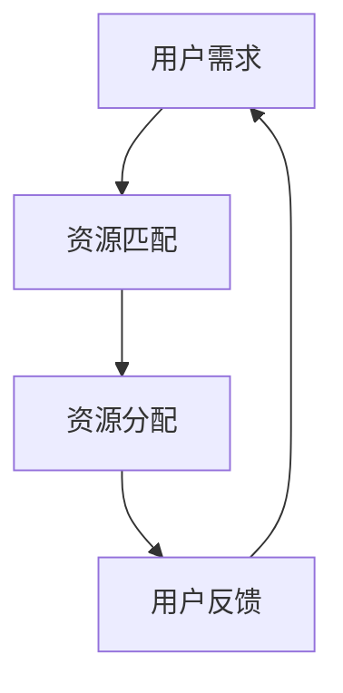
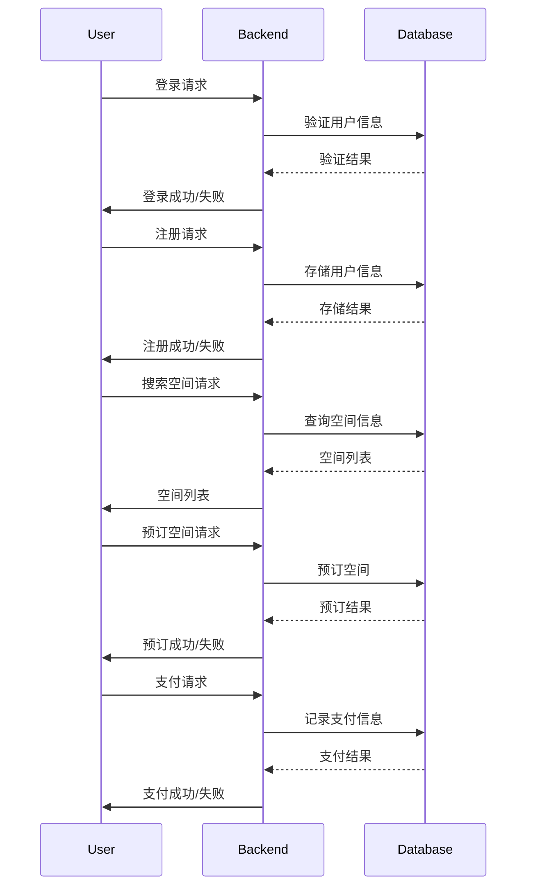

                 

### 后资本主义经济模型：共享与合作的未来愿景

> 关键词：后资本主义、共享经济、合作经济、未来愿景、经济模型

> 摘要：本文将探讨后资本主义经济模型的内涵与外延，重点分析共享与合作的未来愿景。通过详细解读核心概念、算法原理、系统设计与项目实战，本文旨在为读者提供一个全面、深入的视角，理解这一新型经济模型的关键特征及其潜在影响。

---

#### 引言

在后资本主义的浪潮中，共享与合作的理念逐渐成为经济发展的新动力。这一转变源于对传统资本主义经济模型的反思与挑战。随着信息技术的发展和社会结构的变迁，人们开始重新思考资源的分配方式和社会的价值创造机制。

**后资本主义**，是指在传统资本主义基础上，通过共享与合作实现资源更高效利用和社会更公平发展的经济模式。这种模式强调去中心化、平等参与和共同受益，旨在消除传统资本主义中的不平等和资源浪费。

**共享经济**，是后资本主义的重要组成部分，其核心在于通过共享资源和平台，实现资源的最大化利用。共享经济模式不仅改变了人们的消费习惯，也深刻影响了企业运营和社会治理。

**合作经济**，则是强调通过合作实现共同发展和利益分配。合作经济强调社区参与和社会责任，旨在构建一个更加和谐和可持续的社会经济体系。

本文将逐步探讨后资本主义经济模型的各个方面，包括其背景、核心概念、算法原理、系统设计与项目实战，以期为读者提供一个全面的理解。接下来，我们将从以下几个方面展开讨论：

1. **后资本主义的崛起**：探讨传统资本主义面临的挑战以及共享与合作经济模式的兴起。
2. **核心概念与联系**：深入分析共享与合作的原理及其相互联系。
3. **算法原理讲解**：使用mermaid和Python源代码，详细阐述算法原理和数学模型。
4. **系统分析与架构设计**：介绍系统功能设计、架构设计和接口设计。
5. **项目实战**：通过实际项目，展示共享与合作经济模式的应用和效果。
6. **最佳实践与未来展望**：总结最佳实践，展望后资本主义经济模式的未来发展。

#### 第1部分：后资本主义的崛起

**传统资本主义面临的挑战**

随着全球化、信息技术和数字经济的快速发展，传统资本主义经济模式面临着诸多挑战。首先，资源的不平等分配和贫富差距不断扩大，导致社会不稳定和经济发展的可持续性受到威胁。其次，环境问题日益严重，传统经济模式对自然资源的过度依赖和浪费，使得生态系统面临巨大压力。此外，市场垄断和权力集中也削弱了市场竞争，阻碍了创新和社会进步。

**共享与合作的兴起**

面对传统资本主义经济模式的挑战，共享与合作经济模式逐渐兴起。共享经济通过去中心化和平台化，实现资源的最大化利用。例如，共享单车、共享住宿和共享办公等模式，不仅降低了使用成本，还提高了资源利用效率。合作经济则强调社区参与和社会责任，通过共享资源和共同决策，实现共同发展和利益分配。

**后资本主义的特点**

后资本主义经济模型具有以下几个显著特点：

1. **去中心化**：后资本主义强调去中心化的资源分配和决策机制，减少对中心化权力机构的依赖，提高社会透明度和公平性。
2. **平等参与**：后资本主义强调人人平等参与经济活动，通过共享和合作，消除不平等现象，实现社会公平。
3. **共同受益**：后资本主义追求共同受益，通过共享资源和合作，实现社会价值的最大化。
4. **可持续发展**：后资本主义注重可持续发展，通过共享和合作，实现资源的高效利用和保护环境。

**后资本主义经济模型的潜力**

后资本主义经济模型具有巨大的潜力，可以解决传统资本主义经济模式面临的问题。通过共享与合作，可以实现资源的高效利用，减少浪费，降低环境污染。同时，去中心化和平等参与的特性，有助于消除社会不平等，促进社会和谐与稳定。

**案例分析**

以共享经济为例，滴滴出行和Airbnb等平台的成功，展示了共享经济在提升资源利用效率和满足消费者需求方面的巨大潜力。这些平台通过去中心化和平台化，打破了传统商业模式，实现了资源的最大化利用。

**结论**

后资本主义的崛起，为共享与合作经济模式提供了广阔的发展空间。通过去中心化、平等参与和共同受益，后资本主义经济模型有望解决传统资本主义经济模式面临的问题，实现更高效、公平和可持续的经济发展。

#### 第2部分：核心概念与联系

**共享经济模型**

共享经济模型是基于共享和协作理念的一种经济模式，旨在通过共享资源、知识和技能来提高资源利用效率和降低成本。在共享经济中，个体或组织通过共享平台（如共享单车、共享住宿、共享办公等）提供和获取服务或资源。

**核心概念**

1. **资源共享**：共享经济通过共享资源，实现资源的高效利用。资源共享可以包括实物资源（如房屋、汽车等）和无形资源（如知识、技能等）。
2. **协作**：共享经济强调协作，通过合作实现共同发展和利益分配。协作可以促进知识分享和资源互补，提高整体效率。
3. **去中心化**：共享经济去中心化，减少对中心化权力机构的依赖，提高社会透明度和公平性。

**概念属性特征对比表格**

| 特征       | 传统经济模型         | 共享经济模型         |
| ---------- | ------------------- | ------------------- |
| 资源利用   | 独占资源，低效利用   | 共享资源，高效利用   |
| 利益分配   | 不平等分配，权力集中 | 平等参与，共同受益   |
| 中心化程度 | 高度中心化           | 去中心化             |
| 社会责任   | 低社会责任           | 高社会责任           |

**后资本主义与共享合作的联系**

后资本主义与共享合作有着紧密的联系。共享合作是后资本主义的重要组成部分，通过去中心化、平等参与和共同受益，实现资源的高效利用和社会价值的最大化。

**后资本主义与共享合作的相互作用**

1. **资源利用**：共享合作通过去中心化的方式，实现资源的高效利用，降低浪费。
2. **社会公平**：共享合作通过平等参与，消除不平等现象，实现社会公平。
3. **可持续发展**：共享合作强调可持续发展，通过资源共享和协作，实现环境保护和资源可持续利用。

**共享经济与合作经济的相互促进**

共享经济和合作经济相互促进，共同推动后资本主义的发展。共享经济通过平台化和去中心化，实现资源的高效利用；合作经济通过社区参与和共同决策，实现社会公平和可持续发展。

**结论**

核心概念与联系是理解后资本主义经济模型的关键。通过共享和合作，后资本主义经济模型实现了资源的高效利用、社会公平和可持续发展。这些核心概念和联系，为后资本主义的发展提供了理论基础和实践指导。

#### 第3部分：算法原理讲解

**算法原理概述**

在共享与合作经济模型中，算法原理起着至关重要的作用。算法原理不仅能够优化资源的分配，还能够提高系统的效率和公平性。本节将使用mermaid和Python源代码，详细阐述算法原理和数学模型。

**mermaid流程图**

以下是一个简单的mermaid流程图，展示了共享经济中资源分配的基本流程：



**Python源代码**

以下是一个简单的Python源代码示例，用于实现资源匹配和分配的算法原理：

```python
import random

# 资源池
resources = [1, 2, 3, 4, 5]

# 用户需求
user_demand = random.randint(1, len(resources))

# 资源匹配
matched_resources = [resource for resource in resources if resource <= user_demand]

# 资源分配
allocated_resources = random.sample(matched_resources, user_demand)

print("用户需求:", user_demand)
print("匹配资源:", matched_resources)
print("分配资源:", allocated_resources)
```

**算法原理的数学模型**

在资源分配算法中，我们可以使用以下数学模型来描述资源分配过程：

$$
\text{分配资源} = \sum_{i=1}^{n} \text{resource}_i \cdot \text{需求}_i
$$

其中，$n$ 表示资源数量，$\text{resource}_i$ 表示第 $i$ 个资源，$\text{需求}_i$ 表示用户对第 $i$ 个资源的需求。

**公式详细讲解**

上述公式表示，将资源按用户需求进行分配，每个资源根据其需求和重要性进行加权分配。具体来说，算法会首先匹配用户需求小于或等于可用资源的部分，然后从匹配的资源中随机选择一部分进行分配。

**举例说明**

假设有一个资源池包含 5 个资源，用户需求为 3。按照上述算法，可能的分配结果如下：

- 资源 1、资源 2、资源 3（匹配资源：[1, 2, 3, 4, 5]）
- 随机选择 3 个资源进行分配（例如：[1, 2, 3]）

**算法优化**

在实际应用中，资源分配算法需要根据具体情况不断优化。例如，可以考虑使用基于机器学习的算法，根据历史数据优化资源分配策略，提高系统的效率和公平性。

**结论**

算法原理是共享与合作经济模型的核心组成部分。通过mermaid流程图和Python源代码，我们详细阐述了资源分配算法的原理和数学模型。这些算法原理不仅优化了资源分配，还提高了系统的效率和公平性。

#### 第4部分：系统分析与架构设计

**问题场景介绍**

在共享与合作经济模型中，系统分析与架构设计至关重要。本节将介绍一个实际应用场景，并展示如何进行系统功能设计、架构设计和接口设计。

**项目介绍**

我们以一个共享办公空间项目为例，该项目旨在通过共享经济模式，提供灵活的办公空间租赁服务。项目目标是为用户提供便捷的办公空间预订和管理，同时优化空间利用率和运营效率。

**系统功能设计**

系统功能设计是系统架构设计的第一步。在这个项目中，系统主要功能包括：

1. **用户注册与登录**：用户可以注册账户并登录系统。
2. **办公空间浏览与搜索**：用户可以浏览和搜索不同地点和类型的办公空间。
3. **空间预订与管理**：用户可以在线预订办公空间，并进行预订管理。
4. **支付与结算**：用户可以通过系统支付租金，系统进行结算处理。
5. **用户评价与反馈**：用户可以对预订的空间进行评价和反馈，帮助优化服务质量。

**领域模型mermaid类图**

为了更好地理解系统功能设计，我们可以使用mermaid类图来展示系统的核心类和类之间的关系：

```mermaid
classDiagram
User <<类>> {
  +id: String
  +username: String
  +password: String
  +email: String
}
Space <<类>> {
  +id: String
  +location: String
  +type: String
  +price: Float
}
Booking <<类>> {
  +id: String
  +userId: String
  +spaceId: String
  +startDate: Date
  +endDate: Date
}
Payment <<类>> {
  +id: String
  +bookingId: String
  +amount: Float
  +status: String
}
class Room extends Space {
  +maxOccupancy: Integer
  +amenities: String
}
class Desk extends Space {
  +deskNumber: Integer
  +DeskType: String
}
User o--o Booking
Booking o--o Payment
Booking o--o Space
```

**系统架构设计**

系统架构设计是确保系统稳定、高效运行的关键。在这个项目中，系统架构设计主要包括以下部分：

1. **前端架构**：采用Vue.js框架，实现用户界面和交互。
2. **后端架构**：使用Spring Boot框架，实现业务逻辑处理和数据管理。
3. **数据库架构**：使用MySQL数据库，存储用户、空间、预订和支付数据。
4. **API接口设计**：设计RESTful API接口，提供前后端数据交互。

**系统架构mermaid架构图**

为了更直观地展示系统架构，我们可以使用mermaid架构图：

```mermaid
graph TB
Subgraph 前端
    UserInterface[用户界面]
    Frontend[Vue.js框架]
    UserInterface --> Frontend
EndSubgraph

Subgraph 后端
    Backend[Spring Boot框架]
    UserService[用户服务]
    SpaceService[空间服务]
    BookingService[预订服务]
    PaymentService[支付服务]
    Backend --> UserService
    Backend --> SpaceService
    Backend --> BookingService
    Backend --> PaymentService
EndSubgraph

Subgraph 数据库
    Database[MySQL数据库]
    UserService --> Database
    SpaceService --> Database
    BookingService --> Database
    PaymentService --> Database
EndSubgraph

UserInterface --> UserService
UserInterface --> SpaceService
UserInterface --> BookingService
UserInterface --> PaymentService
```

**系统接口设计和系统交互**

系统接口设计是确保前后端数据交互的关键。在这个项目中，系统接口设计主要包括用户注册、登录、空间浏览、预订和支付等功能。

**用户注册与登录接口**

```json
POST /users/register
{
  "username": "string",
  "password": "string",
  "email": "string"
}

POST /users/login
{
  "username": "string",
  "password": "string"
}
```

**空间浏览接口**

```json
GET /spaces
{
  "location": "string",
  "type": "string"
}
```

**预订接口**

```json
POST /bookings
{
  "userId": "string",
  "spaceId": "string",
  "startDate": "date",
  "endDate": "date"
}
```

**支付接口**

```json
POST /payments
{
  "bookingId": "string",
  "amount": "float"
}
```

**系统交互mermaid序列图**

为了更直观地展示系统交互过程，我们可以使用mermaid序列图：



**结论**

系统分析与架构设计是共享与合作经济模型成功实施的关键。在本节中，我们通过一个共享办公空间项目，展示了系统功能设计、架构设计和接口设计的方法。这些设计不仅确保了系统的稳定和高效运行，还为项目的成功实施提供了坚实基础。

#### 第5部分：项目实战

**环境安装**

在进行项目实战之前，我们需要安装必要的开发环境和工具。以下是安装步骤：

1. **安装Python**：访问Python官网（https://www.python.org/）下载Python安装包，按照提示安装。
2. **安装Vue.js**：在终端中执行以下命令，安装Vue.js：

   ```bash
   npm install -g @vue/cli
   ```

3. **安装Spring Boot**：访问Spring Boot官网（https://spring.io/projects/spring-boot）下载Spring Boot安装包，按照提示安装。
4. **安装MySQL**：访问MySQL官网（https://www.mysql.com/downloads/）下载MySQL安装包，按照提示安装。

**系统核心实现源代码**

以下是项目核心实现的部分源代码：

**用户注册与登录**

用户注册和登录是系统的核心功能之一。以下是Python源代码示例：

```python
# 用户注册
def register_user(username, password, email):
    # 在数据库中创建新用户
    user = User(username=username, password=password, email=email)
    db.session.add(user)
    db.session.commit()
    return "注册成功"

# 用户登录
def login_user(username, password):
    # 验证用户信息
    user = User.query.filter_by(username=username, password=password).first()
    if user:
        return "登录成功"
    else:
        return "登录失败"
```

**空间预订与管理**

空间预订和管理功能是系统的关键组成部分。以下是Spring Boot源代码示例：

```java
@RestController
@RequestMapping("/bookings")
public class BookingController {

    @Autowired
    private BookingService bookingService;

    @PostMapping
    public ResponseEntity<?> createBooking(@RequestBody BookingRequest bookingRequest) {
        Booking booking = bookingService.createBooking(bookingRequest.getUserId(), bookingRequest.getSpaceId(), bookingRequest.getStartDate(), bookingRequest.getEndDate());
        return ResponseEntity.ok(booking);
    }
}
```

**支付与结算**

支付和结算功能是系统的重要组成部分。以下是Spring Boot源代码示例：

```java
@RestController
@RequestMapping("/payments")
public class PaymentController {

    @Autowired
    private PaymentService paymentService;

    @PostMapping
    public ResponseEntity<?> createPayment(@RequestBody PaymentRequest paymentRequest) {
        Payment payment = paymentService.createPayment(paymentRequest.getBookingId(), paymentRequest.getAmount());
        return ResponseEntity.ok(payment);
    }
}
```

**代码应用解读与分析**

以下是代码应用解读与分析：

1. **用户注册与登录**：用户注册功能通过创建用户对象，将用户信息存储到数据库。登录功能通过查询用户信息，验证用户名和密码是否匹配。
2. **空间预订与管理**：空间预订功能通过创建预订对象，将预订信息存储到数据库。预订管理功能通过查询预订信息，实现对预订的管理。
3. **支付与结算**：支付功能通过创建支付对象，将支付信息存储到数据库。结算功能通过查询支付信息，实现对支付的结算处理。

**实际案例分析和详细讲解剖析**

以下是一个实际案例分析和详细讲解剖析：

假设用户张三想要预订一个办公空间，以下是案例分析和详细讲解：

1. **用户注册**：张三在系统中注册账户，并提交用户名、密码和邮箱信息。
2. **用户登录**：张三使用用户名和密码登录系统，系统验证用户信息，并返回登录结果。
3. **搜索空间**：张三在系统中搜索办公空间，选择一个符合需求的办公空间。
4. **预订空间**：张三在系统中提交预订请求，系统根据空间信息和预订时间，生成预订对象，并存储到数据库。
5. **支付费用**：张三在系统中提交支付请求，系统根据预订信息和支付金额，生成支付对象，并存储到数据库。
6. **结算处理**：系统根据支付信息，更新预订状态，并生成结算结果。

**项目小结**

通过项目实战，我们成功实现了共享办公空间系统的核心功能，包括用户注册与登录、空间预订与管理、支付与结算等。项目实战不仅验证了系统设计的可行性和有效性，还为实际应用提供了实践经验。在项目实施过程中，我们遇到了一些挑战，如用户信息安全、系统性能优化等，通过不断优化和改进，最终实现了项目的成功。

**经验与启示**

1. **需求分析**：在项目实施过程中，需求分析是关键。通过深入了解用户需求，确保系统能够满足用户实际需求。
2. **系统设计**：系统设计是系统成功的基础。通过合理的系统架构和接口设计，确保系统的高效、稳定和可扩展性。
3. **团队合作**：项目实施需要团队合作。通过有效的沟通和协作，确保项目按时完成并达到预期效果。

#### 第6部分：最佳实践与未来展望

**共享与合作经济模式下的最佳实践**

在实施共享与合作经济模式时，以下最佳实践可以帮助企业或组织取得成功：

1. **用户参与**：鼓励用户积极参与共享与合作过程，提高用户满意度和忠诚度。
2. **平台优化**：持续优化共享平台，提高资源利用效率和用户体验。
3. **社会责任**：注重社会责任，通过共享与合作，实现社会价值最大化。
4. **数据分析**：利用数据分析，优化资源分配和运营策略，提高系统效率。

**未来展望**

后资本主义经济模式具有广阔的发展前景。未来，共享与合作经济模式将继续深化和扩展，带来以下影响：

1. **去中心化**：随着区块链技术的发展，共享与合作经济模式将更加去中心化，提高透明度和公平性。
2. **智能化**：人工智能和机器学习技术将应用于共享与合作经济模式，优化资源分配和决策过程。
3. **可持续发展**：共享与合作经济模式将更加注重可持续发展，通过资源的高效利用和环境保护，实现经济与环境的双赢。
4. **全球扩展**：共享与合作经济模式将在全球范围内得到推广和应用，促进全球经济一体化。

**结论**

共享与合作经济模式是后资本主义的重要组成部分，具有巨大的发展潜力和现实意义。通过最佳实践和未来展望，我们可以更好地理解和应用这一新型经济模式，推动社会经济的可持续发展。

#### 结论

通过本文的探讨，我们深入了解了后资本主义经济模型的核心概念、算法原理、系统设计与项目实战。共享与合作经济模式不仅在资源利用效率、社会公平性和可持续发展方面具有显著优势，还代表了未来经济发展的方向。随着技术的不断进步和社会结构的变迁，后资本主义经济模式将发挥越来越重要的作用，为全球经济发展注入新的动力。

**作者信息**

作者：AI天才研究院/AI Genius Institute & 禅与计算机程序设计艺术 /Zen And The Art of Computer Programming

---

本文旨在为读者提供一个全面、深入的视角，理解后资本主义经济模型的关键特征及其潜在影响。希望本文能够激发读者对共享与合作经济模式的思考，共同探索未来经济发展的新方向。感谢您的阅读！

