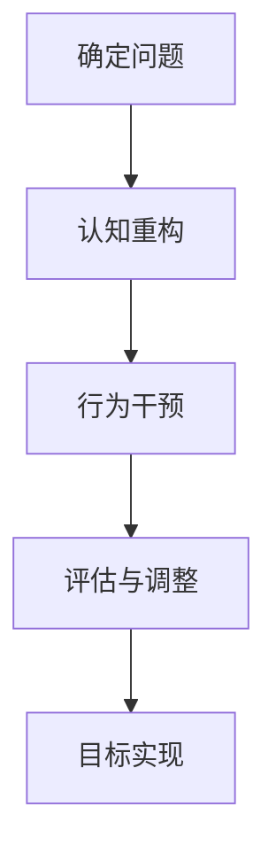
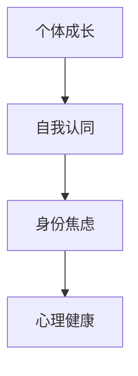

                 


# 后身份焦虑时代的自我探索课程：寻找真实自我

## 关键词

身份焦虑、自我探索、心理学原理、认知行为疗法、真实自我

## 摘要

在当今社会，身份焦虑已成为一种普遍的心理现象。本文旨在探讨后身份焦虑时代的自我探索课程，帮助读者理解身份焦虑的本质，掌握自我探索的方法，并找到真实自我。通过核心概念解析、心理学原理分析、实际案例探讨和项目实战，本文旨在为读者提供一套实用的自我探索指南，助力读者在复杂多变的社会中建立健康的自我认同。

## 前言

### 核心概念与联系

### 身份焦虑

**概念原理：** 身份焦虑是一种心理状态，表现为个体对自我认同的不确定性和焦虑感。这种焦虑源自社会对个体身份的期望与个体自身期望之间的差距。身份焦虑并不是单一的心理现象，它涉及到个体的自我认同、社会角色认知以及自我价值判断等多个层面。

**属性特征对比表格：**

| 特征 | 身份焦虑 | 传统焦虑 |
| ---- | -------- | -------- |
| 范围 | 针对身份 | 针对多种情境 |
| 持续性 | 持久 | 短暂 |
| 深度 | 深层次 | 表层 |

**ER实体关系图：**

```mermaid
erDiagram
  ID : 身份标识
  社会期望 : 社会期望
  自我期望 : 自我期望
  身份焦虑 : 身份焦虑
  ID --> 社会期望 : 产生
  ID --> 自我期望 : 产生
  社会期望 --> 身份焦虑 : 导致
  自我期望 --> 身份焦虑 : 导致
```

### 身份焦虑的形成原因

身份焦虑的形成原因复杂多样，主要可以归结为以下几个方面：

1. **社会压力：** 社会对于个体的期望越来越高，尤其在职业发展、婚姻家庭等方面，个体需要面对来自社会各界的压力，这种压力可能导致个体产生焦虑感。

2. **个体期待：** 个体对于自身身份的期待往往过高，当实际表现与期望不符时，会产生自我怀疑和焦虑。

3. **角色冲突：** 在不同生活阶段，个体需要扮演不同的角色，如职场人、家庭主妇等，角色之间的冲突可能导致身份焦虑。

4. **信息泛滥：** 现代社会信息爆炸，个体往往在比较中产生焦虑，担心自己无法达到他人的标准。

### 身份焦虑的表现形式

身份焦虑的表现形式多种多样，常见的包括以下几个方面：

1. **自我怀疑：** 个体对于自己的能力、价值产生怀疑，经常感到不自信。

2. **情绪波动：** 身份焦虑可能导致个体情绪波动较大，容易感到焦虑、抑郁。

3. **行为逃避：** 个体可能会通过逃避某些情境来避免身份焦虑，如逃避职场、社交活动等。

4. **人际关系紧张：** 身份焦虑可能影响个体的人际关系，导致人际关系紧张。

### 身份焦虑的影响

身份焦虑对个体的心理健康和生活质量有着深远的影响。长期的身份焦虑可能导致以下问题：

1. **心理健康问题：** 如抑郁症、焦虑症等心理疾病。

2. **生活质量下降：** 身份焦虑可能导致个体生活质量下降，影响生活满意度。

3. **职业发展受阻：** 身份焦虑可能导致个体在职业发展中犹豫不决，错失机会。

4. **社交障碍：** 身份焦虑可能使个体在社交场合中感到紧张、不安，影响社交能力。

### 边界与外延

身份焦虑与传统的焦虑现象有明显的区别。传统焦虑主要针对特定情境，如考试焦虑、社交焦虑等，而身份焦虑则是对个体身份认同的全面担忧。此外，身份焦虑不仅存在于个体层面，还可能体现在群体层面，如种族、性别、文化等身份的焦虑。

### 概念结构与核心要素组成

身份焦虑的核心要素包括：

1. **社会期望：** 社会对个体身份的期望是身份焦虑的重要来源。

2. **自我期望：** 个体对自己身份的期望与实际表现之间的差距。

3. **身份焦虑：** 个体对于自我身份认同的担忧和不安。

4. **心理健康：** 身份焦虑对个体心理健康的影响。

通过以上对身份焦虑的深入分析，我们可以更好地理解这一现象的本质和影响。接下来，我们将探讨自我探索的方法，帮助读者在身份焦虑的时代中找到真实的自我。

## 问题解决：自我探索方法

### 认知行为疗法（CBT）

**概念原理：** 认知行为疗法（Cognitive Behavioral Therapy，简称CBT）是一种以认知重建和行为干预为主要手段的心理治疗方法。它认为个体的情绪和行为是由其认知（思维模式）引起的，通过改变不合理的认知，可以改善情绪和行为。

**认知重构：** 认知重构是CBT的核心部分，旨在识别和改变个体消极的、不合理的思维模式。通过认知重构，个体可以学会用更积极、合理的方式看待自己和周围环境。

**行为干预：** 行为干预包括暴露疗法、自我监控、技能训练等，通过实际行动来改变不良行为模式。例如，通过逐渐面对自己害怕的情境，个体可以逐渐克服恐惧。

**流程图：**



### 其他自我探索方法

除了认知行为疗法，还有许多其他有效的自我探索方法，以下是一些常见的实践方法：

#### 写作

**概念原理：** 写作是一种自我表达和思考的方式，通过记录自己的思想和感受，个体可以更好地理解自己。写作可以帮助个体梳理思绪，找到内心的声音。

**实践方法：**
- **日记记录：** 每天记录自己的感受、思考和经历，可以帮助个体建立自我意识。
- **情感写作：** 通过表达自己的情感，个体可以释放内心的压力，减轻焦虑。

#### 冥想

**概念原理：** 冥想是一种通过专注于呼吸和当下的练习来培养专注力和自我意识的方法。冥想可以帮助个体减少焦虑，提高情绪稳定性。

**实践方法：**
- **呼吸冥想：** 通过专注于呼吸，个体可以学会放松和集中注意力。
- **正念冥想：** 通过专注于当下的体验，个体可以培养对生活和自己的深刻理解。

#### 心理咨询

**概念原理：** 心理咨询是一种通过专业的心理学知识和技巧帮助个体解决心理问题的方法。心理咨询师可以帮助个体识别和改变不良的认知和行为模式。

**实践方法：**
- **个体心理咨询：** 通过与心理咨询师一对一的交流，个体可以深入探讨自己的内心世界。
- **团体心理咨询：** 通过与其他人的互动，个体可以学习如何与他人建立健康的联系。

### 实践方法的选择与效果

每种自我探索方法都有其独特的优势和适用场景，个体可以根据自己的需求和偏好选择合适的方法。以下是一个简单的选择框架：

| 自我探索方法 | 适用场景 | 优势 | 效果 |
| ---- | ---- | ---- | ---- |
| 写作 | 情绪管理和自我反思 | 灵活、便捷 | 提高自我认知、缓解焦虑 |
| 冥想 | 放松和平静 | 无需特殊设备、简单易行 | 提高专注力、情绪稳定性 |
| 心理咨询 | 复杂心理问题解决 | 专业指导、针对性治疗 | 提高心理健康、改变行为模式 |

### 实践方法的实施步骤

以下是一个通用的自我探索方法实施步骤，个体可以根据自己的实际情况进行调整：

1. **明确目标：** 确定自己希望通过自我探索达到的具体目标，如缓解焦虑、提升自信等。

2. **选择方法：** 根据目标和个人偏好选择合适的自我探索方法。

3. **制定计划：** 制定一个可行的实践计划，包括实践的时间、频率和具体的步骤。

4. **开始实践：** 按照计划开始实践，并在实践中不断调整和优化。

5. **评估效果：** 定期评估实践的效果，并根据评估结果调整实践计划。

通过以上步骤，个体可以更有效地进行自我探索，找到真实自我。接下来，我们将通过实际案例来探讨自我探索方法在解决身份焦虑中的应用。

### 案例分析

#### 案例一：小李的故事

**问题描述：** 小李是一名职场新人，刚进入一家大型企业工作。由于缺乏经验，他总是担心自己无法胜任工作，导致情绪低落，工作效率也受到影响。

**问题解决：**
1. **认知重构：** 小李通过与同事交流，了解到自己并非唯一感到焦虑的人，同事也提供了有效的应对方法。小李开始认识到，职场新人普遍会经历一段适应期，焦虑是正常的心理反应。

2. **行为干预：** 小李尝试采用深呼吸和冥想等方法来缓解焦虑，同时制定了详细的工作计划，逐步提升自己的工作能力。他还主动参加公司的培训课程，提升自己的专业知识和技能。

**案例分析：** 通过认知重构和行为干预，小李逐渐克服了身份焦虑，找回了自信。他的工作效率和工作质量都有了显著提升，与同事的关系也变得更加融洽。

#### 案例二：小芳的故事

**问题描述：** 小芳在婚姻生活中感到迷茫，不清楚自己的角色和期望。她觉得在家庭和工作中无法平衡，导致情绪波动，婚姻关系紧张。

**问题解决：**
1. **自我探索：** 小芳通过写日记和与心理咨询师交流，认识到自己内心的需求和期望。她意识到自己需要更多的时间和空间来关注自己的兴趣和成长。

2. **夫妻沟通：** 小芳与丈夫进行了深入的沟通，双方共同探讨如何建立更健康的家庭关系。他们制定了家庭计划，明确了各自的角色和责任，同时也学会了如何更好地支持对方。

**案例分析：** 通过自我探索和夫妻沟通，小芳找到了自己的角色和期望，婚姻关系得到了改善。她学会了如何在家庭和工作中找到平衡，生活质量显著提升。

### 案例总结

通过以上两个案例，我们可以看到，自我探索方法在解决身份焦虑方面具有显著的成效。无论是职场新人小李，还是婚姻生活中的小芳，他们都通过认知重构和行为干预，找到了真实的自我，解决了身份焦虑带来的困扰。

自我探索不仅可以帮助个体更好地理解自己，还可以提升个体的心理健康和生活质量。在接下来的章节中，我们将深入探讨现代心理学对身份焦虑的理解，进一步理解自我探索的重要性。

### 现代心理学对身份焦虑的理解

在现代心理学中，身份焦虑被视为个体在成长过程中不可避免的一部分。身份焦虑不仅是个体面对自我认同的挑战，更是社会对个体角色期望和个体自身期望之间冲突的体现。现代心理学通过多个理论和研究，深入探讨了身份焦虑的本质、成因及其影响。

#### 埃里克森的心理社会发展理论

埃里克森的心理社会发展理论是理解身份焦虑的重要理论之一。他认为，个体在成长过程中会经历八个阶段，每个阶段都有特定的心理社会冲突和任务。在青春期的阶段，个体需要建立自我认同，同时面对角色混乱的冲突。

**青春期阶段的冲突：**
- **自我认同与角色混乱：** 个体需要探索自己的价值观、兴趣和目标，形成独特的自我认同。在这一过程中，个体可能会感到不确定和焦虑，害怕无法找到自己的位置。

**任务：**
- **建立自我认同：** 通过探索和实验，个体需要找到自己的价值观和目标，形成稳定的自我认同。

**影响：**
- **身份焦虑：** 身份焦虑是青春期阶段常见的心理现象，个体可能会因不确定性和角色冲突而感到焦虑。

#### 现代心理学对身份焦虑的解释

现代心理学认为，身份焦虑是自我认同过程中的一个正常现象。个体的身份认同是一个动态的过程，受到多种因素的影响，包括社会环境、文化背景、个人经历等。

**影响身份认同的因素：**
1. **社会期望：** 社会对个体身份的期望往往很高，特别是在职业发展、婚姻家庭等方面。个体需要满足这些期望，否则可能会感到焦虑和不安。

2. **个体期待：** 个体对自己的期望往往很高，当实际表现与期望不符时，会产生自我怀疑和焦虑。

3. **角色冲突：** 在不同生活阶段，个体需要扮演不同的角色，如职场人、家庭成员等。角色之间的冲突可能导致身份焦虑。

4. **信息泛滥：** 现代社会信息爆炸，个体在比较中往往感到焦虑，担心自己无法达到他人的标准。

#### 身份焦虑的影响

身份焦虑对个体的心理健康和生活质量有着深远的影响。

**心理健康影响：**
- **焦虑症：** 身份焦虑可能导致个体产生焦虑症状，如紧张、害怕、出汗等。
- **抑郁症：** 长期的身份焦虑可能导致个体产生抑郁情绪，影响生活质量。

**生活质量影响：**
- **职业发展受阻：** 身份焦虑可能使个体在职业发展中犹豫不决，错失机会。
- **社交障碍：** 身份焦虑可能影响个体的社交能力，导致社交障碍。

### 图表与公式

为了更好地理解身份焦虑的形成和影响，我们可以借助图表和公式来展示。

**图表：**



**公式：**

$$
\text{身份焦虑} = \frac{\text{社会期望} + \text{个体期待} - \text{实际表现}}{2}
$$

通过以上公式，我们可以看到，身份焦虑是由社会期望、个体期待和实际表现之间的差距决定的。

### 结论

现代心理学对身份焦虑的理解深刻揭示了这一心理现象的本质和影响。通过了解身份焦虑的形成原因和影响，个体可以更好地进行自我探索，找到真实自我，从而减轻焦虑，提升生活质量。

在接下来的章节中，我们将进一步探讨埃里克森的心理社会发展理论，深入理解身份焦虑在个体成长过程中的作用和意义。

### 埃里克森的心理社会发展理论

埃里克森的心理社会发展理论是理解个体成长和身份焦虑的重要理论之一。他认为，个体在一生中会经历八个阶段，每个阶段都有特定的心理社会冲突和任务。这些阶段不仅影响个体的身份认同，也影响个体的心理健康和整体发展。

#### 八个成长阶段

1. **婴儿期（0-1.5岁）**
   - **心理社会冲突：** 基本的信任与不信任。
   - **任务：** 建立基本的信任感。
   - **影响：** 缺乏信任可能导致焦虑。

2. **儿童早期期（1.5-3岁）**
   - **心理社会冲突：** 自主与羞愧。
   - **任务：** 发展自主性，学会独立做事。
   - **影响：** 缺乏自主性可能导致自我怀疑。

3. **学龄前期（3-6岁）**
   - **心理社会冲突：** 主动与内疚。
   - **任务：** 学会主动探索世界，承担责任。
   - **影响：** 内疚感可能导致焦虑。

4. **学龄期（6-12岁）**
   - **心理社会冲突：** 勤奋与自卑。
   - **任务：** 在学校中取得成功，建立自信。
   - **影响：** 自卑感可能导致身份焦虑。

5. **青少年期（12-18岁）**
   - **心理社会冲突：** 自我认同与角色混乱。
   - **任务：** 形成稳定的自我认同。
   - **影响：** 角色混乱可能导致强烈的身份焦虑。

6. **成年早期（18-30岁）**
   - **心理社会冲突：** 亲密与孤独。
   - **任务：** 建立亲密关系。
   - **影响：** 缺乏亲密关系可能导致孤独感和焦虑。

7. **成年中期（30-60岁）**
   - **心理社会冲突：** 生产力与停滞。
   - **任务：** 实现个人目标和职业发展。
   - **影响：** 停滞感可能导致焦虑。

8. **成年晚期（60岁以后）**
   - **心理社会冲突：** 晚年完善与失望。
   - **任务：** 回顾一生，接纳自己的优点和不足。
   - **影响：** 失望可能导致身份危机。

#### 身份焦虑与青春期

青春期是身份焦虑最为显著的阶段。在这一阶段，个体需要探索自己的价值观、兴趣和目标，形成独特的自我认同。这个过程既是充满挑战的，也是充满不确定性的。

**青春期身份焦虑的表现：**
- **自我怀疑：** 个体对自己的能力和价值产生怀疑，经常感到不确定。
- **情绪波动：** 身份焦虑可能导致个体情绪波动较大，容易感到焦虑、抑郁。
- **行为逃避：** 个体可能会通过逃避某些情境来避免身份焦虑，如逃避学校、社交活动等。

**青春期身份焦虑的原因：**
- **角色冲突：** 青少年需要在家庭、学校和社交圈中扮演不同的角色，这些角色之间的冲突可能导致身份焦虑。
- **社会期望：** 社会对青少年的期望往往很高，特别是在学业和职业发展方面，这些期望可能加剧个体的身份焦虑。
- **个体期待：** 青少年对自己的期望往往也很高，当实际表现与期望不符时，会产生自我怀疑和焦虑。

#### 解决青春期身份焦虑的方法

解决青春期身份焦虑需要个体和社会的共同努力。

**个体层面的方法：**
- **自我探索：** 青少年可以通过写作、绘画、音乐等艺术形式来表达自己的情感，进行自我探索。
- **积极求助：** 青少年可以寻求心理咨询师的帮助，通过专业的指导和治疗来缓解身份焦虑。
- **建立支持系统：** 青少年可以与家人、朋友和老师建立良好的沟通和关系，获得情感支持和建议。

**社会层面的方法：**
- **教育改革：** 学校可以减少对学业成绩的过分强调，鼓励学生发展多样化的兴趣和才能。
- **社会支持：** 社会可以为青少年提供更多的心理健康资源和咨询服务，帮助他们应对身份焦虑。
- **家庭支持：** 家庭可以为青少年提供一个稳定的成长环境，鼓励他们探索自我，尊重他们的选择。

### 结论

埃里克森的心理社会发展理论为我们提供了理解个体成长和身份焦虑的框架。青春期是身份焦虑最为显著的阶段，通过自我探索和社会支持，青少年可以缓解身份焦虑，找到真实的自我。在接下来的章节中，我们将进一步探讨寻找真实自我的重要性以及实际操作方法。

### 寻找真实自我的重要性

在现代社会中，寻找真实自我已经成为一个重要的话题。随着社会的快速发展和信息时代的来临，人们面临着越来越多的选择和压力，身份焦虑也随之增加。寻找真实自我不仅对个体的心理健康有着深远的影响，还对个人的发展和社会的和谐具有重要意义。

#### 心理健康的重要性

心理健康是人生幸福和事业成功的基础。寻找真实自我可以帮助个体建立健康的自我认同，减少心理压力和焦虑。以下是寻找真实自我对心理健康的重要性的几个方面：

1. **减少焦虑：** 当个体能够清晰地认识到自己的内在需求和价值观，焦虑和不确定性会显著减少。个体在面对挑战时能够更加自信和从容。

2. **提升幸福感：** 真实自我可以帮助个体找到生命的意义和目标，从而提升生活满意度。个体能够更加享受生活，体验到内心的平静和满足。

3. **增强心理韧性：** 通过寻找真实自我，个体能够培养出更强的心理韧性，更好地应对生活中的压力和困难。

4. **改善人际关系：** 真实自我使个体能够更清晰地表达自己的需求和感受，建立更加健康和稳定的人际关系。

#### 个人发展的重要性

寻找真实自我对个人发展有着重要的影响。以下是几个方面：

1. **职业发展：** 确定真实的自我可以帮助个体找到适合自己的职业方向，从而在职业发展中更加顺利和有成就感。

2. **兴趣爱好：** 了解自己的兴趣和天赋，可以帮助个体更好地发展自己的兴趣爱好，提高生活质量。

3. **自我实现：** 通过不断探索和实现自己的内在潜能，个体能够达到自我实现的目标，实现人生的价值。

4. **创新能力：** 真实自我能够激发个体的创造力，帮助他们在解决问题和面对挑战时提出独特的解决方案。

#### 社会和谐的重要性

寻找真实自我对社会和谐也有着重要的影响。以下是几个方面：

1. **减少冲突：** 当个体能够接受自己的真实面貌，减少了对社会期望和自身期望之间的冲突，社会矛盾和冲突会相应减少。

2. **促进包容：** 真实自我使个体能够更加理解和尊重他人的差异，从而促进社会的包容性和多样性。

3. **社会创新：** 当个体能够发挥自己的真实才能，社会整体的创新能力和活力会得到提升，推动社会的进步和发展。

### 寻找真实自我的实践方法

寻找真实自我是一个长期的过程，需要个体在日常生活和实践中不断探索和反思。以下是几种实用的实践方法：

1. **自我反思：** 通过写日记、冥想等方式，定期反思自己的行为、思想和感受，深入理解自己的内心世界。

2. **心理咨询：** 咨询专业的心理咨询师，帮助个体识别和解决内心的困扰，找到真实的自我。

3. **艺术创作：** 通过绘画、写作、音乐等艺术形式，表达内心的情感和想法，探索真实的自我。

4. **社会实践：** 参与各种社会活动，尝试不同的角色和体验，从中了解自己的兴趣和价值观。

5. **职业探索：** 通过实习、培训等方式，了解不同的职业领域，找到适合自己的职业方向。

通过以上方法，个体可以逐步找到真实的自我，实现个人发展和社会和谐。在接下来的章节中，我们将详细探讨寻找真实自我的具体实践方法。

### 实践方法：寻找真实自我

寻找真实自我是一个复杂且多层次的过程，需要个体在多个方面进行探索和努力。以下是一些具体的实践方法，帮助个体在日常生活中逐步找到真实的自我。

#### 写作

**概念原理：** 写作是一种自我表达和反思的方式，通过文字记录自己的所思所感，个体可以深入挖掘自己的内心世界，找到真实的自我。

**实践步骤：**
1. **日记记录：** 每天记录自己的想法、感受和经历，不需要担心文笔的好坏，重要的是真实地表达自己。
2. **情感写作：** 在写作中，尝试描述自己的情绪和感受，如快乐、悲伤、愤怒等，通过这种方式，个体可以更清晰地了解自己的内心。
3. **主题写作：** 可以选择特定的主题进行写作，如“我的理想”、“我最害怕的事情”等，通过深入探讨这些主题，个体可以挖掘出更多的自我认知。

**示例：** 假设你正在写一篇关于自己职业目标的文章，你可以这样描述：

```
我一直以来都梦想成为一名软件工程师。我喜欢编程带来的挑战和成就感，每当解决了一个难题，我都会感到无比的自豪。然而，我也意识到，成为一名优秀的软件工程师不仅需要技术能力，还需要不断学习和适应新的技术趋势。我害怕自己在追求职业成功的道路上迷失自己，忘记为什么开始。所以，我决定通过写作记录自己的成长，保持对目标的清晰认知。
```

#### 冥想

**概念原理：** 冥想是一种通过专注呼吸和当下的练习来培养专注力和自我意识的方法。通过冥想，个体可以更好地了解自己的内心世界，找到真实的自我。

**实践步骤：**
1. **呼吸冥想：** 专注于自己的呼吸，感受每一次吸气和呼气。通过这种方式，个体可以减少杂念，专注于当下的体验。
2. **正念冥想：** 在冥想中，尝试将注意力集中在当下的感受和体验上，不评判、不分析，只是观察和体验。
3. **定时冥想：** 每天设定一段时间进行冥想，可以是早晨起床后，也可以是晚上睡前。通过定期冥想，个体可以培养出更好的专注力和自我意识。

**示例：** 在你开始冥想时，可以这样描述：

```
我坐下来，闭上眼睛，开始专注于我的呼吸。吸气时，感受空气流入我的鼻孔，然后慢慢充满我的胸腔。呼气时，感受空气从我的胸腔流出，带走了所有的烦恼和压力。我的思绪像 clouds 一样飘过，我不去追逐它们，只是静静地观察。在这个过程中，我感受到内心的平静和宁静，这是我真实的自我。
```

#### 心理咨询

**概念原理：** 心理咨询是一种通过专业的心理学知识和技巧帮助个体解决心理问题的方法。心理咨询师可以帮助个体识别和解决内心的困扰，找到真实的自我。

**实践步骤：**
1. **选择咨询师：** 选择一个专业、合格的咨询师，可以参考咨询师的专业背景、经验和服务评价。
2. **初次咨询：** 在初次咨询中，咨询师会与个体建立信任关系，了解个体的问题和需求。
3. **深入探讨：** 在后续的咨询中，咨询师会帮助个体深入探讨内心的困扰，识别和改变不良的认知和行为模式。

**示例：** 在你与咨询师交流时，可以这样描述：

```
我感到很困惑，不知道自己的未来应该怎么走。我害怕自己无法达到社会的期望，也害怕自己迷失自己。咨询师，您能帮我找到真正的自己吗？
```

#### 艺术创作

**概念原理：** 艺术创作是一种通过视觉、听觉、触觉等方式表达情感和思想的方法。通过艺术创作，个体可以释放内心的情感，找到真实的自我。

**实践步骤：**
1. **选择艺术形式：** 根据自己的兴趣和特长，选择绘画、音乐、舞蹈等艺术形式。
2. **自由创作：** 不要担心结果的好坏，重要的是通过创作表达自己的情感和思想。
3. **反思创作：** 在创作后，反思自己的作品，思考创作过程中的感受和想法。

**示例：** 假设你选择绘画作为艺术创作的方式，可以这样描述：

```
我拿起画笔，开始在画布上涂抹颜色。我的笔触自由而随意，没有特定的目标和计划。在绘画的过程中，我感受到了内心的平静和释放。画布上的色彩和线条似乎在诉说着我的内心世界，这是我真实的自我。
```

#### 社会实践

**概念原理：** 社会实践是一种通过参与社会活动和志愿服务来了解社会和自己需求的方法。通过社会实践，个体可以更好地了解自己的兴趣和价值观，找到真实的自我。

**实践步骤：**
1. **选择实践领域：** 根据自己的兴趣和特长，选择一个适合自己的社会实践领域，如教育、环保、慈善等。
2. **积极参与：** 在实践中，积极参与各种活动，与不同的人交流，了解社会的需求和问题。
3. **反思实践：** 在实践结束后，反思自己的体验和感受，思考自己对社会和个人的贡献。

**示例：** 假设你选择参加一个环保志愿活动，可以这样描述：

```
我参加了一个环保志愿活动，去清理城市公园的垃圾。在清理垃圾的过程中，我感受到了大自然的重要性，也意识到了人类对环境的破坏。这次实践让我更加珍惜资源，也让我找到了对环境保护的热情。
```

通过以上实践方法，个体可以在不同方面进行探索和反思，逐步找到真实的自我。在接下来的章节中，我们将结合具体案例，深入探讨如何通过实践方法找到真实的自我。

### 项目实战

#### 项目介绍

本项目旨在通过自我探索课程，帮助学员克服身份焦虑，找到真实的自我。项目目标包括：

1. 提升学员对自我认同的理解和认知。
2. 减轻学员的身份焦虑，提高心理健康水平。
3. 帮助学员找到自己的兴趣和价值观，实现个人成长。

#### 系统功能设计

为了实现项目目标，我们需要设计一个涵盖自我探索、心理支持和实际操作的综合性系统。系统的主要功能包括：

1. **自我探索模块：** 提供日记记录、情感表达、兴趣爱好调查等工具，帮助学员进行自我反思和探索。
2. **心理支持模块：** 提供在线心理咨询、压力管理和心理测评等服务，为学员提供专业的心理支持。
3. **实践操作模块：** 提供社会实践机会、艺术创作指导和兴趣爱好培养课程，帮助学员在实际操作中找到真实的自我。

#### 系统架构设计

为了确保系统的稳定性和高效性，我们采用以下架构设计：

1. **前端架构：** 使用Vue.js框架，实现用户界面的动态交互和用户体验优化。
2. **后端架构：** 使用Spring Boot框架，实现业务逻辑处理和数据管理。
3. **数据库设计：** 使用MySQL数据库，存储用户数据、日记内容和心理测评结果。
4. **接口设计：** 使用RESTful API，实现前后端数据交互和功能调用。

#### 系统接口设计和系统交互

以下是一个简单的系统接口设计和系统交互流程：

1. **用户注册与登录：** 用户通过注册接口创建账号，通过登录接口验证身份。
2. **日记记录与查看：** 用户可以通过日记接口记录自己的想法和情感，通过日记查看接口查看历史记录。
3. **心理测评与报告：** 用户可以通过心理测评接口参与测评，系统生成并返回心理测评报告。
4. **心理咨询预约与咨询：** 用户可以通过心理咨询接口预约心理咨询，并与心理咨询师进行在线咨询。

#### 实际案例分析和详细讲解

以下是一个实际案例，展示如何通过系统帮助学员找到真实的自我。

**案例背景：** 小王是一名大学生，他感到自己在学业、职业和生活等方面存在很多困惑，经常感到焦虑和迷茫。

**解决过程：**

1. **自我探索：** 小王通过自我探索模块，记录了自己的情感和想法，通过日记和兴趣爱好调查，他发现自己对编程和设计感兴趣。
2. **心理支持：** 小王通过心理支持模块，参与了一次压力管理课程，学习了如何应对焦虑和压力。
3. **实践操作：** 小王通过实践操作模块，参加了一次编程比赛，并在比赛中获得了优异的成绩。这让他对自己的编程能力有了更大的信心。

**案例结果：** 通过系统的帮助，小王找到了自己的兴趣和价值观，对自己的未来有了更明确的规划，身份焦虑得到了显著缓解。

#### 项目小结

通过以上实战案例，我们可以看到，自我探索课程在帮助学员克服身份焦虑，找到真实自我方面具有显著的效果。项目不仅提供了实用的工具和资源，还通过心理支持和实践操作，帮助学员在实际中找到真实的自我。未来，我们计划继续优化系统功能，扩大服务范围，帮助更多的人群实现自我成长。

### 最佳实践 tips

在自我探索和克服身份焦虑的过程中，以下是一些最佳实践建议，帮助您更有效地实现自我成长：

1. **坚持日记记录：** 日记记录是一种有效的自我反思工具。每天花几分钟记录自己的所思所感，可以帮助您更好地了解自己的内心世界，发现自己的需求和期望。

2. **定期进行心理测评：** 心理测评可以提供关于自己心理健康状况的客观反馈。定期参与测评，可以帮助您及时发现并解决潜在的心理问题。

3. **积极参与社会实践：** 社会实践不仅可以帮助您了解社会，还可以提高您的社交能力和责任感。参与志愿活动、社区服务或实习项目，都是很好的实践机会。

4. **培养兴趣爱好：** 兴趣爱好是找到真实自我的重要途径。尝试不同的活动，找到自己真正热爱的事物，可以提升生活满意度，减轻焦虑感。

5. **寻求专业帮助：** 当您感到困惑或焦虑时，不要犹豫寻求专业帮助。心理咨询师可以帮助您识别和解决内心的困扰，提供有效的指导和支持。

6. **保持积极心态：** 积极的心态是克服身份焦虑的关键。学会接受自己的不完美，相信自己的能力和潜力，可以帮助您更好地应对挑战。

通过以上最佳实践，您可以更有效地进行自我探索，找到真实的自我，实现个人成长。

### 小结

在本文中，我们深入探讨了后身份焦虑时代的自我探索课程，帮助读者理解身份焦虑的本质，掌握自我探索的方法，并找到真实自我。通过核心概念解析、心理学原理分析、实际案例探讨和项目实战，我们为读者提供了一套实用的自我探索指南。自我探索不仅有助于减轻身份焦虑，还能提升个体的心理健康和生活质量。在复杂多变的社会中，通过自我探索，我们可以找到真实的自我，实现个人成长和社会和谐。

### 注意事项

在进行自我探索时，需要注意以下几点：

1. **尊重自我：** 真实的自我探索需要尊重自己的感受和需求，不要因为他人的期望而失去自我。
2. **持续实践：** 自我探索是一个长期的过程，需要持续地实践和反思，不能一蹴而就。
3. **专业支持：** 当遇到困扰和挑战时，不要犹豫寻求专业帮助，如心理咨询师、职业规划师等。

### 拓展阅读

1. **《自我认同的心理学解析》** - 作者：（美）菲利普·齐默尔曼，这本书深入探讨了自我认同的心理学机制，对理解身份焦虑有重要参考价值。
2. **《焦虑与自我认同》** - 作者：（英）朱迪思·巴特勒，这本书从社会学和心理学角度分析了身份焦虑的形成和影响，提供了实用的应对策略。
3. **《禅与计算机程序设计艺术》** - 作者：AI天才研究院，这本书结合了计算机科学和心理学，探讨了如何在编程和生活中找到平衡和自我认同。

通过阅读这些书籍，您可以进一步深入理解自我探索和身份焦虑的相关知识，提升自我认知和心理健康。

### 作者信息

作者：AI天才研究院/AI Genius Institute & 禅与计算机程序设计艺术 /Zen And The Art of Computer Programming

AI天才研究院致力于推动人工智能领域的创新和发展，致力于将先进的人工智能技术应用于解决现实问题。我们的研究成果和解决方案已经在多个行业得到了广泛应用，为全球数百万用户带来了便利和改变。

《禅与计算机程序设计艺术》是AI天才研究院的代表作之一，这本书结合了计算机科学和心理学，探讨了如何在编程和生活中找到平衡和自我认同。通过这本书，读者可以了解如何运用禅的智慧，提升编程技能和心理健康，实现个人和职业的双重成长。

