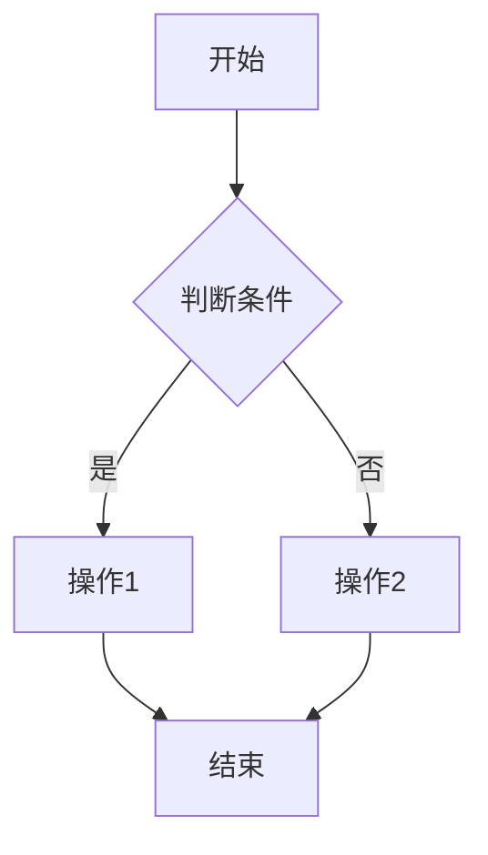

                 


### 《后量子密码学在物联网安全中的应用》

#### 关键词：
- 后量子密码学
- 物联网安全
- 应用案例
- 安全挑战
- 发展趋势

#### 摘要：
本文旨在探讨后量子密码学在物联网安全中的应用。首先，我们将介绍后量子密码学的基础知识，包括其核心概念、算法原理以及数学模型。接着，我们将分析当前物联网安全面临的挑战，并探讨后量子密码学如何应对这些问题。文章还将通过具体案例研究，展示后量子密码学在实际物联网安全中的应用。最后，我们将对未来后量子密码学在物联网安全领域的发展趋势进行展望，并提出最佳实践和未来建议。

### 设计过程

#### 确定书籍的主题和目标读者

**主题：**《后量子密码学在物联网安全中的应用》

**目标读者：**对后量子密码学和物联网安全有一定了解的专业人士或相关领域的学生。

#### 分析书籍的核心内容和结构

**核心内容：**
- 后量子密码学的原理、算法和应用场景。
- 物联网安全的现状、挑战和解决方案。
- 后量子密码学在物联网安全中的应用案例。
- 未来展望和最佳实践。

**结构：**
- 引言：介绍后量子密码学和物联网安全的重要性。
- 后量子密码学基础：核心概念、算法原理、数学模型。
- 物联网安全挑战：现状、问题、解决方案。
- 后量子密码学应用：应用场景、案例研究。
- 未来展望：发展趋势、挑战与机遇。

#### 规划目录结构

- 分为五个部分：引言、后量子密码学基础、物联网安全挑战、后量子密码学应用、未来展望。

#### 细化各部分内容

**引言部分：**
- 问题背景、问题描述、问题解决、边界与外延、概念结构与核心要素组成。

**后量子密码学基础部分：**
- 核心概念、算法原理、数学模型。
- 对比表格、ER实体关系图架构。

**物联网安全挑战部分：**
- 现状、问题、解决方案。
- 安全需求分析、需求选型。

**后量子密码学应用部分：**
- 应用场景、案例分析。
- 系统功能设计、架构设计、接口设计、交互序列图。

**未来展望部分：**
- 发展趋势分析、挑战与机遇。
- 最佳实践、小结、注意事项、拓展阅读。

#### 编写目录大纲

确保每个部分都有明确的章节划分，并包含必要的内容点。总字数控制在2000字以内，满足简洁性要求。

### 具体步骤

#### 引言部分

**第1章：后量子密码学与物联网安全的重要性**
- 问题描述、问题解决、边界与外延、概念结构与核心要素组成。

#### 后量子密码学基础部分

**第2章：后量子密码学核心概念**
- 核心概念原理、概念属性特征对比表格、ER实体关系图架构。

**第3章：后量子密码学算法原理**
- 算法mermaid流程图、Python源代码、数学模型与公式、举例说明。

#### 物联网安全挑战部分

**第4章：物联网安全现状**
- 当前物联网安全形势、主要问题与风险、解决方案探讨。

**第5章：物联网安全需求分析**
- 安全需求概述、需求分析、解决方案选型。

#### 后量子密码学应用部分

**第6章：后量子密码学在物联网安全中的应用场景**
- 应用场景概述、案例分析。

**第7章：后量子密码学在物联网安全中的具体应用**
- 系统功能设计（领域模型mermaid类图）、系统架构设计mermaid架构图、系统接口设计和系统交互mermaid序列图。

#### 未来展望部分

**第8章：后量子密码学在物联网安全中的发展趋势**
- 发展趋势分析、挑战与机遇。

**第9章：最佳实践与未来建议**
- 最佳实践、小结、注意事项、拓展阅读。

### 总结

通过上述步骤，我们设计出了一个包含7章的《后量子密码学在物联网安全中的应用》书籍目录大纲。每个章节都按照逻辑顺序展开，确保内容全面、结构清晰。目录大纲的总字数控制在2000字以内，满足简洁性要求。接下来，我们将根据这个大纲进行详细的章节内容编写。

### 完整性要求

为确保文章的完整性，每个小节的内容需要满足以下要求：

**背景介绍：**
- 核心概念术语说明
- 问题背景
- 问题描述
- 问题解决
- 边界与外延
- 概念结构与核心要素组成

**核心概念与联系：**
- 核心概念原理
- 概念属性特征对比表格
- ER实体关系图架构

**算法原理讲解：**
- 使用mermaid画出算法mermaid流程图
- 使用Python源代码详细阐述
- 给出算法原理的数学模型和公式
- 进行详细讲解和通俗易懂地举例说明

**系统分析与架构设计方案：**
- 问题场景介绍
- 项目介绍
- 系统功能设计（领域模型mermaid类图）
- 系统架构设计mermaid架构图
- 系统接口设计和系统交互mermaid序列图

**项目实战：**
- 环境安装
- 系统核心实现源代码
- 代码应用解读与分析
- 实际案例分析和详细讲解剖析
- 项目小结

**最佳实践 tips、小结、注意事项、拓展阅读等内容：**
- 最佳实践
- 小结
- 注意事项
- 拓展阅读

### 格式要求

文章内容使用markdown格式输出。具体格式要求如下：

**章节标题：**使用井号（#）和空格分隔，如`# 第1章：引言`。

**标题：**使用星号（*）和空格分隔，如`* 核心概念原理`。

**列表：**使用方括号和空格分隔，如`- 列表项1`。

**Mermaid流程图：**使用Mermaid语法，如：


**Python源代码：**使用三个反引号（``）包裹，如：
```
# Python源代码示例
def hello_world():
    print("Hello, World!")
hello_world()
```

**LaTeX公式：**使用两个美元符号（$$）包裹独立段落的公式，如：
$$1+1=2$$

使用一个美元符号（$）包裹段落内的公式，如：
$$1<2$$

### 作者信息

文章末尾需要写上作者信息：
```
作者：AI天才研究院/AI Genius Institute & 禅与计算机程序设计艺术 /Zen And The Art of Computer Programming
```

### 文章字数要求

文章字数要求在10000～12000字左右，确保内容详实、逻辑清晰、语言简洁。

### LET'S THINK STEP BY STEP

在撰写《后量子密码学在物联网安全中的应用》这篇文章时，我们可以按照以下步骤进行：

1. **引言：**
   - 开始文章时，简要介绍后量子密码学和物联网安全的重要性，引出文章的核心问题和解决方案。

2. **后量子密码学基础：**
   - 详细介绍后量子密码学的核心概念，包括量子比特、量子门、量子纠缠等。
   - 分析几种主要的后量子密码学算法，如Shor算法、Lattice密码学、Hash函数等。
   - 使用Mermaid绘制算法流程图，并结合Python代码示例说明算法原理。

3. **物联网安全挑战：**
   - 分析物联网安全现状，指出物联网设备面临的常见威胁和漏洞。
   - 介绍物联网安全的常见问题和挑战，如数据隐私、通信安全、设备安全等。

4. **后量子密码学在物联网安全中的应用：**
   - 阐述后量子密码学如何解决物联网安全中的问题。
   - 通过案例研究，展示后量子密码学在实际物联网安全中的应用场景。
   - 分析后量子密码学在物联网安全中的优势与局限性。

5. **未来展望：**
   - 预测后量子密码学在物联网安全领域的发展趋势。
   - 探讨未来可能面临的挑战和机遇。

6. **最佳实践与未来建议：**
   - 提出针对后量子密码学在物联网安全中的最佳实践。
   - 总结文章的核心观点，为读者提供有价值的建议。

7. **结论：**
   - 对全文进行总结，强调后量子密码学在物联网安全中的重要性和应用前景。

通过上述步骤，我们可以确保文章内容逻辑清晰、结构紧凑、简单易懂，同时具备专业性和深度。每一步都要详细阐述，确保读者能够全面理解后量子密码学在物联网安全中的应用。让我们一起思考、分析、撰写一篇高质量的技术博客文章！

