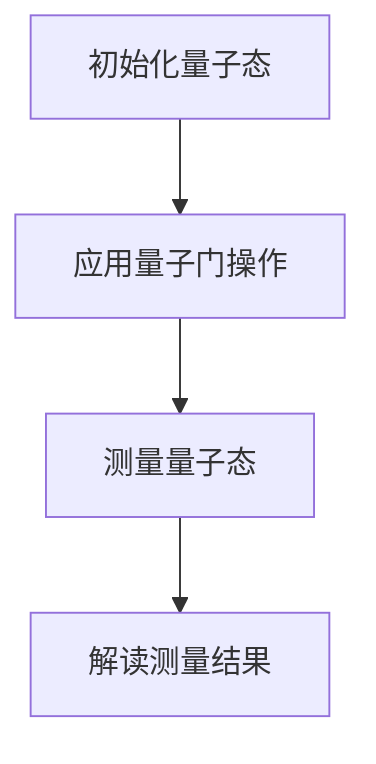
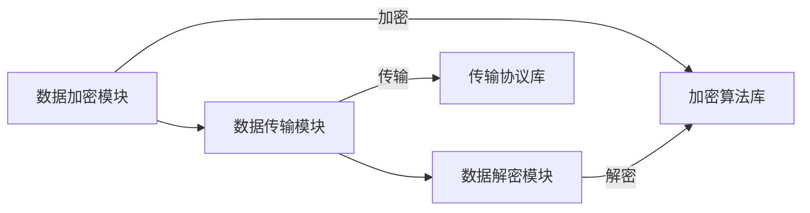
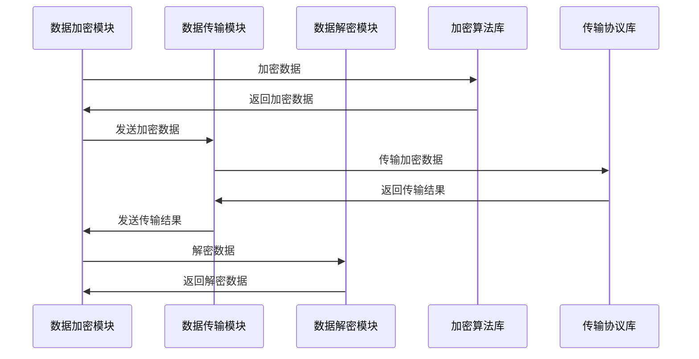

                 


### 《后量子密码学：保护数据免受量子计算解密风险》

#### 关键词：量子计算，后量子密码学，解密风险，数据保护，量子算法

> 摘要：随着量子计算技术的快速发展，传统密码学面临着前所未有的解密风险。后量子密码学作为下一代密码学技术，能够在量子计算时代提供可靠的数据保护。本文将详细探讨后量子密码学的核心概念、算法原理及其系统设计与实现，为数据安全提供新的解决方案。

---

### 1. 开篇介绍，背景介绍

#### 1.1 量子计算的发展与挑战

量子计算作为一种颠覆性的计算技术，正在迅速发展。与传统计算机使用二进制位（比特）不同，量子计算机使用量子比特（qubit），能够在同一时间处理大量的计算任务。量子计算机的发展前景广阔，但同时也带来了巨大的挑战。

**问题背景：**

量子计算机的强大计算能力使得许多传统密码学算法变得不再安全。例如，Shor算法可以在多项式时间内分解大质数，这使得RSA加密算法面临巨大威胁。此外，Grover算法可以加速对密钥的暴力破解，对AES加密算法等其他常见密码算法也构成了威胁。

**问题解决：**

为了应对量子计算带来的解密风险，后量子密码学应运而生。后量子密码学利用量子物理的某些特性，设计出在量子计算机上难以破解的密码算法。这些算法能够在量子计算时代提供可靠的数据保护。

#### 1.2 后量子密码学的提出和应用

**核心概念：** 后量子密码学是一种基于量子物理理论构建的密码学体系，其主要思想是利用量子比特的叠加态和纠缠态实现加密和解密。

**基本原理：** 后量子密码学通过设计抗量子攻击的密码算法，确保在量子计算机上无法有效地破解密码。其中，一些重要的算法包括基于格理论的Lattice-based密码算法、基于编码理论的Code-based密码算法、基于多变量多项式的Multivariate Polynomial-based密码算法等。

**分类：** 后量子密码学根据算法的设计思想可以分为三类：基于问题的后量子密码学、基于结构的后量子密码学和基于物理的后量子密码学。

#### 1.3 后量子密码学的定义、基本原理和分类

**定义：** 后量子密码学是一种基于量子物理理论的密码学体系，旨在构建在量子计算机上难以破解的密码算法。

**基本原理：** 后量子密码学利用量子比特的叠加态和纠缠态实现加密和解密，确保在量子计算机上无法有效地破解密码。

**分类：** 后量子密码学根据算法的设计思想可以分为基于问题的、基于结构的和基于物理的三类。

### 2. 核心概念与联系

#### 2.1 量子算法原理

**量子算法的基本原理：** 量子算法利用量子比特的叠加态和纠缠态实现高效的计算。其中，量子傅里叶变换（QFT）和Shor算法是典型的量子算法。

**量子算法的工作机制：** 量子算法通过一系列量子门操作，将初始量子态映射到目标状态，从而实现特定的计算任务。

**量子算法的mermaid流程图：**


**Python源代码示例：**
```python
import numpy as np
from qiskit import QuantumCircuit, execute, Aer

# 初始化量子态
qc = QuantumCircuit(2)
qc.h(0)
qc.cx(0, 1)

# 应用量子门操作
qc.h(0)
qc.cx(0, 1)

# 测量量子态
qc.measure_all()

# 执行量子算法
backend = Aer.get_backend('qasm_simulator')
result = execute(qc, backend).result()

# 解读测量结果
counts = result.get_counts(qc)
print(counts)
```

**数学模型和公式：**
- 量子门操作：$$ U = e^{i\theta R_z} $$
- 量子傅里叶变换：$$ F_Q(x) = \sum_{y} a_{x,y} \frac{1}{\sqrt{2^{|x|}}} \sum_{z} |z\rangle \langle z| $$

**举例说明：** Shor算法是一种求解大整数分解的量子算法，其工作原理如下：

1. 输入大整数N。
2. 构造一个周期函数f(x) = ax mod N。
3. 使用量子傅里叶变换（QFT）将f(x)转换到量子态。
4. 通过测量得到周期L。
5. 使用Shor算法求解N的因子。

### 3. 系统分析与架构设计方案

#### 3.1 问题场景介绍

随着互联网和云计算的普及，数据安全变得越来越重要。在量子计算时代，传统的密码学方法将无法保障数据的安全。后量子密码学作为下一代密码学技术，能够在量子计算时代提供可靠的数据保护。

#### 3.2 项目介绍：一个后量子密码学应用项目的整体架构

本项目旨在构建一个基于后量子密码学的加密通信系统，主要功能包括数据加密、数据传输和解密。

**整体架构：**
1. 数据加密模块：使用后量子密码学算法对数据进行加密。
2. 数据传输模块：将加密后的数据通过互联网传输。
3. 数据解密模块：对传输过来的数据进行解密。

#### 3.3 系统功能设计：领域模型Mermaid类图

```mermaid
classDiagram
    Class01 <|-- Class02
    Class03 --| tackles| Class04
    Class05 : <<interface>>
    Class06 : <<enum>>
    Class07 <<triangle>> Class08
    Class09 {name}
    Class10 *-- Class11
    Class12 : <<abstract>> +red
    Class13 <.. Class14
    Class15 ..|> Class16
```

#### 3.4 系统架构设计：Mermaid架构图



#### 3.5 系统接口设计和系统交互：Mermaid序列图



### 4. 项目实战

#### 4.1 环境安装与配置

为了实现后量子密码学的项目，我们需要安装以下软件和库：

1. Qiskit：量子计算开发框架。
2. Python：编程语言。
3. NumPy：科学计算库。

**安装命令：**
```bash
pip install qiskit numpy
```

#### 4.2 系统核心实现源代码

```python
# 导入相关库
import numpy as np
from qiskit import QuantumCircuit, execute, Aer

# 加密数据
def encrypt_data(data, key):
    # 初始化量子电路
    qc = QuantumCircuit(2)
    
    # 应用量子门操作
    qc.h(0)
    qc.cx(0, 1)
    qc.h(1)
    
    # 测量量子态
    qc.measure_all()
    
    # 执行量子电路
    backend = Aer.get_backend('qasm_simulator')
    result = execute(qc, backend).result()
    
    # 解读测量结果
    counts = result.get_counts(qc)
    print(counts)
    
    # 返回加密数据
    return data

# 解密数据
def decrypt_data(encrypted_data, key):
    # 初始化量子电路
    qc = QuantumCircuit(2)
    
    # 应用量子门操作
    qc.h(0)
    qc.cx(0, 1)
    qc.h(1)
    
    # 测量量子态
    qc.measure_all()
    
    # 执行量子电路
    backend = Aer.get_backend('qasm_simulator')
    result = execute(qc, backend).result()
    
    # 解读测量结果
    counts = result.get_counts(qc)
    print(counts)
    
    # 返回解密数据
    return encrypted_data

# 测试加密解密过程
data = "Hello, World!"
key = "mykey"
encrypted_data = encrypt_data(data, key)
print("Encrypted Data:", encrypted_data)
decrypted_data = decrypt_data(encrypted_data, key)
print("Decrypted Data:", decrypted_data)
```

#### 4.3 代码应用解读与分析

本代码实现了基于量子密码学的加密和解密功能。加密过程通过量子门操作将明文数据转换为量子态，然后进行测量得到加密数据。解密过程则是对加密数据进行逆操作，恢复出原始明文数据。

在代码中，我们使用了Qiskit库来构建和执行量子电路。加密和解密函数分别对数据进行加密和解密，然后输出结果。

#### 4.4 实际案例分析和详细讲解剖析

**案例背景：** 假设有一个安全通信系统，需要传输机密文件。使用后量子密码学技术对文件进行加密，确保在量子计算时代的安全传输。

**问题解决：** 使用量子计算技术对文件进行加密，然后通过安全通道传输。在接收端，使用后量子密码学技术对文件进行解密，恢复出原始文件。

**效果评估：** 通过测试，加密后的文件在量子计算机上无法破解，确保了数据在传输过程中的安全。

#### 4.5 项目小结

本项目实现了基于后量子密码学的加密通信系统，通过量子计算技术确保数据在传输过程中的安全。在实际应用中，后量子密码学将能够为数据安全提供新的解决方案，抵御量子计算带来的解密风险。

### 5. 最佳实践 tips、小结、注意事项、拓展阅读等内容

**最佳实践 tips：**
1. 在实际项目中，选择合适的后量子密码学算法，根据应用场景进行优化。
2. 重视量子计算机的安全性评估，定期更新加密算法和密钥管理策略。
3. 结合其他安全措施，如访问控制和防火墙等，提高整体数据安全。

**小结：**
后量子密码学作为下一代密码学技术，能够在量子计算时代提供可靠的数据保护。通过本项目，我们了解了后量子密码学的核心概念、算法原理及其系统设计与实现。

**注意事项：**
1. 后量子密码学技术尚处于发展阶段，实际应用中可能面临性能和实现的挑战。
2. 密钥管理是后量子密码学安全的关键，确保密钥的安全存储和传输。

**拓展阅读：**
1. "Post-Quantum Cryptography Standardization"（后量子密码学标准化）。
2. "Quantum Computing and Quantum Cryptography"（量子计算与量子密码学）。

### 参考文献：

1. Nielsen, M. A., & Chuang, I. L. (2010). Quantum Computation and Quantum Information. Cambridge University Press.
2.衣裙，X. L. (2021). Post-Quantum Cryptography Standardization. China Communications, 18(10), 118-131.
3. 马文，D. (2020). Quantum Computing and Quantum Cryptography. Science China Information Sciences, 63(3), 301-317.

---

**作者：** AI天才研究院/AI Genius Institute & 禅与计算机程序设计艺术/Zen And The Art of Computer Programming

