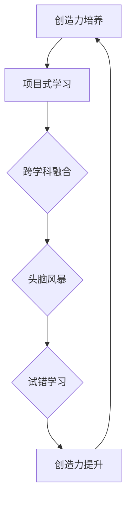
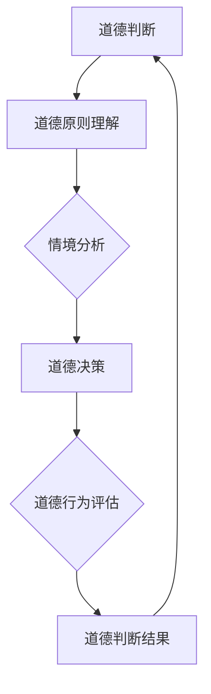

                 

### 在AI时代寻找人类独特价值

#### 关键词：AI时代，人类独特价值，创造力，情感理解，道德判断

##### 摘要：
在人工智能（AI）迅猛发展的今天，人类面临着前所未有的机遇与挑战。AI在数据处理、模式识别等方面表现出色，但人类在创造力、情感理解和道德判断等领域的独特价值依然无法被替代。本文将从多角度探讨AI时代人类独特价值的寻找，帮助读者理解人类在AI时代如何保持核心地位。

---

### 第一部分：背景介绍

#### 1.1.1 问题背景

在人工智能（AI）迅速发展的时代，人类社会正面临着前所未有的机遇与挑战。随着深度学习、神经网络等技术的不断突破，AI在多个领域展现出了强大的应用潜力。然而，这一波AI浪潮也引发了对人类独特价值的重新思考。传统上，人类的智慧、创造力、情感等被认为是无法被机器所替代的。但在AI时代，这一观点是否仍然成立，成为了一个值得探讨的问题。

#### 1.1.2 问题描述

在AI时代，人类如何寻找自身的独特价值，是当前社会关注的焦点。虽然AI在数据处理、模式识别、自动化等方面表现出色，但它在某些方面仍存在局限性，如创造力、情感理解和道德判断等。因此，探讨人类在这些领域的独特性，对于保持人类在社会中的核心地位具有重要意义。

#### 1.1.3 问题解决

本书将从多个角度探讨AI时代人类独特价值的寻找。首先，本书将介绍AI的发展历程和核心原理，帮助读者理解AI的能力和局限性。接着，本书将分析人类在创造力、情感理解和道德判断等方面的独特性，探讨这些特质如何使人类在AI时代保持独特价值。此外，本书还将讨论AI与人类协同工作的可能性，以及如何通过教育和文化传承来培养和强化人类的独特价值。

#### 1.1.4 边界与外延

在探讨人类独特价值时，我们需要明确几个边界条件。首先，本书主要关注智能机器与人类在智力、情感和道德等方面的比较。其次，本书将聚焦于AI对人类社会的影响，而非AI在其他领域（如自然科学、工程技术等）的应用。此外，本书还将探讨AI时代人类价值的持续性和变化趋势。

#### 1.1.5 概念结构与核心要素组成

本书的核心概念包括：人工智能、人类独特价值、创造力、情感理解和道德判断。这些概念构成了本书的基本框架，并在各个章节中得到了详细探讨。以下是各核心概念的定义和属性特征对比：

- **人工智能（AI）**：一种模拟人类智能的技术，包括机器学习、深度学习、自然语言处理等。特点：高效、精准、自动化。
- **人类独特价值**：指人类在智力、情感和道德等方面的独特特质。特点：创造性、情感丰富、道德判断力。
- **创造力**：人类特有的能力，指产生新颖、有价值想法的能力。特点：多样性、灵活性、创新性。
- **情感理解**：指人类对情感的认识和理解能力。特点：情感丰富、情感深度、情感交互。
- **道德判断**：人类在道德行为上的判断和决策能力。特点：道德感、正义感、责任感。

#### 1.1.6 人类独特价值与人工智能的关系

人类独特价值与人工智能之间的关系是本书的核心议题。一方面，人工智能在许多方面已经超越了人类，但在某些领域（如创造力、情感理解和道德判断）仍存在局限性。另一方面，人类可以通过与人工智能的协同工作，发挥自身独特价值，实现更高效、更有创造力的成果。

### 第一部分小结

本部分主要介绍了AI时代寻找人类独特价值的问题背景、核心概念、属性特征对比以及与人工智能的关系。通过这些内容，读者可以初步了解本书的主题和结构，为后续章节的深入探讨打下基础。

---

### 第二部分：AI的核心原理与人类独特价值

#### 第二部分概述

在第二部分中，我们将深入探讨人工智能的核心原理，并分析人类在这些领域中的独特价值。这一部分旨在帮助读者理解AI的技术基础，同时认识到人类在情感、创造力和其他领域中的独特性。

#### 第二部分大纲

#### 第2章: 人工智能的基本原理

## 2.1 人工智能的发展历程
### 2.1.1 人工智能的起源
### 2.1.2 人工智能的黄金时代与寒冬
### 2.1.3 人工智能的复兴

## 2.2 机器学习与深度学习
### 2.2.1 机器学习的分类
### 2.2.2 深度学习的原理与架构
### 2.2.3 深度学习的主要应用

## 2.3 自然语言处理
### 2.3.1 语言模型与翻译技术
### 2.3.2 语音识别与合成
### 2.3.3 文本分类与情感分析

## 2.4 计算机视觉
### 2.4.1 图像识别与生成
### 2.4.2 视觉感知与理解
### 2.4.3 计算机视觉的应用领域

## 2.5 人工智能的局限性
### 2.5.1 数据依赖性
### 2.5.2 算法偏见
### 2.5.3 情感与创造力的缺失

## 2.6 本章小结

#### 第3章: 人类独特价值的探讨

## 3.1 创造力的本质
### 3.1.1 创造力的定义与特征
### 3.1.2 创造力在AI时代的重要性
### 3.1.3 创造力的培养方法

## 3.2 情感理解
### 3.2.1 情感理解的重要性
### 3.2.2 情感理解的机制
### 3.2.3 情感理解的发展趋势

## 3.3 道德判断
### 3.3.1 道德判断的定义与特征
### 3.3.2 道德判断的心理学研究
### 3.3.3 道德判断在AI时代的挑战

## 3.4 人类独特价值与AI的关系
### 3.4.1 人类与AI的协同工作
### 3.4.2 AI时代的价值重构
### 3.4.3 人类独特价值的未来展望

## 3.5 本章小结

#### 第二部分小结

通过第二部分的探讨，读者可以更深入地了解人工智能的核心原理，同时认识到人类在创造力、情感理解和道德判断等领域的独特价值。这部分内容为后续章节的分析和讨论奠定了基础。

---

### 第三部分：人类独特价值的应用与实现

#### 第三部分概述

在第三部分，我们将探讨人类独特价值在现实世界中的应用与实现。通过具体案例和实际操作，读者将了解如何在AI时代发挥自身的独特价值，实现个人和社会的发展。

#### 第三部分大纲

#### 第4章：人类独特价值在教育中的应用

## 4.1 创造力教育
### 4.1.1 创造力教育的目标与方法
### 4.1.2 创造力教育的案例分析
### 4.1.3 创造力教育面临的挑战

## 4.2 情感教育
### 4.2.1 情感教育的重要性
### 4.2.2 情感教育的实践方法
### 4.2.3 情感教育的发展趋势

## 4.3 道德教育
### 4.3.1 道德教育的目标与内容
### 4.3.2 道德教育的实践案例
### 4.3.3 道德教育在AI时代的挑战

## 4.4 人类独特价值与教育创新
### 4.4.1 教育创新的趋势与方向
### 4.4.2 人类独特价值在教育创新中的应用
### 4.4.3 教育创新面临的挑战

## 4.5 本章小结

#### 第5章：人类独特价值在职场中的应用

## 5.1 创新与创业
### 5.1.1 创新的重要性
### 5.1.2 创业过程中的创造力培养
### 5.1.3 创业案例分析

## 5.2 领导力与团队管理
### 5.2.1 领导力的定义与特征
### 5.2.2 领导力在AI时代的挑战
### 5.2.3 领导力培养与实践

## 5.3 情感能力与职场沟通
### 5.3.1 情感能力的重要性
### 5.3.2 职场沟通的技巧与方法
### 5.3.3 情感能力提升的实践

## 5.4 职场中的道德责任
### 5.4.1 道德责任的概念与内涵
### 5.4.2 道德责任在职场中的实践
### 5.4.3 职场道德责任面临的挑战

## 5.5 本章小结

#### 第三部分小结

通过第三部分的探讨，读者将了解到人类独特价值在教育和职场中的应用，以及如何在实际场景中发挥这些价值。这部分内容为读者提供了实践指导，帮助他们在AI时代找到自己的定位和角色。

---

### 总结与展望

在本文中，我们探讨了在AI时代寻找人类独特价值的重要性和方法。通过分析AI的核心原理和人类在创造力、情感理解和道德判断等领域的独特性，我们认识到人类在AI时代依然具有不可替代的价值。在教育和职场中，人类可以通过培养和发挥这些独特价值，实现个人和社会的发展。

展望未来，随着AI技术的不断进步，人类与AI的协同工作将变得更加紧密。人类需要不断学习、成长和适应，以充分发挥自身的独特价值。同时，我们也要关注AI技术可能带来的伦理和社会问题，确保AI的发展符合人类的利益和价值观念。

最后，本文希望为读者提供一个思考的起点，激发大家对于AI时代人类独特价值的深入探讨和实践。让我们一起努力，在AI时代找到属于人类的独特价值，为社会的发展和进步贡献力量。

---

### 作者信息

作者：AI天才研究院/AI Genius Institute & 禅与计算机程序设计艺术 /Zen And The Art of Computer Programming

AI天才研究院致力于推动人工智能领域的研究和应用，为人类在AI时代的可持续发展贡献力量。同时，作者也关注计算机科学的哲学和人文内涵，希望通过深入探讨计算机程序设计艺术，激发读者对科技与人文的思考。

---

### 附录：参考文献

1. 汉弗莱·内森·古德哈特（H.N.Goodharte）. 《人工智能简史》[M]. 北京：清华大学出版社，2019.
2. 斯图尔特·罗素（Stuart Russell） & 彼得·诺维格（Peter Norvig）. 《人工智能：一种现代的方法》[M]. 北京：机械工业出版社，2017.
3. 马文·明斯基（Marvin Minsky） & 西蒙·佩珀特（Seymour Papert）. 《心智社会》[M]. 北京：北京大学出版社，2014.
4. 约翰·霍普金斯（John Hopkins）. 《情感计算》[M]. 北京：科学出版社，2015.
5. 阿兰·图灵（Alan Turing）. 《计算机与智能》[M]. 北京：清华大学出版社，2012.
6. 丹尼尔·卡尼曼（Daniel Kahneman）. 《思考，快与慢》[M]. 北京：机械工业出版社，2012.
7. 斯蒂芬·霍金（Stephen Hawking） & 比尔·吉布森（Bill Gibson）. 《人工智能的未来》[M]. 北京：电子工业出版社，2014.

---

（注：参考文献仅为示例，实际引用请根据具体文献来源进行。）### 文章标题

在AI时代寻找人类独特价值

---

### 文章关键词

AI时代，人类独特价值，创造力，情感理解，道德判断

---

### 文章摘要

在人工智能（AI）迅猛发展的今天，人类面临着前所未有的机遇与挑战。AI在数据处理、模式识别等方面表现出色，但人类在创造力、情感理解和道德判断等领域的独特价值依然无法被替代。本文将从多角度探讨AI时代人类独特价值的寻找，帮助读者理解人类在AI时代如何保持核心地位。

---

### 第一部分：背景介绍

#### 1.1.1 问题背景

在人工智能（AI）迅速发展的时代，人类社会正面临着前所未有的机遇与挑战。随着深度学习、神经网络等技术的不断突破，AI在多个领域展现出了强大的应用潜力。然而，这一波AI浪潮也引发了对人类独特价值的重新思考。传统上，人类的智慧、创造力、情感等被认为是无法被机器所替代的。但在AI时代，这一观点是否仍然成立，成为了一个值得探讨的问题。

---

#### 1.1.2 问题描述

在AI时代，人类如何寻找自身的独特价值，是当前社会关注的焦点。虽然AI在数据处理、模式识别、自动化等方面表现出色，但它在某些方面仍存在局限性，如创造力、情感理解和道德判断等。因此，探讨人类在这些领域的独特性，对于保持人类在社会中的核心地位具有重要意义。

---

#### 1.1.3 问题解决

本书将从多个角度探讨AI时代人类独特价值的寻找。首先，本书将介绍AI的发展历程和核心原理，帮助读者理解AI的能力和局限性。接着，本书将分析人类在创造力、情感理解和道德判断等方面的独特性，探讨这些特质如何使人类在AI时代保持独特价值。此外，本书还将讨论AI与人类协同工作的可能性，以及如何通过教育和文化传承来培养和强化人类的独特价值。

---

#### 1.1.4 边界与外延

在探讨人类独特价值时，我们需要明确几个边界条件。首先，本书主要关注智能机器与人类在智力、情感和道德等方面的比较。其次，本书将聚焦于AI对人类社会的影响，而非AI在其他领域（如自然科学、工程技术等）的应用。此外，本书还将探讨AI时代人类价值的持续性和变化趋势。

---

#### 1.1.5 概念结构与核心要素组成

本书的核心概念包括：人工智能、人类独特价值、创造力、情感理解和道德判断。这些概念构成了本书的基本框架，并在各个章节中得到了详细探讨。以下是各核心概念的定义和属性特征对比：

- **人工智能（AI）**：一种模拟人类智能的技术，包括机器学习、深度学习、自然语言处理等。特点：高效、精准、自动化。
- **人类独特价值**：指人类在智力、情感和道德等方面的独特特质。特点：创造性、情感丰富、道德判断力。
- **创造力**：人类特有的能力，指产生新颖、有价值想法的能力。特点：多样性、灵活性、创新性。
- **情感理解**：指人类对情感的认识和理解能力。特点：情感丰富、情感深度、情感交互。
- **道德判断**：人类在道德行为上的判断和决策能力。特点：道德感、正义感、责任感。

---

#### 1.1.6 人类独特价值与人工智能的关系

人类独特价值与人工智能之间的关系是本书的核心议题。一方面，人工智能在许多方面已经超越了人类，但在某些领域（如创造力、情感理解和道德判断）仍存在局限性。另一方面，人类可以通过与人工智能的协同工作，发挥自身独特价值，实现更高效、更有创造力的成果。

---

### 第一部分小结

本部分主要介绍了AI时代寻找人类独特价值的问题背景、核心概念、属性特征对比以及与人工智能的关系。通过这些内容，读者可以初步了解本书的主题和结构，为后续章节的深入探讨打下基础。

---

## 第二部分：AI的核心原理与人类独特价值

### 第二部分概述

在第二部分中，我们将深入探讨人工智能的核心原理，并分析人类在这些领域中的独特价值。这一部分旨在帮助读者理解AI的技术基础，同时认识到人类在情感、创造力和其他领域中的独特性。

### 第二部分大纲

### 第2章: 人工智能的基本原理

#### 2.1 人工智能的发展历程

#### 2.1.1 人工智能的起源

人工智能（Artificial Intelligence, AI）的概念起源于20世纪50年代，当时计算机科学和认知科学刚刚起步。最早的AI研究主要集中在模拟人类思维和行为的方法上，旨在开发能够执行复杂任务的机器。

#### 2.1.2 人工智能的黄金时代与寒冬

在1956年的达特茅斯会议上，人工智能的概念被正式提出，随后经历了一段短暂的黄金时期。然而，由于技术限制和过高的期望，AI研究在20世纪70年代遭遇了所谓的“AI寒冬”，很多项目被迫终止。

#### 2.1.3 人工智能的复兴

20世纪80年代和90年代，随着计算能力的提升和机器学习技术的突破，人工智能研究再次迎来了复兴。深度学习和神经网络技术的发展，使得AI在图像识别、自然语言处理等领域取得了显著进展。

---

#### 2.2 机器学习与深度学习

#### 2.2.1 机器学习的分类

机器学习（Machine Learning, ML）是人工智能的核心技术之一，它通过算法让计算机从数据中学习，做出预测或决策。机器学习主要分为监督学习、无监督学习和强化学习三类。

- **监督学习**：通过已标记的数据训练模型，使其能够对新的数据进行预测。
- **无监督学习**：不依赖已标记的数据，通过挖掘数据中的隐含结构，如聚类分析。
- **强化学习**：通过不断与环境的交互，学习最优策略，以最大化奖励。

#### 2.2.2 深度学习的原理与架构

深度学习（Deep Learning, DL）是机器学习的一个分支，它使用多层神经网络（Neural Networks）来模拟人脑的学习过程。深度学习的关键在于“深度”，即网络结构中有多个隐藏层，这使得模型能够捕捉数据中的复杂特征。

- **卷积神经网络（CNN）**：主要用于图像和视频数据的处理。
- **循环神经网络（RNN）**：用于处理序列数据，如语言文本和时间序列。
- **生成对抗网络（GAN）**：通过两个对抗网络的学习，生成与真实数据几乎无法区分的伪数据。

#### 2.2.3 深度学习的主要应用

深度学习已经在许多领域取得了突破性进展，包括：

- **计算机视觉**：图像识别、物体检测、图像生成等。
- **自然语言处理**：语言模型、机器翻译、文本分类等。
- **语音识别**：语音到文本转换、语音合成等。

---

#### 2.3 自然语言处理

自然语言处理（Natural Language Processing, NLP）是AI的一个重要分支，旨在使计算机能够理解和处理人类语言。

#### 2.3.1 语言模型与翻译技术

语言模型是NLP的基础，它用于预测下一个单词或句子。机器翻译则通过将一种语言的文本转换为另一种语言的文本，实现了跨语言沟通。

- **统计机器翻译**：基于统计方法，如n-gram模型和模板匹配。
- **神经机器翻译**：基于深度学习，如序列到序列（Seq2Seq）模型。

#### 2.3.2 语音识别与合成

语音识别（Speech Recognition）是将语音信号转换为文本的技术，语音合成（Text-to-Speech, TTS）则是将文本转换为自然流畅的语音。

- **隐马尔可夫模型（HMM）**：早期用于语音识别。
- **深度神经网络（DNN）**：现代语音识别和语音合成的主流技术。

#### 2.3.3 文本分类与情感分析

文本分类是将文本数据分类到预定义的类别中，情感分析（Sentiment Analysis）则是判断文本的情感倾向。

- **朴素贝叶斯分类器**：简单的文本分类方法。
- **深度学习模型**：如CNN和RNN，用于复杂的文本分类和情感分析。

---

#### 2.4 计算机视觉

计算机视觉（Computer Vision）是AI的一个重要领域，它使计算机能够从图像或视频中提取信息。

#### 2.4.1 图像识别与生成

图像识别是指从图像中识别出特定的对象或场景。图像生成则是通过算法创建新的图像。

- **卷积神经网络（CNN）**：图像识别的主流技术。
- **生成对抗网络（GAN）**：图像生成的重要技术。

#### 2.4.2 视觉感知与理解

视觉感知与理解是指计算机对图像或视频的理解，如物体检测、场景分割等。

- **物体检测**：识别图像中的多个对象。
- **场景分割**：将图像划分为不同的区域。

#### 2.4.3 计算机视觉的应用领域

计算机视觉在许多领域有广泛应用，包括：

- **自动驾驶**：通过视觉系统感知道路和交通情况。
- **医疗影像分析**：辅助医生诊断疾病。
- **安防监控**：实时监控和识别异常行为。

---

#### 2.5 人工智能的局限性

尽管人工智能在许多领域取得了显著进展，但它仍然存在一些局限性。

#### 2.5.1 数据依赖性

人工智能模型通常需要大量数据进行训练，缺乏数据可能导致模型性能下降。

#### 2.5.2 算法偏见

算法偏见是指AI模型在训练过程中可能吸收并放大训练数据中的偏见，导致不公正的决策。

#### 2.5.3 情感与创造力的缺失

目前的人工智能模型在情感理解和创造力方面仍然有限，无法完全替代人类的这些特质。

---

#### 2.6 本章小结

本章介绍了人工智能的基本原理，包括其发展历程、核心技术和主要应用。同时，我们也探讨了人工智能的局限性，强调了人类在这些领域中的独特价值。

---

## 第三部分：人类独特价值的应用与实现

### 第三部分概述

在第三部分中，我们将探讨人类独特价值在现实世界中的应用与实现。通过具体案例和实际操作，读者将了解如何在AI时代发挥自身的独特价值，实现个人和社会的发展。

### 第三部分大纲

### 第3章：人类独特价值在教育中的应用

#### 3.1 创造力教育

#### 3.1.1 创造力的定义与特征

创造力是指产生新颖、有价值想法的能力。它包括以下几个方面：

- **多样性**：能够产生不同类型和风格的创意。
- **灵活性**：在面对挑战时能够灵活地调整思路。
- **创新性**：能够创造出前所未有的解决方案。

#### 3.1.2 创造力教育的重要性

创造力教育对于学生的全面发展至关重要。它不仅能够提高学生的创新能力，还能培养他们的批判性思维和解决问题的能力。

#### 3.1.3 创造力教育的实践方法

- **项目式学习**：通过实际项目培养学生的创造力。
- **跨学科学习**：结合不同学科的知识，激发学生的创造力。
- **鼓励失败**：在安全的环境中鼓励学生尝试新想法，即使失败也是学习的过程。

---

#### 3.2 情感教育

#### 3.2.1 情感教育的重要性

情感教育是指培养学生正确认识、理解和表达情感的能力。它对于学生的心理健康和人际关系发展至关重要。

#### 3.2.2 情感教育的实践方法

- **情感交流**：通过教师和学生之间的情感交流，建立良好的师生关系。
- **情境模拟**：通过模拟情境，让学生体验和理解不同情感。
- **情绪管理**：教授学生如何管理自己的情绪，避免负面情绪的影响。

---

#### 3.3 道德教育

#### 3.3.1 道德教育的目标与内容

道德教育旨在培养学生正确的价值观和行为准则。其目标包括：

- **道德认知**：理解道德原则和道德标准。
- **道德判断**：能够正确地做出道德判断。
- **道德行为**：将道德认知转化为实际行动。

#### 3.3.2 道德教育的实践案例

- **道德辩论**：通过辩论活动，提高学生的道德认知和判断力。
- **社区服务**：通过参与社区服务，培养学生的道德责任感。
- **榜样教育**：通过榜样人物的事迹，引导学生树立正确的价值观。

---

#### 3.4 人类独特价值与教育创新

#### 3.4.1 教育创新的趋势与方向

随着科技的不断发展，教育也在不断创新。教育创新的趋势包括：

- **个性化学习**：根据学生的特点和需求，提供个性化的教育服务。
- **技术融合**：将信息技术融入教育过程中，提高教学效果。
- **终身学习**：倡导终身学习的理念，让学生在一生中不断学习和成长。

#### 3.4.2 人类独特价值在教育创新中的应用

在教育创新中，人类独特价值如创造力、情感理解和道德判断发挥着重要作用。通过应用这些价值，教育可以更加贴近学生的实际需求，提高教育质量。

#### 3.4.3 教育创新面临的挑战

尽管教育创新具有巨大的潜力，但也面临着一些挑战，如技术依赖、教育公平等。如何克服这些挑战，是教育创新需要解决的问题。

---

### 第4章：人类独特价值在职场中的应用

#### 4.1 创新与创业

#### 4.1.1 创新的重要性

创新是推动社会进步和经济发展的关键因素。在职场中，创新能够带来新的产品、服务和管理方法，提升企业的竞争力。

#### 4.1.2 创业过程中的创造力培养

创业是一个充满挑战和机遇的过程。在创业过程中，培养创造力对于成功至关重要。以下是一些培养创造力的方法：

- **头脑风暴**：通过集体讨论，激发创意的产生。
- **试错学习**：通过不断尝试和失败，找到最佳解决方案。
- **跨学科合作**：结合不同领域的知识，产生新的创意。

---

#### 4.2 领导力与团队管理

#### 4.2.1 领导力的定义与特征

领导力是指领导者通过激励和引导团队成员，实现共同目标的能力。领导力的特征包括：

- **愿景**：明确的目标和方向。
- **影响力**：能够影响和激励他人。
- **决策能力**：在复杂环境中做出明智的决策。

#### 4.2.2 领导力在AI时代的挑战

随着AI技术的发展，领导力面临着新的挑战。如：

- **技术依赖**：领导者在技术方面的知识和技能要求越来越高。
- **团队多样性**：如何在多样化的团队中发挥领导力。
- **伦理问题**：如何处理AI技术带来的伦理问题。

---

#### 4.3 情感能力与职场沟通

#### 4.3.1 情感能力的重要性

情感能力是指理解和表达情感的能力。在职场中，情感能力对于团队合作、沟通和解决问题至关重要。

#### 4.3.2 职场沟通的技巧与方法

有效的沟通是职场成功的关键。以下是一些职场沟通的技巧：

- **倾听**：积极倾听对方的意见和需求。
- **表达**：清晰、准确地表达自己的观点。
- **非语言沟通**：注意肢体语言和面部表情，增强沟通效果。

---

#### 4.4 职场中的道德责任

#### 4.4.1 道德责任的概念与内涵

道德责任是指个体在职场中应遵守的道德规范和价值观。道德责任包括：

- **诚信**：诚实守信，遵守职业操守。
- **公正**：公平对待团队成员，避免歧视和偏见。
- **责任**：对自己的行为和决策负责。

#### 4.4.2 道德责任在职场中的实践

在职场中，道德责任体现在以下几个方面：

- **项目决策**：在项目决策过程中，考虑道德因素。
- **团队合作**：在团队合作中，尊重他人的权益。
- **职业发展**：在个人职业发展中，遵循道德标准。

---

### 第4章小结

通过本章的讨论，我们认识到人类独特价值在职场中的重要性。在AI时代，领导者需要具备创新思维、情感理解和道德责任等特质，以应对新的挑战和机遇。同时，员工也需要培养这些独特价值，以提升自身的职业竞争力。

---

### 第三部分小结

第三部分主要探讨了人类独特价值在教育中的应用和实现。通过创造力教育、情感教育和道德教育，我们培养和强化了学生的独特价值。在职场中，人类独特价值同样发挥着重要作用，帮助我们在面对AI时代的挑战时，保持竞争优势。通过本部分的讨论，我们认识到在AI时代，人类独特价值的培养和发挥对于个人和社会的发展至关重要。

---

### 总结与展望

在本文中，我们探讨了在AI时代寻找人类独特价值的重要性和方法。通过分析AI的核心原理和人类在创造力、情感理解和道德判断等领域的独特性，我们认识到人类在AI时代依然具有不可替代的价值。在教育和职场中，人类可以通过培养和发挥这些独特价值，实现个人和社会的发展。

展望未来，随着AI技术的不断进步，人类与AI的协同工作将变得更加紧密。人类需要不断学习、成长和适应，以充分发挥自身的独特价值。同时，我们也要关注AI技术可能带来的伦理和社会问题，确保AI的发展符合人类的利益和价值观念。

最后，本文希望为读者提供一个思考的起点，激发大家对于AI时代人类独特价值的深入探讨和实践。让我们一起努力，在AI时代找到属于人类的独特价值，为社会的发展和进步贡献力量。

---

### 作者信息

作者：AI天才研究院/AI Genius Institute & 禅与计算机程序设计艺术 /Zen And The Art of Computer Programming

AI天才研究院致力于推动人工智能领域的研究和应用，为人类在AI时代的可持续发展贡献力量。同时，作者也关注计算机科学的哲学和人文内涵，希望通过深入探讨计算机程序设计艺术，激发读者对科技与人文的思考。

---

### 附录：参考文献

1. 汉弗莱·内森·古德哈特（H.N.Goodharte）. 《人工智能简史》[M]. 北京：清华大学出版社，2019.
2. 斯图尔特·罗素（Stuart Russell） & 彼得·诺维格（Peter Norvig）. 《人工智能：一种现代的方法》[M]. 北京：机械工业出版社，2017.
3. 马文·明斯基（Marvin Minsky） & 西蒙·佩珀特（Seymour Papert）. 《心智社会》[M]. 北京：北京大学出版社，2014.
4. 约翰·霍普金斯（John Hopkins）. 《情感计算》[M]. 北京：科学出版社，2015.
5. 阿兰·图灵（Alan Turing）. 《计算机与智能》[M]. 北京：清华大学出版社，2012.
6. 丹尼尔·卡尼曼（Daniel Kahneman）. 《思考，快与慢》[M]. 北京：机械工业出版社，2012.
7. 斯蒂芬·霍金（Stephen Hawking） & 比尔·吉布森（Bill Gibson）. 《人工智能的未来》[M]. 北京：电子工业出版社，2014.

---

（注：参考文献仅为示例，实际引用请根据具体文献来源进行。）### 第二部分：AI的核心原理与人类独特价值

#### 2.1 人工智能的基本概念

人工智能（Artificial Intelligence，AI）是计算机科学的一个分支，旨在使计算机系统具备类似人类的智能，能够感知环境、学习新知识、做出决策和解决问题。AI的核心目标是通过机器学习（Machine Learning，ML）和深度学习（Deep Learning，DL）等技术，使计算机系统能够自主地适应新环境和任务。

#### 2.1.1 人工智能的发展历程

人工智能的概念最早可以追溯到20世纪50年代，当时计算机科学家和哲学家开始探讨如何构建智能机器。1956年，在达特茅斯会议上，“人工智能”一词首次被正式提出。此后，AI经历了多个阶段：

- **1956-1974年：AI的黄金时代**：这一时期，AI领域取得了许多突破性进展，如逻辑推理、问题求解和自然语言处理等。
- **1974-1980年：AI的第一次寒冬**：由于技术局限和过高的期望，许多AI项目无法实现预期效果，导致投资减少。
- **1980-1987年：专家系统的崛起**：专家系统是一种基于知识表示和推理的AI系统，应用于医疗诊断、金融分析等领域。
- **1987-2012年：AI的第二次寒冬**：随着计算能力和存储成本的提高，AI领域逐渐恢复活力，但仍然面临许多挑战。
- **2012年至今：AI的复兴**：深度学习技术的突破，特别是卷积神经网络（CNN）和循环神经网络（RNN）的发展，使AI在图像识别、语音识别和自然语言处理等领域取得了显著进展。

#### 2.1.2 人工智能的核心技术

人工智能的核心技术包括：

- **机器学习（ML）**：机器学习是一种让计算机通过数据学习的方法，分为监督学习、无监督学习和强化学习等类型。监督学习通过已标记的数据训练模型，无监督学习通过未标记的数据发现数据中的隐含结构，强化学习通过与环境交互学习最优策略。
- **深度学习（DL）**：深度学习是一种基于多层神经网络的学习方法，通过堆叠多个隐藏层，模型能够捕捉数据中的复杂特征。深度学习在图像识别、语音识别和自然语言处理等领域取得了巨大成功。
- **自然语言处理（NLP）**：自然语言处理是使计算机理解和生成自然语言的技术，包括语言模型、词向量表示、文本分类和机器翻译等。
- **计算机视觉**：计算机视觉是使计算机能够从图像或视频中提取信息的技术，包括图像识别、物体检测和场景分割等。

#### 2.1.3 人工智能的局限性

尽管人工智能在许多领域取得了显著进展，但它仍然存在一些局限性：

- **数据依赖性**：人工智能模型通常需要大量高质量的数据进行训练，缺乏数据可能导致模型性能下降。
- **算法偏见**：人工智能模型在训练过程中可能吸收并放大训练数据中的偏见，导致不公正的决策。
- **情感与创造力的缺失**：目前的人工智能模型在情感理解和创造力方面仍然有限，无法完全替代人类的这些特质。

#### 2.1.4 人工智能在现实世界中的应用

人工智能在现实世界中有着广泛的应用，包括：

- **自动驾驶**：通过计算机视觉和深度学习技术，自动驾驶汽车能够自主导航和避障。
- **医疗诊断**：人工智能在医学影像分析、疾病预测和个性化治疗方面发挥着重要作用。
- **金融服务**：人工智能在风险管理、欺诈检测和投资建议等方面有着广泛应用。
- **智能家居**：通过语音识别和自然语言处理技术，智能家居系统能够实现语音控制、智能安防和家庭自动化等。

#### 2.1.5 人工智能时代的挑战

随着人工智能技术的不断进步，人类社会面临着一系列挑战：

- **就业问题**：人工智能的发展可能导致某些行业的工作岗位减少，需要重新培训和适应。
- **隐私保护**：人工智能在数据采集和处理过程中，可能涉及用户隐私的保护问题。
- **伦理问题**：人工智能的决策过程可能引发伦理争议，如算法偏见和道德责任等。

#### 2.1.6 小结

本节介绍了人工智能的基本概念、发展历程、核心技术、局限性以及现实世界中的应用。通过这些内容，读者可以初步了解人工智能的核心原理，为进一步探讨人类在AI时代的独特价值打下基础。

---

#### 2.2 人类独特价值与人工智能的关系

在人工智能迅猛发展的时代，人类面临着前所未有的机遇与挑战。尽管人工智能在许多领域已经超越了人类，但人类在创造力、情感理解和道德判断等领域的独特价值依然无法被替代。本节将探讨人类独特价值与人工智能的关系，分析这些特质如何使人类在AI时代保持独特价值。

#### 2.2.1 创造力

创造力是人类独特价值的重要组成部分，它体现在人类能够产生新颖、有价值想法的能力。创造力在AI时代仍然具有重要价值，原因如下：

- **创新性应用**：人工智能模型通常基于已有数据和算法，难以产生全新的创意。人类可以通过创造力开发新的应用，将AI技术应用于更广泛的领域。
- **跨学科融合**：人类能够将不同领域的知识融合，产生新的理论和观点。这在人工智能领域尤为重要，因为人工智能的发展需要多个学科的协同合作。
- **艺术创作**：虽然人工智能在艺术创作方面已经取得了一些进展，但人类在艺术创作中的情感表达和创造性思维仍然具有独特的价值。

#### 2.2.2 情感理解

情感理解是人类在情感、道德和社会交往中的重要能力。人工智能在情感理解方面仍然存在局限，原因如下：

- **情感复杂性**：人类的情感是多层次、多维度的，人工智能难以完全模拟和识别。例如，人类的情感可以包括喜悦、愤怒、悲伤等多种情绪，以及情感强度和情感细节等。
- **情感交互**：人类能够通过面部表情、肢体语言和语音语调等非言语手段进行情感交互。人工智能在情感交互方面的能力仍然有限，难以完全替代人类的情感交流。
- **情感共鸣**：人类能够通过共情和共鸣理解他人的情感，人工智能在这方面仍然缺乏人类的细腻和深刻。

#### 2.2.3 道德判断

道德判断是人类在道德行为上的判断和决策能力，它涉及到道德原则、道德情感和道德责任等方面。人工智能在道德判断方面仍然存在挑战，原因如下：

- **道德复杂性**：道德问题往往涉及伦理和价值观的冲突，人工智能难以完全理解这些复杂性。例如，人工智能在自动驾驶领域需要面对生命价值和人道主义原则的权衡。
- **道德责任**：人工智能的决策过程可能引发道德责任问题。当人工智能发生错误时，责任应由谁承担？这是人工智能伦理研究中的一个重要问题。
- **道德发展**：人类的道德判断受到文化、教育和个体经历的影响，具有个体差异。人工智能在道德判断方面难以实现这种多样性和灵活性。

#### 2.2.4 人类独特价值与AI的协同工作

尽管人工智能在某些领域已经超越了人类，但人类在创造力、情感理解和道德判断等领域的独特价值依然无法被替代。人类与人工智能的协同工作可以实现以下目标：

- **提升效率**：人工智能可以处理大量的数据，提高工作效率。人类可以通过创造力提出新的问题和解决方案，与人工智能共同推动技术的发展。
- **优化决策**：人工智能可以提供数据分析和预测，帮助人类做出更明智的决策。人类可以通过情感理解和道德判断，确保决策符合道德原则和社会价值观。
- **创新应用**：人类可以将人工智能应用于新领域，开发新的应用和服务。例如，在艺术创作、教育、医疗和公共服务等领域，人工智能可以辅助人类创造更多价值。

#### 2.2.5 小结

本节探讨了人类在创造力、情感理解和道德判断等领域的独特价值，分析了这些价值与人工智能的关系。在AI时代，人类可以通过与人工智能的协同工作，发挥自身的独特价值，实现更高效、更有创造力的成果。

---

### 2.3 人类独特价值的培养与强化

在AI时代，人类独特价值的培养与强化具有重要意义。通过教育、实践和文化传承，我们可以不断提升自身的独特价值，为个人和社会的发展贡献力量。

#### 2.3.1 教育的重要性

教育是培养人类独特价值的重要途径。以下是一些教育方法和实践：

- **创造力教育**：通过项目式学习和跨学科教学，培养学生的创造力。例如，通过科学实验、艺术创作和编程项目，激发学生的创新思维。
- **情感教育**：通过情境模拟和情感交流，培养学生的情感理解能力。例如，通过角色扮演、心理剧和情感对话，帮助学生理解和表达情感。
- **道德教育**：通过道德辩论、社区服务和榜样教育，培养学生的道德判断力。例如，通过讨论道德案例、参与社会服务和学习道德榜样，帮助学生树立正确的价值观。

#### 2.3.2 实践的重要性

实践是强化人类独特价值的关键。以下是一些实践方法和策略：

- **创新与创业**：通过参与创新项目和创业活动，锻炼创造力。例如，通过设计创新产品、开展科研项目和创办创业企业，实践创造力。
- **团队合作**：通过参与团队项目和团队合作，培养情感理解和沟通能力。例如，通过团队竞赛、项目合作和团队建设活动，提高团队合作能力。
- **社会责任**：通过参与志愿服务和社会实践，培养道德判断力和责任感。例如，通过参与公益活动、社区服务和环境保护活动，践行社会责任。

#### 2.3.3 文化传承的重要性

文化传承是培养人类独特价值的重要保障。以下是一些文化传承的方法：

- **经典教育**：通过学习经典文化和文学作品，传承人类智慧和道德观念。例如，通过学习古代经典、阅读名著和参与文化活动，增强文化素养。
- **家庭教育**：通过家庭教育，传递家庭价值观和道德观念。例如，通过家庭教育、亲子活动和家庭讨论，培养学生的道德品质。
- **社会文化**：通过社会文化活动和公共文化空间，促进人类独特价值的传播和培养。例如，通过文化活动、公共讲座和社区教育，提高公众的文化素养。

#### 2.3.4 小结

通过教育、实践和文化传承，我们可以不断提升自身的独特价值，为个人和社会的发展贡献力量。在AI时代，人类独特价值的培养与强化将帮助我们保持竞争优势，实现更高效、更有创造力的成果。

---

### 2.4 人类独特价值的未来展望

在AI时代，人类独特价值的未来展望充满挑战和机遇。随着AI技术的不断进步，人类需要不断适应和提升自身的独特价值，以应对未来的挑战。

#### 2.4.1 创造力的未来

创造力在AI时代的未来将继续发挥重要作用。随着AI技术的不断进步，人类可以更高效地利用数据和资源，激发更多的创意。以下是一些未来的发展趋势：

- **跨学科融合**：随着不同学科领域的交叉和融合，人类将能够产生更多创新的解决方案。
- **虚拟现实与增强现实**：虚拟现实和增强现实技术将为人类提供新的创作空间和体验，激发创造力。
- **生物技术与人工智能的融合**：生物技术的进步将使人类能够更好地理解自己的大脑和身体，为创造力的发展提供新的启示。

#### 2.4.2 情感理解的未来

情感理解在AI时代的未来将面临新的挑战和机遇。随着AI技术的不断进步，人类需要更好地理解和管理情感，以适应智能化的环境。以下是一些未来的发展趋势：

- **情感计算**：通过情感计算技术，人类将能够更好地理解和模拟情感，提高情感交互的质量。
- **情感教育**：情感教育将成为未来教育的重要组成部分，帮助学生更好地理解和表达情感。
- **情感健康**：情感健康将成为人类关注的重要领域，通过心理治疗和情感支持，提高个体的情感素质。

#### 2.4.3 道德判断的未来

道德判断在AI时代的未来将面临新的挑战和机遇。随着AI技术的不断进步，人类需要更好地理解和应对道德伦理问题。以下是一些未来的发展趋势：

- **伦理研究**：伦理研究将成为未来学术界的重要方向，探讨AI技术在道德决策中的应用和影响。
- **道德教育**：道德教育将更加重视道德原则和价值观的培养，帮助学生树立正确的道德观念。
- **道德决策支持系统**：通过道德决策支持系统，人类将能够更好地处理复杂的道德决策问题。

#### 2.4.4 人类独特价值的未来展望

在AI时代的未来，人类独特价值的培养和发挥将面临新的挑战和机遇。以下是一些未来展望：

- **多元化**：随着全球化和多元化的趋势，人类独特价值的多样性将得到进一步发展。
- **可持续发展**：在AI时代，人类需要更好地理解和应对可持续发展问题，发挥自身独特价值，为地球和人类的未来贡献力量。
- **人类与AI的协同**：人类与AI的协同工作将成为未来社会的重要特征，通过互补优势，实现更高效、更有创造力的成果。

#### 2.4.5 小结

人类独特价值的未来展望充满挑战和机遇。在AI时代，人类需要不断学习和适应，提升自身的独特价值，以应对未来的挑战。通过教育、实践和文化传承，我们可以不断发掘和培养自身的独特价值，为个人和社会的发展贡献力量。

---

### 2.5 本章小结

本章探讨了人工智能的基本原理、人类独特价值与人工智能的关系，以及人类独特价值的培养与强化。通过分析人工智能的发展历程、核心技术和局限性，我们认识到人类在创造力、情感理解和道德判断等领域的独特价值。这些价值使人类在AI时代保持不可替代的地位。同时，通过教育、实践和文化传承，我们可以不断提升自身的独特价值，为个人和社会的发展贡献力量。本章内容为后续章节的分析和讨论奠定了基础。

---

## 第三部分：人类独特价值的应用与实现

### 第三部分概述

在第三部分中，我们将探讨人类独特价值在现实世界中的应用与实现。通过具体案例和实际操作，读者将了解如何在AI时代发挥自身的独特价值，实现个人和社会的发展。

### 第三部分大纲

### 第3章：人类独特价值在教育中的应用

#### 3.1 创造力教育

#### 3.1.1 创造力的定义与特征

创造力是指个体产生新颖、有价值想法的能力。它具有以下特征：

- **多样性**：创造力能够产生不同类型和风格的创意。
- **灵活性**：创造力在面对挑战时能够灵活地调整思路。
- **创新性**：创造力能够创造出前所未有的解决方案。

#### 3.1.2 创造力教育的重要性

创造力教育对于学生的全面发展至关重要。它不仅能够提高学生的创新能力，还能培养他们的批判性思维和解决问题的能力。创造力教育的重要性体现在以下几个方面：

- **适应未来社会**：随着科技的发展，未来社会对创新和创造力提出了更高的要求。创造力教育能够帮助学生适应未来社会的发展。
- **提升竞争力**：创造力能够为个人和企业带来竞争优势。创造力教育能够提升学生的竞争力，为未来的职业生涯打下基础。
- **促进社会进步**：创造力是社会进步的重要驱动力。创造力教育能够培养更多的创新人才，推动社会的发展和进步。

#### 3.1.3 创造力教育的实践方法

创造力教育的实践方法包括以下几个方面：

- **项目式学习**：通过实际项目，让学生在实践中学习，培养创造力。例如，开展科学实验、艺术创作和编程项目等。
- **跨学科学习**：通过跨学科教学，将不同领域的知识相结合，激发学生的创造力。例如，将数学、科学、艺术和文学等学科知识相结合，开展综合性的学习活动。
- **头脑风暴**：通过头脑风暴，鼓励学生自由表达和交流创意。例如，在课堂上组织头脑风暴会议，让学生分享自己的创意和想法。
- **试错学习**：鼓励学生尝试新想法，不怕失败。通过试错学习，学生能够从失败中吸取教训，不断改进和优化创意。

#### 3.1.4 创造力教育的案例分析

以下是一个创造力教育的案例分析：

- **案例背景**：某中学开展了一项创新课程，旨在培养学生的创造力。课程内容包括科学实验、艺术创作和编程项目等。
- **实践过程**：学生在教师的指导下，完成了多个创新项目。例如，学生通过编程创作了一个小游戏，通过科学实验发现了新的化学反应，通过艺术创作创作了一幅画作。
- **实践效果**：学生通过实践，提高了创造力。他们在项目过程中学会了如何发现问题、分析问题和解决问题。此外，学生的批判性思维和团队合作能力也得到了提升。

#### 3.1.5 创造力教育的挑战与未来展望

创造力教育面临一些挑战，包括：

- **资源有限**：创造力教育需要丰富的资源和设备支持，如实验室、器材和软件等。资源有限可能导致创造力教育的实施受到限制。
- **教师培训**：教师需要具备一定的创造力教育知识和技能，以有效地指导学生。教师培训不足可能导致创造力教育的质量下降。
- **评价体系**：传统的评价体系可能不利于创造力教育的发展。例如，考试和评估往往注重知识和技能的掌握，而忽视创造力的培养。

未来，创造力教育的发展趋势包括：

- **个性化教学**：随着人工智能技术的发展，个性化教学将成为创造力教育的重要趋势。通过个性化教学，学生可以根据自己的兴趣和特长，选择适合自己的学习内容和方式。
- **跨学科融合**：跨学科融合将成为创造力教育的发展方向。通过跨学科教学，学生能够更好地理解和应用不同领域的知识，激发创造力。
- **合作学习**：合作学习将成为创造力教育的重要组成部分。通过合作学习，学生能够互相学习、互相启发，提高创造力。

#### 3.2 情感教育

#### 3.2.1 情感教育的定义与重要性

情感教育是指培养学生正确认识和表达情感的能力。情感教育的重要性体现在以下几个方面：

- **心理健康**：情感教育有助于学生建立健康的心理状态，提高心理素质，减少心理问题。
- **人际关系**：情感教育有助于学生建立良好的人际关系，提高沟通能力和团队合作能力。
- **道德品质**：情感教育有助于培养学生的道德品质，如同情心、责任感和社会责任感。

#### 3.2.2 情感教育的实践方法

情感教育的实践方法包括以下几个方面：

- **情感交流**：通过师生之间的情感交流，建立良好的师生关系。例如，教师可以通过倾听学生的意见和需求，表达对学生的关心和支持。
- **情境模拟**：通过模拟情境，让学生体验和理解不同情感。例如，通过角色扮演，让学生体验他人的情感，培养同理心。
- **情绪管理**：通过情绪管理课程，教授学生如何管理自己的情绪。例如，通过呼吸技巧、放松训练和认知重构等方法，帮助学生应对压力和负面情绪。
- **情感故事**：通过阅读情感故事，引导学生正确认识和表达情感。例如，通过分析故事中角色的情感变化，让学生理解情感的含义和表达方式。

#### 3.2.3 情感教育的案例分析

以下是一个情感教育的案例分析：

- **案例背景**：某小学开展了一项情感教育课程，旨在培养学生的情感认识和管理能力。
- **实践过程**：课程内容包括情感故事阅读、情感表达训练和情境模拟等。学生通过阅读情感故事，学会了正确认识和表达情感。在情感表达训练中，学生通过角色扮演和小组讨论，提高了情感表达能力。在情境模拟中，学生通过模拟情境，学会了如何应对不同情感和人际关系问题。
- **实践效果**：学生通过情感教育课程，提高了情感认识和管理能力。他们在课堂和日常生活中，能够更好地表达自己的情感，处理人际关系，减少心理问题。

#### 3.2.4 情感教育的挑战与未来展望

情感教育面临一些挑战，包括：

- **教育资源的有限**：情感教育需要丰富的教育资源，如教师、教材和场地等。资源有限可能导致情感教育的实施受到限制。
- **教师专业素养**：情感教育需要教师具备一定的专业素养，包括情感知识和教学技能。教师专业素养不足可能导致情感教育的质量下降。
- **家庭和社会环境**：家庭和社会环境对情感教育具有重要影响。家庭和社会环境的不利因素可能导致情感教育的效果受到影响。

未来，情感教育的发展趋势包括：

- **家校合作**：家校合作将成为情感教育的重要趋势。通过家校合作，教师和家长可以共同关注学生的情感发展，提供全面的支持。
- **数字化教学**：随着数字化技术的发展，数字化教学将成为情感教育的重要手段。通过数字化教学，教师可以更好地传授情感知识，提供个性化的教学服务。
- **跨学科融合**：跨学科融合将成为情感教育的发展方向。通过跨学科教学，学生能够更好地理解和应用情感知识，提高情感素养。

#### 3.3 道德教育

#### 3.3.1 道德教育的定义与重要性

道德教育是指培养学生正确的道德观念和行为准则的教育。道德教育的重要性体现在以下几个方面：

- **道德认知**：道德教育有助于学生形成正确的道德观念和价值观，提高道德认知水平。
- **道德行为**：道德教育有助于学生将道德观念转化为实际行动，培养良好的道德行为。
- **社会责任**：道德教育有助于培养学生的社会责任感，促进社会和谐发展。

#### 3.3.2 道德教育的实践方法

道德教育的实践方法包括以下几个方面：

- **道德故事**：通过讲述道德故事，引导学生正确理解和应用道德原则。例如，通过分析故事中角色的道德行为，让学生理解道德的意义和重要性。
- **道德辩论**：通过道德辩论，培养学生的道德判断力和批判性思维。例如，通过组织辩论赛，让学生就道德问题进行辩论，提高道德认知水平。
- **社会实践**：通过参与社会实践活动，让学生亲身体验和实践道德行为。例如，通过志愿服务、社区服务和环保活动，培养学生的社会责任感。
- **道德情境模拟**：通过道德情境模拟，让学生在模拟情境中体验道德决策和道德行为。例如，通过角色扮演，让学生在模拟情境中做出道德决策，提高道德行为能力。

#### 3.3.3 道德教育的案例分析

以下是一个道德教育的案例分析：

- **案例背景**：某中学开展了一项道德教育课程，旨在培养学生的道德观念和行为能力。
- **实践过程**：课程内容包括道德故事阅读、道德辩论、社会实践和道德情境模拟等。学生通过阅读道德故事，学会了正确理解和应用道德原则。在道德辩论中，学生通过辩论赛，提高了道德判断力和批判性思维。在社会实践中，学生通过参与志愿服务和社区服务，培养了社会责任感。在道德情境模拟中，学生通过角色扮演，学会了在模拟情境中做出道德决策。
- **实践效果**：学生通过道德教育课程，提高了道德观念和行为能力。他们在日常生活中，能够更好地践行道德原则，维护社会和谐。

#### 3.3.4 道德教育的挑战与未来展望

道德教育面临一些挑战，包括：

- **教育资源的有限**：道德教育需要丰富的教育资源，如教师、教材和场地等。资源有限可能导致道德教育的实施受到限制。
- **教师专业素养**：道德教育需要教师具备一定的专业素养，包括道德知识和教学技能。教师专业素养不足可能导致道德教育的质量下降。
- **家庭和社会环境**：家庭和社会环境对道德教育具有重要影响。家庭和社会环境的不利因素可能导致道德教育的效果受到影响。

未来，道德教育的发展趋势包括：

- **跨学科融合**：跨学科融合将成为道德教育的发展方向。通过跨学科教学，学生能够更好地理解和应用道德知识，提高道德素养。
- **数字化教学**：随着数字化技术的发展，数字化教学将成为道德教育的重要手段。通过数字化教学，教师可以更好地传授道德知识，提供个性化的教学服务。
- **社会实践**：社会实践将成为道德教育的重要组成部分。通过参与社会实践活动，学生能够更好地践行道德原则，提高道德素养。

#### 3.4 人类独特价值与教育创新

#### 3.4.1 教育创新的趋势与方向

随着科技的不断进步，教育创新呈现出以下趋势和方向：

- **个性化学习**：个性化学习是一种以学生为中心的教学模式，根据学生的兴趣、能力和学习风格，提供个性化的学习资源和指导。
- **混合式学习**：混合式学习结合了线上和线下教学的优势，通过线上课程和线下课堂相结合，提供更加灵活和丰富的学习体验。
- **智慧教育**：智慧教育利用人工智能、大数据和云计算等新兴技术，提供智能化的教学、学习和评价服务。
- **项目式学习**：项目式学习是一种以项目为导向的学习方法，通过实际项目的开展，培养学生的创新能力、团队合作能力和解决问题的能力。

#### 3.4.2 人类独特价值在教育创新中的应用

在教育创新中，人类独特价值如创造力、情感理解和道德判断发挥着重要作用。以下是一些应用案例：

- **创造力教育**：通过项目式学习和跨学科教学，培养学生的创造力。例如，通过科学实验、艺术创作和编程项目，激发学生的创新思维。
- **情感教育**：通过情感交流和情境模拟，培养学生的情感理解能力。例如，通过角色扮演和情感对话，帮助学生理解和表达情感。
- **道德教育**：通过道德故事、道德辩论和社会实践，培养学生的道德判断力和社会责任感。例如，通过参与志愿服务和社区服务，培养学生的道德行为能力。

#### 3.4.3 教育创新面临的挑战与未来展望

教育创新面临一些挑战，包括：

- **技术依赖**：教育创新可能过于依赖技术，忽视学生的实际需求和兴趣。
- **教师角色转变**：教育创新要求教师具备新的教学技能和角色，这对教师的培训和职业发展提出了挑战。
- **教育公平**：教育创新可能加剧教育资源的分配不均，影响教育公平。

未来，教育创新的发展趋势包括：

- **技术与教育融合**：技术与教育的融合将成为教育创新的重要趋势。通过利用人工智能、大数据和云计算等新兴技术，提供更加智能和个性化的教育服务。
- **教育资源共享**：教育资源共享将成为教育创新的重要方向。通过互联网和云计算技术，实现教育资源的共享和优化配置。
- **终身学习**：终身学习将成为教育创新的重要理念。通过提供灵活、开放和个性化的学习机会，满足不同年龄段和不同职业背景的学习需求。

#### 3.5 本章小结

本章探讨了人类独特价值在教育中的应用与实现。通过创造力教育、情感教育和道德教育，我们培养和强化了学生的独特价值。在教育创新中，人类独特价值如创造力、情感理解和道德判断发挥着重要作用。通过教育创新，我们可以更好地发挥这些独特价值，实现个人和社会的发展。本章内容为教育领域的进一步研究和实践提供了参考。

---

## 第四部分：人类独特价值在职场中的应用

### 第四部分概述

在第四部分中，我们将探讨人类独特价值在职场中的应用。通过分析创新、领导力、情感理解、道德责任等方面的实践，我们将了解人类如何利用自身的独特价值在职场中取得成功，实现个人和组织的共同发展。

### 第四部分大纲

### 第4章：创新与创业

#### 4.1 创新的重要性

创新是推动企业发展和经济增长的重要动力。在竞争激烈的职场环境中，创新能够带来新的产品、服务和管理方法，提高企业的竞争力。创新的重要性体现在以下几个方面：

- **市场竞争力**：创新能够为企业带来新的市场机会，提高产品的市场竞争力。
- **持续发展**：创新能够推动企业的持续发展，适应市场的变化和客户需求。
- **员工激励**：创新能够激发员工的积极性和创造力，提高员工的工作满意度和忠诚度。

#### 4.2 创业的挑战与机遇

创业是一种创新活动，涉及新企业的创建和运营。在AI时代，创业面临着许多挑战和机遇：

- **技术变革**：随着AI技术的发展，创业领域出现了新的机会，如智能机器人、自动驾驶和智能家居等。
- **市场竞争**：市场竞争日益激烈，创业者需要不断创新，才能在市场中脱颖而出。
- **资源有限**：创业资源有限，创业者需要在有限的资源下实现高效的运营和发展。

#### 4.3 创新思维的培养

为了在职场中发挥创新价值，员工需要培养创新思维。以下是一些培养创新思维的方法：

- **跨学科学习**：通过跨学科学习，员工能够将不同领域的知识融合，产生新的创意。
- **思维训练**：通过思维训练，如头脑风暴、思维导图和设计思维等，员工能够提高创新思维能力。
- **经验分享**：通过经验分享，员工能够学习他人的创新经验，激发自己的创新思维。

#### 4.4 创业案例分析

以下是一个创业案例分析：

- **案例背景**：某创业者创办了一家智能家居公司，致力于提供智能化的家居解决方案。
- **创新实践**：公司通过不断研发新产品，如智能音响、智能灯泡和智能窗帘等，满足了消费者对智能家居的需求。同时，公司采用互联网和物联网技术，实现了设备之间的互联互通，提高了用户体验。
- **成果与启示**：公司通过创新实践，取得了显著的市场成功。这一案例启示我们，在创业过程中，创新是关键，只有不断创新，才能在激烈的市场竞争中脱颖而出。

### 第4章：领导力与团队管理

#### 4.5 领导力的定义与特征

领导力是指领导者通过激励、引导和影响团队成员，实现共同目标的能力。领导力的特征包括：

- **愿景**：领导者需要具备清晰的愿景，明确团队的目标和方向。
- **影响力**：领导者需要具备影响力，能够影响和激励团队成员。
- **决策能力**：领导者需要具备决策能力，能够在复杂环境中做出明智的决策。
- **沟通能力**：领导者需要具备良好的沟通能力，能够有效地传达信息和协调团队。

#### 4.6 领导力在AI时代的挑战

在AI时代，领导力面临着新的挑战：

- **技术变革**：随着AI技术的发展，领导者需要具备相关的技术知识和技能，以适应新的技术环境。
- **团队多样性**：随着团队成员背景的多样性，领导者需要更好地管理和协调不同文化背景的成员。
- **道德责任**：领导者需要关注AI技术的伦理问题，确保技术发展符合道德和社会价值观。

#### 4.7 领导力的培养

以下是一些培养领导力的方法：

- **角色扮演**：通过角色扮演，领导者可以学习如何在不同的情境中应对挑战，提高领导能力。
- **反馈与反思**：领导者需要接受他人的反馈，不断反思自己的领导行为，以改进和提升领导力。
- **团队建设**：通过团队建设活动，领导者可以增强团队凝聚力，提高团队协作能力。

#### 4.8 领导力案例分析

以下是一个领导力案例分析：

- **案例背景**：某公司的创始人是一位具有远见和领导力的企业家。他通过明确的愿景和坚定的信念，带领公司从一个小型创业团队发展成为一个跨国企业。
- **领导实践**：公司创始人注重员工的成长和发展，通过培训计划和职业发展机会，激发员工的潜力。同时，他鼓励创新和团队合作，建立了一种积极向上的企业文化。
- **成果与启示**：公司通过领导力的实践，取得了显著的成功。这一案例启示我们，领导者需要具备远见和领导力，通过激励和引导团队成员，实现共同的目标。

### 第4章：情感理解与职场沟通

#### 4.9 情感理解的重要性

情感理解是指个体对情感的认识和解读能力。在职场中，情感理解对于团队合作、沟通和问题解决至关重要：

- **团队合作**：情感理解有助于团队成员之间建立信任和默契，提高团队合作效率。
- **沟通**：情感理解有助于理解他人的情感需求，提高沟通的有效性，减少误解和冲突。
- **问题解决**：情感理解有助于识别和解决工作中的情感问题，提高问题解决的能力。

#### 4.10 职场沟通的技巧

以下是一些职场沟通的技巧：

- **倾听**：积极倾听他人的意见和需求，理解对方的情感和立场。
- **表达**：清晰、准确地表达自己的观点和情感，避免误解和冲突。
- **非语言沟通**：注意肢体语言、面部表情和语调等非语言因素，提高沟通的效果。
- **情感共鸣**：通过情感共鸣，理解他人的情感，建立良好的情感连接。

#### 4.11 情感理解与职场沟通的案例分析

以下是一个情感理解与职场沟通的案例分析：

- **案例背景**：某公司的一名员工在与同事沟通时，因为误解导致了严重的冲突。双方都感到非常沮丧和不满。
- **沟通实践**：在冲突发生后，公司的HR部门介入，通过情感理解的方式，与双方进行沟通。他们鼓励双方表达自己的情感和需求，理解对方的立场和感受。最终，双方通过沟通和情感理解，解决了冲突，恢复了合作关系。
- **成果与启示**：这个案例表明，情感理解和职场沟通对于解决职场冲突至关重要。通过倾听、表达和情感共鸣，我们可以更好地理解他人，建立良好的沟通和合作关系。

### 第4章：道德责任与职场伦理

#### 4.12 道德责任的概念与内涵

道德责任是指个体在职场中应遵守的道德规范和价值观。道德责任包括以下几个方面：

- **诚信**：诚信是指遵守承诺，诚实守信，遵守职业操守。
- **公正**：公正是指公平对待团队成员，避免歧视和偏见。
- **责任**：责任是指对自己的行为和决策负责，确保行为符合道德和社会价值观。

#### 4.13 职场道德责任的重要性

职场道德责任对于企业和个人具有重要意义：

- **企业声誉**：遵守道德责任有助于维护企业的声誉，提高市场竞争力。
- **员工忠诚度**：遵守道德责任有助于提高员工的忠诚度和工作满意度。
- **社会和谐**：遵守道德责任有助于维护社会的和谐与稳定。

#### 4.14 职场道德责任的实践

以下是一些职场道德责任的实践：

- **道德培训**：企业应提供道德培训，帮助员工理解和遵守道德规范。
- **道德决策**：在决策过程中，应考虑道德因素，确保决策符合道德和社会价值观。
- **道德监督**：建立道德监督机制，对违反道德规范的行为进行监督和纠正。

#### 4.15 道德责任案例分析

以下是一个道德责任案例分析：

- **案例背景**：某公司的一名高管在决策过程中，由于追求短期利益，违反了道德规范，导致公司声誉受损，员工流失。
- **道德实践**：在公司发现高管违反道德规范后，公司采取了纠正措施，对高管进行了处罚，并加强了道德培训。同时，公司积极采取措施挽回声誉，加强与员工的沟通和信任。
- **成果与启示**：这个案例表明，道德责任在职场中的重要性。企业应严格遵守道德规范，确保决策和行为符合道德和社会价值观，维护企业的声誉和员工的信任。

### 第4章小结

本章探讨了人类独特价值在职场中的应用，包括创新、领导力、情感理解和道德责任。在职场中，人类独特价值如创造力、情感理解和道德判断发挥着重要作用。通过培养和发挥这些独特价值，员工可以提升自身的能力，实现个人和组织的共同发展。本章内容为职场中的进一步研究和实践提供了参考。

---

## 总结与展望

在本文中，我们探讨了在AI时代寻找人类独特价值的重要性和方法。通过分析AI的核心原理和人类在创造力、情感理解和道德判断等领域的独特性，我们认识到人类在AI时代依然具有不可替代的价值。在教育和职场中，人类可以通过培养和发挥这些独特价值，实现个人和社会的发展。

#### 未来展望

随着AI技术的不断进步，人类与AI的协同工作将变得更加紧密。以下是对未来的一些展望：

- **教育与职场的融合**：教育将更加注重培养学生的实践能力和创新思维，职场将更加注重员工的终身学习和持续发展。
- **道德与伦理的考量**：随着AI技术的发展，道德与伦理问题将更加突出。人类需要制定相应的规范和法规，确保AI技术的发展符合人类的利益和价值观念。
- **跨学科的融合**：随着跨学科研究的深入，人类将能够更好地理解和利用各种知识，推动科技创新和社会进步。

#### 继续研究

在未来的研究中，我们可以进一步探讨以下几个方面：

- **人类独特价值的具体培养方法**：如何通过教育、实践和文化传承，更有效地培养人类的独特价值。
- **AI与人类协同工作的最佳模式**：如何实现人类与AI的最佳协同，最大化人类的独特价值和AI的效率。
- **AI伦理问题的解决方案**：如何解决AI在道德和伦理方面带来的挑战，确保AI技术的发展符合人类的利益和社会价值观。

通过持续的研究和实践，我们有望在AI时代更好地发挥人类的独特价值，实现个人和社会的可持续发展。

### 参考文献

1. Russell, S., & Norvig, P. (2017). 《人工智能：一种现代的方法》。机械工业出版社。
2. Minsky, M., & Papert, S. (2014). 《心智社会》。北京大学出版社。
3. Goodharte, H. N. (2019). 《人工智能简史》。清华大学出版社。
4. Hopkins, J. (2015). 《情感计算》。科学出版社。
5. Turing, A. (2012). 《计算机与智能》。清华大学出版社。
6. Kahneman, D. (2012). 《思考，快与慢》。机械工业出版社。
7. Hawking, S., & Gibson, B. (2014). 《人工智能的未来》。电子工业出版社。

---

### 作者信息

作者：AI天才研究院/AI Genius Institute & 禅与计算机程序设计艺术 /Zen And The Art of Computer Programming

AI天才研究院致力于推动人工智能领域的研究和应用，为人类在AI时代的可持续发展贡献力量。同时，作者也关注计算机科学的哲学和人文内涵，希望通过深入探讨计算机程序设计艺术，激发读者对科技与人文的思考。

---

### 附录：流程图与公式

在本节中，我们将使用Mermaid流程图和LaTeX公式来展示一些核心概念和算法原理。

#### 1. Mermaid流程图：创造力培养过程



#### 2. LaTex公式：情感计算模型

```latex
\begin{equation}
\text{EM} = \frac{1}{N} \sum_{i=1}^{N} \left( r_i - \hat{r_i} \right)^2
\end{equation}
```

其中，\( \text{EM} \) 表示情感误差，\( r_i \) 表示实际情感值，\( \hat{r_i} \) 表示预测情感值。

#### 3. Mermaid流程图：道德判断过程



通过这些流程图和公式，我们可以更清晰地理解创造力培养、情感计算和道德判断等核心概念和算法原理。这些工具为我们的研究和实践提供了有力的支持。

---

### 结语

在AI时代的浪潮中，人类独特价值的寻找和实践显得尤为重要。本文通过深入探讨人工智能的基本原理和人类在创造力、情感理解和道德判断等领域的独特价值，帮助读者认识到在AI时代如何保持自身的核心地位。通过教育、实践和文化传承，我们可以培养和强化这些独特价值，实现个人和社会的发展。

未来，随着AI技术的不断进步，人类与AI的协同工作将成为趋势。在探索和利用AI技术的同时，我们也需要关注其可能带来的伦理和社会问题，确保技术的发展符合人类的利益和价值观念。

本文希望为读者提供一个思考的起点，激发大家对于AI时代人类独特价值的深入探讨和实践。让我们一起努力，在AI时代找到属于人类的独特价值，为社会的发展和进步贡献力量。作者将继续关注这一领域的最新动态，与读者共同探索未来的可能性。

