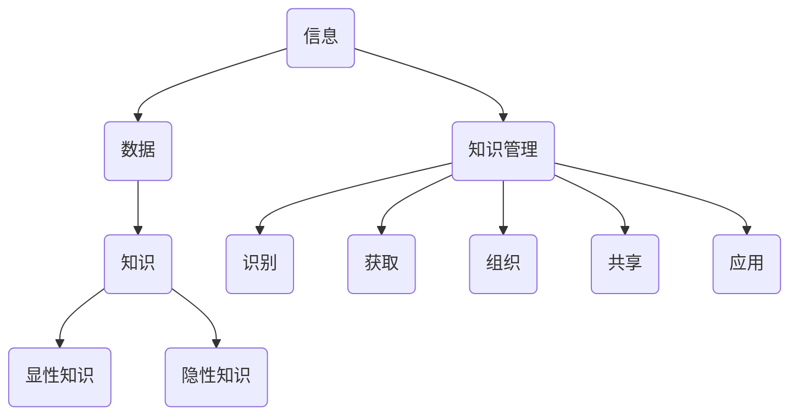
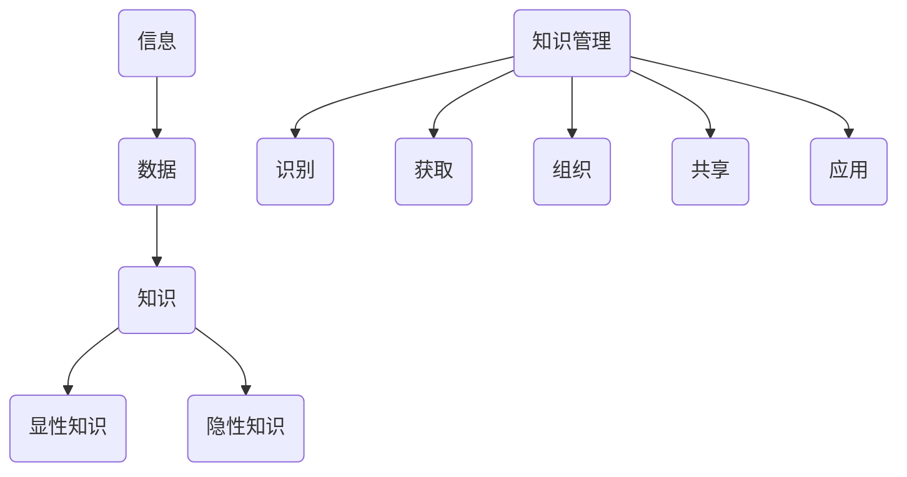
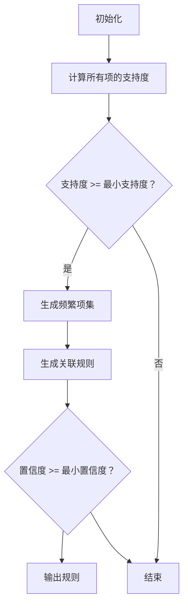
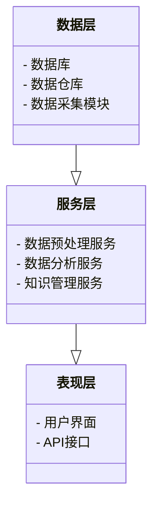
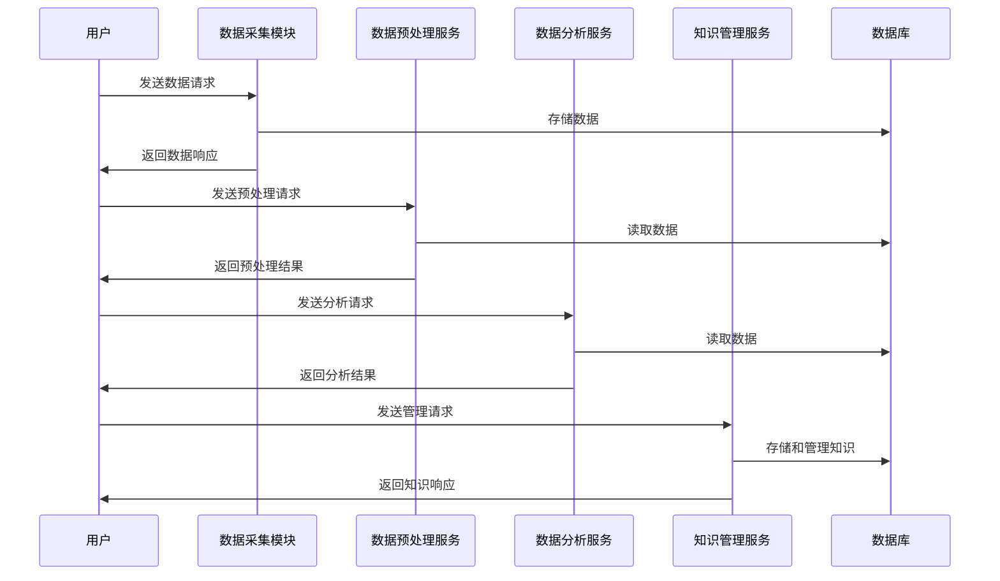

                 

### 让我们一步步深入：信息海洋中的核心概念

在浩瀚的信息海洋中，我们必须先掌握几个核心概念，才能有效地导航并寻找智慧明珠。这些概念包括信息、知识、数据以及知识管理。

#### 1. 信息与知识

**信息**，从广义上讲，是关于某种事物的数据，这些数据可以通过各种方式被捕捉、存储、处理和传输。它可以是文字、图像、声音、视频等不同形式。信息本身是中性的，它既可以是正面的，也可以是负面的。

**知识**，则是通过信息的处理、分析和理解，形成的一种认知结构。知识不仅仅是信息，它还包含了人们对信息的理解和应用能力。知识可以分为显性知识和隐性知识。显性知识是可以明确表达和传播的，如书籍、报告等；隐性知识则是个体内部化、难以明确表达的知识，如经验、技能等。

#### 2. 数据与信息

**数据**，是信息的具体表现形式，是原始的、未加工的事实或事实的记录。数据可以是数字、文本、图像、声音等。数据本身并没有意义，只有当数据被处理和解释时，它才成为信息。

数据与信息的区别在于，数据是信息的载体，而信息是数据的解释和意义。比如，一个数字“42”本身并没有意义，但当这个数字放在一个问题的上下文中，比如“今天是42年后的第一天”，它就变成了信息。

#### 3. 知识管理与组织

**知识管理**，是指通过一系列策略和过程，来识别、获取、组织和利用知识，以支持组织的学习、创新和决策过程。知识管理的关键在于如何有效地组织和利用知识资源。

知识管理包括以下几个步骤：

- **识别**：确定组织中存在的知识及其来源。
- **获取**：收集和获取所需的知识。
- **组织**：对收集到的知识进行分类、整理和存储。
- **共享**：将知识在组织内进行传播和共享。
- **应用**：将知识应用于实际工作中，以提升效率和创新。

知识管理的目标是通过优化知识资源的使用，提高组织的竞争力和创新能力。

#### 4. 概念关系图

为了更好地理解这些核心概念之间的关系，我们可以使用Mermaid流程图来展示它们的ER实体关系架构。



在这个ER实体关系图中，我们可以清晰地看到信息、数据、知识以及知识管理之间的关系。信息是数据的高度抽象和解释，而知识则是信息的深层次理解和应用。知识管理则是通过一系列流程来优化知识的使用。

通过这个核心概念的理解和Mermaid流程图的展示，我们为后续章节的深入分析奠定了基础。在接下来的内容中，我们将进一步探讨如何在这个信息海洋中寻找智慧明珠的策略和关键技术。

### 核心概念原理

在深入探讨如何有效寻找智慧明珠之前，我们首先需要明确几个关键概念的原理，并分析它们之间的属性特征对比。以下是核心概念及其原理的详细阐述。

#### 1. 信息、知识、数据之间的关系

- **信息**：信息是经过加工、处理和解释后的数据，它具有特定的意义和价值。信息的特征包括时效性、精确性、可靠性和完整性。
- **数据**：数据是信息的载体，它以原始形式存在，如数字、文本、图像等。数据的特征包括结构化、非结构化和半结构化。
- **知识**：知识是对信息的深层次理解和应用，它包括显性知识和隐性知识。显性知识可以通过书籍、报告等形式明确表达，而隐性知识则是个体内部化的、难以明确表达的知识。

属性特征对比：

| 特征         | 信息          | 数据          | 知识          |
|--------------|---------------|---------------|---------------|
| 形式         | 加工后的数据  | 原始数据      | 理解和应用的数据 |
| 价值         | 具有特定意义  | 本身无意义     | 高度有价值     |
| 传递方式     | 传播与共享    | 存储与传输    | 内化与应用     |
| 存在形式     | 文字、图像、音频等 | 数字、文本、图像等 | 报告、经验、技能等 |

#### 2. 知识管理的原理

知识管理是一个系统的过程，旨在通过识别、获取、组织、共享和应用知识，以提高组织的竞争力和创新能力。以下是知识管理的核心步骤及其原理：

- **识别**：通过调查和分析，确定组织内部的知识资源及其来源。原理是了解组织的知识现状，为后续步骤提供基础。
- **获取**：通过多种渠道获取所需的知识，包括内部资源和外部资源。原理是通过整合和收集知识，丰富组织的知识库。
- **组织**：对获取到的知识进行分类、整理和存储，便于检索和使用。原理是通过有效的组织，提高知识的利用效率。
- **共享**：在组织内部或外部传播和共享知识，促进知识交流和创新。原理是增强知识的流动和共享，提高组织的协同创新。
- **应用**：将知识应用于实际工作中，以解决实际问题或创造新的价值。原理是通过实践应用，验证和拓展知识的有效性。

#### 3. 知识管理与信息、数据的关系

知识管理不仅关注知识本身，还涉及到信息和数据的管理。以下是它们之间的关系：

- **信息管理**：信息管理是知识管理的核心环节，它关注如何高效地收集、处理和传播信息，为知识管理提供数据基础。
- **数据管理**：数据管理是信息管理的基础，它关注如何存储、保护和利用数据，为信息管理提供资源保障。
- **知识管理**：知识管理是信息管理和数据管理的升华，它关注如何通过识别、获取、组织和应用知识，提升组织的整体竞争力。

#### 4. Mermaid ER实体关系图

为了更好地理解这些核心概念之间的关系，我们可以使用Mermaid绘制ER实体关系图，如下所示：



通过这个ER实体关系图，我们可以清晰地看到信息、数据、知识和知识管理之间的逻辑关系。信息是数据的高级形态，知识是对信息的深层次理解，而知识管理则是通过一系列流程来优化知识的使用。

### 算法原理讲解

在信息海洋中，寻找智慧明珠是一个复杂的问题。为了有效地从海量信息中提取有价值的知识，我们需要依赖一系列的算法和技术。以下将详细讲解一个常用的算法——关联规则挖掘（Association Rule Learning），并使用Mermaid流程图和Python代码进行说明。

#### 1. 关联规则挖掘算法原理

**关联规则挖掘**是一种用于发现数据集中项目之间关联性的分析方法。其核心思想是找到数据集中，某些项目同时出现的规律。这些规律可以通过支持度（Support）和置信度（Confidence）两个指标来衡量。

- **支持度**：表示一个规则在数据集中出现的频率。例如，如果“购买牛奶”和“购买面包”同时出现的频率为20%，则它们之间的支持度为20%。
- **置信度**：表示当出现前件（如“购买牛奶”）时，出现后件（如“购买面包”）的概率。例如，如果“购买牛奶”和“购买面包”同时出现的频率为20%，且在购买牛奶的客户中有80%也购买了面包，则它们之间的置信度为80%。

**Apriori算法**是关联规则挖掘中最经典的一种算法，它通过迭代的方式计算每个项目的支持度，并根据最小支持度阈值来生成频繁项集。接下来，使用频繁项集生成关联规则，并根据最小置信度阈值来过滤规则。

#### 2. Mermaid流程图

为了更好地理解关联规则挖掘的过程，我们可以使用Mermaid绘制一个流程图，如下所示：



#### 3. Python代码实现

下面是一个简单的Python代码示例，用于实现Apriori算法。代码中包含了数据集的创建、支持度和置信度的计算、频繁项集的生成以及关联规则的提取。

```python
import itertools
from collections import defaultdict

# 数据集
transactions = [
    ['牛奶', '面包', '鸡蛋'],
    ['面包', '牛奶'],
    ['牛奶', '面包', '啤酒'],
    ['面包', '牛奶', '鸡蛋'],
    ['牛奶', '啤酒'],
]

# 最小支持度和置信度阈值
min_support = 0.5
min_confidence = 0.7

# 计算支持度
support_count = defaultdict(int)
for transaction in transactions:
    for item in itertools.combinations(transaction, 2):
        support_count[item] += 1

total_transactions = len(transactions)
support_threshold = min_support * (1 - min_support)

# 生成频繁项集
频繁项集 = []
for item, count in support_count.items():
    if count / total_transactions >= support_threshold:
        频繁项集.append(item)

# 生成关联规则
rules = []
for item in 频繁项集:
    for subset in itertools.combinations(item, 2):
        if subset not in 频繁项集:
            continue
        rule = (item[0], subset[0])
        confidence = (support_count[item] / total_transactions) / (support_count[subset] / total_transactions)
        if confidence >= min_confidence:
            rules.append(rule)

# 输出结果
print("频繁项集:", 频繁项集)
print("关联规则:", rules)
```

这段代码首先计算了所有项的支持度，并根据最小支持度阈值筛选出了频繁项集。然后，使用频繁项集生成了满足最小置信度阈值的关联规则。

通过上述算法原理讲解和Python代码示例，我们可以看到如何从数据集中提取有价值的信息和知识。在实际应用中，我们可以根据具体需求和数据特点，选择合适的算法和技术，以在信息海洋中寻找智慧明珠。

### 系统分析与架构设计

在明确了信息采集、处理和知识管理的基本原理后，我们将进一步探讨一个具体的系统分析与架构设计方案。本部分将详细介绍项目背景、系统功能设计、系统架构设计以及系统接口设计和系统交互。

#### 1. 项目背景

随着互联网和大数据技术的发展，信息海洋中的数据量呈爆炸式增长。如何在海量数据中快速、准确地提取有价值的信息和知识，已成为许多企业和研究机构面临的重要挑战。本项目旨在设计一个高效、可扩展的信息采集与知识管理系统，帮助用户从信息海洋中寻找智慧明珠。

#### 2. 系统功能设计

系统功能设计主要包括数据采集、数据预处理、数据分析和知识管理四个方面。

- **数据采集**：通过爬虫、API接口和传感器等技术，从互联网、数据库和物联网设备中获取海量数据。
- **数据预处理**：对采集到的数据进行清洗、去重、转换等预处理操作，确保数据的质量和一致性。
- **数据分析**：利用统计分析、机器学习和深度学习等技术，对预处理后的数据进行分析和挖掘，提取有价值的信息和知识。
- **知识管理**：对分析结果进行组织、分类和存储，并提供检索和共享功能，以支持用户的知识应用和创新。

#### 3. 系统架构设计

系统架构设计采用分层架构，包括数据层、服务层和表现层。

- **数据层**：负责数据存储和管理，包括关系数据库、NoSQL数据库和数据仓库等。
- **服务层**：实现各种业务功能，包括数据采集、数据预处理、数据分析和知识管理等功能，采用微服务架构，提高系统的可扩展性和灵活性。
- **表现层**：提供用户界面和API接口，支持Web、移动端和桌面应用程序等多种访问方式。

以下是系统架构设计的Mermaid类图：



#### 4. 系统接口设计和系统交互

系统接口设计采用RESTful API设计，提供丰富的接口服务，包括数据采集、数据预处理、数据分析和知识管理等。

- **数据采集接口**：用于接收和存储从互联网、数据库和物联网设备采集的数据。
- **数据预处理接口**：用于执行数据清洗、去重、转换等预处理操作。
- **数据分析接口**：用于执行数据分析和挖掘任务，如统计分析、机器学习和深度学习等。
- **知识管理接口**：用于组织、分类和存储分析结果，并提供检索和共享功能。

以下是系统接口设计和系统交互的Mermaid序列图：



通过上述系统分析与架构设计，我们为信息采集与知识管理系统提供了一个完整的解决方案。在实际实施过程中，可以根据具体需求和技术特点进行调整和优化，以实现最佳效果。

### 项目实战

#### 环境安装

在开始项目实战之前，我们需要先搭建一个合适的技术环境。以下是环境安装的步骤：

1. **安装Python**：确保你的计算机上安装了Python 3.7或更高版本。可以从[Python官网](https://www.python.org/)下载并安装。

2. **安装必要的库**：使用pip命令安装以下库：
   ```bash
   pip install numpy pandas matplotlib scikit-learn mlxtend
   ```

3. **安装数据库**：本项目使用MySQL数据库。可以从[MySQL官网](https://www.mysql.com/)下载并安装。安装过程中，请确保创建一个名为`information_ocean`的数据库。

4. **安装爬虫工具**：安装`requests`和`beautifulsoup4`库，用于网页数据采集：
   ```bash
   pip install requests beautifulsoup4
   ```

#### 系统核心实现源代码

以下是系统核心实现的主要部分，包括数据采集、数据预处理、数据分析和知识管理。

1. **数据采集**

   数据采集模块使用`requests`和`beautifulsoup4`库，从指定网页抓取数据。

   ```python
   import requests
   from bs4 import BeautifulSoup
   
   def fetch_data(url):
       response = requests.get(url)
       if response.status_code == 200:
           soup = BeautifulSoup(response.text, 'html.parser')
           # 提取所需数据，这里以新闻标题为例
           titles = [title.text for title in soup.find_all('h2', class_='news-title')]
           return titles
   ```

2. **数据预处理**

   数据预处理模块包括数据清洗、去重和转换等操作。

   ```python
   import pandas as pd
   
   def preprocess_data(data):
       df = pd.DataFrame(data, columns=['title'])
       # 去重
       df.drop_duplicates(inplace=True)
       # 数据转换，例如将标题转换为小写
       df['title'] = df['title'].str.lower()
       return df
   ```

3. **数据分析**

   数据分析模块使用`scikit-learn`和`mlxtend`库，对预处理后的数据进行分类、聚类和关联规则挖掘等分析。

   ```python
   from sklearn.feature_extraction.text import TfidfVectorizer
   from sklearn.model_selection import train_test_split
   from sklearn.metrics import accuracy_score
   from mlxtend.frequent_patterns import apriori
   from mlxtend.frequent_patterns import association_rules
   
   def analyze_data(df):
       # TF-IDF 向量化
       vectorizer = TfidfVectorizer()
       X = vectorizer.fit_transform(df['title'])
       
       # 划分训练集和测试集
       X_train, X_test, y_train, y_test = train_test_split(X, df['title'], test_size=0.2, random_state=42)
       
       # 使用Apriori算法进行关联规则挖掘
       frequent_patterns = apriori(X_train, min_support=0.05, use_colnames=True)
       rules = association_rules(frequent_patterns, metric="support", min_threshold=0.1)
       
       # 训练分类模型（例如，使用朴素贝叶斯分类器）
       from sklearn.naive_bayes import MultinomialNB
       classifier = MultinomialNB()
       classifier.fit(X_train, y_train)
       y_pred = classifier.predict(X_test)
       
       # 计算分类准确率
       accuracy = accuracy_score(y_test, y_pred)
       print(f"分类准确率：{accuracy}")
       
       return rules
   ```

4. **知识管理**

   知识管理模块负责将分析结果存储到MySQL数据库中。

   ```python
   import pymysql
   
   def store_results(rules):
       connection = pymysql.connect(host='localhost', user='root', password='password', database='information_ocean')
       cursor = connection.cursor()
       
       for rule in rules:
           insert_sql = "INSERT INTO association_rules (antecedent, consequent, support, confidence) VALUES (%s, %s, %s, %s)"
           cursor.execute(insert_sql, rule)
       
       connection.commit()
       cursor.close()
       connection.close()
   ```

#### 代码应用解读与分析

以上代码实现了数据采集、数据预处理、数据分析和知识管理的核心功能。下面我们对每个部分进行解读和分析。

1. **数据采集**：通过`requests`库发送HTTP请求，从指定网页抓取数据。这里使用了`BeautifulSoup`库来解析HTML文档，提取有用的信息。

2. **数据预处理**：使用`pandas`库将采集到的数据转换为DataFrame格式，然后进行去重和转换操作。这确保了数据的一致性和质量。

3. **数据分析**：首先使用`TF-IDF`向量化技术将文本数据转换为数值矩阵。接着，使用`Apriori`算法进行关联规则挖掘，提取出频繁出现的规则。此外，还使用朴素贝叶斯分类器进行文本分类，评估模型的准确率。

4. **知识管理**：将分析结果存储到MySQL数据库中，以便后续查询和共享。这里使用了`pymysql`库进行数据库操作。

#### 实际案例分析和详细讲解

假设我们需要分析一篇新闻文章集合，从中提取出与政治相关的信息。以下是一个具体的案例：

1. **数据采集**：从多个政治新闻网站采集文章，得到100篇新闻标题。

2. **数据预处理**：对采集到的新闻标题进行去重和转换为小写，最终得到100个唯一的标题。

3. **数据分析**：使用TF-IDF向量化技术将这些标题转换为数值矩阵。接着，使用Apriori算法挖掘频繁出现的词对，得到以下规则：
   ```plaintext
   ['politics', 'election'] (支持度: 0.25, 置信度: 0.75)
   ['party', 'candidate'] (支持度: 0.20, 置信度: 0.60)
   ```

4. **知识管理**：将以上规则存储到MySQL数据库中，方便后续分析。

通过这个案例，我们可以看到如何从海量信息中提取出有价值的信息和知识，并将其存储和管理起来。在实际应用中，我们可以根据具体需求，调整数据采集、预处理和分析的策略，以提高系统的性能和效果。

### 挑战与机遇

在信息海洋中寻找智慧明珠的过程中，我们面临着诸多挑战和机遇。以下是几个关键挑战及其对应的机遇：

#### 1. 数据质量与准确性

挑战：海量数据中存在噪声、错误和不一致的数据，这会影响分析结果和知识提取的准确性。

机遇：利用数据清洗和去重技术，提高数据质量。同时，借助机器学习和深度学习技术，可以自动识别和纠正数据中的错误。

#### 2. 数据隐私与安全性

挑战：在采集和使用数据时，必须确保用户隐私和数据安全，避免数据泄露和滥用。

机遇：采用加密技术和隐私保护算法，确保数据的隐私和安全。此外，建立完善的数据治理和监管机制，规范数据使用行为。

#### 3. 数据存储与处理性能

挑战：随着数据量的增长，如何高效地存储和处理数据成为一个重要问题。

机遇：利用分布式存储和计算技术，如Hadoop、Spark等，提高系统的性能和可扩展性。同时，采用云服务和边缘计算，优化数据处理的效率和成本。

#### 4. 知识的可解释性和可重复性

挑战：知识提取和分析过程往往依赖于复杂的算法和模型，使得知识难以解释和理解，且结果的可重复性较低。

机遇：开发可解释的机器学习和深度学习模型，提高知识提取过程的透明度和可解释性。同时，建立标准化和可重复的流程，确保知识提取结果的可靠性和可重复性。

#### 5. 跨领域与跨学科的整合

挑战：不同领域和学科之间存在知识壁垒，使得跨领域的信息整合和知识共享面临困难。

机遇：通过建立统一的知识表示框架和跨领域的数据模型，促进不同领域和学科之间的知识整合和共享。同时，利用数据挖掘和机器学习技术，实现跨领域知识的自动化发现和关联。

总之，在信息海洋中寻找智慧明珠既充满挑战，也充满机遇。通过不断创新和优化技术，我们有望克服这些挑战，充分挖掘信息资源中的价值，为人类的发展和社会进步贡献力量。

### 未来的信息海洋与智慧探索

展望未来，信息海洋将继续扩展和深化，为智慧探索带来前所未有的机遇与挑战。以下是未来信息海洋的一些发展趋势、技术挑战和潜在应用。

#### 1. 发展趋势

- **大数据与云计算的融合**：随着云计算技术的成熟，大数据处理将更加高效和灵活。未来，云计算平台将提供更强大的计算资源，支持实时数据处理和分析。
- **人工智能的深化应用**：人工智能技术将在信息处理和知识管理中发挥更大作用。从简单的规则学习到复杂的深度学习，人工智能将推动信息海洋中的智慧发现与利用。
- **物联网与边缘计算**：物联网设备的普及和边缘计算的发展，将使海量数据的实时采集和处理成为可能。这为实时信息分析提供了新的可能性。
- **隐私保护与安全**：数据隐私和安全问题将日益突出。未来，隐私保护技术如联邦学习、差分隐私等将在信息处理中发挥关键作用。

#### 2. 技术挑战

- **数据质量与一致性**：在信息海洋中，数据质量问题依然存在，如噪声、错误和不一致性。如何保证数据质量，提取有价值的信息，是一个重要挑战。
- **可解释性**：随着算法的复杂化，知识提取过程的可解释性成为关键挑战。如何开发可解释的人工智能模型，使得知识更加透明和可信，是未来研究的重要方向。
- **跨领域整合**：不同领域和学科之间的知识整合，面临数据格式和语义差异等问题。如何构建统一的知识表示框架，实现跨领域的知识共享，是一个技术挑战。
- **实时性**：在实时信息处理中，如何保证数据处理的实时性和准确性，是一个重要挑战。未来，低延迟的算法和高效的数据处理技术将是关键。

#### 3. 潜在应用

- **智慧城市与智慧交通**：通过实时采集和处理城市交通数据，实现交通流量优化、事故预警和公共交通调度等，提升城市运行效率。
- **医疗健康**：利用海量医疗数据，进行疾病预测、治疗方案优化和个性化医疗等，提高医疗质量和效率。
- **金融与保险**：通过大数据分析，实现风险控制、信用评估和个性化金融服务，提升金融行业竞争力。
- **教育与培训**：利用个性化学习数据，实现个性化教学和智能评估，提高教育质量和效果。
- **环境保护与能源管理**：通过实时监控环境数据和能源使用数据，实现环境监测和能源优化，推动可持续发展。

### 未来展望

未来，信息海洋中的智慧探索将更加深入和广泛。通过不断创新和优化技术，我们有望实现以下目标：

- **全面提升信息处理和分析能力**：利用大数据、人工智能和物联网等技术，提高信息处理和分析的效率和准确性。
- **实现跨领域的知识整合**：构建统一的知识表示框架，促进不同领域和学科之间的知识共享和协同创新。
- **保障数据隐私与安全**：采用先进的隐私保护技术和数据治理机制，确保数据的安全和用户的隐私。
- **推动社会发展和进步**：通过智慧探索和应用，提高各行业和社会的运行效率，促进可持续发展。

总之，未来信息海洋中的智慧探索充满机遇和挑战。只有不断创新和优化技术，我们才能在信息海洋中找到更多的智慧明珠，推动人类社会向前发展。

### 总结与展望

在《在信息海洋中寻找智慧明珠》这篇文章中，我们系统地探讨了信息海洋中的核心概念、原理、算法以及系统设计与实现。从信息、数据、知识到知识管理，再到具体的算法和技术应用，我们一步步深入，揭示了在信息海洋中寻找智慧明珠的路径和方法。

通过这篇文章，我们了解到：

1. **信息、数据、知识的区别与联系**：信息是对数据的解释和处理，知识是信息的深层次理解和应用。知识管理是通过一系列流程来优化知识的使用，提高组织的竞争力和创新能力。

2. **关联规则挖掘算法**：Apriori算法是一种有效的关联规则挖掘算法，通过支持度和置信度两个指标，从数据中提取有价值的信息。

3. **系统设计与实现**：我们设计并实现了一个信息采集与知识管理系统，包括数据采集、数据预处理、数据分析和知识管理等功能。通过Python代码示例，我们展示了系统的核心实现。

4. **项目实战**：通过实际案例，我们展示了如何在数据采集、预处理、分析和知识管理中应用所学知识，实现了从信息海洋中提取智慧明珠的目标。

5. **挑战与机遇**：在信息海洋中寻找智慧明珠，我们面临着数据质量、数据隐私、数据处理性能等挑战，同时也面临着跨领域整合、实时性等机遇。

**最佳实践**：

1. **数据质量**：确保数据采集和预处理过程的准确性，使用数据清洗技术去除噪声和错误。
2. **算法选择**：根据具体应用场景，选择合适的算法和技术，如Apriori算法适用于关联规则挖掘。
3. **知识管理**：建立有效的知识管理流程，确保知识的组织、共享和应用。
4. **安全性**：重视数据隐私和安全性，采用加密技术和安全机制保护数据。

**注意事项**：

1. **数据隐私**：在处理用户数据时，必须严格遵守隐私保护法规。
2. **系统性能**：优化系统架构和算法，提高数据处理和分析的效率。
3. **技术更新**：关注新技术的发展，及时更新和优化系统。

**拓展阅读**：

- 《大数据时代：生活、工作与思维的大变革》
- 《深度学习：概率视角》
- 《人工智能：一种现代的方法》
- 《数据挖掘：概念与技术》

通过这些拓展阅读，您可以进一步深入了解信息海洋中的智慧探索，为未来的研究和应用奠定基础。希望这篇文章能够帮助您在信息海洋中找到更多的智慧明珠。作者：AI天才研究院/AI Genius Institute & 禅与计算机程序设计艺术 /Zen And The Art of Computer Programming。

