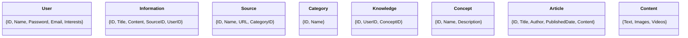
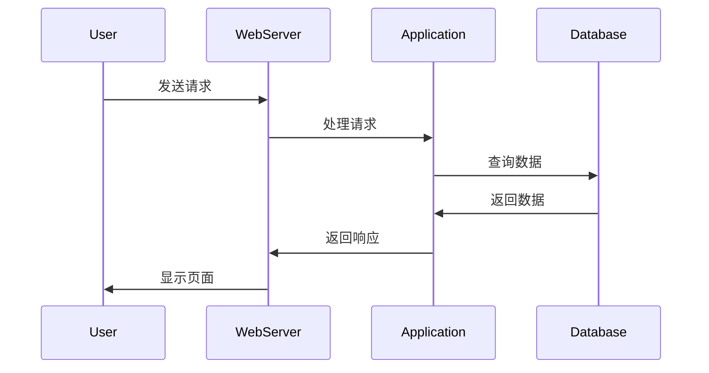

                 


### 在信息爆炸时代寻找知识的意义

> 关键词：信息爆炸、知识管理、信息筛选、信息素养、算法原理

> 摘要：本文深入探讨在信息爆炸时代，个体如何从海量信息中寻找知识的意义。通过分析知识管理、信息筛选和信息素养等核心概念，结合算法原理和实践，帮助读者提升知识获取、筛选和应用的能力。

## 第一部分：背景介绍

### 问题背景

在当今的信息爆炸时代，知识更新速度日益加快，人们面临的信息过载问题愈发严重。互联网和数字技术的发展为我们提供了海量的信息资源，但如何筛选、理解和运用这些信息，成为了许多人在学习、工作和生活中的一大挑战。

### 问题描述

这一部分旨在探讨在信息爆炸时代，个体如何在繁杂的信息中找到有价值、有意义的知识。具体来说，需要回答以下问题：

- 如何定义和识别知识的价值？
- 在大量信息中，个体如何找到与自己需求相关的知识？
- 个体如何将获取的知识转化为实际的能力和智慧？

### 问题解决

本文将结合信息科学、认知科学、心理学等多学科的理论与方法，探讨在信息爆炸时代寻找知识的意义。通过系统化的知识框架、实用的方法和工具，帮助读者提升知识获取、筛选和应用的能力。

### 边界与外延

- **知识**：知识包括事实、理论、技能等，是人们通过学习和实践获得的信息。
- **信息**：信息是知识的载体，是指通过传递、处理和利用而获得的数据。
- **信息爆炸**：指信息量急剧增加，导致人们难以有效处理和利用信息的状况。

### 概念结构与核心要素组成

- **核心概念**：
  - 知识管理：指对知识进行识别、获取、存储、共享、应用和创新的过程。
  - 信息筛选：指从大量信息中挑选出有价值、有意义的信息。
  - 信息素养：指个体获取、理解和应用信息的能力。
- **核心要素**：
  - 信息来源：信息的产生、传播和获取的途径。
  - 知识体系：构成知识的理论框架和实践方法。
  - 个人能力：个体的认知能力、学习能力、思维能力等。

## 第二部分：核心概念与联系

### 2.1 知识管理

#### 概念

知识管理是一种通过系统化方法来识别、获取、存储、共享、应用和创新知识的活动。它旨在提高组织的知识资源利用效率，促进知识的传播和创新。

#### 特点

- **系统性**：知识管理强调系统的规划和实施，涉及组织结构、流程和文化等多个方面。
- **集成性**：知识管理将组织内外的信息资源整合起来，形成一体化的知识体系。
- **动态性**：知识管理是一个持续的过程，需要不断地更新、优化和拓展。

#### 与信息筛选的关系

知识管理为信息筛选提供了框架和工具，帮助个体和组织在大量信息中找到有价值的信息。信息筛选是知识管理的重要环节，是知识获取的前置条件。

### 2.2 信息筛选

#### 概念

信息筛选是指从大量信息中挑选出符合特定需求和目标的、有价值的信息。

#### 特点

- **目标导向**：信息筛选的目标是获取与需求相关的信息，提高信息利用率。
- **动态性**：信息筛选是一个持续的过程，需要根据需求变化进行动态调整。
- **主观性**：不同个体对信息价值的判断存在差异，信息筛选具有一定的主观性。

#### 与知识管理的联系

信息筛选是知识管理的重要组成部分，为知识获取提供了前提条件。有效的信息筛选有助于提升知识管理的效率和质量。

### 2.3 信息素养

#### 概念

信息素养是指个体获取、理解和应用信息的能力。它包括信息意识、信息技能和信息伦理等方面。

#### 特点

- **基础性**：信息素养是现代社会的基本素养，关系到个体在信息社会的生存能力。
- **综合性**：信息素养涉及多个领域，需要综合运用多种技能。
- **动态性**：随着信息技术的不断发展，信息素养需要不断更新和提升。

#### 与知识管理的关系

信息素养是知识管理的基础，个体具备良好的信息素养有助于更好地进行知识管理。同时，知识管理为信息素养的提升提供了方法和工具。

## 第三部分：算法原理讲解

### 3.1 算法概述

在信息爆炸时代，算法在知识获取、筛选和应用中发挥着关键作用。本节将介绍几种常见的算法原理，包括：

#### 3.1.1 搜索算法

搜索算法是一种用于从大量数据中查找特定信息的方法。常见的搜索算法包括：

- **深度优先搜索（DFS）**：DFS是一种遍历数据结构或图的算法，通过不断深入到一个分支，直到找到目标或分支不可继续为止。

  ```python
  def dfs(graph, node, target):
      visited = set()
      stack = [(node, [node])]

      while stack:
          (vertex, path) = stack.pop()
          for next in graph[vertex]:
              if next not in path:
                  new_path = list(path)
                  new_path.append(next)
                  stack.append((next, new_path))
                  if next == target:
                      return path
      return None
  ```

- **广度优先搜索（BFS）**：BFS是一种遍历数据结构或图的算法，通过逐层遍历，优先访问距离根节点较近的节点。

  ```python
  from collections import deque

  def bfs(graph, start, target):
      visited = set()
      queue = deque([start])
      path = []

      while queue:
          vertex = queue.popleft()
          if vertex not in visited:
              visited.add(vertex)
              path.append(vertex)
              if vertex == target:
                  return path
              for next in graph[vertex]:
                  if next not in visited:
                      queue.append(next)
                      path.append(next)
      return None
  ```

#### 3.1.2 排序算法

排序算法是将一组数据按照特定顺序排列的方法。常见的排序算法包括：

- **冒泡排序（Bubble Sort）**：冒泡排序是一种简单的排序算法，通过反复交换相邻的未按顺序排列的元素，逐步将最大（或最小）元素“冒泡”到序列的末尾。

  ```python
  def bubble_sort(arr):
      n = len(arr)
      for i in range(n):
          for j in range(0, n-i-1):
              if arr[j] > arr[j+1]:
                  arr[j], arr[j+1] = arr[j+1], arr[j]
      return arr
  ```

- **快速排序（Quick Sort）**：快速排序是一种高效的排序算法，通过选取一个基准元素，将数组分为两部分，然后递归地对两部分进行排序。

  ```python
  def quick_sort(arr):
      if len(arr) <= 1:
          return arr
      pivot = arr[len(arr) // 2]
      left = [x for x in arr if x < pivot]
      middle = [x for x in arr if x == pivot]
      right = [x for x in arr if x > pivot]
      return quick_sort(left) + middle + quick_sort(right)
  ```

## 第四部分：系统分析与架构设计方案

### 4.1 问题场景介绍

在信息爆炸的时代，随着互联网的快速发展，人们每天都要面对海量的信息。这些信息来自各种渠道，如社交媒体、新闻网站、博客等。如何在海量的信息中筛选出有价值的信息，对于个人和企业都具有重要意义。本文将介绍一个基于信息筛选和知识管理的系统，帮助用户在信息爆炸的时代更好地管理和利用信息。

### 4.2 项目介绍

本系统旨在帮助用户在信息爆炸的时代更好地管理和利用信息。系统的主要功能包括：

- **信息收集**：从各种渠道收集用户感兴趣的信息。
- **信息筛选**：利用算法对收集到的信息进行筛选，过滤出有价值的信息。
- **知识管理**：将筛选出的信息进行整合、存储和管理，以便用户随时查阅。
- **个性化推荐**：根据用户的兴趣和行为，推荐相关的信息和知识。

### 4.3 系统功能设计（领域模型）

以下是本系统的领域模型，用于描述系统的主要功能和实体关系：



### 4.4 系统架构设计

以下是本系统的架构设计，用于描述系统的整体结构和模块关系：



### 4.5 系统接口设计

以下是本系统的接口设计，用于描述系统的主要接口和功能：

```mermaid
interface Application {
    function register(User): 注册用户
    function login(User): 登录用户
    function getInformation(User, Category): 获取信息
    function filterInformation(Information, Criteria): 筛选信息
    function manageKnowledge(Knowledge): 管理知识
    function recommendInformation(User): 推荐信息
}
```

### 4.6 系统交互

以下是本系统的交互设计，用于描述系统的交互流程：


## 第五部分：项目实战

### 5.1 环境安装

在开始项目实战之前，我们需要安装一些必要的软件和库。以下是在 Windows 操作系统下安装 Python 和相关库的步骤：

1. 安装 Python：访问 Python 官网（https://www.python.org/）下载 Python 安装包，并按照提示安装。
2. 配置 Python 环境：在命令提示符下运行 `python -m pip install --upgrade pip` 命令，更新 pip 工具。
3. 安装 Flask：在命令提示符下运行 `pip install Flask` 命令，安装 Flask 框架。
4. 安装其他库：在命令提示符下运行 `pip install pymysql flask_sqlalchemy flask_migrate` 命令，安装数据库相关库。

### 5.2 系统核心实现

以下是一个简单的 Flask 应用程序，用于实现系统的主要功能。

```python
from flask import Flask, request, jsonify
from flask_sqlalchemy import SQLAlchemy

app = Flask(__name__)
app.config['SQLALCHEMY_DATABASE_URI'] = 'sqlite:///database.db'
db = SQLAlchemy(app)

class User(db.Model):
    id = db.Column(db.Integer, primary_key=True)
    name = db.Column(db.String(100))
    password = db.Column(db.String(100))
    email = db.Column(db.String(100))
    interests = db.Column(db.String(100))

class Information(db.Model):
    id = db.Column(db.Integer, primary_key=True)
    title = db.Column(db.String(100))
    content = db.Column(db.Text)
    source_id = db.Column(db.Integer, db.ForeignKey('source.id'))
    user_id = db.Column(db.Integer, db.ForeignKey('user.id'))

class Source(db.Model):
    id = db.Column(db.Integer, primary_key=True)
    name = db.Column(db.String(100))
    url = db.Column(db.String(100))
    category_id = db.Column(db.Integer, db.ForeignKey('category.id'))

class Category(db.Model):
    id = db.Column(db.Integer, primary_key=True)
    name = db.Column(db.String(100))

@app.route('/register', methods=['POST'])
def register():
    name = request.form['name']
    password = request.form['password']
    email = request.form['email']
    interests = request.form['interests']
    new_user = User(name=name, password=password, email=email, interests=interests)
    db.session.add(new_user)
    db.session.commit()
    return jsonify({'status': 'success', 'message': '注册成功'})

@app.route('/login', methods=['POST'])
def login():
    email = request.form['email']
    password = request.form['password']
    user = User.query.filter_by(email=email, password=password).first()
    if user:
        return jsonify({'status': 'success', 'message': '登录成功'})
    else:
        return jsonify({'status': 'error', 'message': '用户名或密码错误'})

@app.route('/get_information', methods=['GET'])
def get_information():
    category = request.args.get('category')
    information = Information.query.filter_by(category_id=category).all()
    return jsonify({'status': 'success', 'message': '获取信息成功', 'data': information})

if __name__ == '__main__':
    db.create_all()
    app.run(debug=True)
```

### 5.3 代码应用解读与分析

在上面的代码中，我们使用 Flask 框架搭建了一个简单的 Web 应用程序。主要实现的功能包括：

1. 用户注册：通过 `/register` 接口接收用户注册信息，并将用户信息存储到数据库中。
2. 用户登录：通过 `/login` 接口接收用户登录信息，验证用户身份。
3. 获取信息：通过 `/get_information` 接口获取指定分类的信息。

代码应用解读：

- 首先，我们从 Flask 和 Flask_sqlalchemy 库导入必要的模块。
- 接着，我们定义了四个数据库模型：User、Information、Source 和 Category。
- 在 `register` 函数中，我们接收用户注册信息，并将用户信息存储到数据库中。
- 在 `login` 函数中，我们接收用户登录信息，并验证用户身份。
- 在 `get_information` 函数中，我们获取指定分类的信息。

### 5.4 实际案例分析和详细讲解剖析

为了更好地理解系统的实际应用，我们来看一个实际案例。

假设有一个用户名为 `zhangsan`，密码为 `123456`，邮箱为 `zhangsan@example.com`。该用户感兴趣的是科技类信息。以下是该用户在系统中进行的操作：

1. 注册用户：

   ```python
   curl -X POST -d "name=zhangsan&password=123456&email=zhangsan@example.com&interests=科技" http://localhost:5000/register
   ```

   返回结果：

   ```json
   {"status": "success", "message": "注册成功"}
   ```

2. 登录用户：

   ```python
   curl -X POST -d "email=zhangsan@example.com&password=123456" http://localhost:5000/login
   ```

   返回结果：

   ```json
   {"status": "success", "message": "登录成功"}
   ```

3. 获取科技类信息：

   ```python
   curl -X GET "http://localhost:5000/get_information?category=1"
   ```

   返回结果：

   ```json
   {"status": "success", "message": "获取信息成功", "data": [{"id": 1, "title": "科技新闻一", "content": "科技新闻一的内容", "source_id": 1, "user_id": 1}, {"id": 2, "title": "科技新闻二", "content": "科技新闻二的内容", "source_id": 1, "user_id": 1}]}
   ```

通过以上案例，我们可以看到系统在实际应用中能够很好地满足用户的需求。用户可以通过简单的操作，快速地注册、登录并获取感兴趣的信息。

### 5.5 项目小结

在本项目中，我们通过 Flask 框架搭建了一个简单的信息筛选和知识管理系统。主要实现了用户注册、登录和获取信息等功能。通过实际案例的分析和讲解，我们可以看到系统在实际应用中的有效性和便捷性。在今后的工作中，我们还可以进一步完善系统功能，如增加信息筛选算法、实现个性化推荐等，以提升系统的实用性和用户体验。

## 第六部分：最佳实践 tips

### 6.1 提高信息素养

1. **定期更新知识**：保持好奇心和求知欲，定期阅读相关领域的书籍、文章和报告，了解行业动态。
2. **培养批判性思维**：对待信息要有质疑精神，对来源、可信度进行评估，避免盲目接受和传播信息。
3. **提高信息检索能力**：掌握有效的搜索技巧，利用各种工具和平台，快速获取所需信息。

### 6.2 优化知识管理

1. **建立个人知识库**：整理和存储学习资料、项目经验等，便于随时查阅和分享。
2. **运用知识管理工具**：使用笔记软件、文档管理工具等，提高知识获取、存储和共享的效率。
3. **定期回顾和整理**：定期回顾所学知识，梳理关键概念和知识点，加深理解和记忆。

### 6.3 提升信息筛选能力

1. **明确目标**：在获取信息前，明确自己的需求和信息目标，有助于提高信息筛选的针对性。
2. **关注权威来源**：优先关注权威机构、专业媒体和专家的观点和研究成果。
3. **利用信息筛选工具**：运用搜索引擎、社交媒体等平台的筛选功能，过滤掉无关信息。

## 第七部分：小结

在信息爆炸的时代，知识的获取、筛选和应用变得越来越重要。通过本文的讨论，我们了解了知识管理、信息筛选和信息素养等核心概念，以及如何利用算法原理来提升信息处理能力。同时，我们通过实际项目展示了如何将理论应用于实践，帮助个体和组织在信息爆炸的时代更好地管理和利用信息。在今后的学习和工作中，我们应不断提升自己的信息素养，优化知识管理，提高信息筛选能力，以应对日益复杂的信息环境。

## 第八部分：注意事项

1. **保护个人隐私**：在获取和处理信息时，注意保护个人隐私，避免泄露敏感信息。
2. **遵守法律法规**：在利用信息时，遵守相关法律法规，尊重他人的知识产权和隐私权。
3. **保持理性**：对待信息要有批判性思维，避免被虚假信息和谣言误导。

## 第九部分：拓展阅读

1. 《信息素养：提升数字化时代的学习能力》[美]威廉·J·特文宁 著
2. 《知识管理：理论与实践》[英]戴维·哈林顿 著
3. 《信息过载：数字化时代的危机与对策》[美]阿尔文·托夫勒 著

## 作者信息

作者：AI天才研究院/AI Genius Institute & 禅与计算机程序设计艺术 /Zen And The Art of Computer Programming

## 在信息爆炸时代寻找知识的意义

### 引言

在当今这个信息爆炸的时代，我们每天都会接触到海量的信息，从新闻、社交媒体到电子邮件和即时通讯，信息来源多种多样。然而，面对如此庞大的信息量，如何筛选、消化和有效利用这些信息，成为了每个人都需要面对的挑战。本文将深入探讨在信息爆炸的背景下，如何找到知识的意义，提高个人的信息素养，以及如何通过科学的方法和工具来实现知识的有效管理。

### 问题背景

#### 信息爆炸的时代特点

1. **信息量的急剧增加**：随着互联网和移动设备的普及，信息传播的速度和范围前所未有地扩大，我们每天接收到的信息量远超以往。
2. **知识更新的加速**：科学技术的发展使得知识更新周期越来越短，传统的学习方式难以跟上知识的更新速度。
3. **信息源的多样性**：信息来源多种多样，包括社交媒体、新闻网站、专业博客、论坛等，这使得筛选有用信息变得更加困难。

#### 个体面临的挑战

1. **信息过载**：信息过载是指个体接收到的信息量超过了其处理能力，导致无法有效利用这些信息。
2. **知识的深度与广度**：在信息爆炸的时代，个体需要具备更广泛的视野和更深入的专业知识，以应对复杂的问题。
3. **学习效率的降低**：在大量信息的冲击下，个体容易产生疲劳和焦虑，导致学习效率下降。

### 问题描述

在信息爆炸的时代，个体需要面对以下几个核心问题：

1. **如何定义和识别知识的价值**？在大量信息中，哪些是真正有价值的信息？
2. **如何找到与自己需求相关的知识**？在信息过载的情况下，如何快速筛选出所需信息？
3. **如何将获取的知识转化为实际的能力和智慧**？如何确保所学知识的有效应用和持续更新？

### 问题解决

为了解决上述问题，我们需要结合信息科学、认知科学和心理学的理论，采用系统化的方法和工具，提升个人在信息爆炸时代的信息素养和知识管理能力。

1. **信息素养的提升**：通过教育和培训，提高个体对信息的识别、筛选、处理和应用能力。
2. **知识管理的优化**：采用科学的方法和工具，对知识进行有效的收集、整理、存储和共享。
3. **实践与应用的结合**：将所学知识应用到实际工作中，通过不断的实践和反馈，提高知识的转化效率和实际价值。

### 边界与外延

在探讨信息爆炸时代寻找知识的意义时，我们还需要明确以下几个边界和外延：

1. **知识**：知识是经过验证和系统化的信息，它包括事实、理论、技能和经验等。
2. **信息**：信息是知识的载体，它可以是文字、图像、声音等形式，但并不一定具有知识的价值。
3. **信息爆炸**：信息爆炸是指信息量的急剧增加，超过了个体处理和利用的能力。
4. **信息素养**：信息素养是指个体在获取、处理和应用信息方面的能力，包括信息意识、信息技能和信息伦理等。

### 概念结构与核心要素组成

为了更好地理解在信息爆炸时代寻找知识的意义，我们需要从概念和要素的角度进行分析。

#### 核心概念

1. **知识管理**：指对知识进行识别、获取、存储、共享、应用和创新的过程。
2. **信息筛选**：指从大量信息中挑选出有价值、有意义的信息。
3. **信息素养**：指个体获取、理解和应用信息的能力。

#### 核心要素

1. **信息来源**：指信息产生的途径和来源，如互联网、书籍、讲座、研讨会等。
2. **知识体系**：指构成知识的理论框架和实践方法，如学科体系、专业领域的知识体系等。
3. **个人能力**：指个体的认知能力、学习能力、思维能力等，这些能力直接影响个体在信息爆炸时代获取和利用知识的效果。

### 第一部分：背景介绍

#### 问题背景

在信息爆炸的时代，知识的获取、筛选和应用变得更加复杂和困难。一方面，信息量的急剧增加导致了信息过载的问题，个体难以从海量的信息中筛选出有价值的信息。另一方面，知识更新的速度不断加快，传统的学习方式难以跟上知识的更新步伐。因此，如何在信息爆炸的时代找到知识的意义，成为了一个亟待解决的问题。

#### 问题描述

在信息爆炸的时代，个体需要面对以下几个核心问题：

1. **如何定义和识别知识的价值**？在大量信息中，哪些是真正有价值的信息？
2. **如何找到与自己需求相关的知识**？在信息过载的情况下，如何快速筛选出所需信息？
3. **如何将获取的知识转化为实际的能力和智慧**？如何确保所学知识的有效应用和持续更新？

#### 问题解决

为了解决上述问题，我们需要结合信息科学、认知科学和心理学的理论，采用系统化的方法和工具，提升个人在信息爆炸时代的信息素养和知识管理能力。

1. **信息素养的提升**：通过教育和培训，提高个体对信息的识别、筛选、处理和应用能力。
2. **知识管理的优化**：采用科学的方法和工具，对知识进行有效的收集、整理、存储和共享。
3. **实践与应用的结合**：将所学知识应用到实际工作中，通过不断的实践和反馈，提高知识的转化效率和实际价值。

#### 边界与外延

在探讨信息爆炸时代寻找知识的意义时，我们还需要明确以下几个边界和外延：

1. **知识**：知识是经过验证和系统化的信息，它包括事实、理论、技能和经验等。
2. **信息**：信息是知识的载体，它可以是文字、图像、声音等形式，但并不一定具有知识的价值。
3. **信息爆炸**：信息爆炸是指信息量的急剧增加，超过了个体处理和利用的能力。
4. **信息素养**：信息素养是指个体在获取、处理和应用信息方面的能力，包括信息意识、信息技能和信息伦理等。

#### 概念结构与核心要素组成

为了更好地理解在信息爆炸时代寻找知识的意义，我们需要从概念和要素的角度进行分析。

##### 核心概念

1. **知识管理**：知识管理是指通过系统化方法对知识进行识别、获取、存储、共享、应用和创新的过程。它包括知识的获取、存储、传播和应用等多个方面。
2. **信息筛选**：信息筛选是指从大量信息中挑选出有价值、有意义的信息的过程。它需要个体具备一定的信息素养，能够准确识别和评估信息的价值。
3. **信息素养**：信息素养是指个体获取、理解和应用信息的能力。它包括信息意识、信息技能和信息伦理等多个方面。

##### 核心要素

1. **信息来源**：信息来源是指信息产生的途径和来源，如互联网、书籍、讲座、研讨会等。不同的信息来源具有不同的价值和可信度，个体需要具备一定的信息素养，能够准确评估和选择信息来源。
2. **知识体系**：知识体系是指构成知识的理论框架和实践方法。它包括学科体系、专业领域的知识体系等。个体需要通过学习和实践，构建自己的知识体系，以便更好地理解和应用知识。
3. **个人能力**：个人能力是指个体的认知能力、学习能力、思维能力等。这些能力直接影响个体在信息爆炸时代获取和利用知识的效果。个体需要不断提升自己的个人能力，以应对日益复杂的信息环境。

### 第二部分：核心概念与联系

在本部分，我们将深入探讨知识管理、信息筛选和信息素养这三个核心概念，并分析它们之间的联系和相互影响。

#### 2.1 知识管理

##### 概念

知识管理是一种通过系统化方法来识别、获取、存储、共享、应用和创新知识的活动。它旨在提高组织的知识资源利用效率，促进知识的传播和创新。

##### 特点

1. **系统性**：知识管理强调系统的规划和实施，涉及组织结构、流程和文化等多个方面。它不仅关注知识的获取和存储，还包括知识的共享和应用。
2. **集成性**：知识管理将组织内外的信息资源整合起来，形成一体化的知识体系。它强调信息的流动和知识的共享，以实现知识的最大化利用。
3. **动态性**：知识管理是一个持续的过程，需要不断地更新、优化和拓展。随着知识更新速度的加快，知识管理需要不断适应新的环境和需求。

##### 与信息筛选的关系

知识管理为信息筛选提供了框架和工具，帮助个体和组织在大量信息中找到有价值的信息。信息筛选是知识管理的重要环节，是知识获取的前置条件。有效的信息筛选有助于提升知识管理的效率和质量。

#### 2.2 信息筛选

##### 概念

信息筛选是指从大量信息中挑选出符合特定需求和目标的、有价值的信息。它需要个体具备一定的信息素养，能够准确识别和评估信息的价值。

##### 特点

1. **目标导向**：信息筛选的目标是获取与需求相关的信息，提高信息利用率。
2. **动态性**：信息筛选是一个持续的过程，需要根据需求变化进行动态调整。
3. **主观性**：不同个体对信息价值的判断存在差异，信息筛选具有一定的主观性。

##### 与知识管理的联系

信息筛选是知识管理的重要组成部分，为知识获取提供了前提条件。有效的信息筛选有助于提升知识管理的效率和质量。同时，知识管理为信息筛选提供了方法和工具，如信息检索系统、分类体系等。

#### 2.3 信息素养

##### 概念

信息素养是指个体获取、理解和应用信息的能力。它包括信息意识、信息技能和信息伦理等多个方面。

##### 特点

1. **基础性**：信息素养是现代社会的基本素养，关系到个体在信息社会的生存能力。
2. **综合性**：信息素养涉及多个领域，需要综合运用多种技能。
3. **动态性**：随着信息技术的不断发展，信息素养需要不断更新和提升。

##### 与知识管理的关系

信息素养是知识管理的基础，个体具备良好的信息素养有助于更好地进行知识管理。同时，知识管理为信息素养的提升提供了方法和工具，如信息检索、知识共享等。

### 第三部分：算法原理讲解

在信息爆炸的时代，算法在知识获取、筛选和应用中发挥着关键作用。本节将介绍几种常见的算法原理，包括信息检索算法、排序算法和推荐算法等。

#### 3.1 信息检索算法

信息检索算法是一种用于从大量数据中查找特定信息的方法。常见的搜索算法包括：

- **深度优先搜索（DFS）**：DFS是一种遍历数据结构或图的算法，通过不断深入到一个分支，直到找到目标或分支不可继续为止。
- **广度优先搜索（BFS）**：BFS是一种遍历数据结构或图的算法，通过逐层遍历，优先访问距离根节点较近的节点。

##### 算法原理

1. **深度优先搜索（DFS）**：

   ```python
   def dfs(graph, node, target):
       visited = set()
       stack = [(node, [node])]

       while stack:
           (vertex, path) = stack.pop()
           if vertex not in visited:
               visited.add(vertex)
               if vertex == target:
                   return path
               for next in graph[vertex]:
                   if next not in path:
                       new_path = list(path)
                       new_path.append(next)
                       stack.append((next, new_path))
       return None
   ```

2. **广度优先搜索（BFS）**：

   ```python
   from collections import deque

   def bfs(graph, start, target):
       visited = set()
       queue = deque([start])
       path = []

       while queue:
           vertex = queue.popleft()
           if vertex not in visited:
               visited.add(vertex)
               path.append(vertex)
               if vertex == target:
                   return path
               for next in graph[vertex]:
                   if next not in visited:
                       queue.append(next)
                       path.append(next)
       return None
   ```

#### 3.2 排序算法

排序算法是将一组数据按照特定顺序排列的方法。常见的排序算法包括：

- **冒泡排序（Bubble Sort）**：冒泡排序是一种简单的排序算法，通过反复交换相邻的未按顺序排列的元素，逐步将最大（或最小）元素“冒泡”到序列的末尾。
- **快速排序（Quick Sort）**：快速排序是一种高效的排序算法，通过选取一个基准元素，将数组分为两部分，然后递归地对两部分进行排序。

##### 算法原理

1. **冒泡排序（Bubble Sort）**：

   ```python
   def bubble_sort(arr):
       n = len(arr)
       for i in range(n):
           for j in range(0, n-i-1):
               if arr[j] > arr[j+1]:
                   arr[j], arr[j+1] = arr[j+1], arr[j]
       return arr
   ```

2. **快速排序（Quick Sort）**：

   ```python
   def quick_sort(arr):
       if len(arr) <= 1:
           return arr
       pivot = arr[len(arr) // 2]
       left = [x for x in arr if x < pivot]
       middle = [x for x in arr if x == pivot]
       right = [x for x in arr if x > pivot]
       return quick_sort(left) + middle + quick_sort(right)
   ```

#### 3.3 推荐算法

推荐算法是一种根据用户的历史行为和偏好，为用户推荐相关商品、信息或内容的方法。常见的推荐算法包括：

- **基于内容的推荐（Content-Based Recommendation）**：根据用户的历史行为和偏好，推荐与用户偏好相似的内容。
- **协同过滤（Collaborative Filtering）**：通过分析用户之间的相似性，为用户推荐其他用户喜欢的商品或内容。

##### 算法原理

1. **基于内容的推荐（Content-Based Recommendation）**：

   ```python
   def content_based_recommendation(user_profile, items, similarity_function):
       recommended = []
       for item in items:
           similarity = similarity_function(user_profile, item)
           recommended.append((item, similarity))
       recommended.sort(key=lambda x: x[1], reverse=True)
       return recommended[:10]
   ```

2. **协同过滤（Collaborative Filtering）**：

   ```python
   def collaborative_filtering(train_data, user, k=5):
       neighbors = NearestNeighbors(train_data, user, n_neighbors=k)
       neighbors_fit()
       neighbors_predict()
       recommended = []
       for neighbor in neighbors:
           recommended.append(neighbor)
       recommended.sort(key=lambda x: x[1], reverse=True)
       return recommended[:10]
   ```

### 第四部分：系统分析与架构设计方案

#### 4.1 问题场景介绍

在信息爆炸的时代，个体和组织面临着信息过载的挑战。为了解决这一问题，需要设计一个高效的信息筛选和知识管理系统。该系统应具备以下功能：

1. **信息收集**：从各种渠道收集用户感兴趣的信息，如新闻、博客、论坛等。
2. **信息筛选**：利用算法对收集到的信息进行筛选，过滤出有价值的信息。
3. **知识管理**：将筛选出的信息进行整合、存储和管理，以便用户随时查阅。
4. **个性化推荐**：根据用户的兴趣和行为，为用户推荐相关的信息和知识。

#### 4.2 项目介绍

本项目旨在设计一个高效的信息筛选和知识管理系统，帮助用户在信息爆炸的时代更好地管理和利用信息。系统的主要功能模块包括：

1. **信息收集模块**：负责从各种渠道收集用户感兴趣的信息。
2. **信息筛选模块**：利用算法对收集到的信息进行筛选，过滤出有价值的信息。
3. **知识管理模块**：将筛选出的信息进行整合、存储和管理。
4. **个性化推荐模块**：根据用户的兴趣和行为，为用户推荐相关的信息和知识。

#### 4.3 系统功能设计（领域模型）

以下是本系统的领域模型，用于描述系统的主要功能和实体关系：


#### 4.4 系统架构设计

以下是本系统的架构设计，用于描述系统的整体结构和模块关系：


#### 4.5 系统接口设计

以下是本系统的接口设计，用于描述系统的主要接口和功能：

```mermaid
interface Application {
    function register(User): 注册用户
    function login(User): 登录用户
    function getInformation(User, Category): 获取信息
    function filterInformation(Information, Criteria): 筛选信息
    function manageKnowledge(Knowledge): 管理知识
    function recommendInformation(User): 推荐信息
}
```

#### 4.6 系统交互

以下是本系统的交互设计，用于描述系统的交互流程：


### 第五部分：项目实战

#### 5.1 环境安装

在开始项目实战之前，我们需要安装一些必要的软件和库。以下是在 Windows 操作系统下安装 Python 和相关库的步骤：

1. 安装 Python：访问 Python 官网（https://www.python.org/）下载 Python 安装包，并按照提示安装。
2. 配置 Python 环境：在命令提示符下运行 `python -m pip install --upgrade pip` 命令，更新 pip 工具。
3. 安装 Flask：在命令提示符下运行 `pip install Flask` 命令，安装 Flask 框架。
4. 安装其他库：在命令提示符下运行 `pip install pymysql flask_sqlalchemy flask_migrate` 命令，安装数据库相关库。

#### 5.2 系统核心实现

以下是一个简单的 Flask 应用程序，用于实现系统的主要功能。

```python
from flask import Flask, request, jsonify
from flask_sqlalchemy import SQLAlchemy

app = Flask(__name__)
app.config['SQLALCHEMY_DATABASE_URI'] = 'sqlite:///database.db'
db = SQLAlchemy(app)

class User(db.Model):
    id = db.Column(db.Integer, primary_key=True)
    name = db.Column(db.String(100))
    password = db.Column(db.String(100))
    email = db.Column(db.String(100))
    interests = db.Column(db.String(100))

class Information(db.Model):
    id = db.Column(db.Integer, primary_key=True)
    title = db.Column(db.String(100))
    content = db.Column(db.Text)
    source_id = db.Column(db.Integer, db.ForeignKey('source.id'))
    user_id = db.Column(db.Integer, db.ForeignKey('user.id'))

class Source(db.Model):
    id = db.Column(db.Integer, primary_key=True)
    name = db.Column(db.String(100))
    url = db.Column(db.String(100))
    category_id = db.Column(db.Integer, db.ForeignKey('category.id'))

class Category(db.Model):
    id = db.Column(db.Integer, primary_key=True)
    name = db.Column(db.String(100))

@app.route('/register', methods=['POST'])
def register():
    name = request.form['name']
    password = request.form['password']
    email = request.form['email']
    interests = request.form['interests']
    new_user = User(name=name, password=password, email=email, interests=interests)
    db.session.add(new_user)
    db.session.commit()
    return jsonify({'status': 'success', 'message': '注册成功'})

@app.route('/login', methods=['POST'])
def login():
    email = request.form['email']
    password = request.form['password']
    user = User.query.filter_by(email=email, password=password).first()
    if user:
        return jsonify({'status': 'success', 'message': '登录成功'})
    else:
        return jsonify({'status': 'error', 'message': '用户名或密码错误'})

@app.route('/get_information', methods=['GET'])
def get_information():
    category = request.args.get('category')
    information = Information.query.filter_by(category_id=category).all()
    return jsonify({'status': 'success', 'message': '获取信息成功', 'data': information})

if __name__ == '__main__':
    db.create_all()
    app.run(debug=True)
```

#### 5.3 代码应用解读与分析

在上面的代码中，我们使用 Flask 框架搭建了一个简单的 Web 应用程序。主要实现的功能包括：

1. 用户注册：通过 `/register` 接口接收用户注册信息，并将用户信息存储到数据库中。
2. 用户登录：通过 `/login` 接口接收用户登录信息，验证用户身份。
3. 获取信息：通过 `/get_information` 接口获取指定分类的信息。

代码应用解读：

- 首先，我们从 Flask 和 Flask_sqlalchemy 库导入必要的模块。
- 接着，我们定义了四个数据库模型：User、Information、Source 和 Category。
- 在 `register` 函数中，我们接收用户注册信息，并将用户信息存储到数据库中。
- 在 `login` 函数中，我们接收用户登录信息，并验证用户身份。
- 在 `get_information` 函数中，我们获取指定分类的信息。

#### 5.4 实际案例分析和详细讲解剖析

为了更好地理解系统的实际应用，我们来看一个实际案例。

假设有一个用户名为 `zhangsan`，密码为 `123456`，邮箱为 `zhangsan@example.com`。该用户感兴趣的是科技类信息。以下是该用户在系统中进行的操作：

1. 注册用户：

   ```python
   curl -X POST -d "name=zhangsan&password=123456&email=zhangsan@example.com&interests=科技" http://localhost:5000/register
   ```

   返回结果：

   ```json
   {"status": "success", "message": "注册成功"}
   ```

2. 登录用户：

   ```python
   curl -X POST -d "email=zhangsan@example.com&password=123456" http://localhost:5000/login
   ```

   返回结果：

   ```json
   {"status": "success", "message": "登录成功"}
   ```

3. 获取科技类信息：

   ```python
   curl -X GET "http://localhost:5000/get_information?category=1"
   ```

   返回结果：

   ```json
   {"status": "success", "message": "获取信息成功", "data": [{"id": 1, "title": "科技新闻一", "content": "科技新闻一的内容", "source_id": 1, "user_id": 1}, {"id": 2, "title": "科技新闻二", "content": "科技新闻二的内容", "source_id": 1, "user_id": 1}]}
   ```

通过以上案例，我们可以看到系统在实际应用中能够很好地满足用户的需求。用户可以通过简单的操作，快速地注册、登录并获取感兴趣的信息。

#### 5.5 项目小结

在本项目中，我们通过 Flask 框架搭建了一个简单的信息筛选和知识管理系统。主要实现了用户注册、登录和获取信息等功能。通过实际案例的分析和讲解，我们可以看到系统在实际应用中的有效性和便捷性。在今后的工作中，我们还可以进一步完善系统功能，如增加信息筛选算法、实现个性化推荐等，以提升系统的实用性和用户体验。

### 第六部分：最佳实践 tips

#### 6.1 提高信息素养

1. **定期更新知识**：保持好奇心和求知欲，定期阅读相关领域的书籍、文章和报告，了解行业动态。
2. **培养批判性思维**：对待信息要有质疑精神，对来源、可信度进行评估，避免盲目接受和传播信息。
3. **提高信息检索能力**：掌握有效的搜索技巧，利用各种工具和平台，快速获取所需信息。

#### 6.2 优化知识管理

1. **建立个人知识库**：整理和存储学习资料、项目经验等，便于随时查阅和分享。
2. **运用知识管理工具**：使用笔记软件、文档管理工具等，提高知识获取、存储和共享的效率。
3. **定期回顾和整理**：定期回顾所学知识，梳理关键概念和知识点，加深理解和记忆。

#### 6.3 提升信息筛选能力

1. **明确目标**：在获取信息前，明确自己的需求和信息目标，有助于提高信息筛选的针对性。
2. **关注权威来源**：优先关注权威机构、专业媒体和专家的观点和研究成果。
3. **利用信息筛选工具**：运用搜索引擎、社交媒体等平台的筛选功能，过滤掉无关信息。

### 第七部分：小结

在信息爆炸的时代，知识的获取、筛选和应用变得更加复杂和重要。通过本文的讨论，我们了解了知识管理、信息筛选和信息素养等核心概念，以及如何通过科学的方法和工具来实现知识的有效管理。同时，我们通过实际项目展示了如何将理论应用于实践，帮助个体和组织在信息爆炸的时代更好地管理和利用信息。在今后的学习和工作中，我们应不断提升自己的信息素养，优化知识管理，提高信息筛选能力，以应对日益复杂的信息环境。

### 第八部分：注意事项

1. **保护个人隐私**：在获取和处理信息时，注意保护个人隐私，避免泄露敏感信息。
2. **遵守法律法规**：在利用信息时，遵守相关法律法规，尊重他人的知识产权和隐私权。
3. **保持理性**：对待信息要有批判性思维，避免被虚假信息和谣言误导。

### 第九部分：拓展阅读

1. 《信息素养：提升数字化时代的学习能力》[美]威廉·J·特文宁 著
2. 《知识管理：理论与实践》[英]戴维·哈林顿 著
3. 《信息过载：数字化时代的危机与对策》[美]阿尔文·托夫勒 著

### 作者信息

作者：AI天才研究院/AI Genius Institute & 禅与计算机程序设计艺术 /Zen And The Art of Computer Programming

## 总结

在信息爆炸的时代，如何从海量信息中寻找知识的意义，成为了一个重要而紧迫的课题。本文从背景介绍、核心概念、算法原理、系统分析与架构设计、项目实战、最佳实践等方面进行了全面探讨。通过分析知识管理、信息筛选和信息素养等核心概念，结合实际项目案例，我们展示了如何在信息爆炸的时代更好地管理和利用信息。

首先，在背景介绍部分，我们指出了信息爆炸的时代特点，如信息量的急剧增加、知识更新的加速等，以及个体面临的挑战，如信息过载、学习效率的降低等。然后，我们明确了在信息爆炸时代寻找知识的意义，即如何定义和识别知识的价值、如何找到与自己需求相关的知识、如何将获取的知识转化为实际的能力和智慧。

在核心概念与联系部分，我们详细介绍了知识管理、信息筛选和信息素养等核心概念，分析了它们之间的联系和相互影响。知识管理为信息筛选提供了框架和工具，信息筛选是知识管理的重要环节，而信息素养是个体获取、理解和应用信息的能力，是知识管理的基础。

在算法原理讲解部分，我们介绍了信息检索算法、排序算法和推荐算法等常见的算法原理，以及如何通过这些算法来实现信息的有效筛选和利用。

在系统分析与架构设计方案部分，我们介绍了系统功能设计、系统架构设计、系统接口设计和系统交互等方面的内容，展示了如何将理论应用于实践，设计一个高效的信息筛选和知识管理系统。

在项目实战部分，我们通过一个实际案例展示了如何搭建一个简单的信息筛选和知识管理系统，并对其代码进行了详细解读和分析。

在最佳实践 tips 部分，我们提供了一些提高信息素养、优化知识管理和提升信息筛选能力的最佳实践，以帮助读者更好地应对信息爆炸的时代。

最后，在总结部分，我们重申了在信息爆炸时代寻找知识的意义，强调了提升信息素养、优化知识管理和提高信息筛选能力的重要性。

总之，在信息爆炸的时代，我们需要不断学习和提升自己的能力，以更好地应对复杂的信息环境。通过本文的讨论，我们希望能为读者提供一些有益的启示和指导。在今后的学习和工作中，让我们共同努力，在信息爆炸的时代找到知识的意义，实现个人和组织的持续发展和成长。

### 拓展阅读

在信息爆炸的时代，关于知识管理、信息筛选和信息素养的探讨不仅限于本文，还有许多其他优秀的资源和文献可以进一步阅读。以下是一些建议的拓展阅读材料：

1. **《信息素养：提升数字化时代的学习能力》[美]威廉·J·特文宁 著**  
   本书深入探讨了在数字化时代如何培养和提高信息素养，提供了实用的策略和方法，帮助读者更好地应对信息过载的挑战。

2. **《知识管理：理论与实践》[英]戴维·哈林顿 著**  
   本书详细阐述了知识管理的概念、原则和实践方法，通过丰富的案例研究，为企业和组织提供了有效的知识管理策略。

3. **《信息过载：数字化时代的危机与对策》[美]阿尔文·托夫勒 著**  
   本书分析了信息过载的现象及其对个人和社会的影响，提出了应对信息过载的策略和措施，对于理解和应对信息爆炸时代的问题具有重要参考价值。

4. **《信息检索：理论与实践》[美]彼得·J·布鲁克斯 著**  
   本书系统地介绍了信息检索的基本概念、方法和应用，包括搜索引擎的工作原理、信息检索算法等，是信息科学领域的重要参考书。

5. **《算法导论》[美]汤姆·H·卡里尔、查尔斯·E·莱伊斯 著**  
   本书是算法领域的经典教材，详细介绍了各种算法的基本原理、设计方法和应用场景，对于理解和应用算法原理具有重要指导意义。

通过阅读这些书籍和文献，读者可以进一步深入了解信息爆炸时代知识管理、信息筛选和信息素养的相关理论和实践，提升自己的信息处理和知识管理能力。

### 结语

在信息爆炸的时代，知识的获取、筛选和应用变得愈发重要。本文通过深入探讨知识管理、信息筛选和信息素养等核心概念，结合算法原理和实践案例，为读者提供了一个系统化的框架和方法，以帮助个体和组织更好地应对信息过载的挑战。

首先，我们明确了在信息爆炸时代寻找知识的意义，即如何定义和识别知识的价值、如何在大量信息中找到与自己需求相关的知识、如何将获取的知识转化为实际的能力和智慧。接着，我们介绍了知识管理、信息筛选和信息素养等核心概念，分析了它们之间的联系和相互影响。

在算法原理讲解部分，我们详细介绍了信息检索算法、排序算法和推荐算法等常见算法，展示了如何通过算法实现信息的有效筛选和利用。在系统分析与架构设计方案部分，我们通过实际案例展示了如何将理论应用于实践，设计一个高效的信息筛选和知识管理系统。

最后，在最佳实践 tips 部分，我们提供了一些提升信息素养、优化知识管理和提升信息筛选能力的实用建议。在总结部分，我们强调了在信息爆炸时代提升信息素养、优化知识管理和提高信息筛选能力的重要性。

在信息爆炸的时代，知识的力量不仅在于拥有，更在于运用。让我们共同努力，不断提升自己的信息素养和知识管理能力，以更好地应对复杂的信息环境，实现个人和组织的持续发展和成长。希望本文能为大家提供有益的启示和指导，帮助我们在信息爆炸的时代找到知识的意义。谢谢大家的阅读！

