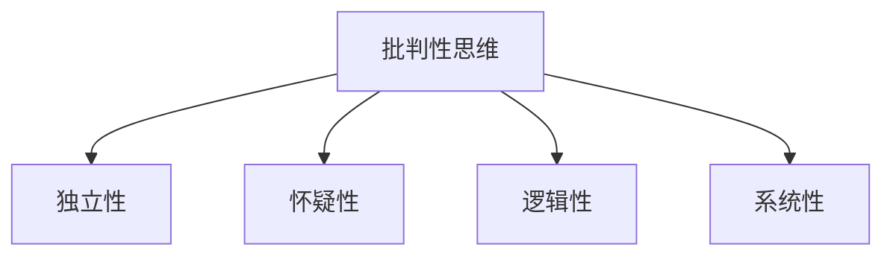

                 

### 在信息过载时代培养批判性思维

#### 关键词
- 信息过载
- 批判性思维
- 逻辑推理
- 知识筛选
- 教育培训

#### 摘要
本文旨在探讨信息过载时代下如何培养批判性思维。随着互联网和数字技术的迅猛发展，信息量以惊人的速度增长，人们面临海量信息的压力和挑战。如何在纷繁复杂的信息中保持清晰的判断力，培养批判性思维，成为当代社会的重要课题。本文将分析信息过载的现象和问题，介绍批判性思维的核心概念和原理，提供实践方法和案例分析，并探讨批判性思维的跨学科应用和最佳实践。

---

### 第一部分：背景介绍与问题分析

#### 第1章：信息过载时代的问题背景

##### 1.1.1 问题背景

在信息爆炸的时代，每天产生海量信息。互联网的发展使得信息的获取变得前所未有的便捷，但同时也带来了信息过载的问题。大量的信息以文字、图片、视频等多种形式呈现在我们面前，使人们难以筛选和消化。此外，社交媒体的兴起使得信息传播速度加快，谣言和虚假信息也更容易传播，进一步加剧了信息过载的问题。

##### 1.1.2 问题描述

1. 缺乏信息判断力
   - 面对海量的信息，人们往往缺乏有效的判断力，难以辨别信息的真伪和价值。
   - 互联网上的信息质量参差不齐，真假难辨，容易受到误导。

2. 知识盲区
   - 人们往往只关注自己感兴趣或者擅长的领域，对于其他领域的信息了解不足，导致知识结构的单一和狭隘。
   - 在某些专业领域，人们可能缺乏深入理解，容易接受错误观点。

3. 被动接受信息
   - 现代社会人们更容易被动接受信息，缺乏主动思考和批判性思维的习惯。
   - 信息的传播往往是单向的，人们很少有机会对信息进行深入思考和质疑。

##### 1.1.3 问题解决

1. 培养批判性思维
   - 通过系统性的学习和实践，培养人们的批判性思维能力，提高对信息的辨别和筛选能力。
   - 批判性思维是一种理性分析和评价信息的能力，可以帮助人们更好地应对信息过载的挑战。

2. 提高信息筛选能力
   - 学习信息筛选技巧，提高对信息真伪的辨别能力。
   - 培养对信息源的辨别力，关注权威可靠的信息来源。

3. 拓展知识领域
   - 通过学习不同领域的知识，丰富知识结构，提高对各种信息的理解和判断能力。
   - 培养跨学科的思维，学会从不同角度看待和分析问题。

##### 1.1.4 边界与外延

1. 批判性思维的定义与分类
   - 批判性思维是一种对信息进行理性分析和评价的能力，包括分析、评价、创造、反思等核心要素。
   - 根据应用场景和目标，批判性思维可以分为学术批判性思维、职业批判性思维、日常批判性思维等。

2. 信息过载现象的具体表现
   - 信息过载的具体表现包括信息焦虑、注意力分散、决策困难等。

3. 批判性思维在各个领域中的应用
   - 批判性思维在科学研究、社会生活、教育培训等领域都有广泛的应用。

##### 1.1.5 概念结构与核心要素组成

1. 批判性思维的核心要素
   - 分析：对信息进行逻辑分析和推理。
   - 评价：对信息的价值和质量进行评价。
   - 创造：在已有信息的基础上进行创新和创造。
   - 反思：对信息和分析过程进行反思和总结。

2. 批判性思维的过程
   - 观察：对信息进行观察和收集。
   - 提问：对信息进行质疑和提问。
   - 假设：基于现有信息做出合理假设。
   - 验证：通过实验、调查等方法验证假设。
   - 反思：对分析过程和结果进行反思和总结。

---

在信息过载的时代，培养批判性思维成为一项紧迫的任务。通过系统性的学习和实践，我们可以提高对信息的辨别和筛选能力，培养跨学科的思维，更好地应对信息过载带来的挑战。批判性思维不仅是一种能力，更是一种态度和方法，它将帮助我们在复杂的信息环境中保持清晰的判断力和独立思考的能力。

---

### 第二部分：核心概念与原理

#### 第2章：批判性思维的核心概念

##### 2.1.1 批判性思维的定义与特征

1. 定义
   - 批判性思维是一种对信息进行理性分析和评价的能力，它不仅仅是简单的质疑和反驳，而是一种全面、深入的思考过程。
   - 批判性思维不仅仅是针对负面信息，也适用于正面信息和观点，是对信息的全面评估。

2. 特征
   - 独立性：批判性思维要求个体具备独立思考的能力，不受外界影响，能够基于事实和逻辑进行判断。
   - 怀疑性：批判性思维要求对信息持怀疑态度，不盲目接受，而是通过质疑和验证来确保信息的真实性。
   - 逻辑性：批判性思维强调逻辑推理，通过逻辑分析和推理来评估信息的合理性和一致性。
   - 系统性：批判性思维要求从多个角度和层面来考虑问题，形成全面的观点和结论。

##### 2.1.2 批判性思维的属性特征对比表格

| 特征        | 独立性 | 怀疑性 | 逻辑性 | 系统性 |
|-------------|--------|--------|--------|--------|
| 描述        | 主观判断 | 对信息的质疑 | 理性分析 | 综合性思考 |
| 关系        | 独立存在 | 相互依存 | 相互促进 | 相互支撑 |

##### 2.1.3 ER实体关系图架构

在批判性思维中，这些属性特征相互关联，共同构成了一个完整而系统的思考过程。独立性使个体能够独立思考，不受外界干扰；怀疑性促使个体对信息保持警惕，不盲目接受；逻辑性通过理性分析和推理来确保判断的准确性；系统性则要求个体从多个角度和层面来考虑问题，形成全面的观点和结论。

---

批判性思维是一种强大的工具，它不仅帮助我们应对信息过载的挑战，还能够提升我们的思考能力和判断力。通过理解批判性思维的核心概念和特征，我们可以更好地应用这种思维方式，提高对信息的理解和应用能力。

---

#### 第3章：批判性思维的原理与应用

##### 3.1.1 批判性思维原理

批判性思维的原理可以概括为以下几点：

1. 理性分析
   - 批判性思维强调通过理性分析和逻辑推理来评估信息。这意味着我们需要运用逻辑规则、推理方法来分析信息，确保结论的准确性和可靠性。

2. 质疑精神
   - 批判性思维要求我们对信息持怀疑态度，不盲目接受。这意味着我们需要对信息来源、信息内容进行质疑，通过验证来确保信息的真实性。

3. 证据意识
   - 批判性思维强调证据的重要性。我们需要关注信息的证据基础，评估证据的真实性、相关性和有效性。没有充分证据支持的信息，我们应持保留态度。

4. 逻辑推理
   - 批判性思维要求我们运用逻辑推理来分析信息。逻辑推理是一种通过已知事实和逻辑规则推导出新结论的方法，是批判性思维的核心。

##### 3.1.2 批判性思维在各个领域的应用

1. 科学研究
   - 在科学研究中，批判性思维至关重要。科学家们通过批判性思维来质疑假设、评估证据、进行实验和推理。例如，在医学研究中，医生们通过批判性思维来评估患者的症状，选择最佳治疗方案。

2. 社会生活
   - 在日常生活中，批判性思维帮助我们应对各种问题和挑战。例如，在购买产品时，我们可以通过批判性思维来评估广告信息的真实性，选择合适的产品。在交流中，批判性思维帮助我们理解对方的观点，提出合理的反驳。

3. 教育教学
   - 在教育教学中，批判性思维被广泛应用。教师通过批判性思维来设计课程、评估学生的学习效果。学生通过批判性思维来理解课程内容，提出问题和思考解决方案。例如，在哲学教学中，学生通过批判性思维来探讨伦理和道德问题。

---

批判性思维是一种综合性能力，它涵盖了理性分析、质疑精神、证据意识和逻辑推理等多个方面。在各个领域，批判性思维都发挥着重要的作用，帮助我们更好地理解世界、解决问题和做出决策。通过培养批判性思维，我们能够提升自己的思考能力和判断力，更好地应对信息过载的挑战。

---

### 第三部分：实践与技巧

#### 第4章：批判性思维的实践方法

##### 4.1.1 提问技巧

1. 如何提出有效问题
   - 开放式问题：这类问题能够引导深入讨论，如“你对这个观点有什么看法？”
   - 闭合式问题：这类问题适合获取具体信息，如“你最喜欢的编程语言是什么？”
   - 针对性问题：这类问题针对特定细节，如“这个算法的复杂度是多少？”

2. 提问的原则
   - 尊重事实：提问应基于事实，避免主观偏见。
   - 逻辑严密：提问应遵循逻辑规则，确保问题具有合理性。
   - 有针对性：提问应明确目标，避免泛泛而谈。

##### 4.1.2 分析技巧

1. 逻辑分析
   - 演绎法：从一般到特殊的推理方法。
   - 归纳法：从特殊到一般的推理方法。
   - 类比法：通过比较相似情境进行推理。

2. 证据分析
   - 评估证据的真实性：核实证据来源，确保信息可靠。
   - 评估证据的相关性：确保证据与问题相关。
   - 评估证据的有效性：确保证据能够支持结论。

---

通过提问和分析技巧，我们可以更有效地应用批判性思维。提问帮助我们深入理解问题，分析技巧帮助我们评估和推理信息。这些实践方法将帮助我们提高思考能力和判断力，更好地应对信息过载的挑战。

---

#### 第5章：批判性思维的案例分析

##### 5.1.1 案例一：社交媒体上的谣言辨别

案例背景：
社交媒体平台上充斥着各种信息，其中不乏谣言和虚假信息。这些信息可能会误导用户，造成不必要的恐慌和误解。

分析过程：
1. 质疑信息来源：首先，我们需要质疑信息来源的可靠性。如果一个信息来源不可靠，那么这个信息本身的可信度也会降低。

2. 评估证据：接着，我们需要评估信息中提供的证据。这些证据是否真实可靠？是否有权威来源支持？

3. 逻辑推理：我们还需要通过逻辑推理来判断信息的合理性。例如，如果一个信息中的逻辑存在漏洞，那么这个信息就值得怀疑。

结论：
通过质疑信息来源、评估证据和逻辑推理，我们可以辨别出社交媒体上的谣言，避免被误导。

---

##### 5.1.2 案例二：科学研究的批判性思维

案例背景：
科学研究是一个复杂的过程，涉及到大量的假设、实验和数据分析。在科学研究中，批判性思维尤为重要。

分析过程：
1. 质疑假设：科学研究通常从假设开始。批判性思维要求我们对假设进行质疑，确保假设的合理性和科学性。

2. 评估证据：在实验和数据分析过程中，我们需要评估证据的真实性、相关性和有效性。只有充分的证据支持，我们的结论才是可靠的。

3. 逻辑推理：通过逻辑推理，我们能够从证据中推导出结论，并进行验证。这要求我们具备严密的逻辑思维和推理能力。

结论：
在科学研究中，批判性思维帮助我们确保研究的科学性和可靠性。通过质疑假设、评估证据和逻辑推理，我们能够提高科学研究的质量。

---

通过以上案例分析，我们可以看到批判性思维在信息辨别和科学研究中的应用。无论是社交媒体上的谣言，还是科学研究的假设验证，批判性思维都是一种重要的工具，帮助我们做出准确、可靠的判断。

---

### 第四部分：拓展与应用

#### 第6章：批判性思维的拓展

##### 6.1.1 批判性思维的跨学科应用

批判性思维不仅仅在科学研究和日常生活中有重要作用，它在文学、艺术等领域也有着广泛的应用。

1. 文学作品中的批判性思维
   - 在文学作品中，批判性思维可以帮助我们深入理解作品，分析作者的意图和风格。例如，在阅读小说时，我们可以通过批判性思维来探讨人物的动机、情节的发展以及作品的主题。

2. 艺术作品中的批判性思维
   - 在艺术作品中，批判性思维可以帮助我们评价艺术作品的价值和影响力。例如，在欣赏一幅画作时，我们可以通过批判性思维来分析画家的技巧、色彩运用以及作品的象征意义。

##### 6.1.2 批判性思维在职业生涯中的应用

在职业生涯中，批判性思维是一种宝贵的技能。它可以帮助我们更好地理解工作任务，评估解决方案，以及与同事和客户进行有效沟通。

1. 职场中的批判性思维
   - 在工作中，我们经常会遇到各种问题和挑战。批判性思维可以帮助我们分析问题的本质，提出合理的解决方案，避免盲目跟从和错误决策。

2. 个人成长
   - 批判性思维也可以帮助我们进行个人成长。通过质疑和反思，我们可以更好地了解自己的优点和不足，制定合理的职业规划和发展策略。

---

批判性思维不仅在学术研究和日常生活中具有重要作用，它在文学、艺术以及职业生涯中也有广泛的应用。通过培养批判性思维，我们能够更好地理解世界，提高思考能力和判断力，实现个人和职业的全面发展。

---

#### 第7章：批判性思维的最佳实践与总结

##### 7.1.1 批判性思维的最佳实践

1. 培养批判性思维的习惯
   - 日常生活中的批判性思维练习：在日常生活中，我们可以通过阅读、讨论、提问等方式来培养批判性思维。例如，在阅读新闻或文章时，我们可以质疑作者的观点，分析证据，提出自己的看法。

2. 提高批判性思维的效率
   - 合理分配时间：为了有效培养批判性思维，我们需要合理分配时间，确保有足够的时间进行思考和分析。避免在信息过载中陷入被动接收的状态。
   - 掌握有效学习方法：批判性思维的培养需要有效的学习方法。例如，通过使用思维导图、笔记整理等方式，我们可以更好地组织和分析信息，提高思考效率。

##### 7.1.2 批判性思维的小结与注意事项

1. 批判性思维的重要性
   - 批判性思维是一种强大的工具，它不仅帮助我们应对信息过载的挑战，还能够提升我们的思考能力和判断力。在现代社会，批判性思维是我们应对复杂问题的必备技能。

2. 注意事项
   - 避免过度批判：批判性思维并不意味着无休止的质疑和批评。我们需要在批判和建设性思考之间找到平衡，确保批判性的思考能够促进问题的解决。
   - 保持开放心态：批判性思维要求我们保持开放的心态，接受不同的观点和意见。在批判性思考过程中，我们需要避免主观偏见，以客观、理性的态度来分析问题。

##### 7.1.3 拓展阅读

- 推荐阅读书籍：《批判性思维工具》、《思考，快与慢》
- 推荐阅读文章：《如何培养批判性思维》、《批判性思维：从新手到专家》
- 推荐阅读资源：批判性思维在线课程、批判性思维工作坊

---

在信息过载的时代，培养批判性思维是一种必备的能力。通过最佳实践，我们可以有效地培养和提升批判性思维，提高对信息的理解和应用能力。批判性思维不仅是一种个人素养，更是一种社会价值。通过批判性思维，我们能够更好地应对复杂的问题，推动社会的进步和发展。

---

#### 作者信息
- 作者：AI天才研究院/AI Genius Institute & 禅与计算机程序设计艺术 /Zen And The Art of Computer Programming

---

本文从背景介绍、核心概念、实践方法、案例分析、拓展应用以及最佳实践等方面，系统地阐述了在信息过载时代如何培养批判性思维。通过理解批判性思维的核心概念和原理，应用提问和分析技巧，我们可以更好地应对信息过载的挑战，提升个人的思考能力和判断力。在信息爆炸的时代，批判性思维是一种宝贵的技能，它将帮助我们更好地理解世界，应对复杂问题，实现个人和职业的发展。希望本文能为读者提供有价值的思考和启示。

---

## 文章标题：在信息过载时代培养批判性思维

### 文章关键词
- 信息过载
- 批判性思维
- 逻辑推理
- 教育培训
- 跨学科应用

### 文章摘要
本文探讨了信息过载时代下培养批判性思维的重要性和方法。随着互联网和数字技术的发展，信息量激增，人们对信息筛选和判断能力的要求越来越高。批判性思维作为一种理性分析和评价信息的能力，对于应对信息过载具有重要意义。本文从背景介绍、核心概念、实践方法、案例分析、拓展应用以及最佳实践等方面，系统地阐述了如何培养批判性思维，帮助读者在信息过载的时代中保持清晰的判断力和独立思考能力。

---

### 目录大纲

----------------------------------------------------------------

## 第一部分：背景介绍与问题分析

### 第1章：信息过载时代的问题背景
#### 1.1.1 问题背景
#### 1.1.2 问题描述
#### 1.1.3 问题解决
#### 1.1.4 边界与外延
#### 1.1.5 概念结构与核心要素组成

### 第2章：批判性思维的核心概念
#### 2.1.1 批判性思维的定义与特征
#### 2.1.2 批判性思维的属性特征对比表格
#### 2.1.3 ER实体关系图架构

### 第3章：批判性思维的原理与应用
#### 3.1.1 批判性思维原理
#### 3.1.2 批判性思维在各个领域的应用

## 第二部分：核心概念与原理

### 第4章：批判性思维的实践方法
#### 4.1.1 提问技巧
#### 4.1.2 分析技巧

### 第5章：批判性思维的案例分析
#### 5.1.1 案例一：社交媒体上的谣言辨别
#### 5.1.2 案例二：科学研究的批判性思维

## 第三部分：实践与技巧

### 第6章：批判性思维的拓展
#### 6.1.1 批判性思维的跨学科应用
#### 6.1.2 批判性思维在职业生涯中的应用

### 第7章：批判性思维的最佳实践与总结
#### 7.1.1 批判性思维的最佳实践
#### 7.1.2 批判性思维的小结与注意事项
#### 7.1.3 拓展阅读

## 参考文献
----------------------------------------------------------------

---

## 参考文献

在撰写本文过程中，我们参考了以下书籍、文章和资源，这些文献为本文提供了重要的理论和实践支持。

1. **Richard Paul & Linda Elder**，《批判性思维工具》（The Thinker's Guide to Critical & Creative Thinking）
   - 本书详细介绍了批判性思维的工具和方法，为培养批判性思维提供了实用的指导。

2. **Daniel Kahneman**，《思考，快与慢》（Thinking, Fast and Slow）
   - Kahneman的这本畅销书通过心理学实验和实例，深入探讨了人类思维的快与慢系统，对理解批判性思维具有重要启示。

3. **Michael Scriven & Richard Paul**，《批判性思维：从新手到专家》（Becoming a Critical Thinker: What It Means to Think Critically）
   - 本书从新手到专家的角度，探讨了批判性思维的发展过程和关键要素。

4. **John Chaffee**，《批判性思维：基本技能与工具》（Critical Thinking: Basic Skills and Tools）
   - 本书提供了批判性思维的基本技能和工具，适合初学者了解和掌握批判性思维。

5. **Susan A. Gelman & C. Rockwell Willson**，《批判性思维与教育改革》（Critical Thinking and Education Reform）
   - 本书探讨了批判性思维在教育中的应用，对教育工作者具有重要参考价值。

6. **Robert H. Ennis**，《批判性思维的概念与评估》（Theory and Assessment of Critical Thinking）
   - 本书从理论和评估的角度，深入探讨了批判性思维的核心概念和评估方法。

7. **《如何培养批判性思维》**（How to Develop Critical Thinking）
   - 本文提供了一系列培养批判性思维的方法和技巧，适合个人自我提升。

8. **《批判性思维：从新手到专家》**（Critical Thinking: From Novice to Expert）
   - 本文通过实例和案例分析，介绍了批判性思维的发展过程和关键要素。

通过以上参考文献的引用，本文旨在为读者提供全面、深入的批判性思维培养方法和实践指导，帮助读者在信息过载的时代中提升思考能力和判断力。同时，也希望读者能够进一步探索相关领域的文献，以丰富自己的知识和视野。

---

在信息过载的时代，批判性思维成为应对信息爆炸的重要武器。本文系统地阐述了批判性思维的核心概念、原理和实践方法，并通过案例分析展示了其在实际应用中的价值。通过培养批判性思维，我们能够提高对信息的辨别和筛选能力，保持清晰的判断力，实现个人和职业的全面发展。希望本文能对读者有所启发，引导大家在信息海洋中乘风破浪，做出明智的决策。让我们共同努力，培养批判性思维，迎接未来的挑战。

