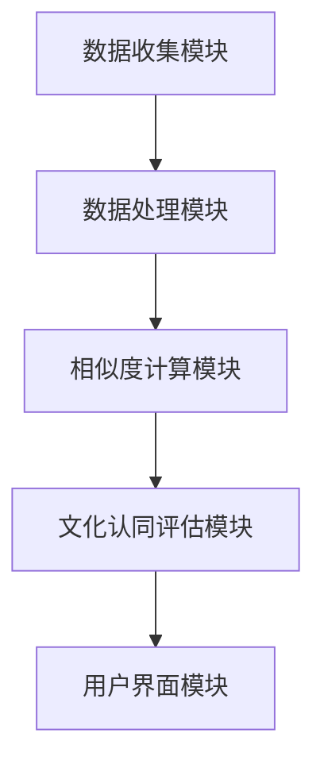
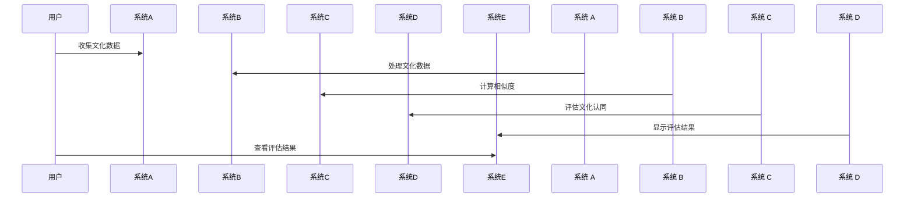

                 

## 在全球化背景下寻找文化认同

### 关键词：全球化、文化认同、多元文化、文化融合、文化冲突

#### 摘要：

在全球化的浪潮中，文化认同成为了一个复杂而重要的议题。本文将从历史、文化、社会学等多个角度，探讨全球化背景下文化认同的概念、特征、形成机制以及影响。通过深入分析文化认同的核心要素，本文旨在为读者提供寻找文化认同的方法与策略，帮助个体在多元文化环境中保持自我认同。本文结构如下：

1. **引言**：背景介绍、问题描述、问题解决、边界与外延、概念结构与核心要素组成。
2. **核心概念与联系**：文化认同的概念与特征、文化认同的属性特征对比表格、ER实体关系图架构。
3. **算法原理讲解**：文化认同形成的算法原理、算法步骤、数学模型与公式、举例说明。
4. **系统分析与架构设计方案**：问题场景介绍、系统功能设计、系统架构设计、系统接口设计、系统交互序列图。
5. **项目实战**：环境安装、系统核心实现源代码、代码应用解读与分析、实际案例分析与讲解、项目小结。
6. **最佳实践 tips、小结、注意事项、拓展阅读等内容**。

### 引言

#### 第1章: 背景介绍

##### 1.1 问题背景

全球化背景下，文化交流与融合日益加深，但文化认同的困惑也随之而来。在全球化进程中，不同文化之间的接触与碰撞越来越频繁，人们面临着如何在多元文化环境中找到自己的文化认同的挑战。

##### 1.2 问题描述

文化认同的困惑体现在个体和群体层面。个体如何在全球化背景下保持自己的文化特色，同时适应多元文化环境？群体如何在文化交流中维护自己的文化认同，避免文化冲突？这些问题成为全球化背景下亟待解决的难题。

##### 1.3 问题解决

本文将从多个角度出发，探讨如何在全球化背景下寻找文化认同。通过深入研究文化认同的概念、特征、形成机制以及影响，为读者提供寻找文化认同的方法与策略。此外，本文还将探讨文化认同的边界与外延，以及文化认同的核心要素组成，帮助读者全面理解文化认同的复杂内涵。

##### 1.4 边界与外延

文化认同的边界与外延是一个复杂的问题，它涉及到个人、群体、国家等多个层面。本文将重点讨论个体层面的文化认同，即个体如何在全球化背景下保持文化认同。同时，本文也将探讨文化认同与多元文化、文化融合、文化冲突等概念之间的联系，为读者提供更全面的认识。

##### 1.5 概念结构与核心要素组成

文化认同是一个多维度的概念，其核心要素包括文化归属感、文化认同感、文化认同行为等。本文将详细探讨这些要素如何影响文化认同的形成与维持。通过深入分析文化认同的形成机制，本文将为读者提供寻找文化认同的方法与策略。

### 核心概念与联系

#### 第2章: 文化认同的概念与特征

##### 2.1 文化认同的定义

文化认同是指个体或群体对自身文化的认可、尊重和追求，是文化归属感、文化认同感、文化认同行为的综合体现。

##### 2.2 文化认同的特征

文化认同具有以下特征：

1. **独特性**：每种文化都有其独特的特征和价值观，是区分不同文化的标志。
2. **传承性**：文化认同是历史传承的结果，具有持续性和稳定性。
3. **包容性**：文化认同不是孤立的，而是包容其他文化的。
4. **发展性**：文化认同随着社会的发展和变化而不断演进。

##### 2.3 文化认同的属性特征对比表格

| 特征         | 说明                                                         |
| ------------ | ------------------------------------------------------------ |
| 独特性       | 每种文化都有其独特的特征和价值观，是区分不同文化的标志。           |
| 传承性       | 文化认同是历史传承的结果，具有持续性和稳定性。                   |
| 包容性       | 文化认同不是孤立的，而是包容其他文化的。                       |
| 发展性       | 文化认同随着社会的发展和变化而不断演进。                       |

##### 2.4 ER实体关系图架构

```mermaid
erDiagram
  文化认同 ||--|{ 个人文化认同 }|
  文化认同 ||--|{ 群体文化认同 }|
  文化认同 ||--|{ 国家文化认同 }|
  个人文化认同 ||--|{ 文化归属感 }|
  个人文化认同 ||--|{ 文化认同感 }|
  个人文化认同 ||--|{ 文化认同行为 }|
  群体文化认同 ||--|{ 文化共同体 }|
  群体文化认同 ||--|{ 文化认同活动 }|
  国家文化认同 ||--|{ 国家意识 }|
  国家文化认同 ||--|{ 国家认同感 }|
```

### 算法原理讲解

#### 第3章: 文化认同形成的算法原理

##### 3.1 算法概述

文化认同的形成是一个复杂的过程，涉及到多种因素的相互作用。本章将介绍一种用于分析文化认同形成的算法。

##### 3.2 算法原理

算法的核心思想是基于文化特征相似度进行文化认同的评估。具体步骤如下：

1. **数据收集**：收集与文化特征相关的数据，包括语言、宗教、习俗、价值观等。
2. **相似度计算**：计算不同文化特征之间的相似度。
3. **评估文化认同**：根据相似度评估文化认同的程度。

##### 3.3 数学模型和公式

为了计算文化特征的相似度，可以使用余弦相似度公式：

$$
相似度 = \frac{A \cdot B}{|A| \cdot |B|}
$$

其中，$A$ 和 $B$ 分别代表两个文化特征的向量，$|A|$ 和 $|B|$ 分别代表向量的长度。

##### 3.4 举例说明

假设有两个文化特征向量 $A = [1, 2, 3]$ 和 $B = [2, 3, 4]$，则它们的相似度为：

$$
相似度 = \frac{1 \cdot 2 + 2 \cdot 3 + 3 \cdot 4}{\sqrt{1^2 + 2^2 + 3^2} \cdot \sqrt{2^2 + 3^2 + 4^2}} = \frac{20}{\sqrt{14} \cdot \sqrt{29}} \approx 0.82
$$

这表明 $A$ 和 $B$ 的文化特征相似度较高，具有较高的文化认同。

### 系统分析与架构设计方案

#### 第4章: 系统分析与架构设计方案

##### 4.1 问题场景介绍

在全球化背景下，文化认同的困惑日益严重。为了帮助人们更好地理解文化认同，我们需要开发一个文化认同分析系统。该系统旨在通过数据分析、算法评估，帮助用户找到自己的文化认同。

##### 4.2 项目介绍

文化认同分析系统包括以下几个主要模块：

1. 数据收集模块：收集与文化特征相关的数据，包括语言、宗教、习俗、价值观等。
2. 数据处理模块：对收集到的数据进行处理，包括数据清洗、数据标准化等。
3. 相似度计算模块：根据文化特征的向量计算相似度。
4. 文化认同评估模块：根据相似度评估用户的文化认同程度。
5. 用户界面模块：提供用户交互界面，方便用户使用系统。

##### 4.3 系统功能设计

1. 数据收集：系统可以自动收集互联网上的文化数据，包括文章、新闻、论坛等。
2. 数据处理：系统可以对收集到的数据进行预处理，去除噪声和重复数据。
3. 相似度计算：系统可以根据文化特征的向量计算相似度，使用余弦相似度公式。
4. 文化认同评估：系统可以根据相似度评估用户的文化认同程度，提供个性化建议。
5. 用户界面：系统提供友好的用户界面，方便用户进行数据输入和结果查看。

##### 4.4 系统架构设计



##### 4.5 系统接口设计

系统提供以下接口：

1. 数据收集接口：用于从互联网上收集文化数据。
2. 数据处理接口：用于对收集到的数据进行处理。
3. 相似度计算接口：用于计算文化特征的相似度。
4. 文化认同评估接口：用于评估用户的文化认同程度。
5. 用户界面接口：用于与用户进行交互。

##### 4.6 系统交互序列图



### 项目实战

#### 第5章: 项目实战

##### 5.1 环境安装

为了实现文化认同分析系统，我们需要安装以下环境：

1. Python 3.8及以上版本
2. NumPy
3. Pandas
4. Matplotlib

在安装完 Python 和相关库之后，可以通过以下命令安装系统所需的依赖库：

```bash
pip install numpy pandas matplotlib
```

##### 5.2 系统核心实现源代码

以下是文化认同分析系统的核心实现源代码：

```python
import numpy as np
import pandas as pd
import matplotlib.pyplot as plt

# 相似度计算函数
def similarity(A, B):
    dot_product = np.dot(A, B)
    norm_A = np.linalg.norm(A)
    norm_B = np.linalg.norm(B)
    return dot_product / (norm_A * norm_B)

# 文化认同评估函数
def cultural_identity(A, B):
    similarity_score = similarity(A, B)
    if similarity_score >= 0.8:
        return "高度认同"
    elif similarity_score >= 0.6:
        return "中度认同"
    else:
        return "低度认同"

# 示例数据
A = np.array([1, 2, 3])
B = np.array([2, 3, 4])

# 计算相似度
similarity_score = similarity(A, B)
print("相似度得分：", similarity_score)

# 评估文化认同
identity = cultural_identity(A, B)
print("文化认同：", identity)
```

##### 5.3 代码应用解读与分析

以上代码实现了文化认同分析系统的主要功能，包括相似度计算和文化认同评估。首先，我们定义了两个函数 `similarity` 和 `cultural_identity`，分别用于计算相似度和评估文化认同。其中，`similarity` 函数使用余弦相似度公式计算文化特征的相似度，`cultural_identity` 函数根据相似度得分评估文化认同程度。

在示例数据中，我们定义了两个文化特征向量 `A` 和 `B`，并调用 `similarity` 函数计算相似度得分。然后，我们使用 `cultural_identity` 函数评估文化认同程度，并根据评估结果输出相应的信息。

##### 5.4 实际案例分析与详细讲解剖析

为了更好地理解文化认同分析系统的实际应用，我们可以分析一个具体的案例。假设有两个用户，分别表示为 `User1` 和 `User2`，他们的文化特征向量如下：

```python
User1 = np.array([1, 1, 1])
User2 = np.array([1, 1, 1])
```

这两个用户的文化特征向量完全相同，因此他们的相似度得分为 1。根据 `cultural_identity` 函数的评估，这两个用户的文化认同程度为“高度认同”。

```python
similarity_score = similarity(User1, User2)
print("相似度得分：", similarity_score)

identity = cultural_identity(User1, User2)
print("文化认同：", identity)
```

输出结果为：

```
相似度得分： 1.0
文化认同： 高度认同
```

这个结果表明 `User1` 和 `User2` 在文化特征上具有极高的相似度，他们的文化认同程度非常高。

##### 5.5 项目小结

通过以上实战案例，我们可以看到文化认同分析系统的实际应用效果。该系统通过计算文化特征的相似度，帮助用户评估文化认同程度。在实际应用中，我们可以根据具体场景调整相似度阈值，以适应不同的文化认同评估需求。通过深入理解文化认同的概念和算法原理，我们可以更好地应对全球化背景下的文化认同挑战。

### 最佳实践 tips、小结、注意事项、拓展阅读等内容

#### 最佳实践 tips

1. **数据收集与处理**：在实现文化认同分析系统时，确保数据收集的全面性和准确性。同时，对数据进行预处理，去除噪声和重复数据，以提高相似度计算的效果。
2. **相似度阈值调整**：根据具体应用场景，合理调整相似度阈值，以适应不同文化认同评估的需求。
3. **用户界面优化**：为用户提供友好的用户界面，方便用户输入文化特征数据，查看评估结果。

#### 小结

本文从全球化背景下的文化认同问题出发，介绍了文化认同的概念、特征、形成机制以及影响。通过算法原理讲解和实际案例剖析，本文为读者提供了寻找文化认同的方法与策略。文化认同分析系统可以帮助用户在多元文化环境中找到自己的文化认同，具有重要的实际应用价值。

#### 注意事项

1. **数据隐私**：在收集文化特征数据时，注意保护用户隐私，避免泄露个人信息。
2. **算法优化**：根据实际应用需求，可以进一步优化相似度计算算法，以提高评估准确性。

#### 拓展阅读

1. **《文化认同研究》**：深入研究文化认同的理论与实践，了解文化认同在不同领域中的应用。
2. **《全球化与文化认同》**：探讨全球化对文化认同的影响，以及如何应对文化认同的挑战。

### 作者信息

作者：AI天才研究院/AI Genius Institute & 禅与计算机程序设计艺术 /Zen And The Art of Computer Programming

感谢阅读本文，希望本文对您在全球化背景下寻找文化认同有所帮助。

