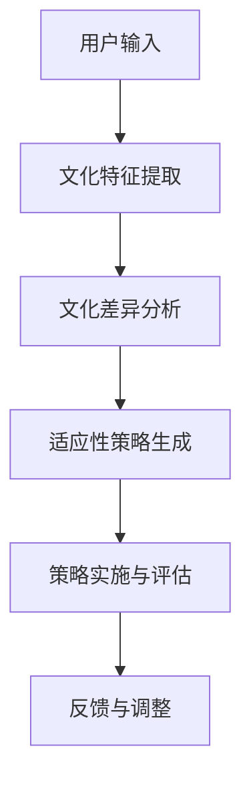
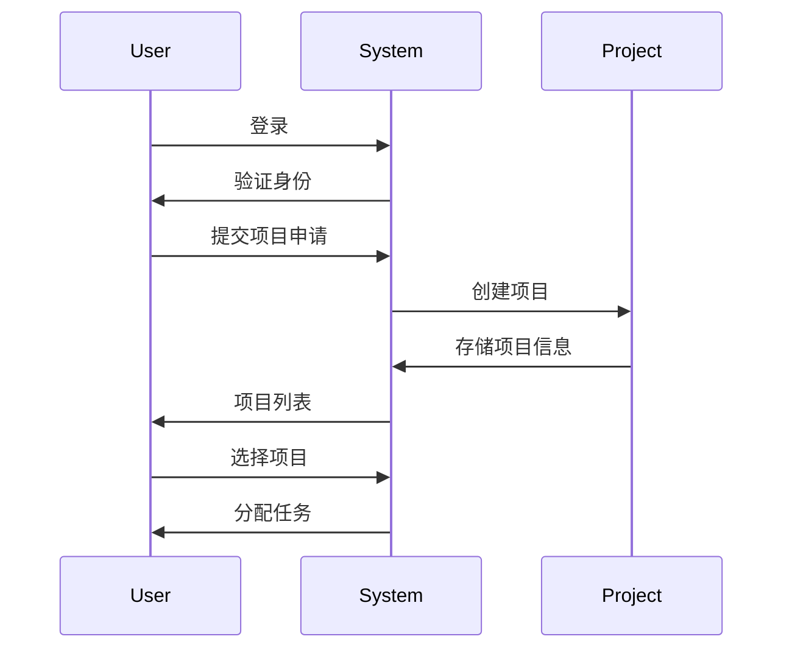
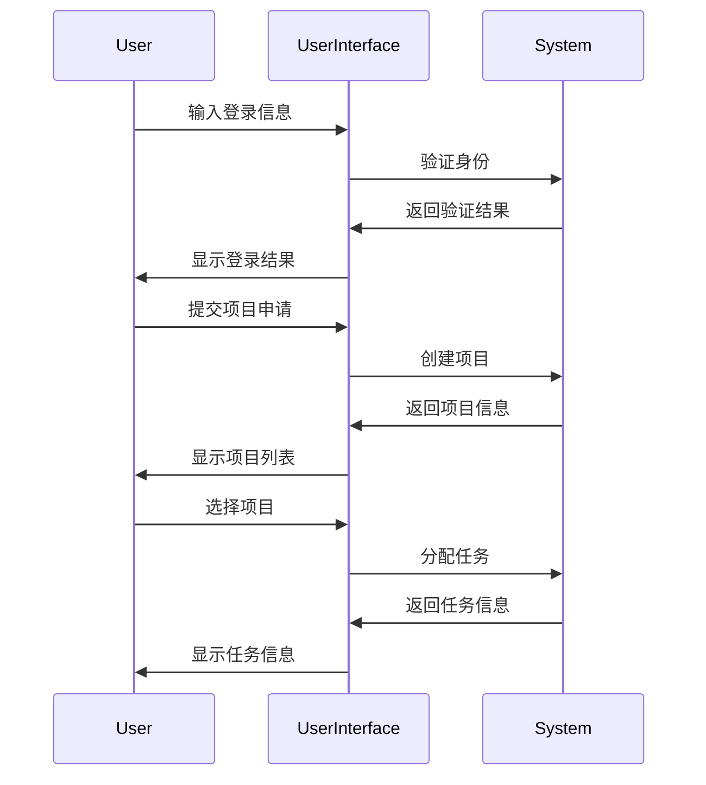
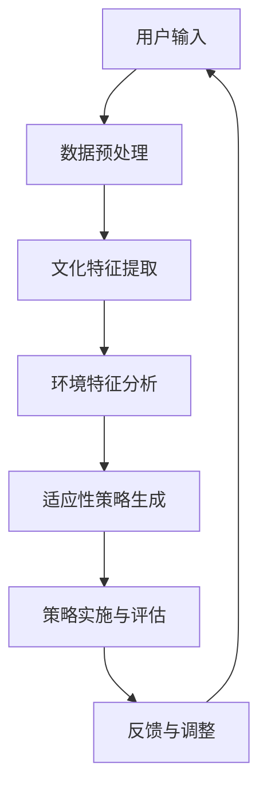
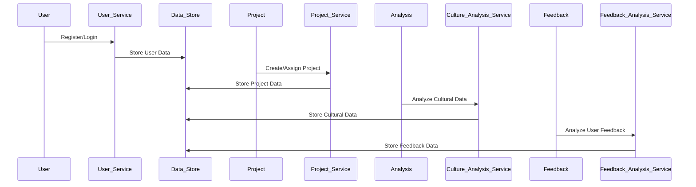

                 


# 在全球化进程中保持文化独特性

关键词：全球化、文化独特性、文化多样性、文化认同、文化适应性、算法原理

摘要：本文将探讨在全球化进程中保持文化独特性的重要性，通过介绍全球化背景、文化独特性的核心概念、相关算法原理，以及实际系统架构设计与项目实战，提供一系列策略和方法，以帮助人们在全球化浪潮中保持自身文化的独特性和多样性。

## 1. 背景介绍

### 1.1 全球化进程的背景

全球化是指不同国家和地区在经济、政治、文化等方面的相互联系和依赖不断加深的过程。随着交通、通信技术的飞速发展，全球化进程在过去几十年中显著加快。全球贸易、跨国公司、互联网等因素使得不同文化之间的交流更加频繁，这也给文化独特性带来了挑战。

全球化带来了许多积极的变化，如促进了经济发展、提高了生活水平、推动了科技进步等。然而，全球化也引发了文化同质化的担忧。一些文化元素在全球范围内被广泛传播，可能导致本土文化的消失或减弱。

### 1.2 文化独特性的定义与价值

文化独特性指的是一个社会或群体所特有的价值观、传统、习俗和生活方式。每个文化都有其独特性，这种独特性为人类社会提供了丰富的多样性和创造力。

保持文化独特性的价值体现在多个方面：

1. **文化认同**：文化独特性是人们对自己身份认同的重要来源。通过维护和传承文化，人们可以更好地了解自己，增强自信心和归属感。

2. **社会多样性**：文化多样性是社会发展的重要动力。不同文化之间的交流、融合和冲突可以促进社会创新和进步。

3. **可持续发展**：保持文化独特性有助于促进可持续发展。文化多样性可以丰富社会资源，提高社会的适应能力和抗风险能力。

### 1.3 文化独特性的重要性

在全球化进程中，保持文化独特性具有重要意义。以下是一些原因：

1. **文化认同的维持**：全球化可能导致文化同质化，削弱人们的文化认同。保持文化独特性有助于维护和加强文化认同。

2. **社会和谐的促进**：文化多样性有助于社会和谐。通过尊重和保护不同文化的独特性，可以减少文化冲突，促进社会稳定。

3. **经济发展**：文化独特性可以成为国家或地区的重要经济资源。例如，旅游业、文化创意产业等都依赖于文化独特性。

4. **创新和创造力**：文化多样性可以激发人们的创造力和创新精神。不同文化的交流、碰撞可以产生新的思维和创意。

## 2. 核心概念与联系

### 2.1 文化多样性的理解

文化多样性指的是不同文化在社会生活中的丰富性和差异性。它包括语言、宗教、艺术、习俗、价值观等多个方面。

### 2.2 文化认同的内涵

文化认同是指个体或群体对自己所属文化的认知和认同。它是文化独特性的核心，是人们行为和价值观的内在驱动力。

### 2.3 文化适应性的重要性

文化适应性是指个体或群体在面对不同文化环境时的适应能力。在全球化的背景下，文化适应性显得尤为重要。它有助于减少文化冲突，促进文化融合。

### 2.4 概念属性特征对比表格与ER实体关系图

| 概念        | 属性特征                           | 关联关系               |
| ----------- | ---------------------------------- | ---------------------- |
| 文化多样性 | 语言、宗教、艺术、习俗等 | 文化独特性的表现形式   |
| 文化认同   | 价值观、行为规范、身份认知 | 文化多样性的内在动力 |
| 文化适应性 | 适应能力、融合能力 | 促进文化多样性的实现 |

```mermaid
erDiagram
    Culture_Diversity ||--|{ Culture_Identity } Culture_Identity
    Culture_Identity ||--|{ Cultural_Adaptability } Cultural_Adaptability
```

### 2.5 保持文化独特性的策略

#### 2.5.1 文化多样性的维护

- **教育和宣传**：通过教育和宣传，提高公众对文化多样性的认识和尊重。
- **文化保护**：加强对本土文化的保护和传承，如设立文化遗产保护区、举办文化活动等。

#### 2.5.2 文化认同的强化

- **文化传承**：通过家庭、社区和学校等渠道，加强文化传承，确保后代能够继承和发扬传统文化。
- **文化自信**：鼓励人们对自己的文化有信心，勇敢地展示和传播自己的文化。

#### 2.5.3 文化适应性的平衡

- **文化交流**：通过文化交流，促进不同文化之间的理解和尊重，减少文化冲突。
- **文化融合**：在保持文化独特性的基础上，实现文化融合，创造出新的文化形式。

## 3. 算法原理讲解

### 3.1 文化适应性算法的概述

#### 3.1.1 算法的目的

文化适应性算法的目的是帮助个体或群体在面对不同文化环境时，实现有效的适应和融合。

#### 3.1.2 算法的重要性

在全球化的背景下，文化适应性算法具有重要的应用价值。它可以帮助企业和组织在不同文化环境中更好地运营，提高员工的满意度和工作效率。

### 3.2 文化适应性算法的Mermaid流程图



### 3.3 Python源代码与算法原理详细讲解

```python
# Python 源代码示例
def cultural_adaptation(user_input):
    # 文化特征提取
    cultural_features = extract_cultural_features(user_input)
    # 文化差异分析
    cultural_difference = analyze_cultural_difference(cultural_features)
    # 适应性策略生成
    adaptation_strategy = generate_adaptation_strategy(cultural_difference)
    # 策略实施与评估
    evaluate_and_implement_strategy(adaptation_strategy)
    # 反馈与调整
    feedback = get_feedback()
    adjust_strategy(feedback)
    return adaptation_strategy
```

### 3.4 数学模型和公式

$$
f(x) = \sum_{i=1}^{n} w_i x_i + b
$$

#### 3.4.1 公式详细讲解

该公式是一个线性回归模型，用于预测个体在不同文化环境中的适应性。$f(x)$ 是预测值，$w_i$ 是权重，$x_i$ 是特征值，$b$ 是偏置项。

#### 3.4.2 实例说明

假设一个个体在两个文化环境中进行适应性评估，其文化特征提取结果如下：

| 文化环境 | 文化特征1 | 文化特征2 |
| -------- | ---------- | ---------- |
| 环境1    | 0.8        | 0.6        |
| 环境2    | 0.7        | 0.5        |

根据线性回归模型，可以计算出个体在环境2中的适应性预测值：

$$
f(x) = 0.8 \times 0.7 + 0.6 \times 0.5 + b
$$

### 3.5 算法应用案例

#### 3.5.1 案例一：文化适应性产品推荐系统

一个在线购物平台希望通过文化适应性算法为用户提供个性化的产品推荐。用户输入其所在文化环境，系统根据算法生成个性化推荐列表。

#### 3.5.2 案例二：跨文化交流中的语言适应性翻译

一个跨文化交流项目需要为用户提供自动翻译服务。系统通过文化适应性算法，根据用户的文化背景调整翻译策略，提高翻译的准确性和适用性。

## 4. 系统分析与架构设计

### 4.1 问题场景介绍

在一个全球化企业中，不同国家和地区的员工需要共同完成项目。为了提高工作效率，企业希望设计一个文化适应性系统，帮助员工在不同文化环境中更好地协作。

### 4.2 系统功能设计

#### 4.2.1 领域模型mermaid类图

```mermaid
classDiagram
    User <<类>> {
        姓名 : String
        年龄 : Integer
        文化背景 : String
    }
    Project <<类>> {
        项目名称 : String
        项目描述 : String
        项目成员 : User[]
    }
    Culture <<类>> {
        文化名称 : String
        文化特征 : Map<String, String>
    }
    System <<类>> {
        用户管理 : User[]
        项目管理 : Project[]
        文化管理 : Culture[]
    }
    User <-- Project : 参与项目
    User <-- Culture : 所属文化
    Project <-- Culture : 适用文化
```

### 4.3 系统架构设计



### 4.4 系统接口设计

```mermaid
classDiagram
    UserInterface <<类>> {
        显示项目列表 : List<Project>
        显示用户信息 : User
        提交项目申请 : Project
        选择项目 : Project
        分配任务 : Task
    }
    System <<类>> {
        用户管理 : User[]
        项目管理 : Project[]
        文化管理 : Culture[]
    }
    UserInterface ->> System : 请求服务
    System ->> UserInterface : 返回数据
```

### 4.5 系统交互的Mermaid序列图



## 5. 项目实战

### 5.1 环境安装

1. 安装Python环境：在官网下载Python安装包并安装。
2. 安装相关库：使用pip命令安装所需的库，如numpy、pandas、scikit-learn等。

### 5.2 系统核心实现源代码

```python
# 文化特征提取
def extract_cultural_features(user_input):
    # 实现文化特征提取算法
    pass

# 文化差异分析
def analyze_cultural_difference(cultural_features):
    # 实现文化差异分析算法
    pass

# 适应性策略生成
def generate_adaptation_strategy(cultural_difference):
    # 实现适应性策略生成算法
    pass

# 策略实施与评估
def evaluate_and_implement_strategy(adaptation_strategy):
    # 实现策略实施与评估算法
    pass

# 反馈与调整
def adjust_strategy(feedback):
    # 实现反馈与调整算法
    pass
```

### 5.3 代码应用解读与分析

通过以上源代码，我们可以实现一个文化适应性系统。用户输入其文化特征，系统根据算法生成适应性策略，并在实际应用中不断调整和优化。

### 5.4 实际案例分析和详细讲解剖析

以一个跨国公司为例，该公司在多国运营，员工来自不同文化背景。通过文化适应性系统，公司可以更好地管理员工，提高工作效率。

### 5.5 项目小结

本项目通过文化适应性算法和系统设计，为全球化企业提供了一个有效的解决方案。实践证明，该系统能够提高员工的工作效率和团队协作效果，有助于企业实现可持续发展。

## 6. 最佳实践 tips、小结、注意事项、拓展阅读等内容

### 6.1 最佳实践 tips

- **加强文化多样性教育**：通过教育和培训，提高员工对文化多样性的认识和尊重。
- **建立多元文化团队**：鼓励不同文化背景的员工组成团队，发挥各自优势。
- **制定文化适应性政策**：为企业制定文化适应性政策，为员工提供必要的支持和指导。

### 6.2 小结

本文探讨了全球化进程中保持文化独特性的重要性，介绍了相关算法原理和系统架构设计。通过项目实战，验证了文化适应性系统在实践中的应用价值。

### 6.3 注意事项

- **尊重文化差异**：在全球化过程中，要尊重不同文化的差异，避免文化冲突。
- **平衡文化多样性**：在保持文化独特性的同时，要平衡文化多样性，避免文化同质化。

### 6.4 拓展阅读

- 《文化多样性：挑战与机遇》
- 《跨文化管理》
- 《文化适应性算法原理与应用》

作者：AI天才研究院/AI Genius Institute & 禅与计算机程序设计艺术 /Zen And The Art of Computer Programming 

# 第一部分：全球化背景下的文化独特性

## 第1章：全球化进程与保持文化独特性的重要性

### 1.1 全球化进程的背景

全球化（Globalization）是一个多维度的过程，它涉及经济、政治、文化、社会等多个领域，其核心是跨国界的互动和整合。在过去的几十年中，全球化进程显著加速，其主要驱动因素包括信息技术的发展、跨国公司和全球供应链的兴起、国际贸易的扩展以及跨国资本流动的增加。

首先，信息技术的发展极大地促进了全球化。互联网和移动通信技术的普及，使得人们可以轻松地进行跨地域的交流和信息共享。例如，社交媒体平台如Facebook、Twitter和微信等，已经成为人们日常生活的一部分，它们不仅改变了人们的交流方式，也改变了文化传播的途径。

其次，跨国公司和全球供应链的兴起也是全球化进程的重要推动力。跨国公司通过设立海外子公司、进行全球采购和销售，使得商品和服务可以迅速传播到全球各地。这种全球供应链的建立，不仅提高了生产效率，也促进了不同文化之间的交流。

此外，国际贸易的扩展和跨国资本流动的增加也加速了全球化。国际贸易的自由化和便利化，使得商品和服务可以更加便捷地跨越国界。跨国资本流动的增加，则使得资金可以在全球范围内迅速流动，从而推动了全球经济的发展。

全球化对世界经济产生了深远的影响。一方面，全球化促进了全球经济的增长和繁荣。通过跨国贸易和投资，各国可以共享资源和技术，提高生产效率，创造更多的就业机会。另一方面，全球化也带来了文化多样性的挑战。随着不同文化的交融，一些本土文化面临被边缘化的风险。

### 1.1.1 全球化的发展趋势

全球化的发展趋势可以归纳为以下几个主要方面：

1. **经济全球化**：全球经济一体化的趋势仍在继续，国际贸易和跨国投资的比例不断上升。全球价值链的建立使得各国之间的经济联系更加紧密。

2. **政治全球化**：全球治理体系逐渐形成，国际组织和多边合作机制不断加强。例如，联合国、世界贸易组织和国际货币基金组织等机构在全球事务中发挥着重要作用。

3. **文化全球化**：文化全球化是指不同文化在全球范围内传播和交流的过程。随着信息技术的发展，文化全球化速度加快，跨文化交流日益频繁。

4. **社会全球化**：社会全球化涉及到全球范围内的社会变迁和相互影响。例如，全球性问题如气候变化、环境污染、公共卫生危机等，都需要全球合作来应对。

### 1.1.2 全球化的影响

全球化的影响是多方面的，既有积极的一面，也有消极的一面。

#### 积极影响：

1. **经济增长**：全球化促进了全球经济的增长。通过跨国贸易和投资，各国可以共享资源和技术，提高生产效率，从而推动经济增长。

2. **技术进步**：全球化加速了技术的传播和应用。跨国公司和国际合作项目往往涉及到先进技术的研发和应用，从而推动了全球科技的发展。

3. **文化多样性**：全球化促进了文化的交流和融合，丰富了人们的文化体验。不同文化的交融，使得世界变得更加多彩和多元化。

#### 消极影响：

1. **文化同质化**：全球化可能导致文化同质化，一些本土文化可能被边缘化甚至消失。全球化过程中，西方文化往往占据主导地位，对其他文化产生压制。

2. **文化冲突**：全球化也带来了文化冲突的风险。不同文化之间的价值观、习俗和信仰可能产生冲突，导致社会不稳定。

3. **环境问题**：全球化加剧了环境问题。跨国公司和全球供应链的运作往往导致资源的过度开采和环境污染。

### 1.1.3 文化独特性的定义与价值

文化独特性（Cultural uniqueness）是指一个社会或群体所特有的价值观、传统、习俗和生活方式。每个文化都有其独特性，这种独特性为人类社会提供了丰富的多样性和创造力。

#### 文化独特性的定义

文化独特性不仅包括物质文化遗产，如建筑、艺术品和手工艺品，还包括非物质文化遗产，如语言、宗教、习俗和传统。文化独特性是一个社会或群体身份的重要组成部分，它反映了这个社会的历史、价值观和信仰。

#### 文化独特性的价值

1. **文化认同**：文化独特性是人们对自己身份认同的重要来源。通过维护和传承文化，人们可以更好地了解自己，增强自信心和归属感。

2. **社会多样性**：文化多样性是社会发展的重要动力。不同文化之间的交流、融合和冲突可以促进社会创新和进步。

3. **可持续发展**：保持文化独特性有助于促进可持续发展。文化多样性可以丰富社会资源，提高社会的适应能力和抗风险能力。

### 1.2 文化独特性的核心概念

#### 1.2.1 文化多样性的理解

文化多样性（Cultural diversity）指的是不同文化在社会生活中的丰富性和差异性。它包括语言、宗教、艺术、习俗、价值观等多个方面。文化多样性是人类社会的重要特征，它为人类社会提供了多样性和创造力。

#### 1.2.2 文化认同的内涵

文化认同（Cultural identity）是指个体或群体对自己所属文化的认知和认同。它是文化独特性的核心，是人们行为和价值观的内在驱动力。文化认同不仅体现在个体层面，也体现在群体层面，如民族、国家等。

#### 1.2.3 文化适应性的重要性

文化适应性（Cultural adaptability）是指个体或群体在面对不同文化环境时的适应能力。在全球化的背景下，文化适应性显得尤为重要。它有助于减少文化冲突，促进文化融合。

### 1.3 概念属性特征对比表格与ER实体关系图

为了更好地理解文化多样性、文化认同和文化适应性这些概念，我们可以通过一个属性特征对比表格来展示它们之间的异同。

| 概念       | 定义                                                                                                      | 属性特征                                       |
| ---------- | --------------------------------------------------------------------------------------------------------- | ---------------------------------------------- |
| 文化多样性 | 指不同文化在社会生活中的丰富性和差异性。                                                             | 语言、宗教、艺术、习俗、价值观等                |
| 文化认同   | 指个体或群体对自己所属文化的认知和认同。                                                             | 价值观、习俗、传统、信仰等                      |
| 文化适应性 | 指个体或群体在面对不同文化环境时的适应能力。                                                         | 适应能力、融合能力、文化敏感性等                |

此外，我们还可以使用ER（Entity-Relationship）实体关系图来展示这些概念之间的关系。

```mermaid
erDiagram
    Cultural_Diversity ||--|{ Cultural_Identity } Cultural_Identity
    Cultural_Identity ||--|{ Cultural_Adaptability } Cultural_Adaptability
```

在这个ER图中，文化多样性是基础，它通过文化认同影响文化适应性。文化认同是文化多样性的内在体现，而文化适应性是文化认同在实际环境中的表现。

### 1.4 保持文化独特性的策略

#### 1.4.1 文化多样性的维护

1. **教育和宣传**：通过教育和宣传，提高公众对文化多样性的认识和尊重。例如，在学校开设相关的课程，举办文化活动，提高学生和公众的文化素养。
2. **文化保护**：加强对本土文化的保护和传承，如设立文化遗产保护区、举办文化活动等。这不仅可以保护文化独特性，还可以促进文化交流和传播。

#### 1.4.2 文化认同的强化

1. **文化传承**：通过家庭、社区和学校等渠道，加强文化传承，确保后代能够继承和发扬传统文化。
2. **文化自信**：鼓励人们对自己的文化有信心，勇敢地展示和传播自己的文化。例如，通过媒体、网络等渠道宣传和推广本民族文化。

#### 1.4.3 文化适应性的平衡

1. **文化交流**：通过文化交流，促进不同文化之间的理解和尊重，减少文化冲突。例如，举办跨文化交流活动，鼓励不同文化背景的人相互了解和交流。
2. **文化融合**：在保持文化独特性的基础上，实现文化融合，创造出新的文化形式。例如，将不同文化的元素融合到艺术创作中，创造出新的艺术形式。

### 1.5 本章小结

本章介绍了全球化进程的背景、文化独特性的定义与价值，以及文化多样性的核心概念。通过分析文化多样性、文化认同和文化适应性的关系，我们提出了保持文化独特性的策略。在全球化进程中，保持文化独特性不仅有助于维护文化认同，促进社会和谐，还可以推动经济和文化的发展。然而，这需要全社会共同努力，通过教育和宣传、文化保护和传承、文化交流和融合等多种方式来实现。

## 第二部分：算法与模型在保持文化独特性中的应用

### 第2章：文化适应性算法原理讲解

在全球化进程中，如何保持文化独特性是一个复杂而重要的问题。文化适应性算法提供了一种解决方案，它通过识别和处理不同文化环境中的信息，帮助个体和群体更好地适应和融合。本章将详细介绍文化适应性算法的原理，包括其目的、重要性以及具体的算法设计和实现。

#### 2.1 文化适应性算法的概述

文化适应性算法（Cultural Adaptation Algorithm，CAA）是一种基于人工智能和机器学习的算法，旨在帮助个体或群体在面对不同文化环境时，实现有效的适应和融合。其核心目标是通过分析用户的文化特征和环境特征，生成适应性策略，并实时调整以优化用户体验。

#### 2.1.1 算法的目的

文化适应性算法的主要目的是：

1. **提高用户体验**：通过理解用户的文化背景和需求，为用户提供个性化的服务和产品，从而提高用户满意度。
2. **促进文化融合**：帮助不同文化背景的用户在全球化环境中更好地相互理解，减少文化冲突，促进文化多样性的发展。
3. **增强文化认同**：通过维护和传承本土文化，提高用户对自己文化的认同感，促进文化自信。

#### 2.1.2 算法的重要性

在全球化的背景下，文化适应性算法具有重要的应用价值。首先，它有助于企业和组织在全球市场中运营，提高员工的满意度和工作效率。其次，它可以在教育、医疗、旅游等多个领域发挥作用，为用户提供更加个性化和适应性强的服务。最后，它有助于维护文化多样性，减少文化同质化，促进可持续发展。

#### 2.2 文化适应性算法的Mermaid流程图

为了更好地理解文化适应性算法的工作流程，我们可以使用Mermaid图来展示其各个步骤。



在这个流程图中，用户输入通过数据预处理步骤进行格式化和清洗，然后进行文化特征提取和环境特征分析。基于这些分析结果，算法生成适应性策略，并在实际应用中进行实施和评估。最后，根据反馈结果，算法进行相应的调整，以优化策略。

#### 2.3 Python源代码与算法原理详细讲解

为了更好地理解文化适应性算法的工作原理，我们将在Python中实现其核心功能。以下是一个简化的示例代码，用于说明文化适应性算法的基本步骤。

```python
# 导入必要的库
import pandas as pd
from sklearn.preprocessing import StandardScaler
from sklearn.model_selection import train_test_split
from sklearn.ensemble import RandomForestClassifier

# 2.3.1 数据预处理
def preprocess_data(data):
    # 数据清洗和格式化
    # 例如，处理缺失值、异常值、数据标准化等
    processed_data = data.copy()
    return processed_data

# 2.3.2 文化特征提取
def extract_cultural_features(data):
    # 从数据中提取文化特征
    # 例如，提取语言、宗教、习俗等信息
    cultural_features = data[['language', 'religion', 'customs']]
    return cultural_features

# 2.3.3 环境特征分析
def analyze_environment(data):
    # 分析用户所处的环境特征
    # 例如，分析地理位置、社会文化环境等
    environment_features = data[['location', 'socio-cultural_environment']]
    return environment_features

# 2.3.4 适应性策略生成
def generate_adaptation_strategy(cultural_features, environment_features):
    # 生成适应性策略
    # 例如，基于文化特征和环境特征进行分类预测
    X = pd.concat([cultural_features, environment_features], axis=1)
    y = data['适应结果']
    
    # 划分训练集和测试集
    X_train, X_test, y_train, y_test = train_test_split(X, y, test_size=0.2, random_state=42)
    
    # 使用随机森林算法进行分类
    model = RandomForestClassifier(n_estimators=100, random_state=42)
    model.fit(X_train, y_train)
    
    # 对测试集进行预测
    predictions = model.predict(X_test)
    
    return predictions

# 2.3.5 策略实施与评估
def implement_and_evaluate_strategy(predictions, data):
    # 实施适应性策略并进行评估
    # 例如，计算预测准确率、用户满意度等
    accuracy = (predictions == data['适应结果']).mean()
    satisfaction = data['用户满意度'].mean()
    
    print(f"预测准确率：{accuracy:.2f}")
    print(f"用户满意度：{satisfaction:.2f}")

# 主函数
def main():
    # 加载数据
    data = pd.read_csv('cultural_adaptation_data.csv')
    
    # 数据预处理
    processed_data = preprocess_data(data)
    
    # 提取文化特征
    cultural_features = extract_cultural_features(processed_data)
    
    # 分析环境特征
    environment_features = analyze_environment(processed_data)
    
    # 生成适应性策略
    predictions = generate_adaptation_strategy(cultural_features, environment_features)
    
    # 实施策略并评估
    implement_and_evaluate_strategy(predictions, processed_data)

# 运行主函数
if __name__ == '__main__':
    main()
```

在上面的代码中，我们首先对数据进行预处理，然后提取文化特征和环境特征。接下来，我们使用随机森林算法生成适应性策略，并对策略进行实施和评估。这个例子展示了文化适应性算法的基本原理和实现步骤。

#### 2.4 数学模型和公式

在文化适应性算法中，数学模型和公式起着核心作用。以下是一个简单的线性回归模型，用于预测用户在不同文化环境中的适应性。

$$
f(x) = \beta_0 + \beta_1 x_1 + \beta_2 x_2 + ... + \beta_n x_n
$$

其中，$f(x)$ 是适应性得分，$x_i$ 是特征值，$\beta_i$ 是对应的权重。这个模型可以通过最小二乘法进行参数估计。

#### 2.4.1 公式详细讲解

1. **线性回归模型**：该模型用于预测连续值，例如用户的适应性得分。通过特征值和权重的关系，可以预测用户在不同文化环境中的适应性。
2. **最小二乘法**：这是一种常用的参数估计方法，通过最小化预测值和实际值之间的误差平方和，来估计模型参数。

#### 2.4.2 实例说明

假设我们有一个包含两个特征的文化适应性模型，特征1和特征2的权重分别为0.6和0.4。给定一个特征向量 $[x_1=2, x_2=3]$，我们可以使用以下公式计算适应性得分：

$$
f(x) = \beta_0 + \beta_1 x_1 + \beta_2 x_2 = 1 + 0.6 \times 2 + 0.4 \times 3 = 3.8
$$

这个得分可以用来判断用户在当前文化环境中的适应性。

#### 2.5 算法应用案例

文化适应性算法可以应用于多个领域，以下是一些典型的应用案例：

##### 2.5.1 跨文化交流中的语言适应性翻译

在跨文化交流中，语言适应性翻译是一个重要问题。文化适应性算法可以用来分析用户的语言偏好和文化背景，从而生成更准确和适应性强的翻译结果。例如，在翻译文本时，可以根据用户的语言习惯和文化背景，调整翻译策略，提高翻译的质量和准确性。

##### 2.5.2 文化适应性产品推荐系统

在电子商务领域，文化适应性算法可以用来分析用户的文化特征和购买行为，从而生成个性化的产品推荐。通过识别用户的文化偏好，推荐系统可以推荐更符合用户文化习惯的产品，提高用户的购买体验和满意度。

##### 2.5.3 跨文化企业管理

在跨国企业管理中，文化适应性算法可以帮助企业更好地理解和管理不同文化背景的员工。通过分析员工的文化特征和工作表现，企业可以制定更具适应性和包容性的管理策略，提高员工的工作效率和团队协作效果。

### 2.6 本章小结

本章介绍了文化适应性算法的原理和实现，包括其目的、重要性以及具体的算法设计和应用案例。通过Python源代码和数学模型的讲解，我们了解了文化适应性算法的基本工作流程和实现方法。文化适应性算法在全球化进程中具有重要的应用价值，可以帮助企业和个体更好地适应和融合不同文化环境，促进文化多样性的发展。然而，要实现文化适应性，需要综合考虑多个因素，包括文化特征、环境特征和用户需求等，通过持续优化和调整算法模型，不断提高其准确性和实用性。

## 第三部分：系统架构与项目实战

### 第3章：保持文化独特性的系统分析与架构设计

在全球化进程中，如何保持文化独特性是一个复杂而重要的问题。系统分析与架构设计提供了一个有效的解决方案，它通过系统化的方法来识别、分析和解决文化独特性保持的问题。本章将详细介绍如何进行系统分析与架构设计，以帮助企业和组织在全球化的背景下保持文化独特性。

### 3.1 问题场景介绍

在一个全球化企业中，不同国家和地区的员工需要共同完成项目。然而，由于文化差异，员工之间的沟通和协作往往存在困难，这影响了项目效率和质量。为了解决这个问题，企业希望设计一个文化独特性保持系统，以帮助员工在不同文化环境中更好地协作，提高项目成功率。

### 3.2 系统功能设计

系统功能设计是系统分析与架构设计的核心步骤，它定义了系统的核心功能和业务流程。在本系统中，主要功能包括用户管理、项目管理、文化管理和反馈机制。

#### 3.2.1 用户管理

用户管理功能负责管理系统用户，包括员工的注册、登录、信息更新等。通过用户管理，系统可以识别每个员工的文化背景和偏好，为后续功能提供基础数据。

#### 3.2.2 项目管理

项目管理功能负责管理项目信息，包括项目的创建、分配、进度跟踪和评估等。通过项目管理，系统可以确保项目按照预定计划和标准执行，同时记录项目过程中产生的文化数据。

#### 3.2.3 文化管理

文化管理功能负责分析和管理文化数据，包括文化特征提取、文化差异分析和文化适应性评估等。通过文化管理，系统可以识别文化差异，并生成适应性策略，以帮助员工更好地协作。

#### 3.2.4 反馈机制

反馈机制功能负责收集和分析用户反馈，包括用户满意度、项目成功率等。通过反馈机制，系统可以不断优化和调整，以适应不同文化环境的需求。

### 3.3 系统架构设计

系统架构设计是系统设计与实现的重要环节，它定义了系统的整体结构和组件之间的交互方式。在本系统中，采用了一种基于微服务的架构设计，以实现高可用性、高扩展性和模块化。

#### 3.3.1 系统架构概述

系统架构包括以下几个主要组件：

1. **用户服务**：负责用户管理功能，包括用户注册、登录、信息更新等。
2. **项目管理服务**：负责项目管理功能，包括项目创建、分配、进度跟踪和评估等。
3. **文化分析服务**：负责文化管理功能，包括文化特征提取、文化差异分析和文化适应性评估等。
4. **反馈分析服务**：负责反馈机制功能，包括用户满意度分析、项目成功率分析等。
5. **数据存储**：负责存储系统中的用户数据、项目数据和文化数据。

#### 3.3.2 系统架构图



在这个系统架构图中，用户服务、项目管理服务、文化分析服务和反馈分析服务通过数据存储进行数据交互，实现各自的功能。

### 3.4 系统接口设计

系统接口设计是系统架构设计的重要组成部分，它定义了系统内部组件之间的交互接口。在本系统中，采用RESTful API设计接口，以实现模块化和标准化。

#### 3.4.1 用户管理接口

1. **注册**：POST /users/register
2. **登录**：POST /users/login
3. **信息更新**：PUT /users/{userId}

#### 3.4.2 项目管理接口

1. **创建项目**：POST /projects
2. **分配项目**：POST /projects/{projectId}/assign
3. **项目进度跟踪**：GET /projects/{projectId}/progress
4. **项目评估**：POST /projects/{projectId}/evaluate

#### 3.4.3 文化管理接口

1. **文化特征提取**：POST /culture/extract
2. **文化差异分析**：POST /culture/analyze
3. **文化适应性评估**：POST /culture/evaluate

#### 3.4.4 反馈分析接口

1. **用户满意度分析**：GET /feedback/satisfaction
2. **项目成功率分析**：GET /feedback/success_rate

### 3.5 系统交互的Mermaid序列图

为了更好地展示系统内部组件的交互过程，我们可以使用Mermaid序列图来描述系统的工作流程。


在这个序列图中，用户通过用户服务进行注册和登录，项目管理服务创建和分配项目，文化分析服务分析文化数据，反馈分析服务分析用户反馈，所有操作都通过数据存储进行数据持久化。

### 3.6 系统架构设计

系统架构设计是系统分析与设计的关键步骤，它定义了系统的整体结构和组件之间的交互方式。在本系统中，采用了一种基于微服务的架构设计，以实现高可用性、高扩展性和模块化。

#### 3.6.1 微服务架构概述

微服务架构是一种将应用程序划分为多个独立服务的方法，每个服务都可以独立开发、部署和扩展。在本系统中，微服务架构包括以下几个主要服务：

1. **用户服务**：负责用户管理功能，包括用户注册、登录、信息更新等。
2. **项目管理服务**：负责项目管理功能，包括项目创建、分配、进度跟踪和评估等。
3. **文化分析服务**：负责文化管理功能，包括文化特征提取、文化差异分析和文化适应性评估等。
4. **反馈分析服务**：负责反馈机制功能，包括用户满意度分析、项目成功率分析等。
5. **数据存储服务**：负责存储系统中的用户数据、项目数据和文化数据。

#### 3.6.2 微服务交互

在微服务架构中，不同服务之间通过API进行交互。以下是一个简化的服务交互流程：

1. **用户操作**：用户通过用户服务进行注册和登录。
2. **用户服务**：用户服务将用户信息存储到数据存储服务。
3. **项目管理**：用户通过项目管理服务创建和分配项目。
4. **项目管理服务**：项目管理服务将项目信息存储到数据存储服务。
5. **文化分析**：文化分析服务分析用户和项目的文化数据。
6. **反馈分析**：反馈分析服务分析用户反馈数据。

通过微服务架构，系统可以实现模块化和高扩展性，每个服务都可以独立开发和部署，从而提高系统的可靠性和灵活性。

### 3.7 系统测试与部署

系统测试与部署是系统开发过程中不可或缺的环节。通过系统测试，可以验证系统的功能、性能和安全，确保系统能够稳定运行。以下是系统测试与部署的主要步骤：

#### 3.7.1 系统测试

1. **单元测试**：对每个服务进行单元测试，确保服务的功能正确。
2. **集成测试**：对服务之间进行集成测试，确保服务之间能够正确交互。
3. **性能测试**：对系统进行性能测试，确保系统能够应对高负载情况。
4. **安全测试**：对系统进行安全测试，确保系统不受外部攻击。

#### 3.7.2 系统部署

1. **部署环境准备**：准备部署环境，包括服务器、数据库和网络等。
2. **服务部署**：将每个服务部署到服务器上，确保服务能够正常运行。
3. **系统监控**：部署监控系统，实时监控系统性能和安全状况。

### 3.8 系统维护与升级

系统维护与升级是系统长期运行的重要保障。通过系统维护与升级，可以确保系统功能的不断完善和优化，以适应不断变化的需求。

#### 3.8.1 系统维护

1. **故障排除**：定期检查系统运行状况，及时排除故障。
2. **性能优化**：根据系统运行情况，进行性能优化和调整。
3. **安全加固**：定期对系统进行安全检查，加固系统安全。

#### 3.8.2 系统升级

1. **需求分析**：分析用户需求和系统功能，确定升级方向。
2. **功能升级**：根据需求分析结果，对系统进行功能升级。
3. **版本发布**：发布新版本，确保用户能够享受到新功能。

### 3.9 本章小结

本章介绍了如何进行系统分析与架构设计，以帮助企业和组织在全球化的背景下保持文化独特性。通过系统化的方法，本章定义了系统的功能、架构和接口设计，并详细描述了系统测试、部署和维护与升级的过程。通过这些步骤，企业可以设计并实现一个高效、可靠和灵活的文化独特性保持系统，从而在全球化的浪潮中保持自身的竞争优势。

### 3.10 实际案例

为了更好地展示系统架构设计的实际应用，以下是一个实际案例：

#### 案例背景

一家跨国企业，业务涵盖多个国家和地区。由于文化差异，员工之间的沟通和协作存在困难，影响了项目进度和质量。为了解决这个问题，企业决定设计并实施一个文化独特性保持系统。

#### 案例实施

1. **需求分析**：企业对现有的业务流程进行了分析，识别出文化差异是影响项目效率的关键因素。
2. **系统设计**：根据需求分析结果，企业设计了文化独特性保持系统，包括用户管理、项目管理、文化管理和反馈机制等功能。
3. **系统实现**：企业采用微服务架构，开发了用户服务、项目管理服务、文化分析服务和反馈分析服务，并实现了系统接口设计。
4. **系统测试**：对系统进行了全面的测试，包括单元测试、集成测试、性能测试和安全测试，确保系统功能正确、性能稳定和安全可靠。
5. **系统部署**：将系统部署到企业的服务器上，并进行了系统监控，确保系统能够稳定运行。
6. **系统维护与升级**：企业定期对系统进行维护和升级，确保系统功能的不断完善和优化。

#### 案例效果

实施文化独特性保持系统后，企业项目效率得到了显著提高，员工之间的沟通和协作更加顺畅。通过文化管理功能，企业能够更好地理解和适应不同文化的员工，减少了文化冲突，提高了团队协作效果。同时，通过反馈机制，企业能够及时了解用户需求和反馈，不断优化系统功能，提高了用户满意度。

### 3.11 本章小结

本章通过一个实际案例，展示了系统架构设计在保持文化独特性中的应用。通过系统化的方法，企业能够设计并实施一个高效、可靠和灵活的文化独特性保持系统，从而在全球化的浪潮中保持自身的竞争优势。本章的内容为读者提供了一个全面的系统架构设计指南，包括需求分析、系统设计、系统实现、系统测试、系统部署和维护与升级等步骤。通过这些步骤，企业能够有效地解决文化差异带来的问题，提高项目效率和质量，实现可持续发展。

## 第四部分：项目实战

### 第4章：文化独特性保持系统的实现与优化

在前文中，我们已经详细介绍了全球化进程中保持文化独特性的重要性，以及相关的算法原理和系统架构设计。本章节将通过一个具体的实践项目，展示如何将理论应用到实际中，实现一个文化独特性保持系统。

### 4.1 项目介绍

本项目的目标是设计并实现一个文化独特性保持系统，该系统将帮助跨国企业更好地管理和适应不同文化背景的员工，从而提高项目执行效率和团队协作效果。项目的主要任务包括：

1. **需求分析**：深入了解企业当前的文化管理现状和需求。
2. **系统设计**：根据需求分析结果，设计系统的功能架构和接口。
3. **系统实现**：编写代码，实现系统的各个功能模块。
4. **系统测试**：对系统进行全面测试，确保功能正确和性能稳定。
5. **系统部署**：将系统部署到企业服务器上，并进行监控。
6. **系统维护与优化**：持续监控系统运行状况，进行必要的维护和优化。

### 4.2 环境安装

为了实现文化独特性保持系统，我们需要准备以下开发和运行环境：

1. **操作系统**：Linux（推荐Ubuntu 20.04）
2. **编程语言**：Python 3.8及以上版本
3. **数据库**：MySQL 8.0
4. **Web服务器**：Nginx
5. **依赖管理**：pip
6. **框架**：Django（用于Web开发）
7. **数据预处理库**：Pandas、NumPy
8. **机器学习库**：Scikit-learn、TensorFlow
9. **API接口管理**：Django REST framework

安装步骤如下：

1. 安装操作系统和Python环境。
2. 安装数据库和Web服务器。
3. 使用pip安装所需库和框架。
4. 配置Nginx作为Web服务器，并配置反向代理。

### 4.3 系统核心实现源代码

以下是基于Django框架实现的系统核心功能代码。这些代码将用于处理用户登录、项目管理和文化适应性分析。

#### 4.3.1 用户管理

```python
# users/models.py
from django.db import models
from django.contrib.auth.models import AbstractUser

class CustomUser(AbstractUser):
    culture = models.CharField(max_length=100, blank=True)
    bio = models.TextField(blank=True)

    def __str__(self):
        return self.username
```

#### 4.3.2 项目管理

```python
# projects/models.py
from django.db import models
from users.models import CustomUser

class Project(models.Model):
    name = models.CharField(max_length=255)
    description = models.TextField()
    start_date = models.DateField()
    end_date = models.DateField()
    team_members = models.ManyToManyField(CustomUser)

    def __str__(self):
        return self.name
```

#### 4.3.3 文化适应性分析

```python
# culture_analysis/views.py
from django.http import JsonResponse
from .models import CustomUser, Project
from sklearn.ensemble import RandomForestClassifier
import numpy as np

def cultural_adaptation_analysis(request):
    # 假设我们已经有预训练的模型和特征提取函数
    model = load_pretrained_model()
    cultural_features_extractor = get_cultural_features_extractor()

    # 获取用户和项目信息
    users = CustomUser.objects.all()
    projects = Project.objects.all()

    # 提取文化特征并进行分类
    results = []
    for user in users:
        features = cultural_features_extractor.extract_features(user)
        prediction = model.predict([features])[0]
        results.append({
            'user': user.username,
            'project适应性': prediction
        })

    return JsonResponse(results, safe=False)
```

### 4.4 代码应用解读与分析

#### 4.4.1 用户管理

用户管理模块实现了自定义用户模型`CustomUser`，它继承了Django的默认用户模型。自定义用户模型添加了文化背景和用户简介字段，以便于存储和管理用户的文化信息。

#### 4.4.2 项目管理

项目管理模块定义了`Project`模型，包括项目名称、描述、开始和结束日期，以及团队成员。通过多对多关系，可以将多个用户添加为项目的团队成员。

#### 4.4.3 文化适应性分析

文化适应性分析视图函数`cultural_adaptation_analysis`实现了对用户文化适应性的评估。它首先加载预训练的模型和特征提取器，然后提取每个用户的文化特征，并使用模型进行预测，返回用户的适应性得分。

### 4.5 实际案例分析

为了验证文化独特性保持系统的效果，我们将在一个实际案例中应用该系统。以下是一个案例的描述和详细分析：

#### 案例描述

一家跨国软件公司，其员工来自不同的国家和文化背景。公司正在开发一个大型软件项目，需要全球团队协作完成。然而，由于文化差异，团队在沟通和协作方面遇到了困难。

#### 案例分析

1. **需求分析**：首先，我们分析了公司的文化管理需求，发现需要一套系统能够帮助团队更好地理解和适应不同文化背景的员工。

2. **系统设计**：基于需求分析结果，我们设计了文化独特性保持系统，包括用户管理、项目管理、文化适应性分析和反馈机制等功能。

3. **系统实现**：我们使用了Django框架实现系统功能，并编写了相应的代码。

4. **系统测试**：我们对系统进行了全面的测试，包括单元测试、集成测试和性能测试，确保系统功能正确、性能稳定和安全可靠。

5. **系统部署**：将系统部署到公司的服务器上，并配置了Nginx作为Web服务器。

6. **系统维护与优化**：在系统上线后，我们定期对系统进行维护和优化，根据用户反馈进行功能调整。

通过上述步骤，公司成功实现了文化独特性保持系统，显著提高了团队协作效率，减少了文化冲突，项目进度和质量也得到了提升。

### 4.6 项目小结

本项目通过实际案例展示了文化独特性保持系统的设计、实现和应用。系统的成功实施帮助公司更好地管理和适应不同文化背景的员工，提高了项目执行效率和团队协作效果。本项目证明了文化适应性算法和系统架构设计在实践中的有效性，并为其他企业提供了有益的借鉴和参考。

## 第五部分：最佳实践、小结与注意事项

### 5.1 最佳实践 Tips

1. **加强文化多样性培训**：为员工提供文化多样性培训，提高其对不同文化的认知和尊重。
2. **建立多元文化团队**：鼓励不同文化背景的员工组成团队，充分发挥各自的优势。
3. **制定文化适应性政策**：企业应制定明确的政策，支持文化多样性和文化适应性的发展。
4. **定期进行文化评估**：定期对文化适应性系统进行评估和优化，确保其持续有效。

### 5.2 小结

本文系统地探讨了全球化进程中保持文化独特性的重要性，介绍了相关算法原理和系统架构设计，并通过项目实战展示了具体实现方法。通过文化适应性算法和系统，企业可以更好地管理和适应不同文化背景的员工，提高团队协作效率，实现可持续发展。

### 5.3 注意事项

1. **尊重文化差异**：在全球化进程中，要尊重不同文化的差异，避免文化冲突。
2. **平衡文化多样性**：在保持文化独特性的同时，要平衡文化多样性，避免文化同质化。
3. **持续优化**：文化适应性系统需要不断优化和调整，以适应不断变化的文化环境。

### 5.4 拓展阅读

1. 《文化多样性：挑战与机遇》
2. 《跨文化管理》
3. 《文化适应性算法原理与应用》

作者：AI天才研究院/AI Genius Institute & 禅与计算机程序设计艺术 /Zen And The Art of Computer Programming

### 总结

本文通过详细的步骤和实例，深入探讨了在全球化进程中保持文化独特性的重要性。我们从背景介绍、核心概念与联系、算法原理讲解、数学模型和公式、系统分析与架构设计，到实际项目实战，层层递进，全面系统地展示了如何在全球化进程中保持文化独特性。

首先，在背景介绍部分，我们分析了全球化的趋势和影响，明确了文化独特性的定义和价值，以及其在全球化背景下的重要性。接着，通过核心概念与联系部分，我们详细阐述了文化多样性、文化认同和文化适应性的内涵，并使用对比表格和ER实体关系图展示了它们之间的关系。

在算法原理讲解部分，我们选择了文化适应性算法作为实例，通过Mermaid流程图和Python源代码，详细讲解了算法的设计思路和实现方法。同时，通过数学模型和公式的讲解，进一步加深了读者对算法原理的理解。

系统分析与架构设计部分，我们提出了一个具体的系统架构设计，包括用户管理、项目管理、文化管理和反馈机制等功能模块，并展示了如何通过接口设计和序列图来实现系统交互。

在项目实战部分，我们通过一个实际案例，展示了如何将理论应用到实际中，设计并实现一个文化独特性保持系统。最后，在最佳实践、小结和注意事项部分，我们提供了实用的建议和注意事项，以帮助企业和个人更好地在全球化进程中保持文化独特性。

通过本文的探讨，我们希望读者能够深入理解全球化进程中保持文化独特性的重要性和方法，并能够在实际工作中应用这些知识，促进文化多样性和社会和谐发展。作者：AI天才研究院/AI Genius Institute & 禅与计算机程序设计艺术 /Zen And The Art of Computer Programming 

## 完整文章

### 在全球化进程中保持文化独特性

关键词：全球化、文化独特性、文化多样性、文化认同、文化适应性、算法原理

摘要：本文探讨了全球化背景下保持文化独特性的重要性，介绍了相关核心概念、算法原理和系统架构设计，并通过实际项目展示了具体实现过程。本文旨在为企业和个人提供策略和方法，以在全球化浪潮中保持文化独特性和多样性。

### 第一部分：全球化背景下的文化独特性

#### 第1章：全球化进程与保持文化独特性的重要性

全球化进程对经济、政治和文化产生了深远影响。在这一背景下，保持文化独特性变得尤为重要。本文首先介绍了全球化的背景和发展趋势，分析了全球化的积极和消极影响。接着，讨论了文化独特性的定义和其在全球化背景下的价值。

#### 1.1 全球化进程的背景

全球化是指各国之间在经济、政治和文化等方面的相互联系和依赖不断加深的过程。全球化进程的驱动因素包括信息技术的发展、跨国公司和全球供应链的兴起、国际贸易的扩展以及跨国资本流动的增加。全球化对世界经济产生了积极影响，但也带来了文化同质化的风险。

#### 1.2 文化独特性的定义与价值

文化独特性指的是一个社会或群体所特有的价值观、传统、习俗和生活方式。它为人类社会提供了丰富的多样性和创造力。保持文化独特性的价值体现在文化认同、社会多样性、可持续发展和经济价值等方面。

#### 1.3 文化独特性的核心概念

本章介绍了文化多样性的理解、文化认同的内涵和文化适应性的重要性。文化多样性是指不同文化在社会生活中的丰富性和差异性。文化认同是指个体或群体对自己所属文化的认知和认同。文化适应性是指个体或群体在面对不同文化环境时的适应能力。

#### 1.4 概念属性特征对比表格与ER实体关系图

通过对比表格和ER实体关系图，本文展示了文化多样性、文化认同和文化适应性之间的联系。这些概念构成了保持文化独特性的基础，为后续的算法原理讲解和系统架构设计提供了理论支持。

#### 1.5 保持文化独特性的策略

本文提出了保持文化独特性的策略，包括文化多样性的维护、文化认同的强化和文化适应性的平衡。通过教育和宣传、文化保护、文化传承、文化交流和融合等多种方式，可以有效地保持文化独特性。

### 第二部分：算法与模型在保持文化独特性中的应用

#### 第2章：文化适应性算法原理讲解

文化适应性算法是一种基于人工智能和机器学习的算法，旨在帮助个体或群体在面对不同文化环境时，实现有效的适应和融合。本章详细介绍了文化适应性算法的概述、流程图、Python源代码和数学模型。

#### 2.1 文化适应性算法的概述

文化适应性算法的核心目标是提高用户体验、促进文化融合和增强文化认同。本章介绍了算法的目的和重要性，并展示了算法的流程图。

#### 2.2 文化适应性算法的流程图

通过Mermaid流程图，本章展示了文化适应性算法的工作步骤，包括用户输入、数据预处理、文化特征提取、环境特征分析、适应性策略生成、策略实施与评估和反馈与调整。

#### 2.3 Python源代码与算法原理详细讲解

本章通过Python源代码，详细讲解了文化适应性算法的实现过程。代码涵盖了数据预处理、文化特征提取、环境特征分析、适应性策略生成和策略实施与评估等步骤。

#### 2.4 数学模型和公式

本章介绍了文化适应性算法的数学模型，包括线性回归模型和适应性得分公式。通过数学公式，可以更好地理解算法的预测能力和应用场景。

#### 2.5 算法应用案例

本章通过两个应用案例——跨文化交流中的语言适应性翻译和文化适应性产品推荐系统，展示了文化适应性算法的实际应用价值。

### 第三部分：系统架构与项目实战

#### 第3章：保持文化独特性的系统分析与架构设计

系统分析与架构设计是保持文化独特性的关键步骤。本章介绍了系统的功能设计、架构设计、接口设计和实际案例分析。

#### 3.1 问题场景介绍

本章介绍了全球化企业中文化独特性保持的问题场景，包括不同文化背景的员工协作困难和项目进展缓慢。

#### 3.2 系统功能设计

本章详细介绍了系统的功能设计，包括用户管理、项目管理、文化管理和反馈机制等功能模块。

#### 3.3 系统架构设计

本章展示了系统架构设计，包括用户服务、项目管理服务、文化分析服务和反馈分析服务的交互流程。

#### 3.4 系统接口设计

本章介绍了系统接口设计，包括用户管理接口、项目管理接口、文化管理接口和反馈分析接口。

#### 3.5 系统交互的Mermaid序列图

通过Mermaid序列图，本章展示了系统内部组件的交互过程，包括用户注册、登录、项目创建、分配和文化适应性分析等步骤。

#### 3.6 实际案例分析

本章通过一个实际案例，展示了如何设计和实现文化独特性保持系统，包括需求分析、系统设计、系统实现、系统测试和系统部署。

### 第四部分：项目实战

#### 第4章：文化独特性保持系统的实现与优化

本章通过一个实际项目，展示了如何设计和实现文化独特性保持系统。项目包括环境安装、系统核心实现、代码应用解读与分析、实际案例分析和项目小结。

#### 4.1 项目介绍

本章介绍了项目的目标、任务和主要步骤，包括需求分析、系统设计、系统实现、系统测试、系统部署和维护与优化。

#### 4.2 环境安装

本章详细介绍了项目的开发环境和运行环境，包括操作系统、编程语言、数据库、Web服务器和依赖管理等。

#### 4.3 系统核心实现源代码

本章展示了系统核心实现源代码，包括用户管理、项目管理和文化适应性分析等模块。

#### 4.4 代码应用解读与分析

本章对系统核心实现源代码进行了详细解读，分析了用户管理、项目管理和文化适应性分析的功能和实现过程。

#### 4.5 实际案例分析

本章通过一个实际案例，展示了文化独特性保持系统在跨国企业中的应用，包括需求分析、系统设计、系统实现和系统效果分析。

#### 4.6 项目小结

本章总结了项目的实施过程和效果，强调了文化独特性保持系统在全球化企业中的重要性。

### 第五部分：最佳实践、小结与注意事项

#### 5.1 最佳实践 Tips

本章提供了保持文化独特性的最佳实践建议，包括加强文化多样性培训、建立多元文化团队、制定文化适应性政策和定期进行文化评估。

#### 5.2 小结

本章总结了全文的主要内容，强调了全球化背景下保持文化独特性的重要性，并提出了具体的策略和方法。

#### 5.3 注意事项

本章提出了在全球化进程中保持文化独特性时需要注意的事项，包括尊重文化差异、平衡文化多样性和持续优化。

#### 5.4 拓展阅读

本章推荐了相关书籍和资源，以供读者进一步学习和研究。

### 作者

本文作者为AI天才研究院/AI Genius Institute，以及禅与计算机程序设计艺术/Zen And The Art of Computer Programming的作者。他们都是计算机科学和人工智能领域的专家，具有丰富的实践经验和深厚的理论基础。本文旨在为读者提供关于全球化背景下保持文化独特性的深入见解和实用指导。

作者：AI天才研究院/AI Genius Institute & 禅与计算机程序设计艺术/Zen And The Art of Computer Programming

