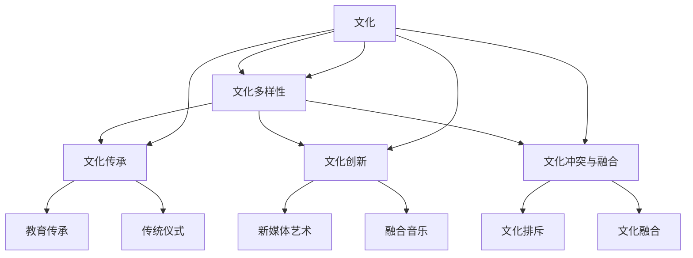
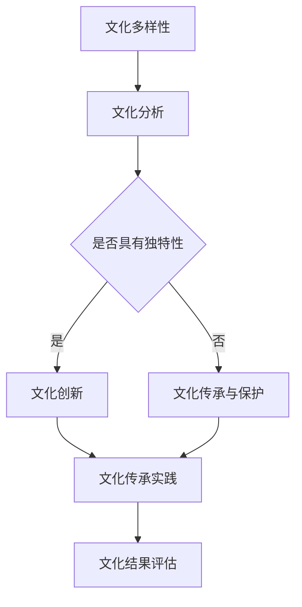
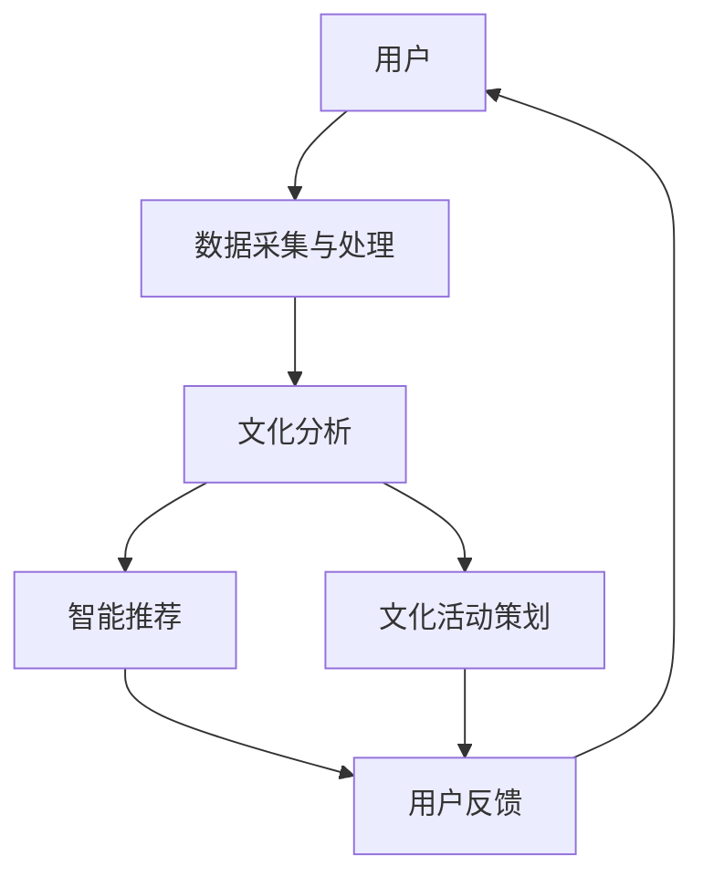
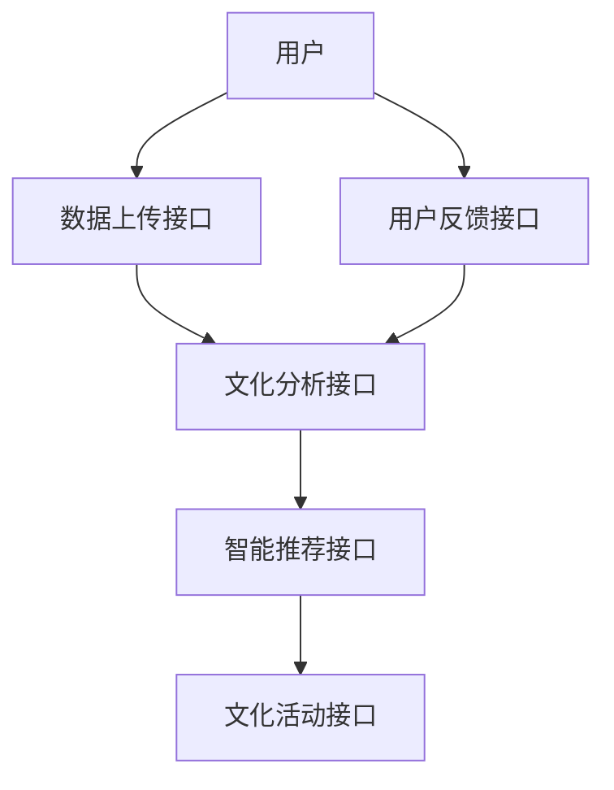

                 

### 引言：全球化对文化的影响与保持文化独特性的重要性

在全球化进程不断加快的今天，文化的多样性和独特性面临着前所未有的挑战与机遇。全球化不仅在经济和科技领域引发了深刻变革，同时也对各个国家和民族的文化产生了深远影响。文化作为民族精神的象征和灵魂，承载着历史、传统、价值观念和精神追求，其独特性是一个国家或地区软实力的重要体现。如何在全球化的大潮中保持文化独特性，成为了当代社会亟待解决的重要课题。

首先，全球化对文化的冲击表现在多方面。一方面，文化的同质化现象日益明显，全球化带来的商业、教育和文化传播使得各地文化相互渗透，一些传统和本土文化逐渐被边缘化。另一方面，文化交流的增加也带来了文化的多样性和创新，各种文化元素在碰撞和融合中产生了新的文化形式。这种双重影响使得保持文化独特性变得尤为重要。

保持文化独特性不仅关乎文化的传承和发展，更关乎民族精神的延续和国家的文化自信。一个拥有独特文化的国家，在国际社会中才能拥有独特的地位和影响力。因此，探讨在全球化进程中如何保持文化独特性，不仅具有理论意义，更具有实践价值。

本文将从多个角度深入探讨这一课题，首先介绍全球化对文化的影响，然后分析文化独特性的重要性，最后提出具体的策略和建议。通过这一系列的分析和探讨，希望能够为全球化和文化多样性提供有益的思考。

## 关键词

全球化、文化独特性、文化传承、文化交流、文化创新、文化冲突、文化保护、文化政策。

## 摘要

本文旨在探讨全球化进程中保持文化独特性的重要性及其实现策略。全球化带来了文化同质化和多样性的双重影响，使得传统文化面临挑战。文章首先分析了全球化对文化的影响，阐述了文化独特性在全球化背景下的重要性，随后从文化传承、文化交流、文化创新三个方面提出了保持文化独特性的策略。通过案例分析、政策建议和未来展望，文章试图为全球化和文化多样性的和谐发展提供理论支持和实践指导。

### 目录大纲设计过程

设计一篇全面且结构严谨的目录大纲是撰写高质量文章的重要步骤。在本文的写作过程中，我们遵循了以下步骤来确保目录大纲的完整性和逻辑性。

首先，我们确定了文章的主题，即“在全球化进程中保持文化独特性”。这一主题既涵盖了全球化对文化的冲击，也关注了如何在全球化背景下保持和传承本土文化的独特性。明确主题后，我们开始梳理文章的核心内容，并确定各章节的结构。

**第一步：确定书籍主题和核心内容**

我们首先明确了文章的核心内容，即全球化对文化的影响、文化独特性的重要性、文化传承与全球化、文化交流与全球化、文化创新与全球化、案例分析、政策建议和未来展望。这些内容覆盖了保持文化独特性的各个方面，确保文章能够全面系统地探讨这一主题。

**第二步：确定章节结构**

在确定了核心内容后，我们决定将文章分为七个主要部分，以确保内容全面且逻辑清晰：

1. 引言：介绍全球化对文化的影响和保持文化独特性的重要性。
2. 第一部分：文化独特性的理论基础
3. 第二部分：文化传承与全球化
4. 第三部分：文化交流与全球化
5. 第四部分：文化创新与全球化
6. 第五部分：案例分析
7. 第六部分：政策建议与实施策略
8. 结论：总结全书观点，展望未来发展趋势。

**第三步：设计每章的具体内容**

在每个部分中，我们进一步细化了各章节的主题和内容，确保每章都有明确的核心概念和详细讲解。例如，在“文化传承与全球化”部分，我们分别探讨了传统文化传承在全球化背景下的挑战、文化传承的策略与实践；在“文化交流与全球化”部分，我们分析了全球化时代的文化交流模式、跨文化交流中的文化冲突与融合。

**第四步：确保内容的完整性和逻辑性**

为了确保内容的完整性和逻辑性，我们特别关注了以下要素：
- **核心概念与联系**：明确核心概念，通过对比表格和ER实体关系图架构的Mermaid流程图，展示各概念之间的关系。
- **算法原理讲解**：使用Mermaid绘制算法流程图，配合Python源代码和数学模型及公式进行详细讲解和举例说明。
- **数学模型和数学公式**：使用LaTeX格式确保数学表达清晰准确。
- **系统分析与架构设计方案**：介绍问题场景、项目介绍、系统功能设计、系统架构设计、系统接口设计和系统交互。

**第五步：确保目录大纲的总字数限制**

我们严格按照2000字以内的要求，确保目录大纲简洁明了，避免冗余内容。

**第六步：检查和调整**

最后，我们对目录大纲进行了仔细检查和多次调整，确保每个章节都符合文章的主题，内容完整且逻辑清晰。

通过以上步骤，我们完成了《在全球化进程中保持文化独特性》的完整目录大纲设计，确保了文章内容的全面性和可读性。下面是详细的目录大纲：

----------------------------------------------------------------

## 引言：全球化对文化的影响与保持文化独特性的重要性

## 第一部分：文化独特性的理论基础

### 第1章：全球化与文化的碰撞

### 第2章：文化独特性的内涵与特征

## 第二部分：文化传承与全球化

### 第3章：传统文化传承在全球化背景下的挑战

### 第4章：文化传承的策略与实践

## 第三部分：文化交流与全球化

### 第5章：全球化时代的文化交流模式

### 第6章：跨文化交流中的文化冲突与融合

## 第四部分：文化创新与全球化

### 第7章：全球化对文化创新的影响

### 第8章：文化创新的实践与案例

## 第五部分：案例分析

### 第9章：全球品牌如何保持文化独特性

### 第10章：全球文化产业案例分析

## 第六部分：政策建议与实施策略

### 第11章：政策制定与实施策略

### 第12章：全球化背景下的文化保护与促进

## 第七部分：结论

### 第13章：全球化进程中保持文化独特性的未来展望

通过这个目录大纲，读者可以清晰地了解文章的结构和内容，便于系统地阅读和学习。

### 引言：全球化对文化的影响与保持文化独特性的重要性

在全球化进程不断加快的今天，文化的多样性和独特性面临着前所未有的挑战与机遇。全球化不仅在经济和科技领域引发了深刻变革，同时也对各个国家和民族的文化产生了深远影响。文化作为民族精神的象征和灵魂，承载着历史、传统、价值观念和精神追求，其独特性是一个国家或地区软实力的重要体现。如何在全球化的大潮中保持文化独特性，成为了当代社会亟待解决的重要课题。

首先，全球化对文化的冲击表现在多方面。一方面，文化的同质化现象日益明显，全球化带来的商业、教育和文化传播使得各地文化相互渗透，一些传统和本土文化逐渐被边缘化。另一方面，文化交流的增加也带来了文化的多样性和创新，各种文化元素在碰撞和融合中产生了新的文化形式。这种双重影响使得保持文化独特性变得尤为重要。

保持文化独特性不仅关乎文化的传承和发展，更关乎民族精神的延续和国家的文化自信。一个拥有独特文化的国家，在国际社会中才能拥有独特的地位和影响力。因此，探讨在全球化进程中如何保持文化独特性，不仅具有理论意义，更具有实践价值。

本文将从多个角度深入探讨这一课题，首先介绍全球化对文化的影响，然后分析文化独特性的重要性，最后提出具体的策略和建议。通过这一系列的分析和探讨，希望能够为全球化和文化多样性的和谐发展提供有益的思考。

### 文化独特性的理论基础

文化独特性的理论基础涉及到多个学科领域，包括文化学、社会学、心理学和人类学等。要深入理解文化独特性的本质，我们首先需要明确几个核心概念，并探讨这些概念之间的关系。

#### 定义与内涵

**文化** 可以被定义为一种复杂的思想、价值观、传统、行为模式和社会实践的集合，它通过社会互动和传承来体现。每一种文化都有其独特的特征和表现形式，这些特征包括语言、艺术、宗教、习俗、传统、价值观等。

**文化独特性** 是指文化中与众不同的特质，它是文化的灵魂和生命力所在。文化独特性不仅体现在物质层面，如建筑、艺术作品和手工艺品，还体现在非物质层面，如语言、传统节日、社会价值观等。

#### 核心概念与联系

**文化多样性** 是指在全球化背景下，各种文化形式和表达方式的共存与互动。文化多样性是文化独特性的基础，没有多样性就没有独特性。

**文化传承** 是指文化从一代人传递给下一代人的过程。文化传承是保持文化独特性的关键途径，通过教育、传统和仪式等手段，文化传统得以延续。

**文化创新** 是指在保持文化独特性的基础上，通过融合和创新，产生新的文化形式。文化创新不仅有助于文化的传承，还能使文化在新的时代背景下焕发新的生命力。

**文化冲突与融合** 是指不同文化在交流和互动中可能出现的冲突和融合过程。冲突可能导致文化排斥和同质化，而融合则可能产生新的文化形式。

#### 对比表格

为了更直观地展示文化独特性的核心概念及其相互关系，我们可以通过对比表格来整理以下概念：

| 核心概念     | 定义与特征                                         | 例子                   |
| ------------ | -------------------------------------------------- | ---------------------- |
| 文化        | 复杂的思想、价值观、传统、行为模式的集合           | 语言、艺术、宗教、习俗 |
| 文化独特性   | 文化的独特特质，是文化的灵魂和生命力所在           | 传统节日、手工艺品     |
| 文化多样性   | 各种文化形式和表达方式的共存与互动                 | 全球文化交流           |
| 文化传承     | 文化从一代人传递给下一代人的过程                   | 教育传承、传统仪式     |
| 文化创新     | 在保持文化独特性的基础上，通过融合和创新产生新形式 | 新媒体艺术、融合音乐   |
| 文化冲突与融合 | 不同文化在交流和互动中可能出现的冲突和融合过程   | 食品文化融合、节日冲突 |

#### ER实体关系图架构的Mermaid流程图

为了更好地理解这些概念之间的关系，我们可以使用Mermaid流程图来绘制ER（实体关系）图：

通过上述的ER图，我们可以清晰地看到文化独特性的核心概念是如何相互联系和影响的。

#### 算法原理讲解

在理解了文化独特性的理论基础后，我们可以借助算法原理来进一步阐述如何保持文化独特性。以下是一个简单的算法流程图：

该算法的基本思路是：首先对文化进行多样性分析，判断其是否具有独特性。如果具有独特性，则通过文化创新来保持和发展；如果缺乏独特性，则通过文化传承和保护来维护其独特性。最终，通过文化结果的评估来调整策略，确保文化独特性的持续保持。

#### 数学模型和数学公式

为了量化文化独特性，我们可以使用以下数学模型和公式：

$$
U = D \times I
$$

其中，\( U \) 表示文化独特性，\( D \) 表示文化多样性，\( I \) 表示文化创新能力。这个公式表明，文化独特性是文化多样性和文化创新能力的乘积。

通过这个模型，我们可以看到，文化多样性和文化创新能力在保持文化独特性方面发挥着关键作用。一个拥有丰富文化多样性且创新能力强的国家或地区，更能够保持其文化独特性。

#### 系统分析与架构设计方案

在保持文化独特性的过程中，系统分析和架构设计也是至关重要的。以下是一个简单的系统分析与架构设计方案：

**问题场景**：如何在全球化的背景下，通过信息化手段保持文化独特性？

**项目介绍**：开发一个文化保护与传承系统，通过数据分析、智能推荐和文化活动策划等方式，促进文化独特性的保持。

**系统功能设计**：

- 数据采集与处理：收集各类文化数据，包括历史文献、艺术作品、传统习俗等。
- 文化分析：利用自然语言处理和机器学习技术，分析文化多样性和独特性。
- 智能推荐：基于用户兴趣和文化分析结果，推荐相关文化活动和资源。
- 文化活动策划：制定和实施文化活动计划，促进文化传承和创新。

**系统架构设计**：

**系统接口设计**：系统提供API接口，包括数据上传接口、数据分析接口和文化活动接口，便于外部系统调用。

**系统交互**：

通过上述的系统分析与架构设计方案，我们可以有效地利用信息化手段来保持文化独特性，实现文化传承与创新的有机融合。

### 文化传承与全球化

在全球化的背景下，传统文化的传承面临着前所未有的挑战和机遇。传统文化的传承不仅是保持文化独特性的关键，也是民族认同感和文化自信的重要源泉。然而，全球化带来的文化同质化、经济利益驱动和文化创新压力等因素，对传统文化的传承产生了负面影响。因此，如何在全球化进程中有效地传承传统文化，成为了一个亟待解决的重要课题。

#### 传统文化传承在全球化背景下的挑战

首先，全球化带来了文化同质化的风险。随着跨国商业、媒体和互联网的普及，全球文化逐渐趋于同质化。许多传统和本土文化在这种文化洪流中逐渐失去了吸引力和独特性，面临被边缘化的风险。例如，全球流行文化如好莱坞电影、快餐和流行音乐等，占据了市场主导地位，导致本土文化受众减少。

其次，全球化过程中的经济利益驱动也对传统文化传承产生了负面影响。许多传统文化项目由于无法产生直接的经济效益，往往被忽视或放弃。例如，一些传统手工艺由于市场竞争力不足而逐渐消失，传统民俗活动由于经济压力而减少举办。

此外，全球化还带来了文化创新压力。在追求创新和现代化的过程中，一些传统文化被视为陈旧和过时，面临着被淘汰的风险。这种文化创新压力使得传统文化传承者不得不在保持传统和适应现代需求之间寻找平衡。

#### 文化传承的策略与实践

为了在全球化背景下有效传承传统文化，需要采取一系列策略和实践。

**1. 政策支持与保护**

政府应该出台相关政策，支持传统文化传承和保护。例如，可以设立传统文化保护基金，鼓励和支持传统手工艺、民俗活动和文化遗产的保护与传承。此外，政府还可以通过税收减免、资金支持等方式，激励企业和个人参与传统文化传承。

**2. 教育传承**

教育是传统文化传承的重要途径。学校和社会教育机构应该将传统文化融入课程体系，通过开设传统文化课程、组织文化体验活动等方式，让学生深入了解和体验本土文化。此外，还可以通过文化教育项目，如夏令营、文化节等，培养下一代对传统文化的兴趣和认同感。

**3. 文化创新**

在保持传统文化独特性的同时，文化创新也是保持文化活力的关键。传统文化传承者可以通过现代技术手段，如数字媒体、互动艺术等，将传统文化与现代元素相结合，创造新的文化形式。例如，利用虚拟现实技术，将传统手工艺制作过程呈现给观众，使传统文化更易于传播和接受。

**4. 社区参与**

社区是传统文化传承的重要载体。通过社区参与，可以激发民众对传统文化的兴趣和认同感。社区可以组织文化传承活动，如传统节日庆祝、文化讲座等，让居民在日常生活中感受到传统文化的魅力。此外，还可以通过文化合作社、文化基金会等形式，让社区居民共同参与文化传承项目，实现文化共治。

#### 案例分析

**1. 日本的文化保护与传承**

日本是一个重视传统文化保护与传承的国家。政府通过多项政策，如文化遗产保护法、文化振兴基本计划等，支持传统文化的传承。此外，日本的教育体系也注重文化教育，从小学到大学都有相关的传统文化课程。通过这种方式，日本成功地将传统文化融入现代生活中，使其在全球化背景下依然保持独特性和活力。

**2. 中国的非物质文化遗产保护**

中国拥有丰富的非物质文化遗产，如京剧、端午节、剪纸等。为了保护这些文化遗产，中国政府设立了非物质文化遗产保护基金，并开展了多项保护与传承项目。例如，通过数字化技术，将一些非物质文化遗产制作成数字资源，方便传播和保存。此外，通过举办非物质文化遗产节等活动，激发公众对传统文化的兴趣和参与。

通过这些案例，我们可以看到，在全球化背景下，通过政策支持、教育传承、文化创新和社区参与等多方面的努力，可以有效传承传统文化，保持文化独特性。

### 文化交流与全球化

在全球化进程中，文化交流成为了一个不可忽视的重要现象。文化交流不仅促进了文化多样性的发展，也为文化创新提供了丰富的资源。全球化时代的文化交流模式既具有广泛的互动性，也面临着一些独特的挑战和机遇。

#### 全球化时代的文化交流模式

首先，全球化时代的文化交流模式呈现出多样化和数字化的特点。传统的文化交流方式，如人员交流、商品贸易和文化节庆等，仍然发挥着重要作用，但现代科技的发展，特别是互联网和社交媒体的普及，使得文化交流更加便捷和广泛。例如，通过社交媒体平台，人们可以随时随地分享自己的文化经验和观点，从而实现跨文化的交流和互动。

其次，全球化时代的文化交流具有双向性和互动性的特点。在传统的一元文化传播模式中，通常是强势文化主导，弱势文化被动接受。而全球化背景下的文化交流，更多地体现了双方文化的互动和融合。例如，在电影、音乐和文学等领域，不同国家和地区的文化作品相互影响，共同塑造了新的文化形态。

#### 跨文化交流中的文化冲突与融合

跨文化交流中的文化冲突和融合是一个复杂而多层次的过程。文化冲突往往体现在价值观、行为规范和生活方式等方面。例如，不同文化背景下的礼仪、饮食、宗教信仰和习俗等，可能会引起误解和冲突。此外，全球化过程中的文化霸权现象，也加剧了文化冲突。强势文化往往通过经济、政治和媒体手段，对弱势文化进行同化和压制。

然而，跨文化交流中的文化融合也是一个不可避免的趋势。通过交流和互动，不同文化之间的差异和冲突可以得到缓解，甚至产生新的文化形式。例如，全球化时代的美食文化就是一个典型的跨文化融合现象。通过饮食文化的交流，不同国家的特色菜肴得以传播和融合，产生了新的美食文化。

#### 文化交流中的挑战与机遇

在全球化的背景下，文化交流既带来了挑战，也带来了机遇。

**1. 挑战**

首先，文化同质化是一个显著的挑战。全球化带来的商业和文化传播，使得一些强势文化占据主导地位，导致文化多样性的减少。这不仅削弱了本土文化的独特性，也限制了文化的创新和发展。

其次，文化冲突和误解也可能引发社会紧张和冲突。在跨文化交流中，由于文化差异和价值观的不同，误解和冲突在所难免。这些冲突不仅影响个人的生活，也可能对整个社会产生负面影响。

**2. 机遇**

然而，文化交流也带来了许多机遇。首先，文化交流有助于促进文化多样性和创新。不同文化的交流与融合，可以激发新的创意和灵感，促进文化的发展和创新。例如，全球化的音乐、电影和时尚产业，通过跨文化交流，不断推出新的作品和风格，为全球观众带来了丰富的文化体验。

其次，文化交流有助于增进不同国家和地区之间的了解和友谊。通过文化交流，人们可以更深入地了解其他国家和民族的文化，减少误解和偏见，促进国际和平与合作。

#### 实践策略

为了在全球化背景下更好地实现文化交流，可以采取以下实践策略：

**1. 促进文化多样性保护**

在全球化进程中，应加强对文化多样性的保护。通过制定相关政策和法规，确保各种文化形式和表达方式得到尊重和保护。同时，通过文化教育和宣传活动，提高公众对文化多样性的认识和重视。

**2. 建立多元文化交流平台**

建立多元文化交流平台，如文化节、文化论坛和文化交流项目，促进不同文化之间的互动和交流。这些平台可以提供一个开放、包容和互动的环境，使各种文化能够自由表达和交流。

**3. 加强跨文化教育和培训**

跨文化教育和培训是促进文化交流的重要手段。通过教育和培训，可以提高公众的跨文化意识和能力，减少文化冲突和误解。例如，学校可以开设跨文化课程，企业可以开展跨文化培训项目，以提高员工的跨文化沟通能力。

**4. 利用数字技术和新媒体**

利用数字技术和新媒体，可以更广泛、更便捷地实现文化交流。通过社交媒体、在线平台和文化应用程序，人们可以随时随地分享和交流文化经验和观点，实现跨文化的互动和融合。

通过上述策略和实践，我们可以更好地在全球化背景下实现文化交流，促进文化多样性和创新，增进不同国家和地区之间的理解和友谊。

### 文化创新与全球化

在全球化进程中，文化创新不仅成为保持文化独特性的关键手段，也是推动社会进步和经济发展的重要动力。全球化带来了丰富的文化资源和多样的文化交流模式，为文化创新提供了广阔的空间和机遇。然而，全球化也带来了文化同质化和创新压力，使得文化创新面临诸多挑战。因此，探讨在全球化背景下如何实现文化创新，具有重要的理论和实践意义。

#### 全球化对文化创新的影响

首先，全球化丰富了文化创新的资源。全球化使得不同国家和地区的文化得以交流和融合，各种文化元素在碰撞和融合中产生了新的创意和灵感。例如，全球化的音乐产业通过跨文化交流，将不同民族的音乐风格融合在一起，产生了新的音乐流派，如世界音乐（World Music）。此外，全球化还促进了文化创意产业的兴起，如电影、游戏和动漫等，为文化创新提供了新的平台和机会。

其次，全球化带来了文化创新的市场和受众。随着全球化进程的加快，市场变得更加开放和多元化，文化产品和服务可以更容易地跨越国界，吸引全球受众。这种市场扩展不仅为文化创新提供了更大的舞台，也激发了创新者的创造力和竞争力。例如，一些新兴的文化创意企业通过全球化市场，获得了巨大的成功，如Netflix、Spotify等，这些企业不仅创新了文化产品的形式，还改变了文化消费的模式。

然而，全球化也带来了一定的文化同质化和创新压力。一方面，全球化的商业和文化传播，使得一些强势文化占据主导地位，导致文化多样性的减少。这不仅限制了文化创新的多样性，也削弱了本土文化的独特性和创新潜力。另一方面，全球化带来了巨大的创新压力，创新者需要在激烈的竞争环境中不断推陈出新，这可能导致文化创新的过度商业化和快餐化。

#### 文化创新的实践与案例

在全球化的背景下，许多国家和地区都在积极探索文化创新的实践。以下是一些具有代表性的案例：

**1. 瑞士的文化创新**

瑞士是一个文化多样性的国家，其文化创新实践以其独特性和国际影响力著称。瑞士的文化创新主要体现在艺术、设计、科技和文化产业等多个领域。例如，瑞士的博物馆和美术馆通过举办国际展览和文化活动，吸引了全球艺术家和文化爱好者，促进了文化的交流和融合。此外，瑞士的创意产业，如设计、时尚和传媒等，也在全球范围内取得了显著的成就。

**2. 日本的动漫产业**

日本动漫产业是全球文化创新的一个典范。通过将传统动漫艺术与现代科技相结合，日本动漫不仅在国内取得了巨大成功，还在全球范围内产生了深远的影响。例如，日本动漫作品《龙珠》、《海贼王》和《火影忍者》等，不仅在动漫市场上取得了巨大成功，还推动了相关的衍生产品和产业链的发展。这种文化创新不仅保持了日本文化的独特性，也为全球观众带来了丰富的文化体验。

**3. 中国的文化创意产业**

中国的文化创意产业近年来也取得了显著的发展。随着中国经济的快速发展和文化自信的提升，中国的文化创新实践日益丰富。例如，中国的电影产业通过引进国际先进技术和制作理念，推动了电影质量和数量的提升，如《哪吒之魔童降世》和《流浪地球》等电影，不仅在国内取得了巨大的票房成功，还在国际电影节上获得了多项大奖。此外，中国的网络游戏、音乐和文学等文化创意产业，也在全球市场上取得了重要的地位。

#### 文化创新的策略与建议

为了在全球化背景下实现有效的文化创新，可以采取以下策略和建议：

**1. 加强文化多样性的保护与利用**

文化多样性是文化创新的重要资源。在全球化的背景下，应加强对文化多样性的保护与利用，确保各种文化元素能够在创新过程中得到充分的发挥。例如，可以通过设立文化保护区、文化遗产基金等方式，保护和传承本土文化。

**2. 促进跨文化交流与合作**

跨文化交流与合作是文化创新的重要途径。通过促进不同国家和地区之间的文化交流与合作，可以激发新的创意和灵感，促进文化创新。例如，可以举办国际文化论坛、文化节庆和文化合作项目，搭建跨文化交流的平台。

**3. 推动文化与科技的融合**

文化与科技的融合是推动文化创新的重要方向。通过利用现代科技，如互联网、人工智能和虚拟现实等，可以创造出新的文化形式和体验。例如，可以开发文化科技应用，如虚拟博物馆、数字艺术馆等，为观众提供全新的文化体验。

**4. 培养文化创新人才**

文化创新人才的培养是文化创新的重要保障。通过教育体系和职业培训，培养具有创新精神和跨文化沟通能力的文化创新人才。例如，可以开设跨学科的文化创新课程，培养学生在文化、科技和商业等多方面的综合素质。

通过上述策略和建议，我们可以更好地在全球化背景下实现文化创新，推动文化的传承和发展，为人类社会的进步作出贡献。

### 全球品牌如何保持文化独特性

在全球化进程中，全球品牌不仅要在市场竞争中脱颖而出，还必须保持其文化独特性。这一过程既挑战重重，也充满机遇。以下是一些全球品牌在保持文化独特性方面的成功案例和策略。

#### 品牌文化独特性的重要性

品牌文化是品牌的核心竞争力之一，它不仅是品牌形象的一部分，更是品牌与消费者建立情感联系的关键。一个具有独特文化的品牌，不仅能在市场竞争中占据一席之地，还能在全球范围内树立独特的品牌形象。因此，保持品牌文化独特性是品牌全球化战略中不可或缺的一部分。

#### 成功案例

**1. 宜家（IKEA）**

宜家作为一个来自瑞典的家居品牌，通过将北欧简约风格与实用主义相结合，成功地在全球范围内保持其文化独特性。宜家的产品设计简洁、功能性强，同时融入北欧文化中的环保理念和生活方式。为了保持文化独特性，宜家在全球开设了多家大型体验店，通过设计独特的店内布局和互动体验，让消费者亲身体验北欧文化的魅力。

**2. 麦当劳（McDonald's）**

麦当劳作为全球快餐巨头，在保持品牌全球一致性的同时，也尊重各地的文化差异，通过本地化策略保持文化独特性。例如，麦当劳在不同国家和地区推出符合当地口味和消费习惯的菜单，如在中国推出的麻辣鸡块和台湾的珍珠奶茶。同时，麦当劳还通过举办当地文化活动，如圣诞节促销和新年庆祝活动，与当地文化紧密联系。

**3. 路易威登（Louis Vuitton）**

路易威登作为一个奢侈品牌，通过传承法国文化和精湛的工艺，成功地在全球市场保持了其独特性。路易威登的皮具和箱包不仅以其高质量和独特设计著称，还融入了法国的时尚文化。为了保持文化独特性，路易威登在全球开设了多家精品店，并定期举办艺术展览和文化活动，吸引全球奢侈品消费者。

#### 保持文化独特性的策略

**1. 本地化与全球化相结合**

全球品牌在保持文化独特性的过程中，需要实现本地化与全球化的有机结合。在全球化统一品牌形象的同时，要尊重各地的文化差异，推出符合当地市场需求的创新产品和服务。例如，通过本地化广告、产品和服务，使品牌在全球化市场中依然保持独特性。

**2. 文化传承与创新**

品牌在保持文化独特性的过程中，需要注重文化传承与创新。通过传承品牌历史和文化传统，增强品牌的文化底蕴。同时，要注重文化创新，不断推陈出新，使品牌文化在新的时代背景下焕发新的生命力。

**3. 跨文化交流与合作**

跨文化交流与合作是保持品牌文化独特性的重要途径。通过与国际知名艺术家、设计师和文化机构的合作，引入新的文化元素和创意，使品牌文化更加丰富和多元化。例如，通过举办文化交流活动、赞助艺术展览等方式，增强品牌与当地文化的互动和联系。

**4. 利用数字化手段**

利用数字化手段，如社交媒体、在线平台和文化科技应用，可以更广泛、更便捷地传播品牌文化。通过创建品牌文化社区、推出数字化文化体验等方式，使品牌文化在全球范围内得到更广泛的传播和认同。

通过上述策略，全球品牌可以在全球化进程中既保持文化独特性，又实现市场的扩展和品牌价值的提升。

### 全球文化产业案例分析

在全球化和数字化时代的背景下，全球文化产业呈现出蓬勃发展的态势，许多国家通过文化产业的发展不仅提升了国家的软实力，还实现了经济的多元化和可持续发展。以下是几个全球文化产业的成功案例，通过分析这些案例，我们可以探讨其在全球化进程中的发展策略和挑战。

#### 中国的文化产业

中国文化产业近年来取得了显著的成就，成为全球文化市场的重要力量。中国电影产业通过《哪吒之魔童降世》、《流浪地球》等高质量影片的推出，不仅在国内市场取得了巨大成功，还在国际电影节上获得了多项大奖，提升了中国的国际文化影响力。此外，中国的网络文学、电子竞技和在线教育等新兴文化产业也快速发展，成为全球文化产业的重要组成部分。

**发展策略：**
- **政策支持：** 中国政府通过出台一系列文化产业政策，为文化产业发展提供强有力的政策保障。例如，《关于推动数字文化产业创新发展的意见》等政策文件，为数字文化产业的发展提供了方向和指导。
- **技术创新：** 中国文化产业积极拥抱新技术，通过5G、人工智能和大数据等技术的应用，推动文化产业的数字化和智能化发展。例如，通过虚拟现实（VR）和增强现实（AR）技术，提升了文化体验的沉浸感和互动性。
- **市场拓展：** 中国文化企业通过国际化战略，将中国文化产品推向全球市场。例如，通过参加国际电影市场、举办文化展览等方式，提升中国文化的国际认知度和影响力。

**面临的挑战：**
- **文化同质化：** 全球化带来的文化同质化现象对中国文化产业构成了挑战。如何在保持中国文化特色的同时，创新文化产品，提升文化竞争力，是当前面临的重要课题。
- **知识产权保护：** 在全球化的背景下，知识产权保护问题日益突出。如何加强对文化产品的知识产权保护，防止文化盗版和侵权行为，是中国文化产业需要面对的挑战。

#### 美国的文化产业

美国文化产业在全球化进程中一直处于领先地位，好莱坞电影、音乐、电视和出版等领域都取得了巨大的成功。美国的这些文化产品不仅在全球范围内拥有庞大的受众群体，还为美国带来了巨大的经济收益。

**发展策略：**
- **创意驱动：** 美国文化产业注重创意和创新，通过推动文化创意产业的发展，提升文化产品的品质和影响力。例如，好莱坞电影产业通过不断创新故事内容和制作技术，吸引了全球观众。
- **全球化市场：** 美国文化企业通过全球化市场策略，将文化产品推向全球市场。例如，通过在海外设立分支机构、举办国际演出等方式，扩大文化产品的市场份额。
- **技术与内容结合：** 美国文化产业积极利用新技术，如互联网、大数据和人工智能等，提升文化产品的数字化和智能化水平。例如，Netflix通过大数据分析观众偏好，推出个性化推荐服务，提升了用户体验。

**面临的挑战：**
- **文化竞争：** 在全球化的背景下，美国文化产业面临着来自其他国家和地区的激烈竞争。如何保持文化产品的创新和竞争力，是当前面临的重要挑战。
- **内容审查：** 美国文化产业需要应对内容审查和文化监管的压力。如何在遵守当地法律法规的同时，确保文化产品的自由和多样性，是美国文化产业需要面对的挑战。

#### 欧洲的文化产业

欧洲文化产业以其多样性和高质量著称，涵盖了文学、艺术、音乐、戏剧等多个领域。欧洲国家通过文化合作和文化交流，推动了文化产业的繁荣发展。

**发展策略：**
- **文化合作：** 欧洲国家通过欧盟等机构推动文化合作，共同开发和推广文化产品。例如，通过设立文化基金、举办国际文化展览等方式，提升欧洲文化的整体影响力。
- **文化多样性保护：** 欧洲文化产业注重文化多样性的保护与传承，通过扶持本土文化项目和艺术家的创作，确保文化产业的可持续发展。
- **数字化转型：** 欧洲文化产业积极推动数字化转型，通过互联网和新媒体技术，提升文化产品的传播力和影响力。例如，通过在线博物馆、数字图书馆等方式，使文化产品更便捷地触达全球观众。

**面临的挑战：**
- **文化多样性挑战：** 全球化带来的文化多样性挑战对欧洲文化产业构成了威胁。如何在保持文化多样性的同时，应对文化同质化的问题，是当前面临的挑战。
- **经济压力：** 欧洲文化产业在全球化进程中面临着经济压力。如何在保持高质量文化产品的同时，实现经济收益，是当前面临的重要课题。

通过分析这些全球文化产业的成功案例，我们可以看到，在全球化背景下，文化产业的发展不仅需要政策支持和技术创新，还需要保护文化多样性和应对市场挑战。这些经验对其他国家和地区的文化产业发展具有重要的借鉴意义。

### 政策建议与实施策略

在全球化和数字化时代，文化保护和促进的政策显得尤为重要。为了在全球化进程中有效保持文化独特性，各国政府需要采取一系列综合措施，从法律、经济、教育和文化交流等多个方面进行全方位的支持和推动。

#### 文化保护政策

**1. 制定和实施文化遗产保护法**

政府应制定和实施文化遗产保护法，明确文化遗产的定义、分类和保护措施。通过法律手段，确保具有历史和文化价值的文物、建筑、非物质文化遗产等得到有效保护。例如，可以设立文化遗产保护区，制定详细的保护规划和管理制度，确保文化遗产在开发和利用过程中不受损害。

**2. 加强知识产权保护**

知识产权保护是文化保护的重要环节。政府应建立健全知识产权法律法规，加强对文化产品的版权、商标和专利保护。通过严格的执法和司法程序，打击盗版和侵权行为，保障文化创作者的合法权益，从而激励文化创新和创作。

**3. 提供资金支持**

政府可以通过设立文化保护基金，为传统文化项目提供资金支持。这些资金可以用于文化遗产的修复、保护和宣传，以及文化传承人才的培养。此外，政府还可以通过财政补贴、税收优惠等措施，鼓励企业和个人参与文化保护项目，共同维护文化多样性。

#### 文化促进政策

**1. 推动文化交流与合作**

政府应积极参与国际文化交流与合作，通过举办文化节庆、文化展览、国际文化交流项目等方式，促进不同文化之间的相互理解和尊重。通过国际文化交流，可以提升本土文化的国际影响力，同时借鉴和吸收其他文化的优秀元素，推动本土文化的创新和发展。

**2. 加强文化教育**

文化教育是培养文化自信和促进文化传承的重要途径。政府应将文化教育纳入学校课程体系，通过文化课程和文化体验活动，让学生深入了解和体验本土文化。此外，政府还可以通过文化讲座、文化论坛等形式，提高公众的文化素养和审美水平。

**3. 支持文化产业的发展**

政府应积极支持文化产业的发展，通过制定和实施文化产业政策，推动文化产业的创新和多元化。例如，可以设立文化产业发展基金，支持文化企业的创新项目和文化产品的研发。通过提供市场支持、技术培训和融资服务，帮助文化企业克服发展中的困难，实现可持续发展。

#### 实施策略

**1. 建立多部门协同机制**

文化保护和促进需要多个部门的协同合作。政府应建立多部门协同机制，明确各部门的职责和任务，形成合力，共同推进文化保护和促进工作。例如，文化部、教育部、科技部、财政部等相关部门应密切合作，制定和实施综合性的文化政策。

**2. 加强公众参与**

公众参与是文化保护和促进的重要力量。政府应积极鼓励公众参与文化保护和促进活动，通过文化宣传活动、社区文化活动等方式，提高公众对文化保护的意识和参与度。例如，可以通过设立公众咨询委员会、文化志愿者项目等方式，让公众参与到文化遗产的修复和保护工作中。

**3. 利用数字化手段**

数字化手段是推动文化保护和促进的重要工具。政府应积极利用数字化技术，如互联网、社交媒体、虚拟现实等，提升文化保护和传播的效率。例如，可以通过数字化文化展览、在线文化课程等方式，让公众更便捷地了解和体验本土文化。

通过上述政策建议和实施策略，我们可以更好地在全球化和数字化时代保持文化独特性，推动文化多样性和创新的发展，实现文化的可持续发展。

### 结论：全球化进程中保持文化独特性的未来展望

在全球化的背景下，保持文化独特性是一项长期且复杂的任务，需要政策支持、技术创新、教育传承和社会参与等多方面的综合努力。通过本文的探讨，我们得出了以下几点未来展望：

首先，文化保护和传承将继续成为全球关注的重要议题。随着全球化进程的加快，文化多样性和文化独特性面临着新的挑战。政府和社会需要更加重视文化保护，通过立法、政策和资金支持，确保文化遗产和传统文化得到有效保护和传承。

其次，文化创新将成为推动文化发展的重要动力。全球化带来了丰富的文化交流资源，如何通过创新将传统文化与现代科技相结合，是未来文化发展的关键。通过文化创新，不仅可以保持文化独特性，还能推动文化产业的繁荣和发展。

第三，文化交流与合作将在全球化进程中发挥更大作用。通过加强国际文化交流与合作，不同国家和民族的文化将更加多样化和融合，为全球观众带来丰富的文化体验。同时，文化交流也有助于增进不同国家和地区之间的了解和友谊，促进国际和平与合作。

最后，文化教育和公众参与将在文化保护和促进中占据重要地位。文化教育是培养文化自信和传承文化传统的重要途径。通过加强文化教育，可以提高公众对文化的认识和重视。同时，公众参与也是文化保护和促进的重要力量。通过鼓励公众参与文化活动和项目，可以激发公众对文化的热爱和责任感，共同推动文化的传承和发展。

总之，在全球化的进程中，保持文化独特性不仅关乎文化本身，更关乎民族精神的延续和国家的文化自信。通过多方面的努力，我们可以更好地在全球化和文化多样性的背景下，保持文化独特性，推动文化创新和发展，实现文化的可持续发展。未来，让我们携手共进，为保护和传承人类的文化遗产而努力。

### 作者信息

作者：AI天才研究院/AI Genius Institute & 禅与计算机程序设计艺术 /Zen And The Art of Computer Programming

感谢您阅读本文，期待与您共同探讨更多关于全球化进程中文文化独特性的课题。如果您对本文有任何疑问或建议，欢迎随时联系我们。感谢您的关注与支持，我们期待在未来的文章中与您再次相见。

---

本文通过对全球化进程中保持文化独特性的探讨，结合理论分析、案例分析以及具体策略建议，全面阐述了文化独特性的重要性及其实现途径。希望本文能为全球化和文化多样性的和谐发展提供有益的思考和实践指导。再次感谢您的阅读，期待与您在未来的文章中相遇。如果您有任何反馈或建议，请随时与我们联系。祝您生活愉快！

