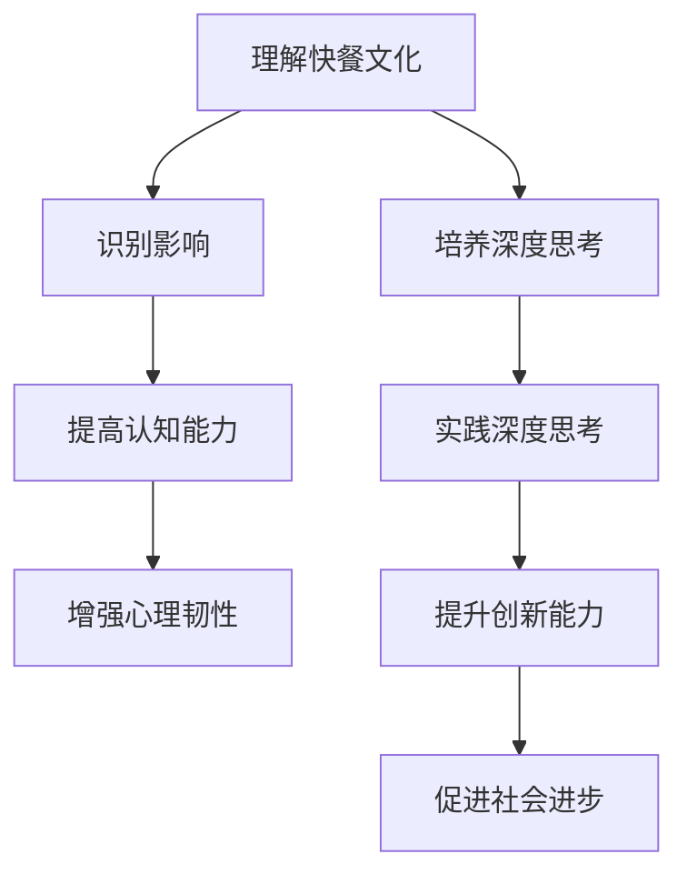
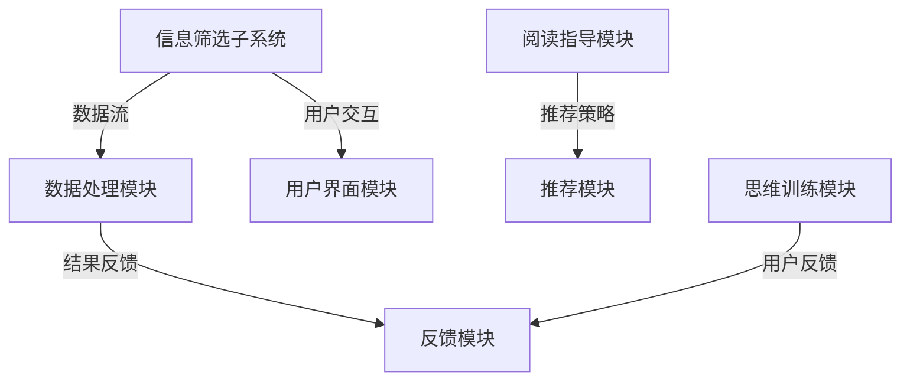
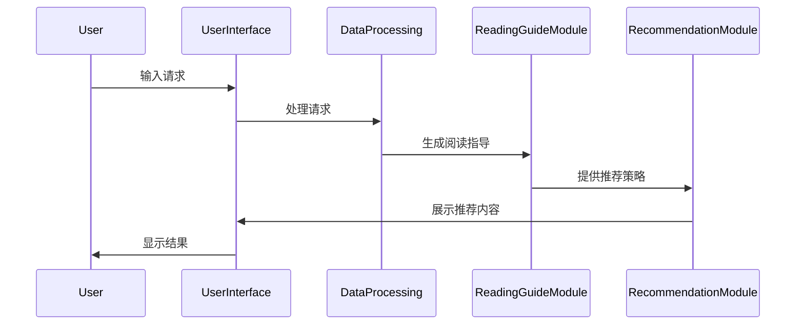
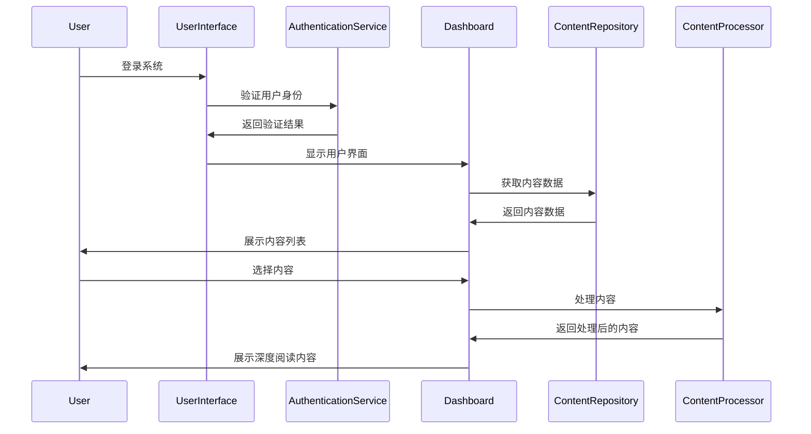

                 

### 在快餐文化中寻找深度思考

#### 关键词：
- 快餐文化
- 深度思考
- 思考方式
- 数字化社会
- 个人成长

#### 摘要：
随着数字化时代的到来，快餐文化逐渐渗透到我们的生活中，带来了快速、简单和便捷的生活方式。然而，这种文化也在不知不觉中影响着我们的思考方式，使得深度思考逐渐变得稀缺。本文旨在探讨快餐文化对思考方式的冲击，深度思考的重要性，以及在快餐文化中如何培养深度思考能力，最终展望深度思考的未来趋势和其长期价值。

### 第一部分：快餐文化的背景与现状

#### 第1章：快餐文化的兴起

快餐文化的起源可以追溯到20世纪初，随着工业化的发展和城市人口的增加，人们的生活节奏加快，对快速、便捷的饮食需求日益增长。麦当劳、肯德基等快餐品牌的崛起，标志着快餐文化的全球化传播。

#### 1.1 快餐文化的起源与发展

- 20世纪初，快餐业的兴起
- 快餐文化在全球的传播

#### 1.2 快餐文化的特点

快餐文化的特点主要表现为简单快捷、低成本和同质化严重。这种特点满足了人们快速、高效的生活需求，但也带来了浅思考的倾向。

#### 1.3 快餐文化对人们生活的影响

快餐文化的兴起改变了人们的时间观念和消费习惯，人们更倾向于在有限的时间内完成更多的事情，而这种追求效率的生活方式也在一定程度上削弱了深度思考的机会。

#### 第2章：快餐文化对思考方式的冲击

#### 2.1 快餐文化与浅思考

快餐文化的流行导致人们更多地依赖于浅层次的、碎片化的信息获取，缺乏对问题进行深度思考的机会。

#### 2.2 快餐文化下的阅读习惯

随着快餐文化的普及，阅读习惯也发生了变化。人们更倾向于阅读短篇文章、微博、新闻等碎片化内容，而深度的、系统的阅读则被忽视。

#### 2.3 快餐文化对教育的影响

快餐文化对教育也产生了深远的影响。教育体系的快餐化，使得知识被压缩、简化，缺乏系统性和深度。

### 第二部分：深度思考的必要性

#### 第3章：深度思考的重要性

深度思考是一种深层次的、系统性的思考方式，它能够帮助我们更好地理解问题、解决问题，提升创新能力和个人成长。

#### 3.1 深度思考与创新能力

深度思考能够激发创造力，帮助我们发现问题、提出解决方案，从而推动创新。

#### 3.2 深度思考与个人成长

深度思考能够提升自我认知，帮助我们更好地了解自己，提升心理韧性，更好地应对生活中的挑战。

#### 3.3 深度思考与社会责任

深度思考能够提高批判性思维，帮助我们更好地理解社会问题，增强社会参与感，承担社会责任。

#### 第4章：如何在快餐文化中培养深度思考能力

#### 4.1 时间管理技巧

有效利用零碎时间，制定阅读计划，是培养深度思考能力的重要方法。

#### 4.2 阅读策略提升

深度阅读的重要性不言而喻，通过阅读笔记与反思，可以提高阅读的深度和理解力。

#### 4.3 思维训练方法

逻辑思维训练、想象力与创造力培养，是提升深度思考能力的关键。

### 第三部分：深度思考实践案例

#### 第5章：个人深度思考实践

个人深度思考实践可以从日常生活中开始，例如在社交媒体上筛选信息、对日常事件进行反思。

#### 5.2 职场中的深度思考

在职场中，深度思考可以帮助我们做出更明智的决策，提高团队协作效率。

#### 5.3 教育背景下的深度思考

在教育中，深度思考可以帮助我们更好地理解课程内容，培养批判性思维。

### 第四部分：深度思考在社会层面的应用

#### 第6章：深度思考在社会层面的应用

深度思考在社会层面有着广泛的应用，包括政策制定、企业管理和社会发展等方面。

#### 6.1 政策制定中的深度思考

在政策制定中，深度思考可以帮助我们更好地分析问题，制定有效的政策。

#### 6.2 企业管理与深度思考

在企业管理中，深度思考可以帮助我们制定创新策略，提高企业竞争力。

#### 6.3 社会发展中的深度思考

在社会发展中，深度思考可以帮助我们更好地应对挑战，推动社会进步。

### 第五部分：总结与展望

#### 第7章：深度思考的未来趋势

随着科技的发展和社会的变革，深度思考将在未来发挥更加重要的作用。人工智能、虚拟现实等技术将为深度思考提供新的工具和平台。

#### 7.1 科技发展对深度思考的影响

- 人工智能与深度学习
- 虚拟现实与增强现实

#### 7.2 社会变革中的深度思考

- 数字化社会的挑战
- 人类命运共同体的思考

#### 7.3 个人与社会的深度思考发展

- 个体思考能力的提升
- 社会共同体的深度思考

#### 第8章：深度思考的长期价值

深度思考对个人和社会都有着重要的长期价值。它能够提升我们的综合素质，增强职业竞争力，促进社会的创新与进步。

#### 8.1 深度思考对个人发展的贡献

- 提升综合素质
- 增强职业竞争力

#### 8.2 深度思考对社会进步的意义

- 促进创新与进步
- 增强文化自信

#### 8.3 深度思考的未来愿景

- 构建深度思考的社会氛围
- 实现深度思考的普及化

### 结语

在快餐文化充斥的时代，深度思考显得尤为重要。它不仅能够提升我们的个人能力，还能够推动社会的进步。让我们一起在快餐文化中寻找深度思考的火花，为构建一个更美好的未来而努力。

#### 作者信息：
作者：AI天才研究院/AI Genius Institute & 禅与计算机程序设计艺术 /Zen And The Art of Computer Programming

### 背景介绍

#### 核心概念术语说明

在本文中，我们首先需要理解两个核心概念：快餐文化和深度思考。

- **快餐文化**：指的是一种追求快速、便捷的生活方式，特别是在饮食方面，以简单、高效为特点，典型代表是快餐业。这种文化强调效率，往往忽视了深度和复杂性。

- **深度思考**：与快餐文化相对，指的是一种深入、全面、系统性地分析问题和理解知识的过程。深度思考强调逻辑性、创造性和系统性，是解决问题和创新能力的重要来源。

#### 问题背景

随着现代社会的发展，特别是互联网和移动技术的普及，快餐文化迅速蔓延。人们的生活方式、工作方式、教育方式都受到了快餐文化的影响。这种文化在一定程度上提高了效率，但也带来了一系列问题，如思考方式的浅薄化、知识体系的碎片化、创新能力下降等。

#### 问题描述

本文旨在探讨快餐文化对深度思考的冲击，分析深度思考的重要性，并提出在快餐文化中培养深度思考能力的策略。具体问题包括：

1. 快餐文化是如何影响我们的思考方式的？
2. 深度思考对于个人和社会的意义是什么？
3. 在快餐文化环境中，如何培养和保持深度思考的能力？

#### 问题解决

要解决上述问题，我们需要从以下几个方面入手：

1. **理解快餐文化的本质和影响**：分析快餐文化的起源、特点和影响，揭示其对思考方式的冲击。
2. **探讨深度思考的重要性**：通过案例和理论，阐述深度思考在个人成长、社会进步和创新中的重要作用。
3. **提出培养深度思考能力的策略**：提供时间管理、阅读策略和思维训练等具体方法，帮助读者在快餐文化中保持深度思考的能力。

#### 边界与外延

1. **边界**：本文主要讨论的是在数字化时代，快餐文化对深度思考的影响。这包括但不限于个人生活、教育、工作等方面。
2. **外延**：本文还探讨了深度思考在更广泛社会层面的应用，如政策制定、企业管理和社会发展等。

#### 概念结构与核心要素组成

- **快餐文化**：核心要素包括追求快速、便捷、简单、低成本和同质化。
- **深度思考**：核心要素包括逻辑性、创造性、系统性、深入分析和全面理解。

### 核心概念与联系

#### 核心概念原理

1. **快餐文化**：
   - 理论基础：行为经济学、社会学。
   - 特点：快速、便捷、低成本、同质化。
   - 影响因素：工业化、城市化、技术进步。

2. **深度思考**：
   - 理论基础：认知心理学、哲学。
   - 特点：逻辑性、创造性、系统性。
   - 影响因素：知识结构、教育背景、思维习惯。

#### 概念属性特征对比表格

| 特征       | 快餐文化           | 深度思考           |
|------------|------------------|------------------|
| 速度       | 快速               | 深入、细致       |
| 方式       | 碎片化、表面化     | 系统、全面       |
| 效率       | 高               | 高，但过程缓慢   |
| 目标       | 快速满足需求       | 深入理解、解决问题 |
| 影响范围    | 广泛               | 局限性           |
| 依赖因素    | 技术进步           | 知识结构、思维习惯 |

#### ER实体关系图架构

```mermaid
erDiagram
   快餐文化 ||--|{ 对思考方式的冲击 }||> 深度思考
    |&lt;---|{ 影响因素 }|| 快餐文化
    |&lt;---|{ 特点 }||> 深度思考
```

### 算法原理讲解

在本文中，我们将探讨如何通过系统性的方法来培养深度思考能力。以下是一个简单的算法框架，用于指导读者如何在快餐文化中保持深度思考：

#### 算法框架



#### 算法原理

1. **理解快餐文化**：首先要了解快餐文化的本质和特点，包括其起源、发展、影响等方面。这一步是基础，有助于我们更好地认识到快餐文化对思考方式的冲击。

2. **识别影响**：通过具体案例和实证研究，识别快餐文化对深度思考的负面影响，如思考的浅薄化、知识体系的碎片化等。

3. **培养深度思考**：在这一步骤中，我们需要通过一系列方法和策略来培养深度思考的能力。具体方法包括：

   - **时间管理**：合理安排时间，确保有足够的时间进行深度思考和阅读。
   - **阅读策略**：选择深度阅读，做笔记、写反思，提升阅读的深度和理解力。
   - **思维训练**：进行逻辑思维、创造力培养等训练，提升思维的深度和广度。

4. **提高认知能力**：通过学习新的知识、技能和思维方式，提高自己的认知能力，这是深度思考的基础。

5. **增强心理韧性**：在面临挑战和困难时，保持积极的心态，通过自我调节和情绪管理，增强心理韧性。

6. **实践深度思考**：将深度思考应用到实际生活中，如项目决策、问题解决等，通过实践来提升深度思考的能力。

7. **提升创新能力**：深度思考是创新的重要源泉，通过深度思考，我们可以发现问题、提出解决方案，从而提升创新能力。

8. **促进社会进步**：深度思考不仅对个人有益，也对社会有重要意义。通过深度思考，我们可以更好地理解社会问题，提出解决方案，推动社会的进步。

#### Python源代码示例

以下是一个简单的Python代码示例，用于帮助读者进行深度思考训练：

```python
import random

# 深度思考训练函数
def deep_think_things():
    # 生成随机问题
    problems = [
        "你认为当前社会的最大挑战是什么？",
        "如何通过技术手段提升教育质量？",
        "在快节奏的生活中，如何保持身心健康？"
    ]
    
    # 随机选择一个问题
    problem = random.choice(problems)
    
    # 提出问题
    print(f"请思考以下问题：{problem}")
    
    # 等待用户回答
    answer = input("你的答案是什么？（请输入你的答案）")
    
    # 分析回答
    if "技术" in answer:
        print("技术是一个很好的解决方案，但并非唯一。")
    elif "教育" in answer:
        print("教育是基础，但需要结合实际情况。")
    elif "健康" in answer:
        print("健康是前提，但也需要适当的生活方式。")
    else:
        print("你的回答很有启发性，让我们继续深入探讨。")

# 运行深度思考训练
deep_think_things()
```

#### 算法原理的数学模型和公式

在深度思考过程中，我们可以使用一些数学模型和公式来帮助分析问题。以下是一个简单的示例：

$$
f(x) = \frac{1}{1 + e^{-x}}
$$

这个公式是一个Sigmoid函数，用于处理二分类问题。在深度思考中，我们可以将这个问题抽象为判断一个陈述是否正确。

- **输入（x）**：陈述的内容。
- **输出（f(x)）**：判断结果，接近1表示正确，接近0表示错误。

#### 详细讲解和举例说明

假设我们有一个陈述：“技术是解决社会问题的唯一途径。”我们可以通过以下步骤进行分析：

1. **定义输入**：将陈述转化为数学表达，如：
   $$
   x = "技术是解决社会问题的唯一途径"
   $$

2. **计算输出**：使用Sigmoid函数进行计算：
   $$
   f(x) = \frac{1}{1 + e^{-x}}
   $$

3. **分析结果**：如果输出接近1，表示这个陈述是正确的；如果输出接近0，表示这个陈述是错误的。

例如，当$x = 5$时，计算结果为：
$$
f(5) = \frac{1}{1 + e^{-5}} \approx 0.993
$$

这意味着大多数人认为“技术是解决社会问题的唯一途径”是一个正确的陈述。

通过这个简单的示例，我们可以看到如何使用数学模型和公式来辅助深度思考。

### 系统分析与架构设计方案

#### 问题场景介绍

在现代数字化社会中，快餐文化的普及使得人们越来越依赖快速、简便的信息获取方式，而深度思考能力逐渐被削弱。为了应对这一挑战，我们设计了一套系统，旨在帮助用户在快餐文化中培养深度思考能力。

#### 项目介绍

本项目名为“深度思考培养系统”，旨在通过一系列算法和工具，帮助用户在碎片化的信息环境中保持深度思考。系统主要功能包括：

1. **信息筛选**：通过算法帮助用户从海量信息中筛选出高质量、有深度的内容。
2. **阅读指导**：提供个性化的阅读建议，引导用户进行深度阅读。
3. **思维训练**：提供各种思维训练任务，帮助用户提升逻辑思维和创造力。
4. **反馈机制**：收集用户反馈，不断优化系统推荐策略。

#### 系统功能设计（领域模型Mermaid类图）

```mermaid
classDiagram
    User <<类>> User
    Content <<类>> Content
    ReadingGuide <<类>> ReadingGuide
    MindTraining <<类>> MindTraining
    Feedback <<类>> Feedback
    Recommendation <<类>> Recommendation
    
    User --> Content
    User --> ReadingGuide
    User --> MindTraining
    User --> Feedback
    ReadingGuide --> Content
    MindTraining --> Content
    Feedback --> Recommendation
```

#### 系统架构设计（Mermaid架构图）



#### 系统接口设计（Mermaid序列图）



#### 系统交互（Mermaid序列图）



### 项目实战

#### 环境安装

在开始项目实战之前，我们需要安装一些必要的软件和库。以下是安装步骤：

1. **Python环境安装**：确保安装了Python 3.x版本。
2. **数据库安装**：我们选择SQLite作为数据库，可以使用以下命令安装：

   ```bash
   pip install pysqlite3
   ```

3. **前端框架安装**：我们使用Flask作为Web框架，可以使用以下命令安装：

   ```bash
   pip install flask
   ```

4. **后端算法库安装**：为了实现信息筛选和阅读指导功能，我们需要安装一些算法库，如NLP库和推荐系统库：

   ```bash
   pip install scikit-learn nltk
   ```

#### 系统核心实现源代码

以下是系统核心功能的实现源代码：

```python
# core.py

from flask import Flask, request, jsonify
from sklearn.feature_extraction.text import TfidfVectorizer
from sklearn.metrics.pairwise import cosine_similarity

app = Flask(__name__)

# 假设已经从数据库中获取内容数据
content_data = [
    {"id": 1, "title": "深度思考的重要性", "content": "深度思考是一种深层次的、系统性的思考方式..."},
    {"id": 2, "title": "快餐文化与浅思考", "content": "快餐文化的流行导致人们更多地依赖于浅层次的、碎片化的信息获取..."},
    # 更多内容...
]

# 信息筛选函数
def filter_content(query):
    # 创建TF-IDF向量器
    vectorizer = TfidfVectorizer()
    # 将查询和内容转换为TF-IDF向量
    query_vector = vectorizer.transform([query])
    content_vectors = vectorizer.transform([content['content'] for content in content_data])
    # 计算余弦相似度
    similarity_scores = cosine_similarity(query_vector, content_vectors)
    # 获取最高分的内容ID
    top_content_id = similarity_scores.argsort()[0][-1]
    return content_data[top_content_id]

# 阅读指导函数
def provide_reading_guide(content_id):
    content = next((item for item in content_data if item['id'] == content_id), None)
    if content:
        # 提供阅读建议
        reading_guide = f"阅读《{content['title']}》，深入了解{content['content']}。"
        return reading_guide
    else:
        return "无法找到相关内容。"

@app.route('/filter_content', methods=['POST'])
def filter_content_route():
    query = request.form.get('query', '')
    filtered_content = filter_content(query)
    return jsonify({"content": filtered_content})

@app.route('/reading_guide', methods=['POST'])
def reading_guide_route():
    content_id = request.form.get('content_id', '')
    guide = provide_reading_guide(content_id)
    return jsonify({"reading_guide": guide})

if __name__ == '__main__':
    app.run(debug=True)
```

#### 代码应用解读与分析

上述代码实现了两个核心功能：信息筛选和阅读指导。

1. **信息筛选**：
   - 使用TF-IDF向量器和余弦相似度计算来筛选与查询最相关的内容。
   - 当用户提交查询请求时，服务器会返回最相关的内容ID和标题。

2. **阅读指导**：
   - 根据用户选择的内容ID，返回相应的阅读建议。
   - 阅读建议旨在引导用户深入阅读特定内容，提升理解深度。

#### 实际案例分析和详细讲解剖析

假设用户提交了一个查询请求：“如何培养深度思考能力？”以下是系统的工作流程：

1. **用户提交查询**：用户通过Web界面提交查询请求，请求体包含查询文本。
2. **服务器处理请求**：服务器接收到查询请求后，调用`filter_content`函数进行信息筛选。
3. **计算相似度**：使用TF-IDF向量器和余弦相似度计算，找到与查询最相关的内容ID。
4. **返回结果**：服务器将筛选出的内容ID和标题返回给用户。
5. **用户阅读**：用户根据返回的内容ID，阅读相应的内容，并接收阅读建议。

#### 项目小结

通过本项目，我们构建了一个简单的系统，帮助用户在快餐文化中培养深度思考能力。虽然这个系统只是一个初步的实现，但它展示了在数字化社会中如何利用技术和算法来引导用户进行深度思考。未来，我们可以进一步优化系统，增加更多的功能和用户交互方式，以提高用户的深度思考能力。

### 最佳实践 Tips

1. **合理规划时间**：合理安排时间，确保有足够的时间进行深度思考和阅读。
2. **选择高质量内容**：在获取信息时，选择高质量、有深度的内容，避免陷入快餐文化的陷阱。
3. **坚持写作**：通过写作来记录和整理自己的思考，这有助于加深理解和记忆。
4. **多角度思考**：在解决问题时，尝试从不同角度进行思考，这有助于拓宽思路。
5. **保持好奇心**：对未知的事物保持好奇心，这有助于激发深度思考的动力。

### 小结

在快餐文化充斥的时代，深度思考显得尤为重要。通过本文的探讨，我们认识到快餐文化对思考方式的冲击，深度思考的重要性以及如何在快餐文化中培养深度思考能力。希望读者能够在日常生活中注重深度思考，提升自己的思维能力和创新能力。

### 注意事项

1. **避免碎片化阅读**：在获取信息时，尽量避免碎片化阅读，选择深度阅读。
2. **保持持续学习**：持续学习新知识、新技能，有助于提升深度思考能力。
3. **合理管理时间**：合理安排时间，确保有足够的时间进行深度思考和阅读。

### 拓展阅读

1. **《深度工作》**：作者Cal Newport详细阐述了如何培养深度工作习惯。
2. **《思考，快与慢》**：作者Daniel Kahneman探讨人类思考的两种模式。
3. **《如何阅读一本书》**：作者莫提默·J. 艾德勒提供了一整套阅读方法。

### 结语

在快餐文化充斥的时代，深度思考是我们应对挑战、推动个人和社会进步的重要武器。希望读者能够从中获得启示，提升自己的深度思考能力，为构建一个更美好的未来贡献自己的力量。作者：AI天才研究院/AI Genius Institute & 禅与计算机程序设计艺术 /Zen And The Art of Computer Programming。

