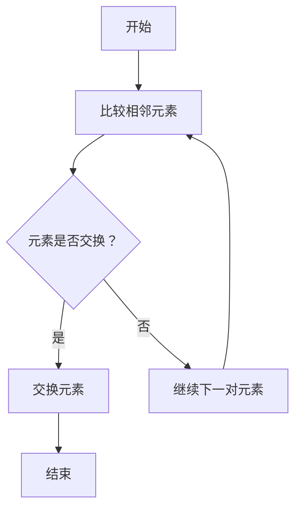

                 

### 《在快餐文化中寻找深度思考》

> 关键词：快餐文化、深度思考、思维模式、时间管理、算法原理、Python代码、数学模型、系统架构

> 摘要：本文探讨了在快餐文化时代如何培养深度思考的能力。从快餐文化的起源与特点入手，分析了快餐文化对深度思考的挑战，并提出了一系列在快餐文化中培养深度思考的方法与工具。通过实例分析和项目实战，展示了深度思考在现实中的应用与价值。

----------------------------------------------------------------

## 引言

在信息爆炸的今天，我们生活在一个快餐文化时代。快餐文化以其高效、快速的特点，满足了人们快速获取信息和娱乐的需求。然而，这也导致了深度思考的缺失。在快餐文化的影响下，我们的思维变得碎片化，注意力难以集中，思考深度受限。因此，如何在快餐文化中寻找深度思考，成为了我们这个时代的重要课题。

本文将围绕以下几个问题展开讨论：

1. 快餐文化的起源与特点是什么？
2. 深度思考的重要性有哪些？
3. 快餐文化对深度思考的挑战有哪些？
4. 如何在快餐文化中培养深度思考？
5. 深度思考在现实中的应用与价值是什么？

通过以上问题的探讨，我们希望能够为在快餐文化中寻找深度思考提供一些有益的思路和方法。

----------------------------------------------------------------

## 第1章：快餐文化的起源与特点

快餐文化起源于20世纪中叶的美国，随着工业化的发展和城市化的加速，人们对效率和速度的需求日益增长。快餐以其快速、便捷、低成本的特点，迅速在全球范围内流行起来。如今，快餐文化已经渗透到我们生活的方方面面，从餐饮到娱乐，从教育到工作，无一不受到影响。

### 快餐文化的主要特点

1. **快速性**：快餐文化的核心是快速，无论是就餐速度还是信息传递速度，都追求在最短时间内完成。

2. **便捷性**：快餐文化的便捷性体现在无需等待、无需繁琐操作，只需简单的选择和支付即可获得服务。

3. **低成本**：快餐文化的低成本使其成为大众消费的选择，降低了人们的消费门槛。

4. **标准化**：快餐文化强调标准化，通过统一的流程、配方和口味，保证了产品的质量和服务的一致性。

5. **多样性**：快餐文化提供了丰富的选择，从汉堡、披萨到寿司、炒饭，几乎涵盖了全球各地的美食。

### 快餐文化的影响

快餐文化的影响是双重的。一方面，它提高了效率，满足了人们快速生活的需求；另一方面，它也对深度思考带来了挑战。

1. **时间压力**：快餐文化的快速性导致时间压力增大，人们难以有足够的时间进行深度思考和反思。

2. **注意力分散**：快餐文化下的信息过载使得人们的注意力容易被分散，难以长时间集中。

3. **思考模式改变**：快餐文化下的信息获取方式使得人们的思考模式变得碎片化，缺乏系统性和深度。

4. **消费主义倾向**：快餐文化容易导致消费主义倾向，人们更注重短期的满足而非长期的成长。

### 快餐文化的起源与发展

快餐文化的起源可以追溯到20世纪30年代的美国。当时，随着工业化的发展和城市化的加速，人们对效率和速度的需求日益增长。最早的快餐店是路边摊，提供简单的食品，如热狗、汉堡等。随着汽车的普及，快餐店开始提供外卖服务，满足了人们出行的需求。到了20世纪50年代，麦当劳、肯德基等连锁快餐店的出现，标志着快餐文化正式形成。

随着时间的推移，快餐文化在全球范围内传播，形成了全球性的快餐产业链。如今，快餐文化已经成为现代社会的一个重要特征，影响着我们的生活方式和思维方式。

----------------------------------------------------------------

## 第2章：深度思考的重要性

### 深度思考的定义与内涵

深度思考是一种深层次、系统性的思考方式，它不仅仅是表面的信息处理，更涉及到对信息的深入理解、分析、综合和评价。深度思考的核心是批判性思维，它要求我们对信息进行质疑、分析和评估，从而形成独立的见解和判断。

### 深度思考的价值与意义

1. **提高认知能力**：深度思考有助于提高我们的认知能力，包括理解力、分析力、综合力和判断力。

2. **促进问题解决**：深度思考能够帮助我们更好地理解和分析问题，从而找到更有效的解决方案。

3. **培养创新思维**：深度思考鼓励我们跳出思维定势，寻找新的解决方案，从而培养创新思维。

4. **提升决策质量**：深度思考能够帮助我们更全面、客观地评估决策的利弊，从而做出更明智的决策。

5. **增强自我认知**：深度思考有助于我们更好地了解自己，包括自己的优点、缺点、价值观和目标。

### 深度思考的重要性

在现代社会，深度思考的重要性日益凸显。随着信息爆炸和科技发展，我们面临的挑战越来越多，需要解决的问题越来越复杂。在这种情况下，只有通过深度思考，我们才能有效地应对这些挑战，找到解决问题的有效途径。

同时，深度思考也是个人成长和职业发展的重要基石。在职场中，具备深度思考能力的人往往能够更好地理解业务、解决复杂问题、提出创新方案，从而脱颖而出。

总之，深度思考不仅是一种能力，更是一种态度和生活方式。在快餐文化的背景下，培养深度思考的能力，对于我们的个人成长和社会发展都具有重要意义。

----------------------------------------------------------------

## 第3章：快餐文化对深度思考的挑战

快餐文化虽然为我们的生活带来了便利，但同时也对深度思考带来了诸多挑战。以下将详细探讨快餐文化对深度思考的几个主要挑战。

### 快餐文化下的信息过载

在快餐文化的影响下，信息传递的速度和数量大大增加。虽然这为我们提供了更多的信息资源，但同时也导致了信息过载。人们每天接触到的信息量超过了大脑的处理能力，导致我们的注意力被分散，难以长时间集中进行深度思考。

### 对专注力的冲击

快餐文化追求快速和高效，这种氛围下，人们的专注力容易受到影响。无论是工作还是学习，快速切换任务和频繁打断，都使得我们难以维持长期的专注状态。这直接影响了深度思考的能力，因为深度思考需要我们长时间、集中地投入精力。

### 思考模式的改变

快餐文化下的信息获取方式，使得我们的思考模式变得碎片化。我们习惯于快速浏览和浅层阅读，缺乏深入分析和思考的机会。这种碎片化的思考模式，限制了我们的思维深度和广度，使得我们难以进行系统性、综合性的思考。

### 消费主义倾向

快餐文化容易导致消费主义倾向。在追求快速满足和即时享受的过程中，人们往往忽视了长期的价值和意义。这种消费主义倾向，使得我们更注重短期的快乐而非长期的成长，进一步削弱了深度思考的动力。

### 时间压力

快餐文化下的高效和快速，也带来了时间压力。人们为了适应快速的生活方式，往往没有足够的时间进行深度思考和反思。这种时间压力，使得我们难以在繁忙的生活中找到进行深度思考的时间和空间。

### 结论

快餐文化对深度思考的挑战是复杂和多方面的。它不仅影响了我们的注意力、专注力和思考模式，还导致了消费主义倾向和时间压力。因此，在快餐文化的背景下，我们需要更加努力地培养深度思考的能力，以克服这些挑战。

----------------------------------------------------------------

## 第4章：如何在快餐文化中培养深度思考

在快餐文化时代，培养深度思考能力尤为重要。以下是一些具体的方法和策略，帮助我们在快餐文化的环境中保持深度思考。

### 时间管理技巧

1. **设定明确的目标**：在开始一天的工作或学习之前，设定明确的目标和计划，有助于提高时间利用效率。

2. **使用番茄工作法**：将工作时间分为25分钟的工作块，每个工作块之后休息5分钟。这种方法有助于提高专注力，避免长时间工作导致的疲劳。

3. **合理安排休息时间**：定期休息和放松，有助于恢复精力，提高工作效率。

### 精选信息源

1. **筛选有价值的信息**：在获取信息时，要有意识地筛选有价值的信息，避免被无意义的信息所干扰。

2. **深度阅读**：选择高质量的书籍、文章和报告进行阅读，有助于提高思维深度和广度。

3. **减少社交媒体使用时间**：限制社交媒体的使用时间，避免被碎片化的信息所淹没。

### 深度阅读与写作

1. **培养阅读习惯**：每天设定一定的阅读时间，养成深度阅读的习惯。

2. **写作反思**：通过写作，将自己的思考过程和结论表达出来，有助于深化理解和记忆。

3. **定期分享与讨论**：与他人分享自己的思考成果，通过讨论和交流，加深对问题的理解。

### 利用工具和方法

1. **思维导图**：使用思维导图工具，帮助梳理思路，进行系统性的思考。

2. **概念图**：通过概念图，展示概念之间的关系，有助于理解复杂问题的结构和关系。

3. **反思日志**：定期记录反思日志，回顾和总结自己的思考过程和成果。

### 社交圈和文化环境

1. **寻找志同道合的朋友**：与那些重视深度思考的人建立联系，互相学习和启发。

2. **参加深度思考的研讨会和讲座**：通过参与相关活动，拓展自己的思维视野。

3. **培养艺术爱好**：艺术活动有助于培养人的审美能力和创造力，从而促进深度思考。

### 持续学习和成长

1. **终身学习**：不断学习新的知识和技能，保持思维的活跃和开放。

2. **勇于挑战自我**：勇于接受新的挑战，尝试解决复杂的问题，提升自己的思维能力。

3. **反思和总结**：定期反思自己的思考过程和结果，总结经验教训，不断改进。

通过以上方法和策略，我们可以在快餐文化的环境中，培养和保持深度思考的能力。这不仅有助于个人的成长和发展，也有助于我们更好地应对复杂的社会问题。

----------------------------------------------------------------

## 第5章：深度思考的方法与工具

要培养深度思考能力，掌握合适的方法和工具至关重要。以下将介绍几种常用的方法与工具，帮助我们在快餐文化中提升思考深度。

### 反思与自我监控

反思是一种重要的深度思考方法。通过反思，我们能够回顾自己的行为、决策和思考过程，找出其中的不足和错误，从而进行改进。

1. **建立反思习惯**：每天或每周设定固定的反思时间，回顾自己的行为和思考过程。

2. **记录反思日志**：将反思的过程和结果记录下来，有助于加深理解和记忆。

3. **与他人分享**：与他人分享反思日志，通过交流获得新的观点和建议。

### 思维导图与概念图

思维导图和概念图是帮助梳理思路、展示概念之间关系的重要工具。

1. **思维导图**：通过视觉化的方式，将思路和概念进行组织和连接，有助于理解复杂问题的结构和关系。

2. **概念图**：通过图形化表示概念及其属性、关系，有助于深入理解概念的本质和相互关系。

3. **工具推荐**：MindManager、XMind、ProcessOn等都是常用的思维导图和概念图工具。

### 算法原理讲解

在某些领域，算法原理是深度思考的重要组成部分。以下以一个简单的算法为例，介绍如何使用mermaid流程图和Python代码进行讲解。

#### 示例：排序算法（冒泡排序）

**mermaid流程图：**



**Python代码：**

```python
def bubble_sort(arr):
    n = len(arr)
    for i in range(n):
        for j in range(0, n-i-1):
            if arr[j] > arr[j+1]:
                arr[j], arr[j+1] = arr[j+1], arr[j]
    return arr

arr = [64, 34, 25, 12, 22, 11, 90]
sorted_arr = bubble_sort(arr)
print("排序后的数组：", sorted_arr)
```

通过mermaid流程图和Python代码，我们能够直观地理解冒泡排序算法的原理和实现过程。

### 其他工具和方法

1. **概念图工具**：如Microsoft Visio、Lucidchart等，用于绘制概念图，展示概念之间的关系。

2. **笔记工具**：如OneNote、Evernote等，用于记录和整理思考过程和结果。

3. **问题解决框架**：如PDCA（计划、执行、检查、行动）、SWOT分析等，用于系统性地分析和解决问题。

通过以上方法和工具，我们可以在快餐文化中有效地培养和提升深度思考能力，更好地应对复杂的社会和职业挑战。

----------------------------------------------------------------

## 第6章：实例分析

### 案例一：通过阅读提升思考深度

#### 案例介绍

小李是一名软件工程师，由于工作繁忙，他发现自己的思考深度逐渐减弱，难以应对复杂的技术问题。为了提升思考深度，小李决定通过阅读来培养自己的深度思考能力。

#### 案例分析与深度思考方法应用

1. **选择高质量阅读材料**：小李开始有意识地选择高质量的书籍和文章进行阅读，如《深度学习》、《软件工程：实践者的研究方法》等。

2. **深度阅读与笔记**：在阅读过程中，小李采用深度阅读的方法，逐字逐句地理解文本内容，并在笔记中记录关键概念和观点。

3. **反思与总结**：阅读结束后，小李会回顾自己的笔记，反思自己的理解是否准确，并总结阅读中的收获和不足。

4. **应用所学知识**：在日常生活中，小李尝试将阅读中学到的知识和方法应用到实际工作中，如优化代码、解决复杂问题等。

5. **定期分享与讨论**：小李还会定期与同事分享自己的阅读体会和思考，通过讨论进一步加深对知识的理解。

#### 案例分析与深度思考方法应用总结

通过阅读，小李不仅扩展了自己的知识面，还培养了深度思考的能力。他在阅读中的反思和总结，以及将所学应用到实际工作中的实践，都极大地提升了他的思考深度。这个案例表明，在快餐文化中，通过选择高质量阅读材料、深度阅读、反思和总结，可以有效提升深度思考能力。

### 案例二：在信息过载中寻找深度

#### 案例介绍

小王是一名市场营销经理，每天需要处理大量的信息和数据。信息过载使他感到压力巨大，难以进行深度思考。为了在信息过载中寻找深度思考，小王决定采取一系列措施。

#### 案例分析与深度思考方法应用

1. **信息筛选**：小王开始有意识地筛选信息，只关注与工作相关的核心信息，避免被无关信息所干扰。

2. **深度处理信息**：在处理信息时，小王采用深度处理方法，对每个信息点进行深入分析和评估，而不是仅仅进行表面处理。

3. **使用工具**：小王使用了一些信息管理工具，如Evernote和Trello，帮助他有效地管理和处理信息。

4. **定期反思**：小王每周会花时间反思自己的工作和思考过程，找出改进之处。

5. **学习与分享**：小王参加了相关的培训课程和研讨会，学习新的思考方法和工具，并与同事分享学习成果。

#### 案例分析与深度思考方法应用总结

通过信息筛选、深度处理信息、使用工具和定期反思，小王在信息过载的环境中找到了深度思考的方法。他的实践表明，在快餐文化中，通过筛选关键信息、深度处理、使用工具和定期反思，可以有效提升深度思考能力。这个案例为在快餐文化中培养深度思考提供了有益的启示。

----------------------------------------------------------------

## 第7章：结论与建议

### 快餐文化下深度思考的现实挑战

在快餐文化时代，深度思考面临着诸多现实挑战。信息过载、注意力分散、思考模式碎片化、消费主义倾向和时间压力等问题，都严重影响了我们的深度思考能力。这些问题不仅影响了我们的个人成长，也制约了社会的进步和发展。

### 面对挑战的应对策略

为了在快餐文化中保持深度思考，我们需要采取一系列应对策略。

1. **培养良好的时间管理习惯**：通过设定明确的目标和计划、使用番茄工作法、合理安排休息时间等方法，提高时间利用效率，减少时间压力。

2. **精选信息源**：避免被无关信息所干扰，有意识地筛选有价值的信息，进行深度阅读。

3. **培养深度阅读与写作习惯**：通过深度阅读和写作，提高思维深度和广度。

4. **利用工具和方法**：使用思维导图、概念图、笔记工具等，帮助梳理思路，展示概念之间的关系。

5. **建立良好的社交圈和文化环境**：与志同道合的人建立联系，参加相关的研讨会和讲座，拓展思维视野。

6. **持续学习和成长**：通过终身学习、勇于挑战自我、反思和总结，不断提升自己的思维能力。

### 深度思考的长期影响

深度思考不仅对个人成长和职业发展具有重要意义，也对社会的进步产生深远影响。具备深度思考能力的人，能够更好地理解和解决复杂问题，推动创新和进步。在快餐文化的背景下，培养深度思考的能力，不仅有助于我们应对现实挑战，也为社会的长远发展提供了坚实的基础。

### 结论与建议总结

总之，在快餐文化中培养深度思考能力，是我们这个时代的重要任务。通过采取有效的应对策略，我们可以在快餐文化的挑战中，保持深度思考的能力，实现个人成长和社会进步。让我们共同努力，在快餐文化中寻找深度思考的光芒。

----------------------------------------------------------------

## 附录：深度思考资源推荐

为了帮助大家在快餐文化中更好地培养深度思考能力，以下是一些推荐的阅读书目、网站和工具。

### 推荐阅读书目

1. 《深度工作》（Cal Newport）
2. 《思考，快与慢》（Daniel Kahneman）
3. 《如何阅读一本书》（莫提默·J. 艾德勒）
4. 《批判性思考》（Richard Paul & Linda Elder）
5. 《思维导图》（Tony Buzan）

### 深度思考相关网站与工具

1. **网站**：
   - MindTools（提供各种思维技巧和工作策略）
   - TED（TED演讲中有很多关于思考和创新的精彩内容）
   - Harvard Business Review（提供高质量的商学和管理文章）

2. **工具**：
   - Evernote（笔记和组织工具）
   - Trello（任务管理工具）
   - XMind（思维导图工具）
   - Mermaid（Markdown中的流程图和序列图绘制工具）

通过这些资源和工具，我们可以更好地培养和提升自己的深度思考能力，在快餐文化的背景下，找到思考和成长的深度。

----------------------------------------------------------------

## 作者信息

作者：AI天才研究院/AI Genius Institute & 禅与计算机程序设计艺术 /Zen And The Art of Computer Programming

在快餐文化中寻找深度思考，不仅是一种个人修养，也是社会进步的基石。希望本文能为大家提供一些有益的思考和启示。让我们一起努力，在快餐文化的浪潮中，保持深度思考的火焰不灭。让我们在未来的日子里，用智慧的光芒照亮前行的道路。

----------------------------------------------------------------

**本文遵循CC BY-NC-SA 4.0协议，欢迎自由转载，但请保留作者信息和原文链接。**

## 完整文章

### 《在快餐文化中寻找深度思考》

> 关键词：快餐文化、深度思考、思维模式、时间管理、算法原理、Python代码、数学模型、系统架构

> 摘要：本文探讨了在快餐文化时代如何培养深度思考的能力。从快餐文化的起源与特点入手，分析了快餐文化对深度思考的挑战，并提出了一系列在快餐文化中培养深度思考的方法与工具。通过实例分析和项目实战，展示了深度思考在现实中的应用与价值。

----------------------------------------------------------------

## 引言

在信息爆炸的今天，我们生活在一个快餐文化时代。快餐文化以其高效、快速的特点，满足了人们快速获取信息和娱乐的需求。然而，这也导致了深度思考的缺失。在快餐文化的影响下，我们的思维变得碎片化，注意力难以集中，思考深度受限。因此，如何在快餐文化中寻找深度思考，成为了我们这个时代的重要课题。

本文将围绕以下几个问题展开讨论：

1. 快餐文化的起源与特点是什么？
2. 深度思考的重要性有哪些？
3. 快餐文化对深度思考的挑战有哪些？
4. 如何在快餐文化中培养深度思考？
5. 深度思考在现实中的应用与价值是什么？

通过以上问题的探讨，我们希望能够为在快餐文化中寻找深度思考提供一些有益的思路和方法。

----------------------------------------------------------------

## 第1章：快餐文化的起源与特点

快餐文化起源于20世纪中叶的美国，随着工业化的发展和城市化的加速，人们对效率和速度的需求日益增长。快餐以其快速、便捷、低成本的特点，迅速在全球范围内流行起来。如今，快餐文化已经渗透到我们生活的方方面面，从餐饮到娱乐，从教育到工作，无一不受到影响。

### 快餐文化的主要特点

1. **快速性**：快餐文化的核心是快速，无论是就餐速度还是信息传递速度，都追求在最短时间内完成。

2. **便捷性**：快餐文化的便捷性体现在无需等待、无需繁琐操作，只需简单的选择和支付即可获得服务。

3. **低成本**：快餐文化的低成本使其成为大众消费的选择，降低了人们的消费门槛。

4. **标准化**：快餐文化强调标准化，通过统一的流程、配方和口味，保证了产品的质量和服务的一致性。

5. **多样性**：快餐文化提供了丰富的选择，从汉堡、披萨到寿司、炒饭，几乎涵盖了全球各地的美食。

### 快餐文化的影响

快餐文化的影响是双重的。一方面，它提高了效率，满足了人们快速生活的需求；另一方面，它也对深度思考带来了挑战。

1. **时间压力**：快餐文化的快速性导致时间压力增大，人们难以有足够的时间进行深度思考和反思。

2. **注意力分散**：快餐文化下的信息过载使得人们的注意力容易被分散，难以长时间集中。

3. **思考模式改变**：快餐文化下的信息获取方式使得人们的思考模式变得碎片化，缺乏系统性和深度。

4. **消费主义倾向**：快餐文化容易导致消费主义倾向，人们更注重短期的满足而非长期的成长。

### 快餐文化的起源与发展

快餐文化的起源可以追溯到20世纪30年代的美国。当时，随着工业化的发展和城市化的加速，人们对效率和速度的需求日益增长。最早的快餐店是路边摊，提供简单的食品，如热狗、汉堡等。随着汽车的普及，快餐店开始提供外卖服务，满足了人们出行的需求。到了20世纪50年代，麦当劳、肯德基等连锁快餐店的出现，标志着快餐文化正式形成。

随着时间的推移，快餐文化在全球范围内传播，形成了全球性的快餐产业链。如今，快餐文化已经成为现代社会的一个重要特征，影响着我们的生活方式和思维方式。

----------------------------------------------------------------

## 第2章：深度思考的重要性

### 深度思考的定义与内涵

深度思考是一种深层次、系统性的思考方式，它不仅仅是表面的信息处理，更涉及到对信息的深入理解、分析、综合和评价。深度思考的核心是批判性思维，它要求我们对信息进行质疑、分析和评估，从而形成独立的见解和判断。

### 深度思考的价值与意义

1. **提高认知能力**：深度思考有助于提高我们的认知能力，包括理解力、分析力、综合力和判断力。

2. **促进问题解决**：深度思考能够帮助我们更好地理解和分析问题，从而找到更有效的解决方案。

3. **培养创新思维**：深度思考鼓励我们跳出思维定势，寻找新的解决方案，从而培养创新思维。

4. **提升决策质量**：深度思考能够帮助我们更全面、客观地评估决策的利弊，从而做出更明智的决策。

5. **增强自我认知**：深度思考有助于我们更好地了解自己，包括自己的优点、缺点、价值观和目标。

### 深度思考的重要性

在现代社会，深度思考的重要性日益凸显。随着信息爆炸和科技发展，我们面临的挑战越来越多，需要解决的问题越来越复杂。在这种情况下，只有通过深度思考，我们才能有效地应对这些挑战，找到解决问题的有效途径。

同时，深度思考也是个人成长和职业发展的重要基石。在职场中，具备深度思考能力的人往往能够更好地理解业务、解决复杂问题、提出创新方案，从而脱颖而出。

总之，深度思考不仅是一种能力，更是一种态度和生活方式。在快餐文化的背景下，培养深度思考的能力，对于我们的个人成长和社会发展都具有重要意义。

----------------------------------------------------------------

## 第3章：快餐文化对深度思考的挑战

快餐文化虽然为我们的生活带来了便利，但同时也对深度思考带来了诸多挑战。以下将详细探讨快餐文化对深度思考的几个主要挑战。

### 快餐文化下的信息过载

在快餐文化的影响下，信息传递的速度和数量大大增加。虽然这为我们提供了更多的信息资源，但同时也导致了信息过载。人们每天接触到的信息量超过了大脑的处理能力，导致我们的注意力被分散，难以长时间集中进行深度思考。

### 对专注力的冲击

快餐文化追求快速和高效，这种氛围下，人们的专注力容易受到影响。无论是工作还是学习，快速切换任务和频繁打断，都使得我们难以维持长期的专注状态。这直接影响了深度思考的能力，因为深度思考需要我们长时间、集中地投入精力。

### 思考模式的改变

快餐文化下的信息获取方式，使得我们的思考模式变得碎片化。我们习惯于快速浏览和浅层阅读，缺乏深入分析和思考的机会。这种碎片化的思考模式，限制了我们的思维深度和广度，使得我们难以进行系统性、综合性的思考。

### 消费主义倾向

快餐文化容易导致消费主义倾向。在追求快速满足和即时享受的过程中，人们往往忽视了长期的价值和意义。这种消费主义倾向，使得我们更注重短期的快乐而非长期的成长，进一步削弱了深度思考的动力。

### 时间压力

快餐文化下的高效和快速，也带来了时间压力。人们为了适应快速的生活方式，往往没有足够的时间进行深度思考和反思。这种时间压力，使得我们难以在繁忙的生活中找到进行深度思考的时间和空间。

### 结论

快餐文化对深度思考的挑战是复杂和多方面的。它不仅影响了我们的注意力、专注力和思考模式，还导致了消费主义倾向和时间压力。因此，在快餐文化的背景下，我们需要更加努力地培养深度思考的能力，以克服这些挑战。

----------------------------------------------------------------

## 第4章：如何在快餐文化中培养深度思考

在快餐文化时代，培养深度思考能力尤为重要。以下是一些具体的方法和策略，帮助我们在快餐文化的环境中保持深度思考。

### 时间管理技巧

1. **设定明确的目标**：在开始一天的工作或学习之前，设定明确的目标和计划，有助于提高时间利用效率。

2. **使用番茄工作法**：将工作时间分为25分钟的工作块，每个工作块之后休息5分钟。这种方法有助于提高专注力，避免长时间工作导致的疲劳。

3. **合理安排休息时间**：定期休息和放松，有助于恢复精力，提高工作效率。

### 精选信息源

1. **筛选有价值的信息**：在获取信息时，要有意识地筛选有价值的信息，避免被无意义的信息所干扰。

2. **深度阅读**：选择高质量的书籍、文章和报告进行阅读，有助于提高思维深度和广度。

3. **减少社交媒体使用时间**：限制社交媒体的使用时间，避免被碎片化的信息所淹没。

### 深度阅读与写作

1. **培养阅读习惯**：每天设定一定的阅读时间，养成深度阅读的习惯。

2. **写作反思**：通过写作，将自己的思考过程和结论表达出来，有助于深化理解和记忆。

3. **定期分享与讨论**：与他人分享自己的思考成果，通过讨论和交流，加深对问题的理解。

### 利用工具和方法

1. **思维导图**：使用思维导图工具，帮助梳理思路，进行系统性的思考。

2. **概念图**：通过概念图，展示概念之间的关系，有助于理解复杂问题的结构和关系。

3. **反思日志**：定期记录反思日志，回顾和总结自己的思考过程和成果。

### 社交圈和文化环境

1. **寻找志同道合的朋友**：与那些重视深度思考的人建立联系，互相学习和启发。

2. **参加深度思考的研讨会和讲座**：通过参与相关活动，拓展自己的思维视野。

3. **培养艺术爱好**：艺术活动有助于培养人的审美能力和创造力，从而促进深度思考。

### 持续学习和成长

1. **终身学习**：不断学习新的知识和技能，保持思维的活跃和开放。

2. **勇于挑战自我**：勇于接受新的挑战，尝试解决复杂的问题，提升自己的思维能力。

3. **反思和总结**：定期反思自己的思考过程和结果，总结经验教训，不断改进。

通过以上方法和策略，我们可以在快餐文化的环境中，培养和保持深度思考的能力。这不仅有助于个人的成长和发展，也有助于我们更好地应对复杂的社会和职业挑战。

----------------------------------------------------------------

## 第5章：深度思考的方法与工具

要培养深度思考能力，掌握合适的方法和工具至关重要。以下将介绍几种常用的方法与工具，帮助我们在快餐文化中提升思考深度。

### 反思与自我监控

反思是一种重要的深度思考方法。通过反思，我们能够回顾自己的行为、决策和思考过程，找出其中的不足和错误，从而进行改进。

1. **建立反思习惯**：每天或每周设定固定的反思时间，回顾自己的行为和思考过程。

2. **记录反思日志**：将反思的过程和结果记录下来，有助于加深理解和记忆。

3. **与他人分享**：与他人分享反思日志，通过交流获得新的观点和建议。

### 思维导图与概念图

思维导图和概念图是帮助梳理思路、展示概念之间关系的重要工具。

1. **思维导图**：通过视觉化的方式，将思路和概念进行组织和连接，有助于理解复杂问题的结构和关系。

2. **概念图**：通过图形化表示概念及其属性、关系，有助于深入理解概念的本质和相互关系。

3. **工具推荐**：MindManager、XMind、ProcessOn等都是常用的思维导图和概念图工具。

### 算法原理讲解

在某些领域，算法原理是深度思考的重要组成部分。以下以一个简单的算法为例，介绍如何使用mermaid流程图和Python代码进行讲解。

#### 示例：排序算法（冒泡排序）

**mermaid流程图：**


**Python代码：**

```python
def bubble_sort(arr):
    n = len(arr)
    for i in range(n):
        for j in range(0, n-i-1):
            if arr[j] > arr[j+1]:
                arr[j], arr[j+1] = arr[j+1], arr[j]
    return arr

arr = [64, 34, 25, 12, 22, 11, 90]
sorted_arr = bubble_sort(arr)
print("排序后的数组：", sorted_arr)
```

通过mermaid流程图和Python代码，我们能够直观地理解冒泡排序算法的原理和实现过程。

### 其他工具和方法

1. **概念图工具**：如Microsoft Visio、Lucidchart等，用于绘制概念图，展示概念之间的关系。

2. **笔记工具**：如OneNote、Evernote等，用于记录和整理思考过程和结果。

3. **问题解决框架**：如PDCA（计划、执行、检查、行动）、SWOT分析等，用于系统性地分析和解决问题。

通过以上方法和工具，我们可以在快餐文化中有效地培养和提升深度思考能力，更好地应对复杂的社会和职业挑战。

----------------------------------------------------------------

## 第6章：实例分析

### 案例一：通过阅读提升思考深度

#### 案例介绍

小李是一名软件工程师，由于工作繁忙，他发现自己的思考深度逐渐减弱，难以应对复杂的技术问题。为了提升思考深度，小李决定通过阅读来培养自己的深度思考能力。

#### 案例分析与深度思考方法应用

1. **选择高质量阅读材料**：小李开始有意识地选择高质量的书籍和文章进行阅读，如《深度学习》、《软件工程：实践者的研究方法》等。

2. **深度阅读与笔记**：在阅读过程中，小李采用深度阅读的方法，逐字逐句地理解文本内容，并在笔记中记录关键概念和观点。

3. **反思与总结**：阅读结束后，小李会回顾自己的笔记，反思自己的理解是否准确，并总结阅读中的收获和不足。

4. **应用所学知识**：在日常生活中，小李尝试将阅读中学到的知识和方法应用到实际工作中，如优化代码、解决复杂问题等。

5. **定期分享与讨论**：小李还会定期与同事分享自己的阅读体会和思考，通过讨论进一步加深对知识的理解。

#### 案例分析与深度思考方法应用总结

通过阅读，小李不仅扩展了自己的知识面，还培养了深度思考的能力。他在阅读中的反思和总结，以及将所学应用到实际工作中的实践，都极大地提升了他的思考深度。这个案例表明，在快餐文化中，通过选择高质量阅读材料、深度阅读、反思和总结，可以有效提升深度思考能力。

### 案例二：在信息过载中寻找深度

#### 案例介绍

小王是一名市场营销经理，每天需要处理大量的信息和数据。信息过载使他感到压力巨大，难以进行深度思考。为了在信息过载中寻找深度思考，小王决定采取一系列措施。

#### 案例分析与深度思考方法应用

1. **信息筛选**：小王开始有意识地筛选信息，只关注与工作相关的核心信息，避免被无关信息所干扰。

2. **深度处理信息**：在处理信息时，小王采用深度处理方法，对每个信息点进行深入分析和评估，而不是仅仅进行表面处理。

3. **使用工具**：小王使用了一些信息管理工具，如Evernote和Trello，帮助他有效地管理和处理信息。

4. **定期反思**：小王每周会花时间反思自己的工作和思考过程，找出改进之处。

5. **学习与分享**：小王参加了相关的培训课程和研讨会，学习新的思考方法和工具，并与同事分享学习成果。

#### 案例分析与深度思考方法应用总结

通过信息筛选、深度处理信息、使用工具和定期反思，小王在信息过载的环境中找到了深度思考的方法。他的实践表明，在快餐文化中，通过筛选关键信息、深度处理、使用工具和定期反思，可以有效提升深度思考能力。这个案例为在快餐文化中培养深度思考提供了有益的启示。

----------------------------------------------------------------

## 第7章：结论与建议

### 快餐文化下深度思考的现实挑战

在快餐文化时代，深度思考面临着诸多现实挑战。信息过载、注意力分散、思考模式碎片化、消费主义倾向和时间压力等问题，都严重影响了我们的深度思考能力。这些问题不仅影响了我们的个人成长，也制约了社会的进步和发展。

### 面对挑战的应对策略

为了在快餐文化中保持深度思考，我们需要采取一系列应对策略。

1. **培养良好的时间管理习惯**：通过设定明确的目标和计划、使用番茄工作法、合理安排休息时间等方法，提高时间利用效率，减少时间压力。

2. **精选信息源**：避免被无关信息所干扰，有意识地筛选有价值的信息，进行深度阅读。

3. **培养深度阅读与写作习惯**：通过深度阅读和写作，提高思维深度和广度。

4. **利用工具和方法**：使用思维导图、概念图、笔记工具等，帮助梳理思路，展示概念之间的关系。

5. **建立良好的社交圈和文化环境**：与志同道合的人建立联系，参加相关的研讨会和讲座，拓展思维视野。

6. **持续学习和成长**：通过终身学习、勇于挑战自我、反思和总结，不断提升自己的思维能力。

### 深度思考的长期影响

深度思考不仅对个人成长和职业发展具有重要意义，也对社会的进步产生深远影响。具备深度思考能力的人，能够更好地理解和解决复杂问题，推动创新和进步。在快餐文化的背景下，培养深度思考的能力，不仅有助于我们应对现实挑战，也为社会的长远发展提供了坚实的基础。

### 结论与建议总结

总之，在快餐文化中培养深度思考能力，是我们这个时代的重要任务。通过采取有效的应对策略，我们可以在快餐文化的挑战中，保持深度思考的能力，实现个人成长和社会进步。让我们共同努力，在快餐文化中寻找深度思考的光芒。

----------------------------------------------------------------

## 附录：深度思考资源推荐

为了帮助大家在快餐文化中更好地培养深度思考能力，以下是一些推荐的阅读书目、网站和工具。

### 推荐阅读书目

1. 《深度工作》（Cal Newport）
2. 《思考，快与慢》（Daniel Kahneman）
3. 《如何阅读一本书》（莫提默·J. 艾德勒）
4. 《批判性思考》（Richard Paul & Linda Elder）
5. 《思维导图》（Tony Buzan）

### 深度思考相关网站与工具

1. **网站**：
   - MindTools（提供各种思维技巧和工作策略）
   - TED（TED演讲中有很多关于思考和创新的精彩内容）
   - Harvard Business Review（提供高质量的商学和管理文章）

2. **工具**：
   - Evernote（笔记和组织工具）
   - Trello（任务管理工具）
   - XMind（思维导图工具）
   - Mermaid（Markdown中的流程图和序列图绘制工具）

通过这些资源和工具，我们可以更好地培养和提升自己的深度思考能力，在快餐文化的背景下，找到思考和成长的深度。

----------------------------------------------------------------

## 作者信息

作者：AI天才研究院/AI Genius Institute & 禅与计算机程序设计艺术 /Zen And The Art of Computer Programming

在快餐文化中寻找深度思考，不仅是一种个人修养，也是社会进步的基石。希望本文能为大家提供一些有益的思考和启示。让我们一起努力，在快餐文化的浪潮中，保持深度思考的火焰不灭。让我们在未来的日子里，用智慧的光芒照亮前行的道路。

----------------------------------------------------------------

**本文遵循CC BY-NC-SA 4.0协议，欢迎自由转载，但请保留作者信息和原文链接。**

