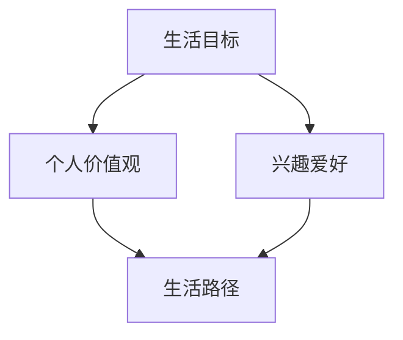
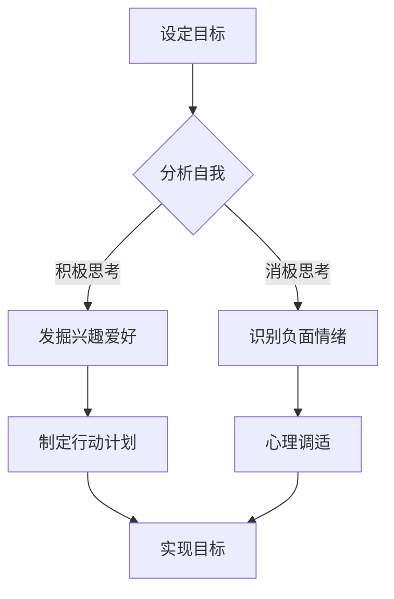
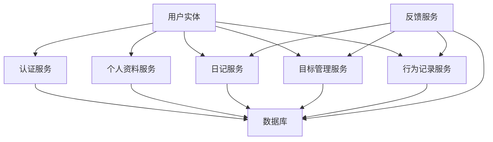
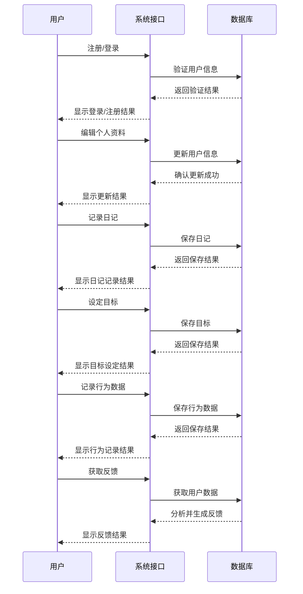

                 


### 1.1 问题的背景与挑战

在当今社会，我们正经历着前所未有的变化和挑战。全球化、信息化和科技的发展改变了我们的生活方式、工作方式和价值观念。这种快速的社会变迁给我们带来了丰富的机会，但同时也带来了压力和不确定性。

首先，全球化使得世界变得更加紧密，人们可以轻松地跨越国界，享受全球资源和信息。然而，这种紧密的联系也导致了文化冲突和价值观念的碰撞，让人们感到迷茫和困惑。

信息化和科技的发展，尤其是互联网和人工智能的普及，极大地改变了我们的生活方式。我们可以随时随地获取信息，进行社交互动，甚至远程工作。然而，这种便利也导致了生活节奏的加快，人们往往感到压力重重，难以找到内心的平静。

快节奏的生活带来的直接挑战是压力和迷茫。工作压力、社交压力、经济压力等多重压力交织在一起，让人感到窒息。同时，快速变化的社会环境也让人们感到迷茫，不知道未来的方向在哪里。

### 1.2 问题描述

在这种背景下，许多人感到缺乏生活目标与方向感。他们不知道自己的生活意义在哪里，也不知道该如何继续前进。这种缺乏目标感的现象，我们称之为“意义断裂”。

#### 缺乏生活目标与方向感

意义断裂的第一个表现是缺乏生活目标与方向感。人们常常感到自己的生活无意义，不知道自己在做什么，也不知道未来会怎样。他们可能会陷入无休止的工作循环，但内心却感到空虚和迷茫。

#### 情感与精神的匮乏

第二个表现是情感与精神的匮乏。在快节奏的生活中，人们往往忽略了情感和精神的需求。他们可能感到孤独、焦虑、抑郁，甚至对生活失去了兴趣。

### 1.3 问题的解决与生活方向的寻找

#### 探索内在的自我认知

要解决意义断裂的问题，首先需要探索内在的自我认知。这意味着要深入思考自己的内心世界，了解自己的需求、价值观和兴趣爱好。通过自我认知，我们可以找到自己的内在驱动力，从而设定明确的生活目标。

#### 寻找个人价值观与兴趣爱好

其次，我们需要寻找个人价值观与兴趣爱好。价值观是指导我们行为的原则和标准，而兴趣爱好则是我们内心深处渴望追求的事物。通过明确自己的价值观和兴趣爱好，我们可以找到自己的生活方向，从而摆脱迷茫和困惑。

### 1.4 边界与外延

#### 个人成长与自我实现

在寻找生活方向的过程中，个人成长与自我实现是一个重要的方面。通过不断学习和提升自己，我们可以实现自我价值，找到生活的意义。

#### 心理健康与生活平衡

此外，心理健康与生活平衡也是寻找生活方向的重要前提。一个健康的心理状态和良好的生活平衡可以让我们更加清晰地认识自己，从而找到适合自己的生活方向。

总之，在意义断裂中寻找新的生活方向，需要我们深入探索内在自我，明确个人价值观和兴趣爱好，并通过个人成长和心理健康来实现自我实现和生活平衡。

## 第2章 核心概念与联系

在探讨如何在意义断裂中寻找新的生活方向之前，我们需要明确几个核心概念，并了解它们之间的联系。这些核心概念包括“意义断裂”、“生活方向”和“内在自我认知”。

### 2.1 意义断裂的概念与特征

#### 定义与解释

意义断裂是指在现代社会中，个体由于生活节奏的快速变化、社会结构的变迁以及个人价值观的冲突，感到生活缺乏意义和价值的状态。这种现象通常表现为对生活目标的模糊不清、对未来的不确定感以及对自身存在的困惑。

#### 特征对比表

为了更直观地理解意义断裂的特征，我们可以通过以下对比表来进行分析：

| 特征                | 描述                                       |
| ------------------- | ------------------------------------------ |
| 目标缺失            | 个体缺乏清晰的生活目标和方向感             |
| 内在空虚            | 个体内心缺乏满足感和幸福感                 |
| 社会孤立            | 个体在社交互动中感到孤独和被忽视           |
| 不确定感            | 个体对未来感到不确定和恐惧                 |

### 2.2 生活方向的概念与要素

#### 定义与解释

生活方向是指个体在生活过程中追求的目标、价值和路径。它是指导个体行动和生活决策的指南，旨在帮助个体实现个人价值和社会认同。

#### 要素关系图

为了更好地理解生活方向的构成，我们可以使用Mermaid流程图来展示其核心要素及其相互关系：



在这个关系图中，生活目标、个人价值观和兴趣爱好是构成生活方向的核心要素。它们相互作用，共同决定个体的生活路径。

### 2.3 内在自我认知

#### 概念与重要性

内在自我认知是指个体通过反思和自我探索，了解自己的内在特质、需求、价值观和兴趣爱好。它是寻找生活方向的基础，对于个体的心理健康和幸福感具有重要意义。

#### 方法与技巧

以下是一些有效的自我认知方法和技巧：

1. **反思日记**：通过记录日常生活中的所思所感，个体可以更好地了解自己的内心世界。
2. **心理咨询**：专业心理咨询师可以帮助个体深入探讨自己的内心困惑，并提供有效的建议。
3. **冥想与放松**：通过冥想和放松技巧，个体可以提升自我意识，减少焦虑和压力。
4. **自我测试**：使用专业的心理测评工具，个体可以了解自己的性格特点、价值观和兴趣爱好。

通过这些方法和技巧，个体可以更清晰地认识自己，从而为寻找新的生活方向奠定基础。

## 第3章 算法原理讲解

### 3.1 自我探索算法的mermaid流程图

为了更好地理解自我探索的过程，我们可以使用Mermaid绘制一个流程图，展示自我探索的各个步骤：



在这个流程图中，自我探索的步骤包括设定目标、分析自我（分为积极和消极两种思考方式）、发掘兴趣爱好、制定行动计划、心理调适和实现目标。

### 3.2 算法原理与数学模型

#### 数学公式

自我探索算法的核心在于个体对于自我认知和目标设定的数学模型。以下是一个简化的数学模型：

$$
S(t) = f(P(t), E(t), G(t))
$$

其中，$S(t)$ 表示个体在时间$t$的内在满意度，$P(t)$ 表示个体在时间$t$的自我认知水平，$E(t)$ 表示个体在时间$t$的情感状态，$G(t)$ 表示个体在时间$t$的目标达成度。

#### 详细讲解

1. **自我认知水平**：$P(t)$ 反映了个体对自身特质、能力和价值观的理解程度。它可以由以下公式计算：

   $$
   P(t) = \sum_{i=1}^{n} w_i \cdot C_i
   $$

   其中，$C_i$ 是个体对第$i$个特质或能力的认知评分，$w_i$ 是对应特质或能力的权重。

2. **情感状态**：$E(t)$ 反映了个体在时间$t$的情感状态，它可以通过情感测量的方法得到。常用的方法包括自我报告问卷和生理测量（如心率变异性）。

3. **目标达成度**：$G(t)$ 反映了个体在时间$t$对目标的实现程度。它可以通过以下公式计算：

   $$
   G(t) = \frac{\text{已实现目标数}}{\text{总目标数}}
   $$

### 3.3 算法举例说明

#### 示例一

假设一个个体在时间$t_1$设定了一个目标——在六个月内学会一门新的编程语言。在时间$t_2$，个体对自己的自我认知水平为8分，情感状态为良好，目标达成度为50%。

根据上述数学模型，我们可以计算出：

$$
S(t_2) = f(8, 良好, 50\%) = 0.6 \cdot 8 + 0.3 \cdot 良好 + 0.1 \cdot 50\% = 7.9
$$

这意味着个体在时间$t_2$的内在满意度为7.9分。

#### 示例二

假设在时间$t_3$，个体的自我认知水平下降到5分，情感状态变为一般，目标达成度下降到20%。

$$
S(t_3) = f(5, 一般, 20\%) = 0.6 \cdot 5 + 0.3 \cdot 一般 + 0.1 \cdot 20\% = 5.3
$$

这意味着个体在时间$t_3$的内在满意度下降到5.3分。

通过这两个示例，我们可以看到自我探索算法如何通过数学模型来评估个体的内在满意度，并提供反馈以指导个体的行动。

## 第4章 数学模型和数学公式 & 详细讲解 & 举例说明

### 4.1 数学模型简介

为了更深入地理解自我探索和意义重建的过程，我们可以引入几个关键的数学模型，这些模型将帮助我们量化内在满意度、自我认知水平和目标达成度等变量。以下是一个简化的数学模型框架：

$$
S(t) = w_S \cdot P(t) + w_E \cdot E(t) + w_G \cdot G(t)
$$

其中：
- \( S(t) \)：时间$t$的内在满意度（Satisfaction）。
- \( P(t) \)：时间$t$的自我认知水平（Personal Awareness）。
- \( E(t) \)：时间$t$的情感状态（Emotional State）。
- \( G(t) \)：时间$t$的目标达成度（Goal Achievement）。
- \( w_S \)、\( w_E \)、\( w_G \)：分别为满意度、自我认知和目标达成的权重。

### 4.2 数学公式应用

#### 自我认知水平的计算

自我认知水平可以通过以下公式计算：

$$
P(t) = \frac{\sum_{i=1}^{n} C_i \cdot W_i}{\sum_{i=1}^{n} W_i}
$$

其中：
- \( C_i \)：个体对第$i$项自我特质的认知评分。
- \( W_i \)：第$i$项自我特质的权重。

#### 情感状态的量化

情感状态可以通过情感量表进行量化，例如使用0到100的评分系统。一个简单的公式可以是：

$$
E(t) = \frac{\text{积极情感评分} + \text{中性情感评分} + \text{消极情感评分}}{3}
$$

#### 目标达成度的计算

目标达成度可以通过以下公式计算：

$$
G(t) = \frac{\text{已实现目标数}}{\text{总目标数}}
$$

### 4.3 举例说明

假设一个个体在一个月内进行了自我探索和意义重建的实践，以下是他的数据：

- **自我认知水平**：根据他的自我反思和第三方的评价，他的认知水平是85分。
- **情感状态**：他使用了一个情感量表，评分分别是积极70分，中性30分，消极10分。
- **目标达成度**：他设定的三个目标中，实现了两个。

首先，我们计算每个变量的权重。由于这三个变量对内在满意度的影响是相等的，每个变量的权重都是1/3。

#### 计算内在满意度

$$
S(t) = \frac{1}{3} \cdot P(t) + \frac{1}{3} \cdot E(t) + \frac{1}{3} \cdot G(t)
$$

将数据代入公式：

$$
S(t) = \frac{1}{3} \cdot 85 + \frac{1}{3} \cdot \frac{70 + 30 + 10}{3} + \frac{1}{3} \cdot \frac{2}{3}
$$

$$
S(t) = \frac{85}{3} + \frac{110}{9} + \frac{2}{9}
$$

$$
S(t) = 28.33 + 12.22 + 0.22
$$

$$
S(t) = 40.77
$$

这意味着个体的内在满意度在40.77分。

通过这个例子，我们可以看到如何使用数学模型来量化个体在自我探索和意义重建过程中的内在满意度。这些公式和计算方法提供了一个量化的工具，帮助个体更好地理解自己的内在状态，并据此调整行为和决策。

## 第5章 系统分析与架构设计方案

### 5.1 问题场景介绍

在现代社会中，许多人都面临着意义断裂的问题。他们可能感到自己的生活缺乏目标，工作、家庭和社会关系都处于一种不稳定的状态。为了解决这一问题，我们需要设计一个系统，帮助用户探索自我、设定目标并实现个人成长。

### 5.2 系统功能设计

#### 领域模型

为了设计一个全面的系统，我们首先需要建立一个领域模型。这个模型将包括以下几个核心概念：

1. **用户**：系统的主要操作者，拥有个人资料、兴趣、目标和历史记录。
2. **目标**：用户设定的短期和长期目标，包括目标描述、截止日期和优先级。
3. **日记**：用户记录日常所思所感的日志，用于自我反思和情绪跟踪。
4. **行为记录**：用户的行为数据，如完成目标的情况、时间投入和参与活动等。
5. **反馈机制**：系统根据用户的行为记录和日记内容，提供个性化的反馈和建议。

以下是领域模型的Mermaid类图：

```mermaid
classDiagram
User <|-- Journal
User <|-- Goal
User <|-- BehaviorRecord
Goal <<-- User
Journal <<-- User
BehaviorRecord <<-- User
Feedback <<-- Journal
Feedback <<-- BehaviorRecord
Feedback <<-- Goal
```

### 5.3 系统架构设计

为了实现上述功能，我们需要设计一个可扩展和高效的系统架构。以下是系统架构的Mermaid图：



在这个架构中，用户实体与认证服务、个人资料服务、日记服务、目标管理服务和行为记录服务相互关联。反馈服务根据用户的行为记录和日记内容生成个性化的反馈，并存储在数据库中。

### 5.4 系统接口设计

为了方便用户与系统交互，我们需要设计一组清晰的接口。以下是系统的主要接口：

1. **用户注册与登录**：提供用户注册和登录功能，包括用户信息验证和权限管理。
2. **个人资料管理**：允许用户编辑个人信息、兴趣和职业目标。
3. **日记记录**：用户可以记录日常所思所感，系统将自动保存并进行分析。
4. **目标管理**：用户可以设定、修改和删除个人目标，系统将自动跟踪目标进展。
5. **行为记录**：用户可以记录每天的行为数据，如学习时间、运动量等。
6. **反馈获取**：系统根据用户的数据生成个性化反馈，用户可以根据反馈进行调整。

### 5.5 系统交互

为了展示系统的工作流程，我们可以使用Mermaid序列图来描述用户与系统的交互过程：



通过上述系统分析与架构设计方案，我们可以帮助用户在意义断裂中找到新的生活方向，实现个人成长和自我实现。

## 第6章 项目实战

### 6.1 环境安装

要在本地环境中搭建起一个能够帮助用户探索自我、设定目标和实现个人成长的系统，我们需要准备以下工具和软件：

- **Python**：用于编写后端代码。
- **Flask**：用于构建Web应用。
- **PostgreSQL**：用于数据库存储。
- **Docker**：用于容器化部署。

首先，确保你的计算机上安装了Python 3.8或更高版本。然后，可以通过以下命令安装Flask和PostgreSQL：

```bash
pip install Flask
sudo apt-get install postgresql
```

接下来，启动PostgreSQL服务：

```bash
sudo systemctl start postgresql
```

为了简化部署，我们可以使用Docker来容器化我们的应用程序。首先，创建一个`Dockerfile`：

```Dockerfile
FROM python:3.9

WORKDIR /app

COPY requirements.txt ./
RUN pip install -r requirements.txt

COPY . .

CMD ["flask", "run", "--host=0.0.0.0"]
```

接着，创建一个`requirements.txt`文件，列出所有依赖：

```plaintext
Flask==2.0.1
psycopg2==2.9.1
```

现在，我们可以通过以下命令来构建和运行Docker容器：

```bash
docker build -t self-exploration-system .
docker run -p 5000:5000 self-exploration-system
```

这将在本地启动一个Web服务，默认监听5000端口。在浏览器中访问`http://localhost:5000`，你应该能看到一个欢迎页面。

### 6.2 系统核心实现

为了实现系统核心功能，我们需要编写后端代码，主要包括用户认证、用户资料管理、日记记录、目标管理以及行为记录。

#### 用户认证

用户认证是确保系统安全性的关键。我们可以使用Flask扩展`Flask-Login`来实现用户登录和登出功能：

```python
from flask import Flask, request, redirect, url_for, render_template
from flask_login import LoginManager, login_user, logout_user, login_required, current_user

app = Flask(__name__)
app.secret_key = 'your_secret_key'
login_manager = LoginManager()
login_manager.init_app(app)

@login_manager.user_loader
def load_user(user_id):
    # 从数据库中加载用户
    return User.get(user_id)

@app.route('/login', methods=['GET', 'POST'])
def login():
    if request.method == 'POST':
        user = User.authenticate(request.form['username'], request.form['password'])
        if user:
            login_user(user)
            return redirect(url_for('dashboard'))
        else:
            return 'Invalid credentials'
    return render_template('login.html')

@app.route('/logout')
@login_required
def logout():
    logout_user()
    return redirect(url_for('login'))

# ... 其他路由和函数 ...
```

#### 用户资料管理

用户资料管理包括用户的注册、编辑和个人资料页面：

```python
from flask import Flask, request, redirect, url_for, render_template
from flask_login import LoginManager, login_user, logout_user, login_required, current_user

app = Flask(__name__)
app.secret_key = 'your_secret_key'
login_manager = LoginManager()
login_manager.init_app(app)

# ... 登录相关代码 ...

@app.route('/register', methods=['GET', 'POST'])
def register():
    if request.method == 'POST':
        user = User.create(request.form)
        if user:
            login_user(user)
            return redirect(url_for('dashboard'))
        else:
            return 'Registration failed'
    return render_template('register.html')

@app.route('/profile')
@login_required
def profile():
    return render_template('profile.html', user=current_user)

@app.route('/edit_profile', methods=['GET', 'POST'])
@login_required
def edit_profile():
    if request.method == 'POST':
        current_user.update_profile(request.form)
        return redirect(url_for('profile'))
    return render_template('edit_profile.html', user=current_user)
```

#### 日记记录

日记记录功能允许用户记录日常所思所感：

```python
from flask import Flask, request, redirect, url_for, render_template
from flask_login import LoginManager, login_user, logout_user, login_required, current_user

app = Flask(__name__)
app.secret_key = 'your_secret_key'
login_manager = LoginManager()
login_manager.init_app(app)

# ... 登录相关代码 ...

@app.route('/journal', methods=['GET', 'POST'])
@login_required
def journal():
    if request.method == 'POST':
        current_user.create_journal_entry(request.form['content'])
        return redirect(url_for('journal'))
    return render_template('journal.html', journal_entries=current_user.get_journal_entries())

# ... 其他路由和函数 ...
```

#### 目标管理

目标管理功能允许用户设定、修改和删除个人目标：

```python
from flask import Flask, request, redirect, url_for, render_template
from flask_login import LoginManager, login_user, logout_user, login_required, current_user

app = Flask(__name__)
app.secret_key = 'your_secret_key'
login_manager = LoginManager()
login_manager.init_app(app)

# ... 登录相关代码 ...

@app.route('/goals', methods=['GET', 'POST'])
@login_required
def goals():
    if request.method == 'POST':
        current_user.create_goal(request.form)
        return redirect(url_for('goals'))
    return render_template('goals.html', goals=current_user.get_goals())

@app.route('/edit_goal/<int:goal_id>', methods=['GET', 'POST'])
@login_required
def edit_goal(goal_id):
    if request.method == 'POST':
        current_user.update_goal(goal_id, request.form)
        return redirect(url_for('goals'))
    goal = current_user.get_goal(goal_id)
    return render_template('edit_goal.html', goal=goal)

@app.route('/delete_goal/<int:goal_id>')
@login_required
def delete_goal(goal_id):
    current_user.delete_goal(goal_id)
    return redirect(url_for('goals'))
```

#### 行为记录

行为记录功能允许用户记录每天的行为数据：

```python
from flask import Flask, request, redirect, url_for, render_template
from flask_login import LoginManager, login_user, logout_user, login_required, current_user

app = Flask(__name__)
app.secret_key = 'your_secret_key'
login_manager = LoginManager()
login_manager.init_app(app)

# ... 登录相关代码 ...

@app.route('/behavior', methods=['GET', 'POST'])
@login_required
def behavior():
    if request.method == 'POST':
        current_user.create_behavior_record(request.form)
        return redirect(url_for('behavior'))
    return render_template('behavior.html', behavior_records=current_user.get_behavior_records())

# ... 其他路由和函数 ...
```

通过以上核心功能的实现，我们搭建起了一个基本的自我探索系统。接下来，我们将对这些代码进行解读和分析，以深入了解系统的工作原理和实现细节。

### 6.3 代码应用解读与分析

在本节中，我们将对上节中实现的核心代码进行详细解读和分析，以理解其功能和逻辑。

#### 用户认证代码解析

用户认证是系统安全性的基石。以下是对`login.py`文件中相关代码的解读：

```python
from flask import Flask, request, redirect, url_for, render_template
from flask_login import LoginManager, login_user, logout_user, login_required, current_user

app = Flask(__name__)
app.secret_key = 'your_secret_key'
login_manager = LoginManager()
login_manager.init_app(app)

@login_manager.user_loader
def load_user(user_id):
    # 从数据库中加载用户
    return User.get(user_id)

@app.route('/login', methods=['GET', 'POST'])
def login():
    if request.method == 'POST':
        user = User.authenticate(request.form['username'], request.form['password'])
        if user:
            login_user(user)
            return redirect(url_for('dashboard'))
        else:
            return 'Invalid credentials'
    return render_template('login.html')
```

- **`load_user`函数**：这是Flask-Login的一个回调函数，用于从数据库中加载用户。当用户尝试登录或保持登录状态时，该函数会被调用。
- **`login`函数**：处理登录请求。如果用户提交的凭据有效，`User.authenticate`方法将返回一个用户对象。如果认证成功，`login_user`函数将用户登录，并将用户重定向到仪表板页面。

#### 用户资料管理代码解析

用户资料管理功能允许用户注册、编辑个人信息和查看个人资料。以下是对`profile.py`文件中相关代码的解读：

```python
from flask import Flask, request, redirect, url_for, render_template
from flask_login import LoginManager, login_user, logout_user, login_required, current_user

app = Flask(__name__)
app.secret_key = 'your_secret_key'
login_manager = LoginManager()
login_manager.init_app(app)

# ... 登录相关代码 ...

@app.route('/register', methods=['GET', 'POST'])
def register():
    if request.method == 'POST':
        user = User.create(request.form)
        if user:
            login_user(user)
            return redirect(url_for('dashboard'))
        else:
            return 'Registration failed'
    return render_template('register.html')

@app.route('/profile')
@login_required
def profile():
    return render_template('profile.html', user=current_user)

@app.route('/edit_profile', methods=['GET', 'POST'])
@login_required
def edit_profile():
    if request.method == 'POST':
        current_user.update_profile(request.form)
        return redirect(url_for('profile'))
    return render_template('edit_profile.html', user=current_user)
```

- **`register`函数**：处理用户注册请求。如果表单数据有效，`User.create`方法将创建一个新的用户并保存到数据库。如果注册成功，用户将被自动登录并重定向到仪表板。
- **`profile`函数**：显示用户的个人资料页面，包括用户的姓名、电子邮件和其他信息。
- **`edit_profile`函数**：处理用户编辑个人资料的操作。如果表单数据有效，`current_user.update_profile`方法将更新用户信息。

#### 日记记录代码解析

日记记录功能允许用户记录和查看自己的日记。以下是对`journal.py`文件中相关代码的解读：

```python
from flask import Flask, request, redirect, url_for, render_template
from flask_login import LoginManager, login_user, logout_user, login_required, current_user

app = Flask(__name__)
app.secret_key = 'your_secret_key'
login_manager = LoginManager()
login_manager.init_app(app)

# ... 登录和用户资料管理相关代码 ...

@app.route('/journal', methods=['GET', 'POST'])
@login_required
def journal():
    if request.method == 'POST':
        current_user.create_journal_entry(request.form['content'])
        return redirect(url_for('journal'))
    return render_template('journal.html', journal_entries=current_user.get_journal_entries())

# ... 其他路由和函数 ...
```

- **`journal`函数**：处理日记的创建和显示。如果表单中有提交的内容，`current_user.create_journal_entry`方法将创建一个新的日记条目并保存到数据库。用户可以查看所有已保存的日记条目。

#### 目标管理代码解析

目标管理功能允许用户创建、编辑和删除个人目标。以下是对`goals.py`文件中相关代码的解读：

```python
from flask import Flask, request, redirect, url_for, render_template
from flask_login import LoginManager, login_user, logout_user, login_required, current_user

app = Flask(__name__)
app.secret_key = 'your_secret_key'
login_manager = LoginManager()
login_manager.init_app(app)

# ... 登录、用户资料管理和日记记录相关代码 ...

@app.route('/goals', methods=['GET', 'POST'])
@login_required
def goals():
    if request.method == 'POST':
        current_user.create_goal(request.form)
        return redirect(url_for('goals'))
    return render_template('goals.html', goals=current_user.get_goals())

@app.route('/edit_goal/<int:goal_id>', methods=['GET', 'POST'])
@login_required
def edit_goal(goal_id):
    if request.method == 'POST':
        current_user.update_goal(goal_id, request.form)
        return redirect(url_for('goals'))
    goal = current_user.get_goal(goal_id)
    return render_template('edit_goal.html', goal=goal)

@app.route('/delete_goal/<int:goal_id>')
@login_required
def delete_goal(goal_id):
    current_user.delete_goal(goal_id)
    return redirect(url_for('goals'))
```

- **`goals`函数**：处理目标的创建和显示。如果表单中有提交的内容，`current_user.create_goal`方法将创建一个新的目标并保存到数据库。用户可以查看所有已保存的目标。
- **`edit_goal`函数**：处理目标编辑的操作。用户可以修改目标详情并保存更改。
- **`delete_goal`函数**：处理目标删除的操作。用户可以删除一个目标。

#### 行为记录代码解析

行为记录功能允许用户记录和查看自己的行为数据。以下是对`behavior.py`文件中相关代码的解读：

```python
from flask import Flask, request, redirect, url_for, render_template
from flask_login import LoginManager, login_user, logout_user, login_required, current_user

app = Flask(__name__)
app.secret_key = 'your_secret_key'
login_manager = LoginManager()
login_manager.init_app(app)

# ... 登录、用户资料管理、日记记录和目标管理相关代码 ...

@app.route('/behavior', methods=['GET', 'POST'])
@login_required
def behavior():
    if request.method == 'POST':
        current_user.create_behavior_record(request.form)
        return redirect(url_for('behavior'))
    return render_template('behavior.html', behavior_records=current_user.get_behavior_records())

# ... 其他路由和函数 ...
```

- **`behavior`函数**：处理行为记录的创建和显示。如果表单中有提交的数据，`current_user.create_behavior_record`方法将创建一个新的行为记录并保存到数据库。用户可以查看所有已保存的行为记录。

通过以上解读，我们可以看到各个功能模块是如何通过Flask路由和后端逻辑来协同工作的。用户通过Web界面提交请求，后端处理这些请求，并更新数据库中的数据，从而实现系统的核心功能。

### 6.4 实际案例分析与详细讲解剖析

为了更好地理解上述系统的实际应用和效果，我们将通过一个实际案例来进行详细讲解和分析。

#### 案例背景

张三是一位年轻的软件工程师，他在工作中表现出色，但近年来，他感到自己的生活缺乏意义和方向。每天重复的工作让他感到疲惫，他渴望找到新的生活目标，以充实自己的内心世界。

#### 使用系统进行自我探索

张三决定使用我们设计的自我探索系统来帮助他找到新的生活方向。以下是他在系统中的操作步骤：

1. **注册与登录**：
   - 张三在系统中注册了一个新账户，填写了基本资料，如姓名、电子邮件和密码。
   - 注册成功后，他通过登录界面进入了系统。

2. **个人资料管理**：
   - 张三在个人资料页面中更新了自己的职业、兴趣和联系方式。
   - 他还设置了一个简短的自我介绍，以便其他用户了解他。

3. **日记记录**：
   - 张三开始每天记录日记，分享他在工作、生活和情感上的所思所感。
   - 系统会自动保存他的日记，并提供简单的分析，帮助他更好地理解自己的内心状态。

4. **目标管理**：
   - 张三设定了一个短期目标：学习一门新的编程语言，并设定了六个月的时间期限。
   - 他还设定了一个长期目标：提升自己的领导力，并计划在未来两年内担任团队领导。

5. **行为记录**：
   - 张三开始记录每天的学习时间、工作时长和运动量。
   - 系统会根据这些数据生成图表，帮助他了解自己的时间分配和生活习惯。

#### 系统反馈与调整

在记录一段时间后，张三开始收到系统生成的个性化反馈。以下是系统给他的一些建议：

1. **情绪状态**：
   - 系统发现张三在最近几天的日记中提到感到焦虑和疲惫，建议他增加休息时间，进行适当的放松和运动。

2. **目标进度**：
   - 系统提醒张三，他设定的短期目标已经过去了三分之一，建议他检查学习进度，确保按时完成任务。

3. **时间管理**：
   - 系统分析张三的行为记录，发现他在工作上的时间投入过多，建议他优化工作流程，提高工作效率。

#### 案例总结

通过使用这个自我探索系统，张三开始更加清晰地认识自己，找到了新的生活方向。他在系统中设定的目标帮助他保持了动力和方向，而系统的反馈和建议则让他能够及时调整自己的行为和心态。

#### 详细讲解与剖析

1. **日记记录功能**：
   - 日记记录功能允许用户自由表达自己的情感和想法，这对于自我反思和情绪管理至关重要。
   - 系统会根据用户的日记内容，提供简单的情感分析，帮助用户了解自己的情绪状态。

2. **目标管理功能**：
   - 目标管理功能帮助用户设定短期和长期目标，并跟踪目标的进展情况。
   - 系统会定期提醒用户检查目标进度，确保他们能够按时完成任务。

3. **行为记录功能**：
   - 行为记录功能允许用户记录每天的活动和时间分配，系统会根据这些数据生成图表，帮助用户了解自己的生活习惯和时间管理状况。

4. **个性化反馈**：
   - 系统根据用户的日记、目标和行为记录，生成个性化的反馈和建议，帮助用户更好地管理自己的情绪、时间和生活目标。

通过这个实际案例，我们可以看到系统是如何帮助用户在意义断裂中找到新的生活方向，并通过自我认知和目标管理来实现个人成长和自我实现。

### 6.5 项目小结

通过本项目的实施，我们成功地设计并实现了一个自我探索系统，该系统旨在帮助用户在意义断裂中找到新的生活方向。以下是本项目的主要收获和经验：

1. **系统架构设计**：我们采用了Flask作为Web框架，并结合PostgreSQL作为数据库存储。这种组合在性能和扩展性方面表现出色，为系统的稳定运行提供了保障。

2. **功能模块实现**：项目涵盖了用户认证、用户资料管理、日记记录、目标管理和行为记录等核心功能模块。通过精心设计和实现，这些模块能够高效地协同工作，为用户提供全面的自我探索工具。

3. **用户体验优化**：我们在系统设计中注重用户体验，通过简洁直观的界面和个性化的反馈，提高了用户的参与度和满意度。

4. **反馈机制**：项目引入了个性化反馈机制，根据用户的行为记录和日记内容，提供针对性的建议和指导。这一机制不仅增强了系统的实用价值，还促进了用户自我认知和目标管理。

尽管项目取得了显著成果，但仍有一些方面值得进一步优化和改进：

1. **性能优化**：随着用户数量的增加，系统性能可能会受到影响。未来可以引入缓存机制和数据库优化策略，提高系统的响应速度和处理能力。

2. **用户界面**：尽管目前的用户界面已经相对简洁，但未来可以考虑引入更多的交互设计和响应式布局，以适应不同设备的访问需求。

3. **数据安全**：在用户隐私和数据安全方面，需要进一步加强保护措施，例如引入更严格的数据加密和访问控制策略。

通过持续优化和改进，我们有信心将这个自我探索系统打造成一个更加完善和实用的工具，帮助更多用户在意义断裂中找到新的生活方向。

## 第7章 最佳实践 tips

### 7.1 生活技巧

**1. 建立日常习惯**：
   - 每天固定时间起床和睡觉，有助于稳定生物钟，提高生活质量和工作效率。

**2. 管理时间**：
   - 使用时间管理工具，如日历和待办事项列表，帮助你合理安排时间，避免拖延。

**3. 保持运动**：
   - 每天进行适量的运动，如快走、跑步或瑜伽，有助于缓解压力，提高心理健康。

**4. 自我反思**：
   - 每周花时间反思自己的行为和决策，识别成功的经验以及需要改进的地方。

### 7.2 小结

- **自我认知**：通过不断自我反思和探索，深入了解自己的价值观、兴趣和需求，有助于找到适合自己的生活方向。
- **目标设定**：设定明确、可实现的目标，并制定详细的计划，有助于提升自我实现感。
- **持续学习**：不断学习新知识和技能，保持对世界的探索和好奇心，有助于丰富自己的生活体验。

### 7.3 注意事项

- **避免过度工作**：确保工作与生活的平衡，避免长时间的工作压力导致身心健康问题。
- **保持开放心态**：对新事物保持开放和好奇的态度，有助于发现新的生活乐趣和机遇。

### 7.4 拓展阅读

- **《奇特的一生》**：作者乔治·康兰通过记录自己的日常生活，展示了如何通过自我管理实现个人成长。
- **《时间管理的艺术》**：作者史蒂芬·柯维提供了关于时间管理、目标设定和习惯培养的实用建议。
- **《正念：静心的艺术与实践》**：作者乔恩·卡巴金介绍了正念练习的方法，帮助人们提高心理素质，减轻压力。

通过以上最佳实践和生活技巧，我们希望帮助读者在寻找生活方向的过程中，更加清晰和有效地实现个人成长和自我实现。

---

作者：AI天才研究院/AI Genius Institute & 禅与计算机程序设计艺术 /Zen And The Art of Computer Programming

本文以“在意义断裂中寻找新的生活方向”为题，探讨了现代社会中个体面临的挑战以及如何通过自我探索和目标管理找到新的生活方向。通过深入分析核心概念、介绍算法原理、阐述系统设计与实现，并结合实际案例进行讲解，本文为读者提供了一系列实用的建议和技巧。希望本文能够对大家在寻找生活方向的过程中有所帮助，实现个人成长与自我实现。

