                 

## 在技术至上时代寻找人文关怀

### 关键词：
- 技术发展
- 人文关怀
- 社会变迁
- 科技伦理
- 数字素养
- 人本主义

### 摘要：
本文探讨了在技术迅速发展的时代，如何在保持技术进步的同时，不忘初心，寻找和维系人文关怀。通过对技术影响下的社会变迁、技术至上时代的人文关怀以及实践与探索的分析，本文旨在提出如何在技术与人性的平衡中寻求和谐，为未来的发展提供方向。

### 引言

在当今这个技术迅猛发展的时代，我们的生活被智能手机、互联网和人工智能等科技产品深刻改变。技术已经成为社会进步的重要驱动力，从医疗、教育到交通、娱乐，几乎无处不在。然而，随着技术的不断进步，我们也开始面临一些前所未有的挑战。其中最为显著的一个问题就是人文关怀的缺失。

#### 1.1 书籍背景与主题

技术进步带来的便利性和效率提升无疑是巨大的，但与此同时，我们也看到了一些社会问题。例如，数字鸿沟的扩大、隐私泄露的担忧、就业市场的变化等。这些问题都直接或间接地影响到人们的日常生活和心理健康。

本书旨在探讨如何在这样一个技术至上的时代中，保持并弘扬人文关怀。通过分析技术对社会的影响，探讨科技伦理与人文素养的重要性，以及如何在技术设计中融入人文关怀，最终提出一系列实践与探索的方法，为未来社会的和谐发展提供思路。

#### 1.2 书籍结构概述

本书分为三个主要部分：

- **第一部分：技术影响下的社会变迁**：分析技术发展的历史与趋势，探讨技术对社会结构和影响的深层次问题。
- **第二部分：技术至上时代的人文关怀**：讨论科技伦理、数字素养以及技术设计的伦理考虑，强调人文关怀在科技发展中的重要性。
- **第三部分：实践与探索**：通过具体的案例和实践，展示如何在技术至上的社会环境中融入人文关怀，以及未来发展的可能性。

## 第一部分：技术影响下的社会变迁

### 第1章：技术发展的历史与趋势

技术的发展并非一蹴而就，而是经过了漫长的历史过程。从计算机的出现、互联网的兴起，到人工智能的快速发展，每一项技术的突破都带来了巨大的社会变革。本章将简要回顾技术发展的历程，分析当前技术发展的主要趋势。

#### 背景介绍

技术的进步往往伴随着创新和突破。计算机的出现标志着信息处理方式的革命，而互联网的普及则改变了人们获取信息、交流沟通的方式。进入21世纪，人工智能技术的崛起更是将人类带入了一个全新的时代。

#### 核心概念与联系

- **计算机技术**：计算机技术的发展分为多个阶段，从电子管计算机到晶体管计算机，再到今天的超级计算机，其核心概念是处理速度的提升和存储能力的增加。
- **互联网技术**：互联网的兴起改变了信息的传播方式，从传统的中心化媒体到去中心化的网络，其核心概念是信息共享和互联互通。
- **人工智能技术**：人工智能技术的发展主要分为机器学习、深度学习和强化学习等方向，其核心概念是模拟人类智能，实现自动化和智能化。

#### 算法原理讲解

为了更直观地理解技术发展的趋势，我们可以通过以下mermaid流程图展示：

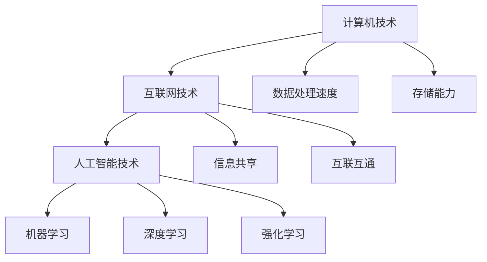

在技术发展的过程中，数据处理速度和存储能力的提升（D和E）是计算机技术的核心推动力，而信息共享和互联互通（F和G）则是互联网技术的主要特征。人工智能技术的进步（H、I、J）则是当前技术发展的前沿。

#### 数学模型与公式

技术发展的过程可以用数学模型来描述，其中一个常用的模型是摩尔定律。摩尔定律指出，集成电路上可容纳的晶体管数量大约每两年翻一番，性能也将提升一倍。这个模型可以表示为：

$$
P(n) = 2^{n/2}
$$

其中，$P(n)$表示$n$年后的性能，$n$为年份。

#### 系统分析与架构设计方案

技术发展的系统架构设计可以分为以下几个阶段：

1. **计算机硬件阶段**：主要包括CPU、内存、存储等硬件设备。
2. **互联网基础设施阶段**：包括路由器、交换机、服务器等设备，以及互联网协议（如TCP/IP）。
3. **人工智能阶段**：包括算法、数据存储和处理、硬件加速（如GPU、TPU）等。

以下是一个简化的mermaid架构图：

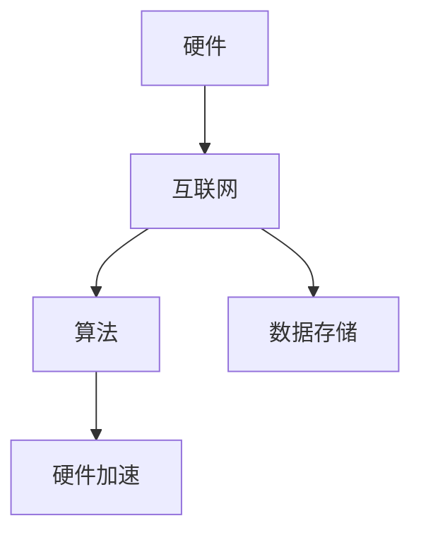

#### 项目实战

为了更好地理解技术发展的实际应用，我们可以通过一个简单的项目实战来展示。例如，构建一个基于人工智能的图像识别系统。

1. **环境安装**：安装Python环境和必要的库，如TensorFlow。
2. **系统核心实现源代码**：编写Python代码，使用卷积神经网络（CNN）进行图像识别。
3. **代码应用解读与分析**：解释代码的每个部分，包括数据预处理、模型构建、训练和测试等。
4. **实际案例分析和详细讲解剖析**：使用实际图像数据集进行训练和测试，分析模型的性能和改进方法。
5. **项目小结**：总结项目的主要成果和不足，提出未来改进的方向。

#### 最佳实践 tips

- **持续学习**：技术发展迅速，需要不断学习最新的技术趋势和工具。
- **关注数据安全**：在处理大数据时，要确保数据的安全和隐私。
- **注重团队合作**：技术的发展往往需要多学科的合作，良好的团队合作是成功的关键。

#### 小结

本章通过回顾技术发展的历史与趋势，分析了技术对社会结构和影响的深层次问题。从计算机技术到互联网技术，再到人工智能技术，每一项技术的进步都带来了巨大的社会变革。通过数学模型和系统架构设计的讲解，我们更好地理解了技术发展的过程和原理。

#### 注意事项

- 技术发展带来的变革不仅需要技术上的突破，还需要社会制度的变革和人们观念的转变。
- 在追求技术进步的同时，要密切关注技术对社会的影响，尤其是对人文关怀的潜在威胁。

#### 拓展阅读

- 《智能时代：大数据与人工智能改变世界》
- 《深度学习：实战应用》
- 《人工智能简史：从思维到机器》

### 第2章：技术对社会结构的影响

技术进步不仅改变了我们的生活方式，也深刻影响了社会的结构。从经济、政治到文化，技术无处不在，带来了深远的影响。本章将探讨技术对社会结构的影响，分析其中的利弊。

#### 背景介绍

技术对社会结构的影响是多方面的。在经济方面，技术促进了生产效率的提升和产业的转型升级；在政治方面，技术改变了政府与公民的互动方式，推动了民主化进程；在文化方面，技术打破了地域和时间的限制，使文化多样性得以展现。

#### 核心概念与联系

- **经济影响**：技术进步提高了生产效率，降低了生产成本，促进了经济的发展。同时，技术也改变了就业结构，一些传统行业被淘汰，新兴产业迅速崛起。
- **政治影响**：技术使得信息的传播更加迅速和便捷，公民可以更便捷地获取信息和表达观点，推动了政治的透明化和民主化。
- **文化影响**：技术打破了地域和时间的限制，使文化多样性得以展现。互联网和社交媒体使得不同文化之间的交流更加频繁，但也带来了一些文化冲突和误解。

#### 算法原理讲解

为了更直观地理解技术对社会结构的影响，我们可以通过以下mermaid流程图展示：

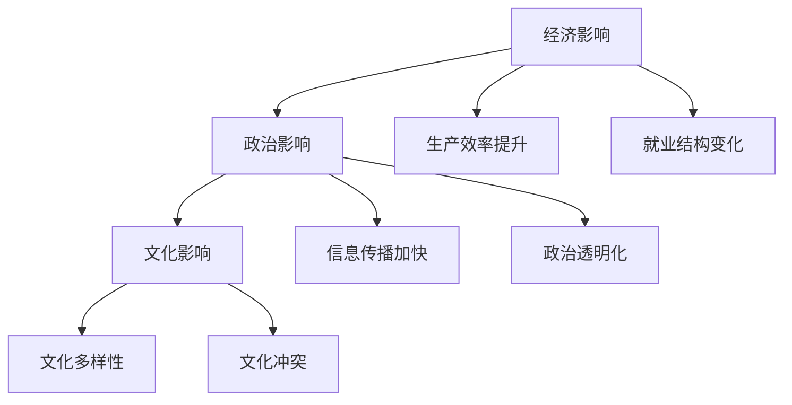

在经济发展方面，生产效率的提升（D）和就业结构的变化（E）是核心因素。在政治方面，信息传播的加快（F）和政治透明化（G）是重要趋势。在文化方面，文化多样性的展现（H）和文化冲突（I）是主要特征。

#### 数学公式使用

技术对社会结构的影响可以用数学模型来描述。例如，技术进步对经济增长的贡献可以用以下公式表示：

$$
GDP = A \cdot (1 + r)^n
$$

其中，$GDP$表示经济增长，$A$表示初始经济增长率，$r$表示技术进步率，$n$表示时间。

#### 系统分析与架构设计方案

技术对社会结构的影响可以从多个维度进行分析。以下是几个关键维度：

1. **经济维度**：分析技术对经济增长、就业结构的影响。
2. **政治维度**：分析技术对政府与公民互动、民主化进程的影响。
3. **文化维度**：分析技术对文化多样性、文化交流的影响。

以下是一个简化的mermaid架构图：

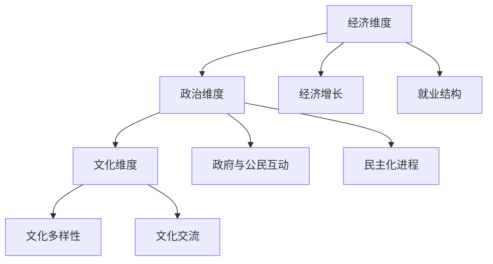

#### 项目实战

为了更好地理解技术对社会结构的影响，我们可以通过一个简单的项目实战来展示。例如，分析一个国家在技术进步背景下的经济增长和就业结构变化。

1. **环境安装**：安装必要的经济分析软件和工具。
2. **系统核心实现源代码**：编写Python代码，对国家的经济增长和就业结构进行定量分析。
3. **代码应用解读与分析**：解释代码的每个部分，包括数据收集、数据处理、结果分析等。
4. **实际案例分析和详细讲解剖析**：使用实际数据进行分析，展示技术进步对经济增长和就业结构的影响。
5. **项目小结**：总结项目的主要成果和不足，提出未来改进的方向。

#### 最佳实践 tips

- **关注技术创新**：技术进步是推动社会结构变化的关键因素，要密切关注技术创新的动态。
- **重视数据安全**：在分析技术对社会结构的影响时，要确保数据的安全和隐私。

#### 小结

本章分析了技术对社会结构的影响，包括经济、政治和文化三个维度。通过数学模型和系统架构设计的讲解，我们更好地理解了技术对社会结构的深远影响。

#### 注意事项

- 技术进步对社会结构的改变不仅仅是量变，也可能是质变，需要我们密切关注。
- 在追求技术进步的同时，要注重人文关怀，避免技术对社会结构的负面影响。

#### 拓展阅读

- 《技术与文化：科技革命对社会的影响》
- 《经济学的数学模型》
- 《政治学基础》

### 第3章：技术的双刃剑效应

技术进步带来了巨大的社会变革，但同时也存在一些负面影响。本章将探讨技术的双刃剑效应，分析其正面和负面效应，并讨论如何应对这些挑战。

#### 背景介绍

技术的双刃剑效应指的是技术既可以为社会带来巨大利益，也可能造成负面影响。正面的效应包括提高生产效率、改善生活质量、促进信息传播等；而负面的效应则包括隐私泄露、数字鸿沟扩大、就业市场不稳定等。

#### 核心概念与联系

- **正面效应**：技术进步可以带来更高的生产效率，减少人力劳动的需求，提高生活质量。例如，智能手机的普及使得人们可以随时随地获取信息，提高了生活便利性。
- **负面效应**：技术进步也带来了一些负面影响，如隐私泄露、数字鸿沟扩大、就业市场不稳定等。例如，互联网的普及虽然带来了信息的便捷获取，但也增加了隐私泄露的风险。

#### 算法原理讲解

为了更直观地理解技术的双刃剑效应，我们可以通过以下mermaid流程图展示：

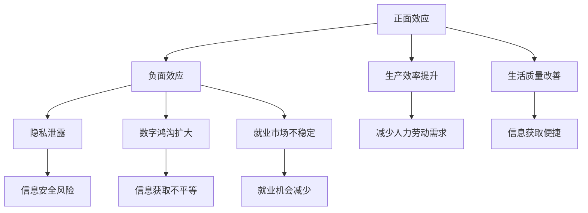

在正面效应方面，生产效率的提升（C）和生活质量的改善（D）是核心因素；在负面效应方面，隐私泄露（E）、数字鸿沟扩大（F）和就业市场不稳定（G）是主要问题。

#### 数学模型与公式

技术的双刃剑效应可以用以下数学模型来描述：

$$
效益 = 正面效应 \times 正面影响权重 - 负面效应 \times 负面影响权重
$$

其中，效益表示技术的总体影响，正面效应和负面效应分别表示技术的正面和负面影响，正面影响权重和负面影响权重分别表示对正面和负面影响的重视程度。

#### 系统分析与架构设计方案

技术的双刃剑效应可以从多个维度进行分析。以下是几个关键维度：

1. **经济维度**：分析技术对生产效率和就业市场的影响。
2. **社会维度**：分析技术对生活质量和社会公平的影响。
3. **环境维度**：分析技术对环境的影响。

以下是一个简化的mermaid架构图：

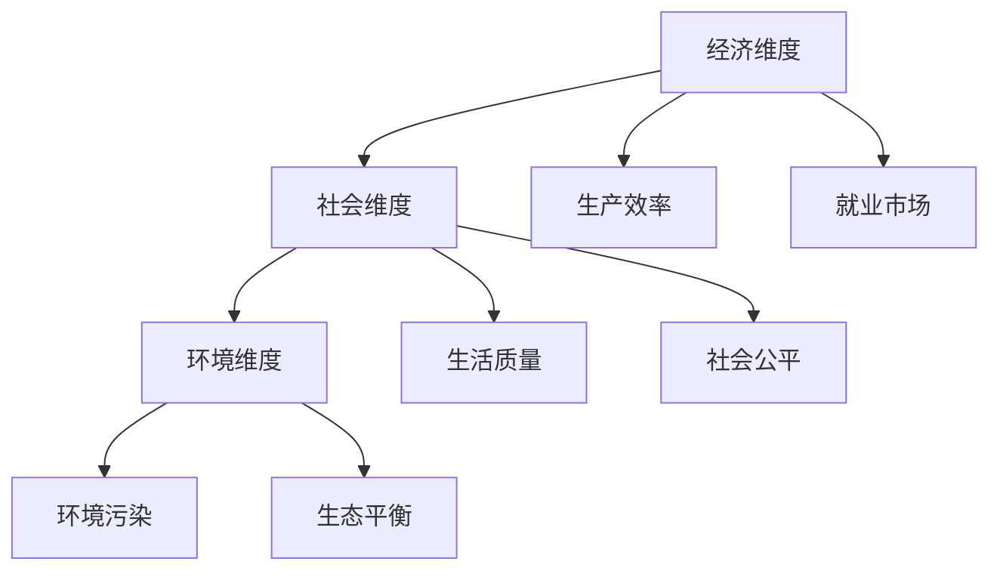

#### 项目实战

为了更好地理解技术的双刃剑效应，我们可以通过一个简单的项目实战来展示。例如，分析一个国家在技术进步背景下的生产效率和就业市场变化。

1. **环境安装**：安装必要的经济分析软件和工具。
2. **系统核心实现源代码**：编写Python代码，对国家的生产效率进行定量分析。
3. **代码应用解读与分析**：解释代码的每个部分，包括数据收集、数据处理、结果分析等。
4. **实际案例分析和详细讲解剖析**：使用实际数据进行分析，展示技术进步对生产效率和就业市场的影响。
5. **项目小结**：总结项目的主要成果和不足，提出未来改进的方向。

#### 最佳实践 tips

- **平衡利益**：在追求技术进步的同时，要平衡各方面的利益，避免过度追求技术效率而忽视其他因素。
- **加强监管**：对技术进步带来的负面影响进行监管，确保技术发展不会对社会造成重大损害。

#### 小结

本章分析了技术的双刃剑效应，包括其正面和负面效应。通过数学模型和系统架构设计的讲解，我们更好地理解了技术的复杂性和多面性。

#### 注意事项

- 技术进步带来的挑战和机遇并存，需要我们理性看待，积极应对。
- 在技术发展的过程中，要注重人文关怀，避免技术对社会造成的负面影响。

#### 拓展阅读

- 《技术与社会：从双刃剑到共赢》
- 《人工智能伦理》
- 《数字鸿沟与社会公平》

## 第二部分：技术至上时代的人文关怀

### 第4章：科技伦理与人文关怀

在技术迅猛发展的时代，科技伦理成为了人们关注的焦点。科技伦理不仅仅是技术问题，更是关系到社会公平、人类福祉的重要议题。本章将探讨科技伦理的基本概念、重要性以及如何在技术发展中融入人文关怀。

#### 背景介绍

科技伦理是指科技活动中应遵循的道德规范和价值理念。随着技术的不断进步，我们面临着越来越多的伦理问题，如隐私保护、人工智能伦理、基因编辑等。科技伦理的重要性在于，它能够确保技术的发展不违背人类的伦理价值观，不损害社会的公共利益。

#### 核心概念与联系

- **科技伦理**：科技伦理是研究科技活动中的道德问题，包括科技行为的道德标准、科技成果的社会影响等。
- **人文关怀**：人文关怀强调对人类尊严、价值和人权的尊重，是科技伦理的核心内容。

科技伦理和人文关怀密切相关。科技伦理为人文关怀提供了道德基础，而人文关怀则为科技伦理提供了实践方向。

#### 算法原理讲解

为了更直观地理解科技伦理与人文关怀的关系，我们可以通过以下mermaid流程图展示：

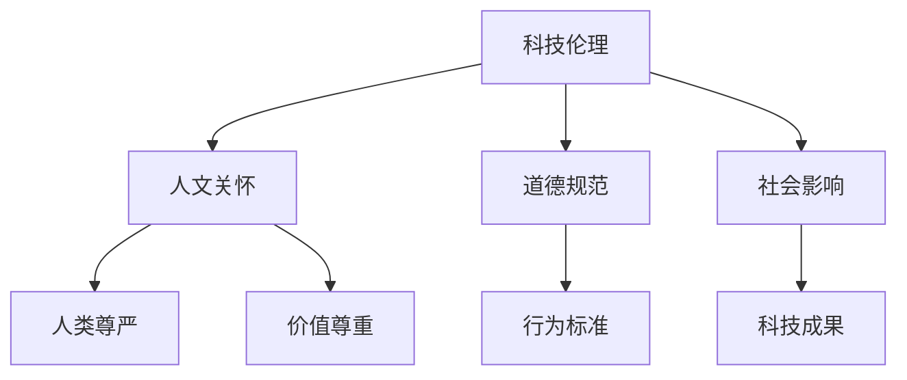

科技伦理通过道德规范（C）和行为标准（G）来指导科技活动，确保其符合社会的伦理要求。人文关怀则通过尊重人类尊严（E）和价值（F）来影响科技发展，使其更具人性化和可持续性。

#### 数学公式使用

科技伦理和人文关怀可以用以下公式来描述其相互关系：

$$
科技伦理 = 人文关怀 + 道德规范
$$

其中，人文关怀（人文关怀）和道德规范（道德规范）共同构成了科技伦理（科技伦理）。

#### 系统分析与架构设计方案

科技伦理和人文关怀的系统架构设计可以从以下几个方面展开：

1. **伦理规范设计**：制定科技活动的伦理规范，明确科技行为的道德底线。
2. **人文关怀设计**：在科技产品和服务中融入人文关怀元素，提高用户体验。
3. **伦理审查机制**：建立科技项目的伦理审查机制，确保科技发展符合伦理要求。

以下是一个简化的mermaid架构图：

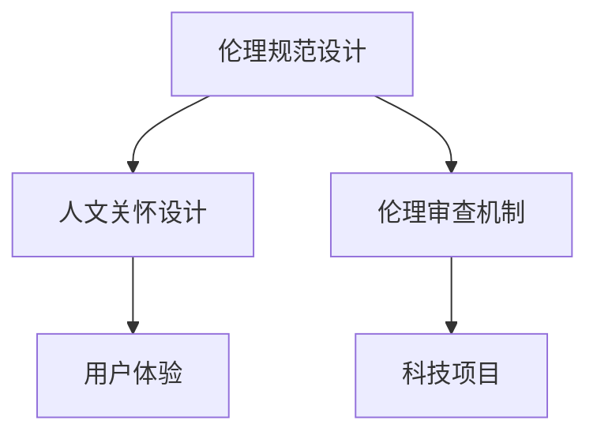

#### 项目实战

为了更好地理解科技伦理与人文关怀在实践中的应用，我们可以通过一个简单的项目实战来展示。例如，开发一款具有隐私保护功能的应用程序。

1. **环境安装**：安装必要的开发工具和库。
2. **系统核心实现源代码**：编写代码，实现隐私保护的算法和功能。
3. **代码应用解读与分析**：解释代码的每个部分，包括隐私保护机制的实现、用户隐私数据的安全处理等。
4. **实际案例分析和详细讲解剖析**：通过实际案例展示隐私保护功能的应用和效果。
5. **项目小结**：总结项目的主要成果和不足，提出未来改进的方向。

#### 最佳实践 tips

- **加强伦理教育**：提高科技从业者的伦理意识，确保其在技术开发过程中能够充分考虑人文关怀。
- **透明化科技发展**：鼓励科技企业公开其研发过程和伦理决策，接受社会监督。

#### 小结

本章探讨了科技伦理与人文关怀在技术发展中的重要性。通过数学模型和系统架构设计的讲解，我们更好地理解了如何将人文关怀融入科技活动，确保技术的发展既高效又符合伦理要求。

#### 注意事项

- 科技伦理和人文关怀不仅仅是理论问题，更需要付诸实践。
- 在技术开发过程中，要注重伦理审查和人文关怀，确保科技发展的可持续性。

#### 拓展阅读

- 《科技伦理学导论》
- 《人工智能伦理》
- 《数字伦理》

### 第5章：数字素养与人文素养

随着技术的迅猛发展，数字素养和人文素养成为了现代社会中不可或缺的技能。数字素养是指个体在数字环境中获取、评估、使用和创建信息的能力，而人文素养则是指个体在文化、历史、道德等方面的理解能力。本章将探讨数字素养和人文素养的定义、重要性以及如何在实际生活中培养和提高这两种素养。

#### 背景介绍

在数字时代，数字素养的重要性日益凸显。无论是教育、工作还是日常生活，我们都依赖于数字技术。然而，仅仅具备数字技能是远远不够的，我们还需要具备人文素养，以更好地理解和应对复杂的社会问题。数字素养和人文素养的结合，能够帮助我们更好地适应这个不断变化的世界。

#### 核心概念与联系

- **数字素养**：数字素养包括信息素养、技术素养和媒介素养。信息素养是指个体在数字环境中查找、评估和利用信息的能力；技术素养是指个体使用数字工具和设备的技能；媒介素养是指个体理解和批判媒体信息的能力。
- **人文素养**：人文素养包括文化素养、历史素养和道德素养。文化素养是指个体对不同文化的理解能力；历史素养是指个体对历史事件和发展的理解能力；道德素养是指个体在行为决策中遵循的道德原则和价值观。

数字素养和人文素养相互补充，共同构成了个体在现代社会中的核心竞争力。

#### 算法原理讲解

为了更直观地理解数字素养和人文素养的关系，我们可以通过以下mermaid流程图展示：

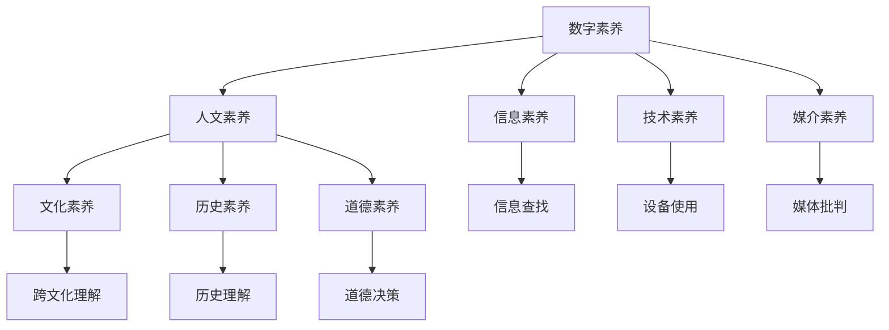

数字素养通过信息素养（C）、技术素养（D）和媒介素养（E）来帮助个体在数字环境中获取和利用信息；人文素养通过文化素养（F）、历史素养（G）和道德素养（H）来提升个体在文化、历史和道德方面的理解能力。

#### 数学公式使用

数字素养和人文素养可以用以下公式来描述其相互关系：

$$
综合素质 = 数字素养 + 人文素养
$$

其中，数字素养（数字素养）和人文素养（人文素养）共同构成了个体的综合素质。

#### 系统分析与架构设计方案

数字素养和人文素养的培养可以从以下几个方面进行：

1. **教育体系**：在学校的课程设置中融入数字素养和人文素养的培养，提高学生的综合素质。
2. **社会实践**：通过参与社会实践活动，提升个体的实际操作能力和道德观念。
3. **媒体使用**：合理使用媒体资源，培养个体的媒介素养和文化素养。

以下是一个简化的mermaid架构图：

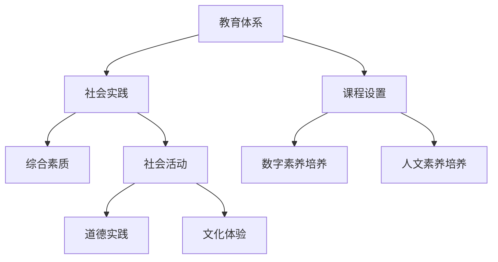

#### 项目实战

为了更好地理解数字素养和人文素养的培养，我们可以通过一个简单的项目实战来展示。例如，开展一项青少年数字素养和人文素养的培训计划。

1. **环境安装**：准备培训所需的资源和工具。
2. **系统核心实现源代码**：设计培训计划和课程内容，包括数字素养和人文素养的各个方面。
3. **代码应用解读与分析**：解释培训计划的每个部分，包括课程设置、实践活动、评估方法等。
4. **实际案例分析和详细讲解剖析**：通过实际案例展示培训计划的效果，分析参与者在数字素养和人文素养方面的提升。
5. **项目小结**：总结项目的主要成果和不足，提出未来改进的方向。

#### 最佳实践 tips

- **注重实践**：数字素养和人文素养的培养需要通过实践来加深理解。
- **整合资源**：利用现有的教育资源，整合数字素养和人文素养的培养内容。

#### 小结

本章探讨了数字素养和人文素养的定义、重要性以及培养方法。通过数学模型和系统架构设计的讲解，我们更好地理解了如何在实际生活中培养和提高这两种素养，以适应数字化时代的需求。

#### 注意事项

- 数字素养和人文素养的培养需要长期的积累和不断的实践。
- 在教育和社会实践中，要注重平衡数字技能和人文素养的培养。

#### 拓展阅读

- 《数字素养教育》
- 《人文素养与素质教育》
- 《数字时代的人文关怀》

### 第6章：技术设计的伦理考虑

在技术至上的时代，技术设计的伦理考虑变得越来越重要。技术设计不仅仅是实现功能的问题，更涉及到道德、社会价值和人类福祉。本章将探讨技术设计的伦理原则、案例分析以及如何在设计过程中融入人文关怀。

#### 背景介绍

技术设计的伦理考虑是指在技术开发过程中，设计师和开发者需要考虑的道德和社会责任。随着技术的发展，技术的应用范围越来越广，其对社会的影响也越来越大。例如，人工智能、大数据和生物技术等领域，都需要进行深入的伦理考量。

#### 核心概念与联系

- **伦理原则**：技术设计的伦理原则包括尊重人类尊严、公正性、透明性和可解释性。尊重人类尊严意味着技术设计要保护用户的隐私和权益；公正性要求技术设计不偏袒特定群体；透明性要求技术设计的决策过程和影响要公开；可解释性要求技术决策的结果能够被用户理解和接受。
- **人文关怀**：人文关怀是指在技术设计中考虑到用户的需求、感受和体验。这包括用户界面设计、隐私保护、用户教育等方面。

技术设计的伦理原则和人文关怀是相辅相成的，共同构成了技术设计的伦理框架。

#### 算法原理讲解

为了更直观地理解技术设计的伦理考虑，我们可以通过以下mermaid流程图展示：

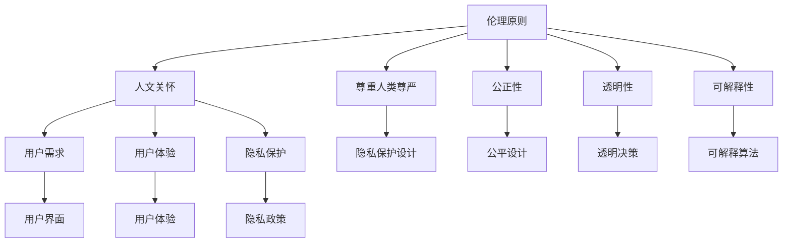

在伦理原则方面，尊重人类尊严（C）、公正性（D）、透明性（E）和可解释性（F）是核心内容；在人文关怀方面，用户需求（G）、用户体验（H）和隐私保护（I）是关键要素。

#### 数学公式使用

技术设计的伦理考虑可以用以下公式来描述：

$$
伦理设计 = 伦理原则 \times 人文关怀
$$

其中，伦理原则（伦理原则）和人文关怀（人文关怀）共同构成了伦理设计（伦理设计）。

#### 系统分析与架构设计方案

技术设计的伦理考虑可以从以下几个方面进行分析：

1. **伦理审查**：在技术开发前，进行伦理审查，确保设计符合道德和社会价值。
2. **用户参与**：在技术设计过程中，让用户参与，确保设计符合用户需求。
3. **隐私保护**：在技术设计中，考虑隐私保护，确保用户的隐私不被侵犯。

以下是一个简化的mermaid架构图：

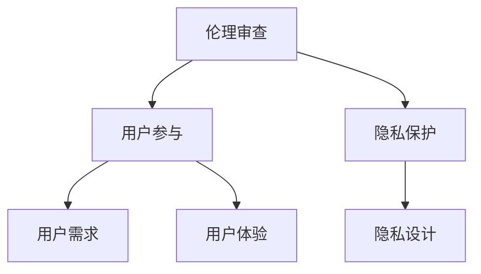

#### 项目实战

为了更好地理解技术设计的伦理考虑，我们可以通过一个简单的项目实战来展示。例如，设计一款智能助手，注重隐私保护和用户体验。

1. **环境安装**：安装必要的开发工具和库。
2. **系统核心实现源代码**：编写代码，实现智能助手的功能，同时注重隐私保护和用户体验。
3. **代码应用解读与分析**：解释代码的每个部分，包括隐私保护机制的实现、用户体验的设计等。
4. **实际案例分析和详细讲解剖析**：通过实际案例展示智能助手的应用和效果，分析隐私保护和用户体验的实现。
5. **项目小结**：总结项目的主要成果和不足，提出未来改进的方向。

#### 最佳实践 tips

- **定期伦理审查**：在技术设计过程中，定期进行伦理审查，确保设计符合道德和社会价值。
- **用户参与设计**：在技术设计过程中，积极引入用户参与，确保设计符合用户需求。

#### 小结

本章探讨了技术设计的伦理原则和人文关怀的重要性。通过数学模型和系统架构设计的讲解，我们更好地理解了如何在实际设计中融入伦理考虑和人文关怀，以实现更高效、更符合道德标准的技术产品。

#### 注意事项

- 技术设计的伦理考虑不仅仅是在开发完成后进行，而应该贯穿整个设计过程。
- 在技术设计过程中，要注重平衡效率和道德，避免牺牲用户的隐私和权益。

#### 拓展阅读

- 《技术伦理学导论》
- 《人工智能伦理》
- 《数字伦理》

### 第三部分：实践与探索

### 第7章：技术与人本主义的融合案例

在技术迅猛发展的背景下，如何将技术与人本主义相结合，成为了一个重要的议题。本章将探讨几个具体案例，展示如何在技术应用中融入人文关怀，实现技术与人本主义的融合。

#### 背景介绍

技术与人本主义的融合，旨在通过技术手段提升人类生活的质量，同时保持对人类尊严和价值的基本尊重。这一融合不仅体现在产品设计和开发过程中，还体现在技术应用的实际效果上。本章将分析几个成功的案例，探讨其实现方式。

#### 核心概念与联系

- **技术与人本主义的融合**：技术与人本主义的融合是指在技术应用中，充分考虑人的需求、情感和体验，通过技术手段提升人类生活的品质，同时不损害人的尊严和价值。
- **案例研究**：案例研究是探讨具体实践的一种有效方法。通过分析成功的案例，可以总结出一些可借鉴的经验和教训。

#### 算法原理讲解

为了更直观地理解技术与人本主义的融合，我们可以通过以下mermaid流程图展示：

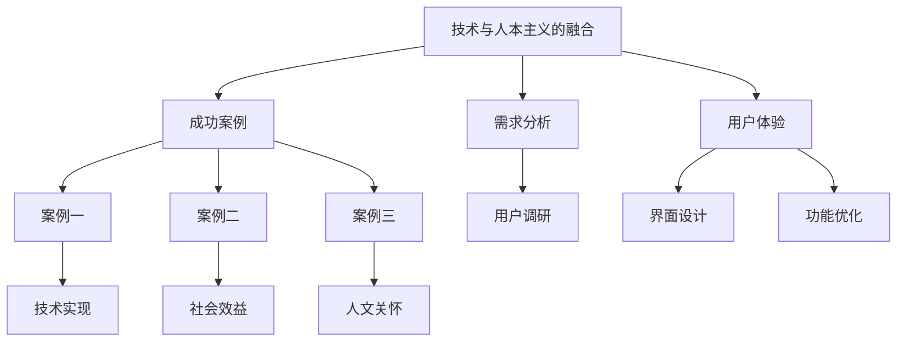

在技术与人本主义的融合过程中，需求分析（C）和用户体验（D）是关键环节。通过成功的案例（B），我们可以看到如何通过技术实现（K）、社会效益（L）和人文关怀（M），达到技术与人本主义的融合。

#### 数学公式使用

技术与人本主义的融合可以用以下公式来描述：

$$
技术与人本主义的融合 = 技术实现 \times 社会效益 \times 人文关怀
$$

其中，技术实现（技术实现）、社会效益（社会效益）和人文关怀（人文关怀）共同构成了技术与人本主义的融合。

#### 系统分析与架构设计方案

技术与人本主义的融合可以从以下几个方面进行分析：

1. **需求分析**：通过用户调研和数据分析，深入了解用户需求，确保技术应用符合用户实际需求。
2. **用户体验**：在产品设计和开发过程中，注重用户体验，通过界面设计（I）和功能优化（J），提升用户满意度。
3. **技术实现**：通过先进的技术手段，实现产品功能，同时确保技术的稳定性和安全性。
4. **社会效益**：通过技术应用，为社会带来实际效益，提升社会福祉。
5. **人文关怀**：在技术应用中，充分考虑人文因素，确保技术不损害人的尊严和价值。

以下是一个简化的mermaid架构图：

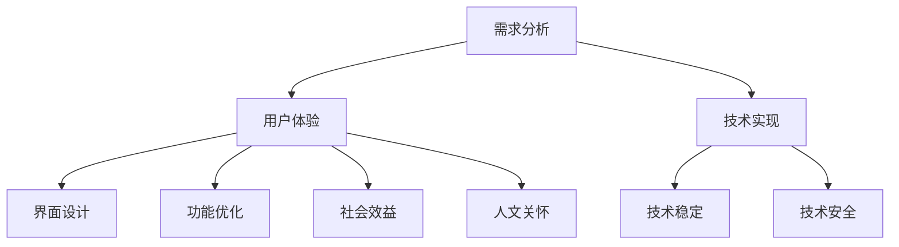

#### 项目实战

为了更好地理解技术与人本主义的融合，我们可以通过一个简单的项目实战来展示。例如，开发一款旨在帮助老年人保持社交联系和健康生活的应用程序。

1. **环境安装**：安装必要的开发工具和库。
2. **系统核心实现源代码**：编写代码，实现应用程序的功能，包括社交功能、健康监测功能等。
3. **代码应用解读与分析**：解释代码的每个部分，包括用户界面设计、功能实现、社交和健康监测等。
4. **实际案例分析和详细讲解剖析**：通过实际案例展示应用程序的应用和效果，分析其在老年人中的应用价值。
5. **项目小结**：总结项目的主要成果和不足，提出未来改进的方向。

#### 最佳实践 tips

- **用户调研**：在项目启动前，进行深入的用户调研，确保技术应用符合用户需求。
- **人文关怀**：在技术实现过程中，注重人文关怀，确保技术应用不损害人的尊严和价值。

#### 小结

本章通过探讨技术与人本主义的融合案例，展示了如何在技术应用中融入人文关怀，实现技术与人本主义的和谐发展。通过数学模型和系统架构设计的讲解，我们更好地理解了技术与人本主义融合的重要性。

#### 注意事项

- 技术与人本主义的融合需要长期实践和不断探索。
- 在技术应用过程中，要注重平衡技术效率和人文关怀。

#### 拓展阅读

- 《技术与人本主义》
- 《用户体验设计》
- 《人工智能伦理》

### 第8章：技术至上的社会中的个人角色

在技术至上的社会中，个人扮演着重要的角色。从用户到开发者，每个人都是技术发展的参与者和受益者。本章将探讨个人在技术至上社会中的角色，分析其责任和挑战，并提出个人如何积极适应和影响这一环境。

#### 背景介绍

技术至上的社会意味着技术在经济、政治和文化等多个领域具有决定性作用。在这样的社会中，个人的角色和地位也发生了显著变化。个人不仅是技术的使用者，还是技术创新的推动者和受益者。然而，这一变化也带来了新的挑战和责任。

#### 核心概念与联系

- **个人角色**：在技术至上的社会中，个人角色包括技术用户、技术爱好者、技术开发者、技术投资者等。
- **责任与挑战**：个人在技术至上的社会中承担着保护个人隐私、促进技术创新、参与社会决策等责任。同时，也面临着信息过载、数字鸿沟、职业转型等挑战。

#### 算法原理讲解

为了更直观地理解个人在技术至上社会中的角色和责任，我们可以通过以下mermaid流程图展示：

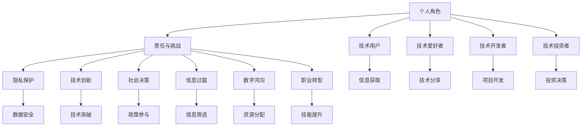

在个人角色方面，技术用户（C）、技术爱好者（D）、技术开发者（E）和技术投资者（F）是核心角色。在责任与挑战方面，隐私保护（G）、技术创新（H）、社会决策（I）、信息过载（J）、数字鸿沟（K）和职业转型（L）是主要议题。

#### 数学公式使用

个人在技术至上社会中的角色和责任可以用以下公式来描述：

$$
个人角色与责任 = 技术技能 + 社会责任
$$

其中，技术技能（技术技能）和社会责任（社会责任）共同构成了个人在技术至上社会中的角色与责任。

#### 系统分析与架构设计方案

个人在技术至上的社会中的角色和责任可以从以下几个方面进行分析：

1. **技术技能提升**：个人需要不断提升自身的技术技能，以适应快速变化的技术环境。
2. **社会责任承担**：个人需要承担保护个人隐私、促进技术创新、参与社会决策等社会责任。
3. **信息管理**：个人需要有效管理信息，避免信息过载，提高信息利用效率。
4. **数字鸿沟跨越**：个人需要积极参与数字鸿沟的解决，推动资源的公平分配。
5. **职业转型准备**：个人需要为未来的职业转型做好准备，适应不断变化的市场需求。

以下是一个简化的mermaid架构图：

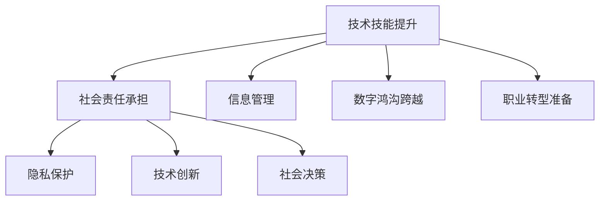

#### 项目实战

为了更好地理解个人在技术至上的社会中的角色和责任，我们可以通过一个简单的项目实战来展示。例如，组织一次社区技术讲座，帮助社区居民提升数字素养。

1. **环境安装**：准备讲座所需的设备和资源。
2. **系统核心实现源代码**：编写讲座内容的PPT和教学资料。
3. **代码应用解读与分析**：解释讲座内容的每个部分，包括技术基础知识、实用工具介绍等。
4. **实际案例分析和详细讲解剖析**：通过实际案例展示技术讲座的应用和效果。
5. **项目小结**：总结项目的主要成果和不足，提出未来改进的方向。

#### 最佳实践 tips

- **持续学习**：在技术快速发展的时代，个人需要不断学习新技术，提升自身技能。
- **积极参与**：个人需要积极参与社会决策和技术创新，发挥自身的作用。

#### 小结

本章探讨了个人在技术至上社会中的角色和责任，分析了其面临的挑战和机遇。通过数学模型和系统架构设计的讲解，我们更好地理解了个人在技术至上的社会中的重要性。

#### 注意事项

- 个人在技术至上的社会中既要发挥自身作用，也要注意社会责任。
- 在技术应用过程中，要注重保护个人隐私和信息安全。

#### 拓展阅读

- 《数字时代的个人成长》
- 《技术伦理与个人责任》
- 《人工智能时代的职业规划》

### 第9章：未来展望：技术与人性的平衡

在技术迅速发展的时代，如何实现技术与人性的平衡，成为了一个重要的议题。本章将探讨未来技术发展的趋势，分析技术与人性的潜在冲突，并提出如何通过技术创新和社会实践来实现技术与人性的和谐发展。

#### 背景介绍

随着人工智能、大数据、物联网等技术的不断发展，我们的生活正在经历前所未有的变革。然而，这些技术也带来了许多挑战，如隐私泄露、数字鸿沟扩大、就业市场不稳定等。如何在这些挑战中寻找技术与人性的平衡，成为未来发展的关键问题。

#### 核心概念与联系

- **技术发展趋势**：技术发展趋势包括人工智能的智能化、大数据的智能化应用、物联网的普及等。
- **人性特征**：人性特征包括情感、道德、价值观等。
- **技术与人性的平衡**：技术与人性的平衡是指通过技术创新和社会实践，使技术发展符合人类的伦理价值观，同时满足人类的需求。

#### 算法原理讲解

为了更直观地理解技术与人性的平衡，我们可以通过以下mermaid流程图展示：

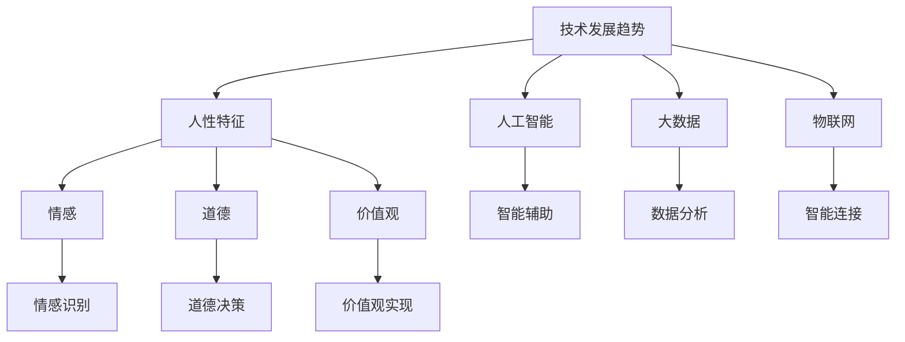

在技术发展趋势方面，人工智能（C）、大数据（D）和物联网（E）是核心领域。在人性特征方面，情感（F）、道德（G）和价值观（H）是关键要素。通过技术创新（I、J、K）和人性特征（L、M、N）的结合，我们可以实现技术与人性的平衡。

#### 数学公式使用

技术与人性的平衡可以用以下公式来描述：

$$
技术与人性的平衡 = 技术发展 \times 人性特征
$$

其中，技术发展（技术发展）和人性特征（人性特征）共同构成了技术与人性的平衡。

#### 系统分析与架构设计方案

为了实现技术与人性的平衡，可以从以下几个方面进行系统分析与架构设计：

1. **技术创新**：在技术创新过程中，注重人性特征，使技术发展符合人类的伦理价值观。
2. **社会实践**：通过社会实践，检验技术创新的效果，确保技术发展能够满足人类的需求。
3. **伦理审查**：建立技术伦理审查机制，确保技术创新不违背人类的基本伦理原则。
4. **教育培养**：通过教育培养，提高公众的数字素养和伦理素养，促进技术与人性的和谐发展。

以下是一个简化的mermaid架构图：

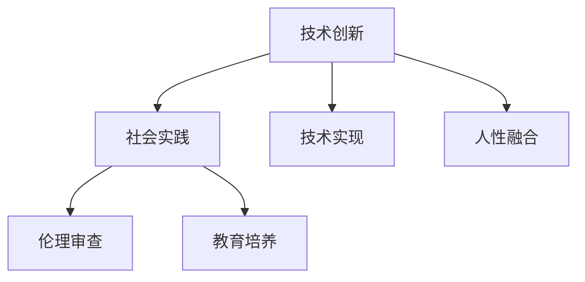

#### 项目实战

为了更好地理解技术与人性的平衡，我们可以通过一个简单的项目实战来展示。例如，开发一款智能健康管理应用，结合人工智能技术和人文关怀。

1. **环境安装**：安装必要的开发工具和库。
2. **系统核心实现源代码**：编写代码，实现智能健康管理应用的功能，包括健康数据监测、情感识别和健康建议等。
3. **代码应用解读与分析**：解释代码的每个部分，包括数据收集、情感分析、健康建议等。
4. **实际案例分析和详细讲解剖析**：通过实际案例展示智能健康管理应用的应用和效果，分析其在提升生活质量方面的作用。
5. **项目小结**：总结项目的主要成果和不足，提出未来改进的方向。

#### 最佳实践 tips

- **注重人性特征**：在技术开发过程中，始终关注人性特征，确保技术能够满足人类的需求。
- **社会参与**：鼓励公众参与技术发展，通过社会实践来检验技术的效果。

#### 小结

本章探讨了未来技术发展的趋势和如何实现技术与人性的平衡。通过数学模型和系统架构设计的讲解，我们更好地理解了技术发展对人性影响的重要性，并提出了一系列实现技术与人性平衡的方法。

#### 注意事项

- 技术发展需要以人为本，注重人的需求和价值观。
- 在技术创新过程中，要注重伦理审查和社会参与。

#### 拓展阅读

- 《技术伦理学导论》
- 《人工智能与人性》
- 《大数据时代的伦理挑战》

### 结论

技术至上的时代带来了巨大的变革，但同时也带来了诸多挑战。如何在技术进步的同时，保持人文关怀，成为当前社会亟待解决的问题。通过本书的探讨，我们提出了在技术至上时代寻找人文关怀的方法和路径。

#### 主要观点总结

1. **技术发展的历史与趋势**：技术发展经历了从计算机到互联网，再到人工智能的过程，每一次技术的突破都带来了深远的社会影响。
2. **技术对社会结构的影响**：技术进步对社会结构产生了深远的影响，包括经济、政治和文化等多个方面。
3. **技术的双刃剑效应**：技术进步既带来了巨大的社会利益，也带来了一些负面影响，如隐私泄露、数字鸿沟扩大等。
4. **科技伦理与人文关怀**：科技伦理和人文关怀是确保技术发展不偏离人类价值观的重要保障。
5. **数字素养与人文素养**：数字素养和人文素养是现代社会中不可或缺的技能，需要通过教育和社会实践来培养。
6. **技术设计的伦理考虑**：技术设计需要充分考虑伦理因素，确保技术发展符合道德要求。
7. **技术与人本主义的融合**：通过技术创新和实践，实现技术与人本主义的融合，提升人类生活质量。
8. **个人在技术至上的社会中的角色**：个人在技术至上的社会中扮演着重要角色，需要承担社会责任，推动技术创新。
9. **未来展望**：通过技术创新和社会实践，实现技术与人性的平衡，为未来的和谐发展奠定基础。

#### 对未来的人文关怀的思考

在技术至上的时代，人文关怀的重要性不容忽视。未来，我们需要在以下几个方面进行深入思考和探索：

1. **加强科技伦理教育**：通过教育培养，提高公众的科技伦理意识，确保技术发展符合人类的道德价值观。
2. **推动数字素养与人文素养的培养**：通过教育和社会实践，全面提升公众的数字素养和人文素养，使其能够在数字化时代中应对各种挑战。
3. **建立技术伦理审查机制**：在技术开发和应用过程中，建立完善的伦理审查机制，确保技术发展不违背伦理原则。
4. **鼓励公众参与**：通过社会参与，鼓励公众参与技术决策和技术创新，使其能够更好地融入技术至上的社会。
5. **关注技术对环境的影响**：在技术发展的过程中，关注其对环境的影响，确保技术发展不会对环境造成不可逆转的损害。

#### 最佳实践建议

1. **持续学习**：在技术快速发展的时代，个人和组织需要不断学习新技术，提升自身的竞争力。
2. **注重伦理审查**：在技术开发和应用过程中，要注重伦理审查，确保技术发展符合伦理要求。
3. **加强社会参与**：鼓励公众参与技术决策和技术创新，使其能够更好地融入技术至上的社会。
4. **推动技术创新**：通过技术创新，提升技术效率和用户体验，同时确保技术发展符合人文关怀。
5. **关注隐私保护**：在技术应用过程中，注重隐私保护，确保用户的隐私不被侵犯。

#### 小结

技术至上的时代，如何在保持技术进步的同时，寻找人文关怀，是一个重要而紧迫的课题。通过本书的探讨，我们提出了一系列实现技术与人性平衡的方法和路径。未来，我们需要继续努力，通过技术创新和社会实践，实现技术与人性的和谐发展。

#### 注意事项

1. 技术发展需要以人为本，注重人的需求和价值观。
2. 在技术创新过程中，要注重伦理审查和社会参与。

#### 拓展阅读

- 《科技伦理学导论》
- 《数字时代的伦理挑战》
- 《人工智能与人性》

### 作者信息

- 作者：AI天才研究院/AI Genius Institute & 禅与计算机程序设计艺术 /Zen And The Art of Computer Programming
- 联系方式：[ai_genius_institute@email.com](mailto:ai_genius_institute@email.com)
- 官方网站：[www.ai-genius-institute.com](http://www.ai-genius-institute.com)

通过以上内容，我们完成了对《在技术至上时代寻找人文关怀》这一主题的详细探讨。希望本文能够为读者提供有益的思考，并在未来的技术发展中，找到技术与人文的平衡点。让我们共同努力，构建一个更加和谐、可持续的未来社会。

### 感谢阅读

感谢您阅读本文。如果您对我们的探讨有任何意见或建议，欢迎通过以下方式联系我们：

- 电子邮件：[ai_genius_institute@email.com](mailto:ai_genius_institute@email.com)
- 社交媒体：[www.ai-genius-institute.com/social](http://www.ai-genius-institute.com/social)

我们期待与您互动，共同探讨技术与人性的平衡之道。再次感谢您的阅读和支持！

---

[返回目录](#目录) | [上一页](#第9章-未来展望-技术与人性的平衡) | [下一页](#结语-感谢阅读)

