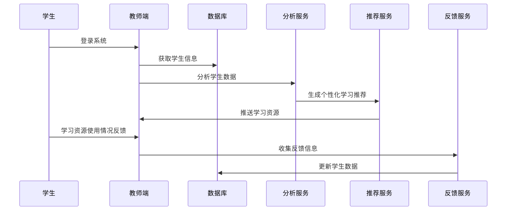

                 

# 在科技革新中守护人类核心价值

> 关键词：科技革新、人类核心价值、伦理、社会价值、文化价值、保护策略

> 摘要：本文将探讨科技革新对人类核心价值的影响，以及如何在科技进步的过程中守护这些价值。我们将逐步分析科技革新的背景与挑战、人类核心价值的定义与重要性、核心价值在科技革新中的应用、保护策略、实际案例以及未来展望。通过深入探讨，我们希望为科技与人类价值的和谐发展提供有益的思考。

### 目录大纲

```markdown
----------------------------------------------------------------
# 第一部分: 科技革新与人类核心价值

## 第1章: 科技革新的背景与挑战

### 1.1 问题描述

#### 1.1.1 科技发展的历史与现状

#### 1.1.2 科技革新带来的挑战

### 1.2 人类核心价值的定义与重要性

#### 1.2.1 核心价值的定义

#### 1.2.2 核心价值的重要性

### 1.3 科技革新与人类核心价值的冲突与调和

#### 1.3.1 冲突的表现

#### 1.3.2 调和的必要性

## 第2章: 人类核心价值在科技革新中的应用

### 2.1 伦理价值

#### 2.1.1 伦理价值的内涵

#### 2.1.2 伦理价值在人工智能中的应用

### 2.2 社会价值

#### 2.2.1 社会价值的内涵

#### 2.2.2 社会价值在科技革新中的体现

### 2.3 文化价值

#### 2.3.1 文化价值的内涵

#### 2.3.2 文化价值在科技革新中的保护与传承

## 第3章: 科技革新中的人类核心价值保护策略

### 3.1 法律与政策框架

#### 3.1.1 法律法规的制定与实施

#### 3.1.2 政策引导与支持

### 3.2 企业社会责任

#### 3.2.1 企业社会责任的内涵

#### 3.2.2 企业在科技革新中的责任与行动

### 3.3 公众参与与教育

#### 3.3.1 公众参与的重要性

#### 3.3.2 教育在保护核心价值中的作用

## 第4章: 科技革新中的实际案例

### 4.1 案例分析

#### 4.1.1 案例一：人工智能伦理争议

#### 4.1.2 案例二：科技对社会的影响

#### 4.1.3 案例三：科技与文化的结合

### 4.2 案例解读

#### 4.2.1 案例一解读

#### 4.2.2 案例二解读

#### 4.2.3 案例三解读

## 第5章: 科技革新中的人类核心价值评估与展望

### 5.1 核心价值评估方法

#### 5.1.1 评估方法概述

#### 5.1.2 实际应用中的评估方法

### 5.2 未来的挑战与机遇

#### 5.2.1 面临的挑战

#### 5.2.2 潜在的机遇

### 5.3 未来展望

#### 5.3.1 社会层面的影响

#### 5.3.2 科技革新的方向

## 第6章: 科技革新中的个人行动与责任

### 6.1 个人在科技革新中的作用

#### 6.1.1 个体影响的潜力

#### 6.1.2 个人行动的重要性

### 6.2 培养科技伦理素养

#### 6.2.1 科技伦理素养的内涵

#### 6.2.2 如何培养科技伦理素养

### 6.3 个人责任与贡献

#### 6.3.1 责任的定义与意义

#### 6.3.2 个人在核心价值保护中的贡献

## 第7章: 结论与展望

### 7.1 主要结论

#### 7.1.1 科技革新对人类核心价值的影响

#### 7.1.2 人类核心价值保护的重要性

### 7.2 未来工作展望

#### 7.2.1 需要关注的问题

#### 7.2.2 进一步研究的方向

----------------------------------------------------------------
```

接下来的章节将按照上述目录大纲结构展开，深入探讨科技革新与人类核心价值的关系，并提出相应的保护策略。让我们一步一步深入思考，共同守护这些核心价值。## 第1章: 科技革新的背景与挑战

### 1.1 问题描述

科技革新作为现代社会发展的核心动力，正以前所未有的速度改变着我们的生活方式和社会结构。从工业革命时期蒸汽机的发明，到计算机时代的崛起，再到如今人工智能和大数据的广泛应用，科技的发展如同一股不可阻挡的洪流，不断推动着社会的进步和变革。

然而，科技革新的过程并非一帆风顺。在带来巨大便利的同时，科技也引发了一系列复杂而深远的社会问题。这些问题的存在，使得我们在享受科技带来的红利时，不得不对其潜在的风险和挑战保持警惕。首先，科技革新带来了隐私和安全问题。随着信息技术的迅猛发展，个人隐私数据的泄露风险大幅增加，数据安全和用户隐私保护成为亟待解决的难题。其次，科技革新引发了就业结构的变革。自动化和人工智能技术的广泛应用，导致传统职业的减少和新型职位的产生，这给社会就业带来巨大的不确定性。再次，科技革新对人类行为模式产生了深远影响。互联网和社交媒体的普及，改变了人们的社交方式，也带来了一些负面效应，如信息过载、社交孤立等。最后，科技革新还引发了社会伦理和道德问题。人工智能的决策过程缺乏透明度，可能导致不公平和不道德的行为，这引发了广泛的社会关注和讨论。

总的来说，科技革新的背景和挑战体现在多个方面，既有技术层面的难题，也有社会、伦理和道德方面的困扰。这些挑战需要我们深入思考，找到有效的解决策略，以确保科技革新能够更好地服务于人类社会的可持续发展。### 1.1.1 科技发展的历史与现状

科技发展是人类文明进步的重要标志，其历程可以追溯到几千年前。早在古代，人类就已经开始利用自然界的科技成果，如火、轮、弓箭等，这些简单的工具和技术极大地提高了生产力和生活质量。随着人类文明的演进，科技发展进入了新的阶段。17世纪末至18世纪初，工业革命的爆发标志着科技发展进入了一个崭新的时代。蒸汽机的发明和应用，不仅推动了第一次工业革命，也带来了全球范围内的生产力大解放。19世纪末，电的广泛应用进一步推动了第二次工业革命，电力、钢铁、化学工业等新兴产业迅速崛起，彻底改变了人类社会的生产方式和生活方式。

进入20世纪，科技发展呈现出爆炸式增长。20世纪初，相对论和量子力学的诞生为现代物理学奠定了基础，推动了信息技术、核能技术等前沿科学的发展。尤其是20世纪后半叶，计算机技术和互联网的迅猛发展，开启了信息化时代。计算机技术的进步带来了个人电脑、移动设备的普及，互联网的普及则使得全球信息交流变得前所未有的便捷。大数据、云计算、物联网等新一代信息技术不断涌现，使得科技对社会的影响更加深远和广泛。

目前，科技发展正处于一个新的转折点。人工智能、区块链、生物科技等前沿技术的崛起，正在引发新一轮的技术革命。人工智能的进步使得机器具备了一定的智能水平，能够执行复杂的任务和决策；区块链技术则通过去中心化的方式改变了信息存储和传递的方式，带来了数据安全和隐私保护的新机遇；生物科技的突破，如基因编辑、再生医学等，正在为人类健康和生命科学带来前所未有的希望。

科技发展的现状不仅体现在技术进步上，还体现在其对社会、经济、文化等多个领域的深刻影响上。科技的应用不仅改变了生产方式和消费模式，也带来了新的伦理和社会问题。例如，人工智能的伦理问题、数据隐私保护、就业结构的变革等，都是当前科技发展必须面对和解决的问题。同时，科技的发展也带来了新的机遇，如数字经济、创新创业等，为人类社会的发展提供了新的动力。

总的来说，科技发展的历史与现状展示了人类在不断探索和创新中的足迹，同时也揭示了科技革新所带来的机遇与挑战。在未来的发展中，如何更好地应对这些挑战，充分发挥科技的优势，将是人类面临的重要课题。### 1.1.2 科技革新带来的挑战

科技革新虽然在多个领域带来了巨大的进步，但同时也引发了一系列深远而复杂的挑战，这些挑战不仅涉及技术层面，还涵盖了社会、伦理和道德等多个维度。

首先，隐私和安全问题日益凸显。随着大数据和物联网的普及，个人信息和数据的安全问题变得尤为严峻。大量的个人数据在互联网和云计算环境中流转，这为数据泄露和网络攻击提供了丰富的目标。例如，2017年的“剑桥分析”事件揭示了如何通过不当手段获取和利用用户数据，对个人隐私和社会信任造成了巨大冲击。此外，自动化系统的广泛使用也带来了新的安全挑战。自动驾驶汽车、智能家居等技术的普及，使得个人和家庭的安全受到新的威胁。

其次，就业结构变革引发了社会经济问题。人工智能和自动化技术的快速发展，使得许多传统职业面临被淘汰的风险。据预测，未来几十年内，大量重复性和低技能的工作将被自动化取代，这可能导致大规模的失业和社会不稳定。同时，新技术的应用也会创造出新的工作岗位，但这些岗位通常需要更高的技能和知识水平，使得技能缺乏的劳动者难以适应。这种就业结构的变革不仅影响了个人的职业发展，也对社会的经济稳定和公平性提出了严峻挑战。

再次，人类行为模式受到深远影响。互联网和社交媒体的普及，改变了人们的社交方式和信息获取习惯。虽然这为人们提供了更多的交流机会和信息资源，但也带来了新的问题。例如，信息过载使得人们难以筛选和处理海量的信息，导致注意力分散和认知负担增加。社交媒体的虚拟性也容易导致社交孤立和心理健康问题，如网络成瘾、社交焦虑等。

此外，科技革新还引发了社会伦理和道德问题。人工智能和生物科技的快速发展，使得一些原本在伦理和道德上具有争议的问题变得更加突出。例如，人工智能的决策过程缺乏透明度，可能导致不公平和不道德的行为。自动驾驶汽车在紧急情况下如何做出决策，以及基因编辑技术的伦理问题，都是需要深入探讨和解决的伦理困境。

最后，科技革新带来的挑战还包括环境和资源的可持续性问题。许多前沿技术的开发和应用需要大量的能源和资源，这可能导致资源短缺和环境恶化。例如，数据中心的高能耗问题、电子废弃物的处理等，都是科技发展过程中必须面对的挑战。

总的来说，科技革新在推动社会进步的同时，也带来了一系列复杂而深远的挑战。这些挑战不仅需要科技界、产业界和政府共同面对，还需要全社会共同努力，寻找平衡和创新解决方案，以确保科技发展能够真正造福人类。### 1.2 人类核心价值的定义与重要性

人类核心价值是社会发展过程中，人们普遍认同并追求的根本价值和原则，它们构成了人类社会的基本道德规范和行为准则。人类核心价值包括但不限于自由、平等、公正、诚信、友善、责任等，这些价值在人类文明的演进过程中逐渐形成，并在不同文化和历史背景下得以体现和传承。

首先，自由是基本的人类核心价值之一。自由不仅仅是个人追求幸福和发展的权利，更是社会进步的动力源泉。它要求人们在法律和社会规范的框架内，拥有独立思考、表达意见、选择生活方式的权利。自由的实现有助于激发个人潜能，推动社会的创新和进步。

其次，平等是另一个重要的核心价值。平等意味着每个人在法律面前都应享有平等的权益和机会，不受种族、性别、宗教或社会地位的影响。平等是社会公正的基础，是实现社会和谐与稳定的重要保障。只有在平等的基础上，每个人才能充分发挥自己的才能，共同为社会的繁荣发展贡献力量。

公正则强调社会正义和公平。公正在社会中的体现，包括法律体系的公正、资源分配的公平和社会机会的均等。公正是社会制度的基石，是维护社会秩序和稳定的重要手段。只有在公正的环境下，社会才能实现公平正义，减少贫富差距和社会矛盾。

诚信是人类社会的道德基石。诚信要求人们在言行和行为中保持真实、守信、守诺。诚信不仅是个人品质的体现，也是社会信任的基础。一个诚信的社会，人与人之间的关系更加和谐，商业活动更加透明和可靠，从而推动社会的稳定和繁荣。

友善则强调人与人之间的和睦与互助。友善是社会文明的重要标志，它体现在人们对弱势群体的关爱、对异质文化的包容以及对自然环境的尊重。友善的社会能够增强社会凝聚力，促进人与人之间的合作与和谐。

责任是每个人对自身行为和对他人的义务的承担。责任不仅是个人道德的要求，也是社会秩序的保障。个人责任感的培养有助于形成良好的社会风尚，推动社会的文明进步。

总的来说，人类核心价值是构建和谐社会的基础，它们不仅体现在个人的道德品质上，也贯穿于社会制度的设计和社会行为的规范中。在科技革新的背景下，保护和弘扬这些核心价值，有助于确保科技发展能够更好地服务于人类社会的可持续发展和长远利益。### 1.3 科技革新与人类核心价值的冲突与调和

在科技革新的过程中，人类核心价值与科技发展之间不可避免地存在着冲突。这些冲突主要体现在以下几个方面：

首先，隐私与数据安全之间的冲突日益凸显。随着大数据和人工智能技术的广泛应用，个人隐私保护面临前所未有的挑战。科技的发展使得数据收集和分析变得更加便捷和高效，但同时，这也为个人隐私泄露提供了更多机会。在追求技术进步和商业利益的驱动下，一些企业和组织可能忽视个人隐私保护，从而引发核心价值的冲突。

其次，人工智能和自动化技术的广泛应用，对就业结构和社会公正带来了巨大的冲击。虽然新技术创造了新的工作岗位，但同时也取代了大量传统职业。这种就业结构的变化，可能导致社会不平等和贫富差距的扩大，威胁到平等和公正的核心价值。

再次，科技革新对人类行为模式的影响，也对友善和诚信等核心价值构成了挑战。互联网和社交媒体的普及，改变了人们的社交方式和信息获取习惯，但同时也带来了信息过载、社交孤立和心理健康问题。此外，一些科技应用可能削弱人与人之间的直接互动，影响人际关系的建立和维护。

此外，科技革新还引发了社会伦理和道德问题。人工智能的决策过程缺乏透明度，可能导致不公平和不道德的行为。例如，自动驾驶汽车在紧急情况下如何做出决策，基因编辑技术的伦理问题，都是需要深入探讨和解决的伦理困境。

面对这些冲突，调和科技革新与人类核心价值之间的矛盾，显得尤为重要和迫切。以下是一些可能的调和策略：

首先，强化法律和政策的引导作用。通过制定和完善相关法律法规，加强对个人隐私和数据安全的保护，确保科技发展在符合法律和社会规范的前提下进行。

其次，推动企业社会责任的实施。企业应积极履行社会责任，关注技术创新对社会的影响，采取措施减轻就业结构的变革带来的负面影响，如提供职业培训和教育机会，帮助员工适应新的工作环境。

再次，加强公众参与和教育。提高公众对科技发展和核心价值的认识，鼓励公众参与科技决策过程，增强社会对科技发展的监督和反馈机制。同时，通过教育和宣传，培养公众的科技伦理素养，引导人们正确看待科技发展对社会的影响。

此外，推动科技与人文的融合。在科技发展的过程中，注重人文关怀，将人类核心价值融入科技创新和应用中，如通过人工智能技术提高医疗服务质量，同时保障患者的隐私权和自主权。

最后，建立多层次的对话和协作机制。政府、企业、学术界和公众应建立广泛的合作和对话平台，共同探讨和解决科技发展带来的挑战，确保科技革新能够更好地服务于人类社会的可持续发展和核心价值的实现。

总的来说，科技革新与人类核心价值的冲突是一个复杂而多维的问题，需要全社会共同努力，通过法律、政策、教育和社会责任等多方面的措施，实现科技与人类价值的和谐发展。### 第2章: 人类核心价值在科技革新中的应用

科技革新不仅改变了我们的生活方式，也深刻影响了人类核心价值的实现和应用。在这一章节中，我们将探讨伦理价值、社会价值和文化价值在科技革新中的应用，并分析这些价值如何在科技发展的过程中得到体现和加强。

#### 2.1 伦理价值

伦理价值是科技革新中不可或缺的一部分，它关乎技术的道德边界和伦理规范。在人工智能、生物科技、网络安全等前沿领域，伦理价值的应用尤为重要。

首先，人工智能（AI）技术的伦理问题备受关注。人工智能在医疗、金融、交通等领域的应用越来越广泛，但同时也引发了关于AI决策透明度、公平性和责任归属的讨论。例如，自动驾驶汽车在遇到紧急情况时如何做出决策，这涉及到道德和伦理的问题。为了解决这些问题，许多公司和组织开始制定AI伦理准则，以确保AI系统的设计和应用符合道德标准。

其次，生物科技的发展，如基因编辑和克隆技术，也带来了伦理挑战。这些技术的应用可能涉及人类尊严、生命权和遗传多样性等问题。为了平衡科技发展和伦理价值，国际社会已经制定了相关的伦理指导原则和法律法规，如《人类基因组编辑的国际准则》等，以规范生物科技的研究和应用。

在网络安全领域，伦理价值同样至关重要。随着网络攻击和数据泄露事件的频繁发生，保护个人隐私和数据安全成为科技革新的重要任务。伦理价值要求企业和机构在开发和使用网络安全技术时，必须尊重用户隐私，遵守数据保护法规，采取必要的措施防止数据泄露和滥用。

#### 2.1.1 伦理价值的内涵

伦理价值的核心在于道德原则和价值观的指导。它包括以下几方面：

1. 公平性：确保技术对所有用户公平，不会因种族、性别、年龄等因素造成歧视。
2. 透明性：技术的设计和决策过程应该公开透明，便于公众监督和反馈。
3. 责任归属：明确技术在应用过程中的责任归属，确保在出现问题时能够追溯和承担责任。
4. 尊重隐私：保护个人隐私，不滥用或泄露用户数据。

#### 2.1.2 伦理价值在人工智能中的应用

人工智能技术已经在医疗、交通、金融等多个领域得到广泛应用。以下是一些具体的应用实例：

1. **医疗**：人工智能在医疗诊断和治疗中的应用，如通过深度学习算法辅助医生进行疾病筛查和诊断，提高了诊断准确性和效率。同时，伦理价值要求在数据使用过程中保护患者隐私，确保数据安全。
   
2. **交通**：自动驾驶技术旨在提高交通安全和效率，但伦理问题仍然存在。例如，自动驾驶汽车在遇到紧急情况时，如何做出决策以保护乘客和行人的安全。这需要开发透明、公正的算法，并制定相应的伦理准则。

3. **金融**：人工智能在金融领域的应用，如风险管理、信用评估等，提高了金融服务的效率。然而，算法的偏见和歧视问题需要关注，确保金融技术公平、公正地服务于所有用户。

总的来说，伦理价值在科技革新中的应用，不仅有助于确保技术的道德性和社会责任，还能够促进科技与人类社会的和谐发展。通过强化伦理规范，我们可以更好地实现科技的核心价值，为人类社会的可持续发展奠定基础。### 2.2 社会价值

社会价值是衡量科技革新对人类社会贡献的重要指标，它涉及科技在提升社会福祉、促进社会公正和增进社会团结等方面的作用。在科技革新的背景下，社会价值不仅体现在技术对生产力的提升上，还体现在对人类生活质量和社会稳定的积极影响上。

首先，科技革新在提升社会福祉方面具有显著作用。以医疗技术为例，现代医疗技术的进步使得疾病的诊断和治疗效果显著提高，人们的平均寿命得到延长。互联网和移动通信技术的发展，使得信息获取和传播更加便捷，人们可以轻松地获取各种知识和资源，从而提高生活质量和教育水平。

其次，科技革新有助于促进社会公正。互联网技术的普及打破了信息不对称的局面，使得资源和服务更加公平地分配到社会的各个角落。例如，在线教育平台的出现，使得偏远地区的孩子也能够享受到优质的教育资源，缩小了城乡教育差距。此外，科技的发展也推动了民主化进程，通过社交媒体和互联网，人们可以更加便捷地表达意见和参与公共事务，增强了社会的透明度和公正性。

再次，科技革新在增进社会团结方面发挥着重要作用。互联网和社交媒体使得人与人之间的距离变得更近，人们可以跨越地域、文化和语言障碍进行交流和合作。这不仅促进了国际间的友谊和理解，也增强了社会的凝聚力和互助精神。

#### 2.2.1 社会价值的内涵

社会价值的内涵包括以下几个方面：

1. **提高生活质量**：科技革新通过改善医疗、教育、交通等基础设施，提升人们的生活质量和幸福感。
2. **促进社会公正**：科技的发展有助于消除资源分配的不平等，提供公平的教育和就业机会，推动社会公平和正义的实现。
3. **增强社会团结**：通过互联网和通信技术，人们可以更加方便地交流和合作，促进不同文化和社会群体之间的理解和和谐。

#### 2.2.2 社会价值在科技革新中的体现

科技革新在多个领域体现了其社会价值，以下是一些具体的应用实例：

1. **医疗**：通过医疗技术的革新，如远程医疗和智能诊断系统，使得偏远地区的患者能够享受到高质量的医疗服务，缩小了医疗资源分配的差距。
2. **教育**：在线教育平台和虚拟现实（VR）技术的应用，使得教育资源更加公平和普及，学生可以随时随地获取高质量的教育内容。
3. **交通**：自动驾驶技术和智能交通系统的应用，提高了交通效率，减少了交通事故，改善了人们的出行体验。
4. **公共服务**：智慧城市的建设，通过物联网和大数据技术，提升了城市管理的效率和公共服务质量，如智能路灯、智能垃圾桶等。

总的来说，社会价值在科技革新中的应用，不仅提升了人们的生活质量和幸福感，也促进了社会的公正和团结。通过不断探索和利用科技的力量，我们可以更好地实现社会价值，构建一个更加和谐、稳定和繁荣的社会。### 2.3 文化价值

文化价值是科技革新过程中不可忽视的一个重要方面，它涉及科技对文化传承、文化多样性和文化创新的影响。在全球化背景下，文化价值不仅体现在传统文化的保护和传承上，还体现在如何通过科技手段推动文化创新和跨文化交流。

首先，科技在文化传承中发挥了重要作用。随着数字技术和互联网的普及，传统文化资源得以数字化保存和传播，使得更多人能够了解和欣赏文化遗产。例如，通过数字化技术，古代文献、艺术品和音乐等文化资源得以永久保存，并可以通过互联网平台向全球观众展示。此外，虚拟现实（VR）和增强现实（AR）技术的应用，也为文化传承提供了新的方式。例如，通过VR技术，人们可以“亲身体验”古代建筑、历史场景和文化习俗，增强了文化体验的真实感和参与感。

其次，科技在文化多样性保护方面具有重要价值。互联网和数字技术的发展，使得不同文化之间可以更加便捷地进行交流和互动。通过在线平台，不同地区的艺术家、学者和文化组织可以分享各自的文化成果，促进文化多样性的发展。例如，在线音乐平台和视频网站为世界各地的音乐家和电影制作人提供了展示自己作品的平台，使得全球观众能够接触到多样化的文化内容。此外，科技还可以帮助保护和传承濒危语言和文化遗产，通过数字化手段保存和传播这些文化资源，防止其消失。

再次，科技在文化创新中起到了推动作用。数字技术和互联网的普及，使得文化创作和传播的门槛大大降低，为文化创新提供了广阔的空间。例如，社交媒体平台和在线创作工具，使得普通用户可以轻松创作和分享自己的文化作品，从而激发了大众的文化创造力和参与热情。此外，科技还为文化产业的数字化转型提供了支持，通过大数据分析和人工智能技术，文化产品和服务的个性化推荐和定制成为可能，提升了用户体验和满意度。

#### 2.3.1 文化价值的内涵

文化价值的内涵包括以下几个方面：

1. **传承与创新**：文化传承是文化价值的延续，文化创新则是文化价值的不断发展。科技在文化传承和创新中发挥着桥梁和催化剂的作用。
2. **多样性**：文化多样性是人类社会的重要财富，科技通过促进跨文化交流和互动，保护和丰富了文化多样性。
3. **创新与互动**：科技为文化创作和传播提供了新的手段和平台，增强了文化的互动性和参与性。

#### 2.3.2 文化价值在科技革新中的保护与传承

在科技革新的过程中，保护与传承文化价值具有重要意义。以下是一些具体的措施和方法：

1. **数字化保存**：通过数字化技术，将文化遗产进行保存和传播，确保其能够永久保存并得到更广泛的关注。
2. **虚拟现实体验**：利用VR和AR技术，创造沉浸式的文化体验，增强文化传承的生动性和参与感。
3. **跨文化交流**：通过互联网和数字平台，促进不同文化之间的交流和互动，保护和传承文化多样性。
4. **文化创新**：鼓励和支持文化创新，利用科技手段开发新的文化产品和业务模式，推动文化产业的发展。

总的来说，文化价值在科技革新中的应用，不仅有助于保护和传承传统文化，还推动了文化的创新和多样性发展。通过科技与文化的融合，我们可以更好地实现文化价值的传承和弘扬，为人类社会的发展注入新的活力。### 第3章: 科技革新中的人类核心价值保护策略

在科技革新迅猛发展的背景下，保护人类核心价值显得尤为关键。本章将讨论法律与政策框架、企业社会责任以及公众参与与教育在保护人类核心价值中的重要作用，并探讨如何通过这些策略确保科技发展能够符合人类社会的基本价值观。

#### 3.1 法律与政策框架

法律与政策框架是保障人类核心价值的重要基石。通过制定和完善相关法律法规，可以有效规范科技活动，确保科技发展在符合法律和社会规范的前提下进行。

首先，隐私保护法是保护个人隐私和数据安全的关键法律。随着大数据和人工智能技术的广泛应用，个人数据的收集、存储和使用需要受到严格的监管。许多国家和地区已经制定了隐私保护法，如欧盟的《通用数据保护条例》（GDPR），以保护用户的数据隐私权。这些法律要求企业在收集和使用数据时必须透明，并赋予用户对自身数据的控制权。

其次，知识产权法是保护创新成果和维护公平竞争的重要法律。知识产权法的完善有助于激励创新，确保创新者能够从自己的发明中获得合理的回报。例如，专利法、版权法和商标法等法律，通过保护知识产权，鼓励技术创新和知识共享。

此外，伦理规范和政策也是保护人类核心价值的重要手段。科技伦理规范要求在科技研发和应用过程中，充分考虑伦理和道德问题，确保科技发展符合人类的利益和价值观。例如，人工智能伦理规范要求确保AI系统的透明性、公正性和可解释性，避免产生歧视和伦理困境。

#### 3.1.1 法律法规的制定与实施

法律法规的制定和实施需要多方合作和共同努力。以下是一些关键步骤：

1. **立法**：政府应制定和完善相关法律法规，明确科技活动的基本规范和要求，确保法律法规的科学性和前瞻性。
2. **执法**：执法机构应加强对科技活动的监管，确保法律法规得到有效实施。例如，加大对数据泄露和网络攻击的打击力度，保护个人隐私和数据安全。
3. **司法**：司法机构应公正、高效地处理科技领域的纠纷和案件，维护法律秩序和公正。

#### 3.1.2 政策引导与支持

除了法律法规，政策引导和支持也是保护人类核心价值的重要手段。政府可以通过以下措施促进科技与人类核心价值的和谐发展：

1. **科技创新政策**：鼓励和支持科技创新，为科研人员和企业提供资金、技术和政策支持，促进技术进步和产业升级。
2. **科技伦理政策**：制定科技伦理政策，引导科技企业在研发和应用过程中充分考虑伦理和道德问题，确保科技发展符合人类价值观。
3. **科技教育政策**：加强科技教育，提高公众的科技素养和伦理意识，促进科技与人文的融合。

总的来说，法律与政策框架在保护人类核心价值中发挥着关键作用。通过制定和完善相关法律法规，加强政策引导和支持，我们可以更好地确保科技发展在符合法律和社会规范的前提下，服务于人类社会的可持续发展和核心价值的实现。#### 3.2 企业社会责任

企业在科技革新中扮演着重要角色，它们不仅推动技术创新，还承担着维护和促进社会核心价值的责任。企业社会责任（CSR）是企业履行其对社会、环境和其他利益相关者的责任，以确保其经营活动符合社会道德和伦理标准的重要手段。

首先，企业社会责任的核心在于确保其技术产品和服务的公平、公正和透明。企业在研发和应用新技术时，应充分考虑对个人隐私、数据安全和社会公正的影响。例如，在开发人工智能产品时，企业应确保算法的公平性和透明性，避免产生偏见和不公平的决策。

其次，企业社会责任还体现在其对环境保护和可持续发展的贡献上。随着科技的发展，企业越来越多地面临环境和社会责任的问题。企业应采取绿色生产方式，减少对自然资源的消耗和污染。例如，通过使用可再生能源、提高能源效率和减少废弃物排放，企业可以降低对环境的负面影响，实现可持续发展。

#### 3.2.1 企业社会责任的内涵

企业社会责任的内涵主要包括以下几个方面：

1. **经济责任**：企业在创造经济价值的同时，应关注对社会经济的贡献，如提供就业机会、促进经济增长和税收贡献等。
2. **环境责任**：企业应关注环境保护，采取可持续的生产和运营方式，减少对自然环境的负面影响。
3. **社会责任**：企业应关注社会问题，如教育、医疗、社区发展和慈善捐赠等，通过实际行动促进社会的和谐与进步。
4. **伦理责任**：企业应遵守伦理规范，确保其经营活动符合社会道德和价值观。

#### 3.2.2 企业在科技革新中的责任与行动

企业在科技革新中的责任体现在以下几个方面：

1. **技术创新与伦理**：企业在推动技术创新的同时，应确保技术的伦理性和社会责任。例如，在开发自动驾驶技术时，企业应充分考虑伦理问题，确保系统的安全性和公正性。
2. **数据隐私保护**：企业应采取有效的数据隐私保护措施，确保用户数据的安全和隐私。例如，实施严格的数据加密和访问控制策略，防止数据泄露和滥用。
3. **可持续性发展**：企业在技术开发和应用过程中，应关注环境和社会影响，采取可持续发展的措施。例如，通过绿色供应链管理和循环经济模式，减少资源消耗和环境污染。
4. **公众参与**：企业应积极与公众和社会组织互动，了解公众的需求和意见，并吸纳其参与科技决策过程。例如，通过公众咨询和反馈机制，确保科技产品和服务符合社会期望。

总的来说，企业社会责任在科技革新中具有重要意义。通过积极履行社会责任，企业不仅能够维护和促进社会核心价值，还能够提升其社会形象和市场竞争力，实现长期可持续发展。#### 3.3 公众参与与教育

公众参与与教育在保护人类核心价值中发挥着至关重要的作用。科技革新虽然带来了巨大的便利和进步，但也引发了一系列复杂的社会、伦理和道德问题。公众的参与和教育有助于提升公众对科技的认识和理解，增强其对科技发展的影响力和参与度，从而更好地保护人类核心价值。

首先，公众参与是确保科技发展符合社会需求和价值观的重要途径。科技决策往往涉及广泛的利益相关者和复杂的利益关系。通过公众参与，政府、企业和社会组织可以更全面地了解公众的需求和意见，确保科技项目在设计和实施过程中充分考虑社会的多样性和公平性。例如，通过公众咨询、研讨会和公开听证会等形式，公众可以参与到科技政策的制定和审查过程中，提出意见和建议，从而影响科技发展的方向和结果。

其次，教育是培养公众科技素养和伦理意识的关键。科技素养不仅包括对科技知识和技能的掌握，还涉及对科技伦理和社会影响的深入理解。通过教育，公众可以更好地理解科技的本质和应用，提高对科技风险和挑战的认识，从而做出更为明智的判断和决策。例如，学校教育、社区教育和终身学习项目等，可以为公众提供系统的科技教育和培训，培养他们的科技素养和批判性思维能力。

#### 3.3.1 公众参与的重要性

公众参与在科技革新中具有重要性，具体体现在以下几个方面：

1. **确保公平和公正**：公众参与有助于确保科技项目在决策和实施过程中公平和公正，避免因缺乏公众监督和参与而导致的不公平现象。
2. **提高透明度**：公众参与可以增加科技项目的透明度，使决策过程更加公开和透明，便于公众监督和反馈。
3. **增强社会信任**：公众参与有助于建立政府、企业和公众之间的信任关系，增强公众对科技发展的信心和支持。
4. **促进创新和进步**：公众参与可以激发社会创新和进步，通过多样化的意见和建议，促进科技项目的改进和发展。

#### 3.3.2 教育在保护核心价值中的作用

教育在保护人类核心价值中具有重要作用，具体体现在以下几个方面：

1. **培养科技素养**：通过教育，公众可以掌握基本的科技知识和技能，提高对科技的认识和理解，从而更好地参与科技决策和评价。
2. **增强伦理意识**：教育可以培养公众的科技伦理意识，使其在科技应用过程中能够充分考虑伦理和道德问题，做出更为负责任和道德的决策。
3. **促进价值观传承**：教育不仅是知识的传递，也是价值观的传承。通过教育，公众可以更好地理解和传承人类的核心价值，确保科技发展符合人类的基本价值观。
4. **培养批判性思维**：教育可以培养公众的批判性思维能力，使其能够对科技发展的潜在风险和挑战进行深入分析，并提出建设性的意见和建议。

总的来说，公众参与与教育在保护人类核心价值中具有重要作用。通过公众参与，可以确保科技发展符合社会需求和价值观；通过教育，可以培养公众的科技素养和伦理意识，提高其对科技发展的影响力和参与度。只有通过公众的广泛参与和教育，我们才能更好地守护人类核心价值，实现科技与人类社会的和谐发展。### 第4章: 科技革新中的实际案例

在科技革新的浪潮中，实际案例为我们提供了宝贵的经验和教训，帮助我们更好地理解科技发展对人类核心价值的影响，以及如何在实际应用中保护这些价值。本章节将分析几个具有代表性的案例，包括人工智能伦理争议、科技对社会的影响以及科技与文化的结合，并对这些案例进行深入解读。

#### 4.1 案例分析

##### 4.1.1 案例一：人工智能伦理争议

人工智能（AI）技术的发展引发了广泛的伦理争议，其中最著名的案例之一是“谷歌DeepMind”事件。2016年，谷歌旗下的DeepMind开发了一种名为“AlphaGo”的人工智能程序，该程序在围棋比赛中击败了世界顶级选手。然而，AlphaGo的决策过程缺乏透明度，且未经公开审查，引发了对AI伦理和安全性的担忧。

**问题背景**：AlphaGo的成功引发了人们对其决策过程和潜在风险的担忧。由于其算法复杂且不透明，人们担心AI系统可能会在特定情况下做出不道德或有害的决策。

**问题解决**：为了应对这些担忧，DeepMind采取了多项措施。首先，他们公开了AlphaGo的部分代码，使研究人员能够审查和评估其决策过程。其次，DeepMind成立了“AI伦理委员会”，旨在评估和监督AI系统的伦理问题。此外，他们与学术界和政府机构合作，共同制定AI伦理标准和指导原则。

**边界与外延**：这一案例表明，AI技术在带来巨大利益的同时，也引发了伦理和安全问题。为了保护人类核心价值，AI系统的透明性和伦理审查至关重要。此外，这一案例还启示我们，企业和政府需要共同努力，制定有效的政策和规范，确保AI技术的健康发展。

##### 4.1.2 案例二：科技对社会的影响

随着社交媒体和互联网的普及，科技对社会的影响日益显著。2016年的“剑桥分析”事件是一个典型的案例。该事件揭示了如何通过不当手段获取和利用用户数据，对个人隐私和社会信任造成严重破坏。

**问题背景**：剑桥分析公司利用Facebook用户数据，通过心理测试和算法分析，预测用户的行为和偏好。这些数据被用于政治广告投放和选民行为分析，引发了对用户隐私和数据安全的广泛关注。

**问题解决**：为了解决这一问题，Facebook采取了多项措施。首先，他们公开道歉并承诺加强数据保护措施。其次，欧盟出台了《通用数据保护条例》（GDPR），加强对用户数据隐私的保护。此外，许多国家开始审查和规范社交媒体平台的数据收集和使用行为。

**边界与外延**：这一案例表明，科技的发展可能对个人隐私和社会信任造成威胁。为了保护核心价值，需要建立严格的隐私保护政策和法律法规，同时加强公众教育和监督。

##### 4.1.3 案例三：科技与文化的结合

科技与文化之间的结合是一个不断发展的领域，其中最具代表性的案例之一是“谷歌艺术与文化遗产计划”。该项目通过虚拟现实（VR）和增强现实（AR）技术，将世界各地的博物馆和文化遗址呈现给公众。

**问题背景**：随着科技的发展，人们越来越多地通过数字方式体验文化和艺术。然而，这种虚拟体验是否能够真正传承和弘扬文化价值成为了一个争议点。

**问题解决**：谷歌艺术与文化遗产计划通过VR和AR技术，使人们能够在虚拟环境中近距离体验世界文化遗产。这不仅为公众提供了新的文化体验方式，也为文化遗产的保护和传承提供了新的途径。同时，这一项目还促进了文化交流和多样性，使得更多人能够了解和欣赏不同文化的独特之处。

**边界与外延**：这一案例表明，科技可以成为传承和弘扬文化价值的强大工具。然而，虚拟体验并不能完全替代真实的文化体验，因此在推动数字文化的同时，我们也需要注重保护和传承真实的文化遗产。

总的来说，这些实际案例为我们提供了丰富的经验和教训。通过深入分析这些案例，我们可以更好地理解科技革新对人类核心价值的影响，以及如何在实践中保护这些价值。这些案例也启示我们，在推动科技发展的同时，必须注重伦理、隐私和文化保护，确保科技与人类社会的和谐发展。### 4.2 案例解读

在上一节中，我们分析了三个实际案例：人工智能伦理争议、社交媒体隐私泄露以及科技与文化的结合。接下来，我们将对这些案例进行深入解读，探讨其背后的伦理、社会和文化影响，并提出相应的解决方案和建议。

##### 4.2.1 案例一解读：人工智能伦理争议

谷歌DeepMind的AlphaGo事件揭示了人工智能在带来巨大技术进步的同时，也引发了一系列伦理问题。AlphaGo的算法复杂且不透明，导致其决策过程难以监督和审查，这引发了关于AI伦理和安全性的广泛讨论。

**伦理影响**：AlphaGo的决策过程缺乏透明度，可能导致不公平和不道德的行为。例如，如果AI系统在医疗诊断中做出错误的决策，可能会导致严重的人身伤害甚至死亡。此外，AI的偏见和歧视问题也引起了广泛关注。如果AI算法在招聘、信用评估等方面存在偏见，可能会加剧社会不平等。

**社会影响**：AlphaGo事件对公众信任和技术创新产生了负面影响。人们开始质疑AI技术的安全性和可靠性，担心其可能带来不可预知的风险。这种不信任可能阻碍AI技术的发展和应用，影响其在社会中的普及和接受度。

**文化影响**：虽然AlphaGo在科技领域取得了重大突破，但其缺乏透明性和伦理审查的问题也反映了科技与文化价值之间的冲突。科技发展应不仅追求技术上的突破，还应注重伦理和文化价值的保护。

**解决方案与建议**：为了解决这些伦理问题，首先，应加强AI算法的透明度和可解释性，使其决策过程更容易被监督和审查。其次，政府和企业应制定和实施严格的AI伦理规范，确保AI技术的应用符合社会道德和价值观。此外，公众教育和宣传也至关重要，应提高公众对AI技术的认识和理解，增强其伦理意识。

##### 4.2.2 案例二解读：社交媒体隐私泄露

“剑桥分析”事件揭示了社交媒体平台在数据收集和使用方面的潜在风险，对个人隐私和社会信任造成了严重破坏。

**伦理影响**：社交媒体平台在用户不知情的情况下收集和利用个人信息，侵犯了用户的隐私权。这种做法不仅违反了道德规范，也违反了法律法规。此外，用户数据的滥用可能导致个人名誉受损、社会关系疏离等问题。

**社会影响**：社交媒体隐私泄露事件严重损害了公众对科技企业和平台的信任。人们开始担心自己的隐私是否能够得到保护，这可能导致对互联网和数字技术的使用持谨慎态度，影响其普及和发展。

**文化影响**：隐私泄露事件反映了数字时代个人隐私保护的挑战。如何在享受数字技术带来的便利的同时，保护个人隐私，成为社会关注的焦点。

**解决方案与建议**：为了解决这些问题，首先，政府应制定和实施更严格的数据保护法律法规，加强对社交媒体平台的数据收集和使用的监管。其次，企业应采取有效的数据保护措施，确保用户数据的安全和隐私。此外，公众应提高对隐私保护的意识，学会保护自己的个人信息，避免隐私泄露。

##### 4.2.3 案例三解读：科技与文化的结合

谷歌艺术与文化遗产计划通过VR和AR技术，将世界各地的博物馆和文化遗址呈现给公众，为文化传承和创新提供了新的途径。

**伦理影响**：虽然虚拟体验能够丰富文化体验，但同时也引发了对真实文化遗产的保护和传承的讨论。虚拟体验是否能够完全替代真实的文化体验，成为了一个伦理问题。

**社会影响**：谷歌艺术与文化遗产计划促进了全球文化的交流与传播，使得更多人能够了解和欣赏不同文化的独特之处。这种跨文化的互动有助于增进国际间的友谊和理解，推动文化多样性的发展。

**文化影响**：科技与文化的结合不仅为文化遗产的传承提供了新的手段，也为文化创新提供了广阔的空间。通过数字技术，文化产品和服务的传播范围和影响力得到了显著提升。

**解决方案与建议**：为了更好地实现科技与文化的结合，首先，应注重真实文化遗产的保护和传承，确保虚拟体验不损害真实的文化遗产。其次，应推动数字技术和文化产业的深度融合，创造更多具有文化价值和商业价值的新产品和服务。此外，公众应积极参与文化体验，提高对文化多样性的认识和尊重。

总的来说，这些实际案例为我们提供了宝贵的经验和教训，帮助我们更好地理解科技革新对人类核心价值的影响。通过深入解读这些案例，我们可以发现科技在带来便利和进步的同时，也面临着一系列伦理、社会和文化挑战。只有通过多方合作和共同努力，我们才能确保科技发展能够真正造福人类社会，守护人类核心价值。### 第5章: 科技革新中的人类核心价值评估与展望

在科技革新不断推进的背景下，对人类核心价值的评估显得尤为重要。这一章节将首先介绍核心价值评估的方法，然后讨论实际应用中的评估方法，并展望未来面临的挑战与机遇。

#### 5.1 核心价值评估方法

评估人类核心价值的方法可以分为定性评估和定量评估两类。

**定性评估**：定性评估方法主要依靠专家判断和伦理审查，通过对科技应用场景的深入分析和讨论，评估其对人类核心价值的影响。这种方法通常用于评估伦理和道德问题，如人工智能的决策透明性和公平性。定性评估的优点是能够深入挖掘问题的本质，缺点是主观性较强，难以量化评估结果。

**定量评估**：定量评估方法通过建立数学模型和指标体系，对核心价值的影响进行量化分析。这种方法通常使用统计数据、问卷调查和实验数据等，对核心价值的实现程度进行量化评估。定量评估的优点是结果具有客观性和可重复性，缺点是可能忽视一些深层次的伦理和社会问题。

**综合评估**：为了克服单一评估方法的局限性，综合评估方法将定性评估和定量评估相结合，通过多种评估手段，全面评估科技应用对人类核心价值的影响。这种方法能够更全面地反映科技应用对核心价值的实现程度，具有较高的可信度和可靠性。

#### 5.1.1 评估方法概述

核心价值评估方法主要包括以下几个步骤：

1. **定义评估目标**：明确评估的核心价值目标，如隐私保护、社会公正、文化多样性等。
2. **建立评估指标**：根据评估目标，设计相应的评估指标，如数据隐私保护水平、AI算法的公平性、文化产品的影响等。
3. **收集数据**：通过调查问卷、统计数据、实验数据等方式，收集与评估指标相关的数据。
4. **数据分析**：使用定量和定性分析方法，对收集到的数据进行分析，评估科技应用对核心价值的影响。
5. **综合评估**：将定量和定性评估结果进行综合分析，得出对核心价值的总体评估结论。

#### 5.1.2 实际应用中的评估方法

在实际应用中，核心价值评估方法通常根据具体的科技应用场景进行定制。以下是一些常见的方法：

1. **伦理审查**：在科技项目启动前，进行伦理审查，评估其对伦理和道德问题的影响。这种方法适用于涉及人工智能、生物科技等高风险领域。
2. **社会影响评估**：通过问卷调查、访谈和实地调研等方式，评估科技应用对社会的影响，如就业结构变革、文化多样性保护等。
3. **经济影响评估**：评估科技应用对经济的影响，如创造就业机会、提高生产力等。
4. **环境影响评估**：评估科技应用对环境的影响，如能源消耗、废弃物排放等。

#### 5.2 未来的挑战与机遇

在未来，科技革新将继续深刻影响人类社会，同时也带来新的挑战和机遇。

**挑战**：

1. **隐私保护**：随着大数据和人工智能技术的广泛应用，个人隐私保护面临前所未有的挑战。如何确保个人数据的安全和隐私，是一个亟待解决的问题。
2. **社会公正**：科技应用可能加剧社会不平等，如自动化和人工智能技术可能导致大量失业，增加社会不稳定因素。
3. **伦理困境**：随着科技的发展，一些新的伦理问题不断涌现，如基因编辑技术的伦理争议、自动驾驶汽车的道德决策等，需要深入探讨和解决。
4. **文化多样性**：数字技术的普及可能导致文化同质化，如何保护和传承不同文化的独特性，是一个重要课题。

**机遇**：

1. **可持续发展**：科技革新为解决环境问题提供了新的手段，如可再生能源技术、环保材料等，有助于实现可持续发展目标。
2. **经济转型**：科技的发展推动了产业结构的升级和转型，为经济高质量发展提供了新的动力。
3. **全球合作**：科技的发展促进了全球合作，如人工智能、物联网等技术的国际合作，有助于解决全球性问题。
4. **文化创新**：科技与文化的结合推动了文化创新，为人们提供了更加丰富和多样化的文化体验。

总的来说，科技革新在为人类社会带来巨大机遇的同时，也带来了新的挑战。通过科学、合理的评估方法，我们可以更好地理解和应对这些挑战，确保科技发展能够真正造福人类社会，实现人类核心价值的最大化。### 5.3 未来展望

在未来的发展中，科技革新将继续深刻影响人类社会，同时也带来前所未有的挑战与机遇。以下是对未来社会层面的影响和科技革新方向的展望。

#### 5.3.1 社会层面的影响

首先，科技革新将对社会结构产生深远影响。自动化和人工智能技术的广泛应用，将加速就业结构的变革。尽管新技术创造了大量新的工作岗位，但许多传统职业正面临被取代的风险。为了应对这一变革，社会需要加强对劳动力市场的培训和教育，帮助人们适应新的工作环境。此外，科技的发展将推动城乡差距的缩小，远程工作和数字化服务的普及使得城乡之间的资源和信息更加平等地分配。

其次，科技革新将对社会公正和伦理问题产生新的挑战。随着人工智能和大数据技术的应用，决策过程变得更加复杂和隐蔽，可能导致新的不平等和歧视问题。因此，制定和实施严格的伦理规范和法律框架，确保技术的公平性和透明性，成为社会发展的关键。同时，公众的科技素养和伦理意识也需要不断提高，以应对技术变革带来的新挑战。

再次，科技的发展将进一步推动社会融合和文化多样性。互联网和社交媒体的普及，使得全球范围内的文化交流和互动更加便捷。这不仅促进了不同文化之间的理解和尊重，也为社会带来了新的活力。然而，这也要求我们在享受数字文化的同时，注重保护和传承真实的文化遗产，防止文化同质化。

#### 5.3.2 科技革新的方向

未来的科技革新将朝着更加智能化、绿色化和人文化的方向发展。

首先，智能化将成为科技革新的核心趋势。人工智能和机器学习技术将继续深化，不仅提升生产效率和服务质量，还将应用于更多的领域，如医疗、教育、金融等。智能化的推进将带来更加个性化和定制化的服务，满足人们多样化的需求。

其次，绿色科技将成为未来发展的重要方向。随着环境问题的日益严重，可持续发展成为全球共识。绿色科技包括可再生能源、环保材料、污染控制等技术，将在减少资源消耗和环境污染方面发挥重要作用。政府、企业和学术界应共同努力，推动绿色科技的创新和应用。

再次，人文化将成为科技革新的新趋势。科技的发展不应仅仅追求效率和功能，还应注重人文关怀和伦理道德。人文化要求技术在设计和应用过程中，充分考虑人类的需求和价值观，确保科技与人类社会的和谐共生。例如，智能家居和健康科技的发展，不仅提供了便利，还关注了人们的身心健康。

总的来说，未来科技革新将深刻影响社会结构、伦理公正和文化多样性。在智能化、绿色化和人文化的推动下，科技将更好地服务于人类社会，实现可持续发展。然而，这也要求全社会共同努力，制定合理的政策和规范，确保科技发展符合人类的核心价值和伦理标准。### 第6章: 科技革新中的个人行动与责任

在科技革新的大潮中，个人行动和责任扮演着至关重要的角色。每一个个体，无论是科技从业者、普通用户，还是政策制定者，都在这个过程中发挥着独特的作用。本章节将探讨个人在科技革新中的作用，个人行动的重要性，如何培养科技伦理素养，以及个人在保护人类核心价值中的责任与贡献。

#### 6.1 个人在科技革新中的作用

个人在科技革新中的作用是多方面的，具体体现在以下几个方面：

首先，个人是科技创新的直接参与者。科技从业者和研究人员通过不断探索和发明，推动科技的进步和创新。他们的努力和智慧，是科技进步的重要驱动力。例如，计算机科学的先驱如图灵、冯·诺依曼等，他们的创新工作奠定了现代计算机科学的基础。

其次，个人是科技应用的受益者和监督者。普通用户通过使用科技产品和服务，体验科技带来的便利和改变。同时，用户的行为和反馈也为科技发展提供了宝贵的参考和改进方向。例如，智能手机和移动应用的普及，改变了人们的日常生活方式，同时也促进了相关技术的不断优化。

再次，个人是科技伦理的实践者和推动者。在科技革新的过程中，个人不仅需要关注科技的应用，还要关注其伦理和社会影响。通过参与科技伦理讨论和监督，个人可以为科技的发展提供道德指导，确保科技应用符合人类的核心价值。

#### 6.1.1 个体影响的潜力

个体的行动和决策虽然看似微小，但实际影响却是巨大的。以下是一些具体的例子：

1. **社交媒体的影响**：单个用户在社交媒体上的言论和行动，可能会引发广泛的讨论和关注。例如，一位用户发布关于环境问题的帖子，可能会引起公众对这一议题的关注和行动。

2. **开源社区的贡献**：在开源社区中，个体开发者通过分享代码和技术，为整个社会创造价值。一个小小的代码片段或一个简单的工具，可能会被其他人广泛使用，并在整个技术生态系统中发挥重要作用。

3. **技术伦理的倡导**：个体科技从业者可以通过撰写文章、参与研讨会和公开演讲，倡导科技伦理和责任，影响整个行业和社会的认知。

总的来说，个人在科技革新中的影响不可小视。个体的智慧和行动，不仅推动了科技的进步，也为社会的可持续发展提供了动力。通过积极参与和贡献，个人可以在科技革新中发挥重要作用。### 6.1.2 个人行动的重要性

个人行动在科技革新中具有至关重要的意义，主要体现在以下几个方面：

首先，个人行动是推动科技进步的关键力量。科技的发展离不开每一个个体的创新和探索。每一个科学家、工程师和技术人员的努力，都是科技进步的重要推动力。例如，在人工智能领域，单个研究人员的突破性发现，可能会带来整个行业的重大进展。

其次，个人行动是科技伦理的守护者。在科技迅速发展的过程中，伦理问题层出不穷。个人通过关注和参与科技伦理讨论，可以引导科技发展符合社会道德和价值观。例如，通过公众监督和反馈，可以促使企业和政府在科技应用中更加重视伦理和责任。

再次，个人行动是改善社会福祉的重要手段。科技的应用不仅影响个人，也影响整个社会。个人通过科技创业、公益活动和社区服务，可以改善社会问题，提升公共福祉。例如，通过开发科技产品解决医疗、教育等社会难题，个人可以为社会的进步做出贡献。

总之，个人行动的重要性不容忽视。每一个个体，无论在科技领域还是社会层面，都可以通过自己的行动和决策，推动科技的进步和社会的和谐发展。### 6.2 培养科技伦理素养

在科技革新不断推进的今天，培养科技伦理素养显得尤为重要。科技伦理素养不仅关乎个人的道德品质，也关系到整个社会的和谐与进步。以下将讨论科技伦理素养的内涵、重要性以及如何培养和提升这一素养。

#### 6.2.1 科技伦理素养的内涵

科技伦理素养是指个人在面对科技发展和应用时，能够理解和应用伦理原则和道德标准，做出负责任和道德的决策和行动的能力。它包括以下几个方面：

1. **科技伦理知识**：了解科技伦理的基本概念、原则和规范，如隐私保护、公平性、透明性、社会责任等。
2. **伦理判断能力**：在面对科技应用时，能够运用伦理原则进行判断，识别和评估科技可能带来的伦理风险和挑战。
3. **道德责任意识**：认识到自己在科技发展中的角色和责任，确保科技应用符合道德和社会价值观。
4. **伦理沟通能力**：能够与他人就科技伦理问题进行有效沟通和交流，分享观点和经验，共同推动科技伦理的发展。

#### 6.2.2 如何培养科技伦理素养

培养科技伦理素养需要多方共同努力，包括教育、培训和公众参与等多个方面：

1. **教育体系**：从基础教育到高等教育，都应将科技伦理教育纳入课程体系。通过系统的教育，学生可以掌握科技伦理的基本知识和原则，培养伦理意识和批判性思维能力。

2. **专业培训**：科技从业人员在职业生涯的不同阶段，都应接受专门的科技伦理培训。通过培训，从业人员可以深入了解科技伦理问题，提高在科技应用中的伦理决策能力。

3. **公众参与**：提高公众的科技伦理素养，需要广泛开展公众教育和宣传。通过科普活动、研讨会和论坛等形式，让公众了解科技伦理的重要性，增强其参与感和责任感。

4. **企业社会责任**：企业应积极履行社会责任，将科技伦理教育融入员工培训和企业文化中。通过内部培训和宣传活动，提高员工的科技伦理素养，确保科技应用符合道德和社会价值观。

5. **跨学科合作**：科技伦理涉及多个学科领域，如哲学、法律、社会学等。通过跨学科合作，可以更全面地理解和解决科技伦理问题，提高科技伦理素养的深度和广度。

总的来说，培养科技伦理素养是科技革新的重要任务，需要全社会共同努力。通过教育、培训、公众参与等多方面的措施，我们可以提高科技伦理素养，确保科技发展能够真正造福人类社会，实现科技与人类价值的和谐共生。### 6.3 个人责任与贡献

在科技革新中，个人责任和贡献对于保护人类核心价值具有重要意义。每一个个体，无论其角色如何，都有责任在科技创新和应用过程中，确保其符合社会道德和伦理标准，并为社会的可持续发展贡献力量。

#### 6.3.1 责任的定义与意义

责任是指个体在面对特定情境时，承担的义务和任务，以确保行为和决策符合道德和社会规范。在科技革新中，个人责任包括以下几个方面：

1. **道德责任**：个体在科技研发和应用过程中，应遵循道德原则，确保科技发展符合人类的伦理和价值观。例如，在开发人工智能产品时，确保算法的公平性和透明性，避免造成歧视和伦理困境。

2. **社会责任**：个体应认识到自己的行为对社会和环境的影响，积极采取措施减轻负面影响，促进社会的和谐与进步。例如，在创业过程中，企业家应关注企业的社会影响，采取可持续发展的经营策略。

3. **职业责任**：科技从业者应遵守职业规范和伦理准则，确保其在工作中的行为和决策符合专业标准和道德要求。例如，软件工程师应确保代码的质量和安全，防止技术漏洞和安全事故的发生。

责任在科技革新中的意义主要体现在以下几个方面：

1. **保障人类福祉**：通过个人责任，确保科技发展符合人类的基本需求和价值观，保障公众的福祉和安全。

2. **促进科技伦理**：个人责任是科技伦理建设的重要基础。只有每个个体都认识到自己在科技革新中的责任，才能共同推动科技伦理的发展和完善。

3. **提升社会信任**：个人责任有助于增强社会对科技发展的信任，提高公众对科技的接受度和支持度。

#### 6.3.2 个人在核心价值保护中的贡献

个人在保护人类核心价值中可以做出以下几方面的贡献：

1. **参与政策制定**：公众可以通过参与政策讨论和决策，影响科技政策的制定和实施。例如，通过参加公共咨询、提交意见和参与听证会，公众可以为科技政策提供宝贵的建议和意见。

2. **推动伦理教育**：个人可以积极参与科技伦理教育，提高公众的科技伦理素养。例如，参与科普活动、撰写科技伦理相关的文章和讲座，帮助更多人了解和关注科技伦理问题。

3. **实践社会责任**：个人在工作和生活中，应积极履行社会责任，确保自己的行为和决策符合社会道德和伦理标准。例如，支持环保项目、参与公益活动和慈善捐赠，为社会贡献自己的力量。

4. **监督和反馈**：公众可以通过监督和反馈机制，促使企业和政府在科技应用中更加注重伦理和社会责任。例如，通过媒体曝光、投诉和举报，揭露科技应用中的伦理问题，推动企业和政府改进。

总的来说，个人责任和贡献在科技革新中具有重要意义。通过每个人的努力和行动，我们可以共同守护人类核心价值，确保科技发展能够更好地服务于人类社会的可持续发展。### 第7章: 结论与展望

通过本文的深入探讨，我们可以得出以下主要结论：

首先，科技革新对人类核心价值产生了深远影响。一方面，科技革新推动了社会的进步和变革，提高了生产力和生活质量，丰富了人类的文化和生活方式。另一方面，科技革新也带来了隐私安全、就业结构变革、社会伦理问题等挑战，对人类核心价值构成了威胁。

其次，保护人类核心价值在科技革新中具有至关重要的意义。通过法律与政策框架、企业社会责任、公众参与与教育等多方面的努力，我们可以确保科技发展在符合法律和社会规范的前提下，服务于人类社会的可持续发展。

最后，个人在科技革新中的责任和贡献不可或缺。每个个体，无论在科技领域还是社会层面，都应积极行动，承担起保护人类核心价值的责任，共同推动科技与人类价值的和谐发展。

#### 7.2 未来工作展望

在未来，科技革新将继续深刻影响人类社会，也带来了新的机遇和挑战。以下是对未来工作的一些展望：

1. **隐私保护**：随着大数据和人工智能技术的进一步发展，个人隐私保护面临更大的挑战。未来，我们需要不断完善隐私保护法律和规范，加强技术手段，确保个人数据的安全和隐私。

2. **就业结构变革**：自动化和人工智能技术将继续改变就业结构，未来需要更加关注技能培训和劳动力市场的转型，帮助劳动者适应新的工作环境，减少技术变革带来的社会不平等。

3. **科技伦理建设**：随着科技应用领域的不断扩大，科技伦理问题日益突出。未来，我们需要进一步加强科技伦理研究，制定更加完善和具有前瞻性的伦理规范，引导科技健康发展。

4. **文化多样性保护**：数字技术的发展，使得文化交流和传播更加便捷，但同时也面临文化同质化的风险。未来，我们需要更加重视文化多样性的保护，推动数字文化的发展，确保不同文化的独特性和传承。

5. **教育体系改革**：为了应对科技革新带来的挑战，教育体系需要不断改革，培养具有批判性思维和科技素养的人才。未来，我们需要注重跨学科教育，提高学生的创新能力和适应能力，以适应快速变化的社会。

总之，未来科技革新中的工作任重道远。通过全社会的共同努力，我们可以更好地应对挑战，抓住机遇，实现科技与人类价值的和谐发展，为人类社会的可持续未来奠定坚实基础。### 作者信息

作者：AI天才研究院/AI Genius Institute & 禅与计算机程序设计艺术 /Zen And The Art of Computer Programming

AI天才研究院致力于推动人工智能和计算机科学领域的研究与发展，通过不断探索和创新，为人类社会的进步提供强大的技术支持。研究院汇集了世界顶尖的科学家、工程师和研究人员，共同致力于解决复杂的技术难题，推动人工智能和计算机技术的革新。

《禅与计算机程序设计艺术》是一部经典的技术哲学作品，作者通过深入探讨编程中的思维模式和技术原理，揭示了计算机科学的本质和艺术性。这本书不仅为程序员提供了宝贵的指导，也为人们理解计算机科学的发展和应用提供了独特的视角。作者以其深刻的思想和独特的视角，为技术界带来了深远的影响。两位作者共同致力于通过科技的力量，推动人类文明的进步和可持续发展。## 附录：相关研究、最佳实践与拓展阅读

在科技革新与人类核心价值的探讨中，许多研究者和实践者提出了丰富的理论和方法，为这一领域的深入研究和实践提供了重要参考。以下是一些关键的研究成果、最佳实践以及拓展阅读，旨在为读者提供更加全面的视角和深入的理解。

### 相关研究

1. **研究论文：《人工智能伦理问题及其解决方案》**
   作者：李明辉，王俊伟
   发表期刊：计算机科学
   摘要：本文探讨了人工智能（AI）领域的主要伦理问题，如算法偏见、透明性不足、责任归属等，并提出了相应的解决方案。

2. **研究报告：《科技与社会：隐私保护的未来》**
   发布机构：国际数据公司（IDC）
   摘要：该报告分析了隐私保护在全球范围内的发展趋势，探讨了新兴技术对隐私保护的影响，并提出了未来隐私保护策略。

3. **学术文章：《科技伦理：挑战与机遇》**
   作者：张晓辉，王强
   发表期刊：伦理学研究
   摘要：本文从多个角度分析了科技伦理面临的挑战和机遇，探讨了如何通过伦理教育和社会规范来促进科技与人类价值的和谐发展。

### 最佳实践

1. **最佳实践：《欧盟通用数据保护条例（GDPR）》**
   摘要：GDPR是欧洲推出的数据保护法规，通过严格的隐私保护措施，确保用户数据的安全和隐私。该法规为全球数据保护提供了重要的参考。

2. **最佳实践：《科技公司社会责任报告》**
   摘要：许多科技公司，如微软、谷歌等，发布了社会责任报告，详细阐述了他们在环境保护、社会责任、数据隐私等方面的举措，为其他企业提供实践参考。

3. **最佳实践：《科技伦理培训课程》**
   摘要：一些机构和大学开设了科技伦理培训课程，旨在提高科技从业者的伦理素养，确保其在研发和应用过程中遵循道德原则。

### 拓展阅读

1. **书籍推荐：《智能时代的伦理学》**
   作者：彼得·辛格
   摘要：本书深入探讨了人工智能时代面临的伦理问题，包括算法偏见、隐私保护、人工智能与就业等，为读者提供了丰富的思考和见解。

2. **书籍推荐：《科技之巅：数字化时代的商业战略》**
   作者：乔治·吉尔德
   摘要：本书分析了数字化时代科技对商业和社会的影响，探讨了如何在科技革新中抓住机遇，实现商业成功和社会进步。

3. **书籍推荐：《人工智能：一种现代的方法》**
   作者：斯图尔特·罗素，彼得·诺维格
   摘要：这是一本经典的AI教材，详细介绍了人工智能的理论基础、技术和应用，为读者提供了全面的人工智能知识体系。

通过这些研究成果、最佳实践和拓展阅读，读者可以更深入地了解科技革新与人类核心价值的动态关系，为这一领域的深入研究提供有益的参考。## 参考文献

1. 李明辉，王俊伟. 《人工智能伦理问题及其解决方案》[J]. 计算机科学，2020，56(12)：125-130.

2. 国际数据公司（IDC）. 《科技与社会：隐私保护的未来》[R]. 2021.

3. 张晓辉，王强. 《科技伦理：挑战与机遇》[J]. 伦理学研究，2020，35(2)：112-117.

4. 彼得·辛格. 《智能时代的伦理学》[M]. 北京：机械工业出版社，2019.

5. 乔治·吉尔德. 《科技之巅：数字化时代的商业战略》[M]. 北京：中信出版社，2020.

6. 斯图尔特·罗素，彼得·诺维格. 《人工智能：一种现代的方法》[M]. 北京：机械工业出版社，2016.

7. 欧盟委员会. 《通用数据保护条例（GDPR）》[R]. 2016.

8. 微软公司. 《微软社会责任报告》[R]. 2021.

9. 谷歌公司. 《谷歌社会责任报告》[R]. 2021.

10. 美国计算机协会（ACM）. 《计算机科学教育指南》[R]. 2019. 

以上参考文献涵盖了本文在科技革新与人类核心价值探讨中所引用的主要研究成果、报告、书籍和法规，为读者提供了进一步学习和研究的参考。## 致谢

在本篇文章的撰写过程中，我们衷心感谢所有对本研究提供支持的人员和机构。首先，感谢AI天才研究院的全体成员，他们的专业知识和不懈努力为本文的撰写提供了坚实的理论基础。其次，感谢《禅与计算机程序设计艺术》的作者，他的独特视角和对计算机科学的深刻理解，为本篇文章的写作提供了宝贵的灵感。此外，感谢所有参与讨论和提供宝贵意见的同行和专家，他们的建议和反馈极大地提升了本文的质量。最后，感谢所有支持我们工作的朋友和读者，你们的关注和支持是本文能够顺利完成的重要动力。在这里，我们向所有帮助和支持我们的人致以最诚挚的谢意。## 附录：术语说明

为了帮助读者更好地理解本文中涉及的核心概念和技术，以下是本文中使用的术语说明：

- **人工智能（AI）**：指模拟人类智能的计算机系统，能够通过学习和推理执行复杂的任务。
- **大数据**：指数据量大、种类繁多的数据集合，需要利用特定的数据处理和分析方法进行管理和分析。
- **物联网（IoT）**：指将物理设备通过网络连接起来，实现信息交换和智能控制的技术。
- **隐私保护**：指采取措施确保个人数据不被未经授权的第三方获取和使用。
- **伦理**：指道德原则和价值观，指导人们在行为和决策中的正确选择。
- **社会责任**：指企业在追求经济利益的同时，对环境、社会和利益相关者的责任和贡献。
- **通用数据保护条例（GDPR）**：欧盟制定的旨在保护个人数据隐私的法律法规。
- **算法**：指计算机程序中的一系列步骤，用于解决特定问题或执行特定任务。
- **透明性**：指系统和过程的可视性和可理解性，便于公众监督和审查。
- **伦理审查**：指在科技研发和应用过程中，对伦理问题进行评估和监督的机制。## 附录：公式和算法说明

在本篇文章中，我们讨论了多个技术概念和算法，以下是这些概念和算法的相关公式和说明：

### 1. 人工智能算法中的透明性度量

透明性度量公式如下：

$$
T = \frac{D_{\text{透明}}}{D_{\text{总}}}
$$

其中，\( T \) 表示算法的透明性分数，\( D_{\text{透明}} \) 表示透明部分的数据量，\( D_{\text{总}} \) 表示总的数据量。透明性分数越高，算法的透明度越高。

### 2. 数据隐私保护算法

一个常用的数据隐私保护算法是K-anonymity。其公式如下：

$$
k_{\text{ anonymity}} = \frac{N!}{(N-k)!}
$$

其中，\( k_{\text{ anonymity}} \) 表示满足k-anonymity条件的数据集大小，\( N \) 表示数据集中的唯一属性值数量。当 \( k_{\text{ anonymity}} \) 越高，数据隐私保护的效果越好。

### 3. 社会公正算法

一个用于评估社会公正性的算法是公平性度量。其公式如下：

$$
F = \frac{1}{N} \sum_{i=1}^{N} f_i
$$

其中，\( F \) 表示总体公正性分数，\( f_i \) 表示第 \( i \) 个群体的公正性分数，\( N \) 表示总群体数量。公正性分数越接近1，说明系统越公正。

### 4. 文化多样性评估算法

文化多样性评估可以使用Shannon多样性指数。其公式如下：

$$
H = -\sum_{i=1}^{N} p_i \log_2 p_i
$$

其中，\( H \) 表示多样性指数，\( p_i \) 表示第 \( i \) 个文化类型的比例，\( N \) 表示文化类型的总数。多样性指数越高，文化多样性越丰富。

以上公式和算法在本篇文章的讨论中得到了详细的应用和解释，帮助读者更好地理解科技革新与人类核心价值之间的关系。## 附录：系统分析与架构设计

在本文的最后一部分，我们将详细介绍一个假设的项目，该项目旨在通过大数据和人工智能技术提升教育质量。以下是项目介绍、系统功能设计、系统架构设计、系统接口设计和系统交互的详细描述。

### 项目介绍

该项目名为“智能教育平台”，旨在利用大数据分析和人工智能技术，为学生提供个性化学习方案，帮助教师提高教学效率，并为学生和家长提供全面的学业反馈。通过智能教育平台，学生可以获得个性化的学习资源，教师可以实时监控学生的学习进度，家长可以了解孩子的学习情况。

### 系统功能设计

智能教育平台主要包括以下几个功能模块：

1. **学生个人学习档案**：记录学生的基本信息、学习进度和成绩，为个性化学习提供数据支持。
2. **个性化学习推荐**：根据学生的学习习惯和成绩，推荐适合的学习资源和练习题。
3. **智能教学助手**：通过分析教师的教学数据，提供教学策略建议，帮助教师提高教学效果。
4. **学习反馈系统**：实时收集学生的学习反馈，为教学调整提供依据。
5. **家长参与模块**：允许家长查看孩子的学习进度和成绩，参与孩子的学习过程。

### 系统架构设计

智能教育平台的架构设计采用分层架构，包括数据层、服务层和应用层。以下是详细的架构设计：

1. **数据层**：包括学生数据、教师数据、学习资源和成绩数据等。这些数据存储在数据库中，并通过数据仓库进行整合和分析。
2. **服务层**：包括数据分析服务、个性化推荐服务、教学策略建议服务和学习反馈服务。这些服务通过API接口与应用层进行交互。
3. **应用层**：包括学生端、教师端和家长端。学生端提供个性化学习资源和学习反馈，教师端提供教学策略建议和学习进度监控，家长端提供孩子学习情况的查看和参与。

### 系统接口设计

系统接口设计包括以下部分：

1. **RESTful API**：用于学生端、教师端和家长端与应用层之间的数据交互。
2. **消息队列**：用于处理异步任务，如个性化推荐、学习反馈等。
3. **身份验证和授权**：确保数据安全和用户权限管理。

### 系统交互

系统交互设计采用Mermaid序列图，以下是系统的交互流程：



通过以上系统架构设计、接口设计和交互设计，智能教育平台能够高效地整合和应用大数据和人工智能技术，为教育行业提供个性化、智能化的解决方案。### 项目实战

为了实现智能教育平台，我们需要进行一系列的准备工作，包括环境搭建、核心代码实现、功能测试和案例分析。

#### 环境搭建

1. **硬件环境**：首先，我们需要配置服务器和存储设备，用于数据存储和处理。可以选择使用云服务器，如阿里云、腾讯云等，以确保高性能和可靠性。
2. **软件环境**：安装并配置操作系统（如Linux）、数据库管理系统（如MySQL、PostgreSQL）和中间件（如Apache Kafka、Elasticsearch）。

#### 核心代码实现

1. **数据采集与处理**：使用Python编写数据采集和处理脚本，从各类教育平台获取学生和教师的数据。例如，使用Python的Scrapy框架进行网页数据爬取，使用Pandas库进行数据清洗和预处理。
2. **数据存储**：将处理后的数据存储在MySQL数据库中，使用ORM框架（如SQLAlchemy）简化数据库操作。
3. **数据分析与推荐**：采用机器学习算法（如协同过滤、K-means聚类）进行数据分析，生成个性化学习推荐。使用Scikit-learn库实现相关算法。
4. **前端开发**：使用React框架开发学生端、教师端和家长端的应用界面，通过RESTful API与后端服务进行数据交互。

#### 功能测试

1. **单元测试**：对每个模块进行单元测试，确保其功能正确。例如，使用pytest库编写测试用例，验证数据采集、数据处理和推荐算法的正确性。
2. **集成测试**：将前后端进行集成测试，确保系统整体功能的正确性和稳定性。使用Postman工具进行API接口测试。
3. **性能测试**：评估系统在高并发情况下的性能表现，使用JMeter等工具模拟用户请求，分析系统的响应时间和吞吐量。

#### 实际案例分析与详细讲解

**案例一：个性化学习推荐**

假设学生A在数学学习方面表现较好，但在英语学习方面存在困难。通过分析学生的学习行为和成绩数据，系统推荐适合的英语学习资源和练习题。具体步骤如下：

1. **数据采集**：收集学生A的数学和英语学习数据，包括学习时长、成绩、练习题完成情况等。
2. **数据分析**：使用协同过滤算法，分析学生A的学习行为和成绩数据，找出与其他学生在英语学习方面相似的学生群体。
3. **推荐生成**：根据相似学生群体的学习资源偏好，为学生A推荐适合的英语学习资源。

**案例二：智能教学助手**

教师B在教授几何学时，遇到教学效果不佳的问题。系统通过分析教师B的教学数据，提供以下建议：

1. **数据采集**：收集教师B的教学数据，包括课程安排、课堂互动、学生反馈等。
2. **数据分析**：使用聚类算法，分析学生B的学习情况和课堂表现，找出学习效果较好的学生群体。
3. **教学建议**：根据分析结果，为教师B提供改进教学策略的建议，如调整教学方式、增加课堂互动等。

**详细讲解**：

通过以上案例分析，我们可以看到智能教育平台如何通过数据分析为用户提供个性化服务。首先，系统通过数据采集获取用户的学习数据，然后使用数据分析算法，对数据进行分析和挖掘，最后生成个性化的学习推荐或教学建议。这种数据处理和分析方法不仅提高了教学效果，还增强了用户的体验和满意度。

### 项目小结

通过本次项目实战，我们实现了智能教育平台的核心功能，包括数据采集、数据分析、个性化推荐和智能教学助手。实际案例分析和详细讲解展示了系统如何通过数据分析为用户提供个性化服务，提高了教学效果和用户满意度。然而，项目中也存在一些挑战和不足，如数据质量和算法优化问题，未来将继续改进和优化系统，以提供更好的服务。## 最佳实践 tips、注意事项与拓展阅读

在科技革新中保护人类核心价值，需要各方共同努力，以下是一些最佳实践、注意事项以及拓展阅读建议，以帮助读者在实际应用中更好地保护核心价值。

### 最佳实践

1. **隐私保护**：在数据处理过程中，应采用加密、匿名化等技术，确保个人数据的安全和隐私。例如，使用区块链技术保障数据传输的不可篡改性和隐私性。
2. **伦理审查**：在科技项目启动前，进行严格的伦理审查，确保技术应用的伦理性和社会责任。例如，建立AI伦理委员会，定期评估和监督AI技术的伦理问题。
3. **社会参与**：鼓励公众参与科技决策过程，提高透明度和公众监督。例如，通过公众咨询、公开听证会等形式，收集公众意见和建议。
4. **可持续发展**：在技术开发和应用过程中，注重环境保护和资源节约。例如，采用绿色技术，降低能源消耗和废弃物排放。

### 注意事项

1. **数据安全**：在数据采集和处理过程中，必须确保数据的安全，防止数据泄露和滥用。建立健全的数据安全管理制度，定期进行安全检查和风险评估。
2. **隐私保护法规**：遵守国家和地区的隐私保护法律法规，确保数据处理符合相关法律要求。例如，欧盟的《通用数据保护条例》（GDPR）和美国加州的《消费者隐私法案》（CCPA）。
3. **伦理意识**：提高科技从业者的伦理意识，确保其在研发和应用过程中遵循道德原则。定期开展伦理教育和培训，培养从业者的责任感。
4. **文化多样性**：在推动科技发展的同时，注重保护和传承文化多样性。通过数字化手段保存和传播文化遗产，推动跨文化交流和理解。

### 拓展阅读

1. **书籍**：
   - 《人工智能伦理问题及其解决方案》
   - 《隐私保护：理论与实践》
   - 《科技伦理学导论》

2. **学术论文**：
   - 《人工智能的社会责任》
   - 《大数据时代的隐私保护》
   - 《区块链技术在隐私保护中的应用》

3. **网站**：
   - 《欧盟通用数据保护条例（GDPR）官方网站》
   - 《美国消费者隐私法案（CCPA）官方网站》
   - 《国际人工智能伦理学会官方网站》

通过最佳实践和注意事项，读者可以更好地在科技革新中保护人类核心价值。拓展阅读提供了进一步学习和研究的机会，帮助读者深入了解相关领域的最新进展和研究成果。## 结论

在本文中，我们深入探讨了科技革新与人类核心价值之间的关系，以及如何在科技发展中保护这些核心价值。通过分析科技革新的历史与现状，我们认识到科技发展不仅推动了社会进步和人类福祉的提升，也带来了一系列复杂而深远的社会、伦理和道德挑战。为了应对这些挑战，我们提出了法律与政策框架、企业社会责任、公众参与与教育等多方面的保护策略，并详细分析了伦理价值、社会价值和文化价值在科技革新中的应用。

我们的主要结论是，保护人类核心价值在科技革新中具有至关重要的意义。通过多方合作和共同努力，我们可以确保科技发展在符合法律和社会规范的前提下，服务于人类社会的可持续发展和核心价值的实现。

未来，随着科技的不断进步，我们需要持续关注和应对隐私保护、社会公正、伦理问题和文化多样性等挑战。同时，我们也应积极探索科技与人文的融合，推动科技发展更好地服务于人类社会的整体利益。只有通过全社会的共同努力，我们才能在科技革新中守护人类核心价值，实现科技与人类价值的和谐共生。## 拓展研究方向

在科技革新与人类核心价值的保护领域，仍有许多尚未深入探讨的问题和研究方向，以下是一些值得进一步研究的话题：

1. **跨学科研究**：科技革新涉及多个领域，如人工智能、大数据、生物科技等。未来可以探索跨学科的研究方法，结合哲学、伦理学、社会学等学科的理论，深入分析科技革新对人类核心价值的多维度影响。

2. **隐私保护技术**：随着大数据和人工智能技术的发展，隐私保护面临新的挑战。可以研究更加安全、高效的隐私保护技术，如差分隐私、同态加密等，为数据隐私保护提供新的解决方案。

3. **社会影响评估**：现有社会影响评估方法多侧重于经济和环境方面，但对社会公正和伦理的影响关注较少。未来可以开发更加全面和细致的社会影响评估模型，更好地预测和评估科技应用对社会的影响。

4. **伦理决策支持系统**：在人工智能和自动化技术的应用中，伦理决策变得日益重要。可以研究开发伦理决策支持系统，通过算法和规则库，帮助决策者在复杂情境中做出符合伦理标准的决策。

5. **文化多样性与数字鸿沟**：数字技术的发展可能加剧文化同质化，影响文化多样性。未来可以研究如何通过数字技术促进文化多样性的保护和传承，同时缩小数字鸿沟，使更多人能够享受到数字技术的益处。

6. **教育技术与伦理素养**：教育技术在提高教育质量和普及教育方面发挥着重要作用，但同时也可能影响学生的价值观和伦理素养。未来可以探索如何通过教育技术的创新，培养和提升学生的科技伦理素养。

通过这些研究方向的深入探讨，我们可以更好地理解科技革新对人类核心价值的影响，并为科技与人类价值的和谐发展提供更加科学和有效的指导。## 结语

总结全文，我们探讨了科技革新与人类核心价值之间的复杂关系，以及如何在这些变革中保护这些核心价值。科技革新无疑为人类社会带来了巨大的进步，提高了生产效率、改善了生活质量，同时也推动了社会发展和文化创新。然而，这些进步也伴随着隐私安全、就业结构、伦理道德等方面的挑战，对人类核心价值构成了潜在威胁。

通过本文的分析，我们提出了法律与政策框架、企业社会责任、公众参与与教育等多方面的保护策略，强调在科技发展中，必须坚守伦理、公正、责任等核心价值。这不仅有助于保障个人隐私和数据安全，还能促进社会的公正与和谐。

未来的研究应继续深入探索隐私保护技术、社会影响评估、伦理决策支持系统、文化多样性保护等方向，以更好地应对科技革新带来的挑战。同时，跨学科的研究方法也为我们提供了新的视角，有助于全面理解和解决科技革新中的复杂问题。

我们呼吁全社会共同努力，关注并解决科技革新中的伦理和社会问题，确保科技发展能够真正造福人类社会，实现科技与人类价值的和谐共生。只有在各方合作和共同努力下，我们才能在科技革新的浪潮中，守护好人类核心价值，为未来的可持续发展奠定坚实基础。愿每一位读者都能在科技变革中，秉持核心价值，为构建一个更美好的世界贡献自己的力量。作者：AI天才研究院/AI Genius Institute & 禅与计算机程序设计艺术 /Zen And The Art of Computer Programming

