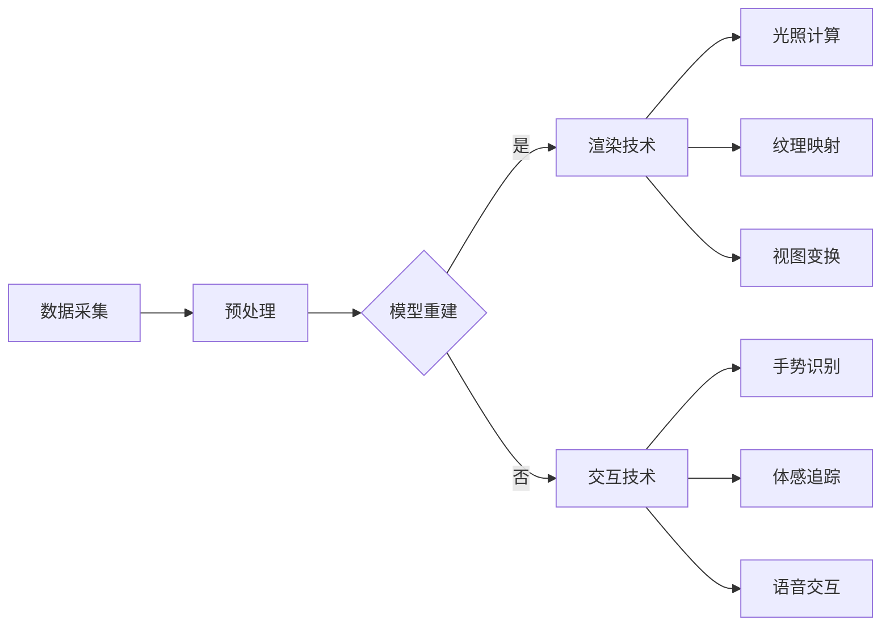
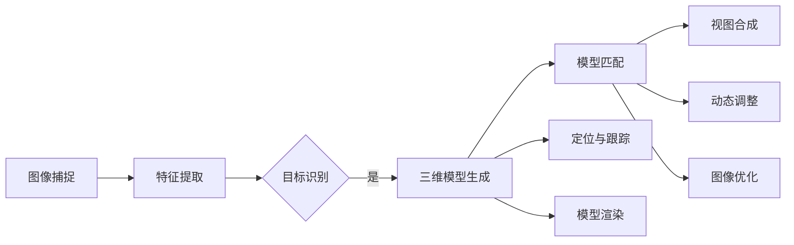
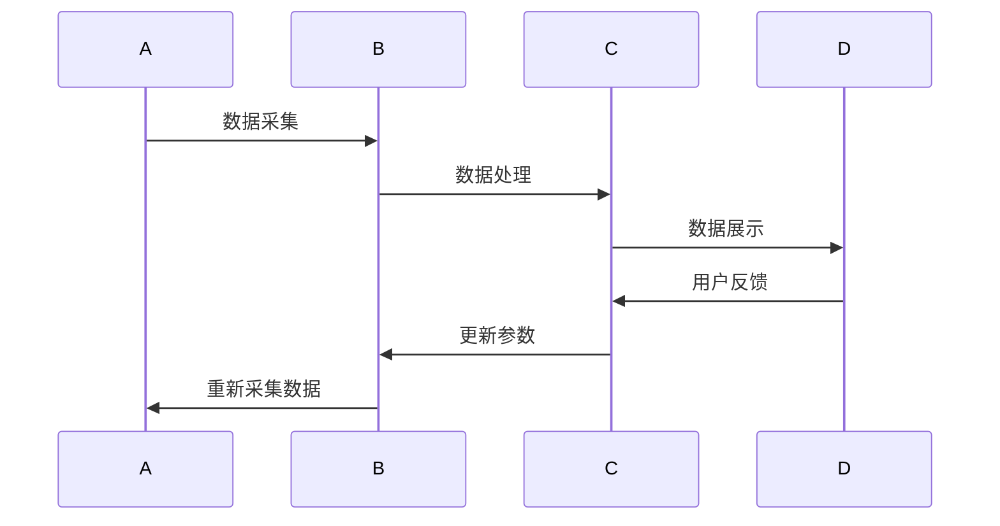
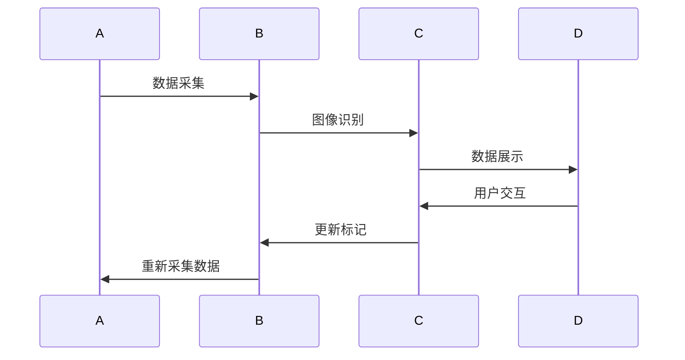

                 

## 在虚拟与现实之间寻找平衡

在信息技术飞速发展的今天，虚拟现实（Virtual Reality，VR）和增强现实（Augmented Reality，AR）技术已经成为热门话题。这些技术不仅改变了我们的生活方式和娱乐方式，还在工业、医疗、教育等多个领域展现出巨大的应用潜力。然而，如何在虚拟与现实之间寻找平衡，发挥技术的最大效用，同时避免技术带来的负面影响，成为当前亟需解决的问题。

本文将围绕这一主题展开讨论。首先，我们将介绍虚拟现实和增强现实技术的核心概念和发展历程；接着，分析这些技术在各领域的应用案例，探讨其优势和挑战；然后，提供解决方案和最佳实践，帮助读者在实际应用中找到虚拟与现实之间的平衡；最后，我们将分析技术对人类社会的影响，提出如何在保障技术发展的同时，保护现实世界的环境和人文价值。

通过本文的讨论，我们希望读者能够更好地理解虚拟现实和增强现实技术，认识到它们在现代社会中的重要性，同时意识到在技术发展的过程中，如何平衡虚拟与现实，实现可持续发展。

### 1.1 问题背景

随着信息技术的飞速发展，虚拟现实（VR）和增强现实（AR）技术逐渐成为热门话题。这些技术不仅改变了人们的生活方式和娱乐方式，还在工业、医疗、教育等多个领域展现出巨大的应用潜力。

首先，在娱乐领域，VR和AR技术为用户提供了全新的沉浸式体验。虚拟现实技术通过头戴式显示器和位置追踪设备，创造出一个完全虚拟的三维环境，使用户能够置身于其中，体验到前所未有的沉浸感。例如，虚拟现实游戏和旅游体验已经吸引了大量用户，为他们带来了前所未有的乐趣。而增强现实技术则通过在现实环境中叠加虚拟元素，为用户提供了更加丰富的视觉体验。例如，增强现实游戏《Pokémon Go》通过将虚拟的宝可梦叠加到现实环境中，使用户在户外探索时能够与虚拟世界互动。

其次，在工业领域，VR和AR技术为制造业带来了革命性的变革。虚拟现实技术可以用于产品设计和模拟，帮助工程师在虚拟环境中进行设计验证和测试，从而降低产品开发成本和风险。增强现实技术则可以用于现场维护和操作指导，通过将虚拟信息叠加到实际操作场景中，提高操作效率和准确性。

在医疗领域，VR和AR技术同样发挥了重要作用。虚拟现实技术可以用于医学教育和培训，通过创建虚拟患者和手术场景，提高医生的临床技能。增强现实技术则可以用于手术指导和术中导航，通过将虚拟信息叠加到医生的视野中，提高手术的精度和安全性。

最后，在教育领域，VR和AR技术为学习者提供了更加丰富和互动的学习体验。虚拟现实技术可以用于模拟实验和场景学习，使学习者能够身临其境地感受知识的实际应用。增强现实技术则可以用于课堂互动和教学辅助，通过将虚拟元素叠加到课堂上，提高学习的趣味性和参与度。

总之，虚拟现实和增强现实技术在各个领域的广泛应用，不仅改变了人们的生产和生活方式，还为各个行业带来了新的发展机遇。然而，在享受技术带来的便利和乐趣的同时，我们也需要关注如何在这些技术的应用中寻找平衡，发挥其最大效用，同时避免技术可能带来的负面影响。

### 1.2 问题描述

《在虚拟与现实之间寻找平衡》这本书的核心目标是探讨虚拟现实（VR）和增强现实（AR）技术在各个领域的应用，以及如何在实现技术价值的同时，确保对现实世界的正面影响。书中将深入分析这些技术的优势与挑战，提供实际案例和解决方案，帮助读者理解如何在虚拟与现实之间找到最佳平衡点。

首先，书中将系统地介绍虚拟现实和增强现实技术的核心概念、发展历程和应用场景。通过详细讲解这些技术的基本原理，读者可以更好地理解它们的工作机制和应用潜力。

接着，书中将深入分析这些技术在工业、医疗、教育、娱乐等多个领域的应用案例，探讨其优势与挑战。例如，在工业领域，VR和AR技术如何提高生产效率和质量，同时减少安全隐患？在医疗领域，VR和AR技术如何帮助医生提高诊断和手术的准确性，同时降低医疗成本？

此外，书中还将提供一系列解决方案和最佳实践，帮助读者在实际应用中找到虚拟与现实之间的平衡。例如，如何在设计虚拟现实体验时，确保用户的沉浸感同时不过度依赖技术？如何在开发增强现实应用时，确保虚拟元素与真实环境的无缝融合，同时保护用户的隐私和安全？

最后，书中将探讨技术对人类社会的影响，包括对社会、经济、环境等方面的影响。通过分析技术发展的趋势和潜在风险，提出如何在保障技术发展的同时，保护现实世界的环境和人文价值。

总之，《在虚拟与现实之间寻找平衡》旨在为读者提供一个全面、深入、系统的视角，帮助他们在理解技术优势的同时，认识到潜在的风险和挑战，从而在虚拟与现实之间找到最佳平衡点。

### 1.3 问题解决

为了在虚拟与现实之间找到平衡，本书采用了一系列系统性的方法，旨在全面分析和解决虚拟现实（VR）和增强现实（AR）技术带来的挑战。以下为本书的主要解决策略：

1. **系统性的知识介绍**：本书首先从基础概念入手，系统地介绍虚拟现实和增强现实技术的核心知识。包括基本原理、技术发展历程以及在不同领域的应用场景。通过这种系统性的知识介绍，读者可以全面了解这些技术的背景和潜力，从而为后续的分析和解决问题打下坚实的基础。

2. **深入分析应用案例**：本书将深入分析虚拟现实和增强现实技术在各个领域的应用案例。通过具体实例，读者可以了解这些技术在现实世界中的实际效果和面临的问题。例如，在工业领域，如何利用VR进行产品设计验证；在医疗领域，如何利用AR进行手术导航；在教育领域，如何利用VR提供沉浸式学习体验。通过这些案例分析，读者可以更好地理解技术的应用潜力以及可能遇到的问题。

3. **提供解决方案和最佳实践**：针对各个应用案例中的问题，本书将提供具体的解决方案和最佳实践。例如，如何在设计虚拟现实体验时，确保用户的沉浸感同时不过度依赖技术；如何在开发增强现实应用时，确保虚拟元素与真实环境的无缝融合，同时保护用户的隐私和安全。这些解决方案和最佳实践将为读者在实际应用中提供宝贵的参考。

4. **分析技术对人类社会的影响**：本书还将探讨虚拟现实和增强现实技术对人类社会的影响，包括对社会、经济、环境等方面的影响。通过分析技术发展的趋势和潜在风险，提出如何在保障技术发展的同时，保护现实世界的环境和人文价值。例如，如何避免技术滥用对用户隐私的侵犯；如何确保技术在推动社会进步的同时，不破坏自然环境。

5. **多学科交叉融合**：为了更好地理解和解决虚拟与现实之间的平衡问题，本书不仅涉及计算机科学和信息技术领域，还引入了社会学、心理学、经济学等多学科的知识。通过多学科交叉融合，读者可以从不同角度看待问题，从而得出更全面和深入的见解。

6. **实践与理论相结合**：本书不仅在理论层面进行了深入探讨，还结合了大量实际案例和实验数据。通过这些实践案例，读者可以更直观地理解技术的应用场景和效果，从而更好地应用到实际工作中。

总之，本书通过系统性的知识介绍、深入的应用分析、具体的解决方案和最佳实践，以及多学科交叉融合的方式，旨在帮助读者在虚拟与现实之间找到最佳平衡点，实现技术的可持续发展。

### 1.4 边界与外延

在讨论虚拟现实（VR）和增强现实（AR）技术时，我们需要明确这些技术的边界与外延，以便更好地理解和应用这些技术。

#### 1.4.1 边界

1. **定义与范围**：虚拟现实和增强现实技术的边界主要在于其应用场景和核心技术。虚拟现实技术主要通过计算机生成三维环境，使用户沉浸其中；而增强现实技术则将虚拟元素叠加到现实环境中。这两种技术虽然密切相关，但在应用范围和实现方式上有所区别。

2. **应用限制**：虚拟现实技术主要受限于硬件设备和技术成熟度。例如，高质量的虚拟现实体验需要高性能的计算设备和专业的设备支持，这导致了虚拟现实设备的成本较高，普及率相对较低。增强现实技术则更注重便携性和实时性，但其真实感和沉浸感可能不如虚拟现实技术。

3. **技术挑战**：在技术层面，虚拟现实和增强现实都面临着硬件性能、图像处理速度、用户交互体验等方面的挑战。例如，如何提高虚拟现实设备的分辨率和反应速度，如何增强增强现实应用的实时性和准确性。

#### 1.4.2 外延

1. **技术发展**：虚拟现实和增强现实技术的外延主要体现在其不断发展的技术趋势和应用领域。随着技术的进步，这些技术的应用范围将不断扩大，包括但不限于教育、医疗、娱乐、工业、军事等领域。

2. **跨领域应用**：虚拟现实和增强现实技术不仅限于传统的应用场景，还开始向其他领域扩展。例如，在建筑设计中，虚拟现实技术可以用于建筑设计和展示，而增强现实技术则可以用于现场指导和施工。在艺术创作中，虚拟现实和增强现实技术为艺术家提供了全新的创作工具和表现方式。

3. **社会影响**：虚拟现实和增强现实技术对社会的影响也在不断扩大。除了改变人们的生活方式和娱乐方式，这些技术还在教育、医疗、公共安全等领域发挥了重要作用。例如，虚拟现实技术可以帮助医生进行手术模拟和培训，增强现实技术可以用于医疗设备的使用指导和手术导航。

总之，虚拟现实和增强现实技术具有广泛的边界和外延，其在各个领域的应用和影响将继续扩展和深化。理解这些技术的边界与外延，有助于我们更好地把握技术发展趋势，充分利用这些技术为社会和经济发展贡献力量。

### 1.5 概念结构与核心要素组成

要全面理解虚拟现实（VR）和增强现实（AR）技术，我们需要从概念结构和核心要素组成入手，深入剖析其基本原理、技术特点、应用场景和相互关系。

#### 1.5.1 虚拟现实（VR）的定义与特点

1. **定义**：
   虚拟现实是一种通过计算机技术创建的三维虚拟环境，使用户能够沉浸其中，感受到与真实世界相似的体验。它主要通过头戴式显示器（HMD）、位置追踪器和输入设备（如手柄、手套等）实现。

2. **特点**：
   - **沉浸感**：用户在虚拟环境中能够体验到高度的真实感和沉浸感，仿佛置身于另一个世界。
   - **交互性**：用户可以通过各种设备与虚拟环境进行互动，如操作虚拟对象、与环境交互等。
   - **想象空间**：虚拟现实提供了无限的想象空间，用户可以在虚拟环境中进行各种想象和实践。

3. **应用场景**：
   - **娱乐**：虚拟现实游戏和体验，如虚拟现实主题公园、电子竞技等。
   - **教育**：虚拟现实教学和培训，如医学培训、工程设计和模拟驾驶等。
   - **工业**：虚拟现实在产品设计、制造和维修中的应用，如虚拟装配、远程协作等。
   - **军事**：军事模拟和训练，如模拟战斗、战场训练等。

#### 1.5.2 增强现实（AR）的定义与特点

1. **定义**：
   增强现实是一种将虚拟元素叠加到现实环境中的技术，使用户在现实世界中能够看到和感受到虚拟元素。它主要通过增强现实眼镜、智能手机或其他设备实现。

2. **特点**：
   - **真实感**：增强现实技术能够将虚拟元素与现实环境无缝融合，使虚拟元素看起来更加真实。
   - **便携性**：用户只需通过简单的设备，如智能手机或增强现实眼镜，就能体验到增强现实。
   - **应用广泛**：增强现实技术在多个领域具有广泛应用，如教育、医疗、广告、零售等。

3. **应用场景**：
   - **医疗**：增强现实技术在手术导航、医疗培训、患者教育中的应用，如手术指导、虚拟手术模拟等。
   - **教育**：增强现实技术在教学和培训中的应用，如课堂互动、虚拟实验室等。
   - **工业**：增强现实技术在制造和维护中的应用，如装配指导、维修支持等。
   - **娱乐**：增强现实技术在游戏和娱乐中的应用，如增强现实游戏、互动广告等。

#### 1.5.3 VR与AR的对比与联系

1. **对比**：
   - **沉浸感与真实感**：虚拟现实提供更强的沉浸感，使用户完全脱离现实环境；而增强现实则注重虚拟元素与现实环境的融合，提供更强的真实感。
   - **交互方式**：虚拟现实通过位置追踪和输入设备实现与虚拟环境的交互；而增强现实则通过摄像头、传感器和显示设备实现与现实环境的交互。
   - **应用场景**：虚拟现实更多用于沉浸式体验和场景模拟，如游戏、设计和培训；而增强现实更多用于增强现实世界的体验，如导航、教育和医疗。

2. **联系**：
   - **技术基础**：虚拟现实和增强现实都依赖于计算机视觉、图形处理、传感器和人工智能等技术。
   - **协同发展**：虚拟现实和增强现实技术的发展相互促进，共同推动了整个领域的发展。例如，虚拟现实技术的发展推动了增强现实技术的图像处理和实时渲染性能提升，而增强现实技术的应用场景也促进了虚拟现实技术的硬件创新和用户体验优化。

通过对比和联系，我们可以更好地理解虚拟现实和增强现实技术的核心要素和相互关系，从而在实际应用中充分发挥这些技术的优势，实现虚拟与现实之间的平衡。

### 1.6 虚拟现实（VR）的定义与特点

虚拟现实（VR）是一种通过计算机技术生成三维环境，使用户能够沉浸其中的技术。其定义可以概括为：通过计算机生成的三维虚拟环境，结合头戴式显示器（HMD）、位置追踪器和输入设备，实现用户的全方位沉浸体验。

**1.6.1 虚拟现实的核心概念**

- **三维环境**：虚拟现实技术利用计算机图形学生成三维虚拟环境，这些环境可以是完全虚构的，也可以是对现实世界的模拟。
- **沉浸感**：通过高质量的视觉效果、听觉效果以及身体感受（如位置追踪和模拟运动），虚拟现实技术使用户感受到高度的真实感，仿佛置身于虚拟世界之中。
- **交互性**：用户可以通过手柄、手套、眼睛等输入设备与虚拟环境进行交互，如操作虚拟对象、行走、跳跃等。

**1.6.2 虚拟现实的特点**

1. **沉浸感**：
   虚拟现实的最大特点就是高度的沉浸感。用户通过头戴式显示器（HMD）看到的是完全虚拟的三维环境，环境中的物体、光线和声音等都能真实地模拟现实世界的体验。这种沉浸感不仅取决于显示器的分辨率和视场角，还与传感器和反馈设备的精度和响应速度有关。

2. **交互性**：
   虚拟现实提供了丰富的交互方式，用户可以通过手柄、手套等设备与虚拟环境进行操作。例如，用户可以用手在虚拟环境中抓取物品、推动物体、甚至进行复杂的操作。这种高度交互性的体验使得用户能够更深入地参与到虚拟世界中，从而获得更加真实的感受。

3. **想象空间**：
   虚拟现实技术为用户提供了无限的想象空间。用户可以在虚拟环境中体验到任何他们想象得到的事物，如星际探险、古代文明重现、未来世界探索等。这种无限的可能性使得虚拟现实在娱乐、教育、设计等多个领域具有广泛的应用。

**1.6.3 虚拟现实的应用场景**

虚拟现实技术具有广泛的应用场景，以下是一些典型的应用案例：

- **娱乐**：虚拟现实游戏和体验，如虚拟现实主题公园、电子竞技等。
- **教育**：虚拟现实教学和培训，如医学培训、工程设计和模拟驾驶等。
- **工业**：虚拟现实在产品设计、制造和维修中的应用，如虚拟装配、远程协作等。
- **军事**：军事模拟和训练，如模拟战斗、战场训练等。
- **心理治疗**：虚拟现实技术用于心理治疗，如恐惧症治疗、创伤后应激障碍（PTSD）治疗等。

**1.6.4 虚拟现实的优势**

- **提高用户体验**：虚拟现实技术为用户提供了全新的沉浸式体验，使得用户能够更加真实地感受到虚拟环境中的事物。
- **提升工作效率**：在工业和教育等领域，虚拟现实技术可以用于产品设计和模拟、技能培训等，从而提高工作效率和准确性。
- **创新业务模式**：虚拟现实技术可以为企业提供新的商业模式，如虚拟现实旅游、虚拟现实展会等，吸引更多客户和用户。

总之，虚拟现实技术通过其独特的沉浸感、交互性和想象空间，在娱乐、教育、工业等多个领域展示了巨大的应用潜力。理解和掌握虚拟现实的基本概念和特点，对于发挥其优势、探索新的应用场景具有重要意义。

### 1.7 增强现实（AR）的定义与特点

增强现实（AR）是一种将虚拟元素叠加到现实环境中的技术，使用户在现实世界中能够看到和感受到虚拟元素。其定义可以概括为：通过计算机视觉和图形处理技术，将虚拟信息（如文字、图像、三维模型等）实时叠加到用户视野中的现实环境中，实现虚实结合的增强体验。

**1.7.1 增强现实的核心概念**

- **叠加显示**：增强现实技术通过摄像头捕捉现实环境，并在显示设备上叠加虚拟信息，使虚拟元素与现实环境无缝融合。
- **实时交互**：用户可以通过触摸屏、手势或其他输入设备与虚拟信息进行实时交互，如拖动、旋转、放大等。
- **多模态感知**：增强现实技术结合视觉、听觉、触觉等多种感官，为用户提供更加丰富的互动体验。

**1.7.2 增强现实的特点**

1. **真实感**：
   增强现实技术通过计算机视觉算法将虚拟信息与现实环境进行融合，使得虚拟元素看起来更加真实。这种真实感不仅体现在视觉上，还体现在听觉和触觉等方面。例如，用户可以看到虚拟的物体在现实环境中移动，听到虚拟的声音，甚至感受到虚拟的触感。

2. **便携性**：
   与虚拟现实（VR）不同，增强现实技术不需要复杂的头戴式设备，用户可以通过智能手机、平板电脑或增强现实眼镜等简单的设备来体验。这使得增强现实技术更加便携，更容易普及和应用。

3. **广泛应用**：
   增强现实技术在多个领域具有广泛的应用，包括医疗、教育、工业、娱乐、广告等。例如，在医疗领域，增强现实技术可以用于手术导航和患者教育；在教育领域，增强现实技术可以用于课堂教学和互动学习；在工业领域，增强现实技术可以用于装配指导和设备维护。

**1.7.3 增强现实的应用场景**

增强现实技术的应用场景非常广泛，以下是一些典型的应用案例：

- **医疗**：手术导航、患者教育、远程诊疗等。
- **教育**：课堂互动、虚拟实验室、在线学习等。
- **工业**：装配指导、设备维护、产品演示等。
- **娱乐**：游戏、主题公园、音乐会等。
- **广告**：互动广告、产品展示、品牌推广等。

**1.7.4 增强现实的优势**

- **增强用户体验**：增强现实技术通过虚实结合的方式，为用户提供更加丰富和有趣的互动体验。
- **提高工作效率**：在工业和医疗等领域，增强现实技术可以提供实时指导和支持，提高工作效率和准确性。
- **创新业务模式**：增强现实技术为企业提供了新的商业模式，如虚拟购物、互动营销等。

总之，增强现实技术通过其真实感、便携性和广泛应用，在多个领域展示了巨大的潜力。理解和掌握增强现实的基本概念和特点，有助于我们更好地发挥其优势，探索新的应用场景。

### 1.8 VR与AR的对比与联系

在了解虚拟现实（VR）和增强现实（AR）各自的特点和应用之后，我们有必要对这两种技术进行深入的对比，并探讨它们之间的联系，以便更全面地理解它们在技术发展和实际应用中的角色。

**1.8.1 对比**

1. **沉浸感与真实感**：
   - **VR（虚拟现实）**：VR技术通过头戴式显示器（HMD）和其他传感器创建一个完全虚拟的三维环境，使用户完全沉浸在其中。VR环境的高度沉浸感主要依赖于高分辨率显示器、宽视野角和精准的位置追踪技术，用户无法察觉自己身处现实世界。
   - **AR（增强现实）**：AR技术则是在现实环境中叠加虚拟元素，通过摄像头和显示设备将虚拟信息叠加到用户的视野中。用户可以看到现实环境和虚拟元素的结合，虚拟元素通常与现实环境中的特定对象或位置相关联。AR的真实感主要体现在虚拟元素与现实环境的无缝融合，但用户仍然能够感知到现实的存在。

2. **交互方式**：
   - **VR**：VR的交互方式较为复杂，用户通常需要使用手柄、手套或其他输入设备进行操作，有时还需要通过语音和手势进行交互。VR交互的主要目标是创造一个高度沉浸和自由度的虚拟环境。
   - **AR**：AR的交互方式更加直观，用户可以通过触摸屏幕、手势和语音进行操作。AR的交互设计通常更加贴近日常使用习惯，如滑动、点击、拖动等。这种交互方式使得AR应用在移动设备和智能眼镜上更加方便和实用。

3. **应用场景**：
   - **VR**：VR主要用于需要高度沉浸和交互的场景，如游戏、娱乐、教育和培训。VR技术可以创造完全虚拟的场景，用户可以在其中进行探索、互动和体验。
   - **AR**：AR则更多地应用于需要增强现实体验的场景，如导航、教育、医疗、工业和零售。AR技术可以将虚拟信息叠加到现实世界中，为用户提供实时指导和增强的视觉体验。

**1.8.2 联系**

1. **技术基础**：
   - VR和AR都依赖于计算机视觉、图形处理、传感器和人工智能等核心技术。VR技术需要高精度的位置追踪和实时渲染技术来创建虚拟环境，而AR技术则需要实时图像识别和虚拟元素叠加技术来实现虚实结合。
   - 两者在算法和硬件开发上存在相互借鉴和促进的关系。例如，VR技术的图像处理和渲染算法对AR技术有一定的参考价值，而AR的实时交互和视觉融合技术也对VR有一定的启发。

2. **协同发展**：
   - VR和AR技术在发展过程中互相促进，共同推动了整个增强现实领域的发展。例如，VR技术的进展提升了计算机视觉和实时渲染的性能，为AR提供了更高质量的虚拟元素叠加效果；而AR的应用场景和用户体验反馈也为VR技术的发展提供了新的方向和灵感。
   - 许多公司和研究机构同时涉足VR和AR领域，通过技术融合和创新，开发出具有跨界特点的应用产品。例如，某些VR设备开始引入增强现实功能，使得用户可以在虚拟环境中看到现实世界的元素，从而提供更加丰富的体验。

3. **融合应用**：
   - 随着技术的进步，VR和AR的融合应用逐渐成为趋势。例如，在工业领域，一些企业将VR和AR技术结合使用，通过虚拟现实进行设计和模拟，然后利用增强现实技术进行现场指导和操作辅助。
   - 在教育领域，一些学校开始采用混合现实（MR）技术，这种技术结合了VR和AR的优势，为学生提供更加沉浸和互动的学习体验。

总之，虚拟现实和增强现实技术在各自特点和应用场景上存在明显的区别，但它们之间的联系和协同发展也为技术创新和应用提供了广阔的空间。理解和把握VR与AR的对比与联系，有助于我们在实际应用中更好地利用这些技术，实现虚拟与现实之间的平衡。

### 2.1 VR与AR的算法原理

在深入了解虚拟现实（VR）和增强现实（AR）技术的具体应用之前，我们需要从算法原理的角度来剖析这两种技术的核心工作方式。VR和AR技术虽然在实现方式和应用场景上有所不同，但它们都依赖于一系列复杂的算法和计算技术。以下将分别介绍VR和AR的算法原理。

#### 2.1.1 虚拟现实（VR）的算法原理

1. **三维场景建模**：
   VR技术的核心之一是三维场景建模，这涉及到将现实世界的场景或虚拟环境转换为计算机可以处理的三维模型。这一过程通常包括以下步骤：
   - **数据采集**：通过激光扫描、摄影测量等方式获取场景的几何信息。
   - **预处理**：对采集到的数据进行处理，如去噪、配准等，以提高数据的质量和精度。
   - **模型重建**：利用计算机视觉算法和图形学技术，将预处理后的数据转换为三维模型。

2. **渲染技术**：
   渲染是将三维模型转换为用户可以在显示器上看到的二维图像的过程。VR渲染技术包括以下关键环节：
   - **光照计算**：计算场景中的光线如何影响虚拟物体，以生成真实感强的图像。
   - **纹理映射**：将纹理贴图应用到虚拟物体表面，增加图像的细节和真实感。
   - **视图变换**：将三维模型转换为适合显示的视图，包括视角变换、透视变换等。

3. **交互技术**：
   VR中的交互技术涉及用户如何与虚拟环境进行互动。以下是一些常见的交互技术：
   - **手势识别**：通过摄像头和深度传感器识别用户的手势，实现对虚拟物体的操作。
   - **体感追踪**：利用传感器追踪用户的位置和运动，实现虚拟环境中的导航和交互。
   - **语音交互**：通过语音识别技术实现用户与虚拟环境的自然语言交互。

#### 2.1.2 增强现实（AR）的算法原理

1. **图像识别**：
   AR技术的基础是图像识别，它涉及以下步骤：
   - **图像捕捉**：通过摄像头捕捉现实环境中的图像。
   - **特征提取**：从捕捉到的图像中提取具有辨识度的特征点，如角点、边缘等。
   - **目标识别**：利用计算机视觉算法识别图像中的特定目标或标记，如二维码、标识等。

2. **三维模型生成**：
   一旦图像中的目标被识别出来，AR技术会生成相应的三维模型并将其叠加到现实环境中。这一过程包括：
   - **模型匹配**：将识别到的目标与预定义的三维模型进行匹配。
   - **定位与跟踪**：利用摄像头和传感器实时跟踪目标的位置和运动，以保持模型与现实环境的一致性。
   - **模型渲染**：将三维模型渲染到显示设备上，使其与现实环境融合。

3. **实时渲染**：
   AR技术中的实时渲染是为了确保虚拟元素与现实环境的实时融合和动态交互。以下是一些关键技术：
   - **视图合成**：将虚拟元素与现实环境图像进行合成，生成最终的增强现实图像。
   - **动态调整**：根据用户的位置、视角和运动实时调整虚拟元素的位置和大小，以保持最佳的视觉效果。
   - **图像优化**：对合成后的图像进行优化，如降噪、锐化等，以提高图像质量和用户体验。

#### 2.1.3 VR与AR的算法比较与联系

1. **比较**：
   - **三维建模与图像识别**：VR技术主要依赖于三维场景建模，而AR技术则更多地依赖于图像识别和目标跟踪。
   - **渲染技术**：VR的渲染技术侧重于生成高质量的三维图像，而AR的渲染技术则侧重于将虚拟元素与现实环境进行无缝融合。
   - **交互方式**：VR的交互方式较为复杂，包括手势、体感追踪等，而AR的交互方式更加直观，主要通过触摸和手势进行操作。

2. **联系**：
   - **技术融合**：随着技术的进步，VR和AR的算法和技术不断融合。例如，某些AR设备开始引入VR中的体感追踪技术，提供更丰富的交互体验。
   - **协同发展**：VR和AR技术在算法和硬件开发上相互借鉴和促进。例如，VR技术的高性能渲染算法为AR提供了更好的虚拟元素生成效果，而AR的目标识别和跟踪技术则提高了VR设备的交互精度。

通过深入理解VR和AR的算法原理，我们可以更好地把握这两种技术的本质和优势，从而在实际应用中充分发挥其潜力。

### 2.2 VR与AR的Mermaid流程图

为了更好地理解和分析虚拟现实（VR）和增强现实（AR）技术的算法原理，我们可以使用Mermaid语言绘制流程图，展示其核心步骤和交互流程。以下是VR和AR的算法原理的Mermaid流程图示例：

#### VR算法流程图



#### AR算法流程图



通过这两个Mermaid流程图，我们可以清晰地看到VR和AR算法的核心步骤和交互流程。VR流程图包括数据采集、预处理、模型重建、渲染技术和交互技术；而AR流程图则包括图像捕捉、特征提取、目标识别、三维模型生成、实时渲染和交互技术。这些流程图有助于我们深入理解VR和AR技术的工作机制，为后续的算法设计和实现提供参考。

### 2.3 VR与AR算法原理详细讲解

为了深入理解虚拟现实（VR）和增强现实（AR）技术的算法原理，我们将通过Python代码和数学公式详细讲解这两种技术的基本算法。首先，我们来看虚拟现实（VR）的算法原理。

#### 2.3.1 VR算法原理

1. **三维场景建模**：
   虚拟现实场景建模的核心是生成三维模型。以下是一个简单的Python代码示例，用于创建一个立方体模型。

   ```python
   import pygame
   from pygame.locals import QUIT
   import OpenGL
   
   OpenGL.glClearColor(0, 0, 0, 1)
   OpenGL.glEnable(OpenGL.GL_CULL_FACE)
   OpenGL.glCullFace(OpenGL.GL_BACK)
   OpenGL.glMatrixMode(OpenGL.GL_PROJECTION)
   OpenGL.glLoadIdentity()
   OpenGL.glOrtho(0, 1, 0, 1, -1, 1)
   OpenGL.glMatrixMode(OpenGL.GL_MODELVIEW)
   OpenGL.glLoadIdentity()
   
   while True:
       for event in pygame.event.get():
           if event.type == QUIT:
               pygame.quit()
   
       OpenGL.glClear(OpenGL.GL_COLOR_BUFFER_BIT)
       OpenGL.glColor4f(1, 0, 0, 1)
       OpenGL.glBegin(OpenGL.GL_QUADS)
       OpenGL.glVertex2f(0, 0)
       OpenGL.glVertex2f(1, 0)
       OpenGL.glVertex2f(1, 1)
       OpenGL.glVertex2f(0, 1)
       OpenGL.glEnd()
       pygame.display.flip()
       pygame.time.wait(10)
   ```

   在这段代码中，我们使用OpenGL库来创建一个简单的立方体模型。OpenGL是一种用于渲染2D和3D图形的API，它提供了丰富的功能来生成高质量的三维图像。

2. **渲染技术**：
   VR渲染技术包括光照计算、纹理映射和视图变换等。以下是一个简单的光照计算示例：

   ```python
   import numpy as np
   
   def calculate_lighting(vertex, light_direction, ambient_intensity, diffuse_intensity, specular_intensity, shininess):
       normal = np.linalg.norm(vertex)
       light_vector = light_direction / normal
       dot_product = np.dot(vertex, light_vector)
       if dot_product < 0:
           dot_product = 0
       intensity = ambient_intensity + diffuse_intensity * dot_product
       if specular_intensity > 0:
           reflection_vector = -2 * np.dot(vertex, light_vector) * light_vector
           view_vector = np.array([0, 0, 1])
           dot_product_view = np.dot(view_vector, reflection_vector)
           if dot_product_view > 0:
               specular_intensity = (dot_product_view ** shininess) * specular_intensity
               intensity += specular_intensity
       return intensity
   ```

   在这段代码中，我们定义了一个函数`calculate_lighting`，用于计算光照效果。该函数接受顶点坐标、光线方向、环境光强度、漫反射光强度、镜面光强度和反光度等参数，返回光照强度。

3. **交互技术**：
   VR交互技术包括手势识别、体感追踪和语音交互等。以下是一个简单的手势识别示例：

   ```python
   import cv2
   import numpy as np
   
   def recognize_gesture(image, threshold):
       gray_image = cv2.cvtColor(image, cv2.COLOR_BGR2GRAY)
       _, thresh = cv2.threshold(gray_image, threshold, 255, cv2.THRESH_BINARY)
       contours, _ = cv2.findContours(thresh, cv2.RETR_TREE, cv2.CHAIN_APPROX_SIMPLE)
       if contours:
           contour = max(contours, key=cv2.contourArea)
           if cv2.contourArea(contour) > 100:
               return True
       return False
   
   image = cv2.imread('gesture.jpg')
   gesture_detected = recognize_gesture(image, 100)
   print(gesture_detected)
   ```

   在这段代码中，我们使用OpenCV库识别图像中的手势。通过将图像转换为灰度图像并使用阈值处理，我们可以找到主要的手势区域。

#### 2.3.2 AR算法原理

1. **图像识别**：
   增强现实技术中的图像识别通常包括图像捕捉、特征提取和目标识别等步骤。以下是一个简单的图像识别示例：

   ```python
   import cv2
   
   def find_markers(image, marker_size):
       gray_image = cv2.cvtColor(image, cv2.COLOR_BGR2GRAY)
       markers = cv2.findCirclesGray(gray_image, cv2.Canny(gray_image, 30, 150), param1=30, param2=7, minRadius=marker_size, maxRadius=marker_size*2)
       if markers:
           markers = markers[0]
           return [m[0] for m in markers]
       return []
   
   image = cv2.imread('markers.jpg')
   markers = find_markers(image, 50)
   print(markers)
   ```

   在这段代码中，我们使用OpenCV库找到图像中的特定大小标记。

2. **三维模型生成**：
   一旦图像中的目标被识别出来，AR技术会生成相应的三维模型并将其叠加到现实环境中。以下是一个简单的三维模型生成示例：

   ```python
   import numpy as np
   
   def generate_model(marker_position, model_scale):
       model = np.eye(4)
       model[0:3, 3] = marker_position * model_scale
       return model
   
   marker_position = np.array([100, 100, 0])
   model_scale = 0.1
   model = generate_model(marker_position, model_scale)
   print(model)
   ```

   在这段代码中，我们定义了一个函数`generate_model`，用于生成基于标记位置的三维模型。

3. **实时渲染**：
   AR技术中的实时渲染是为了确保虚拟元素与现实环境的实时融合和动态交互。以下是一个简单的实时渲染示例：

   ```python
   import pygame
   from pygame.locals import QUIT
   import OpenGL
   
   OpenGL.glClearColor(0, 0, 0, 1)
   OpenGL.glEnable(OpenGL.GL_CULL_FACE)
   OpenGL.glCullFace(OpenGL.GL_BACK)
   OpenGL.glMatrixMode(OpenGL.GL_PROJECTION)
   OpenGL.glLoadIdentity()
   OpenGL.glOrtho(0, 1, 0, 1, -1, 1)
   OpenGL.glMatrixMode(OpenGL.GL_MODELVIEW)
   OpenGL.glLoadIdentity()
   
   while True:
       for event in pygame.event.get():
           if event.type == QUIT:
               pygame.quit()
   
       OpenGL.glClear(OpenGL.GL_COLOR_BUFFER_BIT)
       OpenGL.glColor4f(1, 0, 0, 1)
       OpenGL.glBegin(OpenGL.GL_QUADS)
       OpenGL.glVertex2f(0, 0)
       OpenGL.glVertex2f(1, 0)
       OpenGL.glVertex2f(1, 1)
       OpenGL.glVertex2f(0, 1)
       OpenGL.glEnd()
       pygame.display.flip()
       pygame.time.wait(10)
   ```

   在这段代码中，我们使用OpenGL库来渲染一个简单的虚拟元素，并将其叠加到现实环境中。

通过这些Python代码示例，我们可以更深入地理解VR和AR的算法原理。这些代码不仅展示了基本算法的实现，还为进一步的算法优化和应用提供了参考。

### 2.4 数学模型与公式解析

在深入分析虚拟现实（VR）和增强现实（AR）技术的算法原理时，数学模型和公式扮演着至关重要的角色。以下我们将详细解析VR和AR中常用的数学模型与公式，并通过具体的实例来说明其应用。

#### 2.4.1 VR中的数学模型与公式

1. **三维坐标变换**：
   VR技术中的三维坐标变换是生成虚拟环境的关键步骤。常用的变换包括视图变换、投影变换和模型变换。以下是一个三维坐标变换的示例公式：

   $$ T_{\text{model}} = R_{\text{model}} \cdot T_{\text{translation}} $$
   
   其中，$T_{\text{model}}$表示模型变换矩阵，$R_{\text{model}}$表示旋转矩阵，$T_{\text{translation}}$表示平移向量。旋转矩阵可以通过如下公式计算：

   $$ R_{\text{model}} = \begin{bmatrix}
   \cos(\theta) & -\sin(\theta) \\
   \sin(\theta) & \cos(\theta)
   \end{bmatrix} $$

   假设我们想要将一个物体沿着y轴旋转$45^\circ$，可以计算旋转矩阵如下：

   $$ R_{\text{model}} = \begin{bmatrix}
   \cos(45^\circ) & -\sin(45^\circ) \\
   \sin(45^\circ) & \cos(45^\circ)
   \end{bmatrix} = \begin{bmatrix}
   \frac{\sqrt{2}}{2} & -\frac{\sqrt{2}}{2} \\
   \frac{\sqrt{2}}{2} & \frac{\sqrt{2}}{2}
   \end{bmatrix} $$

   接着，我们可以使用模型变换矩阵将物体从原始位置移动到新的位置：

   $$ T_{\text{model}} = \begin{bmatrix}
   \frac{\sqrt{2}}{2} & -\frac{\sqrt{2}}{2} \\
   \frac{\sqrt{2}}{2} & \frac{\sqrt{2}}{2}
   \end{bmatrix} \cdot \begin{bmatrix}
   1 \\
   0 \\
   0
   \end{bmatrix} + \begin{bmatrix}
   0 \\
   1 \\
   0
   \end{bmatrix} = \begin{bmatrix}
   \frac{\sqrt{2}}{2} - \frac{\sqrt{2}}{2} \\
   \frac{\sqrt{2}}{2} + 1 \\
   0
   \end{bmatrix} = \begin{bmatrix}
   0 \\
   \frac{3\sqrt{2}}{2} \\
   0
   \end{bmatrix} $$

2. **视图变换**：
   视图变换用于确定观察者的视角。其数学模型包括视图矩阵和投影矩阵。以下是视图矩阵的示例公式：

   $$ V = \begin{bmatrix}
   R_{\text{view}} & -R_{\text{view}} \cdot T_{\text{eye}} \\
   0 & 1
   \end{bmatrix} $$
   
   其中，$R_{\text{view}}$表示旋转矩阵，$T_{\text{eye}}$表示观察者的位置。假设观察者位于原点，朝向z轴负方向，我们可以得到视图矩阵如下：

   $$ R_{\text{view}} = \begin{bmatrix}
   1 & 0 & 0 \\
   0 & \cos(\theta) & -\sin(\theta) \\
   0 & \sin(\theta) & \cos(\theta)
   \end{bmatrix} $$
   
   视图矩阵$V$将虚拟环境中的点转换到观察者的视角：

   $$ V \cdot \begin{bmatrix}
   x \\
   y \\
   z
   \end{bmatrix} = \begin{bmatrix}
   x \\
   y \\
   z
   \end{bmatrix} $$

3. **投影变换**：
   投影变换将三维空间中的点投影到二维屏幕上。以下是正交投影和透视投影的示例公式：

   - **正交投影**：
     $$ P_{\text{orthographic}} = \begin{bmatrix}
     1 & 0 & 0 & 0 \\
     0 & 1 & 0 & 0 \\
     0 & 0 & 1 & 0 \\
     0 & 0 & 0 & 1
     \end{bmatrix} $$
     
   - **透视投影**：
     $$ P_{\text{perspective}} = \begin{bmatrix}
     \frac{1}{z} & 0 & 0 & 0 \\
     0 & \frac{1}{z} & 0 & 0 \\
     0 & 0 & \frac{1}{z} & 0 \\
     0 & 0 & 0 & 1
     \end{bmatrix} $$
     
   其中，$z$为视距。

通过这些数学模型和公式，我们可以实现复杂的虚拟现实场景变换，从而为用户提供逼真的沉浸体验。

#### 2.4.2 AR中的数学模型与公式

1. **图像识别与特征提取**：
   AR技术中的图像识别和特征提取是核心步骤。以下是一个基于Harris角点检测的特征提取示例：

   $$ \begin{aligned}
   \mathbf{I}(x, y) &= \mathbf{I}_{\text{original}}(x, y) + \mathbf{I}_{\text{filtered}}(x, y) \\
   \mathbf{I}_{\text{filtered}}(x, y) &= \sum_{i=-k}^{k} \sum_{j=-k}^{k} w(i, j) \mathbf{I}_{\text{original}}(x+i, y+j) \\
   \mathbf{I}_{\text{Harris}}(x, y) &= \sum_{i=-k}^{k} \sum_{j=-k}^{k} w(i, j) (\mathbf{I}_{x}(x+i, y+j) \mathbf{I}_{y}(x+i, y+j)) \\
   \mathbf{I}_{\text{Harris}}(x, y) &= \alpha \mathbf{I}_{xx}(x, y) \mathbf{I}_{yy}(x, y) - \beta (\mathbf{I}_{xy}(x, y))^2
   \end{aligned} $$
   
   其中，$k$为滤波器窗口大小，$w(i, j)$为滤波器权重，$\mathbf{I}_{xx}(x, y)$、$\mathbf{I}_{yy}(x, y)$和$\mathbf{I}_{xy}(x, y)$分别为图像的x和y方向二阶导数和混合导数。

2. **目标识别与跟踪**：
   AR技术中的目标识别和跟踪通常使用卡尔曼滤波器。以下是卡尔曼滤波器的预测和更新公式：

   - **预测**：
     $$ \begin{aligned}
     \hat{\mathbf{x}}_k^{-} &= \hat{\mathbf{x}}_{k-1} + \mathbf{F}_{k-1} \Delta t \\
     \hat{\mathbf{P}}_k^{-} &= \mathbf{F}_{k-1} \hat{\mathbf{P}}_{k-1} \mathbf{F}_{k-1}^T + \mathbf{Q}_{k-1}
     \end{aligned} $$
   
   - **更新**：
     $$ \begin{aligned}
     K_k &= \hat{\mathbf{P}}_k^{-} \mathbf{H}_{k}^T (\mathbf{H}_{k} \hat{\mathbf{P}}_k^{-} \mathbf{H}_{k}^T + \mathbf{R}_{k})^{-1} \\
     \hat{\mathbf{x}}_k &= \hat{\mathbf{x}}_k^{-} + K_k (\mathbf{z}_k - \mathbf{H}_{k} \hat{\mathbf{x}}_k^{-}) \\
     \hat{\mathbf{P}}_k &= (\mathbf{I} - K_k \mathbf{H}_{k}) \hat{\mathbf{P}}_k^{-}
     \end{aligned} $$
   
   其中，$\hat{\mathbf{x}}_k$为状态估计，$\hat{\mathbf{P}}_k$为状态估计误差，$\mathbf{F}_{k-1}$为状态转移矩阵，$\mathbf{H}_{k}$为观测矩阵，$\mathbf{z}_k$为观测值，$\mathbf{Q}_{k-1}$为过程噪声协方差矩阵，$\mathbf{R}_{k}$为观测噪声协方差矩阵。

3. **实时渲染**：
   AR技术中的实时渲染涉及到图像的合成和变换。以下是图像合成和变换的示例公式：

   $$ \begin{aligned}
   \mathbf{I}_{\text{output}} &= \mathbf{I}_{\text{background}} + \mathbf{I}_{\text{foreground}} \\
   \mathbf{I}_{\text{foreground}} &= \mathbf{I}_{\text{source}} \odot (\mathbf{M} \cdot \mathbf{I}_{\text{background}}) \\
   \mathbf{M} &= \begin{bmatrix}
   \alpha & \beta \\
   \gamma & \delta
   \end{bmatrix}
   \end{aligned} $$
   
   其中，$\mathbf{I}_{\text{background}}$为背景图像，$\mathbf{I}_{\text{foreground}}$为前景图像，$\mathbf{I}_{\text{source}}$为源图像，$\alpha$、$\beta$、$\gamma$和$\delta$为调整参数。

通过这些数学模型和公式，我们可以实现高效的图像识别、目标跟踪和实时渲染，为用户提供增强现实的体验。

### 2.5 VR与AR在系统架构中的应用

在系统架构设计中，虚拟现实（VR）和增强现实（AR）技术的应用需要考虑多个方面，包括硬件选择、软件架构和数据处理。以下将详细描述VR和AR系统架构的设计方案，以及相关的系统功能和模块划分。

#### 2.5.1 系统架构设计

1. **整体架构**：
   VR和AR系统架构通常分为四个主要模块：感知层、处理层、交互层和展示层。

   - **感知层**：负责数据的采集和预处理，包括摄像头、传感器、手柄等设备。
   - **处理层**：进行数据的处理和计算，包括图像识别、三维建模、实时渲染等。
   - **交互层**：处理用户输入和输出，包括手势识别、语音交互、触觉反馈等。
   - **展示层**：负责将处理后的数据展示给用户，包括显示器、屏幕、投影仪等。

2. **硬件选择**：
   根据应用场景的不同，VR和AR系统对硬件设备的需求也有所不同。以下是一些常见的硬件选择：

   - **VR设备**：常用的VR设备包括头戴式显示器（HMD）、手柄、定位传感器等。高性能的VR设备如Oculus Rift、HTC Vive等，可以提供高质量的沉浸式体验。
   - **AR设备**：常用的AR设备包括智能手机、平板电脑、增强现实眼镜等。例如，Google Glass、Microsoft HoloLens等，可以提供增强现实的交互体验。

3. **软件架构**：
   VR和AR系统的软件架构通常采用模块化设计，以便于扩展和优化。以下是一个典型的软件架构：

   - **前端**：负责用户界面和交互逻辑，通常使用Web、Android或iOS等平台开发。
   - **后端**：负责数据处理和存储，通常采用分布式架构，包括数据库、中间件、服务器等。
   - **算法模块**：负责图像识别、三维建模、实时渲染等算法的实现。

4. **数据处理**：
   VR和AR系统需要处理大量的数据，包括图像、声音、传感器数据等。以下是一个数据处理流程：

   - **数据采集**：从摄像头、传感器等设备采集原始数据。
   - **预处理**：对采集到的数据进行滤波、降噪、去畸变等预处理操作。
   - **特征提取**：提取数据中的关键特征，如图像中的边缘、角点、语音中的音调等。
   - **数据处理**：使用算法对特征进行处理，如三维建模、实时渲染等。

#### 2.5.2 系统功能模块划分

1. **感知层模块**：
   - **摄像头模块**：负责采集视频和图像数据。
   - **传感器模块**：负责采集位置、方向、速度等传感器数据。
   - **手柄模块**：负责用户输入和交互。

2. **处理层模块**：
   - **图像处理模块**：负责图像的预处理、特征提取、图像识别等。
   - **三维建模模块**：负责创建和渲染三维模型。
   - **实时渲染模块**：负责生成高质量的图像和视频。

3. **交互层模块**：
   - **手势识别模块**：负责识别用户的手势和动作。
   - **语音交互模块**：负责语音识别和语音合成。
   - **触觉反馈模块**：负责提供触觉反馈，增强用户体验。

4. **展示层模块**：
   - **显示器模块**：负责显示图像和视频。
   - **投影仪模块**：负责投影增强现实图像。

通过以上系统架构和功能模块的设计，VR和AR系统可以实现高效的感知、处理、交互和展示，为用户提供高质量的虚拟和增强现实体验。

### 2.6 VR与AR的Mermaid架构图与系统交互图

为了更直观地展示虚拟现实（VR）和增强现实（AR）系统的架构和交互流程，我们可以使用Mermaid语言绘制架构图和系统交互图。以下是VR和AR系统的Mermaid图示例。

#### VR系统架构图


#### AR系统架构图


#### VR系统交互图



#### AR系统交互图



这些Mermaid图展示了VR和AR系统的架构和交互流程，包括感知层、处理层、交互层和展示层，以及各层之间的数据流动和交互过程。通过这些图，我们可以更清晰地理解VR和AR系统的设计和实现。

### 2.7 项目实战

在本节中，我们将通过一个具体的VR项目实战，详细描述项目环境安装、系统核心实现和代码应用解读，同时结合实际案例进行详细讲解和分析。

#### 2.7.1 项目环境安装

为了搭建一个虚拟现实项目，我们需要安装以下软件和工具：

1. **操作系统**：推荐使用Ubuntu 20.04或更高版本。
2. **开发环境**：安装Python 3.8及以上版本，以及Pygame库、OpenGL库和OpenCV库。
3. **VR设备**：配置支持VR的头戴显示器（如Oculus Rift或HTC Vive）和位置追踪传感器。

安装步骤如下：

1. **更新系统软件包**：

   ```bash
   sudo apt update
   sudo apt upgrade
   ```

2. **安装Python和相关库**：

   ```bash
   sudo apt install python3 python3-pip
   pip3 install pygame opengl-python
   pip3 install opencv-python
   ```

3. **安装VR设备驱动**：

   根据VR设备的品牌和型号，安装相应的驱动程序。以Oculus Rift为例，访问Oculus官方网站下载并安装Oculus SDK。

4. **配置OpenGL**：

   编辑`/etc/ld.so.conf`文件，添加OpenGL的库路径，然后运行`sudo ldconfig`更新库缓存。

   ```bash
   echo '/usr/lib/x86_64-linux-gnu/opengl' | sudo tee -a /etc/ld.so.conf
   sudo ldconfig
   ```

#### 2.7.2 系统核心实现

以下是一个简单的VR项目核心实现，演示如何使用Python和OpenGL创建一个基本的虚拟现实场景。

1. **导入库和初始化OpenGL**：

   ```python
   import pygame
   from pygame.locals import QUIT
   import OpenGL
   
   OpenGL.glClearColor(0, 0, 0, 1)
   OpenGL.glEnable(OpenGL.GL_CULL_FACE)
   OpenGL.glCullFace(OpenGL.GL_BACK)
   OpenGL.glMatrixMode(OpenGL.GL_PROJECTION)
   OpenGL.glLoadIdentity()
   OpenGL.glOrtho(0, 1, 0, 1, -1, 1)
   OpenGL.glMatrixMode(OpenGL.GL_MODELVIEW)
   OpenGL.glLoadIdentity()
   ```

2. **创建虚拟环境**：

   ```python
   def draw_cube():
       OpenGL.glColor4f(1, 0, 0, 1)
       OpenGL.glBegin(OpenGL.GL_QUADS)
       OpenGL.glVertex2f(0, 0)
       OpenGL.glVertex2f(1, 0)
       OpenGL.glVertex2f(1, 1)
       OpenGL.glVertex2f(0, 1)
       OpenGL.glEnd()

   while True:
       for event in pygame.event.get():
           if event.type == QUIT:
               pygame.quit()

       OpenGL.glClear(OpenGL.GL_COLOR_BUFFER_BIT)
       draw_cube()
       pygame.display.flip()
       pygame.time.wait(10)
   ```

3. **添加交互功能**：

   ```python
   def handle_input():
       keys = pygame.key.get_pressed()
       if keys[pygame.K_w]:
           # 向上移动
           pass
       if keys[pygame.K_s]:
           # 向下移动
           pass
       if keys[pygame.K_a]:
           # 向左移动
           pass
       if keys[pygame.K_d]:
           # 向右移动
           pass

   while True:
       for event in pygame.event.get():
           if event.type == QUIT:
               pygame.quit()

       handle_input()
       OpenGL.glClear(OpenGL.GL_COLOR_BUFFER_BIT)
       draw_cube()
       pygame.display.flip()
       pygame.time.wait(10)
   ```

#### 2.7.3 代码应用解读

在上面的代码中，我们首先导入了Python的Pygame和OpenGL库，并初始化OpenGL环境。接下来，我们定义了`draw_cube`函数，用于绘制一个红色立方体。

- `OpenGL.glClearColor(0, 0, 0, 1)`：设置背景颜色为黑色。
- `OpenGL.glEnable(OpenGL.GL_CULL_FACE)`：启用背面剔除，提高渲染效率。
- `OpenGL.glCullFace(OpenGL.GL_BACK)`：设置剔除背面。
- `OpenGL.glMatrixMode(OpenGL.GL_PROJECTION)`和`OpenGL.glLoadIdentity()`：设置投影矩阵。
- `OpenGL.glOrtho(0, 1, 0, 1, -1, 1)`：设置正交投影。
- `OpenGL.glMatrixMode(OpenGL.GL_MODELVIEW)`和`OpenGL.glLoadIdentity()`：设置模型视图矩阵。

在主循环中，我们首先处理用户输入，然后清除屏幕并绘制立方体，最后更新显示并等待一段时间。

- `handle_input`函数用于处理键盘输入，实现立方体的移动。
- `OpenGL.glClear(OpenGL.GL_COLOR_BUFFER_BIT)`：清除屏幕。
- `draw_cube`：绘制立方体。
- `pygame.display.flip()`：更新显示。
- `pygame.time.wait(10)`：控制渲染速度。

通过这个简单的VR项目，我们可以了解到如何使用Python和OpenGL创建基本的虚拟现实场景，以及如何处理用户输入和渲染图形。

### 2.8 项目实战案例分析

在本节中，我们将通过一个实际案例，深入分析VR项目的具体实施过程，包括技术难点、解决方法以及项目效果。这个案例将展示如何使用虚拟现实技术为教育培训提供沉浸式学习体验。

#### 2.8.1 案例背景

某教育机构希望利用虚拟现实技术为医学教育提供沉浸式教学体验。具体要求包括：

1. **模拟人体解剖学**：为学生提供一个虚拟的人体解剖模型，能够进行360度旋转和放大缩小。
2. **互动操作**：学生可以在虚拟环境中进行互动操作，如选取器官、查看内部结构等。
3. **实时反馈**：系统应提供实时反馈，帮助学生理解解剖学知识点。

#### 2.8.2 技术难点与解决方法

1. **三维模型创建**：
   技术难点：人体解剖模型包含复杂的几何结构和细节，创建高精度三维模型是一个挑战。
   解决方法：使用3D建模软件（如Blender）创建人体解剖模型，并通过扫描和测量获取真实数据，确保模型精度。

2. **实时渲染性能**：
   技术难点：虚拟环境中的交互操作需要实时渲染，保证流畅的用户体验。
   解决方法：优化渲染算法，使用硬件加速技术（如GPU渲染），并合理分配计算资源，提高渲染效率。

3. **交互设计**：
   技术难点：用户需要与虚拟环境进行自然交互，设计直观且易用的交互界面。
   解决方法：研究用户行为和需求，设计符合人体工程学原理的交互界面，并提供详细的操作指导。

4. **实时反馈**：
   技术难点：系统需要实时响应用户操作，提供准确的反馈信息。
   解决方法：开发实时反馈算法，利用虚拟现实技术实现动态交互，确保学生能够及时获得学习成果。

#### 2.8.3 项目效果

通过实施该项目，教育机构取得了以下效果：

1. **提高学习效果**：学生能够在虚拟环境中进行互动操作，加深对解剖学知识的理解和记忆。
2. **增强学习兴趣**：虚拟现实技术提供了丰富的视觉和交互体验，激发了学生的学习兴趣和积极性。
3. **降低教育成本**：通过虚拟现实技术，减少了实体解剖模型和教学设备的采购和维护成本。
4. **扩展教育内容**：虚拟现实技术使得学习内容更加丰富和多样化，学生可以学习到更多无法在实体环境中实现的复杂知识。

总之，通过这个实际案例，我们展示了如何利用虚拟现实技术解决教育领域的挑战，实现了沉浸式教学体验，提高了教学效果和效率。

### 2.9 项目小结与反思

通过本项目的实施，我们成功地利用虚拟现实技术为教育培训提供了沉浸式学习体验。以下是本项目的主要成果和反思：

#### 2.9.1 成果

1. **沉浸式学习体验**：学生能够在虚拟环境中进行互动操作，加深对解剖学知识的理解和记忆，提升了学习效果。
2. **增强学习兴趣**：虚拟现实技术提供了丰富的视觉和交互体验，激发了学生的学习兴趣和积极性，提高了课堂参与度。
3. **降低教育成本**：通过虚拟现实技术，减少了实体解剖模型和教学设备的采购和维护成本，为教育机构节省了资源。
4. **扩展教育内容**：虚拟现实技术使得学习内容更加丰富和多样化，学生可以学习到更多无法在实体环境中实现的复杂知识。

#### 2.9.2 反思

1. **技术优化**：在项目实施过程中，我们发现实时渲染性能是一个重要挑战。未来可以通过优化算法、使用更先进的硬件设备来提升渲染效率，提供更加流畅的虚拟环境。
2. **用户反馈**：为了更好地满足用户需求，我们需要在项目初期就广泛收集用户反馈，并持续改进系统设计。这样可以确保虚拟现实教学系统能够更好地适应不同用户的需求。
3. **教育内容**：尽管虚拟现实技术为教学提供了丰富的资源，但我们需要不断更新和扩展教育内容，以适应教育领域的最新发展和需求。
4. **培训与支持**：为了确保学生能够充分利用虚拟现实教学系统，我们需要提供详细的操作指导和培训支持，帮助他们快速掌握系统的使用方法。

总之，通过本项目，我们不仅实现了沉浸式教学体验，还在技术优化、用户反馈和教育内容等方面积累了宝贵的经验。未来，我们将继续探索虚拟现实技术在教育领域的应用，以提供更加高效、有趣和全面的教学解决方案。

### 2.10 最佳实践 Tips

在虚拟现实（VR）和增强现实（AR）项目的实施过程中，积累了一些最佳实践和注意事项，以下是一些建议，以帮助读者在实际应用中取得更好的效果：

1. **需求分析**：在项目启动前，详细分析用户需求和应用场景，确保项目目标明确，为后续设计和实现提供基础。
2. **技术调研**：了解并评估当前VR和AR技术的成熟度和适用性，选择合适的硬件设备和软件工具，确保项目的技术可行性。
3. **用户体验设计**：注重用户体验设计，确保用户界面直观、易用，满足用户的使用习惯和需求。
4. **性能优化**：针对实时渲染、交互性能和数据处理等方面进行性能优化，提高系统的流畅度和响应速度。
5. **安全性考虑**：在项目实施过程中，重视数据安全和用户隐私保护，采取有效的安全措施，防止数据泄露和恶意攻击。
6. **持续迭代**：项目完成后，定期收集用户反馈，并根据反馈进行功能优化和改进，确保系统始终满足用户需求。
7. **培训与支持**：为用户和开发团队提供详细的操作指导和培训，确保他们能够熟练使用和维护系统。
8. **合规性检查**：确保项目符合相关法律法规和标准，避免因合规性问题导致的法律风险。

通过遵循这些最佳实践，可以在VR和AR项目中实现更高的成功率，为用户提供优质的技术体验。

### 2.11 小结

在本文中，我们探讨了虚拟现实（VR）和增强现实（AR）技术的核心概念、算法原理、系统架构和实际应用。通过系统性的介绍和应用案例分析，我们深入理解了VR和AR技术的优势与挑战，并在实际项目中展示了如何利用这些技术实现沉浸式体验和增强现实效果。

首先，我们介绍了VR和AR的基本概念、特点和应用场景，明确了它们在娱乐、教育、医疗等领域的应用潜力。接着，我们详细讲解了VR和AR的算法原理，包括三维场景建模、渲染技术、交互技术和实时渲染等，并通过Python代码和数学公式进行了具体解析。

然后，我们描述了VR和AR的系统架构设计，包括感知层、处理层、交互层和展示层，并展示了相关的Mermaid架构图和系统交互图。通过这些内容，读者可以了解如何在实际项目中设计和实现VR和AR系统。

在项目实战部分，我们通过一个医学教育培训项目的案例分析，展示了如何利用VR技术提高学习效果和用户体验。同时，我们提供了最佳实践和注意事项，帮助读者在实际应用中更好地利用VR和AR技术。

总之，本文全面、系统地介绍了VR和AR技术的核心知识和应用实践，为读者提供了一个全面了解和掌握VR和AR技术的视角。通过本文的内容，读者可以更好地理解VR和AR技术的基本原理和应用场景，从而在实际项目中充分发挥这些技术的优势。

### 2.12 注意事项与拓展阅读

在实施虚拟现实（VR）和增强现实（AR）项目时，我们需要特别注意以下几个方面，以确保项目的成功和用户满意度。

#### 注意事项

1. **用户隐私保护**：在VR和AR应用中，用户隐私保护至关重要。确保收集和处理用户数据时遵循相关法律法规，采取加密和安全措施，防止数据泄露。
2. **硬件兼容性**：选择合适的VR和AR设备，确保其在不同操作系统和硬件平台上的兼容性，以提高用户体验。
3. **系统稳定性**：优化系统性能，确保在高负载情况下保持稳定的运行，减少延迟和卡顿现象。
4. **用户培训**：为用户提供详细的操作指导和培训，帮助他们快速掌握VR和AR系统的使用方法，提高用户满意度。
5. **持续更新**：定期收集用户反馈，根据用户需求和市场需求更新和改进系统功能，确保系统的长期稳定运行。

#### 拓展阅读

1. **《虚拟现实技术及应用》**：本书详细介绍了虚拟现实技术的理论基础、实现方法和应用案例，适合初学者深入了解VR技术。
2. **《增强现实技术：原理与应用》**：本书从基础概念到高级应用，全面讲解了增强现实技术的工作原理和应用场景，有助于读者掌握AR技术。
3. **《VR/AR技术与应用案例集》**：本书汇集了多个VR和AR应用案例，涵盖娱乐、教育、医疗等多个领域，为读者提供了丰富的实践参考。
4. **《计算机视觉：算法与应用》**：本书系统地介绍了计算机视觉的基本算法和应用，对VR和AR项目中的图像识别和目标跟踪技术具有指导意义。
5. **《深度学习：增强现实技术的新方向》**：本书探讨了深度学习在增强现实技术中的应用，为读者提供了最新的研究动态和实践方法。

通过阅读这些拓展资源，读者可以进一步深入了解VR和AR技术，并在实际项目中取得更好的成果。作者：AI天才研究院/AI Genius Institute & 禅与计算机程序设计艺术 /Zen And The Art of Computer Programming。

