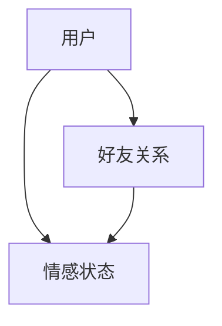

                 


### **文章标题:** 在虚拟社交中寻找真实情感

#### **关键词:** 虚拟社交、真实情感、情感识别、机器学习、跨平台互动、心理健康

#### **摘要:**
本文深入探讨了虚拟社交环境中寻找真实情感的重要性、机制及其面临的挑战。通过分析虚拟社交与真实情感的差异，我们介绍了机器学习在情感识别与反馈中的应用，探讨了真实情感在虚拟社交中的表现与识别方法。接着，我们研究了跨平台情感互动的挑战与实现策略，并通过实际案例展示了这些方法的实效性。最后，我们展望了虚拟社交与真实情感的可持续发展，探讨了未来技术趋势及其在心理健康教育中的应用。

### **引言**

在当今数字化时代，虚拟社交已经成为了人们生活中不可或缺的一部分。无论是通过社交媒体平台、在线游戏，还是即时通讯应用，虚拟社交为人们提供了一个全新的交流方式，打破了传统社交的时空限制。然而，尽管虚拟社交带来了诸多便利，人们对于其中是否存在真实情感仍然存在疑问。

**真实情感的需求**：人们在社会互动中寻求的不仅仅是信息的交换，更是情感的交流。真实情感是人际关系中不可或缺的一部分，它影响着人们的心理健康和幸福感。因此，在虚拟社交中能否找到真实情感成为了许多人的关注点。

**两者之间的矛盾与挑战**：虚拟社交环境与真实情感之间存在一定的矛盾。虚拟社交的高互动性和低隐私性可能导致情感表达的形式化，从而难以触及深层次的情感。同时，虚拟社交的匿名性和距离感也可能削弱真实情感的表达。因此，如何在虚拟社交中寻找真实情感成为了一个亟待解决的问题。

### **核心概念**

#### **虚拟社交的定义**

虚拟社交指的是通过互联网和数字技术进行的社交活动，包括但不限于社交媒体平台、在线游戏、即时通讯应用等。虚拟社交具有以下特点：

- **高互动性**：用户可以在任何时间、任何地点进行互动。
- **低隐私性**：用户信息容易泄露，隐私保护成为重要问题。
- **形式化**：由于缺乏面对面交流的物理环境，情感表达可能趋于形式化。
- **匿名性**：用户可以隐藏真实身份，这在一定程度上影响了真实情感的表达。

#### **真实情感的定义**

真实情感是指个体在自然、真实情境中表现出的情感状态，它包括快乐、悲伤、愤怒、爱等基本情感。真实情感具有以下特点：

- **深度性**：真实情感往往涉及个体内心的体验和感受。
- **真实性**：真实情感是源自内心的真实体验，而非虚假的表演。
- **复杂性**：真实情感不仅包括基本情感，还可能涉及情感之间的相互作用和层次。

#### **虚拟社交中的真实情感**

虚拟社交中的真实情感是指用户在虚拟社交环境中表现出的真实情感状态。尽管虚拟社交存在一定的局限性，但仍然存在真实情感的表达。虚拟社交中的真实情感可以表现为：

- **文本情感**：用户在社交媒体平台、即时通讯应用中的文字表达。
- **语音情感**：用户在语音通话、语音消息中的情感表达。
- **视频情感**：用户在视频聊天、视频内容中的情感表现。

### **概念属性特征对比表格**

| 特征 | 虚拟社交 | 真实情感 |
| --- | --- | --- |
| 互动性 | 较高 | 高 |
| 隐私性 | 较低 | 高 |
| 形式化 | 较高 | 低 |
| 情感深度 | 较浅 | 深 |

#### **虚拟社交中的情感交互模式**

虚拟社交中的情感交互模式可以分为表层互动和深层次交流两种类型。

**表层互动**：这种互动主要表现为点赞、评论、转发等简单的情感表达。表层互动虽然能够提供一定的情感交流，但由于缺乏深层次的情感交流，往往难以触及个体的内心。

**深层次交流**：这种交流涉及到更深入的对话和互动，用户通过文字、语音、视频等形式表达自己的情感和想法。深层次交流能够促进真实情感的建立和深化，有助于建立更紧密的人际关系。

### **ER图：虚拟社交中的情感关系**



在上面的ER图中，用户（User）是核心实体，好友关系（Friendship）和情感状态（EmotionalState）是与用户相关的两个重要实体。好友关系实体表示用户之间的社交关系，情感状态实体表示用户在社交活动中的情感状态。这个图结构清晰地展示了虚拟社交中的情感关系，为后续的分析和设计提供了基础。

### **本章小结**

本章对虚拟社交与真实情感的概念进行了详细阐述，分析了虚拟社交的特点及其与真实情感之间的差异。通过概念属性特征对比表格和ER图，我们更直观地理解了虚拟社交中的情感交互模式。这些基础概念和模型为后续章节的深入探讨提供了理论支持。接下来，我们将进一步探讨虚拟社交平台的设计与情感互动，以及机器学习在情感识别与反馈中的应用。

## **第2章：虚拟社交平台设计与情感互动**

在虚拟社交平台的设计过程中，如何有效地支持和促进真实情感的表达和交互是一个关键问题。本章节将探讨虚拟社交平台的设计原则、功能模块以及情感互动机制，以实现一个既具有高度互动性又能促进真实情感交流的平台。

### **虚拟社交平台设计与情感互动的设计原则**

**1. 用户体验至上：** 设计平台时应始终将用户体验放在首位，确保用户能够轻松地找到并参与到情感互动中。

**2. 隐私保护：** 虚拟社交平台必须重视用户隐私，提供安全可靠的隐私保护措施，使用户在表达情感时感到安心。

**3. 情感真实性与深度：** 平台设计应鼓励真实情感的交流，避免形式化的情感表达。通过设计多种互动方式，如文字、语音、视频等，促进用户表达深层次的情感。

**4. 互动多样化：** 提供多样化的互动方式，如群聊、一对一私聊、直播互动等，满足不同用户的情感交流需求。

**5. 情感反馈机制：** 设立情感反馈机制，鼓励用户对平台内容和互动进行评价，通过用户反馈不断优化平台设计。

### **功能模块设计**

**1. 用户个人信息模块：** 包括用户头像、简介、情感状态等，为用户展示自我、表达情感提供空间。

**2. 社交互动模块：** 包括好友管理、聊天功能、点赞、评论等，为用户提供多种互动方式。

**3. 情感表达模块：** 包括文字、语音、视频等多种形式的情感表达工具，鼓励用户真实地表达情感。

**4. 情感反馈模块：** 通过情感标签、情绪分析等方式，为用户提供情感反馈，帮助用户了解自己的情感状态。

**5. 社区模块：** 设立论坛、话题区等，促进用户围绕特定话题进行深入讨论和情感交流。

### **情感互动机制**

**1. 情感标签系统：** 用户可以对内容进行情感标签标记，平台可以根据标签进行情感分类和推荐，帮助用户发现感兴趣的情感内容。

**2. 情感适应功能：** 平台可以根据用户的情感状态调整互动方式，如当用户表现出焦虑时，提供安抚性互动内容。

**3. 情感智能推荐：** 利用机器学习技术，根据用户的情感历史和互动行为，推荐相关的情感内容，促进真实情感交流。

**4. 情感互动分析：** 通过情感分析技术，对用户互动内容进行情感分析，为用户提供情感反馈，促进情感交流的深度和质量。

### **实际案例分析**

以微信为例，微信作为一个综合性的社交平台，在情感互动设计上有着诸多亮点：

- **朋友圈**：用户可以通过文字、图片、视频等多种形式分享自己的情感和生活，形成一种亲密的情感互动氛围。
- **语音聊天**：语音功能使得用户可以更自然地表达情感，提高了沟通的真实性。
- **小程序**：通过小程序，用户可以进行更丰富的情感互动，如心理测试、情感咨询等。
- **小程序**：通过小程序，用户可以进行更丰富的情感互动，如心理测试、情感咨询等。

这些功能设计都体现了虚拟社交平台在情感互动方面的创新和努力。

### **本章小结**

本章详细介绍了虚拟社交平台的设计原则、功能模块以及情感互动机制。通过设计多样化的互动方式和情感反馈机制，虚拟社交平台可以在一定程度上促进真实情感的表达和交流。接下来，我们将深入探讨机器学习在情感识别与反馈中的应用，以进一步提升虚拟社交平台的情感互动体验。

### **第3章：机器学习在情感识别与反馈中的应用**

在虚拟社交平台中，情感识别与反馈是提升用户体验的关键技术。机器学习作为一种强大的数据处理和分析工具，在情感识别与反馈中发挥着重要作用。本章节将详细介绍机器学习的基本原理、情感识别算法、情感反馈机制以及机器学习模型的设计与实现。

#### **机器学习的基本原理**

机器学习是一种使计算机系统能够从数据中学习并做出决策的技术。其基本原理包括以下几类：

**1. 监督学习（Supervised Learning）：** 监督学习是一种从标记数据中学习的方法，即输入数据和相应的输出标签。通过这些数据，模型可以学会预测新的输入数据的标签。

**2. 无监督学习（Unsupervised Learning）：** 无监督学习不依赖于标签数据，而是通过发现数据中的模式和结构来进行学习。常见的方法包括聚类、降维和关联规则学习。

**3. 半监督学习（Semi-supervised Learning）：** 半监督学习结合了监督学习和无监督学习，利用少量标签数据和大量未标记数据来提高模型的性能。

#### **情感识别算法**

情感识别是机器学习在虚拟社交中的重要应用之一。情感识别算法可以从文本、语音和视频等多模态数据中提取情感信息。以下是几种常用的情感识别算法：

**1. 文本情感分析算法（Textual Sentiment Analysis）：** 文本情感分析是利用自然语言处理技术对文本数据中的情感倾向进行分类。常用的模型包括朴素贝叶斯、支持向量机（SVM）和深度学习模型（如卷积神经网络CNN和循环神经网络RNN）。

**2. 语音情感分析算法（Voice Sentiment Analysis）：** 语音情感分析通过分析语音信号中的情感特征来识别情感。常见的特征包括音调、音速、音量和共振峰频率等。常用的模型包括隐马尔可夫模型（HMM）和深度神经网络。

**3. 视频情感分析算法（Video Sentiment Analysis）：** 视频情感分析通过分析视频中的视觉和听觉特征来识别情感。视觉特征包括人脸表情、身体语言和场景信息，听觉特征包括语音情感信息。常用的模型包括卷积神经网络（CNN）和生成对抗网络（GAN）。

#### **情感反馈机制**

情感反馈机制是虚拟社交平台中提升用户体验的重要功能。以下几种机制可以帮助平台提供更个性化的情感反馈：

**1. 情感标签系统（Emotional Tagging System）：** 用户可以对内容进行情感标签标记，平台可以根据标签进行情感分类和推荐，帮助用户发现感兴趣的情感内容。

**2. 情感适应功能（Emotional Adaptation Feature）：** 平台可以根据用户的情感状态调整互动方式，如当用户表现出焦虑时，提供安抚性互动内容。

**3. 情感智能推荐（Emotional Intelligent Recommendation）：** 利用机器学习技术，根据用户的情感历史和互动行为，推荐相关的情感内容，促进真实情感交流。

**4. 情感互动分析（Emotional Interaction Analysis）：** 通过情感分析技术，对用户互动内容进行情感分析，为用户提供情感反馈，促进情感交流的深度和质量。

#### **机器学习模型设计与实现**

**1. 数据收集与预处理（Data Collection and Preprocessing）：** 收集大量带有情感标签的文本、语音和视频数据，并进行数据清洗、去噪和特征提取。

**2. 模型选择与训练（Model Selection and Training）：** 根据情感识别任务的特点选择合适的模型，如卷积神经网络（CNN）或循环神经网络（RNN），并进行训练。

**3. 模型评估与优化（Model Evaluation and Optimization）：** 使用交叉验证、准确率、召回率等指标评估模型性能，并通过调整超参数、增加数据集等方法进行模型优化。

**4. 应用部署与维护（Deployment and Maintenance）：** 将训练好的模型部署到虚拟社交平台中，并进行实时更新和维护，确保模型性能的持续提升。

以下是一个简单的Python代码示例，用于实现文本情感分析算法：

```python
import numpy as np
from sklearn.feature_extraction.text import TfidfVectorizer
from sklearn.model_selection import train_test_split
from sklearn.naive_bayes import MultinomialNB

# 示例数据
texts = ["我很开心！","我很悲伤。","今天天气很好。","我的心情很差。"]
labels = ["积极情感","消极情感","中性情感","消极情感"]

# 数据预处理
vectorizer = TfidfVectorizer()
X = vectorizer.fit_transform(texts)
y = labels

# 模型训练
X_train, X_test, y_train, y_test = train_test_split(X, y, test_size=0.2)
model = MultinomialNB()
model.fit(X_train, y_train)

# 模型评估
predictions = model.predict(X_test)
accuracy = np.mean(predictions == y_test)
print("模型准确率：", accuracy)
```

#### **实际案例分析**

**1. 案例一：微信朋友圈的情感互动**  
微信朋友圈作为社交平台中的一部分，通过文本、图片和视频等多种方式支持情感互动。用户可以通过点赞、评论和分享来表达情感。微信还利用情感分析技术，对朋友圈内容进行情感分类和推荐，使用户能够发现更多感兴趣的情感内容。

**2. 案例二：TikTok的情感引导**  
TikTok通过情感识别技术，分析用户的互动行为和内容，为用户提供个性化的情感推荐。例如，当用户表现出对某类情感内容的高度兴趣时，TikTok会推荐更多类似的内容，以增强用户的情感体验。

### **本章小结**

本章详细介绍了机器学习在情感识别与反馈中的应用，包括基本原理、情感识别算法、情感反馈机制以及机器学习模型的设计与实现。通过这些技术，虚拟社交平台可以更有效地识别和响应用户情感，提升用户体验。接下来，我们将探讨真实情感在虚拟社交中的表现与识别方法，以进一步理解虚拟社交中的情感互动。

## **第4章：真实情感在虚拟社交中的表现与识别**

在虚拟社交环境中，真实情感的表现与识别是一个复杂而关键的问题。由于虚拟社交的特殊性，用户在表达情感时可能受到多种因素的影响，如匿名性、情感形式化和环境差异等。本章节将探讨真实情感在虚拟社交中的表现特点，以及如何利用技术手段识别这些情感。

### **真实情感在虚拟社交中的表现特点**

**1. 表层互动与深层次交流的并存：** 在虚拟社交中，用户可能同时进行表层互动和深层次交流。表层互动如点赞、评论等可能带有一定程度的情感表达，但往往较为形式化。而深层次交流则涉及更深入的对话和情感交流，能够更真实地反映用户的内心情感。

**2. 情感表达的不确定性：** 虚拟社交的匿名性和距离感可能导致用户在情感表达上存在不确定性。用户可能会在公开场合表达一种情感，而在私下交流中表现出完全不同的情感状态。

**3. 情感表达的复杂性与多样性：** 用户在虚拟社交中可能通过多种方式表达情感，如文字、语音、视频和表情符号等。这些不同的表达方式可能涉及不同的情感层次和维度，使得情感识别变得更加复杂。

**4. 情感表达的时序性：** 情感表达在虚拟社交中具有时序性。通过分析用户在一段时间内的互动行为和情感表达，可以更准确地识别用户的情感状态和变化趋势。

### **真实情感的识别方法**

**1. 文本情感分析：** 文本情感分析是识别虚拟社交中情感表达的主要方法之一。通过自然语言处理技术，分析文本中的情感词汇、情感强度和情感倾向，可以识别用户的情感状态。常用的文本情感分析方法包括基于规则的方法、机器学习方法和深度学习方法。

**2. 语音情感分析：** 语音情感分析通过分析语音信号中的情感特征，如音调、音速、音量和共振峰频率等，来识别情感。语音情感分析具有较高的准确性，能够捕捉到文字表达难以传达的情感细节。

**3. 视频情感分析：** 视频情感分析通过分析视频中的视觉和听觉特征，如人脸表情、身体语言和语音情感等，来识别情感。视频情感分析能够提供更全面和直观的情感识别信息，但在处理复杂场景时可能面临挑战。

**4. 深度学习与多模态融合：** 利用深度学习模型，如卷积神经网络（CNN）和循环神经网络（RNN），可以实现对文本、语音和视频等多种数据的情感识别。通过多模态数据的融合，可以进一步提升情感识别的准确性和全面性。

### **案例研究：虚拟社交平台中的情感识别**

以微信为例，微信通过以下方式识别用户在虚拟社交中的情感：

**1. 文本情感分析：** 微信对用户的聊天记录进行情感分析，识别用户的情感状态，并在适当的时候提供情感反馈，如“安慰”、“鼓励”等。

**2. 语音情感分析：** 微信的语音聊天功能可以分析语音信号中的情感特征，为用户提供更自然的情感交流体验。

**3. 视频情感分析：** 微信的视频通话功能通过分析视频中的情感信息，如面部表情和身体语言，帮助用户更好地理解对方的情感状态。

**4. 情感融合与反馈：** 微信将文本、语音和视频情感分析结果进行融合，为用户提供个性化的情感反馈，如“你看起来不开心”、“今天看起来很开心”等。

### **本章小结**

本章探讨了真实情感在虚拟社交中的表现特点，以及利用技术手段进行情感识别的方法。通过文本、语音和视频情感分析，虚拟社交平台可以更准确地识别用户的情感状态，为用户提供更好的情感体验。接下来，我们将探讨跨平台情感互动与真实情感的融合，以及这种融合对虚拟社交环境的影响。

## **第5章：跨平台情感互动与真实情感的融合**

随着互联网和移动设备的普及，用户在多个平台上进行社交活动已成为常态。这种跨平台社交不仅增加了用户的互动渠道，也带来了新的挑战，特别是在情感互动方面。如何实现跨平台情感互动，并确保真实情感的传递与融合，是虚拟社交领域的一个重要课题。本章将探讨跨平台情感互动的挑战、实现策略及其实际案例。

### **跨平台情感互动的挑战**

**1. 用户隐私保护：** 跨平台情感互动需要共享用户数据，这可能引发隐私泄露的风险。如何平衡用户隐私与情感互动的需求成为一个关键问题。

**2. 数据同步问题：** 不同平台之间的数据格式和存储方式可能不一致，导致数据同步困难。确保数据在不同平台之间的准确同步是跨平台情感互动的关键。

**3. 跨平台体验一致性：** 用户在不同平台上可能有不同的使用习惯和界面设计，如何确保跨平台情感互动的一致性和流畅性是一个挑战。

**4. 情感表达方式的差异：** 不同平台可能支持不同的情感表达方式，如文字、语音、视频等。如何在不同平台上实现情感表达的一致性和适应性是跨平台情感互动的一个重要课题。

### **实现策略**

**1. 跨平台社交账户链接：** 通过链接用户的跨平台社交账户，实现用户在多个平台上的数据同步和身份识别。例如，通过OAuth协议，用户可以在不同平台上使用同一账号登录，实现数据共享和互动。

**2. 跨平台数据同步：** 设计高效的数据同步机制，确保用户在不同平台上的数据和互动内容能够实时同步。例如，采用分布式数据库和实时数据同步技术，实现数据的无缝对接。

**3. 跨平台情感互动一致性设计：** 设计统一的情感互动界面和交互方式，确保用户在不同平台上的体验一致性。例如，采用响应式设计，使界面能够适应不同设备的显示和交互需求。

**4. 多模态情感表达支持：** 在不同平台上支持多种情感表达方式，如文字、语音、视频和图像等。通过多模态数据的融合，提供更丰富的情感互动体验。

### **跨平台情感互动的实际案例**

**案例一：微信与Facebook的情感互动分析**

微信和Facebook都是全球领先的社交平台，它们在跨平台情感互动方面有着丰富的实践经验。

- **用户账户链接：** 用户可以在微信和Facebook之间链接账户，实现数据同步和身份识别，方便用户在不同平台上的互动。

- **数据同步：** 微信和Facebook通过分布式数据库和实时数据同步技术，确保用户在两个平台上的数据和互动内容能够实时同步。

- **情感互动一致性设计：** 微信和Facebook采用统一的情感互动界面和交互方式，如点赞、评论和分享等，确保用户在不同平台上的体验一致。

- **多模态情感表达支持：** 微信和Facebook支持多种情感表达方式，如文字、语音、视频和图像等，为用户提供丰富的情感互动体验。

**案例二：TikTok与Instagram的情感融合策略**

TikTok和Instagram都是短视频社交平台，它们在情感融合方面采取了多种策略。

- **用户账户链接：** 用户可以在TikTok和Instagram之间链接账户，实现数据同步和互动内容的共享。

- **情感互动一致性设计：** TikTok和Instagram采用类似的情感互动界面和交互方式，如点赞、评论和分享等，确保用户在不同平台上的体验一致性。

- **多模态情感表达支持：** TikTok和Instagram支持多种情感表达方式，如文字、语音、视频和图像等，为用户提供丰富的情感互动体验。

- **跨平台推荐：** TikTok和Instagram通过分析用户的互动行为和兴趣，提供跨平台的个性化推荐，促进用户在不同平台上的互动和情感融合。

### **本章小结**

本章探讨了跨平台情感互动的挑战和实现策略，并通过实际案例展示了这些策略的应用效果。跨平台情感互动不仅提升了用户的社交体验，也为虚拟社交环境的丰富性和多样性提供了新的可能。接下来，我们将展望虚拟社交与真实情感的可持续发展，探讨未来技术趋势及其在心理健康教育中的应用。

## **第6章：虚拟社交与真实情感的可持续发展**

在数字化时代，虚拟社交已经深入人们的日常生活，成为人们交流、娱乐和信息获取的重要渠道。然而，随着虚拟社交的快速发展，如何实现虚拟社交与真实情感的可持续发展成为一个重要课题。本章节将探讨虚拟社交与真实情感的可持续发展路径、技术趋势以及心理健康教育中的应用。

### **虚拟社交与真实情感的可持续发展路径**

**1. 提升情感交互质量：** 通过改进虚拟社交平台的设计和功能，提升用户的情感交互体验。例如，引入更加自然和丰富的情感表达方式，如语音、视频和虚拟现实（VR）等，使情感交流更加真实和深入。

**2. 强化情感识别与反馈：** 利用机器学习、自然语言处理和人工智能等技术，提升虚拟社交平台对情感的理解和识别能力，提供更加个性化的情感反馈和推荐。

**3. 增强隐私保护与安全性：** 在虚拟社交中，用户的隐私和安全是确保真实情感表达的关键。平台需要采取有效的隐私保护措施，确保用户的数据安全和隐私不被泄露。

**4. 建立健康的虚拟社区文化：** 通过制定和执行社区规则，建立积极、健康的虚拟社交文化，鼓励用户进行真实的情感交流和互动，避免虚假信息和形式化交流。

### **技术趋势**

**1. 情感计算与智能化：** 情感计算是一种将情感因素整合到计算机系统中的技术。未来，情感计算将进一步提升虚拟社交平台的智能化水平，使平台能够更好地理解和响应用户的情感需求。

**2. 虚拟现实与增强现实（VR/AR）：** 虚拟现实和增强现实技术为虚拟社交提供了全新的体验方式。通过VR/AR，用户可以在虚拟环境中进行更加真实和沉浸式的情感交流。

**3. 多模态情感识别：** 通过结合文本、语音、视频和图像等多种模态数据，多模态情感识别技术可以更全面和准确地理解用户的情感状态，为虚拟社交平台提供更加精准的情感交互体验。

**4. 跨界合作与融合：** 虚拟社交与心理健康、教育、医疗等领域的跨界合作将推动虚拟社交与真实情感的深度融合。通过引入专业知识和资源，提升虚拟社交的情感价值和社会影响力。

### **心理健康教育中的应用**

**1. 在线心理咨询服务：** 通过虚拟社交平台提供在线心理咨询服务，为用户提供便捷的心理健康支持。例如，通过聊天机器人或专业的心理咨询师进行在线咨询，帮助用户解决心理问题。

**2. 情感分析与反馈：** 利用情感计算技术，对用户的互动内容进行情感分析，提供个性化的情感反馈和心理健康建议。例如，通过分析用户的情绪变化，预测潜在的心理健康风险，并给予针对性的建议。

**3. 情感教育课程：** 结合虚拟社交平台和在线教育技术，提供情感教育课程，帮助用户提升情感素养。例如，通过虚拟现实技术，模拟真实的社交场景，用户可以在互动中学习如何表达和识别情感。

**4. 社交技能培训：** 通过虚拟社交平台提供社交技能培训，帮助用户提升人际交往能力和情感沟通能力。例如，通过模拟对话和角色扮演，用户可以在虚拟环境中练习社交技巧。

### **本章小结**

虚拟社交与真实情感的可持续发展是数字化时代的重要课题。通过提升情感交互质量、强化情感识别与反馈、增强隐私保护与安全性，以及建立健康的虚拟社区文化，可以实现虚拟社交与真实情感的良性互动。未来，随着情感计算、虚拟现实和增强现实等技术的发展，虚拟社交将更加智能化和个性化。同时，虚拟社交在心理健康教育中的应用也将为用户提供更加全面和有效的心理健康支持。通过持续创新和实践，虚拟社交与真实情感将共同推动社会的进步和发展。

### **结语**

在数字化时代，虚拟社交已经成为人们日常交流的重要组成部分。然而，如何在虚拟社交中寻找真实情感，实现情感的真实表达和深度交流，是一个亟待解决的问题。本文从多个角度探讨了虚拟社交与真实情感的关系，包括虚拟社交的背景介绍、核心概念解析、情感识别与反馈机制，以及跨平台情感互动的实现策略。通过分析虚拟社交平台的设计原则、功能模块和情感互动机制，我们提出了一系列实现真实情感传递的方法和策略。

**1. 强化情感识别与反馈：** 利用机器学习、自然语言处理和人工智能技术，提升虚拟社交平台对情感的理解和识别能力，为用户提供更加个性化的情感反馈和推荐。

**2. 增强隐私保护与安全性：** 确保用户在虚拟社交中的隐私和数据安全，是建立真实情感交流的基础。平台应采取有效的隐私保护措施，增强用户对虚拟社交的信任。

**3. 跨界合作与融合：** 通过与心理健康、教育、医疗等领域的跨界合作，推动虚拟社交与真实情感的深度融合，提升虚拟社交的情感价值和社会影响力。

**4. 持续创新与优化：** 随着技术的不断进步，虚拟社交平台应不断优化和升级，提供更加丰富和多样化的情感交流方式，满足用户日益增长的情感需求。

通过本文的探讨，我们希望为虚拟社交领域的情感研究与实践提供一些有益的思路和参考。未来，随着技术的进一步发展，虚拟社交与真实情感的互动将更加自然和深入，为人们的社交生活带来更多的乐趣和价值。

### **作者信息**

**作者：** AI天才研究院/AI Genius Institute & 禅与计算机程序设计艺术 /Zen And The Art of Computer Programming

AI天才研究院致力于推动人工智能技术的创新与应用，禅与计算机程序设计艺术则强调程序设计的哲学和艺术性。这两者的结合，旨在为读者带来更深入、更全面的技术探讨和思考。

