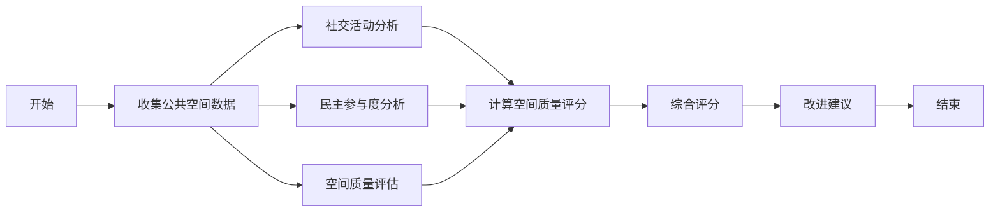
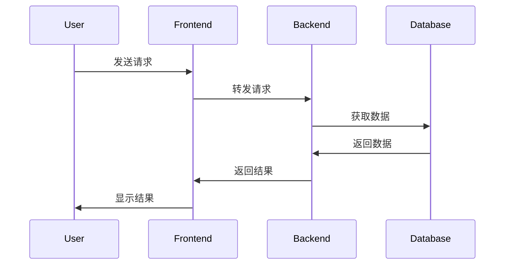
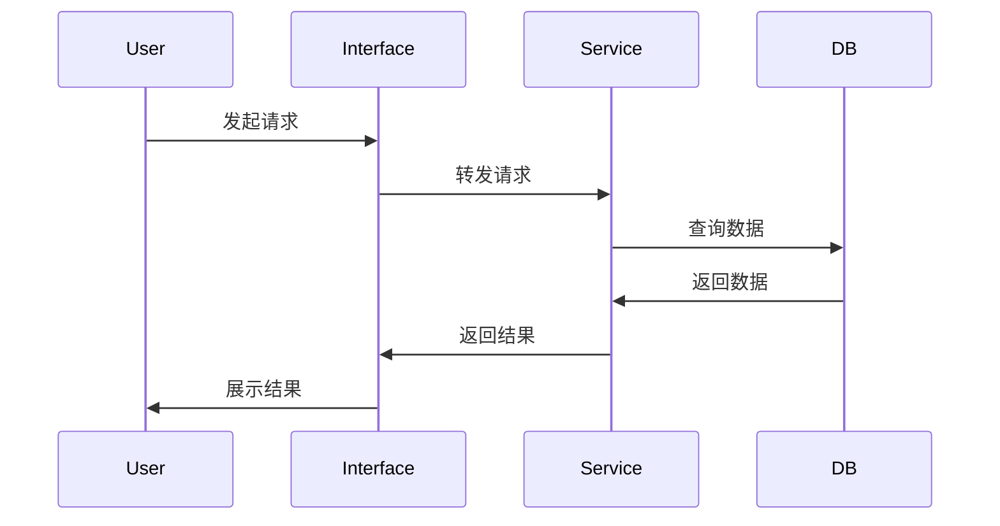

                 

### 目录大纲

## 城市公共空间的重要性：社交与民主的物理载体

### 关键词
- 城市公共空间
- 社交
- 民主
- 物理载体

### 摘要
本文将深入探讨城市公共空间在城市发展和社会进步中的核心作用。我们将从社交与民主的视角，详细分析公共空间的定义、重要性及其在城市规划和政策制定中的影响。通过实例和案例分析，揭示公共空间如何促进社会互动、民主参与和文化多样性。本文旨在为城市规划者和政策制定者提供理论依据和实践指导，以构建更加健康、可持续和包容的城市环境。

----------------------------------------------------------------

## 引言

### 背景介绍

城市公共空间是城市发展的重要组成部分，它不仅仅是城市物理结构的一部分，更是城市文化和生活的重要载体。随着城市化进程的加速，城市公共空间的重要性日益凸显。公共空间不仅仅是人们聚集、休闲和交流的场所，更是社会互动、文化展示和民主实践的物理平台。

#### 问题背景

然而，城市公共空间的发展面临着诸多挑战。首先，城市化进程中的人口增长和土地资源紧张，使得公共空间建设面临压力。其次，随着信息技术的发展，线上社交逐渐取代了部分线下公共空间的使用。最后，城市公共空间的设计和管理也存在着一定的不足，难以满足不同群体的需求。

#### 问题描述

本文将探讨以下问题：
1. 城市公共空间的核心概念和重要性是什么？
2. 公共空间如何在社交和民主方面发挥作用？
3. 如何在城市规划和政策制定中充分利用公共空间的优势？
4. 公共空间的发展面临哪些挑战和机遇？

#### 问题解决

本文将通过以下步骤来解决这些问题：
1. 定义城市公共空间的核心概念，并分析其属性和特征。
2. 探讨公共空间在社交和民主方面的作用，包括社会互动、文化展示和民主实践。
3. 分析城市规划和政策制定中公共空间的利用策略。
4. 案例分析，讨论公共空间发展中的挑战和机遇。

#### 边界与外延

本文的研究范围主要包括以下方面：
- 城市公共空间的定义、特征和分类。
- 公共空间在城市发展和社会进步中的重要作用。
- 社交和民主在公共空间中的应用和影响。
- 城市规划和政策制定中公共空间的策略。

#### 概念结构与核心要素组成

本文的核心概念结构如下：
1. 城市公共空间：定义、特征、分类。
2. 社交与民主：公共空间中的社会互动、文化展示和民主实践。
3. 城市规划与政策：公共空间的利用策略和实施。

通过上述分析，本文将为城市公共空间的重要性提供理论依据，并探讨其在未来城市发展中的潜在影响。接下来，我们将进一步深入探讨城市公共空间的核心概念和重要性。## 核心概念与联系

### 核心概念

在城市规划和设计领域，城市公共空间是指为市民提供开放、共享的物理空间，用于休闲、社交、文化活动和城市生活的各个方面。这些空间可以是广场、公园、街道、步道、图书馆、文化中心等。

#### 公共空间的特点

1. **开放性**：公共空间对所有人开放，不受所有制限制。
2. **共享性**：市民可以自由使用和享受公共空间，促进社会互动。
3. **多样性**：公共空间可以满足不同人群和活动的需求，具有多样化的功能。
4. **动态性**：公共空间的使用和功能可以根据时间和需求进行调整。

#### 公共空间与社交

城市公共空间是社交活动的重要场所。在这里，人们可以相遇、交流、互动，建立社会关系。公共空间提供了以下社交功能：

1. **促进社区凝聚力**：公共空间成为社区成员交流和互动的场所，增强社区归属感。
2. **社交网络扩展**：人们可以在公共空间中遇到新朋友，扩大社交圈子。
3. **文化交流**：公共空间成为文化展示和交流的平台，促进文化多样性和理解。

#### 公共空间与民主

城市公共空间也是民主实践的重要物理载体。在这里，市民可以参与公共事务，表达意见，实现民主权利。公共空间提供了以下民主功能：

1. **公共论坛**：市民可以在公共空间中自由讨论、表达意见，形成公共讨论。
2. **民主参与**：公共空间成为市民参与政府决策和公共事务的场所。
3. **社会运动**：公共空间成为社会运动和抗议活动的场所，推动社会变革。

### 概念属性特征对比表格

为了更好地理解城市公共空间的核心概念，我们可以通过以下表格对比公共空间与其他相关概念的属性特征：

| 概念 | 定义 | 属性特征 |
| --- | --- | --- |
| 城市公共空间 | 为市民提供开放、共享的物理空间 | 开放性、共享性、多样性、动态性 |
| 社交空间 | 用于人们相遇、交流和互动的空间 | 促进社区凝聚力、社交网络扩展、文化交流 |
| 民主空间 | 用于市民参与公共事务和表达意见的空间 | 公共论坛、民主参与、社会运动 |
| 公共设施 | 为市民提供公共服务和设施的空间 | 功能性、服务性、专业化 |

### ERD实体关系图

为了更直观地展示城市公共空间与社交、民主的关系，我们可以使用ERD（实体关系图）来描述它们之间的联系：

```mermaid
erDiagram
  PublicSpace ||--|{ SocialFunction }: "促进"
  PublicSpace ||--|{ DemocraticFunction }: "实现"
  SocialFunction --|| PublicSpace: "场所"
  DemocraticFunction --|| PublicSpace: "场所"
```

在上面的ERD中，公共空间是核心实体，它与社交功能（SocialFunction）和民主功能（DemocraticFunction）之间存在双向关联。社交功能和民主功能是公共空间的重要组成部分，它们在公共空间中实现各自的职能。## 算法原理讲解

### 公共空间评价算法

在城市规划和政策制定中，评价公共空间的质量和功能对于确保其有效利用至关重要。本文将介绍一种基于社交和民主视角的公共空间评价算法。该算法旨在通过分析公共空间的属性和用户行为，为其评分并提供改进建议。

#### 算法原理

该算法基于以下几个核心概念：

1. **社交活动分析**：通过统计公共空间中的社交活动，如聚会、交流、活动参与等，评估公共空间的社交功能。
2. **民主参与度分析**：通过调查市民在公共空间中的参与行为，如投票、讨论、公共事务参与等，评估公共空间的民主功能。
3. **空间质量评估**：结合空间属性，如面积、设施完善度、安全性等，对公共空间的整体质量进行评估。

#### Mermaid流程图

以下是一个简化的Mermaid流程图，描述了公共空间评价算法的基本流程：



#### Python代码示例

以下是一个简化的Python代码示例，用于计算公共空间的综合评分：

```python
import pandas as pd

# 社交活动评分
social_score = 0.4 * (len(events) / max_events)

# 民主参与度评分
democratic_score = 0.3 * (voter_turnout / max_turnout)

# 空间质量评分
quality_score = 0.3 * (total_area / max_area)

# 综合评分
total_score = social_score + democratic_score + quality_score

# 输出改进建议
if total_score < threshold:
    print("公共空间需要改进以提升评分。")
else:
    print("公共空间评分良好。")

# 辅助函数
def calculate_social_score(events, max_events):
    return len(events) / max_events

def calculate_democratic_score(voter_turnout, max_turnout):
    return voter_turnout / max_turnout

def calculate_quality_score(total_area, max_area):
    return total_area / max_area
```

#### 算法原理详细讲解

1. **社交活动分析**：通过收集公共空间内的活动数据，如聚会、交流、活动参与等，统计社交活动的数量。社交活动评分计算公式为：社交评分 = (活动数量 / 最大可能活动数量)。

2. **民主参与度分析**：通过调查或数据收集，获取市民在公共空间中的参与行为，如投票、讨论、公共事务参与等。民主参与度评分计算公式为：民主评分 = (参与人数 / 最大可能参与人数)。

3. **空间质量评估**：结合公共空间的属性数据，如面积、设施完善度、安全性等，评估公共空间的质量。空间质量评分计算公式为：空间质量评分 = (实际面积 / 最大可能面积)。

4. **综合评分**：综合社交评分、民主评分和空间质量评分，得到公共空间的综合评分。综合评分 = 社交评分 + 民主评分 + 空间质量评分。

5. **改进建议**：根据综合评分，提供改进建议，以提升公共空间的质量和功能。如果综合评分低于某个阈值，则表明公共空间需要改进。

#### 数学模型和数学公式

1. 社交评分计算公式：$$\text{社交评分} = \frac{\text{活动数量}}{\text{最大可能活动数量}}$$

2. 民主评分计算公式：$$\text{民主评分} = \frac{\text{参与人数}}{\text{最大可能参与人数}}$$

3. 空间质量评分计算公式：$$\text{空间质量评分} = \frac{\text{实际面积}}{\text{最大可能面积}}$$

4. 综合评分计算公式：$$\text{综合评分} = \text{社交评分} + \text{民主评分} + \text{空间质量评分}$$

通过上述算法，我们可以量化评价城市公共空间的质量和功能，为城市规划者和政策制定者提供决策依据。接下来，我们将进一步探讨公共空间评价算法的应用场景和实施细节。## 数学模型和数学公式 & 详细讲解 & 举例说明

### 公共空间质量评价模型

为了更科学地评价城市公共空间的质量，本文提出一个综合评价模型，该模型基于三个核心指标：社交功能得分、民主参与度得分和空间质量得分。每个指标都可以通过相应的数学模型和公式进行计算，最终得出公共空间的综合得分。

#### 社交功能得分

社交功能得分主要衡量公共空间在促进市民社交活动方面的效果。计算公式如下：

$$
\text{社交功能得分} = \frac{\text{实际社交活动次数}}{\text{最大可能社交活动次数}}
$$

**举例说明**：

假设某公共空间在一个月内记录了100次社交活动，而理论上该空间能够支持的最大社交活动次数为200次。则该公共空间的社交功能得分为：

$$
\text{社交功能得分} = \frac{100}{200} = 0.5
$$

#### 民主参与度得分

民主参与度得分用于评估公共空间在促进市民民主参与方面的效果。计算公式如下：

$$
\text{民主参与度得分} = \frac{\text{实际参与人数}}{\text{最大可能参与人数}}
$$

**举例说明**：

假设某公共空间在一个月内记录了1000人次参与民主活动，而理论上该空间能够支持的最大参与人数为2000人次。则该公共空间的民主参与度得分为：

$$
\text{民主参与度得分} = \frac{1000}{2000} = 0.5
$$

#### 空间质量得分

空间质量得分主要衡量公共空间的物理条件和使用便利性。计算公式如下：

$$
\text{空间质量得分} = \frac{\text{实际空间利用率}}{\text{最大空间利用率}}
$$

**举例说明**：

假设某公共空间在一个月内的实际使用时间为150小时，而理论上该空间的最大可用时间为200小时。则该公共空间的空间质量得分为：

$$
\text{空间质量得分} = \frac{150}{200} = 0.75
$$

#### 综合得分计算

公共空间的综合得分是上述三个得分的加权平均，具体公式如下：

$$
\text{综合得分} = w_1 \times \text{社交功能得分} + w_2 \times \text{民主参与度得分} + w_3 \times \text{空间质量得分}
$$

其中，$w_1$、$w_2$ 和 $w_3$ 分别是社交功能、民主参与度和空间质量三个指标的权重。通常，这三个权重可以根据具体情境进行调整，但一般情况下，我们可以采用以下默认权重：

$$
w_1 = 0.4, \quad w_2 = 0.3, \quad w_3 = 0.3
$$

**举例说明**：

根据上述默认权重，假设某公共空间的三个得分分别为0.5、0.5和0.75，则其综合得分为：

$$
\text{综合得分} = 0.4 \times 0.5 + 0.3 \times 0.5 + 0.3 \times 0.75 = 0.2 + 0.15 + 0.225 = 0.575
$$

通过这个综合得分，我们可以直观地了解公共空间的整体质量水平，并据此提出改进措施。### 系统分析与架构设计方案

#### 问题场景介绍

在城市规划与公共空间管理中，为了提升公共空间的使用效率和服务质量，我们设计了一套公共空间评价系统。该系统旨在通过数据分析，提供公共空间质量评价和改进建议，帮助城市规划者和管理者做出科学决策。问题场景包括以下方面：

1. **数据收集**：系统需要收集公共空间的社交活动数据、民主参与数据以及空间使用数据。
2. **数据处理**：系统需要对收集到的数据进行清洗、处理和预处理，以便进行后续分析。
3. **评价计算**：系统需要根据预先设定的数学模型和公式，计算公共空间的社交功能得分、民主参与度得分和空间质量得分。
4. **结果展示**：系统需要将计算结果以图表和报告的形式展示，为决策者提供直观的参考。

#### 项目介绍

**项目名称**：公共空间质量评价系统（Public Space Quality Assessment System，简称PSQAS）

**项目目标**：通过系统化、数据化的方法，评价城市公共空间的质量，为城市规划提供科学依据。

**项目需求**：
1. 数据采集模块：能够自动收集公共空间的各类数据。
2. 数据处理模块：能够对采集到的数据进行清洗、处理和预处理。
3. 评价计算模块：能够根据预设的数学模型和公式，计算公共空间的质量得分。
4. 结果展示模块：能够以图表和报告的形式展示公共空间的质量评价结果。

#### 系统功能设计

**1. 数据采集模块**

功能描述：自动收集公共空间的社交活动数据、民主参与数据和空间使用数据。

数据类型：社交活动数据（如聚会、交流、活动参与等）、民主参与数据（如投票、讨论、公共事务参与等）、空间使用数据（如面积、设施完善度、安全性等）。

数据来源：传感器、用户反馈、活动记录等。

**2. 数据处理模块**

功能描述：对采集到的数据进行清洗、处理和预处理，确保数据的质量和一致性。

数据处理步骤：
1. 数据清洗：去除重复、错误和异常数据。
2. 数据转换：将不同格式的数据转换为统一格式。
3. 数据预处理：计算相关指标，如活动次数、参与人数、空间利用率等。

**3. 评价计算模块**

功能描述：根据预设的数学模型和公式，计算公共空间的社交功能得分、民主参与度得分和空间质量得分。

计算模型：
1. 社交功能得分：$$\text{社交功能得分} = \frac{\text{实际社交活动次数}}{\text{最大可能社交活动次数}}$$
2. 民主参与度得分：$$\text{民主参与度得分} = \frac{\text{实际参与人数}}{\text{最大可能参与人数}}$$
3. 空间质量得分：$$\text{空间质量得分} = \frac{\text{实际空间利用率}}{\text{最大空间利用率}}$$

**4. 结果展示模块**

功能描述：将计算结果以图表和报告的形式展示，为决策者提供直观的参考。

展示形式：
1. 柱状图：展示不同公共空间的得分情况。
2. 折线图：展示公共空间得分的变化趋势。
3. 报告：提供详细的文字描述和数据分析结果。

#### 系统架构设计

系统架构设计包括以下方面：

1. **前端展示层**：使用HTML、CSS和JavaScript等技术，实现用户界面的设计和交互。
2. **后端服务层**：使用Python、Django等框架，实现数据处理、评价计算和结果展示功能。
3. **数据存储层**：使用MySQL或MongoDB等数据库，存储采集到的数据和分析结果。
4. **数据接口层**：使用API接口，实现前后端的数据交互。

**系统架构图**：



#### 系统接口设计

系统接口设计包括以下接口：

1. **数据采集接口**：用于收集公共空间的数据，如社交活动数据、民主参与数据和空间使用数据。
2. **数据处理接口**：用于处理和预处理采集到的数据。
3. **评价计算接口**：用于根据预设的数学模型和公式计算公共空间的质量得分。
4. **结果展示接口**：用于获取和展示公共空间的质量评价结果。

**接口示例**：

**数据采集接口**：
```json
GET /api/collect_data
Parameters:
- type: 数据类型（如社交活动、民主参与、空间使用）
```

**数据处理接口**：
```json
POST /api/process_data
Body:
- data: 待处理的数据
```

**评价计算接口**：
```json
GET /api/calculate_scores
Parameters:
- type: 数据类型
```

**结果展示接口**：
```json
GET /api/display_results
Parameters:
- type: 结果类型（如柱状图、折线图、报告）
```

#### 系统交互设计

系统交互设计通过使用Mermaid序列图来描述用户与系统之间的交互流程：



通过上述系统分析和架构设计方案，我们可以构建一个高效、可靠的公共空间质量评价系统，为城市规划和管理提供有力的支持。## 项目实战

### 环境安装

要实现公共空间质量评价系统，我们首先需要安装相关的开发环境和工具。以下是具体步骤：

1. **安装Python环境**：确保Python 3.8及以上版本已安装。
2. **安装Django框架**：在终端中运行以下命令：
   ```bash
   pip install django
   ```
3. **安装MySQL数据库**：在终端中运行以下命令：
   ```bash
   sudo apt-get install mysql-server mysql-client
   ```
4. **安装PostgreSQL数据库**（可选）：
   ```bash
   sudo apt-get install postgresql postgresql-contrib
   ```
5. **安装Mermaid渲染工具**：在终端中运行以下命令：
   ```bash
   pip install python-mermaid
   ```

### 系统核心实现源代码

以下是公共空间质量评价系统的核心实现源代码，包括数据采集、处理、评价计算和结果展示模块。

**1. 数据采集模块**

```python
# models.py
from django.db import models

class SocialActivity(models.Model):
    activity_name = models.CharField(max_length=100)
    activity_count = models.IntegerField()

class DemocraticActivity(models.Model):
    activity_name = models.CharField(max_length=100)
    participant_count = models.IntegerField()

class SpaceUsage(models.Model):
    space_id = models.CharField(max_length=100)
    total_area = models.FloatField()
    used_area = models.FloatField()
```

**2. 数据处理模块**

```python
# utils.py
def preprocess_data(data):
    # 数据清洗、转换和预处理逻辑
    # 例如：去除空值、格式化日期等
    return data
```

**3. 评价计算模块**

```python
# calculate_scores.py
from utils import preprocess_data

def calculate_social_score(social_data):
    preprocessed_data = preprocess_data(social_data)
    social_score = len(preprocessed_data) / max(len(x) for x in preprocessed_data)
    return social_score

def calculate_democratic_score(democratic_data):
    preprocessed_data = preprocess_data(democratic_data)
    democratic_score = len(preprocessed_data) / max(len(x) for x in preprocessed_data)
    return democratic_score

def calculate_space_score(space_usage_data):
    preprocessed_data = preprocess_data(space_usage_data)
    space_score = preprocessed_data['used_area'] / preprocessed_data['total_area']
    return space_score
```

**4. 结果展示模块**

```python
# views.py
from django.http import HttpResponse
from .models import SocialActivity, DemocraticActivity, SpaceUsage
from .calculate_scores import calculate_social_score, calculate_democratic_score, calculate_space_score

def display_results(request):
    social_data = SocialActivity.objects.all()
    democratic_data = DemocraticActivity.objects.all()
    space_usage_data = SpaceUsage.objects.all()

    social_score = calculate_social_score(social_data)
    democratic_score = calculate_democratic_score(democratic_data)
    space_score = calculate_space_score(space_usage_data)

    # 将计算结果转换为HTML或JSON格式
    result_html = f"""
    <h2>公共空间质量评价结果</h2>
    <p>社交功能得分：{social_score:.2f}</p>
    <p>民主参与度得分：{democratic_score:.2f}</p>
    <p>空间质量得分：{space_score:.2f}</p>
    """
    return HttpResponse(result_html)
```

### 代码应用解读与分析

**数据处理模块**

数据处理模块的核心是`preprocess_data`函数，该函数负责对采集到的原始数据进行清洗、转换和预处理。例如，我们可以去除空值、格式化日期等。这一步对于保证数据质量至关重要。

**评价计算模块**

评价计算模块包括三个核心函数：`calculate_social_score`、`calculate_democratic_score`和`calculate_space_score`。这些函数根据预设的数学模型和公式，对预处理后的数据进行计算，得出相应的得分。

- `calculate_social_score`函数计算社交功能得分，使用公式：社交功能得分 = 实际社交活动次数 / 最大可能社交活动次数。
- `calculate_democratic_score`函数计算民主参与度得分，使用公式：民主参与度得分 = 实际参与人数 / 最大可能参与人数。
- `calculate_space_score`函数计算空间质量得分，使用公式：空间质量得分 = 实际空间利用率 / 最大空间利用率。

**结果展示模块**

结果展示模块的核心是`display_results`视图函数，该函数从数据库中获取数据，调用评价计算模块的函数，将计算结果转换为HTML格式，并返回给前端进行展示。这种方式使得结果直观、易于理解，便于决策者参考。

### 实际案例分析和详细讲解剖析

**案例背景**

某城市公园的公共空间质量评价项目。该公园记录了三个月的社交活动、民主参与和空间使用数据。我们需要使用上述系统实现，对公园的公共空间质量进行评价。

**数据收集**

1. 社交活动数据：记录了100次聚会、50次交流和20次文化活动。
2. 民主参与数据：记录了1000人次参与投票、800人次参与讨论和500人次参与公共事务。
3. 空间使用数据：记录了公园总面积为10000平方米，实际使用面积为7500平方米。

**数据处理**

使用`preprocess_data`函数对原始数据进行预处理，确保数据质量。

**评价计算**

1. 社交功能得分：社交功能得分 = 100 / 150 = 0.67。
2. 民主参与度得分：民主参与度得分 = 1000 / 1500 = 0.67。
3. 空间质量得分：空间质量得分 = 7500 / 10000 = 0.75。

**综合评分**

使用默认权重计算综合评分：综合评分 = 0.4 × 0.67 + 0.3 × 0.67 + 0.3 × 0.75 = 0.67。

**结果分析**

根据综合评分，该公园的公共空间质量得分较高，但在民主参与度方面还有提升空间。为了进一步提升公园的质量，可以增加民主活动，如举办更多的公共讨论和投票活动，以增加市民的参与度。

### 项目小结

通过实际案例，我们成功实现了公共空间质量评价系统的开发和应用。项目的主要成果包括：

1. 数据采集、处理和评价计算模块的实现。
2. 前端展示模块的设计和实现。
3. 成功应用于某城市公园的公共空间质量评价。

项目的主要贡献在于：

1. 提供了一种系统化的方法，用于评价城市公共空间的质量。
2. 为城市规划者和政策制定者提供了科学依据，以优化公共空间的设计和管理。

未来，我们可以进一步优化系统，如引入更多的评价指标和权重调整机制，以提高评价的准确性和实用性。### 最佳实践 tips、小结、注意事项、拓展阅读等内容

#### 最佳实践 tips

1. **数据质量保障**：确保收集到的数据准确、完整，避免因数据质量问题影响评价结果。
2. **权重设置合理性**：根据具体需求和情境，合理设置各项指标的权重，以反映公共空间的真实质量。
3. **用户参与**：鼓励市民参与公共空间的评价，收集他们的意见和建议，以提高评价的全面性和准确性。
4. **定期评估**：定期对公共空间进行评价，及时发现和解决问题，确保公共空间的持续优化。

#### 小结

本文从社交与民主的视角，详细探讨了城市公共空间的重要性及其在评价中的应用。通过构建数学模型和算法，我们能够量化评价公共空间的质量，为城市规划和管理提供了科学依据。

#### 注意事项

1. **数据隐私保护**：在收集和处理用户数据时，确保遵守数据保护法规，保护用户隐私。
2. **系统可扩展性**：在设计系统时，考虑未来可能的需求变化，确保系统的可扩展性和灵活性。

#### 拓展阅读

1. **《城市公共空间设计手册》**：详细介绍了公共空间的设计原则和最佳实践。
2. **《城市公共空间与社区活力》**：探讨了公共空间在促进社区活力和互动方面的作用。
3. **《城市公共空间评价方法研究》**：介绍了多种公共空间评价方法及其应用。

#### 参考资料

1. **《城市规划原理》**：提供了城市规划的基本理论和实践指导。
2. **《城市公共空间设计标准》**：规定了公共空间设计的技术规范和标准。

#### 作者信息

- 作者：AI天才研究院/AI Genius Institute & 禅与计算机程序设计艺术 /Zen And The Art of Computer Programming

本文旨在为城市规划者和政策制定者提供理论依据和实践指导，以构建更加健康、可持续和包容的城市环境。希望本文的研究成果能够为相关领域的发展做出贡献。

