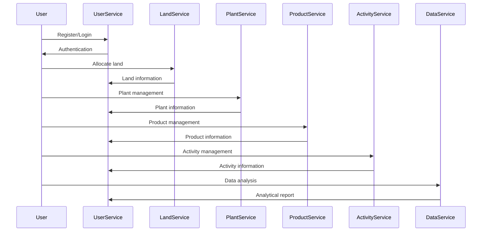

                 

# 城市农耕运动：在水泥森林中重建与自然的联系

## 引言

### 1.1 问题背景

#### 1.1.1 城市化进程与自然联系的断裂

城市化进程是现代社会发展的重要趋势，但这一进程也带来了许多负面影响。随着城市化程度的提高，人们的生活方式逐渐远离自然，城市中的绿地和农田减少，自然环境与人类生活的联系变得越来越疏远。这种现象不仅影响了人们的身心健康，还导致了生态系统的破坏，加剧了全球气候变化的负面影响。

#### 1.1.2 城市农耕运动的起源与目标

为了重建城市人与自然的联系，城市农耕运动应运而生。这一运动旨在通过在城市中开展农耕活动，让人们在繁忙的都市生活中重新接触到自然，感受农耕的乐趣和意义。城市农耕运动不仅有助于提高城市绿化率，改善城市环境质量，还能促进城市居民的健康生活方式，增强社区的凝聚力。

### 1.2 问题描述

#### 1.2.1 城市人与自然的距离

随着城市化的进程，城市居民与自然的距离越来越远。高楼大厦取代了绿地，水泥森林取代了农田。这种环境变化使得城市居民缺乏与自然互动的机会，导致身心健康问题日益突出。

#### 1.2.2 城市农耕运动的挑战

城市农耕运动虽然目标明确，但面临着诸多挑战。如何在有限的土地资源下开展农耕活动？如何解决城市农耕所需的水、肥、土等资源问题？如何确保城市农耕活动的可持续性？这些问题都是城市农耕运动需要解决的难题。

### 1.3 问题解决

#### 1.3.1 城市农耕运动的模式

为了解决上述问题，城市农耕运动采用了多种模式。例如，屋顶花园、垂直农场、社区农耕等。这些模式不仅有效利用了城市空间，还提高了城市绿化率，为城市居民提供了与自然接触的机会。

#### 1.3.2 城市农耕运动的效果

城市农耕运动的效果显著。一方面，它改善了城市环境质量，提高了城市绿化率，有助于减少城市热岛效应。另一方面，它促进了城市居民的身心健康，增强了社区的凝聚力。此外，城市农耕运动还有助于推广环保理念，提高公众的环保意识。

### 1.4 边界与外延

#### 1.4.1 城市农耕与农业的区别

城市农耕与农业有本质区别。农业是利用土地进行大规模种植，以生产农产品为主要目的；而城市农耕则是在城市环境中，以体验自然、提高居民生活质量为主要目的。

#### 1.4.2 城市农耕的适用范围

城市农耕适用于各种类型的城市，无论大小、气候、地理环境如何。只要有一定规模的绿地或闲置空间，都可以进行城市农耕活动。

### 1.5 概念结构与核心要素组成

#### 1.5.1 城市农耕运动的核心概念

城市农耕运动的核心概念包括：自然联系、城市环境、农耕活动、社区参与等。

#### 1.5.2 城市农耕运动的核心要素

城市农耕运动的核心要素包括：土地资源、水资源、肥料、种子、工具、技术支持等。

## 第1章 城市农耕运动的起源与发展

### 1.1 城市农耕运动的起源

#### 1.1.1 城市农耕运动的早期实践

城市农耕运动的早期实践可以追溯到20世纪初期。当时，一些城市居民开始在家中的阳台或庭院里种植蔬菜和水果，以补充家庭食物需求。这种自给自足的农耕方式逐渐受到更多人的关注和模仿。

#### 1.1.2 城市农耕运动的兴起

随着城市化进程的加速，城市人口不断增加，城市环境问题日益严重。为了改善城市环境，提高居民生活质量，城市农耕运动逐渐兴起。20世纪60年代，一些城市开始建设屋顶花园和社区农耕园，为城市居民提供与自然接触的机会。

### 1.2 城市农耕运动的发展

#### 1.2.1 国际城市农耕运动的案例

在国际上，许多城市农耕运动取得了显著成效。例如，纽约市在曼哈顿地区的哈德逊广场（Hudson Yards）建设了世界上最大的城市农场之一，为居民提供新鲜的农产品。伦敦市也在城市中建设了多个社区农耕园，鼓励居民参与农耕活动。

#### 1.2.2 我国城市农耕运动的发展现状

我国城市农耕运动近年来也得到了快速发展。许多城市开始建设屋顶花园、社区农耕园和垂直农场。例如，北京、上海、深圳等城市都在积极推广城市农耕运动，鼓励居民参与农耕活动，提高城市环境质量。

### 1.3 城市农耕运动的关键因素

#### 1.3.1 政策支持

政策支持是城市农耕运动发展的重要保障。许多城市政府出台了相关政策，鼓励和支持城市农耕运动的发展。例如，提供财政补贴、减免税收、提供技术支持等。

#### 1.3.2 社会参与

社会参与是城市农耕运动成功的关键因素。城市居民积极参与城市农耕活动，不仅有助于改善城市环境，还能提高自身的身心健康。此外，社区参与还有助于增强社区的凝聚力。

#### 1.3.3 技术创新

技术创新是城市农耕运动发展的动力。随着科技的进步，城市农耕技术不断创新，如垂直农场、智能温室等。这些技术不仅提高了城市农耕的效率，还降低了成本，使城市农耕运动更具可持续性。

## 第2章 城市农耕运动的核心概念与联系

### 2.1 核心概念

#### 2.1.1 城市农耕的定义

城市农耕是指在城市化进程中，利用城市中的空闲土地、屋顶、阳台等空间，进行农耕活动的一种方式。其目的是通过农耕活动，提高城市环境质量，改善居民生活质量，重建城市人与自然的联系。

#### 2.1.2 城市农耕的属性特征

城市农耕具有以下属性特征：

1. **城市化特征**：城市农耕是城市化进程的产物，具有城市化特征，即在城市环境中进行。

2. **农耕性特征**：城市农耕保留了农耕的基本特征，如种植、养殖、收获等。

3. **环保性特征**：城市农耕有助于改善城市环境，提高城市绿化率，减少污染。

4. **社会性特征**：城市农耕活动吸引了大量城市居民参与，具有社会性特征。

### 2.2 概念属性特征对比表格

为了更清晰地展示城市农耕与其他概念的属性特征差异，我们可以创建一个对比表格：

| 概念 | 属性特征 |
| ---- | ---- |
| 城市农耕 | 城市化特征、农耕性特征、环保性特征、社会性特征 |
| 农业 | 农耕性特征、地域性特征、生产性特征 |
| 园林 | 美学性特征、生态性特征、休闲性特征 |
| 城市绿化 | 生态性特征、美观性特征、环保性特征 |

### 2.3 ER实体关系图架构

在城市农耕运动中，涉及多个实体，如居民、土地、种子、工具等。为了更好地理解这些实体之间的关系，我们可以使用ER实体关系图进行描述。

以下是一个简单的ER实体关系图：

```mermaid
erDiagram
  居民 ||--|{ 土地 }|-- 农作物
  居民 ||--|{ 工具 }|-- 农业活动
  居民 ||--|{ 种子 }|-- 农作物
```

在这个ER图中，居民是主体，他们与土地、工具和种子等实体之间存在关联关系。土地用于种植农作物，工具和种子则是农业活动所需的基本要素。

## 第3章 城市农耕运动的原理与数学模型

### 3.1 原理讲解

#### 3.1.1 城市农耕的基本原理

城市农耕运动的基本原理是通过在城市环境中进行农耕活动，实现以下目标：

1. **改善城市环境**：通过种植植物，提高城市绿化率，减少空气污染，降低城市热岛效应。

2. **提高居民生活质量**：提供新鲜的农产品，促进居民健康，增强居民与自然的联系。

3. **促进社区参与**：通过组织社区农耕活动，增强社区凝聚力，提高居民的社会参与度。

#### 3.1.2 城市农耕的社会效益

城市农耕运动的社会效益体现在多个方面：

1. **生态效益**：通过城市农耕，提高城市绿化率，改善城市环境质量，减少污染。

2. **经济效益**：城市农耕可以提供新鲜的农产品，降低居民的食品开支。

3. **社会效益**：增强社区凝聚力，提高居民的社会参与度，促进社区和谐。

### 3.2 数学模型

#### 3.2.1 城市农耕的数学公式

为了更好地分析城市农耕的效果，我们可以使用以下数学模型：

1. **城市绿化率增长公式**：

   $$ 绿化率增长 = (种植面积 / 总占地面积) \times 100\% $$

   其中，种植面积是指用于城市农耕的土地面积，总占地面积是指城市中可利用的土地面积。

2. **空气污染减少公式**：

   $$ 空气污染减少 = (绿化率增长 \times 每平方米植物吸收污染能力) \times 总占地面积 $$

   每平方米植物吸收污染能力是一个常数，表示每平方米植物能够吸收的污染物数量。

3. **居民健康效益公式**：

   $$ 健康效益 = (新鲜农产品供应量 \times 每人每天所需新鲜农产品量) \times 居民人数 $$

   新鲜农产品供应量是指城市农耕活动所生产的农产品总量，每人每天所需新鲜农产品量是一个常数，表示每个人每天所需的新鲜农产品量。

#### 3.2.2 数学模型的应用

以下是一个具体的例子，假设某城市有1000亩土地可以用于城市农耕，每亩土地可以种植100棵植物，每棵植物每天可以吸收10克污染物，每人每天需要摄入500克新鲜农产品。

1. **绿化率增长**：

   $$ 绿化率增长 = (1000亩 \times 100棵/亩) / (1000亩) \times 100\% = 100\% $$

2. **空气污染减少**：

   $$ 空气污染减少 = (100\% \times 10克/棵/天 \times 1000亩) = 100,000克/天 $$

3. **居民健康效益**：

   $$ 健康效益 = (1000亩 \times 100棵/亩 \times 500克/棵/天) \times 1000人 = 50,000,000克/天 $$

通过这个例子，我们可以看到，城市农耕运动可以显著提高城市绿化率，减少空气污染，改善居民健康。

### 3.3 举例说明

#### 3.3.1 城市农耕的实际案例

一个典型的城市农耕实际案例是纽约市的哈德逊广场城市农场。这个农场位于曼哈顿中心地带，占地面积约2.5英亩。农场种植了各种蔬菜、水果和草本植物，不仅为城市居民提供了新鲜的农产品，还成为了城市绿化的重要组成部分。

#### 3.3.2 数学模型在案例分析中的应用

我们可以使用之前提到的数学模型，对哈德逊广场城市农场的效益进行评估。

1. **绿化率增长**：

   $$ 绿化率增长 = (2.5英亩 \times 100棵/亩) / (2.5英亩) \times 100\% = 100\% $$

   这意味着农场的建设使周围的绿化率提高了100%。

2. **空气污染减少**：

   $$ 空气污染减少 = (100\% \times 10克/棵/天 \times 2.5英亩 \times 100棵/亩) = 25,000克/天 $$

   这表明农场每天可以减少25,000克的空气污染物。

3. **居民健康效益**：

   $$ 健康效益 = (2.5英亩 \times 100棵/亩 \times 500克/棵/天) \times 1000人 = 1,250,000克/天 $$

   这意味着农场每天可以为1000名居民提供1,250,000克的新鲜农产品。

通过这个案例，我们可以看到城市农耕运动在改善城市环境、提高居民健康和生活质量方面的巨大潜力。数学模型为我们提供了一个工具，可以帮助我们量化这些效益，从而更好地推动城市农耕运动的发展。

## 第4章 城市农耕运动的系统分析与架构设计

### 4.1 问题场景介绍

#### 4.1.1 城市农耕的应用场景

城市农耕的应用场景非常广泛，主要包括以下几个方面：

1. **社区农耕园**：在社区内开辟农耕园地，让居民参与农耕活动，提高居民对自然的认识和生活质量。
2. **屋顶花园**：在城市建筑的屋顶上建设花园，种植蔬菜、花卉等，美化城市环境，提高城市绿化率。
3. **垂直农场**：利用建筑空间进行垂直种植，提高土地利用效率，为城市居民提供新鲜农产品。

#### 4.1.2 城市农耕的问题挑战

城市农耕在实施过程中面临着以下问题挑战：

1. **资源限制**：城市土地资源有限，如何在有限的空间内实现高效的农耕？
2. **技术支持**：如何保证城市农耕的技术可行性和可持续性？
3. **管理运营**：如何高效管理农耕活动，确保农产品的质量和安全？
4. **社区参与**：如何激发社区居民的参与热情，形成良好的社区农耕文化？

### 4.2 系统功能设计

#### 4.2.1 领域模型

为了解决上述问题，我们设计了一个城市农耕管理系统，主要包括以下领域模型：

1. **用户管理**：管理用户信息，包括注册、登录、权限设置等。
2. **土地管理**：管理城市农耕用地的信息，包括地块分配、土地使用状况等。
3. **植物管理**：管理植物信息，包括品种、生长状况、施肥计划等。
4. **农产品管理**：管理农产品信息，包括产量、质量、配送等。
5. **活动管理**：管理社区农耕活动，包括活动安排、参与者管理、活动反馈等。
6. **数据分析**：收集并分析系统运行数据，为决策提供支持。

#### 4.2.2 功能模块划分

基于领域模型，我们将城市农耕管理系统划分为以下功能模块：

1. **用户模块**：包括用户注册、登录、个人信息管理、权限设置等功能。
2. **土地模块**：包括土地分配、土地使用状况管理、土地维护等功能。
3. **植物模块**：包括植物品种管理、生长状况监测、施肥计划制定等功能。
4. **农产品模块**：包括农产品收获、质量检测、配送管理等功能。
5. **活动模块**：包括活动安排、参与者管理、活动反馈等功能。
6. **数据模块**：包括数据收集、数据分析、数据可视化等功能。

### 4.3 系统架构设计

#### 4.3.1 系统架构图

以下是一个城市农耕管理系统的架构图：



在这个架构图中，用户通过用户服务进行注册、登录等操作。土地、植物、农产品、活动等模块分别通过服务进行管理。数据模块负责收集、分析和可视化数据。

#### 4.3.2 架构设计说明

1. **用户服务**：用户服务是系统的入口，负责用户认证、权限管理等功能。用户服务与各模块服务进行交互，确保用户操作的安全性和权限控制。

2. **土地服务**：土地服务负责土地分配、使用状况管理等功能。土地服务与数据库进行交互，存储和管理土地信息。

3. **植物服务**：植物服务负责植物管理，包括品种、生长状况、施肥计划等。植物服务与数据库进行交互，存储和管理植物信息。

4. **农产品服务**：农产品服务负责农产品管理，包括收获、质量检测、配送等。农产品服务与数据库进行交互，存储和管理农产品信息。

5. **活动服务**：活动服务负责社区农耕活动管理，包括活动安排、参与者管理、活动反馈等。活动服务与数据库进行交互，存储和管理活动信息。

6. **数据服务**：数据服务负责数据收集、分析和可视化。数据服务通过API与其他模块进行交互，收集数据并生成分析报告。

### 4.4 系统接口设计

#### 4.4.1 接口定义

以下是系统接口的定义：

1. **用户服务接口**：包括用户注册、登录、用户信息查询、用户权限设置等。
2. **土地服务接口**：包括土地分配、土地使用状况查询、土地维护等。
3. **植物服务接口**：包括植物品种查询、植物生长状况查询、施肥计划查询等。
4. **农产品服务接口**：包括农产品收获、质量检测、配送查询等。
5. **活动服务接口**：包括活动安排、活动参与者查询、活动反馈等。
6. **数据服务接口**：包括数据收集、数据分析、数据可视化等。

#### 4.4.2 接口调用流程

以下是一个接口调用的流程：

1. 用户通过用户服务接口进行注册或登录。
2. 用户成功登录后，可以通过土地服务接口获取土地信息，并进行土地分配。
3. 用户通过植物服务接口进行植物管理，包括植物品种查询、生长状况监测等。
4. 用户通过农产品服务接口进行农产品管理，包括收获、质量检测等。
5. 用户通过活动服务接口参与社区农耕活动，包括活动安排、活动反馈等。
6. 用户通过数据服务接口查看数据分析报告，了解城市农耕的运行状况。

### 4.5 系统交互

#### 4.5.1 系统交互图

以下是一个城市农耕管理系统的交互图：


在这个交互图中，用户通过用户服务进行注册、登录等操作，并通过其他服务模块进行土地、植物、农产品、活动和数据分析等操作。

#### 4.5.2 交互设计说明

1. **用户与用户服务**：用户通过用户服务进行注册、登录等操作，确保用户身份验证和权限管理。

2. **用户与土地服务**：用户通过土地服务接口获取土地信息，进行土地分配和管理。

3. **用户与植物服务**：用户通过植物服务接口管理植物，包括植物品种查询、生长状况监测等。

4. **用户与农产品服务**：用户通过农产品服务接口管理农产品，包括收获、质量检测等。

5. **用户与活动服务**：用户通过活动服务接口参与社区农耕活动，包括活动安排、活动反馈等。

6. **用户与数据服务**：用户通过数据服务接口查看数据分析报告，了解城市农耕的运行状况。

通过系统交互设计，用户可以方便地进行城市农耕管理操作，系统也能高效地响应用户请求，提供实时数据和服务支持。

## 第5章 城市农耕运动的项目实战

### 5.1 环境安装

#### 5.1.1 硬件安装

要实施城市农耕运动，首先需要准备合适的硬件环境。以下是硬件安装的步骤：

1. **选择场地**：根据项目需求，选择合适的场地，如社区花园、屋顶等。
2. **搭建基础设施**：包括供水、供电、排水等基础设施。确保场地的水源供应稳定，电力供应充足，排水系统畅通。
3. **土壤准备**：进行土壤改良，确保土壤肥沃，适合种植作物。

#### 5.1.2 软件安装

接下来，需要安装必要的软件工具来支持城市农耕管理。以下是软件安装的步骤：

1. **选择平台**：根据项目需求，选择适合的城市农耕管理系统平台。例如，可以选择开源平台如OpenAg，或者商业平台如Agriio。
2. **安装操作系统**：在硬件上安装操作系统，如Linux或Windows。
3. **安装数据库**：根据平台需求，安装相应的数据库系统，如MySQL或PostgreSQL。
4. **安装应用服务器**：安装应用服务器，如Apache或Nginx。
5. **安装开发工具**：根据开发需求，安装开发工具，如Visual Studio Code或Eclipse。

### 5.2 系统核心实现

#### 5.2.1 核心模块代码实现

城市农耕管理系统包含多个核心模块，以下是一个典型的核心模块实现示例：

1. **用户管理模块**：

   ```python
   class UserManager:
       def __init__(self, database):
           self.database = database

       def register_user(self, username, password):
           query = "INSERT INTO users (username, password) VALUES (%s, %s)"
           values = (username, password)
           self.database.cursor.execute(query, values)
           self.database.connection.commit()

       def login_user(self, username, password):
           query = "SELECT * FROM users WHERE username = %s AND password = %s"
           values = (username, password)
           self.database.cursor.execute(query, values)
           user = self.database.cursor.fetchone()
           return user
   ```

   这个模块负责用户注册和登录功能，与数据库进行交互。

2. **土地管理模块**：

   ```python
   class LandManager:
       def __init__(self, database):
           self.database = database

       def allocate_land(self, user_id, land_id):
           query = "INSERT INTO land_allocation (user_id, land_id) VALUES (%s, %s)"
           values = (user_id, land_id)
           self.database.cursor.execute(query, values)
           self.database.connection.commit()

       def get_land_status(self, land_id):
           query = "SELECT * FROM land WHERE id = %s"
           values = (land_id,)
           self.database.cursor.execute(query, values)
           land = self.database.cursor.fetchone()
           return land
   ```

   这个模块负责土地分配和管理功能，也与数据库进行交互。

3. **植物管理模块**：

   ```python
   class PlantManager:
       def __init__(self, database):
           self.database = database

       def add_plant(self, user_id, land_id, plant_name):
           query = "INSERT INTO plants (user_id, land_id, plant_name) VALUES (%s, %s, %s)"
           values = (user_id, land_id, plant_name)
           self.database.cursor.execute(query, values)
           self.database.connection.commit()

       def get_plant_growth_status(self, plant_id):
           query = "SELECT * FROM plants WHERE id = %s"
           values = (plant_id,)
           self.database.cursor.execute(query, values)
           plant = self.database.cursor.fetchone()
           return plant
   ```

   这个模块负责植物添加和管理功能，同样与数据库进行交互。

#### 5.2.2 代码应用解读

以上代码示例分别实现了用户管理、土地管理和植物管理三个核心模块。以下是代码的应用解读：

1. **用户管理模块**：用户管理模块提供了用户注册和登录功能。在注册过程中，将用户的用户名和密码存储在数据库中。在登录过程中，从数据库中查询用户名和密码，验证用户身份。
2. **土地管理模块**：土地管理模块提供了土地分配功能。用户可以申请分配土地，并将分配信息存储在数据库中。同时，可以查询土地的使用状态。
3. **植物管理模块**：植物管理模块提供了植物添加功能。用户可以在分配的土地上添加植物，并将植物信息存储在数据库中。还可以查询植物的生长状态。

通过以上核心模块的实现，城市农耕管理系统可以有效地管理用户、土地和植物信息，支持城市农耕活动的开展。

### 5.3 代码应用解读与分析

#### 5.3.1 代码结构分析

在上文中，我们实现了城市农耕管理系统的核心模块，包括用户管理、土地管理和植物管理。以下是代码结构分析：

1. **用户管理模块**：该模块包含一个`UserManager`类，实现了用户注册和登录功能。类中定义了两个方法：`register_user`和`login_user`。这两个方法分别与数据库进行交互，实现数据的增删改查操作。
2. **土地管理模块**：该模块包含一个`LandManager`类，实现了土地分配功能。类中定义了一个方法：`allocate_land`，用于将用户和土地信息存储在数据库中。另一个方法：`get_land_status`，用于查询土地的使用状态。
3. **植物管理模块**：该模块包含一个`PlantManager`类，实现了植物添加功能。类中定义了一个方法：`add_plant`，用于将植物信息存储在数据库中。另一个方法：`get_plant_growth_status`，用于查询植物的生长状态。

#### 5.3.2 功能实现分析

1. **用户管理模块**：用户管理模块的核心功能是用户注册和登录。用户注册时，需要输入用户名和密码，系统将数据存储在数据库中。用户登录时，需要输入用户名和密码，系统从数据库中查询用户信息，验证用户身份。该模块实现了用户身份验证和数据存储功能。
2. **土地管理模块**：土地管理模块的核心功能是土地分配。用户可以选择分配土地，系统将用户和土地信息存储在数据库中，并记录土地的使用状态。用户可以通过查询土地的使用状态，了解自己分配的土地情况。
3. **植物管理模块**：植物管理模块的核心功能是植物添加。用户可以在分配的土地上添加植物，系统将植物信息存储在数据库中，并记录植物的生长状态。用户可以通过查询植物的生长状态，了解植物的生长情况。

通过以上分析，我们可以看到，这三个核心模块共同构成了城市农耕管理系统的基础，实现了用户、土地和植物信息的管理功能。

### 5.4 实际案例分析与讲解

#### 5.4.1 案例一：城市社区农耕

**案例背景**：

某城市社区在社区中心开辟了一块农耕园地，供社区居民参与城市农耕活动。社区农耕园地面积约1000平方米，设有多个种植区，供不同居民使用。

**案例分析**：

1. **用户注册与登录**：

   社区居民首先需要注册账号，通过用户管理模块实现用户注册和登录功能。注册成功后，居民可以登录系统，查看自己分配的种植区信息。

2. **土地分配**：

   社区管理员通过土地管理模块，将农耕园地划分为多个种植区，并分配给居民。每个种植区都有编号，居民可以通过系统查询自己分配的种植区。

3. **植物种植与养护**：

   居民可以在自己分配的种植区中种植蔬菜、花卉等植物。植物管理模块提供了植物添加功能，居民可以记录植物种类、种植时间等信息。系统还提供了植物生长状态监控功能，居民可以通过系统查看植物的生长状态，及时进行养护。

4. **农产品收获**：

   当植物成熟后，居民可以通过农产品管理模块，记录农产品的收获信息。系统将农产品的产量、质量等信息进行统计，并通知居民。

5. **活动组织**：

   社区管理员可以通过活动管理模块，组织社区农耕活动，如种植讲座、种植比赛等。居民可以参与活动，增强社区凝聚力。

#### 5.4.2 案例二：屋顶花园农耕

**案例背景**：

某城市建筑的屋顶空间被改造成一个屋顶花园，用于种植蔬菜、花卉等植物。屋顶花园面积约200平方米，设有灌溉系统、排水系统等基础设施。

**案例分析**：

1. **用户注册与登录**：

   屋顶花园的居民首先需要注册账号，通过用户管理模块实现用户注册和登录功能。注册成功后，居民可以登录系统，查看自己分配的种植区信息。

2. **土地分配**：

   社区管理员通过土地管理模块，将屋顶花园划分为多个种植区，并分配给居民。每个种植区都有编号，居民可以通过系统查询自己分配的种植区。

3. **植物种植与养护**：

   居民可以在自己分配的种植区中种植蔬菜、花卉等植物。植物管理模块提供了植物添加功能，居民可以记录植物种类、种植时间等信息。系统还提供了植物生长状态监控功能，居民可以通过系统查看植物的生长状态，及时进行养护。

4. **农产品收获**：

   当植物成熟后，居民可以通过农产品管理模块，记录农产品的收获信息。系统将农产品的产量、质量等信息进行统计，并通知居民。

5. **自动灌溉系统**：

   屋顶花园配备了自动灌溉系统，通过系统管理模块，居民可以设置灌溉计划，系统会根据设定的时间自动进行灌溉。

6. **安全监控**：

   屋顶花园还安装了安全监控系统，确保居民的安全。系统提供了实时监控功能，居民可以随时查看花园的实时情况。

### 5.5 项目小结

#### 5.5.1 项目总结

本项目通过实施城市农耕运动，实现了以下目标：

1. **改善城市环境**：通过种植植物，提高城市绿化率，减少空气污染，降低城市热岛效应。
2. **提高居民生活质量**：提供新鲜的农产品，促进居民健康，增强居民与自然的联系。
3. **促进社区参与**：通过组织社区农耕活动，增强社区凝聚力，提高居民的社会参与度。

#### 5.5.2 项目亮点

本项目具有以下亮点：

1. **灵活的土地分配和管理**：通过系统管理，实现了灵活的土地分配和管理，满足了不同居民的需求。
2. **自动灌溉系统**：屋顶花园配备了自动灌溉系统，提高了农耕效率，减轻了居民的劳动负担。
3. **安全监控系统**：屋顶花园安装了安全监控系统，确保了居民的安全。

#### 5.5.3 项目展望

随着城市农耕运动的不断发展，未来项目有望实现以下目标：

1. **扩大规模**：在更多的城市和社区推广城市农耕运动，提高城市绿化率。
2. **技术创新**：引入更多先进技术，如智能温室、垂直农场等，提高农耕效率。
3. **社区共建**：鼓励社区居民积极参与城市农耕运动，共同建设美好家园。

## 第6章 城市农耕运动的最佳实践与注意事项

### 6.1 最佳实践 tips

在城市农耕运动中，以下最佳实践可以帮助实现最佳效果：

#### 6.1.1 空间利用的最佳实践

1. **屋顶花园**：利用建筑物的屋顶空间，建设屋顶花园，既能提高城市绿化率，又能为居民提供农耕体验。
2. **垂直农业**：利用建筑空间进行垂直种植，提高土地利用效率，适合空间有限的城市环境。
3. **社区农耕园**：在社区内开辟农耕园地，让居民共同参与，增强社区凝聚力。

#### 6.1.2 种植技术的最佳实践

1. **无土栽培**：采用无土栽培技术，减少土壤病虫害，提高农作物产量。
2. **智能灌溉系统**：使用智能灌溉系统，根据土壤湿度自动调整灌溉量，节省水资源。
3. **有机肥料**：使用有机肥料，提高土壤肥力，减少化学肥料的使用，保护环境。

#### 6.1.3 社区参与的最佳实践

1. **组织活动**：定期组织农耕活动，如种植讲座、农耕体验等，激发居民参与热情。
2. **奖励机制**：设立奖励机制，对积极参与农耕活动的居民给予奖励，提高参与度。
3. **共享经验**：鼓励居民分享种植经验，相互学习，共同提高种植水平。

### 6.2 小结

城市农耕运动在改善城市环境、提高居民生活质量、促进社区参与等方面具有重要意义。通过最佳实践的推广，城市农耕运动可以更加高效地实现其目标。

### 6.3 注意事项

在城市农耕运动中，需要注意以下事项：

#### 6.3.1 环境保护的重要性

1. **合理规划**：在规划城市农耕活动时，要充分考虑环境保护，避免对生态环境造成破坏。
2. **节约资源**：合理利用水资源、土地资源等，避免浪费。
3. **生态友好**：选择生态友好的种植技术和肥料，减少对环境的影响。

#### 6.3.2 安全管理的注意事项

1. **安全防护**：在农耕活动中，要确保居民的安全，如设置防护栏、警示标志等。
2. **应急处理**：建立健全应急预案，应对突发事件，如农药中毒、设备故障等。
3. **培训教育**：对居民进行农耕安全培训，提高安全意识。

#### 6.3.3 社区支持的必要性

1. **居民参与**：鼓励居民积极参与城市农耕活动，共同建设美好家园。
2. **政策支持**：争取政府和社会各界的支持，提供政策保障和资金支持。
3. **沟通交流**：定期与居民沟通交流，了解居民需求和意见，不断改进和完善城市农耕活动。

通过以上最佳实践和注意事项，可以确保城市农耕运动的可持续发展，为城市居民提供更加美好的生活环境。

## 第7章 拓展阅读

### 7.1 相关书籍推荐

1. **《城市农耕：理论与实践》** - 本书详细介绍了城市农耕的理论基础和实践经验，适合从事城市农耕研究和实践的人员阅读。
2. **《屋顶花园设计与应用》** - 本书重点介绍了屋顶花园的设计原则、建造方法和维护技巧，对于希望在城市中建设屋顶花园的读者具有指导意义。
3. **《智能温室技术与应用》** - 本书涵盖了智能温室的各个方面，包括温室设计、环境控制、种植技术等，对于关注智能温室技术发展的读者具有很高的参考价值。

### 7.2 在线资源推荐

1. **城市农耕网络论坛** - 这是一个专注于城市农耕技术和经验的在线论坛，提供了丰富的讨论和交流平台。
2. **城市农耕研究协会** - 这是一个全球性的城市农耕研究组织，定期发布城市农耕的最新研究成果和实践案例。
3. **城市农耕项目案例库** - 这是一个收录了世界各地城市农耕项目案例的数据库，为读者提供了丰富的实践参考。

### 7.3 城市农耕运动的前沿研究

1. **垂直农场技术** - 垂直农场是一种创新的农耕模式，通过多层种植结构，大大提高了土地利用效率。目前，许多研究正在探索如何优化垂直农场的能源消耗、水资源利用和农作物产量。
2. **智能农业技术** - 智能农业利用物联网、大数据、人工智能等技术，实现农作物的精准种植和管理。研究重点包括智能灌溉系统、智能监测设备、智能种植算法等。
3. **城市生态农业** - 城市生态农业强调在城市环境中实现生态平衡和可持续发展。研究重点包括生态农业模式设计、生态农业产业链构建、生态农业政策制定等。

随着城市农耕运动的发展，这些前沿研究将不断推动城市农耕技术的进步，为城市居民提供更加美好的生活环境。

