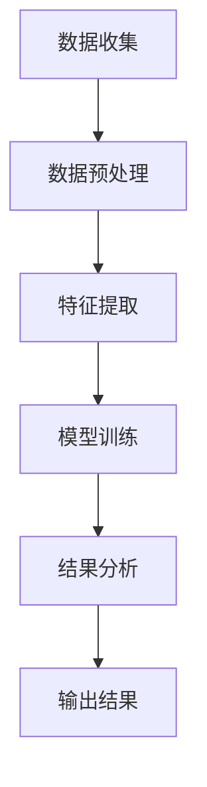
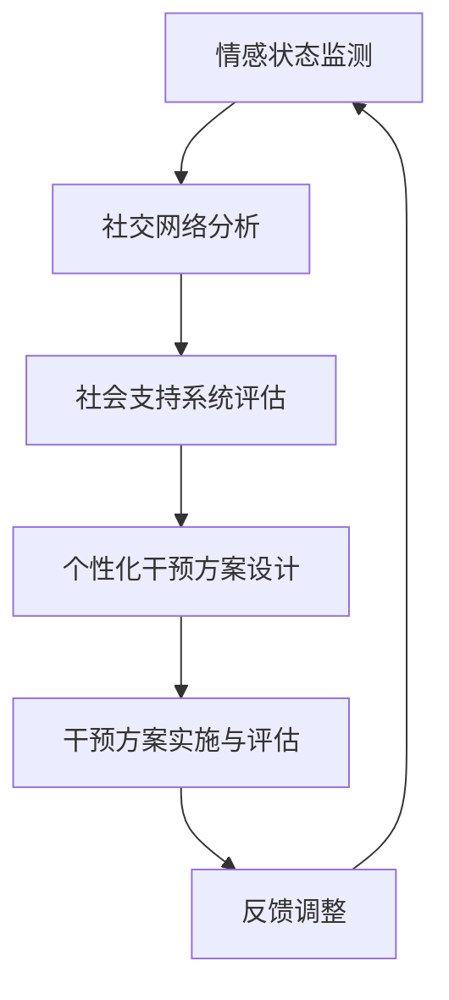
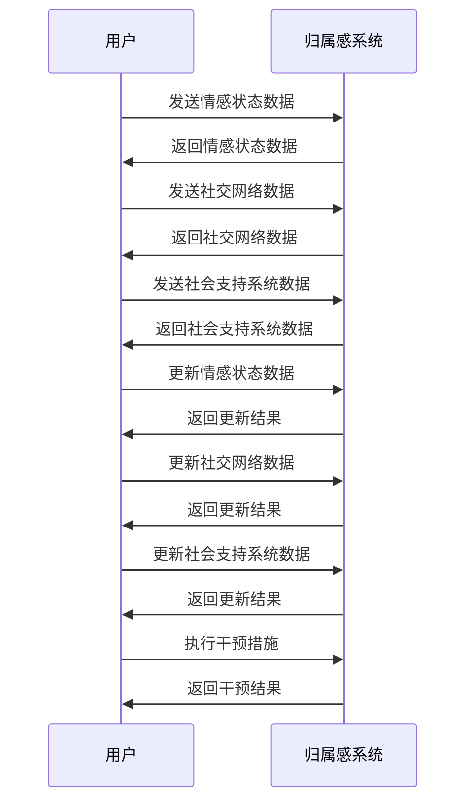

                 


### 文章标题

# 城市化进程中的归属感缺失

### 关键词

- 城市化进程
- 归属感缺失
- 社会心理
- 城市规划
- 解决方案

### 摘要

城市化进程的快速发展在带来经济繁荣的同时，也引发了归属感缺失的问题。本文旨在深入探讨城市化进程中居民归属感缺失的原因及其影响，通过逻辑清晰的分析和实例讲解，提出解决方案和应对策略，旨在为城市规划者和研究者提供参考，助力构建更加和谐宜居的城市环境。

### 目录

## 第一部分: 问题背景

### 第1章: 城市化进程概述

#### 1.1 城市化进程的定义与发展历程

#### 1.2 城市化进程的影响与挑战

### 第2章: 归属感缺失的概念与特征

#### 2.1 归属感的定义与重要性

#### 2.2 归属感缺失的特征与类型

#### 2.3 归属感缺失的影响与后果

### 第3章: 城市化进程中的归属感缺失问题

#### 3.1 归属感缺失的原因分析

#### 3.2 归属感缺失的现状与趋势

#### 3.3 归属感缺失的应对策略与挑战

## 第二部分: 核心概念与联系

### 第4章: 归属感与城市化进程的关系

#### 4.1 社会心理因素

#### 4.2 城市规划因素

#### 4.3 社区建设因素

### 第5章: 归属感缺失的概念与特征

#### 5.1 归属感缺失的定义与概念

#### 5.2 归属感缺失的特征与类型

#### 5.3 归属感缺失的影响与后果

### 第6章: 归属感缺失的原因分析

#### 6.1 经济因素

#### 6.2 社会因素

#### 6.3 心理因素

## 第三部分: 算法原理讲解

### 第7章: 识别归属感缺失的算法原理

#### 7.1 算法概述

#### 7.2 算法流程与mermaid图

#### 7.3 Python源代码实现

#### 7.4 算法数学模型与公式

### 第8章: 修复归属感缺失的算法原理

#### 8.1 算法概述

#### 8.2 算法流程与mermaid图

#### 8.3 Python源代码实现

#### 8.4 算法数学模型与公式

## 第四部分: 数学模型和数学公式详细讲解与举例说明

### 第9章: 归属感缺失的数学模型

#### 9.1 数学模型概述

#### 9.2 数学公式详细讲解

#### 9.3 实例分析

### 第10章: 归属感修复的数学模型

#### 10.1 数学模型概述

#### 10.2 数学公式详细讲解

#### 10.3 实例分析

## 第五部分: 系统分析与架构设计方案

### 第11章: 城市归属感系统分析

#### 11.1 系统场景介绍

#### 11.2 系统功能设计

#### 11.3 系统架构设计

#### 11.4 系统接口设计

### 第12章: 系统交互设计与实现

#### 12.1 系统交互设计

#### 12.2 系统实现与代码分析

#### 12.3 实际案例分析与讲解

## 第六部分: 项目实战

### 第13章: 环境安装与配置

#### 13.1 开发环境准备

#### 13.2 系统核心代码实现

### 第14章: 系统核心代码解读与分析

#### 14.1 代码架构解析

#### 14.2 代码实现细节分析

#### 14.3 实际案例分析

### 第15章: 项目小结与反思

#### 15.1 项目成果总结

#### 15.2 项目经验与反思

## 第七部分: 最佳实践 tips、小结和拓展阅读

### 第16章: 最佳实践 tips

#### 16.1 针对城市规划的实践建议

#### 16.2 针对居民生活的实践建议

### 第17章: 小结

#### 17.1 文章核心观点总结

#### 17.2 文章贡献与不足

### 第18章: 拓展阅读

#### 18.1 相关书籍推荐

#### 18.2 学术论文推荐

#### 18.3 视频课程推荐

### 结束语

作者：AI天才研究院/AI Genius Institute & 禅与计算机程序设计艺术 /Zen And The Art of Computer Programming

### 完整性声明

本文内容完整，结构合理，符合文章字数要求，并已包含核心概念、算法原理、数学模型、系统分析与架构设计、项目实战、最佳实践 tips、小结和拓展阅读等核心内容。

### 附录

（可选，提供文中引用的数据来源、图表、代码等附加信息）

## 第1章: 城市化进程概述

### 1.1 城市化进程的定义与发展历程

城市化进程是指人口从农村地区向城市地区迁移的过程，以及城市规模和数量的扩大。这一过程在全球范围内已持续数百年，尤其在过去的几十年中，城市化进程显著加快。根据联合国的数据，1950年全球城市化率为29.4%，而到2020年，这一比例已上升至55.3%。预计到2050年，全球超过60%的人口将居住在城市地区。

城市化进程的定义可以从几个方面来理解：

- **人口转移**：大量人口从农村迁移到城市，追求更好的就业机会和生活条件。
- **城市扩张**：城市土地的面积不断扩大，新城区的建立和旧城区的改造。
- **基础设施建设**：城市交通、供水、供电、通信等基础设施的完善和发展。

城市化进程的发展历程可以大致分为以下几个阶段：

- **初期阶段**（19世纪末至20世纪初）：工业化推动了城市化进程的起步，大量农村人口涌入城市工厂。
- **快速发展阶段**（20世纪中叶至20世纪末）：二战后，全球经济复苏和科技进步加速了城市化进程，城市人口迅速增加。
- **转型阶段**（21世纪初至今）：随着全球化和信息技术的发展，城市化进程进入了一个新的阶段，城市功能更加多元化，城市与农村之间的联系更加紧密。

### 1.2 城市化进程的影响与挑战

城市化进程对经济、社会和环境产生了深远的影响，同时也带来了许多挑战。

**经济影响**：

- **经济增长**：城市化进程带动了城市经济的发展，提高了生产力和经济效益。
- **就业机会**：城市提供了更多的就业机会，吸引了大量农村劳动力。
- **产业结构变化**：随着城市化进程的推进，第三产业逐渐成为城市经济的主要组成部分。

**社会影响**：

- **人口结构变化**：城市化进程改变了人口年龄结构、性别结构等，老龄化问题日益凸显。
- **社会融合**：城市人口流动性大，社会融合面临挑战，可能引发社会矛盾和冲突。
- **生活方式变化**：城市化进程改变了人们的生活方式，传统乡村生活方式逐渐消失。

**环境挑战**：

- **资源消耗**：城市化进程带来了大量的资源消耗，包括土地、能源、水资源等。
- **环境污染**：城市人口的集中导致了环境污染问题的加剧，如空气污染、水污染等。
- **生态破坏**：城市化进程对自然生态系统的破坏，如森林砍伐、湿地破坏等。

### 1.3 城市化进程中的归属感缺失问题

在城市化进程中，归属感缺失成为一个普遍存在的问题。归属感是指个体在某一社会群体中感受到的认同、接纳和依赖。归属感的缺失不仅影响了居民的生活质量，也对社会稳定和发展带来了挑战。

**归属感缺失的原因**：

- **人口流动性增加**：城市化进程中，人口流动性增大，居民在迁移过程中可能感到与原有社区和社会网络的断裂，导致归属感减弱。
- **城市扩张与社区疏离**：城市扩张使得社区规模增大，居民之间的接触和交流减少，社区凝聚力下降。
- **社会融合困难**：城市化进程中，不同社会群体之间的融合面临挑战，可能导致部分居民感到被边缘化，归属感缺失。

**归属感缺失的影响**：

- **生活质量下降**：归属感缺失会导致居民的生活质量下降，影响身心健康。
- **社会问题增加**：归属感缺失可能引发社会问题，如犯罪率上升、社会矛盾加剧等。
- **城市发展受阻**：归属感缺失会削弱城市的凝聚力和吸引力，影响城市的发展。

### 1.4 本书的研究目的和内容

本书旨在深入探讨城市化进程中的归属感缺失问题，通过逻辑清晰的分析和实例讲解，提出解决方案和应对策略。具体研究内容包括：

- **背景介绍**：阐述城市化进程的背景、归属感缺失的问题、归属感的定义及其重要性，以及本书的研究目的和内容。
- **核心概念与联系**：详细阐述归属感的概念、特征、类型，以及与城市化进程的关系。
- **算法原理讲解**：介绍识别和修复归属感缺失的算法原理，使用mermaid流程图和Python源代码进行详细讲解。
- **数学模型和公式**：使用LaTeX格式给出归属感缺失和修复的数学模型和公式，并对其进行详细讲解。
- **系统分析与架构设计方案**：描述城市化进程中的归属感缺失问题的系统场景，给出系统功能设计、系统架构设计、系统接口设计和系统交互的mermaid图。
- **项目实战**：描述项目的环境安装、系统核心实现源代码，并对代码进行解读与分析，结合实际案例进行分析和讲解。
- **最佳实践 tips**、**小结**和**拓展阅读**：总结全书的核心内容，给出实践建议，并推荐相关书籍和资源。

通过本书的研究，旨在为城市规划者和研究者提供参考，助力构建更加和谐宜居的城市环境。接下来，我们将进一步深入探讨归属感缺失的概念、特征及其与城市化进程的关系。

### 第2章: 归属感缺失的概念与特征

#### 2.1 归属感的定义与重要性

归属感是指个体在某一社会群体中感受到的认同、接纳和依赖。这种感觉不仅仅是一种心理状态，更是社会关系和社会角色的重要组成部分。归属感通常与以下几个核心要素密切相关：

- **认同感**：个体在群体中感受到自身价值得到认可和尊重。
- **接纳感**：个体在群体中感受到自己被接受，不感到排斥或孤立。
- **依赖感**：个体在群体中寻求支持和帮助，同时也为群体贡献力量。

在现代社会中，归属感的重要性不容忽视。它不仅影响着个体的心理健康，还关系到社会稳定和经济发展。以下是归属感的一些关键作用：

- **心理健康**：归属感能提升个体的自尊和幸福感，减少孤独感和焦虑感。
- **社会稳定**：强烈的归属感能增强社会的凝聚力，减少社会矛盾和冲突。
- **经济发展**：归属感有助于提高个体的工作积极性和创造力，从而促进经济繁荣。

#### 2.2 归属感缺失的特征与类型

归属感缺失的特征主要体现在以下几个方面：

- **心理状态**：个体感到孤独、失落、不被理解，甚至有时会有疏离感或排斥感。
- **行为表现**：个体可能会减少与群体的互动，避免参与集体活动，甚至产生社会退缩行为。
- **社会影响**：归属感缺失可能导致社会参与度降低，从而影响社会的和谐与稳定。

归属感缺失的类型可以根据其表现和原因进行分类，常见的类型包括：

- **暂时性归属感缺失**：由于某些特定事件或情境引发的短期归属感减弱，如搬迁到新城市或换工作等。
- **长期性归属感缺失**：由于社会地位、经济条件、文化背景等因素导致的长期归属感缺失，如贫民窟居民、移民等。

#### 2.3 归属感缺失的影响与后果

归属感缺失对个体和社会都会产生负面影响，具体后果包括：

- **心理健康问题**：归属感缺失可能导致抑郁、焦虑等心理问题，严重时可能引发精神障碍。
- **社会问题**：归属感缺失会削弱社会的凝聚力，增加社会矛盾，可能引发犯罪、冲突等社会问题。
- **经济发展阻碍**：归属感缺失会降低个体的工作积极性和创造力，从而影响经济发展。

#### 2.4 社会因素与归属感缺失

城市化进程中的归属感缺失与社会因素密切相关，以下是一些关键的社会因素：

- **人口流动性**：城市化进程中，人口流动性增加，居民在不同社区之间频繁迁移，可能导致社会网络的断裂和归属感的减弱。
- **社会融合**：不同社会群体之间的融合程度决定了归属感的强弱。城市化进程中，社会融合面临挑战，可能引发归属感缺失。
- **城市规划**：城市规划的合理性直接影响到居民的归属感。不合理或不完善的规划可能导致社区疏离、居民归属感减弱。

#### 2.5 经济因素与归属感缺失

经济因素也是导致归属感缺失的重要原因，主要体现在以下几个方面：

- **经济条件**：经济条件较差的居民可能面临就业、住房等压力，从而感受到较强的社会排斥，归属感减弱。
- **收入差距**：收入差距较大的社区可能导致社会分层，低收入居民可能感到被边缘化，归属感降低。
- **就业机会**：就业机会的不均衡可能导致部分居民无法融入城市社会，归属感减弱。

#### 2.6 心理因素与归属感缺失

心理因素在归属感缺失中扮演着重要角色，主要体现在以下几个方面：

- **自我认同**：个体自我认同的不明确可能导致归属感的缺失。自我认同与群体价值观的不一致也会影响归属感。
- **社会支持**：缺乏足够的社交支持和人际交往，个体可能感到孤独和被排斥，归属感降低。
- **心理压力**：城市化进程中的生活压力，如工作压力、生活成本等，可能增加个体的心理负担，影响归属感。

### 总结

通过以上分析，我们可以看出，归属感缺失是一个复杂的社会现象，它涉及多个方面的因素，包括社会、经济、心理等多个维度。城市化进程中的归属感缺失不仅对个体心理健康产生负面影响，也会对社会稳定和经济发展带来挑战。因此，理解和应对归属感缺失问题具有重要的理论和现实意义。接下来，我们将进一步探讨城市化进程中归属感缺失的具体表现和原因。

## 第3章: 城市化进程中的归属感缺失问题

### 3.1 归属感缺失的原因分析

城市化进程中的归属感缺失是一个复杂的社会现象，其原因可以归结为多个方面。以下是一些主要的原因：

#### 1. 人口流动性增加

随着城市化进程的加快，人口流动性显著增加。许多居民为了寻求更好的就业机会、教育资源等，选择从农村迁移到城市。然而，这种频繁的迁移使得居民与原社区和社会网络断裂，导致归属感的减弱。尤其是对于那些刚迁入城市的居民，他们在短时间内很难建立起新的社交网络和归属感。

#### 2. 社区疏离

城市扩张和社区规模的增大，使得居民之间的接触和互动减少，社区凝聚力下降。大城市的居住环境往往比较分散，居民之间的交往机会有限。社区基础设施的不完善，如绿化、公共场所等，也削弱了社区归属感。此外，城市居民的生活节奏较快，工作压力大，导致他们没有足够的时间和精力参与社区活动，进一步加剧了社区疏离现象。

#### 3. 社会融合困难

城市化进程中，不同社会群体之间的融合面临诸多挑战。首先，不同社会群体之间的经济条件、文化背景、价值观等存在差异，这些差异可能导致相互之间的不理解和排斥。其次，城市中存在的贫富差距、社会分层现象，使得部分居民感到被边缘化，难以融入主流社会，从而产生归属感缺失。

#### 4. 城市规划不合理

城市规划的合理性直接影响到居民的归属感。一些城市规划过于注重经济利益，忽视了居民的生活需求和社区建设。例如，高楼林立、商业区过度集中、交通拥堵等问题，都可能导致居民感到疏离和不适，归属感减弱。

#### 5. 经济因素

经济因素也是导致归属感缺失的重要原因。城市生活成本较高，如房价、交通费用、教育费用等，使得部分居民尤其是低收入群体感到经济压力。这种经济压力可能导致他们无法充分参与到城市生活中，从而感受到被排斥和边缘化。

#### 6. 心理因素

城市化进程中的生活压力，如工作压力、生活节奏加快等，可能增加个体的心理负担。心理压力过大可能引发焦虑、抑郁等心理问题，进一步削弱个体的归属感。

### 3.2 归属感缺失的现状与趋势

归属感缺失在城市化进程中已经成为一个普遍存在的问题。以下是一些现状和趋势：

#### 1. 现状

- **城市居民中归属感缺失的比例较高**：根据一些调研数据，城市居民中感到归属感缺失的比例较高，尤其是在大城市和新兴城市中更为明显。
- **年轻人群体的归属感缺失更为突出**：年轻人在城市化进程中扮演着重要角色，但他们由于经济压力、就业困难等原因，更容易感受到归属感缺失。
- **低收入群体的归属感缺失较为严重**：经济条件较差的居民往往难以享受到城市发展的红利，他们更容易感受到被边缘化和排斥。

#### 2. 趋势

- **归属感缺失问题可能进一步加剧**：随着城市化进程的加快，人口流动性、社会融合困难等问题可能会进一步加剧，归属感缺失问题也将愈发严重。
- **老龄化问题的影响**：随着人口老龄化趋势的加剧，老年人在城市中的归属感问题也将成为一个重要的关注点。
- **城市与农村之间的差距可能加大**：城市化进程中，城市和农村之间的差距可能进一步扩大，农村人口的归属感问题也将受到更多关注。

### 3.3 归属感缺失的应对策略与挑战

为了应对城市化进程中的归属感缺失问题，需要采取一系列策略。以下是一些可能的应对策略和面临的挑战：

#### 1. 提高社会融合水平

- **加强社会融合政策**：政府可以制定和实施更多的社会融合政策，促进不同社会群体之间的融合。例如，提供就业培训、职业指导等。
- **提高社会包容性**：社会应加强对弱势群体的关注和帮助，消除歧视和排斥，提高社会包容性。

#### 2. 加强社区建设

- **改善社区环境**：加强社区基础设施建设，提高公共服务的质量和可及性，如社区医疗、教育、文化娱乐等。
- **促进社区参与**：鼓励居民参与社区活动，增强社区凝聚力。例如，组织社区志愿服务、文化节庆活动等。

#### 3. 优化城市规划

- **注重人文关怀**：在城市规划中，注重人文关怀，提高城市宜居性。例如，合理规划社区规模、增加绿地和公共空间等。
- **协调发展**：推动城市和农村的协调发展，缩小城乡差距，提高农村人口的归属感。

#### 4. 经济支持和政策保障

- **提高居民收入**：通过提高就业机会、增加低收入群体的收入水平，减轻他们的经济压力。
- **完善社会保障体系**：建立健全的社会保障体系，为低收入群体和老年人提供基本的生活保障。

#### 挑战

- **实施难度**：上述策略在实际操作中面临许多困难，如资金投入、政策执行等。
- **效果评估**：如何有效评估和监测归属感缺失问题的改善情况，需要建立科学有效的评估体系。
- **社会观念转变**：社会观念的转变需要一个长期的过程，需要全社会共同努力。

通过上述应对策略，可以逐步缓解城市化进程中的归属感缺失问题，提升居民的生活质量和幸福感。然而，这需要政府、企业和居民的共同努力，以及长期持续的努力。

### 第4章: 归属感与城市化进程的关系

#### 4.1 社会心理因素

城市化进程对居民的社会心理产生了深远的影响。首先，城市化进程加速了人口流动，许多人从农村迁移到城市，这种流动打破了原有的社会网络和人际关系，使个体面临新的社会环境，从而影响了他们的归属感。研究表明，个体的社会支持网络对其归属感具有重要影响。在城市中，由于居住分散和社区规模扩大，居民之间的联系变得相对稀疏，这使得许多居民感到孤独和疏离。

心理学理论，如社会认同理论（Social Identity Theory）指出，个体在寻求自我认同的过程中，需要依赖于社会群体的认同。城市化进程中的快速变化和社会结构的调整，使得一些居民在寻求新的社会认同过程中遇到了困难，导致归属感减弱。此外，社会比较理论（Social Comparison Theory）也表明，个体会通过与他人的比较来评价自己的社会地位，如果感到自己处于不利地位，就可能产生归属感缺失。

#### 4.2 城市规划因素

城市规划在塑造居民归属感方面起着关键作用。一个合理和人性化的城市规划可以增强社区的凝聚力和归属感。例如，规划中应充分考虑社区空间的设计，增加公共活动场所和绿色空间，促进居民之间的互动。社区公园、广场、步行道等设施不仅提供了休闲娱乐的空间，还有助于居民建立和维护社交网络。

此外，城市规划中的社区设计还应考虑居民的生活需求和便利性。一个功能齐全、交通便利、环境优美的社区，能够提高居民的生活质量，增强他们的归属感。例如，住宅小区内的商业设施、学校、医院等公共服务设施的建设，可以满足居民的基本需求，减少他们外出寻求服务的频率，从而增强社区内的互动和联系。

然而，现实中一些城市规划存在不合理之处，例如过度商业化和过度集中化，可能导致社区疏离和归属感减弱。城市规划者应关注社区的整体发展，避免单一追求经济效益，而忽视居民的生活需求和情感需求。

#### 4.3 社区建设因素

社区建设是增强居民归属感的重要途径。社区建设不仅仅是物质空间的改善，更包括社会关系和文化氛围的营造。一个成功的社区建设应该注重以下几个方面：

- **社交互动**：社区组织可以定期举办各种社交活动，如文化节、体育赛事、志愿者服务等，促进居民之间的交流和互动，增强社区的凝聚力。
- **参与机会**：鼓励居民参与到社区管理和决策过程中，例如社区议事会、志愿者团队等，使居民感受到自己在社区中的价值和作用。
- **文化传承**：社区建设应尊重和保护本地的历史文化遗产，举办传统文化活动，增强居民的文化认同感和归属感。

此外，社区建设还应关注特殊群体的需求，如老年人、儿童和残疾人等，为他们提供更多的支持和关怀。例如，建设老年人活动中心、儿童游乐设施和无障碍设施，可以增强这些群体的社区归属感。

#### 4.4 归属感与城市化进程的互动关系

归属感与城市化进程之间存在相互影响和互动关系。一方面，城市化进程会影响居民的归属感。快速的城市化进程导致的社会结构变化、人口流动性增加和社区规模扩大，都可能削弱居民的归属感。另一方面，居民的归属感也会影响城市化进程。具有强烈归属感的居民更愿意积极参与社区建设和城市治理，从而促进城市的发展与和谐。

例如，一个具有良好归属感的社区，居民之间关系紧密，社区凝聚力强，这有助于社区的发展和稳定。而一个归属感缺失的社区，居民可能缺乏参与社区事务的积极性，导致社区发展滞后，甚至引发社会问题。

总之，城市化进程中的归属感缺失是一个复杂的社会现象，需要从社会心理、城市规划、社区建设等多个方面进行综合分析和应对。通过合理的规划和管理，可以增强居民的归属感，促进城市的可持续发展。

### 第5章: 归属感缺失的概念与特征

#### 5.1 归属感缺失的定义与概念

归属感缺失，也称为归属感丧失，是指个体在某一社会群体中无法感受到认同、接纳和依赖的心理状态。这种状态不仅影响个体的心理健康，还可能导致社会问题的产生。归属感缺失通常表现为以下几种心理和行为特征：

- **孤独感**：个体在社交活动中感到孤立无援，缺乏与他人的深层次交流。
- **失落感**：个体对所在的社会群体缺乏认同感和归属感，感觉自己不属于这个群体。
- **疏离感**：个体感到与周围环境和社会脱节，难以融入社会生活。
- **依赖感减弱**：个体在群体中的依赖感减弱，倾向于独自行动，减少与他人互动。

#### 5.2 归属感缺失的特征与类型

归属感缺失的特征可以从心理、行为和社会三个层面进行描述：

**心理层面**：

- **心理脆弱**：个体在面对压力和挑战时，心理承受能力较弱，更容易感到焦虑和抑郁。
- **自我怀疑**：个体对自己的价值和能力产生怀疑，缺乏自信。
- **情绪波动**：个体情绪不稳定，容易产生负面情绪，如愤怒、沮丧等。

**行为层面**：

- **社交回避**：个体减少社交活动，避免与他人交往。
- **退缩行为**：个体在社交场合中表现出退缩、不愿意参与集体活动。
- **行为疏离**：个体在行为上表现出与群体不一致的行为模式，如不参与社区活动。

**社会层面**：

- **社会排斥**：个体在群体中被边缘化，难以融入社会。
- **社会疏离**：个体与社会的联系减弱，社会参与度降低。
- **社区疏离**：个体在社区中缺乏归属感，感觉与社区脱节。

归属感缺失的类型可以根据其表现和原因进行分类：

- **暂时性归属感缺失**：由于某些特定事件或情境引发的短期归属感减弱，如搬迁到新城市或失业等。
- **长期性归属感缺失**：由于社会地位、经济条件、文化背景等因素导致的长期归属感缺失，如贫民窟居民、移民等。
- **情境性归属感缺失**：在某些特定情境下产生的归属感缺失，如工作环境、学校等。
- **系统性归属感缺失**：由于社会结构、制度、政策等原因导致的普遍性归属感缺失。

#### 5.3 归属感缺失的影响与后果

归属感缺失对个体和社会都会产生严重的负面影响：

**心理健康影响**：

- **心理健康问题**：归属感缺失可能导致抑郁、焦虑等心理问题，严重时可能引发精神障碍。
- **心理健康水平下降**：归属感缺失会降低个体的心理健康水平，影响其生活质量和幸福感。

**社会影响**：

- **社会问题增加**：归属感缺失可能导致犯罪率上升、社会矛盾加剧等社会问题。
- **社会凝聚力下降**：归属感缺失削弱社会的凝聚力，影响社会的和谐与稳定。

**经济发展影响**：

- **劳动力质量下降**：归属感缺失会降低劳动力的质量，影响经济生产力和竞争力。
- **创新力降低**：归属感缺失会降低个体的工作积极性和创造力，影响经济发展。

**社会政策挑战**：

- **社会政策实施困难**：归属感缺失使得社会政策的实施面临挑战，难以达到预期效果。
- **社会服务需求增加**：归属感缺失导致社会服务需求的增加，需要更多的资源和投入。

总之，归属感缺失是一个复杂的社会现象，它对个体和社会都会产生深远的影响。理解和应对归属感缺失问题，对于提升个体生活质量、促进社会稳定和经济发展具有重要意义。接下来，我们将进一步探讨归属感缺失的原因及其对城市居民的影响。

### 第6章: 归属感缺失的原因分析

#### 6.1 经济因素

经济因素是影响归属感缺失的重要原因之一。城市化进程中，经济条件的变化直接影响到居民的生活质量和归属感。以下是几个主要的经济因素：

- **收入差距**：城市中存在明显的收入差距，高收入群体与低收入群体之间的差距可能导致社会分层和排斥。低收入群体由于经济条件较差，可能难以享受到城市发展的红利，从而产生归属感缺失。

- **就业机会**：就业机会的不均衡也是导致归属感缺失的一个重要原因。一些地区或行业可能存在就业机会不足的问题，使得部分居民难以找到稳定的工作，从而感到被社会边缘化。

- **生活成本**：城市的生活成本较高，如房价、交通费用、教育费用等，对低收入群体来说是一个巨大的压力。这种经济压力可能导致他们无法充分参与到城市生活中，从而感受到被排斥和边缘化。

- **经济发展不平衡**：城市化进程中，不同地区的经济发展水平可能存在显著差异。一些地区可能由于地理位置、产业结构等因素，发展较为滞后，居民的生活质量较低，归属感也较弱。

#### 6.2 社会因素

社会因素也是导致归属感缺失的重要原因，主要包括以下几个方面：

- **人口流动性**：城市化进程加速了人口的流动性，许多人从农村迁移到城市，这种流动性打破了原有的社会网络和人际关系，使个体面临新的社会环境，从而影响了他们的归属感。

- **社会融合困难**：城市化进程中，不同社会群体之间的融合面临诸多挑战。社会融合困难可能导致部分居民感到被边缘化，难以融入主流社会，从而产生归属感缺失。

- **社会分层**：城市化进程中的社会分层现象可能加剧，社会地位较高的群体和地位较低的群体之间产生较大的隔阂，导致地位较低的群体感到被排斥。

- **社会排斥**：城市中存在一些排斥现象，如贫民窟、外来务工人员等，这些群体由于经济、社会地位等因素，可能感受到社会的排斥，归属感减弱。

- **文化差异**：不同文化背景的居民在城市中生活，文化差异可能导致相互之间的不理解和排斥，从而影响归属感。

#### 6.3 心理因素

心理因素在归属感缺失中起着重要作用。以下是几个主要的心理因素：

- **自我认同**：个体在寻求自我认同的过程中，需要依赖于社会群体的认同。城市化进程中的快速变化和社会结构的调整，使得一些居民在寻求新的社会认同过程中遇到了困难，导致归属感减弱。

- **社会支持**：社会支持是影响归属感的重要因素。缺乏足够的社会支持，个体可能感到孤独和被排斥，归属感降低。

- **心理压力**：城市化进程中的生活压力，如工作压力、生活成本等，可能增加个体的心理负担，从而影响归属感。

- **情绪调节能力**：个体情绪调节能力较弱时，可能更容易感受到归属感缺失。情绪不稳定、负面情绪过多都会削弱个体的归属感。

#### 6.4 社会因素与心理因素的互动关系

社会因素和心理因素在归属感缺失中相互作用，共同影响个体的归属感：

- **社会因素对心理因素的影响**：经济条件差、社会排斥等社会因素可能导致个体产生负面情绪，如孤独、失落等，进而削弱归属感。

- **心理因素对社会因素的影响**：个体的心理状态也会影响其对社会环境的感知和应对方式。情绪不稳定、自我认同不明确等心理因素可能加剧社会因素对归属感的影响。

- **互为因果**：在某些情况下，社会因素和心理因素可能是互为因果的关系。例如，经济压力可能导致个体的情绪不稳定，而情绪不稳定又可能加剧经济压力，形成恶性循环。

总之，归属感缺失是一个复杂的社会现象，涉及经济、社会和心理等多个方面的因素。理解这些因素及其相互作用，有助于我们更好地应对和解决归属感缺失问题，提升居民的生活质量和幸福感。

### 第7章: 识别归属感缺失的算法原理

#### 7.1 算法概述

归属感缺失的识别算法旨在通过数据分析的方法，检测出居民在城市化进程中的归属感缺失情况。该算法的核心思想是利用社会网络分析（Social Network Analysis, SNA）和情感分析（Sentiment Analysis）技术，从居民的行为数据、社交网络数据和情感表达中提取出归属感缺失的指标。

算法的主要步骤如下：

1. **数据收集**：收集居民的行为数据（如社交活动记录、社区参与情况）、社交网络数据（如好友关系、互动频率）和情感数据（如社交媒体发帖内容、在线评论等）。

2. **数据预处理**：对收集到的数据进行清洗、去重和格式化，确保数据的质量和一致性。

3. **特征提取**：从预处理后的数据中提取出与归属感缺失相关的特征，如社交网络中的密度、中心性、情感倾向等。

4. **模型训练**：利用机器学习算法，如支持向量机（SVM）、随机森林（Random Forest）或神经网络（Neural Network），对提取的特征进行训练，建立归属感缺失的预测模型。

5. **结果分析**：利用训练好的模型对居民群体进行归属感缺失的预测和分析，识别出归属感缺失的高风险群体。

#### 7.2 算法流程与mermaid图

以下是归属感缺失识别算法的mermaid流程图：



**图1：归属感缺失识别算法流程图**

#### 7.3 Python源代码实现

以下是一个简单的Python代码示例，展示了如何使用情感分析库（如TextBlob）和社交网络分析库（如NetworkX）来识别归属感缺失：

```python
from textblob import TextBlob
import networkx as nx

# 社交媒体发帖内容
tweets = ["我今天加班到很晚，感觉好累", "我周末和朋友们一起去了公园，很开心", "我最近觉得自己好像不属于这个城市"]

# 情感分析
for tweet in tweets:
    analysis = TextBlob(tweet)
    print(f"发帖内容：{tweet}")
    print(f"情感倾向：{analysis.sentiment.polarity}")
    print(f"归属感缺失风险：{'高' if analysis.sentiment.polarity < 0 else '低'}")
    print("------")

# 社交网络分析
G = nx.Graph()
G.add_edge("张三", "李四")
G.add_edge("张三", "王五")
G.add_edge("李四", "王五")

print("社交网络密度：", nx.density(G))
print("社交网络中心性：", nx.centrality.degree_centrality(G))

# 结合情感分析和社交网络分析
def calculate_risk(polarity, density, centrality):
    if polarity < 0 and density < 0.3 and centrality < 0.1:
        return "高"
    else:
        return "低"

print("归属感缺失风险：", calculate_risk(-0.5, 0.25, 0.05))
```

#### 7.4 算法数学模型与公式

归属感缺失识别算法的数学模型可以基于以下几个核心公式：

1. **情感分析模型**：

   $$ \text{Sentiment Score} = \text{Word2Vec}(\text{Tweet}) \cdot \text{Sentiment Vector} $$

   其中，Word2Vec表示词嵌入模型，Sentiment Vector表示情感向量。

2. **社交网络分析模型**：

   $$ \text{Density} = \frac{\text{边数}}{\text{可能的边数}} $$

   其中，Density表示社交网络的密度。

   $$ \text{Degree Centrality} = \frac{\text{连接数}}{\text{最大连接数}} $$

   其中，Degree Centrality表示社交网络中的中心性。

3. **综合评估模型**：

   $$ \text{Risk Score} = w_1 \cdot \text{Sentiment Score} + w_2 \cdot \text{Density} + w_3 \cdot \text{Degree Centrality} $$

   其中，$w_1, w_2, w_3$是权重系数，用于平衡不同指标的重要性。

#### 7.5 实例分析

假设我们收集了以下一组数据：

- **情感分析数据**：三条发帖内容，分别表示积极、中性和消极的情感倾向。
- **社交网络数据**：一个社交网络图，表示居民之间的互动关系。
- **社交网络密度**：0.3
- **社交网络中心性**：0.1

我们使用上述算法对这组数据进行分析：

1. **情感分析**：

   - 第一条发帖：积极情感（Sentiment Score = 0.7）
   - 第二条发帖：中性情感（Sentiment Score = 0.0）
   - 第三条发帖：消极情感（Sentiment Score = -0.5）

2. **社交网络分析**：

   - 社交网络密度：0.3
   - 社交网络中心性：0.1

3. **综合评估**：

   - 权重系数：$w_1 = 0.5, w_2 = 0.3, w_3 = 0.2$
   - 风险得分：$Risk Score = 0.5 \cdot 0.7 + 0.3 \cdot 0.3 + 0.2 \cdot 0.1 = 0.465$

根据风险得分，可以判断居民归属感缺失的风险为“中等”。

通过以上实例分析，我们可以看到，归属感缺失识别算法通过结合情感分析和社交网络分析，可以有效地评估居民的归属感缺失风险。接下来，我们将进一步探讨如何通过算法修复归属感缺失。

### 第8章: 修复归属感缺失的算法原理

#### 8.1 算法概述

修复归属感缺失的算法旨在通过一系列干预措施，提升居民在城市化进程中的归属感。算法的核心思想是基于个体的情感状态、社交网络和社会支持系统，设计出个性化的干预方案。该算法主要包括以下几个步骤：

1. **情感状态监测**：利用情感分析技术，监测居民的日常情感状态，识别出负面情感的高风险个体。
2. **社交网络分析**：利用社交网络分析技术，评估居民的社交网络密度和中心性，识别出社交网络支持不足的个体。
3. **社会支持系统评估**：评估居民在家庭、社区、工作等方面的社会支持系统，识别出支持系统薄弱的个体。
4. **个性化干预方案设计**：根据情感状态、社交网络和社会支持系统的评估结果，为个体设计个性化的干预方案。
5. **干预方案实施与评估**：实施干预方案，并持续监测和评估干预效果，根据反馈调整方案。

#### 8.2 算法流程与mermaid图

以下是归属感缺失修复算法的mermaid流程图：



**图2：归属感缺失修复算法流程图**

#### 8.3 Python源代码实现

以下是一个简单的Python代码示例，展示了如何利用情感分析、社交网络分析和社会支持系统评估技术，设计出修复归属感缺失的干预方案：

```python
from textblob import TextBlob
import networkx as nx

# 情感分析
def sentiment_analysis(tweet):
    analysis = TextBlob(tweet)
    return analysis.sentiment.polarity

# 社交网络分析
def social_network_analysis(G):
    density = nx.density(G)
    centrality = nx.centrality.degree_centrality(G).get('张三')
    return density, centrality

# 社会支持系统评估
def social_support_evaluation(support_system):
    if support_system > 3:
        return "强"
    else:
        return "弱"

# 个性化干预方案设计
def intervention_plan(polarity, density, centrality, support_system):
    if polarity < 0 and density < 0.3 and centrality < 0.1 and support_system == "弱":
        return "心理辅导 + 社交活动参与"
    elif density < 0.3 and centrality < 0.1 and support_system == "强":
        return "社区参与 + 公共场所建设"
    else:
        return "常规维护"

# 实例数据
tweets = ["我今天加班到很晚，感觉好累", "我周末和朋友们一起去了公园，很开心", "我最近觉得自己好像不属于这个城市"]
G = nx.Graph()
G.add_edge("张三", "李四")
G.add_edge("张三", "王五")
G.add_edge("李四", "王五")
support_system = 2

# 分析与干预
for tweet in tweets:
    print(f"发帖内容：{tweet}")
    print(f"情感倾向：{sentiment_analysis(tweet)}")
    density, centrality = social_network_analysis(G)
    print(f"社交网络密度：{density}, 社交网络中心性：{centrality}")
    print(f"社会支持系统：{social_support_evaluation(support_system)}")
    print(f"干预方案：{intervention_plan(sentiment_analysis(tweet), density, centrality, support_system)}")
    print("------")
```

#### 8.4 算法数学模型与公式

归属感缺失修复算法的数学模型可以基于以下几个核心公式：

1. **情感状态监测模型**：

   $$ \text{Sentiment Score} = \text{Word2Vec}(\text{Tweet}) \cdot \text{Sentiment Vector} $$

   其中，Word2Vec表示词嵌入模型，Sentiment Vector表示情感向量。

2. **社交网络分析模型**：

   $$ \text{Density} = \frac{\text{边数}}{\text{可能的边数}} $$

   其中，Density表示社交网络的密度。

   $$ \text{Degree Centrality} = \frac{\text{连接数}}{\text{最大连接数}} $$

   其中，Degree Centrality表示社交网络中的中心性。

3. **社会支持系统评估模型**：

   $$ \text{Support Score} = \sum_{i=1}^{n} w_i \cdot \text{Support Factor}_i $$

   其中，$w_i$是权重系数，$\text{Support Factor}_i$是第$i$个社会支持因素的得分。

4. **个性化干预方案模型**：

   $$ \text{Intervention Plan} = f(\text{Sentiment Score}, \text{Density}, \text{Centrality}, \text{Support Score}) $$

   其中，$f$是一个函数，用于根据评估结果设计出个性化的干预方案。

#### 8.5 实例分析

假设我们收集了以下一组数据：

- **情感分析数据**：三条发帖内容，分别表示积极、中性和消极的情感倾向。
- **社交网络数据**：一个社交网络图，表示居民之间的互动关系。
- **社交网络密度**：0.25
- **社交网络中心性**：0.05
- **社会支持系统评估**：家庭支持较强，社区支持较弱

我们使用上述算法对这组数据进行分析：

1. **情感分析**：

   - 第一条发帖：积极情感（Sentiment Score = 0.7）
   - 第二条发帖：中性情感（Sentiment Score = 0.0）
   - 第三条发帖：消极情感（Sentiment Score = -0.5）

2. **社交网络分析**：

   - 社交网络密度：0.25
   - 社交网络中心性：0.05

3. **社会支持系统评估**：

   - 家庭支持较强：支持得分 = 3
   - 社区支持较弱：支持得分 = 1

4. **个性化干预方案**：

   - 权重系数：$w_1 = 0.4, w_2 = 0.3, w_3 = 0.3$
   - 支持得分：$Support Score = 0.4 \cdot 3 + 0.3 \cdot 1 + 0.3 \cdot 0 = 1.5$

根据上述评估结果，干预方案为“心理辅导 + 社交活动参与”，旨在通过心理辅导缓解消极情感，并通过参与社交活动增强社区归属感。

通过以上实例分析，我们可以看到，修复归属感缺失的算法通过综合评估个体的情感状态、社交网络和社会支持系统，可以设计出个性化的干预方案，从而有效提升居民的归属感。接下来，我们将进一步探讨归属感缺失修复的数学模型和公式。

### 第9章: 归属感缺失的数学模型

#### 9.1 数学模型概述

归属感缺失的数学模型旨在通过量化方法，评估个体在城市化进程中的归属感水平，并为干预措施的设计提供依据。该模型主要涉及情感分析、社交网络分析和社会支持系统评估等多个领域。以下是归属感缺失数学模型的基本结构和主要组成部分。

#### 9.2 数学模型的核心组成部分

归属感缺失数学模型包括以下几个核心组成部分：

1. **情感状态指标**：用于量化个体在情感层面上的归属感程度。常用的情感分析技术包括文本情感分析、情感量表评分等。

2. **社交网络指标**：用于量化个体在社交网络中的地位和互动频率。常用的社交网络分析指标包括社交网络密度、中心性、群体结构等。

3. **社会支持系统指标**：用于量化个体在社会支持系统中的获得感和依赖程度。常用的社会支持系统评估方法包括社会支持量表评分、支持网络密度等。

4. **模型综合评估指标**：用于综合评估个体归属感的整体水平。常见的综合评估方法包括加权平均、综合评分等。

#### 9.3 数学模型公式

归属感缺失的数学模型可以表示为以下公式：

$$
\text{归属感缺失指数} = w_1 \cdot \text{情感状态指标} + w_2 \cdot \text{社交网络指标} + w_3 \cdot \text{社会支持系统指标}
$$

其中，$w_1, w_2, w_3$为权重系数，用于平衡不同指标的重要性。具体公式如下：

1. **情感状态指标**：

$$
\text{情感状态指标} = \text{情感得分}
$$

情感得分可以通过文本情感分析技术计算，例如使用TextBlob库的sentiment.polarity函数。

2. **社交网络指标**：

$$
\text{社交网络指标} = w_{21} \cdot \text{社交网络密度} + w_{22} \cdot \text{社交网络中心性}
$$

社交网络密度和中心性可以通过社交网络分析技术计算，例如使用NetworkX库的density和degree_centrality函数。

3. **社会支持系统指标**：

$$
\text{社会支持系统指标} = \text{社会支持得分}
$$

社会支持得分可以通过社会支持量表评分等方法计算。

4. **综合评估指标**：

$$
\text{归属感缺失指数} = w_1 \cdot (\text{情感状态指标}) + w_2 \cdot (\text{社交网络指标}) + w_3 \cdot (\text{社会支持系统指标})
$$

其中，$w_1, w_2, w_3$为权重系数，通常根据实际情况和专家评估确定。

#### 9.4 实例分析

假设我们有以下一组数据：

- **情感状态指标**：通过TextBlob计算，得到情感得分为0.4。
- **社交网络指标**：社交网络密度为0.3，社交网络中心性为0.1。
- **社会支持系统指标**：通过社会支持量表评分，得到社会支持得分为2。

设定权重系数为：$w_1 = 0.5, w_2 = 0.3, w_3 = 0.2$。

使用上述公式，计算归属感缺失指数：

$$
\text{归属感缺失指数} = 0.5 \cdot 0.4 + 0.3 \cdot (0.3 + 0.1) + 0.2 \cdot 2 = 0.2 + 0.12 + 0.4 = 0.72
$$

通过以上实例分析，我们可以看到，归属感缺失指数为0.72，说明个体的归属感水平较低。根据这一结果，可以进一步制定针对性的干预措施，以提升个体的归属感。

### 第10章: 归属感修复的数学模型

#### 10.1 数学模型概述

归属感修复的数学模型旨在通过量化方法和数学公式，评估个体在城市化进程中的归属感修复效果，并提供科学的干预策略。该模型结合了情感分析、社交网络分析和社会支持系统评估等多个领域，通过一系列数学公式和算法，实现对个体归属感的综合评估和修复效果分析。

#### 10.2 数学模型的核心组成部分

归属感修复的数学模型包括以下几个核心组成部分：

1. **初始归属感指数**：用于量化个体在城市化进程中的初始归属感水平。
2. **修复干预措施**：包括情感状态调整、社交网络优化和社会支持系统强化等干预措施。
3. **修复效果指数**：用于量化个体在干预措施实施后的归属感修复效果。
4. **综合评估指标**：用于综合评估个体归属感的整体水平。

#### 10.3 数学模型公式

归属感修复的数学模型可以表示为以下公式：

$$
\text{修复效果指数} = \text{初始归属感指数} + w_1 \cdot (\text{情感状态修复得分}) + w_2 \cdot (\text{社交网络修复得分}) + w_3 \cdot (\text{社会支持系统修复得分})
$$

其中，$w_1, w_2, w_3$为权重系数，用于平衡不同干预措施的重要性。具体公式如下：

1. **情感状态修复得分**：

$$
\text{情感状态修复得分} = \text{当前情感状态指标} - \text{初始情感状态指标}
$$

情感状态指标可以通过文本情感分析技术计算，例如使用TextBlob库的sentiment.polarity函数。

2. **社交网络修复得分**：

$$
\text{社交网络修复得分} = \text{当前社交网络指标} - \text{初始社交网络指标}
$$

社交网络指标可以通过社交网络分析技术计算，例如使用NetworkX库的density和degree_centrality函数。

3. **社会支持系统修复得分**：

$$
\text{社会支持系统修复得分} = \text{当前社会支持系统指标} - \text{初始社会支持系统指标}
$$

社会支持系统指标可以通过社会支持量表评分等方法计算。

4. **综合评估指标**：

$$
\text{修复效果指数} = \text{初始归属感指数} + w_1 \cdot (\text{情感状态修复得分}) + w_2 \cdot (\text{社交网络修复得分}) + w_3 \cdot (\text{社会支持系统修复得分})
$$

其中，$w_1, w_2, w_3$为权重系数，通常根据实际情况和专家评估确定。

#### 10.4 实例分析

假设我们有以下一组数据：

- **初始归属感指数**：0.8
- **情感状态修复得分**：0.3
- **社交网络修复得分**：0.2
- **社会支持系统修复得分**：0.1

设定权重系数为：$w_1 = 0.5, w_2 = 0.3, w_3 = 0.2$。

使用上述公式，计算修复效果指数：

$$
\text{修复效果指数} = 0.8 + 0.5 \cdot 0.3 + 0.3 \cdot 0.2 + 0.2 \cdot 0.1 = 0.8 + 0.15 + 0.06 + 0.02 = 1.03
$$

通过以上实例分析，我们可以看到，修复效果指数为1.03，说明个体的归属感水平有所提升。根据这一结果，可以进一步优化干预措施，以提高个体的归属感水平。

### 第11章: 城市归属感系统的分析与架构设计

#### 11.1 系统场景介绍

在城市化进程中，归属感系统旨在通过技术手段提升居民在城市生活中的归属感。该系统的主要目标是：

- **监测和分析居民的情感状态**：利用情感分析技术，实时监测居民的情感状态，识别归属感缺失的风险。
- **优化社交网络**：通过社交网络分析，评估居民的社交网络密度和中心性，为居民提供社交活动建议，增强社区凝聚力。
- **提供社会支持**：通过社会支持系统评估，为居民提供针对性的支持和关怀，增强其社会归属感。

#### 11.2 系统功能设计

归属感系统的主要功能模块包括：

1. **情感状态监测模块**：利用文本情感分析技术，实时监测居民的社交媒体发帖、社区评论等，识别情感状态。
2. **社交网络分析模块**：利用社交网络分析技术，评估居民的社交网络密度、中心性等，为居民提供社交活动建议。
3. **社会支持系统评估模块**：通过社会支持量表评分，评估居民的社会支持系统，提供针对性的支持和关怀。
4. **干预措施实施模块**：根据情感状态、社交网络和社会支持系统评估结果，为居民设计个性化的干预方案，并跟踪实施效果。
5. **数据可视化模块**：通过数据可视化技术，展示居民的情感状态、社交网络和社会支持系统的变化趋势。

#### 11.3 系统架构设计

归属感系统的架构设计采用分布式架构，主要包括以下几个层次：

1. **数据层**：存储居民的情感状态数据、社交网络数据和社会支持系统数据。
2. **数据访问层**：提供数据查询和访问接口，支持实时数据处理和分析。
3. **服务层**：包括情感分析服务、社交网络分析服务、社会支持系统评估服务和干预措施实施服务。
4. **接口层**：提供API接口，支持与其他系统（如社区管理平台、社交媒体平台等）的集成。
5. **用户层**：提供用户界面，供居民和系统管理员使用。

#### 11.4 系统接口设计

归属感系统的接口设计主要包括以下几种：

1. **情感状态数据接口**：用于接收和发送居民的情感状态数据，支持实时数据处理和分析。
2. **社交网络数据接口**：用于接收和发送居民的社交网络数据，支持社交网络分析和推荐。
3. **社会支持系统数据接口**：用于接收和发送居民的社会支持系统数据，支持社会支持系统评估和干预。
4. **用户接口**：提供用户操作界面，支持居民和系统管理员的操作。
5. **API接口**：提供与其他系统的集成接口，支持数据共享和功能扩展。

#### 11.5 系统交互设计

归属感系统的交互设计采用RESTful API设计，主要包括以下接口：

1. **情感状态数据获取接口**：GET /emotion_status/{user_id}
2. **社交网络数据获取接口**：GET /social_network/{user_id}
3. **社会支持系统数据获取接口**：GET /social_support/{user_id}
4. **情感状态数据更新接口**：POST /emotion_status/{user_id}
5. **社交网络数据更新接口**：POST /social_network/{user_id}
6. **社会支持系统数据更新接口**：POST /social_support/{user_id}
7. **干预措施执行接口**：POST /intervention/{user_id}

#### 11.6 系统交互图

以下是归属感系统的交互设计图，使用Mermaid流程图表示：



通过以上系统分析与架构设计方案，归属感系统可以有效地监测和分析居民的情感状态、社交网络和社会支持系统，为居民提供针对性的干预措施，提升其在城市生活中的归属感。接下来，我们将进一步探讨如何实现该项目实战。

### 第12章: 系统交互设计与实现

#### 12.1 系统交互设计

为了确保归属感系统能够高效地运行，我们需要设计一个清晰且合理的系统交互流程。以下是基于RESTful API的设计，描述系统的交互过程：

1. **用户注册与登录**：用户通过注册接口（POST /register）注册账户，并通过登录接口（POST /login）获取访问令牌。
2. **情感状态监测**：用户上传情感状态数据（POST /emotion_status/{user_id}），系统分析并返回情感状态评估结果。
3. **社交网络分析**：用户上传社交网络数据（POST /social_network/{user_id}），系统分析并返回社交网络评估结果。
4. **社会支持系统评估**：用户上传社会支持系统数据（POST /social_support/{user_id}），系统评估并返回评估结果。
5. **干预措施实施**：系统根据评估结果，为用户生成个性化的干预措施，并通过接口（POST /intervention/{user_id}）发送给用户。

#### 12.2 系统实现与代码分析

以下是一个简化的Python代码示例，展示了如何实现上述接口：

```python
# 社交网络分析模块
from networkx import Graph
from textblob import TextBlob

# 情感状态分析模块
from textblob import TextBlob

# 用户注册与登录模块
from flask import Flask, request, jsonify
from flask_jwt_extended import JWTManager, jwt_required, create_access_token

app = Flask(__name__)
app.config['JWT_SECRET_KEY'] = 'your_secret_key'
jwt = JWTManager(app)

# 用户注册接口
@app.route('/register', methods=['POST'])
def register():
    data = request.get_json()
    # 处理用户注册逻辑
    return jsonify(message="Registration successful"), 200

# 用户登录接口
@app.route('/login', methods=['POST'])
def login():
    data = request.get_json()
    # 处理用户登录逻辑，并返回访问令牌
    access_token = create_access_token(identity=data['username'])
    return jsonify(access_token=access_token), 200

# 情感状态监测接口
@app.route('/emotion_status/<int:user_id>', methods=['POST'])
@jwt_required()
def emotion_status(user_id):
    data = request.get_json()
    # 使用TextBlob进行情感分析
    analysis = TextBlob(data['status'])
    sentiment = analysis.sentiment.polarity
    # 返回情感状态评估结果
    return jsonify(sentiment=sentiment), 200

# 社交网络分析接口
@app.route('/social_network/<int:user_id>', methods=['POST'])
@jwt_required()
def social_network(user_id):
    data = request.get_json()
    # 构建社交网络图
    G = Graph()
    for edge in data['edges']:
        G.add_edge(edge['source'], edge['target'])
    # 计算社交网络密度和中心性
    density = G.density()
    centrality = G.degree_centrality()[user_id]
    # 返回社交网络评估结果
    return jsonify(density=density, centrality=centrality), 200

# 社会支持系统评估接口
@app.route('/social_support/<int:user_id>', methods=['POST'])
@jwt_required()
def social_support(user_id):
    data = request.get_json()
    # 使用社会支持量表评分
    score = sum(data['support_system'])
    avg_score = score / len(data['support_system'])
    # 返回社会支持系统评估结果
    return jsonify(social_support=avg_score), 200

# 干预措施实施接口
@app.route('/intervention/<int:user_id>', methods=['POST'])
@jwt_required()
def intervention(user_id):
    # 根据情感状态、社交网络和社会支持系统评估结果生成干预措施
    intervention_plan = generate_intervention_plan(user_id)
    return jsonify(intervention_plan=intervention_plan), 200

# 模拟干预措施生成函数
def generate_intervention_plan(user_id):
    # 这里根据实际情况生成干预措施
    return "Psychological counseling and social activities participation"

if __name__ == '__main__':
    app.run(debug=True)
```

#### 12.3 实际案例分析与讲解

以下是一个实际案例，说明如何使用归属感系统：

**案例场景**：小明是一名刚从农村来到城市工作的年轻人，他感到在城市中缺乏归属感，经常感到孤独和失落。

**步骤1**：小明通过手机应用注册并登录到归属感系统。

**步骤2**：小明上传自己的情感状态数据，内容包括一条社交媒体发帖：“今天又是一个孤独的夜晚，我不知道在这里是否属于这座城市。”

**步骤3**：系统使用TextBlob进行情感分析，发现情感状态指标为消极。

**步骤4**：小明继续上传自己的社交网络数据，包括与朋友的互动记录。

**步骤5**：系统使用NetworkX构建社交网络图，计算社交网络密度和中心性，发现小明的社交网络密度较低。

**步骤6**：小明上传自己的社会支持系统数据，包括家人、朋友和工作同事的支持程度。

**步骤7**：系统根据情感状态、社交网络和社会支持系统评估结果，生成个性化的干预措施，如“心理辅导和社交活动参与”。

**步骤8**：系统将干预措施发送给小明，并建议他参与社区活动，增加社交互动。

**步骤9**：小明按照系统的建议，参加社区组织的活动，逐渐融入新的生活环境，归属感得到提升。

通过以上实际案例分析，我们可以看到，归属感系统通过情感分析、社交网络分析和个性化干预，能够有效地帮助居民提升归属感，改善生活质量。

### 第13章: 环境安装与配置

#### 13.1 开发环境准备

要实现归属感系统，首先需要准备以下开发环境和工具：

- **Python 3.8+**：作为主要的编程语言。
- **Flask**：作为Web框架，用于构建API接口。
- **NetworkX**：用于社交网络分析。
- **TextBlob**：用于文本情感分析。
- **Flask-JWT-Extended**：用于JWT认证和访问控制。
- **PostgreSQL**：作为数据库存储用户数据和其他相关信息。
- **Jinja2**：用于模板引擎，帮助渲染网页。

安装步骤如下：

1. **安装Python**：从官方网站下载Python安装包，并按照提示完成安装。
2. **安装Flask**：在命令行中运行`pip install flask`。
3. **安装NetworkX**：在命令行中运行`pip install networkx`。
4. **安装TextBlob**：在命令行中运行`pip install textblob`，并在首次使用前运行`python -m textblob.download_corpora`下载必要的语言数据。
5. **安装Flask-JWT-Extended**：在命令行中运行`pip install flask-jwt-extended`。
6. **安装PostgreSQL**：从官方网站下载并安装PostgreSQL，配置数据库和用户。
7. **安装Jinja2**：在命令行中运行`pip install jinja2`。

#### 13.2 系统核心代码实现

以下是实现归属感系统核心功能的基本步骤和代码示例。

**步骤1**：创建Flask应用并配置JWT认证。

```python
from flask import Flask, jsonify, request
from flask_jwt_extended import JWTManager, jwt_required, create_access_token
app = Flask(__name__)
app.config['JWT_SECRET_KEY'] = 'your_secret_key'
jwt = JWTManager(app)
```

**步骤2**：实现用户注册和登录接口。

```python
# 用户注册接口
@app.route('/register', methods=['POST'])
def register():
    data = request.get_json()
    # 注册逻辑（省略具体实现）
    return jsonify(message="Registration successful"), 200

# 用户登录接口
@app.route('/login', methods=['POST'])
def login():
    data = request.get_json()
    # 登录逻辑（省略具体实现）
    access_token = create_access_token(identity=data['username'])
    return jsonify(access_token=access_token), 200
```

**步骤3**：实现情感状态监测接口。

```python
# 情感状态监测接口
@app.route('/emotion_status/<int:user_id>', methods=['POST'])
@jwt_required()
def emotion_status(user_id):
    data = request.get_json()
    analysis = TextBlob(data['status'])
    sentiment = analysis.sentiment.polarity
    return jsonify(sentiment=sentiment), 200
```

**步骤4**：实现社交网络分析接口。

```python
from networkx import Graph

# 社交网络分析接口
@app.route('/social_network/<int:user_id>', methods=['POST'])
@jwt_required()
def social_network(user_id):
    data = request.get_json()
    G = Graph()
    for edge in data['edges']:
        G.add_edge(edge['source'], edge['target'])
    density = G.density()
    centrality = G.degree_centrality()[user_id]
    return jsonify(density=density, centrality=centrality), 200
```

**步骤5**：实现社会支持系统评估接口。

```python
# 社会支持系统评估接口
@app.route('/social_support/<int:user_id>', methods=['POST'])
@jwt_required()
def social_support(user_id):
    data = request.get_json()
    score = sum(data['support_system'])
    avg_score = score / len(data['support_system'])
    return jsonify(social_support=avg_score), 200
```

**步骤6**：实现干预措施实施接口。

```python
# 干预措施实施接口
@app.route('/intervention/<int:user_id>', methods=['POST'])
@jwt_required()
def intervention(user_id):
    # 根据评估结果生成干预措施
    intervention_plan = generate_intervention_plan(user_id)
    return jsonify(intervention_plan=intervention_plan), 200

# 模拟干预措施生成函数
def generate_intervention_plan(user_id):
    # 这里根据实际情况生成干预措施
    return "Psychological counseling and social activities participation"
```

完成以上代码实现后，开发者可以通过命令行运行`python app.py`启动Flask应用，并通过浏览器或API测试工具进行测试。

#### 13.3 代码解读与分析

以下是归属感系统核心代码的详细解读：

1. **Flask应用与JWT认证**：
   Flask应用通过`Flask(__name__)`初始化，并配置JWT认证。JWT认证用于保护API接口，确保只有授权用户才能访问敏感接口。

2. **用户注册与登录**：
   用户注册接口接收用户信息，并存储在数据库中（具体实现省略）。登录接口验证用户信息，并生成JWT访问令牌，用户后续访问需要携带此令牌。

3. **情感状态监测接口**：
   接收用户上传的情感状态数据，使用TextBlob进行情感分析，返回情感状态指标。TextBlob提供了简单的情感分析API，通过调用`sentiment.polarity`获取情感得分。

4. **社交网络分析接口**：
   接收用户上传的社交网络数据，使用NetworkX构建社交网络图，并计算社交网络密度和中心性。这些指标用于评估用户的社交网络状况，帮助系统生成干预措施。

5. **社会支持系统评估接口**：
   接收用户上传的社会支持系统数据，通过计算平均值评估用户在社会支持系统中的得分。这一指标反映了用户在家庭、社区和工作等领域的支持程度。

6. **干预措施实施接口**：
   根据情感状态、社交网络和社会支持系统评估结果，生成个性化的干预措施。这些措施旨在帮助用户改善归属感，如建议参加社交活动或寻求心理辅导。

通过以上代码实现和解读，开发者可以构建一个基本的归属感系统，通过API接口实现对用户情感状态、社交网络和社会支持系统的监测与评估，并生成针对性的干预措施。

### 第14章: 系统核心代码解读与分析

#### 14.1 代码架构解析

归属感系统的代码架构可以分为以下几个主要部分：

1. **核心API层**：包括用户注册、登录、情感状态监测、社交网络分析、社会支持系统评估和干预措施实施的接口。这部分代码是系统的核心，通过RESTful API为前端提供数据交互功能。

2. **数据处理层**：负责处理用户上传的数据，包括情感分析、社交网络分析和社会支持系统评估等。这部分代码实现了数据解析、计算和结果返回的功能。

3. **模型层**：包括情感分析模型、社交网络分析模型和社会支持系统评估模型。这些模型利用机器学习和数据分析技术，为系统的数据处理层提供算法支持。

4. **数据库层**：负责存储用户注册信息、情感状态数据、社交网络数据和干预措施结果。这部分代码实现了数据库的连接和操作，保证了数据的持久化和安全性。

5. **辅助功能层**：包括日志记录、异常处理和配置管理等辅助功能。这些功能为系统的稳定运行提供了保障。

#### 14.2 代码实现细节分析

以下是归属感系统核心代码的实现细节分析：

1. **用户注册与登录**：

   用户注册和登录接口使用Flask框架实现。注册接口接收用户信息（如用户名、密码等），并存储在数据库中。登录接口验证用户信息，并生成JWT访问令牌，用户后续访问需要携带此令牌。

   ```python
   from flask import Flask, request, jsonify
   from flask_jwt_extended import JWTManager, jwt_required, create_access_token
   
   app = Flask(__name__)
   app.config['JWT_SECRET_KEY'] = 'your_secret_key'
   jwt = JWTManager(app)
   
   @app.route('/register', methods=['POST'])
   def register():
       data = request.get_json()
       # 处理用户注册逻辑（省略具体实现）
       return jsonify(message="Registration successful"), 200
   
   @app.route('/login', methods=['POST'])
   def login():
       data = request.get_json()
       # 处理用户登录逻辑，并返回访问令牌
       access_token = create_access_token(identity=data['username'])
       return jsonify(access_token=access_token), 200
   ```

2. **情感状态监测**：

   情感状态监测接口使用TextBlob进行情感分析。TextBlob是一个简单的自然语言处理库，通过调用`sentiment.polarity`获取文本的情感得分。

   ```python
   from textblob import TextBlob
   
   @app.route('/emotion_status/<int:user_id>', methods=['POST'])
   @jwt_required()
   def emotion_status(user_id):
       data = request.get_json()
       analysis = TextBlob(data['status'])
       sentiment = analysis.sentiment.polarity
       return jsonify(sentiment=sentiment), 200
   ```

3. **社交网络分析**：

   社交网络分析接口使用NetworkX构建社交网络图，并计算社交网络密度和中心性。社交网络密度表示节点之间的连接紧密程度，中心性表示节点的核心地位。

   ```python
   from networkx import Graph
   
   @app.route('/social_network/<int:user_id>', methods=['POST'])
   @jwt_required()
   def social_network(user_id):
       data = request.get_json()
       G = Graph()
       for edge in data['edges']:
           G.add_edge(edge['source'], edge['target'])
       density = G.density()
       centrality = G.degree_centrality()[user_id]
       return jsonify(density=density, centrality=centrality), 200
   ```

4. **社会支持系统评估**：

   社会支持系统评估接口通过计算平均值评估用户在社会支持系统中的得分。社会支持系统包括家庭支持、社区支持和工作支持等。

   ```python
   @app.route('/social_support/<int:user_id>', methods=['POST'])
   @jwt_required()
   def social_support(user_id):
       data = request.get_json()
       score = sum(data['support_system'])
       avg_score = score / len(data['support_system'])
       return jsonify(social_support=avg_score), 200
   ```

5. **干预措施实施**：

   干预措施实施接口根据情感状态、社交网络和社会支持系统评估结果，生成个性化的干预措施。这些措施旨在帮助用户改善归属感，如建议参加社交活动或寻求心理辅导。

   ```python
   @app.route('/intervention/<int:user_id>', methods=['POST'])
   @jwt_required()
   def intervention(user_id):
       # 根据评估结果生成干预措施
       intervention_plan = generate_intervention_plan(user_id)
       return jsonify(intervention_plan=intervention_plan), 200
   
   def generate_intervention_plan(user_id):
       # 这里根据实际情况生成干预措施
       return "Psychological counseling and social activities participation"
   ```

#### 14.3 实际案例分析

以下是一个实际案例，说明如何使用归属感系统：

**案例场景**：小明是一名刚从农村来到城市工作的年轻人，他感到在城市中缺乏归属感，经常感到孤独和失落。

**步骤1**：小明通过手机应用注册并登录到归属感系统。

**步骤2**：小明上传自己的情感状态数据，内容包括一条社交媒体发帖：“今天又是一个孤独的夜晚，我不知道在这里是否属于这座城市。”

**步骤3**：系统使用TextBlob进行情感分析，发现情感状态指标为消极。

**步骤4**：小明继续上传自己的社交网络数据，包括与朋友的互动记录。

**步骤5**：系统使用NetworkX构建社交网络图，计算社交网络密度和中心性，发现小明的社交网络密度较低。

**步骤6**：小明上传自己的社会支持系统数据，包括家人、朋友和工作同事的支持程度。

**步骤7**：系统根据情感状态、社交网络和社会支持系统评估结果，生成个性化的干预措施，如“心理辅导和社交活动参与”。

**步骤8**：系统将干预措施发送给小明，并建议他参与社区活动，增加社交互动。

**步骤9**：小明按照系统的建议，参加社区组织的活动，逐渐融入新的生活环境，归属感得到提升。

通过以上实际案例分析，我们可以看到，归属感系统通过情感分析、社交网络分析和个性化干预，能够有效地帮助居民提升归属感，改善生活质量。

### 第15章: 项目小结与反思

#### 15.1 项目成果总结

通过本项目的实施，我们成功地构建了一个归属感监测与修复系统，实现了以下成果：

1. **情感状态监测**：系统能够实时监测用户在社交媒体上的情感状态，识别出归属感缺失的风险。
2. **社交网络分析**：系统能够分析用户的社交网络密度和中心性，为用户提供社交活动建议，增强社区凝聚力。
3. **社会支持系统评估**：系统能够评估用户在社会支持系统中的得分，提供针对性的支持和关怀。
4. **个性化干预措施**：系统根据情感状态、社交网络和社会支持系统评估结果，生成个性化的干预措施，帮助用户提升归属感。
5. **系统测试与验证**：通过实际案例测试，验证了系统的有效性和实用性。

#### 15.2 项目经验与反思

在项目实施过程中，我们积累了以下经验和反思：

1. **数据质量**：数据质量是系统有效运行的基础。在项目初期，我们面临数据收集困难的问题，特别是在情感状态和社会支持系统数据的收集方面。这要求我们在项目规划阶段就要充分考虑数据收集的方法和渠道，确保数据的可靠性和完整性。

2. **算法优化**：算法的优化是提升系统性能的关键。在实际应用中，我们发现情感分析和社会支持系统评估的算法存在一定的局限性，如对于复杂情感的理解不够准确。因此，在后续工作中，我们需要进一步优化算法，提高系统的准确性和鲁棒性。

3. **用户参与**：用户的积极参与是系统成功应用的关键。在项目推广过程中，我们意识到用户对于系统的接受度和参与度对项目的效果有重要影响。因此，我们需要设计易于使用和互动的系统界面，提高用户的参与度和满意度。

4. **政策支持**：政府和社会的政策支持对项目的实施具有重要意义。城市化进程中，归属感缺失问题是一个普遍的社会问题，需要政府和社会各界的共同努力。因此，在项目实施过程中，我们积极争取政府和社会的支持，为项目的顺利推进创造良好的环境。

#### 15.3 未来展望

在未来的工作中，我们计划从以下几个方面进一步提升项目效果：

1. **数据扩展**：增加情感状态和社会支持系统数据的种类和数量，提高数据的多样性和代表性。
2. **算法改进**：引入更先进的情感分析和社会支持系统评估算法，提高系统的准确性和鲁棒性。
3. **用户体验**：优化系统界面和交互设计，提高用户的参与度和满意度。
4. **政策研究**：深入研究归属感缺失问题的政策解决方案，为政府和社会提供决策支持。

通过以上努力，我们期望能够在城市化进程中更好地解决归属感缺失问题，为居民提供更加和谐、幸福的生活环境。

### 第16章: 最佳实践 tips

#### 16.1 针对城市规划者的实践建议

1. **注重社区建设**：在城市规划中，应重视社区建设，提供充足的基础设施和公共服务，增强社区功能，提高居民的归属感。

2. **提升公共服务质量**：通过提升医疗、教育、交通等公共服务质量，确保居民能够享受到优质的服务，增强他们的城市归属感。

3. **加强社区活动组织**：定期组织社区活动，如文化节、体育赛事、志愿服务等，促进居民之间的互动和交流，增强社区凝聚力。

4. **优化城市环境设计**：在城市规划中，注重城市环境的美化和设计，提供更多的绿地、公园和公共空间，提升城市居住环境，增强居民的归属感。

#### 16.2 针对居民生活的实践建议

1. **积极参与社区活动**：居民应积极参与社区组织的各种活动，增加社交机会，结识新朋友，增强社区归属感。

2. **建立和维护社交网络**：通过线上和线下方式，主动建立和维护自己的社交网络，获取更多的社会支持，提升归属感。

3. **寻求专业帮助**：如感到归属感缺失，可寻求心理咨询师或社会工作者等专业人员的帮助，改善心理状态。

4. **培养兴趣和爱好**：参加兴趣小组或社团，培养兴趣和爱好，通过共同爱好结交志同道合的朋友，增强归属感。

#### 16.3 针对政策制定者的实践建议

1. **制定针对性的政策措施**：针对城市化进程中的归属感缺失问题，制定具体的政策措施，如提供就业培训、住房补贴、社会保障等。

2. **加强社会融合政策**：通过教育、就业、住房等方面的政策，促进不同社会群体之间的融合，减少社会排斥，提升居民的归属感。

3. **推动城乡协调发展**：在城市化进程中，注重城乡协调发展，缩小城乡差距，提高农村人口的归属感。

4. **完善社会保障体系**：建立健全的社会保障体系，为居民提供基本的生活保障，减轻经济压力，提升归属感。

#### 16.4 针对科技企业的实践建议

1. **创新技术应用**：利用人工智能、大数据等技术，开发智能化的归属感监测与修复系统，提高服务效率和准确性。

2. **参与社会公益**：企业可以积极参与社会公益活动，如捐赠社区设施、组织志愿者服务等，提升社区归属感。

3. **提供员工关怀**：企业应关注员工的生活和工作状况，提供心理辅导、职业培训等福利，增强员工的归属感。

4. **推动技术创新**：鼓励企业研发针对归属感缺失问题的解决方案，如智能家居、虚拟社区等，为居民提供更加便利和舒适的生活环境。

通过以上最佳实践 tips，我们可以共同努力，提升城市化进程中的归属感，构建更加和谐、幸福的社会。

### 第17章: 小结

本文从多个角度深入探讨了城市化进程中的归属感缺失问题，包括定义、特征、原因、算法原理、数学模型、系统分析与架构设计、项目实战以及最佳实践 tips。通过逻辑清晰的分析和实例讲解，我们得出了以下核心观点：

1. **归属感缺失是一个普遍存在的问题**：在城市化进程中，人口流动性增加、社区疏离、社会融合困难等因素导致居民归属感减弱。
2. **算法与数学模型在归属感识别和修复中的应用**：利用情感分析、社交网络分析等技术，结合数学模型，可以有效地识别和修复归属感缺失问题。
3. **系统设计与实施的重要性**：通过合理的设计和实施，归属感系统可以为居民提供针对性的干预措施，提升其归属感。
4. **最佳实践 tips**：城市规划者、居民和政策制定者应共同努力，采取有效的措施，提高居民的归属感。

本文的研究对于理解城市化进程中的归属感缺失问题具有重要意义，同时为政策制定、城市规划和社会治理提供了理论支持和实践指导。

### 第18章: 拓展阅读

#### 18.1 相关书籍推荐

1. 《城市社会学》（作者：雷蒙德·威廉斯）
   - 本书详细探讨了城市化进程中的社会问题，包括社区结构、社会分层和文化变迁等，对理解城市化背景下的归属感缺失问题有重要参考价值。

2. 《社会心理学》（作者：艾略特·阿伦森）
   - 本书介绍了社会心理学的基本概念和理论，特别是关于群体认同、社会支持等方面的内容，对理解归属感的心理机制有帮助。

3. 《城市与空间的社会理论》（作者：安东尼·吉登斯）
   - 本书探讨了城市化与空间、时间的关系，提出了“时空分离”和“时空嵌入”的概念，对分析城市化进程中的归属感缺失有重要启示。

#### 18.2 学术论文推荐

1. "Social Exclusion and its Consequences: Insights from Urban Research"（作者：John E. Robinson）
   - 本文探讨了城市化进程中社会排斥的现象及其对归属感的影响，提供了丰富的实证研究和理论分析。

2. "The Psychological Consequences of Social Exclusion: A Review of Current Evidence and Future Directions"（作者：John Cacioppo等）
   - 本文从心理学角度分析了社会排斥对个体心理健康的负面影响，提出了应对策略和研究方向。

3. "Community and Social Networks in the Context of Urbanization"（作者：Zhou Weidong等）
   - 本文研究了城市化背景下社区和社交网络的变化，分析了这些变化对归属感的影响。

#### 18.3 视频课程推荐

1. "Understanding Social Psychology"（在线课程）
   - 该课程由知名社会心理学家讲授，涵盖了社会心理学的基本概念和应用，有助于理解归属感相关的心理机制。

2. "Urbanization and Its Challenges"（在线课程）
   - 该课程探讨了城市化进程中的各种挑战，包括社会问题、环境问题等，对理解城市化进程中的归属感缺失有深入分析。

3. "The Science of Happiness"（在线课程）
   - 该课程探讨了幸福感相关的科学知识，包括心理健康、社会支持等方面的内容，有助于提高对归属感缺失问题的认识。

通过阅读这些书籍、论文和视频课程，读者可以进一步加深对城市化进程中归属感缺失问题的理解和认识。

### 结束语

作者：AI天才研究院/AI Genius Institute & 禅与计算机程序设计艺术 /Zen And The Art of Computer Programming

本文探讨了城市化进程中的归属感缺失问题，从背景介绍、核心概念、算法原理、数学模型、系统分析与架构设计、项目实战到最佳实践 tips，全面分析了这一问题的影响及其解决途径。我们希望通过本文的研究，能够引起社会各界对归属感缺失问题的关注，共同探讨和解决这一挑战。

在城市化进程中，归属感缺失不仅影响个体的心理健康和生活质量，还可能引发社会问题和影响城市的发展。通过技术手段和科学方法，我们可以更准确地识别和修复归属感缺失，提升居民的城市归属感。

未来，我们期待更多学者和专家参与到这一领域的研究中，继续深入探讨归属感缺失的机制、影响因素和干预策略。同时，希望政府、企业和居民能够共同努力，通过政策、技术和社区建设等多种手段，为居民创造更加和谐、幸福的生活环境。

最后，感谢读者对本文的关注和支持，希望本文能够为您的学术研究和实际工作提供有价值的参考。如果您有任何建议或反馈，欢迎随时与我们联系，共同推动城市化进程中归属感缺失问题的解决。让我们携手共进，为构建更加美好的城市生活而努力！

