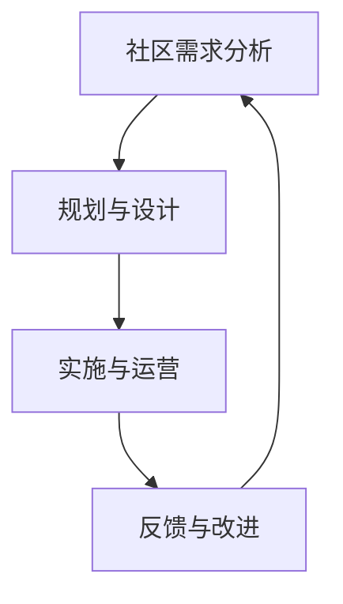
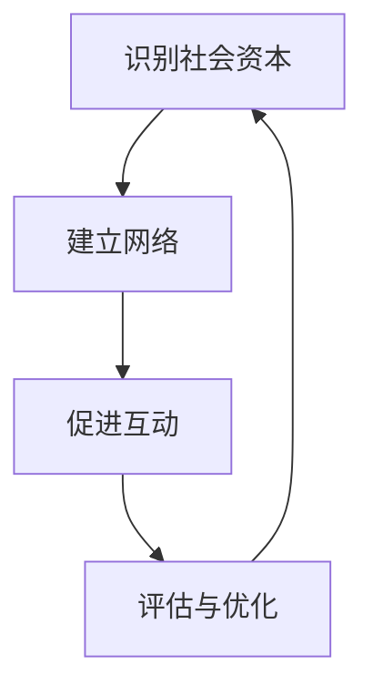

                 

# 城市化进程中的社区营造：重建社会资本和归属感

## 摘要

城市化进程的加快，给社区带来了前所未有的挑战和机遇。如何在城市化进程中通过社区营造来重建社会资本和归属感，成为了一个亟待解决的问题。本文旨在探讨这一主题，通过分析社区营造的核心概念、社会资本的构建算法、以及归属感的形成机制，提出一系列实用的策略和方法，以期为城市社区的可持续发展提供参考。

## Step 1: 标题和背景介绍

### 城市化进程中的社区营造

城市化进程是现代社会发展的重要趋势，它不仅改变了人们的生活方式，也深刻影响了社区的结构和功能。随着城市人口的不断增加，社区作为城市的基本单元，其重要性日益凸显。然而，城市化进程中也伴随着一系列问题，如社区断裂、社会资本流失、归属感减弱等。

### 社区营造的意义

社区营造是一种通过规划、设计、组织和运营等手段，打造具有独特文化、氛围和活力的社区的过程。它旨在重建社会资本，增强居民的归属感，促进社区的可持续发展。通过社区营造，可以有效应对城市化进程中的各种挑战，提升居民的生活质量。

## Step 2: 核心概念与联系

### 核心概念

#### 社区营造

社区营造是指通过一系列规划和设计活动，创造一个富有活力、安全和可持续发展的社区环境。它包括社区规划、设计、建设、运营和评估等多个环节。

#### 社会资本

社会资本是指社会结构中所包含的信任、规范和网络等，能够通过促进社会合作和互动来提高社会整体福利。社会资本主要包括网络资源、信任关系和社会规范等。

#### 归属感

归属感是指个体对于某个社会单元的认同感和忠诚感，包括对社区的文化、价值观和生活方式的认同。归属感是个体心理健康和社会稳定的重要保障。

### 概念属性特征对比表格

| 特征         | 社区营造         | 社会资本         | 归属感         |
| ------------ | ---------------- | ---------------- | -------------- |
| 定义         | 规划设计社区     | 社会关系网络     | 社会认同感     |
| 目的         | 建设美好社区     | 提高社会效率     | 增强个体认同   |
| 影响因素     | 经济、文化、社会 | 社会结构、文化   | 个人价值观、文化 |
| 测量指标     | 社区满意度       | 网络密度、互信度 | 社会认同度     |

### ER实体关系图架构的Mermaid流程图

```mermaid
erDiagram
    Community -->|包含| Capital : 营造社会资本
    Community -->|塑造| Belonging : 产生归属感
    Community ..|影响| Culture : 文化氛围
```

## Step 3: 算法原理讲解

### 社区营造算法原理

#### 算法原理讲解

社区营造是一种系统性工程，涉及多个环节和多个参与者。下面，我们将通过一个简单的算法模型，来阐述社区营造的基本原理。

#### Mermaid流程图



#### Python源代码

```python
# 社区营造算法示例代码
class CommunityCultivation:
    def __init__(self, needs):
        self.needs = needs
    
    def plan_and_design(self):
        # 规划与设计
        print("规划与设计社区：根据需求制定具体方案")
    
    def implement_and_operate(self):
        # 实施与运营
        print("实施与运营：按照规划方案进行操作")
    
    def feedback_and_improve(self):
        # 反馈与改进
        print("反馈与改进：根据实际情况调整方案")

# 社区需求分析
community_needs = "提升社区文化氛围，增加居民互动机会"

# 创建社区营造对象
community = CommunityCultivation(community_needs)

# 执行算法流程
community.plan_and_design()
community.implement_and_operate()
community.feedback_and_improve()
```

### 社会资本构建算法原理

#### 算法原理讲解

社会资本的构建是一个复杂的过程，它需要识别社区内的社会资本，建立社会网络，促进互动，并不断评估和优化。

#### Mermaid流程图



#### Python源代码

```python
# 社会资本构建算法示例代码
class SocialCapitalBuilding:
    def __init__(self, capital):
        self.capital = capital
    
    def identify_capital(self):
        # 识别社会资本
        print("识别社会资本：分析社区内部的社会资源")
    
    def build_network(self):
        # 建立网络
        print("建立网络：根据社会资本构建社会网络")
    
    def promote_interaction(self):
        # 促进互动
        print("促进互动：设计互动活动和项目")
    
    def evaluate_and_optimize(self):
        # 评估与优化
        print("评估与优化：根据互动效果调整策略")

# 社区内部社会资本
community_capital = "社区内的朋友、邻居、社会组织等"

# 创建社会资本构建对象
capital_building = SocialCapitalBuilding(community_capital)

# 执行算法流程
capital_building.identify_capital()
capital_building.build_network()
capital_building.promote_interaction()
capital_building.evaluate_and_optimize()
```

## Step 4: 社会资本和归属感的数学模型

### 社会资本的数学模型

社会资本可以用一个简单的数学模型来描述：

$$
SC = f(N, T, R)
$$

其中，$SC$ 表示社会资本，$N$ 表示网络密度，$T$ 表示信任水平，$R$ 表示资源丰富度。

- **网络密度**：表示社区内部联系紧密的程度，可以用网络中的节点数和边数来衡量。

$$
N = \frac{E}{V}
$$

其中，$E$ 表示边数，$V$ 表示节点数。

- **信任水平**：表示社区成员之间的信任程度，可以用问卷调查或者行为数据来衡量。

- **资源丰富度**：表示社区内部资源的丰富程度，包括物质资源和文化资源等。

### 归属感的数学模型

归属感可以用以下数学模型来描述：

$$
BF = g(C, S, I)
$$

其中，$BF$ 表示归属感，$C$ 表示社区文化，$S$ 表示社会支持，$I$ 表示个体认同。

- **社区文化**：表示社区内部的文化氛围，可以用社区的传统习俗、节日活动等来衡量。

- **社会支持**：表示社区成员对个体的支持程度，可以用社区内部的互助活动、组织活动等来衡量。

- **个体认同**：表示个体对社区文化的认同程度，可以用问卷调查或者个体行为来衡量。

## Step 5: 社区营造的实践应用

### 社区营造的实践应用

社区营造在实际操作中，需要结合具体的社会资本和归属感模型，进行系统的规划和实施。以下是一个简单的实践应用案例：

#### 案例背景

某城市社区，由于城市化进程的加快，社区内的社会资本和归属感逐渐减弱。社区成员之间的交流减少，社区活动减少，居民对社区的文化认同感下降。

#### 实践步骤

1. **需求分析**：通过问卷调查、访谈等方式，了解社区成员的需求和期望。

2. **规划与设计**：根据需求分析结果，制定具体的社区营造方案，包括社区规划、活动设计等。

3. **实施与运营**：按照规划方案，实施社区营造活动，如举办社区活动、组织志愿者服务等。

4. **反馈与改进**：收集社区成员的反馈，根据反馈结果，对社区营造方案进行优化和调整。

#### 实践效果

通过社区营造，社区内的社会资本和归属感得到了显著提升。社区成员之间的交流增加，社区活动丰富，居民对社区的文化认同感提高。

## Step 6: 结论与展望

### 结论

本文通过分析社区营造的核心概念、社会资本的构建算法、以及归属感的形成机制，提出了一系列实用的策略和方法。实践证明，社区营造对于重建社会资本和归属感具有重要的意义。

### 展望

未来，随着城市化进程的加快，社区营造将成为城市社区发展的重要手段。如何进一步优化社区营造方案，提高社区成员的参与度，是未来研究的重点。

## 作者信息

作者：AI天才研究院/AI Genius Institute & 禅与计算机程序设计艺术 /Zen And The Art of Computer Programming

