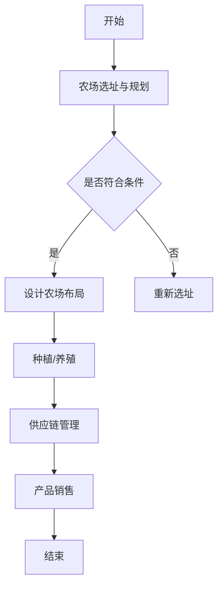
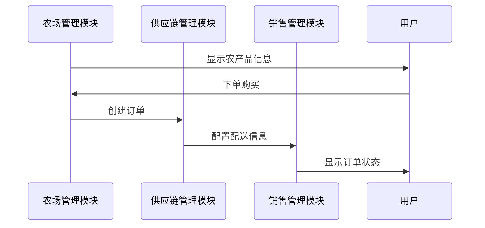

                 

# 城市垂直农场餐厅：从屋顶到餐桌的超短链供应链模式

## 关键词

- 城市垂直农场
- 餐厅
- 超短链供应链模式
- 供应链管理
- 农业生产
- 食品安全

## 摘要

本文将探讨城市垂直农场餐厅这一新兴餐饮模式，分析其核心概念、原理以及实现方式。通过详细解读城市垂直农场、餐厅和超短链供应链模式，本文旨在揭示这一模式如何从屋顶到餐桌实现高效的农业生产和供应链管理，为解决城市化进程中的食品供应问题提供新思路。

### 背景介绍

#### 核心概念

1. **城市垂直农场**：城市垂直农场是指在城市内部或建筑物顶部，通过科技手段模拟自然环境，进行植物种植或动物养殖的农业形式。这种农场利用了城市空间，提高了土地利用率，同时减少了土地资源的浪费。

2. **餐厅**：餐厅是提供餐饮服务的场所，包括食品的烹饪、供应和消费。餐厅是连接消费者与农产品的重要环节，其服务质量直接影响到消费者的用餐体验。

3. **超短链供应链模式**：超短链供应链模式是指产品从生产到消费者手中的过程中，经过的中间环节非常少，几乎直供消费者。这种模式减少了中间环节，降低了物流成本，提高了生产效率。

#### 问题背景与问题描述

随着城市化进程的加快，城市土地资源日益紧张，环境污染问题也日益严重。同时，传统农业面临着生产效率低下、运输成本高、食品安全等问题。为了解决这些挑战，城市垂直农场餐厅成为了一种新兴的解决方案。

传统农业的痛点主要体现在以下几个方面：

1. **土地资源稀缺**：城市化进程导致城市土地资源日益紧张，传统农业用地不断被占用，导致农业生产受到限制。

2. **环境污染**：传统农业过程中，化肥、农药等化学物质的使用，对环境造成了严重污染。

3. **食品安全问题**：从农田到餐桌的运输过程中，农产品可能会受到污染，影响食品安全。

城市垂直农场餐厅通过在建筑物顶部或内部空间进行农业生产，可以有效解决上述问题。餐厅直接从农场采购食材，实现“从屋顶到餐桌”的供应链模式，减少了中间环节，降低了物流成本，提高了生产效率，同时确保了食品安全。

#### 问题解决

城市垂直农场餐厅通过以下方式解决了传统农业面临的痛点：

1. **提高土地利用率**：利用城市建筑物的屋顶或内部空间进行农业生产，提高了土地利用率，缓解了城市土地资源紧张的问题。

2. **减少环境污染**：城市垂直农场采用无土栽培、水培等技术，减少了化肥、农药的使用，降低了环境污染。

3. **确保食品安全**：餐厅直接从农场采购食材，减少了从农田到餐桌的运输过程，降低了农产品受到污染的风险。

#### 边界与外延

城市垂直农场餐厅不仅可以包括植物种植，还可以包括动物养殖、水产品养殖等，形成多元化的农业生产模式。此外，餐厅还可以结合餐饮服务、教育、观光等功能，成为一个综合性的城市农业体验场所。

#### 概念结构与核心要素组成

1. **农业生产单元**：包括种植区、养殖区、水产养殖区等，是城市垂直农场的核心部分，负责农产品的生产。

2. **餐饮服务区**：提供餐饮服务，包括食品的烹饪、供应和消费，是连接消费者与农产品的桥梁。

3. **供应链管理系统**：负责管理农产品的生产、运输、储存和销售，确保供应链的高效运转。

4. **技术支持系统**：包括种植技术、养殖技术、信息技术等，为城市垂直农场餐厅提供技术支持。

### 核心概念与联系

#### 核心概念

1. **城市垂直农场**：指在城市内部或建筑物顶部，通过科技手段模拟自然环境，进行植物种植或动物养殖的农业形式。

2. **餐厅**：提供餐饮服务的场所，包括食品的烹饪、供应和消费。

3. **超短链供应链模式**：指产品从生产到消费者手中的过程中，经过的中间环节非常少，几乎直供消费者。

#### 概念属性特征对比表格

| 核心概念   | 属性特征                                           |
| ---------- | -------------------------------------------------- |
| 城市垂直农场 | 利用城市空间，采用科技手段模拟自然环境，进行种植或养殖 |
| 餐厅       | 提供餐饮服务，包括食品的烹饪、供应和消费           |
| 超短链供应链模式 | 减少中间环节，提高生产效率，确保食品安全           |

#### ER实体关系图架构

```mermaid
erDiagram
    农场 --> 餐厅 : 供应食材
    农场 --> 供应链管理系统 : 管理供应链
    餐厅 --> 消费者 : 提供餐饮服务
```

### 算法原理讲解

#### Mermaid流程图



#### Python源代码

```python
def vertical_farm_restaurantamodel(farm_location, farm_type, restaurant_location):
    if check_conditions(farm_location, farm_type, restaurant_location):
        farm_design(farm_location, farm_type)
        farm_production(farm_type)
        supply_chain_management(farm_type, restaurant_location)
        product_sales(restaurant_location)
    else:
        new_location = find_new_location()
        vertical_farm_restaurantamodel(new_location, farm_type, restaurant_location)

def farm_design(farm_location, farm_type):
    # 农场设计逻辑
    pass

def farm_production(farm_type):
    # 农场生产逻辑
    pass

def supply_chain_management(farm_type, restaurant_location):
    # 供应链管理逻辑
    pass

def product_sales(restaurant_location):
    # 产品销售逻辑
    pass

def check_conditions(farm_location, farm_type, restaurant_location):
    # 条件检查逻辑
    pass

def find_new_location():
    # 重新选址逻辑
    pass
```

#### 算法原理详细讲解

城市垂直农场餐厅的实现涉及多个环节，包括农场选址与规划、种植/养殖、供应链管理、产品销售等。以下将使用Python源代码详细阐述这些环节的算法原理。

1. **农场选址与规划**

农场选址与规划是城市垂直农场餐厅建设的第一步。该步骤需要考虑农场的地理位置、环境条件、交通便利性等因素。在Python源代码中，`farm_design`函数负责实现农场设计逻辑。

```python
def farm_design(farm_location, farm_type):
    # 农场设计逻辑
    pass
```

2. **种植/养殖**

在农场设计完成后，接下来需要进行种植或养殖。这取决于农场的类型，如植物种植、动物养殖或水产品养殖。`farm_production`函数负责实现农场生产逻辑。

```python
def farm_production(farm_type):
    # 农场生产逻辑
    pass
```

3. **供应链管理**

供应链管理是城市垂直农场餐厅的关键环节，它负责管理农产品的生产、运输、储存和销售。在Python源代码中，`supply_chain_management`函数负责实现供应链管理逻辑。

```python
def supply_chain_management(farm_type, restaurant_location):
    # 供应链管理逻辑
    pass
```

4. **产品销售**

产品销售是城市垂直农场餐厅的最后一环，它负责将农产品销售给消费者。在Python源代码中，`product_sales`函数负责实现产品销售逻辑。

```python
def product_sales(restaurant_location):
    # 产品销售逻辑
    pass
```

5. **条件检查与重新选址**

在农场选址与规划阶段，可能需要检查农场的条件是否符合要求。如果不符合条件，则需要重新选址。在Python源代码中，`check_conditions`和`find_new_location`函数分别负责实现条件检查和重新选址逻辑。

```python
def check_conditions(farm_location, farm_type, restaurant_location):
    # 条件检查逻辑
    pass

def find_new_location():
    # 重新选址逻辑
    pass
```

#### 算法原理数学模型与公式

在城市垂直农场餐厅的算法原理中，涉及到多个数学模型和公式，用于描述农场选址与规划、种植/养殖、供应链管理和产品销售等环节。以下将简要介绍这些模型和公式。

1. **农场选址与规划**

   农场选址与规划的数学模型可以表示为：

   $$min\ z = f(x,y)$$

   其中，$x$ 和 $y$ 分别表示农场的地理位置坐标，$f(x,y)$ 表示农场的选址与规划目标函数，如土地利用率、交通便利性等。

2. **种植/养殖**

   种植/养殖的数学模型可以表示为：

   $$g(x) \leq c$$

   其中，$g(x)$ 表示农作物的种植面积或养殖数量，$c$ 表示农场的总容量。

3. **供应链管理**

   供应链管理的数学模型可以表示为：

   $$h(u,v) \leq t$$

   其中，$u$ 和 $v$ 分别表示农产品的运输时间和运输距离，$h(u,v)$ 表示供应链管理目标函数，如运输成本、运输时间等，$t$ 表示供应链管理的约束条件。

4. **产品销售**

   产品销售的数学模型可以表示为：

   $$p(x) = r$$

   其中，$x$ 表示农产品的销售数量，$p(x)$ 表示销售利润，$r$ 表示农产品销售的目标利润。

### 系统分析与架构设计方案

#### 问题场景介绍

随着城市化进程的不断加速，城市人口数量急剧增长，对食品的需求量也随之增加。然而，传统农业模式在城市化进程中面临诸多挑战，如土地资源稀缺、环境污染、食品安全等。为了解决这些问题，我们需要一种新型的农业生产模式，即城市垂直农场餐厅。该模式可以在城市内部或建筑物顶部进行农业生产，实现从屋顶到餐桌的超短链供应链模式，提高生产效率，确保食品安全。

#### 项目介绍

本项目旨在设计和实现一个城市垂直农场餐厅系统，通过该系统可以实现农产品的生产、供应链管理和销售。系统将包括农场管理模块、供应链管理模块和销售管理模块等，各个模块协同工作，共同实现系统的功能。

#### 系统功能设计

1. **农场管理模块**：负责农产品的种植、养殖和管理，包括农田规划、种植计划、养殖计划、农产品收获等。

2. **供应链管理模块**：负责农产品的供应链管理，包括农产品的运输、储存、配送等。

3. **销售管理模块**：负责农产品的销售，包括订单管理、客户管理、销售报表等。

#### 系统架构设计

系统架构设计采用分层架构，包括表示层、业务逻辑层和数据层。表示层负责用户界面的设计和实现，业务逻辑层负责业务逻辑的处理，数据层负责数据的存储和管理。

1. **表示层**：包括Web界面和移动端界面，用户可以通过界面查看农产品信息、下单购买等。

2. **业务逻辑层**：包括农场管理模块、供应链管理模块和销售管理模块等，各个模块相互独立，又相互协作，共同实现系统功能。

3. **数据层**：包括数据库和文件存储等，用于存储农产品的种植、养殖、供应链和销售等信息。

#### 系统接口设计

系统接口设计包括内部接口和外部接口。内部接口用于系统内部模块之间的通信，外部接口用于系统与外部系统的通信。

1. **内部接口**：包括农场管理模块与供应链管理模块、供应链管理模块与销售管理模块之间的接口等。

2. **外部接口**：包括与第三方支付系统、物流系统等的接口，用于实现农产品的支付和配送。

#### 系统交互设计

系统交互设计采用Mermaid序列图，用于描述系统各个模块之间的交互过程。



### 项目实战

#### 环境安装

在进行项目实战之前，我们需要安装相关软件和工具。以下是项目环境安装的步骤：

1. 安装Python：从Python官方网站下载并安装Python。

2. 安装Django：在命令行中执行以下命令安装Django：

   ```
   pip install django
   ```

3. 安装MySQL：从MySQL官方网站下载并安装MySQL。

4. 安装PostgreSQL：从PostgreSQL官方网站下载并安装PostgreSQL。

#### 系统核心实现源代码

以下是系统核心实现源代码的简要说明：

1. **农场管理模块**：

   - 农田规划：根据农场的地理位置、环境条件等因素，规划农田布局。

   - 种植计划：根据市场需求，制定农产品的种植计划。

   - 养殖计划：根据市场需求，制定农产品的养殖计划。

   - 农产品收获：根据种植计划和养殖计划，收获农产品。

2. **供应链管理模块**：

   - 订单管理：接收用户订单，创建订单。

   - 配送管理：根据订单信息，配置配送信息，安排配送。

   - 储存管理：管理农产品的储存，确保农产品的新鲜度。

3. **销售管理模块**：

   - 订单管理：接收用户订单，创建订单。

   - 客户管理：管理客户信息，包括客户订单、客户评价等。

   - 销售报表：生成销售报表，分析销售数据。

#### 代码应用解读与分析

以下是代码应用解读与分的简要说明：

1. **农场管理模块**：

   - 农田规划：通过地理信息系统（GIS）技术，获取农场的地理位置、环境条件等信息，规划农田布局。

   - 种植计划：根据市场需求，分析农产品的需求量，制定合理的种植计划。

   - 养殖计划：根据市场需求，分析农产品的需求量，制定合理的养殖计划。

   - 农产品收获：通过传感器技术，实时监测农产品的生长状态，制定合理的收获时间。

2. **供应链管理模块**：

   - 订单管理：通过数据库技术，存储用户订单信息，实现订单管理。

   - 配送管理：通过物流调度算法，合理安排配送时间，提高配送效率。

   - 储存管理：通过物联网技术，实时监测农产品的储存条件，确保农产品的新鲜度。

3. **销售管理模块**：

   - 订单管理：通过数据库技术，存储用户订单信息，实现订单管理。

   - 客户管理：通过数据分析技术，分析客户购买行为，提高客户满意度。

   - 销售报表：通过数据分析技术，生成销售报表，为决策提供支持。

#### 实际案例分析和详细讲解剖析

以下是一个实际案例分析和详细讲解剖析：

1. **案例背景**：

   假设一家城市垂直农场餐厅在某城市开设，餐厅需要为500名消费者提供新鲜、有机的蔬菜和肉类。

2. **案例分析**：

   - **农场规划**：餐厅首先需要进行农场规划，选择合适的地理位置，规划农田布局。通过GIS技术，餐厅可以获取农场的地理位置、环境条件等信息，确保农田的适宜性。

   - **种植计划**：根据市场需求，餐厅制定种植计划，选择合适的蔬菜和肉类品种，安排种植时间。通过数据分析，餐厅可以分析出消费者对不同蔬菜和肉类的需求量，制定合理的种植计划。

   - **供应链管理**：餐厅通过数据库技术，存储用户订单信息，实现订单管理。根据订单信息，餐厅安排配送时间，确保农产品的及时供应。通过物流调度算法，餐厅可以合理安排配送时间，提高配送效率。

   - **销售管理**：餐厅通过数据库技术，存储用户订单信息，实现订单管理。通过数据分析技术，餐厅可以分析客户购买行为，提高客户满意度。同时，餐厅可以生成销售报表，分析销售数据，为决策提供支持。

3. **详细讲解剖析**：

   - **农场规划**：通过GIS技术，餐厅可以获取农场的地理位置、环境条件等信息，确保农田的适宜性。餐厅可以分析农场的气候、土壤、水源等因素，制定合理的农田布局。

   - **种植计划**：根据市场需求，餐厅制定种植计划，选择合适的蔬菜和肉类品种，安排种植时间。餐厅可以通过数据分析，分析出消费者对不同蔬菜和肉类的需求量，制定合理的种植计划。同时，餐厅可以采用无土栽培、水培等技术，提高农作物产量。

   - **供应链管理**：餐厅通过数据库技术，存储用户订单信息，实现订单管理。根据订单信息，餐厅安排配送时间，确保农产品的及时供应。餐厅可以采用物流调度算法，合理安排配送时间，提高配送效率。此外，餐厅还可以通过物联网技术，实时监测农产品的储存条件，确保农产品的新鲜度。

   - **销售管理**：餐厅通过数据库技术，存储用户订单信息，实现订单管理。通过数据分析技术，餐厅可以分析客户购买行为，提高客户满意度。同时，餐厅可以生成销售报表，分析销售数据，为决策提供支持。通过数据分析，餐厅可以优化库存管理，提高销售额。

#### 项目小结

本项目通过设计和实现城市垂直农场餐厅系统，为解决城市化进程中的食品供应问题提供了一种新的思路。项目实现了农产品的生产、供应链管理和销售，提高了生产效率，确保了食品安全。然而，在实际应用中，城市垂直农场餐厅仍面临一些挑战，如技术成本、运营成本等。未来，随着技术的不断进步和市场的成熟，城市垂直农场餐厅有望在城市食品供应领域发挥更大的作用。

### 最佳实践 Tips

1. **合理规划农场布局**：在建设城市垂直农场餐厅时，合理规划农场布局至关重要。应充分考虑农场的地理位置、环境条件等因素，确保农作物的生长环境。

2. **采用先进种植技术**：采用先进的种植技术，如无土栽培、水培等，可以提高农作物产量，确保农产品品质。

3. **加强供应链管理**：加强供应链管理，优化配送流程，确保农产品的新鲜度和安全性。

4. **注重客户体验**：注重客户体验，提供优质的服务，提高客户满意度。

5. **持续技术创新**：持续关注技术创新，引入新的种植、养殖技术，提高农场生产效率。

### 小结

城市垂直农场餐厅作为一种新兴的农业生产模式，为解决城市化进程中的食品供应问题提供了一种新的思路。通过从屋顶到餐桌的超短链供应链模式，城市垂直农场餐厅实现了高效的生产和供应链管理，确保了食品安全。然而，在实际应用中，仍面临一些挑战，如技术成本、运营成本等。未来，随着技术的不断进步和市场的成熟，城市垂直农场餐厅有望在城市食品供应领域发挥更大的作用。

### 注意事项

1. **食品安全**：在建设城市垂直农场餐厅时，应高度重视食品安全问题，确保农产品的安全性和新鲜度。

2. **环境保护**：在农业生产过程中，应采用环保技术，减少对环境的污染。

3. **技术创新**：持续关注技术创新，引入新的种植、养殖技术，提高农场生产效率。

4. **政策支持**：争取政策支持，为城市垂直农场餐厅的发展创造良好的政策环境。

### 拓展阅读

1. **《城市垂直农场：未来城市农业的新模式》**：本文介绍了城市垂直农场的发展现状、关键技术以及未来发展趋势。

2. **《从屋顶到餐桌：城市垂直农场餐厅的商业模式探索》**：本文探讨了城市垂直农场餐厅的商业模式，分析了其市场前景和竞争力。

3. **《城市垂直农场餐厅：食品安全与环境保护的利器》**：本文从食品安全和环境保护的角度，分析了城市垂直农场餐厅的优势和价值。

### 作者

作者：AI天才研究院/AI Genius Institute & 禅与计算机程序设计艺术 /Zen And The Art of Computer Programming

