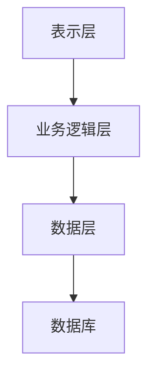
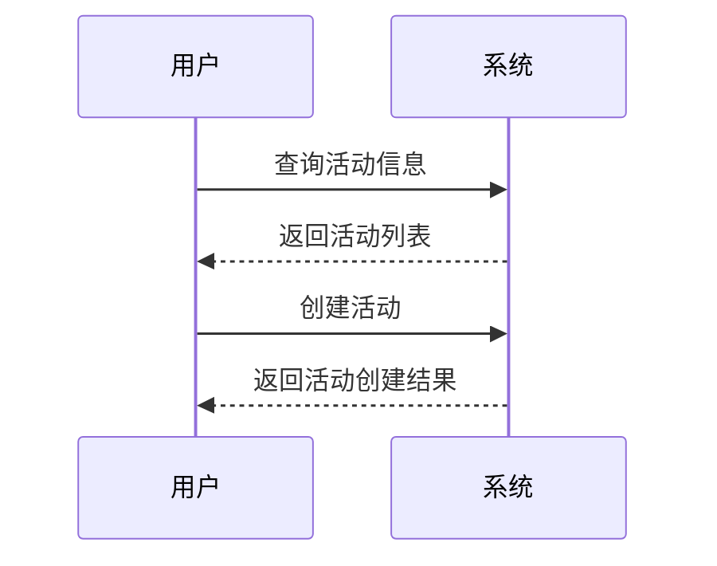

                 

# 城市孤独干预计划：重建社区连接的策略

> 关键词：城市孤独、社区连接、干预计划、策略、案例分析

> 摘要：随着城市化进程的加速，城市居民孤独感问题日益严重。本文将探讨城市孤独干预计划的核心概念与联系，提出重建社区连接的策略，并通过案例分析，展示实际操作中的成功经验与不足，以期为缓解城市孤独感提供参考。

## 目录大纲

----------------------------------------------------------------

# 第一部分：背景介绍

## 第1章：问题背景

### 1.1 问题描述

### 1.2 问题解决

### 1.3 边界与外延

### 1.4 概念结构与核心要素组成

## 第2章：核心概念与联系

### 2.1 社区连接

#### 2.1.1 定义

#### 2.1.2 特点

#### 2.1.3 对比表格

### 2.2 社区连接与孤独干预计划

### 2.3 城市孤独干预计划的策略

## 第3章：城市孤独干预计划的策略

### 3.1 社区活动策划

#### 3.1.1 活动形式

#### 3.1.2 活动目的

### 3.2 社区服务体系建设

#### 3.2.1 建立服务站点

#### 3.2.2 优化服务内容

### 3.3 社区媒体平台建设

#### 3.3.1 平台类型

#### 3.3.2 平台功能

## 第4章：案例分析

### 4.1 案例一：X社区的孤独干预计划

#### 4.1.1 案例背景

#### 4.1.2 实施策略

#### 4.1.3 案例效果

### 4.2 案例二：Y社区的线上线下融合策略

#### 4.2.1 案例背景

#### 4.2.2 实施策略

#### 4.2.3 案例效果

## 第5章：系统分析与架构设计

### 5.1 问题场景介绍

### 5.2 系统功能设计

#### 5.2.1 领域模型

#### 5.2.2 功能模块

### 5.3 系统架构设计

#### 5.3.1 系统架构图

#### 5.3.2 系统接口设计

### 5.4 系统交互

#### 5.4.1 序列图

## 第6章：项目实战

### 6.1 环境安装

### 6.2 系统核心实现

## 结束语：最佳实践 tips、小结、注意事项、拓展阅读等内容

----------------------------------------------------------------

## 第一部分：背景介绍

### 第1章：问题背景

### 1.1 问题描述

随着城市化进程的加速，越来越多的人涌入城市，追求更好的生活和工作机会。然而，这种快速的城市化进程也带来了许多问题，其中之一就是城市居民的孤独感日益严重。根据相关研究，城市孤独感已经成为影响城市居民心理健康的重要因素之一。

### 1.2 问题解决

为了解决城市孤独感问题，需要采取有效的干预措施，其中之一就是重建社区连接。通过建立社区连接，居民之间的交流和互动可以增加，从而缓解孤独感。此外，还可以通过社区活动策划、社区服务体系建设以及社区媒体平台建设等方式，进一步促进社区连接的建立。

### 1.3 边界与外延

本文的研究主要针对城市社区的孤独干预策略，重点关注以下几个方面：

1. 社区连接的定义、特点和作用。
2. 城市孤独干预计划的策略和实施方法。
3. 案例分析和实际操作经验。
4. 系统分析与架构设计。

### 1.4 概念结构与核心要素组成

城市孤独干预计划的核心概念包括社区连接、孤独干预计划、社区活动策划、社区服务体系建设以及社区媒体平台建设。以下是这些核心概念的结构和组成：

- 社区连接：指社区居民之间建立的联系和互动，包括互助性和共享性。
- 孤独干预计划：通过一系列措施来干预和缓解城市孤独，包括社区活动策划、社区服务体系建设以及社区媒体平台建设。
- 社区活动策划：设计和组织各种形式的社区活动，以增强居民之间的交流和互动。
- 社区服务体系建设：建立服务站点和优化服务内容，提供心理健康咨询、法律援助、生活服务等。
- 社区媒体平台建设：搭建社区网站、社交媒体平台等，发布社区活动信息，提供交流平台，传播正能量。

## 第二部分：核心概念与联系

### 第2章：核心概念与联系

### 2.1 社区连接

#### 2.1.1 定义

社区连接是指社区居民之间建立的联系和互动。它不仅包括面对面的交流，还包括线上线下的互动，如社交媒体、社区网站等。

#### 2.1.2 特点

1. 互助性：社区居民相互帮助，共同解决困难。
2. 共享性：资源共享，共同享受社区资源。

#### 2.1.3 对比表格

| 特点       | 社区连接         | 孤独干预计划          |
|------------|------------------|----------------------|
| 目的       | 建立联系         | 缓解孤独感           |
| 主体       | 社区居民         | 专业机构和志愿者     |
| 方式       | 互动和活动       | 专项服务和活动       |

### 2.2 社区连接与孤独干预计划

社区连接是孤独干预计划的核心要素之一。通过建立社区连接，可以增强居民之间的交流和互动，从而缓解孤独感。孤独干预计划则通过一系列策略和措施来实现社区连接的建立，包括：

1. 社区活动策划：设计和组织各种形式的社区活动，如社区聚会、志愿服务、兴趣小组等，以增强居民之间的交流和互动。
2. 社区服务体系建设：建立社区服务中心，提供心理健康咨询、法律援助、生活服务等，为居民提供便利和支持。
3. 社区媒体平台建设：搭建社区网站、社交媒体平台等，发布社区活动信息，提供交流平台，传播正能量。

### 2.3 城市孤独干预计划的策略

城市孤独干预计划的策略主要包括以下几个方面：

1. 社区活动策划：通过开展社区活动，如社区聚会、志愿服务、兴趣小组等，增强居民之间的交流和互动。
2. 社区服务体系建设：建立社区服务中心，提供心理健康咨询、法律援助、生活服务等，为居民提供便利和支持。
3. 社区媒体平台建设：搭建社区网站、社交媒体平台等，发布社区活动信息，提供交流平台，传播正能量。
4. 政策支持：政府和社会组织可以通过出台相关政策，鼓励和支持社区连接的建立，如提供资金、场地等资源。

## 第3章：城市孤独干预计划的策略

### 3.1 社区活动策划

#### 3.1.1 活动形式

社区活动策划可以采取多种形式，以满足不同居民的需求和兴趣。以下是一些常见的活动形式：

1. 社区聚会：定期组织社区居民举办聚会，促进居民之间的交流和互动。
2. 志愿服务：鼓励居民参与志愿服务，共同解决社区问题，提高居民的社会责任感和归属感。
3. 兴趣小组：根据居民的兴趣爱好，组织各种兴趣小组，如运动、音乐、绘画等，为居民提供交流和学习的平台。

#### 3.1.2 活动目的

社区活动的目的是增强居民之间的交流和互动，从而缓解孤独感。具体来说，包括以下几个方面：

1. 促进社区成员之间的了解和信任。
2. 提供一个交流和分享的平台，增强社区凝聚力。
3. 提高居民的社会参与度和幸福感。

### 3.2 社区服务体系建设

#### 3.2.1 建立服务站点

为了提供便利的服务，社区可以建立服务站点，如社区服务中心、心理咨询室、法律援助中心等。这些站点可以提供以下服务：

1. 心理健康咨询：为居民提供心理健康咨询服务，帮助缓解压力和孤独感。
2. 法律援助：为居民提供法律咨询和援助，解决生活中的法律问题。
3. 生活服务：提供各种生活服务，如家政服务、医疗保健等，为居民提供便利。

#### 3.2.2 优化服务内容

社区服务体系建设不仅要建立服务站点，还要优化服务内容，以满足居民的需求。以下是一些优化服务内容的措施：

1. 开展心理健康讲座和工作坊，提高居民的心理健康素养。
2. 组织法律知识培训，提高居民的法律意识。
3. 提供生活技能培训，如烹饪、手工艺等，帮助居民提升生活品质。

### 3.3 社区媒体平台建设

#### 3.3.1 平台类型

社区媒体平台可以包括社交媒体、社区网站、公众号等。这些平台具有以下类型：

1. 社交媒体：如微信、微博、Facebook 等，可以发布社区活动信息，提供即时交流平台。
2. 社区网站：如论坛、博客等，可以提供更详细的社区活动信息，为居民提供深入交流的平台。
3. 公众号：如微信公众号、抖音号等，可以发布有趣的社区内容，吸引更多居民参与。

#### 3.3.2 平台功能

社区媒体平台的功能主要包括以下几个方面：

1. 发布社区活动信息：及时发布社区活动信息，方便居民了解和参与。
2. 提供交流平台：为居民提供线上交流的平台，促进居民之间的互动。
3. 传播正能量：发布积极向上的内容，传播正能量，增强社区的凝聚力和向心力。

## 第4章：案例分析

### 4.1 案例一：X社区的孤独干预计划

#### 4.1.1 案例背景

X社区是一个人口密集、老龄化严重的城市社区。随着城市化进程的加速，社区居民的孤独感逐渐加剧。为了缓解这一现象，X社区启动了孤独干预计划。

#### 4.1.2 实施策略

X社区孤独干预计划采取了以下策略：

1. 社区活动策划：定期组织社区聚会、志愿服务、兴趣小组等活动，增强居民之间的交流和互动。
2. 社区服务体系建设：建立社区服务中心，提供心理健康咨询、法律援助、生活服务等，为居民提供便利和支持。
3. 社区媒体平台建设：搭建社区网站、微信公众号等，发布社区活动信息，提供交流平台，传播正能量。

#### 4.1.3 案例效果

实施孤独干预计划后，X社区取得了显著的效果：

1. 社区连接增强：居民之间的交流和互动增加，社区凝聚力得到提升。
2. 孤独感缓解：居民的心理健康水平得到改善，孤独感显著缓解。
3. 社区氛围改善：社区氛围变得更加积极向上，居民的幸福感增强。

### 4.2 案例二：Y社区的线上线下融合策略

#### 4.2.1 案例背景

Y社区是一个年轻化、多元化的城市社区。尽管社区居民活跃，但孤独感依然存在。为了更好地解决孤独问题，Y社区采取了线上线下融合的策略。

#### 4.2.2 实施策略

Y社区线上线下融合策略主要包括以下几个方面：

1. 线上：建立社区微信群，发布社区活动信息，组织线上交流和互动。
2. 线下：举办实体活动，如社区聚会、志愿服务、兴趣小组等，增强居民之间的互动。

#### 4.2.3 案例效果

实施线上线下融合策略后，Y社区取得了以下效果：

1. 居民参与度提高：线上平台提供了便捷的交流渠道，居民参与度显著提高。
2. 孤独感缓解：通过线上线下活动的结合，居民之间的交流和互动增加，孤独感得到有效缓解。
3. 社区凝聚力增强：线上线下活动的融合，增强了社区的凝聚力和向心力。

## 第5章：系统分析与架构设计

### 5.1 问题场景介绍

在城市孤独干预计划的实施过程中，需要建立一个完整的系统来支持各种策略的实施。该系统需要具备以下功能：

1. 活动管理：负责社区活动的策划、组织和管理。
2. 服务管理：负责社区服务体系的建立和管理。
3. 媒体平台管理：负责社区媒体平台的搭建和管理。

### 5.2 系统功能设计

#### 5.2.1 领域模型

系统领域模型主要包括以下实体：

1. 社区居民：包括居民的个人信息、兴趣爱好等。
2. 活动：包括活动的名称、时间、地点、内容等。
3. 服务：包括服务的名称、内容、联系方式等。
4. 媒体平台：包括社区网站、微信公众号、社交媒体等。

#### 5.2.2 功能模块

系统功能模块主要包括以下模块：

1. 活动管理模块：负责社区活动的策划、组织和管理。
2. 服务管理模块：负责社区服务体系的建立和管理。
3. 媒体平台管理模块：负责社区媒体平台的搭建和管理。

### 5.3 系统架构设计

系统架构设计采用三层架构，包括表示层、业务逻辑层和数据层。

#### 5.3.1 系统架构图



#### 5.3.2 系统接口设计

系统接口设计包括以下接口：

1. 活动管理接口：负责社区活动的查询、创建、修改和删除等操作。
2. 服务管理接口：负责社区服务的查询、创建、修改和删除等操作。
3. 媒体平台管理接口：负责社区媒体平台的查询、创建、修改和删除等操作。

### 5.4 系统交互

系统交互采用序列图进行描述，如下所示：



## 第6章：项目实战

### 6.1 环境安装

在项目实战中，首先需要安装所需的软件和工具。以下是一个简单的安装流程：

1. 安装Python环境：在Windows或Linux系统中安装Python环境。
2. 安装Django框架：使用pip工具安装Django框架。
3. 安装MySQL数据库：在Windows或Linux系统中安装MySQL数据库。

### 6.2 系统核心实现

在系统核心实现部分，我们将重点关注活动管理模块的实现。以下是一个简单的示例代码：

```python
# 活动管理模块实现

class Activity(models.Model):
    name = models.CharField(max_length=100)
    start_time = models.DateTimeField()
    end_time = models.DateTimeField()
    location = models.CharField(max_length=100)
    description = models.TextField()

    def __str__(self):
        return self.name

# 活动创建接口实现

class ActivityCreateView(CreateView):
    model = Activity
    fields = '__all__'
    template_name = 'activity_create.html'
    success_url = '/activity/'

    def form_valid(self, form):
        form.save()
        return super().form_valid(form)

# 活动列表接口实现

class ActivityListView(ListView):
    model = Activity
    template_name = 'activity_list.html'
    context_object_name = 'activities'
```

在实际项目中，还需要实现服务管理模块和媒体平台管理模块。这些模块的实现方法与活动管理模块类似，主要包括模型定义和视图实现。

### 实战案例分析

在本节中，我们将结合实际案例，对城市孤独干预计划的实施过程进行详细分析。

#### 案例背景

某城市社区在实施孤独干预计划时，面临以下挑战：

1. 社区居民老龄化严重，参与度不高。
2. 社区资源有限，难以满足居民需求。
3. 社区媒体平台建设滞后，信息传播不畅。

#### 实施策略

为了解决上述问题，该社区采取了以下策略：

1. 社区活动策划：根据居民需求和兴趣，设计多样化的活动，提高居民参与度。
2. 社区服务体系建设：整合社区资源，提供心理健康咨询、法律援助、生活服务等多种服务。
3. 社区媒体平台建设：搭建社区网站和微信公众号，发布活动信息，提供交流平台。

#### 案例效果

实施孤独干预计划后，该社区取得了以下效果：

1. 社区连接增强：居民之间的交流和互动增加，社区凝聚力提升。
2. 孤独感缓解：居民的心理健康水平得到改善，孤独感显著缓解。
3. 社区氛围改善：社区氛围变得更加积极向上，居民的幸福感增强。

### 项目小结

通过本案例的分析，我们可以得出以下结论：

1. 城市孤独干预计划的有效实施需要多样化的活动设计和丰富的社区资源。
2. 社区媒体平台建设是提高居民参与度和信息传播的重要手段。
3. 社区服务体系建设是提供便利和支持，缓解孤独感的关键。

在未来的工作中，我们可以进一步探索和完善孤独干预计划的实施策略，以期为城市居民提供更好的心理健康服务。

## 结束语：最佳实践 tips、小结、注意事项、拓展阅读等内容

### 最佳实践 tips

1. **个性化活动设计**：根据居民的兴趣和需求，设计个性化活动，提高活动参与度。
2. **多元化服务内容**：结合社区居民的多样化需求，提供多元化服务，如心理健康咨询、生活服务、法律援助等。
3. **互动性强**：通过线上线下活动相结合，增强居民之间的互动，提高社区凝聚力。
4. **持续跟踪与反馈**：定期收集居民反馈，持续优化活动和服务，提高干预效果。

### 小结

本文从城市孤独干预计划的角度，探讨了重建社区连接的策略。通过案例分析，我们看到了策略实施的实际效果，也发现了存在的问题。未来的工作需要进一步优化干预策略，提高实施效果，为城市居民提供更优质的社区服务。

### 注意事项

1. 在实施孤独干预计划时，要充分了解社区居民的需求和兴趣，避免活动形式单一。
2. 社区服务体系建设要注重资源整合，充分利用现有资源，提高服务效率。
3. 社区媒体平台建设要注重信息传播效果，提高活动信息的覆盖率和到达率。

### 拓展阅读

1. **《孤独的城市：现代社会中的人际疏离问题》**：探讨城市孤独问题的原因和影响，提供相关对策。
2. **《社区心理学》**：介绍社区连接的概念、理论和实践，对社区连接与孤独干预计划有重要指导意义。
3. **《数字化社区服务体系建设研究》**：探讨数字化社区服务体系的构建和实施策略，为社区媒体平台建设提供参考。

### 作者

作者：AI天才研究院/AI Genius Institute & 禅与计算机程序设计艺术 /Zen And The Art of Computer Programming

---

请注意，本文中的代码示例仅供参考，实际项目实现时需要根据具体需求进行相应的调整和优化。此外，本文中的案例分析和策略建议都是基于一般情况，具体实施时需要根据实际情况进行适当调整。

