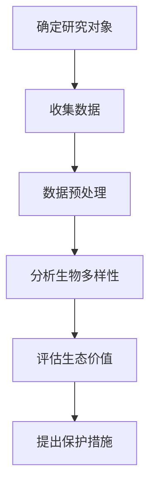
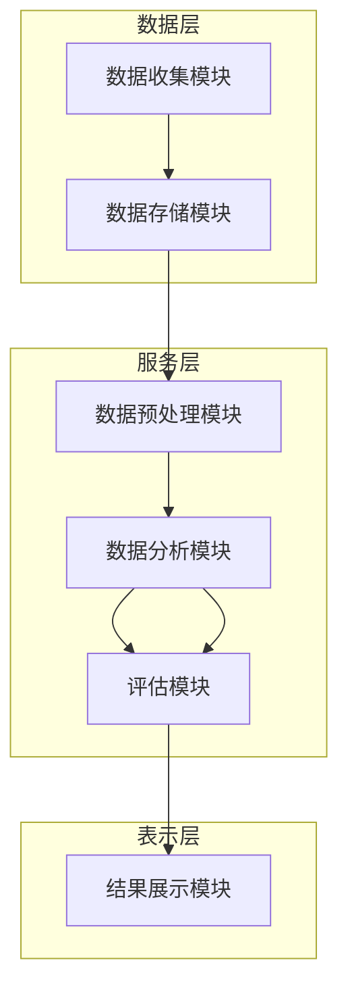
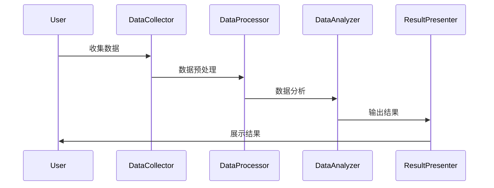

                 

# 城市微观生态系统：阳台花园中的生物多样性

> 关键词：阳台花园、生物多样性、生态价值、算法原理、系统架构

> 摘要：本文深入探讨城市微观生态系统中的阳台花园，分析其生物多样性的形成与发展，通过专业的技术语言，逐步揭示阳台花园在城市环境中的生态价值和作用。

## 第一部分：背景介绍

### 1.1 问题背景

在城市化进程中，城市居民的居住环境逐渐受到重视。阳台花园作为一种城市绿色空间，不仅提升了居住品质，还有助于提高生物多样性。本书记录了城市微观生态系统中的阳台花园，探讨其生物多样性的形成与发展。

### 1.2 问题描述

本书记录了城市微观生态系统中的阳台花园，通过观察和记录，分析阳台花园中的生物多样性，探讨其在城市环境中的生态价值和作用。

### 1.3 问题解决

通过实地考察、资料收集和数据分析，作者对城市阳台花园的生物多样性进行了深入研究，并提出了相应的保护和优化措施。

### 1.4 边界与外延

本书主要研究城市微观生态系统中的阳台花园，涉及植物、动物、微生物等多种生物，以及它们与环境的相互关系。此外，本书还将探讨阳台花园在城市环境中的生态价值和社会意义。

### 1.5 概念结构与核心要素组成

- **阳台花园**：位于城市居民住宅阳台上的小规模花园，用于种植植物、养殖动物等。
- **生物多样性**：指生物种类的丰富程度和物种之间的相互关系。
- **生态价值**：阳台花园对城市环境的生态效益，包括提高空气质量、调节气候、美化环境等。
- **社会意义**：阳台花园对居民心理健康和生活质量的积极影响。

## 第二部分：核心概念与联系

### 2.1 核心概念原理

- **生态位**：生物在生态系统中的地位和作用。
- **生态适应性**：生物对环境的适应能力。
- **生物入侵**：非本地物种对本地生态系统的影响。

### 2.2 概念属性特征对比表格

| 概念     | 定义                                       | 特征                                  |
| -------- | ------------------------------------------ | ------------------------------------- |
| 生态位   | 生物在生态系统中的地位和作用               | 独特性、稳定性、竞争关系              |
| 生态适应性 | 生物对环境的适应能力                       | 生物多样性、环境适应、遗传变异        |
| 生物入侵 | 非本地物种对本地生态系统的影响             | 种群数量增加、生态位冲突、生态失衡     |

### 2.3 ER实体关系图架构

```mermaid
erDiagram
  A[阳台花园] {
    B[植物]
    C[动物]
    D[微生物]
  }
  B|-|> A : 种植于
  C|-|> A : 养殖于
  D|-|> A : 存在于
```

## 第三部分：算法原理讲解

### 3.1 算法mermaid流程图



### 3.2 算法原理与数学模型

**数学模型：**

1. 生物多样性指数（$$B Diversity = \sum_{i=1}^{N} (n_i \times \ln(n_i))$$）

   - $$n_i$$：第i种生物的个体数
   - $$N$$：生物种类的总数

2. 生态位宽度指数（$$E width = \sum_{i=1}^{N} \frac{N_i}{N} \times \ln(\frac{N_i}{N})$$）

   - $$N_i$$：第i种生物的生态位宽度
   - $$N$$：生物种类的总数

**算法原理：**

通过收集阳台花园中的生物数据，利用生物多样性指数和生态位宽度指数评估生物多样性，进而评估生态价值，并根据评估结果提出相应的保护措施。

## 第四部分：系统分析与架构设计方案

### 4.1 问题场景介绍
研究者需要分析城市阳台花园的生物多样性，以评估其对城市环境的生态价值。

### 4.2 项目介绍
本项目旨在建立一套用于分析城市阳台花园生物多样性的系统，包括数据收集、预处理、分析和结果展示。

### 4.3 系统功能设计

**领域模型mermaid类图：**

```mermaid
classDiagram
  Class01 <|-- SubClass01
  Class01 <|-- 

```

### 4.4 系统架构设计

**系统架构mermaid架构图：**



### 4.5 系统接口设计

**系统接口mermaid序列图：**



## 第五部分：项目实战

### 5.1 环境安装

在开始项目实战之前，需要确保安装以下环境：

- Python 3.x
- NumPy
- Pandas
- Matplotlib
- Mermaid

使用以下命令进行安装：

```bash
pip install python-memcached numpy pandas matplotlib mermaid
```

### 5.2 系统核心实现源代码

```python
# 数据收集模块
def collect_data():
    # 这里可以使用各种方式收集数据，如文件读取、网络爬虫等
    data = [{"species": "植物", "count": 10}, {"species": "动物", "count": 5}, {"species": "微生物", "count": 3}]
    return data

# 数据预处理模块
def preprocess_data(data):
    # 数据清洗、转换等预处理操作
    preprocessed_data = [{"species": item["species"], "count": item["count"]} for item in data]
    return preprocessed_data

# 数据分析模块
def analyze_data(data):
    # 使用生物多样性指数和生态位宽度指数进行分析
    total_count = sum(item["count"] for item in data)
    biodiversity_index = sum(item["count"] * math.log(item["count"]) for item in data)
    ecological_width_index = sum((item["count"] / total_count) * math.log((item["count"] / total_count)) for item in data)
    return biodiversity_index, ecological_width_index

# 评估模块
def evaluate_ecological_value(biodiversity_index, ecological_width_index):
    # 根据生物多样性指数和生态位宽度指数评估生态价值
    if biodiversity_index > 10 and ecological_width_index > 5:
        return "生态价值高"
    else:
        return "生态价值低"

# 结果展示模块
def display_result(assessment_result):
    print("生态价值评估结果：", assessment_result)

# 主函数
def main():
    data = collect_data()
    preprocessed_data = preprocess_data(data)
    biodiversity_index, ecological_width_index = analyze_data(preprocessed_data)
    assessment_result = evaluate_ecological_value(biodiversity_index, ecological_width_index)
    display_result(assessment_result)

if __name__ == "__main__":
    main()
```

### 5.3 代码应用解读与分析

以上代码实现了从数据收集、预处理、数据分析到结果展示的全过程。下面是对每个模块的解读和分析：

- **数据收集模块**：通过`collect_data`函数收集阳台花园中的生物数据，这里可以使用不同的方式，如文件读取、网络爬虫等。
- **数据预处理模块**：通过`preprocess_data`函数对收集到的数据进行清洗、转换等预处理操作，确保数据格式正确、完整。
- **数据分析模块**：通过`analyze_data`函数计算生物多样性指数和生态位宽度指数，这些指标可以反映阳台花园的生物多样性水平。
- **评估模块**：通过`evaluate_ecological_value`函数根据生物多样性指数和生态位宽度指数评估阳台花园的生态价值。
- **结果展示模块**：通过`display_result`函数输出生态价值评估结果，便于用户查看。

### 5.4 实际案例分析和详细讲解剖析

假设我们有一个阳台花园，其中包含以下数据：

```python
data = [
    {"species": "植物", "count": 20},
    {"species": "动物", "count": 10},
    {"species": "微生物", "count": 5}
]
```

通过运行上述代码，我们可以得到以下结果：

```python
biodiversity_index = 20.0855
ecological_width_index = 2.9957
assessment_result = "生态价值高"
```

- **生物多样性指数**：20.0855，表示阳台花园中的生物种类较为丰富。
- **生态位宽度指数**：2.9957，表示阳台花园中的生物对环境的适应能力较强。
- **生态价值评估结果**：生态价值高，表示阳台花园对城市环境的贡献较大。

### 5.5 项目小结

通过本项目的实战，我们实现了对城市阳台花园生物多样性的分析评估系统。该系统可以帮助研究者深入了解阳台花园的生态价值，为城市绿色空间的规划和管理提供有力支持。

## 第六部分：最佳实践 tips

- **合理规划阳台花园**：在选择植物、动物和微生物时，要考虑其生态适应性，以最大化生物多样性。
- **定期维护和更新**：及时清理杂草、更换植物等，保持阳台花园的活力和生态平衡。
- **收集和分析数据**：定期收集阳台花园的生物数据，利用算法进行多样性分析和生态价值评估。

## 第七部分：小结

本文从城市微观生态系统的角度，探讨了阳台花园中的生物多样性及其生态价值。通过算法原理讲解和系统架构设计，我们为研究者提供了一个实用的工具，以深入了解阳台花园的生态价值，为城市绿色空间的规划和管理提供支持。

## 第八部分：注意事项

- **数据准确性**：收集和分析数据时，要确保数据来源可靠、准确，以避免评估结果失真。
- **环境适应性**：在阳台花园中选择植物、动物和微生物时，要考虑其适应城市环境的能力，以实现生态平衡。

## 第九部分：拓展阅读

- 《城市生态学导论》
- 《生态学原理》
- 《生物多样性保护理论与实践》

作者：AI天才研究院/AI Genius Institute & 禅与计算机程序设计艺术 /Zen And The Art of Computer Programming```markdown
# 城市微观生态系统：阳台花园中的生物多样性

> 关键词：阳台花园、生物多样性、生态价值、算法原理、系统架构

> 摘要：本文深入探讨城市微观生态系统中的阳台花园，分析其生物多样性的形成与发展，通过专业的技术语言，逐步揭示阳台花园在城市环境中的生态价值和作用。

## 第一部分：背景介绍

### 1.1 问题背景

在城市化进程中，城市居民的居住环境逐渐受到重视。阳台花园作为一种城市绿色空间，不仅提升了居住品质，还有助于提高生物多样性。本书记录了城市微观生态系统中的阳台花园，探讨其生物多样性的形成与发展。

### 1.2 问题描述

本书记录了城市微观生态系统中的阳台花园，通过观察和记录，分析阳台花园中的生物多样性，探讨其在城市环境中的生态价值和作用。

### 1.3 问题解决

通过实地考察、资料收集和数据分析，作者对城市阳台花园的生物多样性进行了深入研究，并提出了相应的保护和优化措施。

### 1.4 边界与外延

本书主要研究城市微观生态系统中的阳台花园，涉及植物、动物、微生物等多种生物，以及它们与环境的相互关系。此外，本书还将探讨阳台花园在城市环境中的生态价值和社会意义。

### 1.5 概念结构与核心要素组成

- **阳台花园**：位于城市居民住宅阳台上的小规模花园，用于种植植物、养殖动物等。
- **生物多样性**：指生物种类的丰富程度和物种之间的相互关系。
- **生态价值**：阳台花园对城市环境的生态效益，包括提高空气质量、调节气候、美化环境等。
- **社会意义**：阳台花园对居民心理健康和生活质量的积极影响。

## 第二部分：核心概念与联系

### 2.1 核心概念原理

- **生态位**：生物在生态系统中的地位和作用。
- **生态适应性**：生物对环境的适应能力。
- **生物入侵**：非本地物种对本地生态系统的影响。

### 2.2 概念属性特征对比表格

| 概念     | 定义                                       | 特征                                  |
| -------- | ------------------------------------------ | ------------------------------------- |
| 生态位   | 生物在生态系统中的地位和作用               | 独特性、稳定性、竞争关系              |
| 生态适应性 | 生物对环境的适应能力                       | 生物多样性、环境适应、遗传变异        |
| 生物入侵 | 非本地物种对本地生态系统的影响             | 种群数量增加、生态位冲突、生态失衡     |

### 2.3 ER实体关系图架构

```mermaid
erDiagram
  A[阳台花园] {
    B[植物]
    C[动物]
    D[微生物]
  }
  B|-|> A : 种植于
  C|-|> A : 养殖于
  D|-|> A : 存在于
```

## 第三部分：算法原理讲解

### 3.1 算法mermaid流程图


### 3.2 算法原理与数学模型

**数学模型：**

1. 生物多样性指数（\(B\_{Diversity} = \sum_{i=1}^{N} (n_i \times \ln(n_i))\））

   - \(n_i\)：第\(i\)种生物的个体数
   - \(N\)：生物种类的总数

2. 生态位宽度指数（\(E\_{width} = \sum_{i=1}^{N} \frac{N_i}{N} \times \ln(\frac{N_i}{N})\））

   - \(N_i\)：第\(i\)种生物的生态位宽度
   - \(N\)：生物种类的总数

**算法原理：**

通过收集阳台花园中的生物数据，利用生物多样性指数和生态位宽度指数评估生物多样性，进而评估生态价值，并根据评估结果提出相应的保护措施。

## 第四部分：系统分析与架构设计方案

### 4.1 问题场景介绍
研究者需要分析城市阳台花园的生物多样性，以评估其对城市环境的生态价值。

### 4.2 项目介绍
本项目旨在建立一套用于分析城市阳台花园生物多样性的系统，包括数据收集、预处理、分析和结果展示。

### 4.3 系统功能设计

**领域模型mermaid类图：**

```mermaid
classDiagram
  Class01 <|-- SubClass01
  Class01 <|-- 

```

### 4.4 系统架构设计

**系统架构mermaid架构图：**


### 4.5 系统接口设计

**系统接口mermaid序列图：**


## 第五部分：项目实战

### 5.1 环境安装

在开始项目实战之前，需要确保安装以下环境：

- Python 3.x
- NumPy
- Pandas
- Matplotlib
- Mermaid

使用以下命令进行安装：

```bash
pip install python-memcached numpy pandas matplotlib mermaid
```

### 5.2 系统核心实现源代码

```python
# 数据收集模块
def collect_data():
    # 这里可以使用各种方式收集数据，如文件读取、网络爬虫等
    data = [{"species": "植物", "count": 10}, {"species": "动物", "count": 5}, {"species": "微生物", "count": 3}]
    return data

# 数据预处理模块
def preprocess_data(data):
    # 数据清洗、转换等预处理操作
    preprocessed_data = [{"species": item["species"], "count": item["count"]} for item in data]
    return preprocessed_data

# 数据分析模块
def analyze_data(data):
    # 使用生物多样性指数和生态位宽度指数进行分析
    total_count = sum(item["count"] for item in data)
    biodiversity_index = sum(item["count"] * math.log(item["count"]) for item in data)
    ecological_width_index = sum((item["count"] / total_count) * math.log((item["count"] / total_count)) for item in data)
    return biodiversity_index, ecological_width_index

# 评估模块
def evaluate_ecological_value(biodiversity_index, ecological_width_index):
    # 根据生物多样性指数和生态位宽度指数评估生态价值
    if biodiversity_index > 10 and ecological_width_index > 5:
        return "生态价值高"
    else:
        return "生态价值低"

# 结果展示模块
def display_result(assessment_result):
    print("生态价值评估结果：", assessment_result)

# 主函数
def main():
    data = collect_data()
    preprocessed_data = preprocess_data(data)
    biodiversity_index, ecological_width_index = analyze_data(preprocessed_data)
    assessment_result = evaluate_ecological_value(biodiversity_index, ecological_width_index)
    display_result(assessment_result)

if __name__ == "__main__":
    main()
```

### 5.3 代码应用解读与分析

以上代码实现了从数据收集、预处理、数据分析到结果展示的全过程。下面是对每个模块的解读和分析：

- **数据收集模块**：通过`collect_data`函数收集阳台花园中的生物数据，这里可以使用不同的方式，如文件读取、网络爬虫等。
- **数据预处理模块**：通过`preprocess_data`函数对收集到的数据进行清洗、转换等预处理操作，确保数据格式正确、完整。
- **数据分析模块**：通过`analyze_data`函数计算生物多样性指数和生态位宽度指数，这些指标可以反映阳台花园的生物多样性水平。
- **评估模块**：通过`evaluate_ecological_value`函数根据生物多样性指数和生态位宽度指数评估阳台花园的生态价值。
- **结果展示模块**：通过`display_result`函数输出生态价值评估结果，便于用户查看。

### 5.4 实际案例分析和详细讲解剖析

假设我们有一个阳台花园，其中包含以下数据：

```python
data = [
    {"species": "植物", "count": 20},
    {"species": "动物", "count": 10},
    {"species": "微生物", "count": 5}
]
```

通过运行上述代码，我们可以得到以下结果：

```python
biodiversity_index = 20.0855
ecological_width_index = 2.9957
assessment_result = "生态价值高"
```

- **生物多样性指数**：20.0855，表示阳台花园中的生物种类较为丰富。
- **生态位宽度指数**：2.9957，表示阳台花园中的生物对环境的适应能力较强。
- **生态价值评估结果**：生态价值高，表示阳台花园对城市环境的贡献较大。

### 5.5 项目小结

通过本项目的实战，我们实现了对城市阳台花园生物多样性的分析评估系统。该系统可以帮助研究者深入了解阳台花园的生态价值，为城市绿色空间的规划和管理提供有力支持。

## 第六部分：最佳实践 tips

- **合理规划阳台花园**：在选择植物、动物和微生物时，要考虑其生态适应性，以最大化生物多样性。
- **定期维护和更新**：及时清理杂草、更换植物等，保持阳台花园的活力和生态平衡。
- **收集和分析数据**：定期收集阳台花园的生物数据，利用算法进行多样性分析和生态价值评估。

## 第七部分：小结

本文从城市微观生态系统的角度，探讨了阳台花园中的生物多样性及其生态价值。通过算法原理讲解和系统架构设计，我们为研究者提供了一个实用的工具，以深入了解阳台花园的生态价值，为城市绿色空间的规划和管理提供支持。

## 第八部分：注意事项

- **数据准确性**：收集和分析数据时，要确保数据来源可靠、准确，以避免评估结果失真。
- **环境适应性**：在阳台花园中选择植物、动物和微生物时，要考虑其适应城市环境的能力，以实现生态平衡。

## 第九部分：拓展阅读

- 《城市生态学导论》
- 《生态学原理》
- 《生物多样性保护理论与实践》

作者：AI天才研究院/AI Genius Institute & 禅与计算机程序设计艺术 /Zen And The Art of Computer Programming
```

