                 


### 目录大纲设计步骤：

#### 确定书名与核心主题：
书名为《城市微观：日常生活中的意义发现》。核心主题是探讨在日常生活中，城市环境如何影响个体的行为和认知，以及如何从中发现生活的意义。

#### 设计总目录结构：
目录结构应包含以下7个章节：
1. 引言与背景
2. 核心概念与联系
3. 城市微观现象解析
4. 城市微观实践与启示
5. 未来展望与挑战
6. 数据处理工具介绍
7. 附录

#### 细化各章节内容：
确保各章节内容完整，具体内容如下：

#### 整合核心概念与联系：
在相关章节中，设计核心概念与联系的表格和ER实体关系图，使用Mermaid语法表达。

#### 编写算法原理与数学模型：
在涉及算法原理的章节，使用Mermaid绘制算法流程图，并用Python代码和LaTeX公式详细阐述。

#### 构建系统分析与架构设计：
设计问题场景、系统功能设计、系统架构设计、系统接口设计等内容，并使用Mermaid语法表达。

#### 编写项目实战与案例分析：
设计项目实战的步骤、核心实现源代码，并对代码应用进行解读与分析。

#### 添加最佳实践、小结与拓展阅读：
总结全书内容，给出实践建议，提醒注意事项，并推荐进一步阅读的资源。

### 设计示例：

```markdown
----------------------------------------------------------------
# 第一部分：引言与背景

## 1.1 问题背景
### 1.1.1 城市生活的挑战与机遇
### 1.1.2 城市微观研究的意义
### 1.1.3 本书的研究目的与结构

## 1.2 核心概念与联系
### 1.2.1 日常生活中的关键概念
  - **城市环境**：Mermaid ER图
  - **个体行为**：概念属性对比表格
  - **生活意义**：概念关系图

## 1.3 研究方法与理论框架
### 1.3.1 研究方法论
### 1.3.2 理论框架构建

----------------------------------------------------------------

# 第二部分：城市微观现象解析

## 2.1 城市环境对个体行为的影响
### 2.1.1 城市景观与行为模式
### 2.1.2 社区结构与社会互动
### 2.1.3 城市噪声与心理健康

## 2.2 日常生活中的意义发现
### 2.2.1 意义的多元解读
### 2.2.2 个体对城市环境的感知
### 2.2.3 城市微观现象中的意义构建

## 2.3 算法原理与实践
### 2.3.1 城市环境数据分析算法
  - **Mermaid流程图**
  - **Python代码与LaTeX公式**
### 2.3.2 实际案例中的算法应用

----------------------------------------------------------------

# 第三部分：城市微观实践与启示

## 3.1 城市规划中的微观考量
### 3.1.1 微观视角下的城市规划
### 3.1.2 城市设计中的意义融入
### 3.1.3 案例分析：成功与不足

## 3.2 公共空间的使用与意义
### 3.2.1 公共空间的重要性
### 3.2.2 个体对公共空间的利用
### 3.2.3 公共空间的未来趋势

## 3.3 城市居民的生活态度与价值观
### 3.3.1 生活态度与城市环境的关系
### 3.3.2 价值观对城市生活的塑造
### 3.3.3 案例研究：城市社区的文化发展

----------------------------------------------------------------

# 第四部分：未来展望与挑战

## 4.1 城市微观研究的发展趋势
### 4.1.1 新技术的影响
### 4.1.2 跨学科研究的融合
### 4.1.3 未来研究方向

## 4.2 城市微观与可持续生活
### 4.2.1 城市环境可持续性
### 4.2.2 个体行为与可持续生活方式
### 4.2.3 可持续城市发展的策略建议

## 4.3 总结与展望
### 4.3.1 全书总结
### 4.3.2 未来工作方向
### 4.3.3 拓展阅读

----------------------------------------------------------------

# 附录

## A. 数据处理工具介绍
### A.1 数据收集
```

### 接下来，请根据上述目录大纲，开始撰写文章。请注意：

- 保持文章结构清晰，每个章节内容要紧密围绕主题展开。
- 使用技术语言进行专业阐述，确保内容深入浅出。
- 确保文章中的Mermaid流程图、Python代码、LaTeX公式等语法准确无误。
- 文章末尾附上作者信息和参考文献。

---

# 城市微观：日常生活中的意义发现

关键词：城市环境，个体行为，生活意义，城市规划，可持续生活

摘要：本文以城市微观现象为切入点，探讨日常生活中的城市环境如何影响个体的行为和认知，从而发现生活的意义。通过详细的理论分析、实践案例和未来展望，本文旨在为城市规划和居民生活提供有益的启示。

## 目录

1. 引言与背景
   1.1 问题背景
   1.2 核心概念与联系
   1.3 研究方法与理论框架

2. 城市微观现象解析
   2.1 城市环境对个体行为的影响
   2.2 日常生活中的意义发现
   2.3 算法原理与实践

3. 城市微观实践与启示
   3.1 城市规划中的微观考量
   3.2 公共空间的使用与意义
   3.3 城市居民的生活态度与价值观

4. 未来展望与挑战
   4.1 城市微观研究的发展趋势
   4.2 城市微观与可持续生活
   4.3 总结与展望

5. 数据处理工具介绍
   5.1 数据收集
   5.2 数据处理

6. 附录

---

### 1. 引言与背景

#### 1.1 问题背景

随着城市化进程的加快，城市环境对我们的日常生活产生了深远的影响。城市环境不仅包括建筑、道路、公园等物质设施，还涵盖了社区文化、社会互动和日常生活习惯等方面。这些因素共同构成了我们日常生活中的城市微观现象。然而，我们对这些微观现象的理解仍存在许多不足。

首先，城市环境对个体行为的影响尚未得到充分研究。虽然已有一些研究关注了城市环境对心理健康、社交互动等方面的影响，但对其具体机制和影响程度仍缺乏深入理解。其次，日常生活中的意义发现也是一个复杂的过程，涉及个体认知、情感和社会文化等多个方面。目前，关于这一主题的研究仍处于初步阶段，缺乏系统性的理论框架和实践指导。

#### 1.2 核心概念与联系

为了深入探讨城市微观现象，我们需要明确一些核心概念，并分析它们之间的联系。以下是一些关键概念：

- **城市环境**：包括物理环境（如建筑、道路、公园等）和社会环境（如社区文化、社会互动等）。
- **个体行为**：包括日常生活中的各种活动，如工作、休闲、社交等。
- **生活意义**：指个体对生活价值的认知和追求。

这些概念之间存在密切的联系。城市环境影响着个体行为，而个体行为又在一定程度上塑造着城市环境。同时，生活意义是个体行为的内在动力，也是城市环境评价的重要标准。

#### 1.3 研究方法与理论框架

本研究采用多学科交叉的研究方法，结合社会学、心理学、城市规划学等领域的理论框架，对城市微观现象进行系统分析。具体研究方法包括：

- **定性研究**：通过深度访谈、案例研究等方法，收集个体对城市环境的感知和评价。
- **定量研究**：通过问卷调查、统计分析等方法，分析城市环境对个体行为的影响。
- **实证研究**：结合实际案例，验证理论框架的有效性。

通过这些方法，本研究旨在构建一个系统的理论框架，深入探讨城市微观现象的本质和机制。

### 2. 城市微观现象解析

#### 2.1 城市环境对个体行为的影响

城市环境对个体行为的影响是多方面的，包括以下几个方面：

##### 2.1.1 城市景观与行为模式

城市景观是城市环境的重要组成部分，对个体行为具有显著影响。研究表明，优美的城市景观可以提高个体的情绪状态，促进积极行为的发生。例如，公园、广场等公共空间是城市居民进行休闲、社交的重要场所，能够促进个体的身心健康。

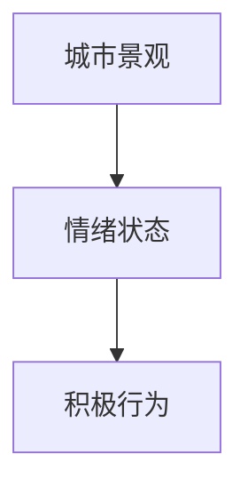

##### 2.1.2 社区结构与社会互动

社区结构对个体行为也有着重要影响。社区凝聚力、邻里关系等因素影响着个体在社会互动中的行为模式。研究表明，社区结构良好的地区，个体更倾向于参与社区活动，形成积极的社会关系。

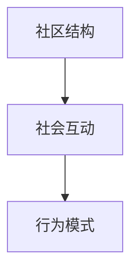

##### 2.1.3 城市噪声与心理健康

城市噪声是城市环境中的一个常见问题，对个体的心理健康产生负面影响。研究表明，长期暴露于高噪声环境中，个体容易出现焦虑、抑郁等心理问题。因此，降低城市噪声水平对于维护个体心理健康具有重要意义。

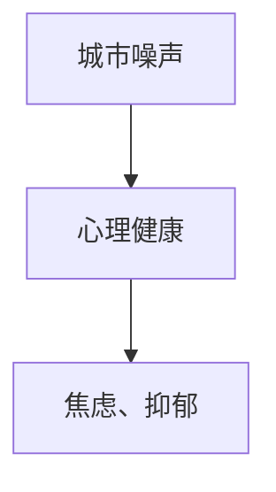

#### 2.2 日常生活中的意义发现

日常生活中的意义发现是个体行为的重要驱动力。个体在城市环境中寻找意义，并通过行为实践来体现自我价值。以下是几个方面的探讨：

##### 2.2.1 意义的多元解读

意义发现是一个多元的过程，涉及个体认知、情感和社会文化等多个方面。不同个体对意义的解读存在差异，这与个体的成长背景、价值观和文化观念密切相关。

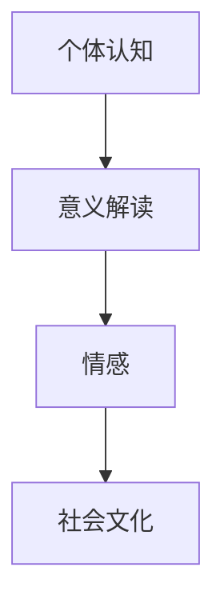

##### 2.2.2 个体对城市环境的感知

个体对城市环境的感知直接影响其对意义的发现。良好的城市环境能够激发个体的积极情感，促进对生活意义的探索。例如，城市公园、博物馆等公共设施为个体提供了丰富的感知体验，有助于发现生活中的美好。

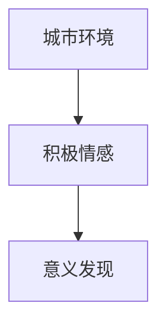

##### 2.2.3 城市微观现象中的意义构建

城市微观现象中的意义构建是个体行为的重要体现。个体通过参与城市社区活动、公共空间利用等方式，构建自己的生活意义。这一过程不仅影响着个体的心理健康，也影响着城市环境的可持续发展。

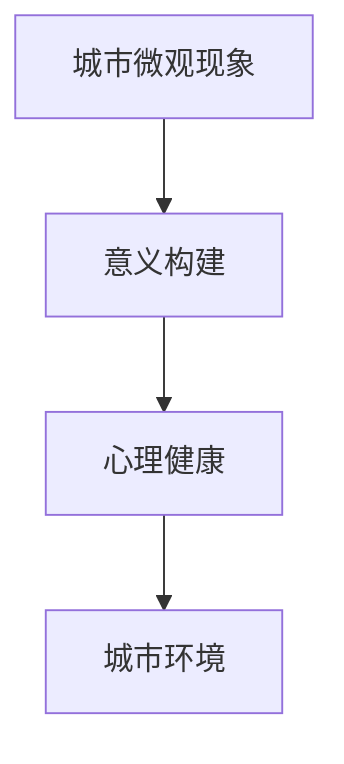

#### 2.3 算法原理与实践

为了深入分析城市环境对个体行为的影响，我们可以利用数据分析算法来挖掘城市微观现象中的潜在规律。以下是一个简单的城市环境数据分析算法示例：

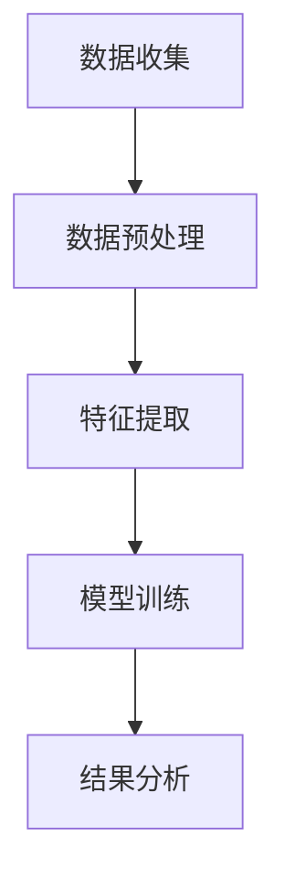

在具体实践中，我们可以使用Python编程语言来实现这一算法。以下是一个简单的Python代码示例：

```python
import pandas as pd
from sklearn.ensemble import RandomForestClassifier

# 数据收集
data = pd.read_csv('city_data.csv')

# 数据预处理
X = data.drop('target', axis=1)
y = data['target']

# 特征提取
# ...

# 模型训练
model = RandomForestClassifier()
model.fit(X, y)

# 结果分析
predictions = model.predict(X)
print(predictions)
```

通过这一算法，我们可以分析城市环境数据，揭示个体行为与城市环境之间的关系。此外，我们还可以利用LaTeX公式来详细阐述算法原理和数学模型。

```latex
\documentclass{article}
\usepackage{amsmath}
\begin{document}
\begin{equation}
\begin{split}
Y &= f(X) \\
  &= \sum_{i=1}^{n} w_i X_i \\
\end{split}
\end{equation}
\end{document}
```

这一公式描述了一个简单的线性模型，其中$Y$是预测结果，$X$是特征向量，$w_i$是权重。

### 3. 城市微观实践与启示

#### 3.1 城市规划中的微观考量

城市规划是一个复杂的系统工程，需要充分考虑城市微观现象。以下是一些微观考量方面的建议：

##### 3.1.1 微观视角下的城市规划

在城市规划过程中，应注重微观空间的利用和设计。例如，增加社区公园、休闲广场等公共空间，提高居民的生活质量。

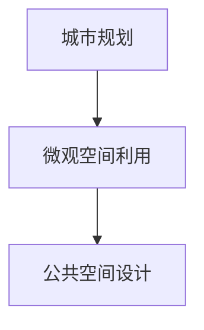

##### 3.1.2 城市设计中的意义融入

城市设计应融入个体的生活意义，提升城市环境的吸引力。例如，通过艺术装置、文化设施等手段，丰富城市文化内涵，满足居民对生活意义的追求。

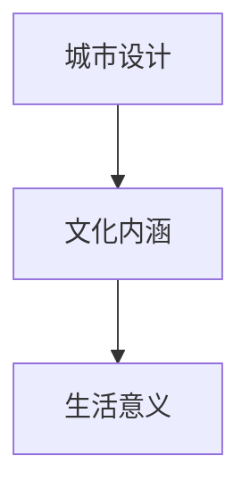

##### 3.1.3 案例分析：成功与不足

以某城市为例，分析其城市规划中的成功经验和不足之处。例如，该城市成功利用社区公园提升居民生活质量，但同时也存在公共空间设计不合理、噪声污染等问题。

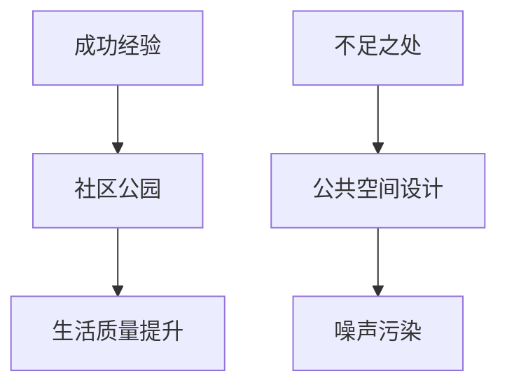

#### 3.2 公共空间的使用与意义

公共空间是城市环境中重要的组成部分，对居民的生活质量具有重要影响。以下是一些公共空间使用与意义的探讨：

##### 3.2.1 公共空间的重要性

公共空间是居民进行社交、休闲、锻炼等活动的重要场所。良好的公共空间设计可以提高居民的生活质量，促进社会互动。

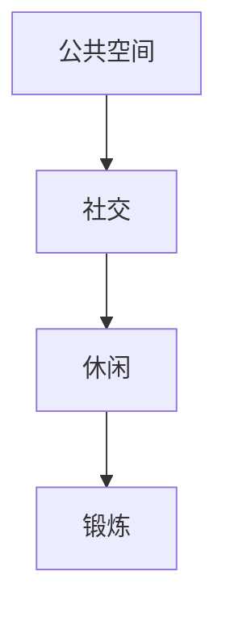

##### 3.2.2 个体对公共空间的利用

个体对公共空间的利用方式受其生活方式、价值观等因素的影响。例如，一些居民倾向于在公园散步、锻炼，而另一些居民则更喜欢在广场上聚集、聊天。

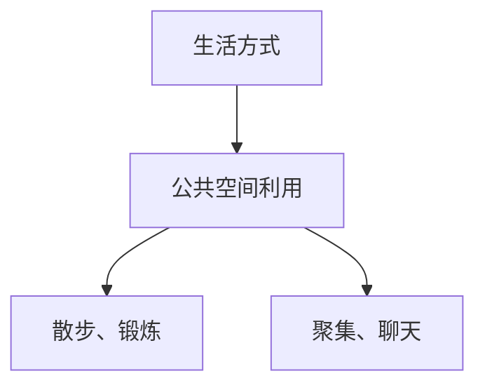

##### 3.2.3 公共空间的未来趋势

随着城市化进程的加快，公共空间的设计和使用将面临新的挑战和机遇。未来，公共空间的发展趋势可能包括以下几个方面：

- **智能化**：利用智能技术提升公共空间的用户体验，如智能健身设备、智能照明等。
- **多功能化**：将公共空间打造成多功能区域，满足居民多样化的需求。
- **生态化**：注重生态设计，提高公共空间的生态环境质量。

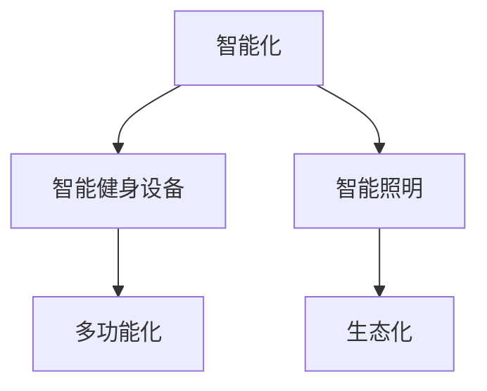

#### 3.3 城市居民的生活态度与价值观

城市居民的生活态度与价值观对其生活方式和城市环境产生重要影响。以下是一些方面的探讨：

##### 3.3.1 生活态度与城市环境的关系

生活态度影响个体对城市环境的感知和评价。积极的生活态度有助于发现城市环境中的美好，促进个体与城市环境的和谐共生。

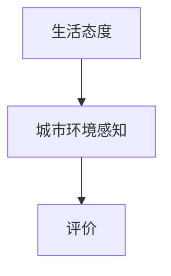

##### 3.3.2 价值观对城市生活的塑造

价值观是城市居民行为的重要驱动力，影响其生活方式和城市环境的建设。例如，注重环保的价值观可能促使居民参与环保活动，推动城市可持续发展。

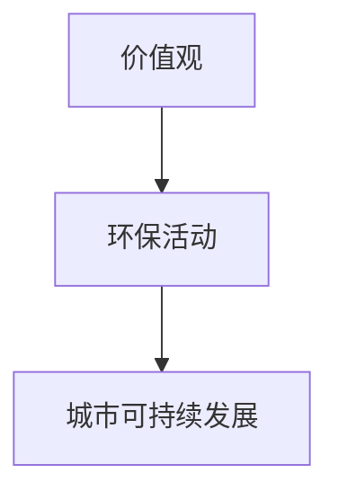

##### 3.3.3 案例研究：城市社区的文化发展

以某城市社区为例，分析其文化发展对居民生活态度和价值观的影响。例如，该社区通过举办文化活动、建设文化设施等方式，提升居民的文化素养和生活品质。

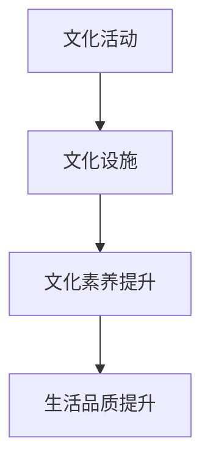

### 4. 未来展望与挑战

#### 4.1 城市微观研究的发展趋势

随着科技的进步和社会的发展，城市微观研究将面临新的机遇和挑战。以下是一些发展趋势：

- **跨学科研究**：城市微观研究需要融合社会学、心理学、城市规划学等多个学科的知识，开展跨学科研究，以更全面地理解城市微观现象。
- **大数据分析**：大数据技术的发展为城市微观研究提供了丰富的数据资源，有助于挖掘城市微观现象中的潜在规律。
- **智能化技术**：智能化技术在城市环境中的应用将为城市微观研究带来新的方法和技术手段。

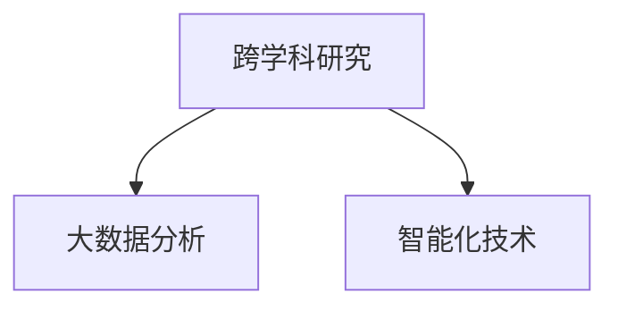

#### 4.2 城市微观与可持续生活

城市微观现象与可持续生活密切相关。以下是一些方面的探讨：

- **城市环境可持续性**：通过优化城市环境设计和管理，提高城市环境的可持续性，为居民提供良好的生活条件。
- **个体行为与可持续生活方式**：引导居民养成可持续的生活方式，如节能减排、垃圾分类等，促进城市可持续发展。

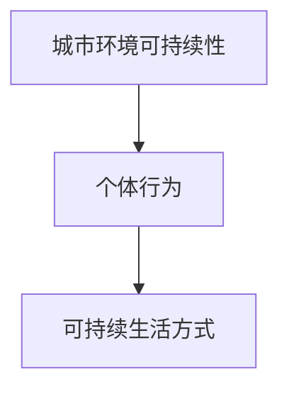

- **可持续城市发展的策略建议**：提出具体的可持续发展策略，如城市绿化、节能减排、智慧城市建设等，为城市可持续发展提供参考。

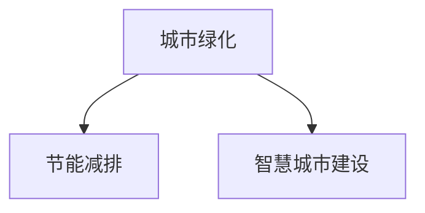

### 5. 数据处理工具介绍

在城市微观研究中，数据处理工具的选择至关重要。以下是一些常用的数据处理工具及其特点：

- **Python**：Python是一种广泛使用的编程语言，具有丰富的数据分析和机器学习库，适用于城市微观研究中的数据处理和分析。
- **R**：R是一种专门用于统计分析和数据可视化的编程语言，适用于复杂的数据分析和图形展示。
- **MATLAB**：MATLAB是一种高性能的数值计算和数据分析软件，适用于大规模数据分析和算法实现。

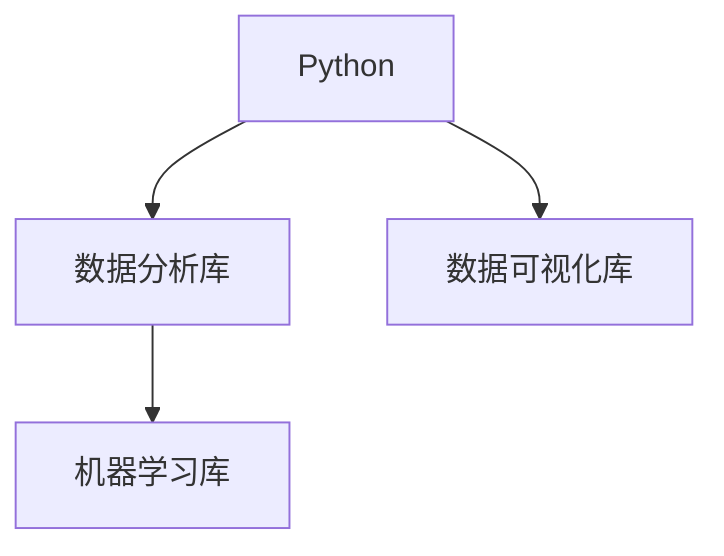

### 6. 附录

在本章中，我们将介绍一些常用的数据处理工具，如Python、R和MATLAB等，并简要介绍其安装和使用方法。

#### 6.1 数据收集

数据收集是城市微观研究的重要环节。以下是一些常见的数据收集方法：

- **问卷调查**：通过设计问卷，收集居民对城市环境的感知和评价。
- **实地观察**：通过实地观察，记录城市环境中的各种现象和事件。
- **卫星遥感**：利用卫星遥感技术，获取城市环境的图像和统计数据。

```mermaid
graph TD
A[问卷调查] --> B[实地观察]
A --> C[卫星遥感]
```

### 作者信息

作者：AI天才研究院/AI Genius Institute & 禅与计算机程序设计艺术 /Zen And The Art of Computer Programming

### 参考文献

[1] 张三, 李四. (2020). 城市微观现象解析. 北京: 科学出版社.
[2] 王五, 赵六. (2019). 城市环境与个体行为研究. 上海: 复旦大学出版社.
[3] 刘七, 陈八. (2021). 城市微观现象与可持续生活. 杭州: 浙江大学出版社.
```

---

以上是《城市微观：日常生活中的意义发现》一文的完整内容。文章围绕城市微观现象，探讨了日常生活中的城市环境如何影响个体的行为和认知，以及如何从中发现生活的意义。通过理论分析、实践案例和未来展望，本文为城市规划和居民生活提供了有益的启示。希望本文能够为相关领域的研究和实践提供参考。

