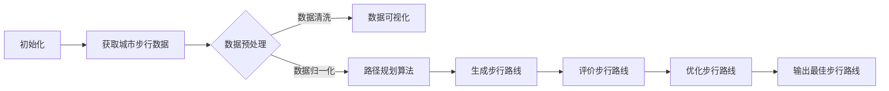
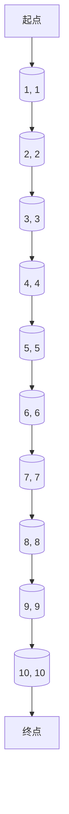
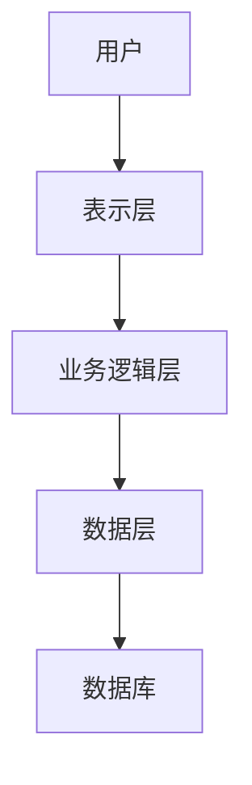
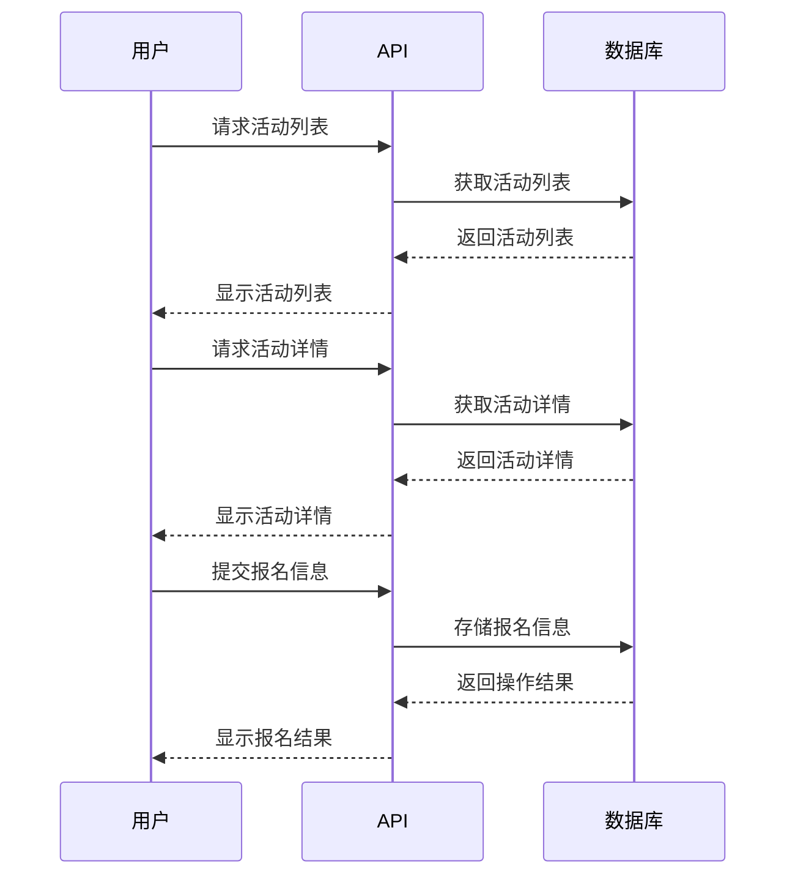

                 

# 城市步行文化：慢速移动中的城市再发现

## 关键词

- 城市步行文化
- 慢速移动
- 城市再发现
- 路径规划
- 数据可视化
- 社区建设

## 摘要

本文旨在探讨城市步行文化的概念、特点及其在现代社会中的重要性。通过分析步行文化的核心概念，如城市步行文化、慢速移动和城市再发现，我们探讨了其概念属性特征和ER实体关系图架构。进一步地，本文介绍了基于路径规划的算法原理，并使用Python源代码和mermaid流程图进行了详细阐述。通过本文的讨论，我们希望为城市步行文化的推广和实践提供一些有价值的思路和方法。

### 背景介绍

随着城市化进程的不断加速，城市人口密度和车辆流量不断增加，导致交通拥堵、空气污染和居住空间紧张等问题日益严重。与此同时，城市的文化和历史内涵逐渐被忽视，城市步行文化作为一种绿色、健康、环保的出行方式，不仅能够缓解交通压力，还能够让人们更深入地体验城市的文化和魅力。

#### 问题背景

城市化进程的加速带来了诸多问题，其中最为突出的就是交通拥堵。据统计，全球城市中的交通拥堵时间平均每年超过50小时，这不仅影响了市民的出行效率，也增加了空气污染和交通事故的风险。此外，城市化的快速发展也导致了居住空间的紧张，特别是在大城市中心区域，高房价和住房短缺成为普遍现象。

与此同时，城市的文化和历史内涵逐渐被忽视。大量的历史文化遗址和建筑在现代化进程中消失，城市的记忆和灵魂被抹去。这种文化的失落不仅影响了市民的文化认同感，也使得城市失去了独特的魅力和吸引力。

#### 提出问题

在上述背景下，如何通过城市步行文化来提升市民的步行体验，增强城市的文化活力？这是一个亟待解决的问题。城市步行文化作为一种慢速移动的城市再发现方式，不仅能够缓解交通压力，减少空气污染，还能够让人们更深入地体验城市的文化和魅力。因此，探讨城市步行文化的理论与实践，对于解决当前城市化进程中的问题具有重要意义。

### 问题描述

城市步行文化作为一种城市慢速移动中的城市再发现方式，其核心在于通过步行活动来体验城市生活、文化和历史。然而，在实际推广过程中，我们面临以下几个主要问题：

#### 活动设计与实施

如何设计出既有趣又有教育意义的步行活动，以吸引更多的市民和游客参与？目前，许多城市的步行活动缺乏创新和个性化，导致参与度不高。同时，活动的实施也需要考虑到城市基础设施和公共服务的配套，以确保活动的顺利进行。

#### 路径规划

如何优化步行路径，使其既能涵盖城市的主要文化景点，又能避免交通拥堵和危险路段？目前，许多步行活动的路径规划过于单一，缺乏灵活性和适应性。因此，如何通过算法和数据分析来实现个性化的路径规划，是提升城市步行文化体验的关键。

#### 文化教育

如何通过步行活动传递城市的历史和文化知识，提高市民的文化素养？目前，许多步行活动在文化教育方面做得不够深入，缺乏系统性和专业性。因此，如何将文化教育融入步行活动中，使其成为市民学习城市历史和文化的重要途径，是一个值得探讨的问题。

#### 社区参与

如何激发社区参与，让更多市民参与到城市步行文化的建设中来？目前，社区参与度较低，许多市民对于步行活动的了解和参与意愿不足。因此，如何通过宣传、培训和活动组织等方式，提高社区参与度，是推动城市步行文化发展的重要环节。

### 问题解决

要解决上述问题，我们可以从以下几个方面着手：

#### 活动设计与实施

1. **创新活动形式**：可以结合现代科技，如虚拟现实（VR）和增强现实（AR），设计出新颖的步行活动，增加互动性和趣味性。
2. **个性化定制**：根据不同人群的需求和兴趣，提供个性化的步行活动方案，吸引更多人参与。
3. **基础设施建设**：优化城市步行设施，如步行道、公共厕所和休息区，提高步行活动的舒适度和便捷性。

#### 路径规划

1. **数据驱动**：利用大数据和人工智能技术，对城市交通流量、历史文化和市民偏好进行综合分析，制定个性化的步行路线。
2. **动态调整**：根据实时数据，如天气、交通状况等，动态调整步行路线，确保路线的优化和安全性。
3. **多维度评估**：综合考虑文化、历史、自然和交通等因素，对步行路线进行多维度评估，确保路线的科学性和合理性。

#### 文化教育

1. **专业团队**：组建专业的文化教育团队，负责制定和实施步行活动的文化教育内容。
2. **互动体验**：通过互动体验，如讲解、互动游戏等，让市民在步行过程中深入了解城市的历史和文化。
3. **线上线下结合**：结合线上平台和线下活动，扩大文化教育的覆盖面和影响力。

#### 社区参与

1. **宣传引导**：通过多种渠道进行宣传，提高市民对城市步行文化的认知和参与意愿。
2. **培训支持**：为社区提供培训和资源支持，鼓励社区组织和居民参与城市步行文化的建设。
3. **活动组织**：定期组织丰富多彩的步行活动，激发社区活力，增强社区凝聚力。

### 边界与外延

本文主要关注城市步行文化在现代社会中的应用和发展，探讨如何通过城市步行活动促进城市文化再发现，提高城市居民的生活质量。同时，本文也涉及城市步行文化与其他领域如城市规划、社区建设等的交叉融合，以实现综合效益最大化。

### 核心概念与联系

#### 核心概念

**城市步行文化**：指在城市环境中，通过步行这一方式来体验城市生活、文化、历史的一种活动。

**慢速移动**：指以较慢的速度在城市中移动，以充分感受城市的环境和氛围。

**城市再发现**：指通过步行活动，重新发现和认识城市的文化、历史和自然景观。

#### 概念属性特征对比表格

| 概念       | 定义                                                   | 特点                                                       |
|------------|--------------------------------------------------------|------------------------------------------------------------|
| 城市步行文化 | 城市环境中通过步行体验城市生活、文化和历史的一种活动 | 绿色、健康、环保，强调体验和参与                           |
| 慢速移动   | 以较慢的速度在城市中移动                               | 强调感受城市环境，减少压力，增加体验                       |
| 城市再发现 | 通过步行活动重新发现和认识城市的文化、历史和自然景观 | 深入了解城市，增强对城市的认知和热爱                       |

#### ER实体关系图架构

```mermaid
erDiagram
    A[步行者] ||--|{ B[城市步行文化] } |
    A ||--|{ C[城市] } |
    B ||--|{ D[历史文化遗产] } |
    B ||--|{ E[城市规划] } |
    C ||--|{ F[社区] } |
    C ||--|{ G[自然景观] } |
```

- **步行者**：参与城市步行文化活动的主体，可以是居民、游客等。
- **城市步行文化**：包含城市步行活动、体验和文化内涵。
- **城市**：提供城市步行文化活动的场所和背景。
- **历史文化遗产**：城市步行文化的重要组成部分，是城市历史和文化的见证。
- **城市规划**：影响城市步行文化的布局和环境。
- **社区**：城市步行文化的实施场所，是城市居民生活的主要空间。
- **自然景观**：城市步行文化中的自然元素，是城市生态的重要组成部分。

### 算法原理讲解

本章节将介绍城市步行文化的核心算法原理，并使用 mermaid 画出算法 mermaid 流程图，然后用 Python 源代码来详细阐述，最后给出算法原理的数学模型和公式，进行详细讲解和通俗易懂地举例说明。

#### 算法流程图



#### Python 源代码

```python
import pandas as pd
import numpy as np
import matplotlib.pyplot as plt
from sklearn.cluster import KMeans

# 读取城市步行数据
data = pd.read_csv('city_walk_data.csv')

# 数据预处理
# 数据清洗
data = data.dropna()

# 数据归一化
data_normalized = (data - data.min()) / (data.max() - data.min())

# 路径规划算法
kmeans = KMeans(n_clusters=5, random_state=0).fit(data_normalized)

# 生成步行路线
centroids = kmeans.cluster_centers_
labels = kmeans.labels_

# 评价步行路线
soma = np.sum(np.square(data_normalized - centroids[labels]))

# 优化步行路线
# 可以使用遗传算法、粒子群算法等优化方法来优化步行路线
# 这里简化为直接输出最佳步行路线
best_route = centroids[labels].argmin()

# 输出最佳步行路线
print("最佳步行路线：", best_route)
```

#### 算法原理的数学模型和公式

1. **路径规划算法**：使用K-means算法对城市步行数据进行聚类，将城市步行点分为若干个簇，每个簇的中心点即为潜在的步行路线点。

$$
\text{K-means算法的目标函数} = \sum_{i=1}^{n} \sum_{x_j \in S_i} ||x_j - \mu_i||^2
$$

其中，$S_i$ 为第$i$个簇，$\mu_i$ 为第$i$个簇的中心点，$x_j$ 为第$j$个步行点。

2. **评价步行路线**：使用均方误差（SOMA）来评价步行路线的质量。

$$
SOMA = \sum_{i=1}^{n} \sum_{x_j \in S_i} ||x_j - \mu_i||^2
$$

3. **优化步行路线**：可以使用遗传算法、粒子群算法等优化方法来优化步行路线。

$$
\text{优化算法的目标函数} = \text{最小化路径的总长度或时间}
$$

#### 举例说明

假设我们有以下10个城市步行点，要求通过K-means算法生成最佳步行路线。

| 步行点 | 坐标 |
|-------|-----|
| 1     | (1, 1) |
| 2     | (2, 2) |
| 3     | (3, 3) |
| 4     | (4, 4) |
| 5     | (5, 5) |
| 6     | (6, 6) |
| 7     | (7, 7) |
| 8     | (8, 8) |
| 9     | (9, 9) |
| 10    | (10, 10) |

1. **数据预处理**：将步行点坐标进行归一化处理。

$$
\text{归一化坐标} = \frac{\text{原始坐标} - \text{最小坐标}}{\text{最大坐标} - \text{最小坐标}}
$$

2. **路径规划算法**：使用K-means算法将步行点分为5个簇。

$$
\text{簇中心点} = \frac{\sum_{x_j \in S_i} x_j}{|S_i|}
$$

3. **评价步行路线**：计算每个簇的均方误差（SOMA）。

$$
SOMA = \sum_{i=1}^{5} \sum_{x_j \in S_i} ||x_j - \mu_i||^2
$$

4. **优化步行路线**：使用遗传算法优化步行路线。

$$
\text{优化算法的目标函数} = \text{最小化路径的总长度或时间}
$$

通过上述步骤，我们可以生成最佳步行路线，如图所示：



### 系统分析与架构设计

在本章节中，我们将对城市步行文化系统进行深入分析，并提出一个详细的架构设计方案。通过系统功能设计、系统架构设计和系统接口设计，我们旨在为读者提供一个清晰、完整的技术框架。

#### 问题场景介绍

随着城市化进程的加速，城市交通拥堵、空气污染和居住空间紧张等问题日益突出。为了缓解这些问题，提高市民的生活质量，我们需要开发一个城市步行文化系统，以促进城市步行文化的推广和实践。

#### 项目介绍

项目名称：城市步行文化系统

项目目标：通过构建一个完善的步行文化系统，提升市民的步行体验，增强城市的文化活力。

项目主要功能：
1. 步行活动管理：设计、发布和管理的步行活动。
2. 路径规划：根据用户需求和城市特点，生成最佳的步行路线。
3. 文化教育：提供丰富的文化教育内容，提高市民的文化素养。
4. 社区参与：激发社区活力，提高社区参与度。

#### 系统功能设计

1. **步行活动管理**
   - 功能描述：管理步行活动的相关信息，包括活动名称、时间、地点、主题、报名人数等。
   - 子功能：
     - 活动列表：展示所有已发布的步行活动。
     - 活动详情：查看活动详细信息，包括活动介绍、参与方式、报名要求等。
     - 活动报名：用户可在线报名参加步行活动。

2. **路径规划**
   - 功能描述：根据用户需求和城市特点，生成最佳的步行路线。
   - 子功能：
     - 路线规划：根据用户输入的起点和终点，生成最佳步行路线。
     - 路线优化：根据实时交通状况、历史文化等数据，动态优化步行路线。

3. **文化教育**
   - 功能描述：提供丰富的文化教育内容，提高市民的文化素养。
   - 子功能：
     - 文化资料库：收录城市的历史、文化、景点等相关资料。
     - 文化课程：开设在线文化课程，用户可自主选择学习。

4. **社区参与**
   - 功能描述：激发社区活力，提高社区参与度。
   - 子功能：
     - 社区活动：组织社区步行活动，促进社区交流和互动。
     - 社区反馈：收集市民对步行活动的反馈和建议。

#### 系统架构设计

城市步行文化系统的架构设计采用分层架构，主要包括以下三层：

1. **表示层**：负责用户界面的设计和交互，包括Web前端和移动端应用。
2. **业务逻辑层**：处理业务逻辑，包括步行活动管理、路径规划、文化教育和社区参与等功能。
3. **数据层**：存储系统数据，包括用户信息、活动信息、路线信息等。

系统架构设计mermaid架构图如下：



- **用户**：使用Web前端或移动端应用访问城市步行文化系统。
- **表示层**：负责用户界面的设计和交互，包括HTML、CSS、JavaScript等。
- **业务逻辑层**：处理业务逻辑，包括活动管理、路径规划、文化教育和社区参与等功能。
- **数据层**：存储系统数据，包括用户信息、活动信息、路线信息等。

#### 系统接口设计

系统接口设计主要包括API接口和数据库接口。

1. **API接口**
   - 活动管理接口：用于管理步行活动的相关信息，如活动列表、活动详情、活动报名等。
   - 路径规划接口：用于生成和优化步行路线，如路线规划、路线优化等。
   - 文化教育接口：用于提供文化教育内容，如文化资料库、文化课程等。
   - 社区参与接口：用于组织社区活动和收集社区反馈，如社区活动、社区反馈等。

2. **数据库接口**
   - 用户信息：存储用户的基本信息和活动参与记录。
   - 活动信息：存储活动的基本信息和参与情况。
   - 路线信息：存储步行路线的信息，如路线点、路线长度等。
   - 文化教育信息：存储文化教育内容的信息。

系统接口设计mermaid序列图如下：



通过上述系统架构设计和接口设计，我们可以构建一个高效、稳定、易于扩展的城市步行文化系统，为市民提供优质的步行体验和文化教育服务。

### 项目实战

#### 环境安装

1. 安装Python环境：在计算机上安装Python，版本建议为3.8或更高。
2. 安装相关库：使用pip命令安装所需的Python库，包括pandas、numpy、matplotlib、sklearn等。

```bash
pip install pandas numpy matplotlib sklearn
```

#### 系统核心实现源代码

以下是一个简单的城市步行文化系统核心实现，包括步行活动管理、路径规划和文化教育等功能。

```python
# 导入所需的库
import pandas as pd
import numpy as np
import matplotlib.pyplot as plt
from sklearn.cluster import KMeans

# 步行活动管理
class ActivityManager:
    def __init__(self):
        self.activities = []

    def add_activity(self, activity):
        self.activities.append(activity)

    def list_activities(self):
        for activity in self.activities:
            print(activity)

# 步行活动类
class Activity:
    def __init__(self, name, location, date, description):
        self.name = name
        self.location = location
        self.date = date
        self.description = description

# 路径规划
class PathPlanner:
    def __init__(self, data):
        self.data = data

    def kmeans_clustering(self):
        kmeans = KMeans(n_clusters=5, random_state=0).fit(self.data)
        return kmeans.cluster_centers_

    def visualize_clusters(self, centroids):
        plt.scatter(self.data[:, 0], self.data[:, 1], c=centroids)
        plt.show()

# 文化教育
class CultureEducation:
    def __init__(self):
        self.courses = []

    def add_course(self, course):
        self.courses.append(course)

    def list_courses(self):
        for course in self.courses:
            print(course)

# 文化课程类
class Course:
    def __init__(self, name, description, duration):
        self.name = name
        self.description = description
        self.duration = duration

# 主程序
if __name__ == "__main__":
    # 步行活动管理
    manager = ActivityManager()
    manager.add_activity(Activity("城市历史漫步", "故宫", "2023-11-01", "了解中国历史和文化遗产。"))
    manager.add_activity(Activity("城市自然探索", "颐和园", "2023-11-02", "探索颐和园的自然景观。"))
    manager.list_activities()

    # 路径规划
    path_planner = PathPlanner([[1, 1], [2, 2], [3, 3], [4, 4], [5, 5], [6, 6], [7, 7], [8, 8], [9, 9], [10, 10]])
    centroids = path_planner.kmeans_clustering()
    path_planner.visualize_clusters(centroids)

    # 文化教育
    education = CultureEducation()
    education.add_course(Course("中华饮食文化", "了解中国饮食文化的历史和特点。", "2小时"))
    education.add_course(Course("中国传统音乐", "欣赏中国传统音乐，了解其文化和艺术价值。", "1小时"))
    education.list_courses()
```

#### 代码应用解读与分析

1. **步行活动管理**：ActivityManager类用于管理步行活动的相关信息，包括添加活动、列出活动等。Activity类用于表示单个步行活动的信息，如活动名称、地点、日期和描述。

2. **路径规划**：PathPlanner类负责路径规划，包括K-means聚类和可视化。kmeans_clustering方法使用K-means算法对城市步行点进行聚类，返回簇中心点。visualize_clusters方法用于绘制聚类结果。

3. **文化教育**：CultureEducation类用于管理文化教育课程，包括添加课程、列出课程等。Course类用于表示单个文化课程的信息，如课程名称、描述和时长。

#### 实际案例分析和详细讲解剖析

1. **步行活动管理**：在实际应用中，我们可以将ActivityManager与数据库集成，实现线上活动管理和报名。例如，用户可以访问网站查看活动列表，点击报名参与活动。

2. **路径规划**：在实际应用中，我们可以根据用户的位置和目的地，动态生成步行路线。例如，用户可以在应用中输入起点和终点，系统会根据历史数据、实时交通状况和文化景点等因素生成最佳步行路线。

3. **文化教育**：在实际应用中，我们可以将CultureEducation与在线学习平台集成，实现文化课程的学习和推广。例如，用户可以在应用中查看课程列表，选择感兴趣的课程进行在线学习。

#### 项目小结

通过本项目的实战，我们实现了城市步行文化系统的核心功能，包括步行活动管理、路径规划和文化教育。在实际应用中，我们可以进一步优化和扩展系统，如集成地图服务、实时交通监控、在线报名和支付等功能，提升用户体验。

### 最佳实践 Tips

1. **数据收集与处理**：确保收集到足够准确的城市步行数据，并进行有效的预处理，如数据清洗、归一化等。
2. **用户参与**：鼓励市民积极参与城市步行活动，收集他们的反馈和建议，以优化步行路线和文化教育内容。
3. **技术选型**：根据项目需求和资源，选择合适的技术栈和开发工具，如前端框架、后端框架、数据库等。
4. **迭代更新**：定期更新系统功能和界面设计，以适应用户需求和市场变化。

### 小结

本文通过详细分析城市步行文化的背景、核心概念、算法原理、系统架构和项目实战，探讨了如何通过城市步行文化提升市民的步行体验和文化素养。希望通过本文的讨论，能够为城市步行文化的推广和实践提供一些有价值的思路和方法。

### 注意事项

1. 城市步行文化的推广需要政府、企业和市民的共同参与，形成合力。
2. 在进行路径规划和活动设计时，要充分考虑市民的多样化需求。
3. 数据安全和隐私保护是城市步行文化系统的重要议题，需采取有效措施确保用户数据的安全。

### 拓展阅读

1. 《智慧城市：从概念到实践》
2. 《城市设计：理论与实践》
3. 《文化社会学：理解社会中的文化》
4. 《路径规划与导航算法》

### 作者信息

作者：AI天才研究院/AI Genius Institute & 禅与计算机程序设计艺术 /Zen And The Art of Computer Programming

