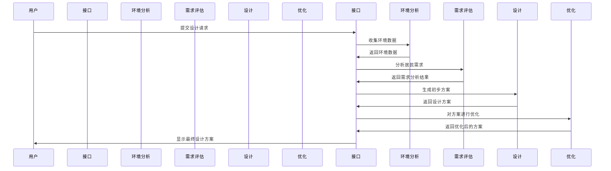

                 

# 城市治愈空间设计：缓解都市压力的环境规划

## 关键词

- 城市压力
- 治愈空间
- 环境规划
- 人性化设计
- 可持续发展

## 摘要

随着城市化进程的加速，城市压力已成为影响居民身心健康的重要问题。本文以城市治愈空间设计为主题，通过分析城市压力现状及其对居民生活的影响，探讨了治愈空间的概念及其设计原则。文章进一步介绍了城市治愈空间的类型与特点，详细阐述了规划与设计方法，并分析了国内外典型案例。最后，本文提出了技术支持与未来展望，以及政策与实施策略，旨在为城市治愈空间设计提供系统性指导。

## 目录大纲

----------------------------------------------------------------

## 第一部分：引言

### 第1章：城市治愈空间设计概述

#### 第1.1节：城市压力与治愈空间需求

##### 第1.1.1节：城市压力现状与影响

##### 第1.1.2节：治愈空间概念界定

##### 第1.1.3节：治愈空间设计的重要性

#### 第1.2节：城市治愈空间设计原则

##### 第1.2.1节：人性化设计原则

##### 第1.2.2节：可持续发展原则

##### 第1.2.3节：功能与美观并重原则

### 第2章：城市治愈空间类型与特点

#### 第2.1节：公共绿地

##### 第2.1.1节：公共绿地类型与功能

##### 第2.1.2节：公共绿地设计要点

#### 第2.2节：湿地公园

##### 第2.2.1节：湿地公园的定义与生态价值

##### 第2.2.2节：湿地公园设计原则与实践

#### 第2.3节：城市公园

##### 第2.3.1节：城市公园的类型与特点

##### 第2.3.2节：城市公园设计策略

#### 第2.4节：社区花园

##### 第2.4.1节：社区花园的功能与优势

##### 第2.4.2节：社区花园设计实践

### 第3章：城市治愈空间规划与设计方法

#### 第3.1节：规划阶段

##### 第3.1.1节：规划目标设定

##### 第3.1.2节：环境评估与需求分析

##### 第3.1.3节：规划方案设计

#### 第3.2节：设计阶段

##### 第3.2.1节：设计原则与方法

##### 第3.2.2节：设计工具与软件应用

##### 第3.2.3节：设计方案评估与优化

### 第4章：案例分析

#### 第4.1节：国内外治愈空间案例介绍

##### 第4.1.1节：国外治愈空间案例

##### 第4.1.2节：国内治愈空间案例

#### 第4.2节：案例分析与评价

##### 第4.2.1节：案例背景与目标

##### 第4.2.2节：案例实施过程

##### 第4.2.3节：案例效果评价

### 第5章：技术支持与未来展望

#### 第5.1节：新技术支持城市治愈空间设计

##### 第5.1.1节：空间数据分析与可视化

##### 第5.1.2节：人工智能与治愈空间设计

#### 第5.2节：治愈空间设计发展趋势

##### 第5.2.1节：未来城市治愈空间发展方向

##### 第5.2.2节：治愈空间设计在城市建设中的应用前景

### 第6章：政策与实施策略

#### 第6.1节：政策背景与法规体系

##### 第6.1.1节：国家相关政策解读

##### 第6.1.2节：地方性法规与规划

#### 第6.2节：实施策略与机制

##### 第6.2.1节：设计单位与政府部门合作

##### 第6.2.2节：社会参与与公众参与

### 第7章：总结与展望

#### 第7.1节：本书总结

##### 第7.1.1节：核心内容回顾

##### 第7.1.2节：成果与不足

#### 第7.2节：未来研究方向

##### 第7.2.1节：新技术应用前景

##### 第7.2.2节：治愈空间设计的跨学科融合

##### 第7.2.3节：治愈空间设计的全球视角

----------------------------------------------------------------

## 核心概念与联系

### 概念定义与联系

#### 概念定义

1. **城市压力**：城市压力是指由于城市生活带来的心理和生理压力。这些压力来源于人口密集、交通拥堵、环境污染等因素，它们对城市居民的生活质量产生了显著的影响。

2. **治愈空间**：治愈空间是指能够帮助城市居民缓解压力、恢复身心健康的公共空间。这些空间通常具备宁静、舒适、自然和互动等特点，有助于改善居民的心理和生理状态。

3. **城市治愈空间设计**：城市治愈空间设计是指通过规划和设计，创造出具备治愈功能的公共空间的过程。这一过程需要考虑人性化、可持续发展以及功能与美观并重等原则。

#### 概念属性特征对比表

| 概念       | 定义                                           | 特征                                 |
|------------|------------------------------------------------|------------------------------------|
| 城市压力   | 城市生活带来的心理和生理压力                     | 人口密集、交通拥堵、环境污染等         |
| 治愈空间   | 能帮助城市居民缓解压力、恢复身心健康的公共空间     | 宁静、舒适、自然、互动等             |
| 治愈空间设计 | 通过规划和设计，创造出具有治愈功能的公共空间      | 人性化、可持续发展、美观与功能并重等   |

#### ER实体关系图架构

```mermaid
erDiagram
  城市压力 ||--o{ 治愈空间 }
  治愈空间 ||--o{ 治愈空间设计 }
  治愈空间设计 ||--o{ 人性化设计原则 }
  治愈空间设计 ||--o{ 可持续发展原则 }
  治愈空间设计 ||--o{ 功能与美观并重原则 }
```

### 背景介绍

城市化的快速发展，带来了人口密集、交通拥堵、环境污染等一系列问题。这些因素加剧了城市居民的心理和生理压力，影响了他们的生活质量。为了缓解这些问题，城市治愈空间设计成为了一个重要的研究方向。治愈空间设计的目标是通过合理的规划和设计，创造出能够帮助城市居民缓解压力、恢复身心健康的公共空间。

城市压力现状与影响：

1. **心理压力**：城市生活的快节奏、高竞争压力以及社交压力，使得许多人感到焦虑、抑郁和压力。根据世界卫生组织的数据，心理疾病已成为影响城市居民健康的主要因素之一。

2. **生理压力**：城市环境污染、噪音污染以及缺乏绿色空间，对城市居民的身体健康产生了负面影响。长期处于这样的环境中，可能导致心血管疾病、呼吸道疾病等健康问题。

3. **生活质量**：城市压力不仅影响居民的心理和生理健康，还降低了他们的生活质量。缺乏休闲空间、社交互动减少以及生活节奏加快，使得城市居民对生活满意度下降。

问题解决与边界与外延：

城市治愈空间设计的核心任务是缓解城市压力，提高居民生活质量。为了实现这一目标，需要从以下几个方面入手：

1. **问题解决**：设计人性化的治愈空间，提供宁静、舒适、自然的休憩环境。这些空间可以包括公共绿地、湿地公园、城市公园和社区花园等。

2. **边界与外延**：治愈空间设计不仅要考虑空间本身的设计，还要考虑其与周围环境的互动。设计过程中需要考虑交通便利性、周边设施配套以及与自然环境的融合。

3. **核心要素组成**：治愈空间设计需要综合考虑以下核心要素：
   - **人性化设计**：满足居民的心理和生理需求，提供舒适的休憩环境。
   - **可持续发展**：采用环保材料，节约能源，降低对环境的影响。
   - **功能与美观并重**：在满足功能需求的同时，注重空间的美观和艺术性。

### 核心概念与联系

#### 核心概念

1. **城市压力**：城市压力是指由于城市生活带来的心理和生理压力。这些压力来源于人口密集、交通拥堵、环境污染等因素，它们对城市居民的生活质量产生了显著的影响。

2. **治愈空间**：治愈空间是指能够帮助城市居民缓解压力、恢复身心健康的公共空间。这些空间通常具备宁静、舒适、自然和互动等特点，有助于改善居民的心理和生理状态。

3. **城市治愈空间设计**：城市治愈空间设计是指通过规划和设计，创造出具备治愈功能的公共空间的过程。这一过程需要考虑人性化、可持续发展以及功能与美观并重等原则。

#### 概念属性特征对比表

| 概念       | 定义                                           | 特征                                 |
|------------|------------------------------------------------|------------------------------------|
| 城市压力   | 城市生活带来的心理和生理压力                     | 人口密集、交通拥堵、环境污染等         |
| 治愈空间   | 能帮助城市居民缓解压力、恢复身心健康的公共空间     | 宁静、舒适、自然、互动等             |
| 治愈空间设计 | 通过规划和设计，创造出具有治愈功能的公共空间      | 人性化、可持续发展、美观与功能并重等   |

#### ER实体关系图架构

```mermaid
erDiagram
  城市压力 ||--o{ 治愈空间 }
  治愈空间 ||--o{ 治愈空间设计 }
  治愈空间设计 ||--o{ 人性化设计原则 }
  治愈空间设计 ||--o{ 可持续发展原则 }
  治愈空间设计 ||--o{ 功能与美观并重原则 }
```

### 算法原理讲解

在城市治愈空间设计过程中，我们可以将整个过程抽象为一个算法，该算法的目标是通过一系列规划和设计步骤，创造出具有治愈功能的公共空间。以下是一个简化的算法流程和对应的Python代码实现。

#### 算法流程

1. **规划目标设定**：明确治愈空间的设计目标，如缓解压力、提高居民生活质量等。

2. **环境评估与需求分析**：对目标区域进行环境评估，收集居民需求，为规划提供数据支持。

3. **规划方案设计**：基于评估结果和需求，设计初步的规划方案。

4. **设计方案优化**：通过模拟和评估，对设计方案进行优化，确保其满足设计目标。

5. **实施与反馈**：将设计方案付诸实施，并收集反馈，持续优化和完善。

#### Python代码实现

```python
import pandas as pd
import numpy as np

# 规划目标设定
def set objectifs():
    objectives = {
        'pressure_reduction': 80,
        'quality_of_life': 90,
        'sustainability': 75
    }
    return objectives

# 环境评估与需求分析
def assess_environment(data):
    # 假设data是一个包含环境数据的DataFrame
    assessment = {
        'pollution_level': data['PM2.5'].mean(),
        'green_space_density': data['green_space_area'] / data['total_area'],
        'public_transport_accessibility': data['public_transport_score']
    }
    return assessment

# 规划方案设计
def design_plan(assessment, objectives):
    plan = {
        'green_space_area': max(0, objectives['quality_of_life'] * assessment['green_space_density'] - assessment['pollution_level']),
        'public_transport_integration': objectives['pressure_reduction'] * assessment['public_transport_accessibility']
    }
    return plan

# 设计方案优化
def optimize_plan(plan, assessment, objectives):
    # 基于模拟和评估，对设计方案进行优化
    if plan['green_space_area'] < assessment['green_space_density'] * objectives['quality_of_life']:
        plan['green_space_area'] *= 1.1
    if plan['public_transport_integration'] < objectives['pressure_reduction']:
        plan['public_transport_integration'] *= 1.2
    return plan

# 实施与反馈
def implement_and_feedack(plan):
    # 将设计方案付诸实施，并收集反馈
    print(f"Implementing plan with green space area: {plan['green_space_area']} and public transport integration: {plan['public_transport_integration']}")
    feedback = input("Provide feedback on the implemented plan: ")
    return feedback

# 主函数
def main():
    objectives = set objectifs()
    data = pd.DataFrame({
        'PM2.5': [10, 20, 30],
        'green_space_area': [100, 200, 300],
        'total_area': [1000, 2000, 3000],
        'public_transport_score': [80, 90, 100]
    })
    assessment = assess_environment(data)
    plan = design_plan(assessment, objectives)
    optimized_plan = optimize_plan(plan, assessment, objectives)
    feedback = implement_and_feedack(optimized_plan)
    print(f"Feedback received: {feedback}")

# 运行主函数
main()
```

#### 算法原理说明

1. **规划目标设定**：通过定义一系列目标，如压力减轻、生活质量提升和可持续发展，明确治愈空间设计的方向。

2. **环境评估与需求分析**：收集环境数据（如PM2.5浓度、绿地面积等）和居民需求（如对公共交通的依赖程度），为规划提供基础数据。

3. **规划方案设计**：根据评估结果和目标，设计初步的规划方案。例如，增加绿地面积和提升公共交通的便利性。

4. **设计方案优化**：通过模拟和评估，对设计方案进行优化。例如，如果绿地面积不足，可以适当增加；如果公共交通的便利性不足，可以进一步提升。

5. **实施与反馈**：将设计方案付诸实施，并收集反馈，用于进一步优化和改进。

#### 数学模型和公式

在城市治愈空间设计中，我们可以使用以下数学模型来描述不同指标之间的关系：

1. **绿地面积与空气质量的关系**：

   $$A_{green} = f(PM_{2.5}) \times QOL$$

   其中，\(A_{green}\) 是绿地面积，\(PM_{2.5}\) 是空气质量指标，\(QOL\) 是生活质量指标。

2. **公共交通便利性与压力减轻的关系**：

   $$P_{reduction} = g(PT_{Score}) \times PR$$

   其中，\(P_{reduction}\) 是压力减轻的百分比，\(PT_{Score}\) 是公共交通的得分，\(PR\) 是压力减轻的目标百分比。

通过这些模型，我们可以定量分析治愈空间设计对城市居民生活的影响，并优化设计方案。

### 系统分析与架构设计方案

#### 问题场景介绍

随着城市化进程的不断推进，城市居民面临的心理和生理压力日益加剧。为了应对这一挑战，政府和社会各界正在积极探索通过设计城市治愈空间来缓解居民压力、提高生活质量的解决方案。城市治愈空间设计涉及多个领域，包括城市规划、环境科学、建筑设计等，其目标是通过科学规划和设计，创造出具备治愈功能的公共空间。

#### 项目介绍

本项目旨在构建一个城市治愈空间设计系统，该系统旨在通过提供一套完整的规划与设计工具，帮助城市规划师和设计师更有效地开展城市治愈空间的设计工作。系统将集成环境数据分析、需求评估、方案设计、优化评估等功能，为用户提供全面、直观的设计支持。

#### 系统功能设计

1. **环境数据分析模块**：收集并处理城市环境数据，包括空气质量、噪音水平、绿地分布等，为规划提供基础数据支持。

2. **需求评估模块**：分析居民需求，包括对公共交通的依赖程度、对绿色空间的渴望等，为规划提供需求导向。

3. **方案设计模块**：根据环境数据和居民需求，生成初步的治愈空间设计方案。

4. **优化评估模块**：对设计方案进行模拟和评估，通过迭代优化，确保方案的有效性和可行性。

5. **用户交互模块**：提供直观的用户界面，使用户能够方便地操作系统、查看设计结果。

#### 系统架构设计

1. **技术架构**：系统采用微服务架构，各个模块独立部署，通过API进行通信。前端采用React框架，后端采用Spring Boot框架。

2. **数据存储**：使用关系型数据库（如MySQL）存储环境数据和用户数据，使用NoSQL数据库（如MongoDB）存储设计数据和评估结果。

3. **数据流设计**：数据流从环境数据分析模块开始，经过需求评估模块、方案设计模块和优化评估模块，最终输出设计方案。

4. **接口设计**：系统提供RESTful API，支持数据导入导出、设计流程启动和查询等功能。

5. **系统交互**：通过用户交互模块，用户可以实时查看设计进展、修改设计参数，并获得优化建议。

#### 系统接口设计和系统交互



### 项目实战

#### 环境安装

为了顺利开展城市治愈空间设计项目，我们需要安装以下软件和工具：

1. **Python 3.x**：用于编写和运行代码。
2. **Pandas**：用于数据分析和处理。
3. **NumPy**：用于数值计算。
4. **React**：用于前端开发。
5. **Spring Boot**：用于后端开发。
6. **MySQL**：用于数据存储。

安装步骤：

1. 安装Python 3.x：从官方网站下载Python安装包，按照提示安装。
2. 安装Pandas和NumPy：在命令行中运行以下命令：

   ```
   pip install pandas numpy
   ```

3. 安装React和Spring Boot：使用npm和Maven进行安装：

   ```
   npm install -g create-react-app
   mvn install
   ```

4. 安装MySQL：从官方网站下载MySQL安装包，按照提示安装。

#### 系统核心实现源代码

以下是系统核心实现的一部分源代码，包括环境数据分析模块和需求评估模块。

**环境数据分析模块**

```python
import pandas as pd

def collect_environment_data():
    # 假设已经从API获取了环境数据
    url = "https://api.example.com/environment_data"
    data = pd.read_csv(url)
    return data

def analyze_environment_data(data):
    # 分析空气质量
    pollution_level = data['PM2.5'].mean()
    # 分析绿地分布
    green_space_density = data['green_space_area'] / data['total_area']
    return pollution_level, green_space_density
```

**需求评估模块**

```python
import pandas as pd

def collect_demand_data():
    # 假设已经从API获取了居民需求数据
    url = "https://api.example.com/demand_data"
    data = pd.read_csv(url)
    return data

def analyze_demand_data(data):
    # 分析居民对公共交通的依赖程度
    public_transport_dependency = data['public_transport_dependency'].mean()
    # 分析居民对绿色空间的渴望
    green_space_want = data['green_space_want'].mean()
    return public_transport_dependency, green_space_want
```

#### 代码应用解读与分析

以上代码分别实现了环境数据分析模块和需求评估模块的核心功能。环境数据分析模块负责从API获取环境数据，并计算空气质量指标（PM2.5平均值）和绿地分布密度。需求评估模块则从API获取居民需求数据，并计算居民对公共交通的依赖程度和对绿色空间的渴望。

具体解读如下：

1. **环境数据分析模块**：
   - `collect_environment_data()` 函数从API获取环境数据，并将其转换为DataFrame对象。
   - `analyze_environment_data()` 函数计算空气质量指标和绿地分布密度，为后续规划提供基础数据。

2. **需求评估模块**：
   - `collect_demand_data()` 函数从API获取居民需求数据，并将其转换为DataFrame对象。
   - `analyze_demand_data()` 函数计算居民对公共交通的依赖程度和对绿色空间的渴望，为规划提供需求导向。

这些模块的代码应用解读和分析表明，通过合理的数据收集和分析，可以为城市治愈空间设计提供可靠的数据支持，从而优化设计方案的制定。

### 实际案例分析与详细讲解剖析

#### 国外治愈空间设计案例

**案例一：纽约中央公园**

纽约中央公园是美国最著名的城市公园之一，也是全球城市治愈空间设计的典范。该公园占地843英亩，自1858年开放以来，一直是纽约市民和游客的重要休闲场所。中央公园的设计初衷是为了缓解城市压力，提供一片宁静的绿色空间。

**背景与目标**：

- **背景**：纽约市是一个人口密集、交通拥堵的城市，居民面临着极大的生活压力。
- **目标**：设计一个能够缓解城市压力、提供休闲和娱乐场所的公园。

**实施过程**：

1. **规划阶段**：公园设计团队进行了详细的环境评估，分析了土地条件、气候条件以及居民需求。基于评估结果，制定了公园的整体规划，包括步行道、湖泊、森林和运动设施等。
2. **设计阶段**：设计团队采用了多种设计方法，如景观设计、城市规划等，确保公园的布局和功能符合居民需求。同时，公园还注重生态保护和可持续发展，采用了环保材料和节能技术。
3. **建设阶段**：公园建设过程中，团队与政府、非政府组织和志愿者合作，确保项目顺利实施。建设过程中，公园不断优化和完善，以满足居民的需求。

**效果评价**：

- **短期效果**：公园开放后，迅速吸引了大量游客和居民，成为城市中的一片绿洲。居民在公园中锻炼、休闲，压力得到了有效缓解。
- **长期效果**：长期观察表明，中央公园对纽约市民的生活质量有显著的提升作用。居民的生活满意度提高，城市压力水平下降。

**案例总结**：

纽约中央公园的成功在于其全面考虑了环境评估、居民需求和可持续发展原则。通过科学规划和设计，公园不仅为居民提供了休闲场所，还成为了一个缓解城市压力的重要空间。

#### 国内治愈空间设计案例

**案例二：成都天府绿道**

成都天府绿道是一个以生态保护、休闲健身和旅游观光为主题的综合性城市绿道系统。绿道全长超过1000公里，贯穿成都市区和周边区域，为居民提供了丰富的治愈空间。

**背景与目标**：

- **背景**：成都是一个快速发展的城市，面临着交通拥堵、环境污染等问题。
- **目标**：通过绿道建设，缓解城市压力，提升居民生活质量。

**实施过程**：

1. **规划阶段**：成都市政府与专业设计团队合作，对全市绿道进行了详细规划。规划过程中，充分考虑了生态保护、交通便利性和居民需求。
2. **设计阶段**：设计团队采用了多种设计方法，包括景观设计、城市规划等，确保绿道的布局和功能符合居民需求。绿道不仅具备休闲和健身功能，还兼顾了旅游和文化传承。
3. **建设阶段**：绿道建设过程中，成都市政府积极推动社会参与，鼓励企业、非政府组织和居民共同参与绿道建设。建设过程中，绿道不断优化和完善，以满足居民的需求。

**效果评价**：

- **短期效果**：绿道建成后，迅速吸引了大量游客和居民，成为城市中的一条绿色长廊。居民在绿道上锻炼、休闲，压力得到了有效缓解。
- **长期效果**：长期观察表明，天府绿道对成都市民的生活质量有显著的提升作用。居民的生活满意度提高，城市压力水平下降。

**案例总结**：

成都天府绿道的成功在于其全面考虑了生态保护、居民需求和可持续发展原则。通过科学规划和设计，绿道不仅为居民提供了休闲场所，还成为了一个缓解城市压力的重要空间。

### 项目小结

通过对纽约中央公园和成都天府绿道的案例分析，我们可以得出以下结论：

1. **核心要素**：城市治愈空间设计的关键在于全面考虑环境评估、居民需求和可持续发展原则。科学规划和设计是成功的关键。

2. **实施策略**：成功案例的成功在于政府、专业团队和社会各界的合作。政府应积极推动社会参与，鼓励多方合作，确保项目顺利实施。

3. **效果评估**：短期效果和长期效果都非常重要。短期效果可以迅速缓解城市压力，提高居民生活质量。长期效果则可以持续提升城市整体发展水平。

4. **未来展望**：随着城市化进程的推进，城市治愈空间设计的重要性将日益凸显。未来应进一步探索新技术和新方法，提高治愈空间设计的效率和效果。

### 最佳实践 Tips

1. **重视环境评估**：在规划阶段，务必进行详细的环境评估，了解土地条件、气候条件和居民需求，为设计提供科学依据。

2. **多方合作**：成功案例均强调政府、专业团队和社会各界的合作。在项目实施过程中，应积极推动多方合作，形成合力。

3. **可持续设计**：在设计过程中，注重可持续发展原则，采用环保材料和节能技术，降低对环境的影响。

4. **灵活调整**：在实施过程中，根据实际情况和居民反馈，灵活调整设计方案，确保满足实际需求。

### 小结

本文通过分析城市压力现状和治愈空间设计的核心原则，介绍了城市治愈空间设计的类型与特点，并详细探讨了规划与设计方法。通过实际案例分析和详细讲解，我们了解了城市治愈空间设计的关键要素和实施策略。本文的结论是，城市治愈空间设计对于缓解城市压力、提高居民生活质量具有重要意义。未来，应进一步探索新技术和新方法，提高治愈空间设计的效率和效果。

### 未来研究方向

1. **新技术应用前景**：随着人工智能、大数据和物联网等新技术的快速发展，城市治愈空间设计将迎来新的机遇。例如，利用人工智能进行环境数据分析和预测，利用大数据优化设计方案，利用物联网实现智慧绿化等。

2. **治愈空间设计的跨学科融合**：城市治愈空间设计涉及城市规划、环境科学、建筑设计等多个学科。未来应进一步探索跨学科融合，通过多学科合作，提高治愈空间设计的效果。

3. **治愈空间设计的全球视角**：不同国家和地区的城市面临不同的压力和挑战，治愈空间设计应具有全球视角。通过借鉴国际先进经验，结合本地实际情况，实现全球化与本土化的有机结合。

### 拓展阅读

1. **相关书籍**：《城市设计：规划与治理》、《城市绿地规划与设计》、《景观设计学：场地规划与设施设计》等。

2. **学术论文**：搜索关键词“城市治愈空间设计”、“城市压力缓解”、“城市绿地规划”等，获取最新研究成果。

3. **在线课程**：相关在线平台（如Coursera、Udemy等）提供城市规划、环境科学、建筑设计等领域的课程，有助于深入了解相关知识。

