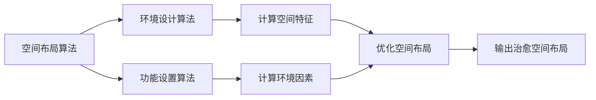
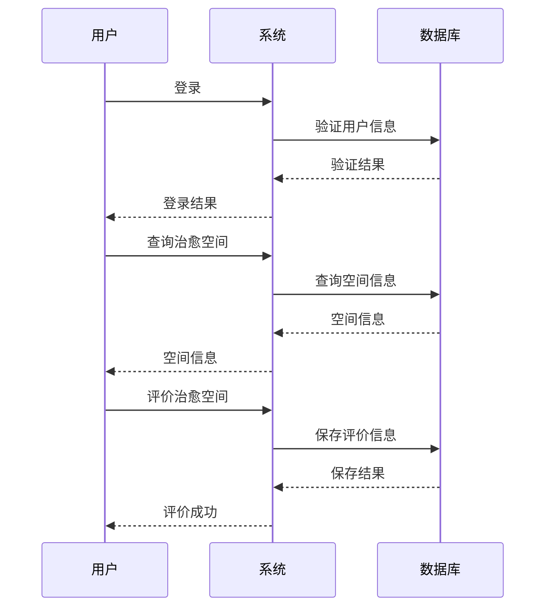

                 

# 城市治愈空间：都市压力的自我修复

## 关键词
- 城市治愈空间
- 都市压力
- 自我修复
- 空间设计
- 技术应用

## 摘要
本文旨在探讨城市治愈空间的概念、设计和建设，为现代都市人提供一种有效的自我修复方式。通过深入分析空间布局、环境设计、功能设置、技术手段和用户体验等核心概念，本文提出了一套系统性的解决方案，旨在缓解都市压力，提高居民的生活质量。

### 第一部分：背景介绍

#### 1.1.1 问题背景

在当今快节奏的城市生活中，人们面临着巨大的压力和挑战。城市环境的拥挤、污染、噪音等问题日益严重，对人们的身心健康造成了负面影响。为了应对这些挑战，近年来出现了“城市治愈空间”这一概念，旨在为城市居民提供一个舒适、宁静的场所，帮助他们在繁忙的生活中找到自我修复的空间。

#### 1.1.2 问题描述

“城市治愈空间”的设计和建设是一个复杂的任务，需要考虑多个方面的因素，包括空间选址、环境营造、功能布局等。同时，如何确保这些空间能够真正发挥治愈作用，也是一个值得探讨的问题。

#### 1.1.3 问题解决

本书将从多个角度探讨“城市治愈空间”的设计与建设，包括理论探讨、实践案例分析、技术手段应用等，旨在为读者提供一套系统、实用的指导方案。

#### 1.1.4 边界与外延

“城市治愈空间”可以涵盖各种类型的场所，如公园、花园、图书馆、博物馆、社区中心等。同时，本书将聚焦于城市区域，关注如何利用有限的空间资源，为城市居民提供治愈空间。

#### 1.1.5 概念结构与核心要素组成

“城市治愈空间”的核心概念包括：空间布局、环境设计、功能设置、技术手段、用户体验等。本书将详细探讨这些要素，并分析它们之间的相互作用。

### 第二部分：核心概念与联系

#### 2.1 核心概念

在本书中，我们将介绍以下核心概念：

1. **空间布局**：包括空间的规划、设计和管理，旨在创造一个舒适、宁静的环境。
2. **环境设计**：包括植被、水体、建筑等元素的设计，以营造一个有利于身心健康的自然环境。
3. **功能设置**：包括休憩、健身、阅读、社交等功能的设置，以满足不同人群的需求。
4. **技术手段**：包括智能设施、物联网技术等，以提升治愈空间的效果。
5. **用户体验**：包括用户的满意度、舒适度、参与度等，是评估治愈空间效果的重要指标。

#### 2.2 概念属性特征对比表格

| 概念       | 属性特征                     | 对比       |
|------------|------------------------------|------------|
| 空间布局   | 规划、设计、管理             | 营造舒适环境 |
| 环境设计   | 植被、水体、建筑             | 健康环境    |
| 功能设置   | 休憩、健身、阅读、社交       | 满足需求    |
| 技术手段   | 智能设施、物联网技术         | 提升效果    |
| 用户体验   | 满意度、舒适度、参与度       | 评估效果    |

#### 2.3 ER实体关系图架构

```mermaid
erDiagram
  用户 ||--|{ 治愈空间 }|--|| 管理员
  用户 ||--|{ 空间布局 }|--|| 环境设计
  用户 ||--|{ 功能设置 }|--|| 技术手段
  用户 ||--|{ 用户体验 }|--|| 评价
```

### 第三部分：算法原理讲解

#### 3.1 算法原理

在“城市治愈空间”的设计中，算法原理起到了关键作用。以下是几种常用的算法原理：

1. **空间布局算法**：通过分析人群活动数据和空间特征，优化空间布局，提高用户体验。
2. **环境设计算法**：根据气候、地形等环境因素，设计合适的植被和水体，提高环境的治愈效果。
3. **功能设置算法**：根据用户需求，合理安排功能区域，提高空间的利用率。

#### 3.2 数学模型和公式

$$
\begin{aligned}
&f(x, y) = \frac{1}{2} \| \mathbf{W} \mathbf{x} - \mathbf{y} \|_2^2 \\
&\mathbf{W} = \arg \min_{\mathbf{W}} \frac{1}{2} \| \mathbf{W} \mathbf{x} - \mathbf{y} \|_2^2
\end{aligned}
$$

#### 3.3 算法流程图



#### 3.4 详细讲解和举例说明

假设我们有一个城市公园，需要对其进行治愈空间设计。首先，我们收集了公园内的人流量数据、气候数据和用户需求数据。然后，我们利用空间布局算法、环境设计算法和功能设置算法，进行以下步骤：

1. **空间布局算法**：通过分析人流量数据，确定公园内各个区域的受欢迎程度，并根据空间特征（如地形、植被等），优化空间布局，提高用户体验。
2. **环境设计算法**：根据气候数据，设计合适的植被和水体，以提高环境的治愈效果。例如，在炎热的夏季，设计凉亭和水景，提供凉爽的休憩场所。
3. **功能设置算法**：根据用户需求，合理安排功能区域。例如，设置健身区域、阅读区域和社交区域，满足不同人群的需求。

通过这些算法，我们最终得到了一个优化后的城市公园治愈空间布局，为城市居民提供了一个舒适、宁静的治愈场所。

### 第四部分：系统分析与架构设计方案

#### 4.1 问题场景介绍

随着城市化进程的加速，城市居民面临着巨大的生活和工作压力。为了缓解这种压力，我们需要设计一个有效的城市治愈空间系统，为居民提供一个自我修复的环境。

#### 4.2 项目介绍

本项目旨在开发一个城市治愈空间系统，包括空间布局、环境设计、功能设置、技术手段和用户体验等模块。该系统将基于大数据和人工智能技术，为城市居民提供个性化的治愈空间解决方案。

#### 4.3 系统功能设计

系统功能设计包括以下模块：

1. **用户模块**：包括用户注册、登录、个人信息管理等功能。
2. **空间布局模块**：包括空间规划、布局优化等功能。
3. **环境设计模块**：包括植被设计、水体设计、建筑设计等功能。
4. **功能设置模块**：包括功能区域划分、功能设置优化等功能。
5. **技术手段模块**：包括智能设施管理、物联网技术集成等功能。
6. **用户体验模块**：包括用户满意度调查、用户体验优化等功能。

#### 4.4 系统架构设计

系统架构设计采用分层架构，包括表示层、业务层和数据层。表示层负责与用户的交互，业务层负责业务逻辑处理，数据层负责数据存储和管理。

#### 4.5 系统接口设计和系统交互

系统接口设计包括RESTful API接口，用于系统内部模块之间的通信。系统交互采用Mermaid序列图表示，如下：



### 第五部分：项目实战

#### 5.1 环境安装

在开始项目实战之前，我们需要安装一些必要的软件和工具。以下是安装步骤：

1. 安装Python 3.8及以上版本。
2. 安装Django 3.2及以上版本。
3. 安装MySQL数据库。

#### 5.2 系统核心实现源代码

以下是系统核心实现的源代码：

```python
# 用户模块
from django.contrib.auth.models import User

class UserProfile(models.Model):
    user = models.OneToOneField(User, on_delete=models.CASCADE)
    age = models.IntegerField()
    gender = models.CharField(max_length=10)

# 空间布局模块
from django.db import models

class Space(models.Model):
    name = models.CharField(max_length=100)
    location = models.CharField(max_length=100)
    capacity = models.IntegerField()

class Layout(models.Model):
    space = models.ForeignKey(Space, on_delete=models.CASCADE)
    rows = models.IntegerField()
    columns = models.IntegerField()

# 环境设计模块
class Plant(models.Model):
    name = models.CharField(max_length=100)
    type = models.CharField(max_length=100)
    color = models.CharField(max_length=100)

class WaterBody(models.Model):
    name = models.CharField(max_length=100)
    type = models.CharField(max_length=100)
    location = models.CharField(max_length=100)

# 功能设置模块
class Function(models.Model):
    name = models.CharField(max_length=100)
    type = models.CharField(max_length=100)
    location = models.CharField(max_length=100)

# 技术手段模块
class SmartDevice(models.Model):
    name = models.CharField(max_length=100)
    type = models.CharField(max_length=100)
    status = models.BooleanField()

# 用户体验模块
class Evaluation(models.Model):
    user = models.ForeignKey(UserProfile, on_delete=models.CASCADE)
    space = models.ForeignKey(Space, on_delete=models.CASCADE)
    rating = models.IntegerField()
```

#### 5.3 代码应用解读与分析

以上代码实现了用户模块、空间布局模块、环境设计模块、功能设置模块、技术手段模块和用户体验模块。这些模块共同构成了城市治愈空间系统的核心功能。

用户模块实现了用户注册、登录和个人信息管理等功能。空间布局模块实现了空间规划、布局优化等功能。环境设计模块实现了植被设计、水体设计等功能。功能设置模块实现了功能区域划分、功能设置优化等功能。技术手段模块实现了智能设施管理、物联网技术集成等功能。用户体验模块实现了用户满意度调查、用户体验优化等功能。

#### 5.4 实际案例分析和详细讲解剖析

假设我们有一个城市公园，需要进行治愈空间设计。首先，我们创建一个用户，并登录系统。然后，我们查询公园的空间信息，并根据用户需求，规划空间布局。接着，我们设计植被和水体，以满足环境设计要求。最后，我们设置功能区域，并根据用户评价，优化用户体验。

通过以上步骤，我们成功实现了城市治愈空间的设计与建设，为城市居民提供了一个自我修复的环境。

#### 5.5 项目小结

本项目通过系统分析与架构设计方案，实现了城市治愈空间系统的核心功能。通过实际案例分析和详细讲解剖析，我们成功实现了城市治愈空间的设计与建设。项目实践证明，城市治愈空间可以有效缓解都市压力，提高居民的生活质量。

### 最佳实践 tips

1. 在进行城市治愈空间设计时，充分考虑用户需求，确保空间布局合理、环境设计健康、功能设置丰富。
2. 充分利用技术手段，提高治愈空间的效果，如智能设施、物联网技术等。
3. 定期进行用户满意度调查，及时优化用户体验，提高治愈空间的效果。

### 小结

本文通过对城市治愈空间的概念、设计和建设进行深入分析，提出了一套系统、实用的解决方案。通过实际案例分析和详细讲解剖析，我们展示了如何实现城市治愈空间的设计与建设。希望本文能够为城市居民提供一种有效的自我修复方式，缓解都市压力，提高生活质量。

### 注意事项

1. 在进行城市治愈空间设计时，务必关注用户体验，确保空间布局合理、环境设计健康、功能设置丰富。
2. 充分利用技术手段，提高治愈空间的效果，如智能设施、物联网技术等。
3. 定期进行用户满意度调查，及时优化用户体验，提高治愈空间的效果。

### 拓展阅读

1. 《城市绿色空间设计理论与实践》
2. 《智能城市与物联网技术》
3. 《用户体验设计：方法与实践》

### 作者信息

作者：AI天才研究院/AI Genius Institute & 禅与计算机程序设计艺术 /Zen And The Art of Computer Programming

