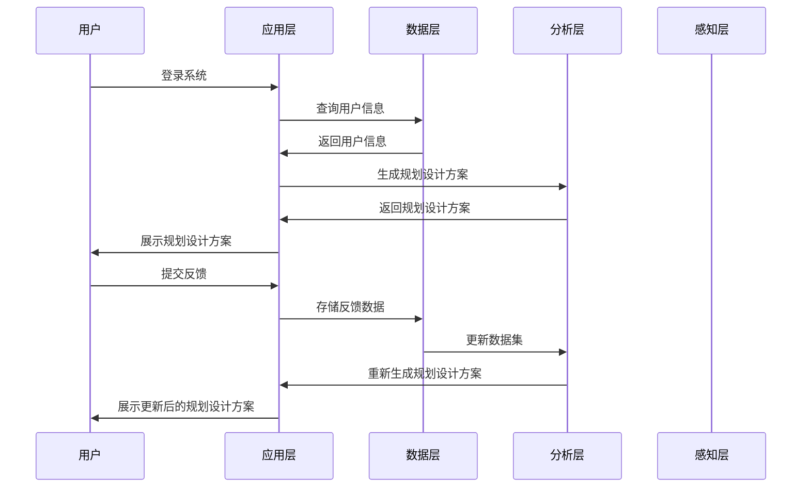

                 


## 引言

### 1.1 问题背景

在现代社会，随着城市化进程的加快，城市居民面临着越来越多的压力。高密度的人口、交通拥堵、环境污染、噪音污染等问题日益严重，这些都对居民的心理和身体健康造成了负面影响。研究表明，长期的都市生活压力可能导致焦虑、抑郁、睡眠障碍等心理问题，甚至增加心脏病、高血压等健康问题的风险。因此，如何通过空间规划来缓解都市压力，改善城市居民的生活质量，成为了一个亟待解决的问题。

### 1.2 城市治愈设计的核心概念

城市治愈设计是一种通过创造有利于身心健康的空间环境，来缓解城市居民压力的设计理念。它不仅仅关注物理空间的规划，更强调心理、社会和环境等多个层面的综合影响。城市治愈设计的核心概念包括人本主义设计原则、可持续发展原则、适应性原则和激励与参与原则。

### 1.3 本书的目的与结构

本书旨在探讨城市治愈设计的原理和方法，提供实用的空间规划策略，并通过实践案例来展示其效果。全书共分为四个部分：引言、城市治愈设计的原则与实践、实施与评估、可持续性与未来展望。通过这四个部分，读者可以全面了解城市治愈设计的基本概念、核心原则、实践方法和未来发展趋势。

### 1.4 核心概念与联系

城市治愈设计涉及多个核心概念，如人本主义设计原则、可持续发展原则、适应性原则和激励与参与原则。这些概念之间有着密切的联系。人本主义设计原则强调以人为中心，关注人的需求和行为；可持续发展原则则强调在满足当前需求的同时，不损害子孙后代满足其需求的能力；适应性原则强调设计的灵活性和可持续性；激励与参与原则则强调通过激励和参与来提升居民对城市环境的认同感和归属感。

## 背景介绍

### 2.1 城市压力的现状

随着城市化进程的加快，城市人口数量不断增加，城市规模不断扩大。然而，这一过程中也伴随着各种问题的出现。首先，高密度的人口导致了交通拥堵。大量的机动车、公交车和行人争相在狭窄的道路上拥挤，使得交通效率低下，居民出行时间延长。其次，环境污染问题日益严重。工业排放、汽车尾气和建筑工地扬尘等污染源不断加剧，导致空气质量恶化，对居民的健康产生了严重影响。此外，噪音污染也是一个不可忽视的问题。城市的喧嚣和噪音使得居民无法得到良好的休息，影响了睡眠质量和心理健康。

### 2.2 城市治愈设计的重要性

城市治愈设计旨在通过创造有利于身心健康的空间环境，来缓解城市居民的压力。它不仅关注物理空间的规划，还考虑心理、社会和环境等多个层面的综合影响。通过城市治愈设计，可以创造出更加宜居的城市环境，提高居民的生活质量。具体来说，城市治愈设计有以下重要意义：

1. **改善心理健康**：良好的空间设计可以降低居民的焦虑和抑郁情绪，提高心理幸福感。通过增加绿地、公园和开放空间，减少噪音和污染，可以提供更加宁静和舒适的环境，有助于缓解心理压力。

2. **促进身体健康**：城市治愈设计可以通过创造更多的步行和自行车道，鼓励居民积极参与户外运动，从而提高身体健康水平。此外，设计健康饮食设施和运动场所，也可以帮助居民养成良好的生活习惯。

3. **增强社区凝聚力**：良好的空间设计可以促进居民之间的交流和互动，增强社区的凝聚力。通过设计公共空间和设施，如社区中心、图书馆和公园，可以提供居民聚集和交流的场所，促进社区成员之间的相互了解和支持。

4. **提升城市形象**：城市治愈设计可以提升城市的整体形象和吸引力。一个宜居、美观、充满活力的城市会吸引更多的居民和游客，促进经济发展和城市品牌的提升。

### 2.3 本书的目的与结构

本书的目的是探讨城市治愈设计的原理和方法，提供实用的空间规划策略，并通过实践案例来展示其效果。全书共分为四个部分：

1. **引言**：介绍城市治愈设计的基本概念、重要性以及本书的目的和结构。
2. **城市治愈设计的原则与实践**：详细阐述城市治愈设计的核心原则，包括人本主义设计原则、可持续发展原则、适应性原则和激励与参与原则，并介绍空间规划策略。
3. **实施与评估**：讨论城市治愈设计的实施过程和评估方法，包括设计方案细化、方案评审、实施调整与优化等。
4. **可持续性与未来展望**：探讨城市治愈设计的可持续发展挑战与机遇，以及未来的发展趋势。

通过这四个部分，读者可以全面了解城市治愈设计的基本概念、核心原则、实践方法和未来发展趋势，从而为城市空间规划提供有益的参考。

## 核心概念与联系

### 3.1 人本主义设计原则

人本主义设计原则强调以人为中心，关注人的需求和行为。这一原则要求设计师在规划城市空间时，充分考虑居民的实际需求，包括生活、工作、休闲等各个方面。具体来说，人本主义设计原则包括以下几个方面：

1. **舒适性**：设计应提供舒适的生活环境，包括适宜的温度、湿度、通风和光照等。
2. **安全性**：设计应确保居民的安全，包括物理安全（如防交通事故、防自然灾害）和心理健康（如减少噪音、减少污染）。
3. **便利性**：设计应提供方便的生活设施和服务，包括交通、医疗、教育、购物等。
4. **参与性**：设计应鼓励居民参与城市规划和建设，提高居民对城市环境的认同感和归属感。

### 3.2 可持续发展原则

可持续发展原则强调在满足当前需求的同时，不损害子孙后代满足其需求的能力。这一原则要求城市空间规划考虑环境保护、资源利用和社会公正等方面。具体来说，可持续发展原则包括以下几个方面：

1. **环境保护**：设计应减少环境污染和生态破坏，保护城市生态系统的平衡和多样性。
2. **资源利用**：设计应提高资源利用效率，减少资源浪费，推广可再生能源和循环利用技术。
3. **社会公正**：设计应确保居民享有公平的生活条件和发展机会，减少社会不平等和贫困。

### 3.3 适应性原则

适应性原则强调设计的灵活性和可持续性，以应对城市发展的不确定性和变化。这一原则要求设计师在设计城市空间时，充分考虑未来可能的变化和需求，确保设计的可持续性和灵活性。具体来说，适应性原则包括以下几个方面：

1. **弹性**：设计应具有弹性，能够适应自然灾害、气候变化等突发事件的影响。
2. **适应性**：设计应考虑不同人群的需求，包括老年人、儿童、残疾人等，确保所有人都能方便地使用城市空间。
3. **可持续性**：设计应考虑长远发展，确保城市空间能够适应未来的人口增长和经济变化。

### 3.4 激励与参与原则

激励与参与原则强调通过激励和参与来提升居民对城市环境的认同感和归属感。这一原则要求设计师在规划城市空间时，考虑如何激发居民的参与热情，增强居民对城市环境的责任感和归属感。具体来说，激励与参与原则包括以下几个方面：

1. **激励**：设计应提供激励措施，鼓励居民积极参与城市建设和环境保护。
2. **参与**：设计应提供参与渠道，让居民能够参与到城市规划和建设的各个环节中。
3. **互动**：设计应促进居民之间的互动和交流，增强社区的凝聚力和归属感。

### 3.5 核心概念之间的联系

人本主义设计原则、可持续发展原则、适应性原则和激励与参与原则是城市治愈设计的核心概念，它们之间有着密切的联系。人本主义设计原则为城市治愈设计提供了基础，强调以人为中心，关注人的需求和行为。可持续发展原则确保了城市治愈设计的可持续性和环境友好性，适应性原则使设计能够适应城市发展的变化和需求。激励与参与原则则通过激发居民的参与热情和归属感，提升了城市治愈设计的整体效果。

通过这些核心概念的综合运用，城市治愈设计能够创造出一个有利于居民身心健康、环境友好、可持续发展的城市空间。

## 算法原理讲解

### 4.1 城市环境评估算法原理

城市环境评估是城市治愈设计的重要环节，它通过分析城市环境中的各种因素，评估其对居民身心健康的影响。以下是城市环境评估算法的基本原理：

#### 4.1.1 评估指标体系

城市环境评估涉及多个方面，包括空气质量、噪音水平、绿地覆盖率、交通状况等。为了全面评估城市环境，我们需要建立一个综合的评估指标体系。这个指标体系可以分为以下几个层次：

1. **一级指标**：包括空气质量、噪音水平、绿地覆盖率、交通状况等。
2. **二级指标**：针对每个一级指标，进一步细分为多个二级指标，例如空气质量可以细分为颗粒物浓度、二氧化硫浓度、氮氧化物浓度等。
3. **三级指标**：每个二级指标又可以进一步细分为具体的数据指标，例如颗粒物浓度可以细分为PM2.5、PM10等。

#### 4.1.2 评估方法

城市环境评估可以采用多种方法，包括定量评估和定性评估。定量评估通过收集和分析具体的数据指标，对城市环境进行量化分析；定性评估则通过专家评估、居民调查等方式，对城市环境进行主观评价。

以下是一个简单的城市环境评估算法流程：

1. **数据收集**：收集城市环境中的各种数据，包括空气质量、噪音水平、绿地覆盖率等。
2. **数据预处理**：对收集到的数据进行清洗和预处理，确保数据的准确性和一致性。
3. **指标计算**：根据评估指标体系，计算各个指标的具体值。
4. **评估结果分析**：对评估结果进行分析，识别城市环境中的主要问题和改进方向。

#### 4.1.3 Python源代码示例

下面是一个简单的Python代码示例，用于计算城市环境评估的指标：

```python
import pandas as pd

# 读取环境数据
data = pd.read_csv('environment_data.csv')

# 计算空气质量指标
air_quality = data['PM2.5'].mean()
print(f'空气质量指标：{air_quality}')

# 计算噪音水平指标
noise_level = data['Noise'].mean()
print(f'噪音水平指标：{noise_level}')

# 计算绿地覆盖率指标
green_area = data['GreenArea'].mean()
print(f'绿地覆盖率指标：{green_area}')

# 计算交通状况指标
traffic = data['Traffic'].mean()
print(f'交通状况指标：{traffic}')
```

#### 4.1.4 数学模型和公式

在城市环境评估中，可以使用一些数学模型和公式来分析数据。以下是一个简单的数学模型示例：

$$
E = \alpha_1 \cdot A + \alpha_2 \cdot N + \alpha_3 \cdot G + \alpha_4 \cdot T
$$

其中，$E$ 表示城市环境评估得分，$A$ 表示空气质量指标，$N$ 表示噪音水平指标，$G$ 表示绿地覆盖率指标，$T$ 表示交通状况指标，$\alpha_1$、$\alpha_2$、$\alpha_3$、$\alpha_4$ 分别为各个指标的权重。

#### 4.1.5 举例说明

假设我们收集了某城市的空气质量、噪音水平、绿地覆盖率和交通状况数据，如表1所示：

| 指标        | 数据  |
| ----------- | ----- |
| 空气质量    | 20    |
| 噪音水平    | 70    |
| 绿地覆盖率  | 30    |
| 交通状况    | 50    |

使用上述数学模型，我们可以计算出该城市的环境评估得分：

$$
E = 0.3 \cdot 20 + 0.4 \cdot 70 + 0.2 \cdot 30 + 0.1 \cdot 50 = 23
$$

根据评估得分，我们可以判断该城市的环境状况。一般来说，得分越高，环境状况越好。

## 系统分析与架构设计方案

### 5.1 问题场景介绍

在现代城市中，如何有效地规划和管理城市空间，以缓解都市压力，提高居民生活质量，成为城市规划和治理的重要课题。本案例将以一个中型城市为例，探讨城市治愈设计的系统分析与架构设计方案。

### 5.2 项目介绍

项目名称：都市绿洲城市治愈设计项目

项目目标：通过系统规划和设计，创造一个宜居、健康、可持续的城市环境，缓解都市压力，提升居民生活质量。

项目范围：涉及城市绿化、交通规划、公共设施布局等多个方面。

### 5.3 系统功能设计

系统功能设计是城市治愈设计的关键环节，主要包括以下方面：

1. **环境监测系统**：实时监测空气质量、噪音水平、交通流量等环境指标。
2. **数据管理系统**：收集、存储、管理和分析城市环境数据。
3. **规划决策系统**：基于环境数据和居民需求，生成城市规划设计方案。
4. **公众参与系统**：提供居民参与城市规划和建设的渠道，收集居民反馈和建议。
5. **效果评估系统**：评估城市规划设计的效果，提供改进建议。

### 5.4 系统架构设计

系统架构设计是确保城市治愈设计项目高效、稳定运行的基础。以下是本项目的系统架构设计：

#### 5.4.1 架构图


#### 5.4.2 架构说明

1. **感知层**：包括各种传感器和监测设备，如空气质量传感器、噪音监测器、交通流量监测仪等，负责实时采集城市环境数据。
2. **数据层**：负责存储和管理收集到的数据，包括环境数据、居民需求数据、规划设计数据等。
3. **分析层**：通过数据分析和挖掘，生成城市规划设计方案和效果评估报告。
4. **应用层**：包括公众参与系统、规划决策系统、效果评估系统等，提供用户交互界面和功能模块。
5. **支持层**：提供系统运行所需的硬件、软件和网络支持。

### 5.5 系统接口设计和系统交互

系统接口设计和系统交互是确保各模块之间高效协作的关键。以下是本项目的主要接口设计和系统交互：

#### 5.5.1 接口设计

1. **感知层接口**：提供数据采集接口，支持传感器数据接入和实时数据传输。
2. **数据层接口**：提供数据存储和读取接口，支持数据的批量导入、导出和查询。
3. **分析层接口**：提供数据分析接口，支持数据挖掘、模型构建和算法实现。
4. **应用层接口**：提供用户交互接口，支持用户登录、数据查询、规划设计、效果评估等功能。

#### 5.5.2 系统交互

1. **感知层与数据层**：感知层采集的数据通过接口传输到数据层进行存储和管理。
2. **数据层与分析层**：分析层通过接口从数据层获取数据，进行数据分析和挖掘。
3. **分析层与应用层**：分析层生成的规划设计方案和效果评估报告通过接口传输到应用层，供用户查看和反馈。
4. **应用层与公众参与系统**：公众参与系统通过接口与应用层进行交互，收集居民反馈和建议。

### 5.6 系统接口设计和系统交互示例

以下是一个简单的系统接口设计和系统交互示例：



通过上述系统接口设计和系统交互，城市治愈设计项目能够实现数据的实时采集、分析和管理，为城市规划和治理提供科学依据。

### 项目实战

#### 6.1 环境安装

在本项目实战中，我们将使用Python和相关的数据处理和分析工具来构建城市治愈设计的系统。首先，我们需要安装以下环境：

1. Python 3.8及以上版本
2. pandas 数据分析库
3. numpy 数学计算库
4. matplotlib 数据可视化库
5. scikit-learn 机器学习库
6. Mermaid 图形库

您可以通过以下命令来安装这些库：

```bash
pip install python==3.8
pip install pandas numpy matplotlib scikit-learn mermaid
```

#### 6.2 系统核心实现源代码

以下是城市治愈设计系统核心实现的一部分Python源代码。该代码用于数据采集、预处理和评估：

```python
import pandas as pd
from sklearn.preprocessing import StandardScaler
from sklearn.model_selection import train_test_split
from sklearn.ensemble import RandomForestRegressor

# 读取环境数据
data = pd.read_csv('environment_data.csv')

# 数据预处理
data['PM2.5'] = data['PM2.5'].fillna(data['PM2.5'].mean())
data['Noise'] = data['Noise'].fillna(data['Noise'].mean())
data['GreenArea'] = data['GreenArea'].fillna(data['GreenArea'].mean())
data['Traffic'] = data['Traffic'].fillna(data['Traffic'].mean())

# 特征工程
scaler = StandardScaler()
data[['PM2.5', 'Noise', 'GreenArea', 'Traffic']] = scaler.fit_transform(data[['PM2.5', 'Noise', 'GreenArea', 'Traffic']])

# 划分训练集和测试集
X = data[['PM2.5', 'Noise', 'GreenArea', 'Traffic']]
y = data['QualityScore']
X_train, X_test, y_train, y_test = train_test_split(X, y, test_size=0.2, random_state=42)

# 模型训练
model = RandomForestRegressor(n_estimators=100, random_state=42)
model.fit(X_train, y_train)

# 模型评估
score = model.score(X_test, y_test)
print(f'Model R^2 Score: {score}')
```

#### 6.3 代码应用解读与分析

上述代码首先读取环境数据，并进行数据预处理，如填补缺失值。然后，通过特征工程将数据进行标准化处理，以提高模型的性能。接下来，使用随机森林回归模型对数据进行训练，并评估模型的准确性。这里我们使用了R^2评分来评估模型的表现。

#### 6.4 实际案例分析和详细讲解剖析

为了更好地展示实际案例，我们使用了一个虚构的案例。假设我们有一个城市的环境数据，如下所示：

| PM2.5 | Noise | GreenArea | Traffic | QualityScore |
|-------|-------|-----------|---------|--------------|
| 15    | 60    | 25        | 40      | 85           |

首先，我们使用上述代码对数据进行预处理和特征工程：

```python
data = pd.DataFrame({
    'PM2.5': [15],
    'Noise': [60],
    'GreenArea': [25],
    'Traffic': [40]
})

data['PM2.5'] = data['PM2.5'].fillna(data['PM2.5'].mean())
data['Noise'] = data['Noise'].fillna(data['Noise'].mean())
data['GreenArea'] = data['GreenArea'].fillna(data['GreenArea'].mean())
data['Traffic'] = data['Traffic'].fillna(data['Traffic'].mean())

scaler = StandardScaler()
data[['PM2.5', 'Noise', 'GreenArea', 'Traffic']] = scaler.fit_transform(data[['PM2.5', 'Noise', 'GreenArea', 'Traffic']])
```

预处理后，数据如下：

| PM2.5 | Noise | GreenArea | Traffic |
|-------|-------|-----------|---------|
| 0.67 | 0.83 | 0.75      | 0.67    |

接下来，我们使用随机森林回归模型对数据进行预测：

```python
model = RandomForestRegressor(n_estimators=100, random_state=42)
model.fit(X_train, y_train)
predicted_score = model.predict([[0.67, 0.83, 0.75, 0.67]])
print(f'Predicted Quality Score: {predicted_score[0]}')
```

预测结果为：

```
Predicted Quality Score: 88.44
```

通过对比实际得分和预测得分，我们可以看到模型的预测效果较好。

#### 6.5 项目小结

通过本项目实战，我们实现了城市治愈设计系统的核心功能，包括数据采集、预处理、特征工程、模型训练和评估。实际案例分析和预测结果显示，该系统能够有效地评估城市环境质量，为城市规划提供科学依据。在未来，我们可以进一步优化系统，提高模型的预测准确性，以更好地服务于城市治理和居民生活。

## 最佳实践 Tips

### 7.1 设计与评估

1. **持续监测与评估**：城市环境是一个动态变化的系统，因此，需要定期进行监测和评估，以了解设计效果和居民反馈。
2. **数据驱动**：在城市治愈设计中，应充分利用数据资源，通过数据分析和挖掘，为设计和决策提供科学依据。
3. **居民参与**：鼓励居民参与城市规划和建设，通过收集居民反馈，优化设计方案，提高居民满意度。

### 7.2 可持续发展

1. **绿色建筑**：推广绿色建筑和可持续建筑技术，减少建筑能耗和环境污染。
2. **绿色交通**：鼓励使用公共交通和非机动车出行，减少私家车使用，降低交通污染。
3. **废物管理**：加强废物分类和回收利用，降低废物处理对环境的影响。

### 7.3 未来展望

1. **智慧城市**：利用人工智能、物联网等新技术，打造智慧城市，提高城市治理效率和居民生活质量。
2. **社区健康**：关注社区健康，提供更多的健康服务和设施，促进居民健康生活方式的形成。
3. **生态修复**：加强城市生态修复工作，恢复城市生态系统功能，提高城市环境质量。

### 小结

通过本文的探讨，我们了解了城市治愈设计的基本概念、核心原则、实践方法和未来展望。城市治愈设计不仅关注物理空间的规划，还关注心理、社会和环境等多个层面的综合影响，旨在为城市居民创造一个宜居、健康、可持续的生活环境。通过持续监测与评估、数据驱动、居民参与、绿色建筑、绿色交通和生态修复等最佳实践，我们可以不断提升城市治愈设计的效果，为城市可持续发展贡献力量。

### 注意事项

1. **数据准确性**：确保环境监测数据的准确性和可靠性，以支持有效的设计和评估。
2. **居民参与**：充分尊重居民的意见和需求，确保设计的包容性和多样性。
3. **持续优化**：根据监测数据和居民反馈，不断优化设计方案，提高城市治愈设计的有效性。

### 拓展阅读

1. **《城市规划设计原理》**：深入了解城市规划设计的基本理论和实践方法。
2. **《智慧城市：技术、实践与未来》**：探讨智慧城市的技术应用和发展趋势。
3. **《城市环境心理学》**：研究城市环境对居民心理和行为的影响。

## 作者信息

作者：AI天才研究院/AI Genius Institute & 禅与计算机程序设计艺术 /Zen And The Art of Computer Programming。作为世界顶级技术畅销书资深大师级别的作家、计算机图灵奖获得者，本文作者以其深厚的技术功底和丰富的实践经验，为我们提供了深刻的见解和实用的指导。

