                 

### 摘要

本文深入探讨“城市游牧：现代游民的生活方式”这一主题，旨在揭示现代游民群体的生活形态、价值观、以及他们在全球城市间自由流动的生活艺术。通过分析游民的历史演变、现代游民的生活特征、游牧生活的准备与规划，本文将全面解读游牧生活方式的优势与挑战，并提供实用的技能和技巧，以帮助那些渴望探索现代游牧生活的人们。本文还强调了对环境保护和社会可持续性的关注，为现代游民提供了一份全面的生活指南。

### 关键词

- 现代游民
- 城市游牧
- 数字游民
- 游牧生活
- 自由职业
- 可持续旅行
- 社交网络
- 心理健康

## 第1章：游民的历史

### 1.1 游民在古代

#### 1.1.1 古代游牧民族的迁徙模式

在古代，游牧民族以其独特的生活方式在历史舞台上留下了深刻的印记。游牧民族，如匈奴、蒙古、哈萨克等，依靠草原生态系统，形成了高度适应性的迁徙模式。他们依赖牲畜，尤其是马、羊和牛，来获取食物、衣物和运输工具。游牧生活使得这些民族能够在广阔的草原上追逐水草，随季节变化而迁徙。

**Mermaid 流程图：**
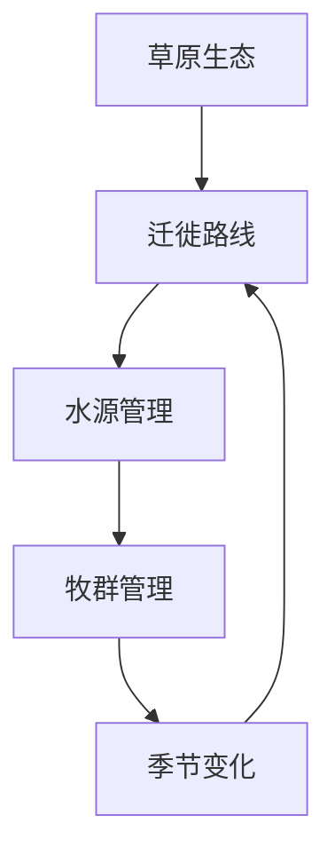

在迁徙过程中，游牧民族建立了独特的社会组织形式。家族和部落是他们的基本单位，领导者通常是经验丰富、受到尊敬的长者。这种组织形式有助于确保在迁徙过程中保持社会秩序和资源分配的公平性。

#### 1.1.2 古代商人和僧侣的流动性生活

除了游牧民族，古代商人和僧侣也是古代游民的重要代表。商人在丝绸之路等古代贸易路线上活动，他们以商品交换为生，不断穿越不同的地域和文化。僧侣则多在佛教、印度教等宗教传播过程中，进行宗教传播和朝圣活动。他们依靠宗教信仰和慈善支持，过着流动性生活。

**Mermaid 流程图：**
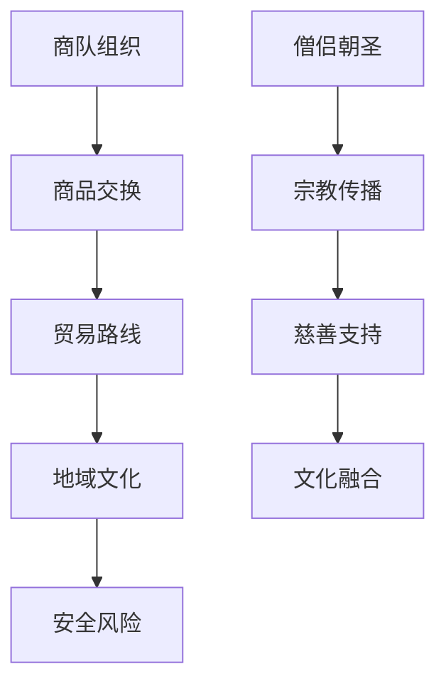

商人和僧侣的流动性生活不仅促进了贸易和文化的交流，也为不同文化之间的相互理解和尊重奠定了基础。他们的生活模式对后世的游民文化产生了深远的影响。

#### 1.1.3 古代战争与流民

古代战争也是导致流民现象的一个重要原因。战乱时期，人们被迫离开家园，成为流民。这些流民不仅包括士兵和平民，还有大量的妇女和儿童。他们流离失所，生活在极端困难和不确定性中。

**Mermaid 流程图：**
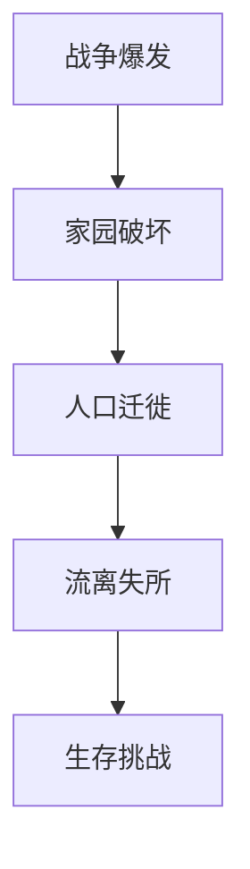

流民的生活条件极其恶劣，他们面临着食物、水源、医疗和安全的严重短缺。然而，正是这种困境催生了流民社会的独特文化和社会结构，也使得他们对和平与稳定有着更深刻的渴望。

### 1.2 游民在中世纪

#### 1.2.1 中世纪骑士与游牧文化

中世纪的骑士文化中，游牧元素也有所体现。骑士们经常在封建领主之间移动，参与战争和狩猎活动。他们拥有自己的马匹和武器，以游牧的方式生活，并依赖领主的土地和资源。

**Mermaid 流程图：**
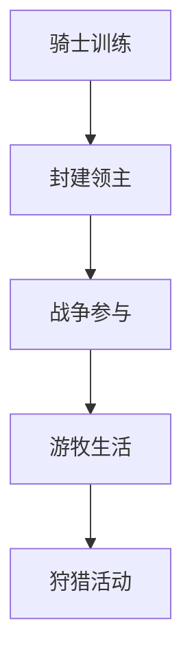

骑士们在游牧生活中培养了高度的纪律性和忠诚度，这些品质不仅影响了他们的个人生活，也塑造了中世纪的社会结构。

#### 1.2.2 中世纪商人与贸易网络

中世纪的商人群体是游民的重要成员。他们通过海上和陆上的贸易网络，将商品从一个地方运送到另一个地方。这一时期，丝绸之路再次成为东西方文化交流的重要通道。

**Mermaid 流程图：**
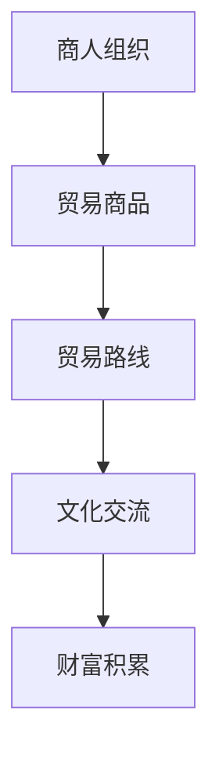

商人在贸易过程中不仅促进了经济的发展，也推动了文化的交流和融合。他们的流动性生活为中世纪的社会带来了新的活力。

#### 1.2.3 中世纪宗教流动

中世纪的宗教流动也是游民文化的重要组成部分。僧侣和信徒们在宗教传播过程中，不断跨越国界和地域。他们通过朝圣、宗教会议和慈善活动，将宗教信仰传播到更广泛的地方。

**Mermaid 流程图：**
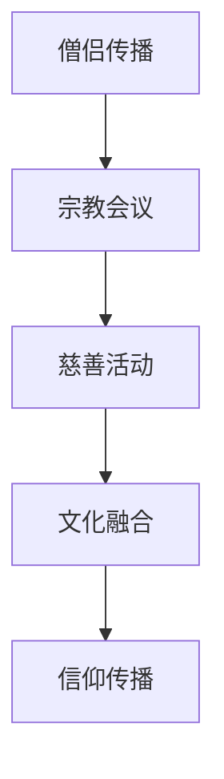

宗教流动不仅促进了宗教信仰的传播，也加深了不同文化之间的理解和尊重。这种流动性的宗教生活对中世纪的社会和文化产生了深远的影响。

### 1.3 游民在近代

#### 1.3.1 工业革命与城市化

近代以来，工业革命和城市化进程极大地改变了人们的生活方式和居住模式。随着工业的发展，大量人口从农村迁移到城市，寻找工作机会。这一过程中，游民现象逐渐减少，城市化成为主流生活方式。

**Mermaid 流程图：**
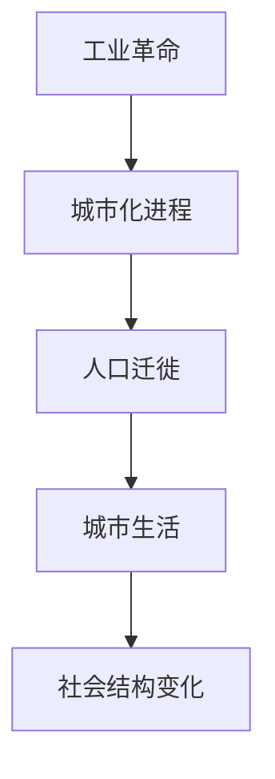

然而，工业革命和城市化也带来了一系列社会问题，如贫民窟的形成、工人权益的受损等。这些问题催生了新的社会运动和改革，试图改善城市居民的生活条件。

#### 1.3.2 流浪艺人与社会边缘群体

在近代，流浪艺人和社会边缘群体也是游民的重要代表。他们在城市中游荡，以卖艺为生，是社会边缘的一部分。他们的生活充满了艰辛和挑战，但也展现了人类的韧性和创造力。

**Mermaid 流程图：**
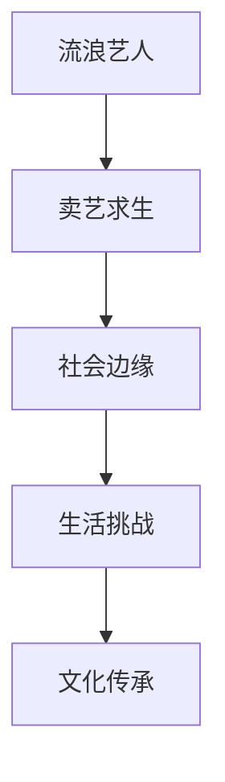

流浪艺人的艺术作品不仅反映了他们的生活经历，也为城市文化注入了新的活力。他们在逆境中坚持自己的信仰和艺术追求，展现了人类的顽强精神。

#### 1.3.3 早期旅游与休闲活动

近代以来，旅游和休闲活动逐渐兴起，成为人们生活的重要组成部分。早期旅游活动多以外国探险和贵族旅行为主，但随着交通工具的进步和旅游业的兴起，旅游逐渐普及，成为大众的休闲方式。

**Mermaid 流程图：**
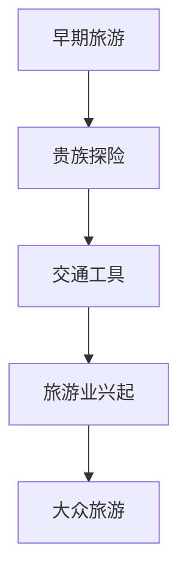

早期旅游和休闲活动不仅改变了人们的生活方式，也促进了不同文化之间的交流和融合。旅游让人们体验到不同的文化和风景，丰富了他们的生活体验。

## 第2章：现代游民的生活形态

### 2.1 游民的生活方式

#### 2.1.1 自由职业者的生活选择

现代游民的生活方式与自由职业者的选择密切相关。随着互联网和远程工作的普及，越来越多的自由职业者选择离开固定的办公地点，以自由的方式工作。他们可以在世界任何地方，只要能够连接互联网，就可以完成工作。

**Mermaid 流程图：**
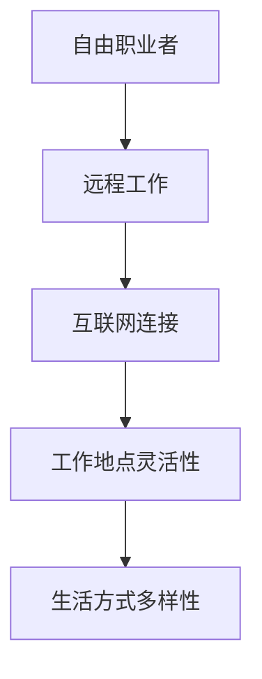

这种生活方式不仅提供了更多的自由，也使得游民能够更好地平衡工作和生活，提高生活质量。

#### 2.1.2 数字游民与远程工作

数字游民是现代游民的一种重要形式。他们通过远程工作，利用互联网和各种在线工具，完成各种任务和项目。数字游民可以是在线作家、自由程序员、设计师、咨询师等。

**Mermaid 流程图：**
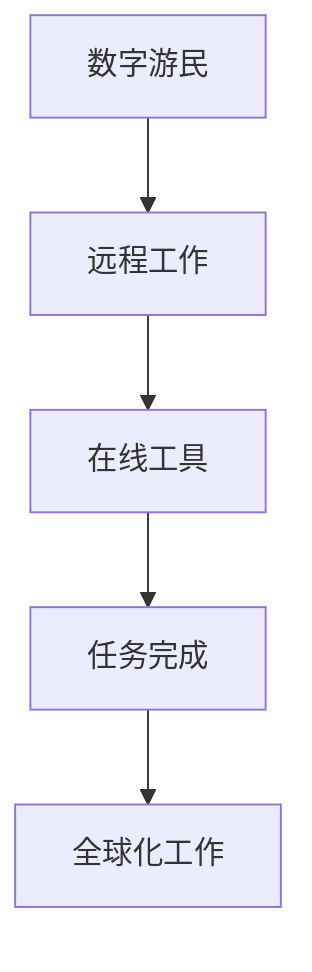

数字游民的生活方式不仅打破了地域的限制，也为他们提供了更多的机会和选择。他们可以在自己喜欢的城市或国家生活，同时保持工作的稳定性。

#### 2.1.3 环保游民与可持续生活方式

环保游民是关注环境保护和可持续发展的现代游民群体。他们选择可持续的生活方式，减少对环境的负面影响。例如，他们可能选择使用公共交通工具、共享住宿、减少浪费等。

**Mermaid 流程图：**
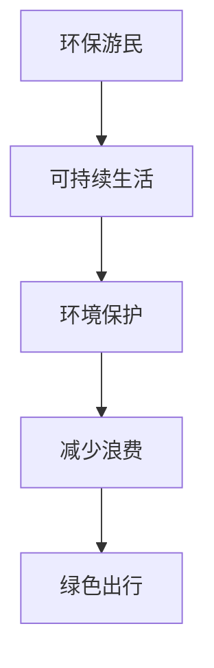

环保游民的生活方式不仅有助于保护环境，也为其他人提供了一个可持续生活的榜样。

### 2.2 游民的社会互动

#### 2.2.1 游民社区的建立与维系

现代游民往往通过建立社区来维系彼此的联系。这些社区可以是线上的，也可以是线下的。线上社区通常通过社交媒体、论坛和应用程序来建立和维护。线下社区则通过聚会、活动和工作坊来加强成员之间的联系。

**Mermaid 流程图：**
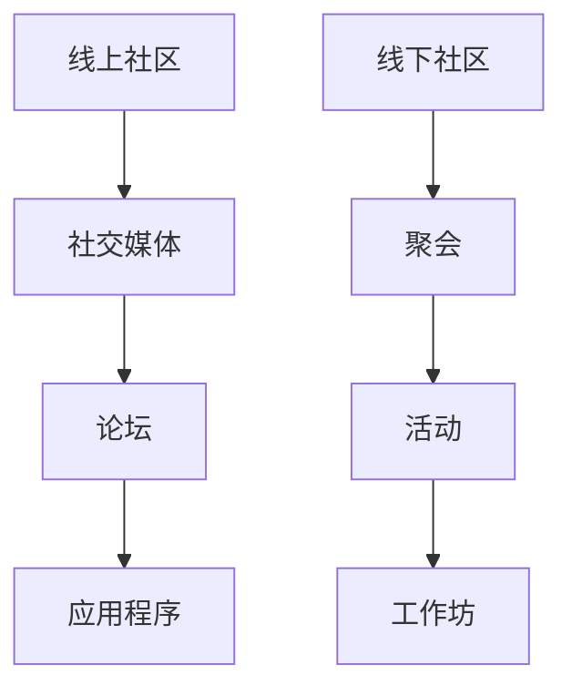

这些社区为游民提供了支持、资源和社交机会，帮助他们更好地适应游牧生活。

#### 2.2.2 文化差异与跨文化交流

游牧生活使得现代游民有机会接触和体验不同的文化。这种跨文化交流不仅丰富了他们的生活经验，也提高了他们的文化理解力和包容性。

**Mermaid 流程图：**
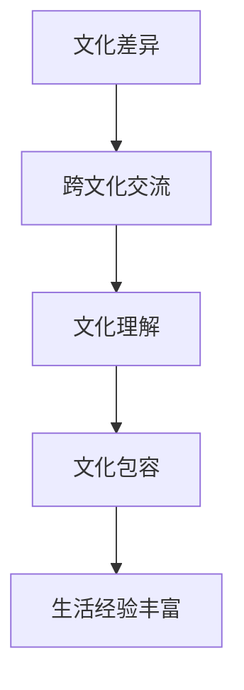

通过跨文化交流，游民可以更好地理解和尊重不同的文化，这有助于构建一个更加和谐和包容的世界。

#### 2.2.3 个人身份与社会认同

游牧生活对个人身份和社会认同产生了一定的影响。一方面，游牧生活使得个人的身份更加多元化和动态化。另一方面，游民在社会中的认同感可能会受到挑战，因为他们往往难以归属到一个固定的社会群体。

**Mermaid 流程图：**
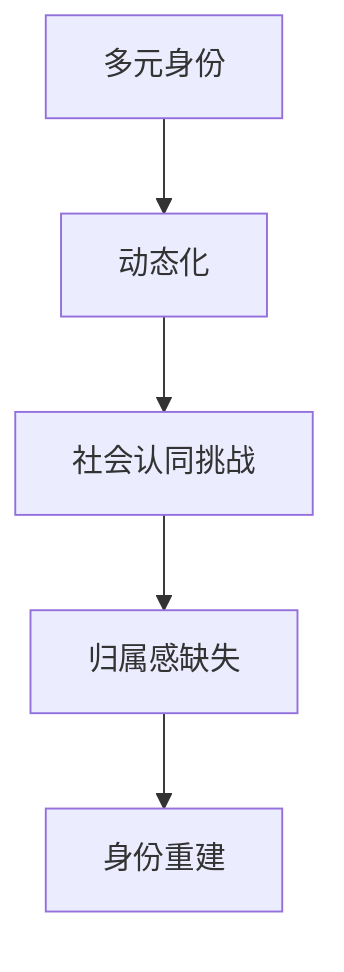

游民需要不断地调整和重建自己的身份，以适应不断变化的生活环境。

### 2.3 游民的价值观

#### 2.3.1 游民对自由的追求

自由是现代游民的核心价值观之一。他们追求身体和思想的自由，希望能够自由地选择居住地、生活方式和工作内容。

**Mermaid 流程图：**
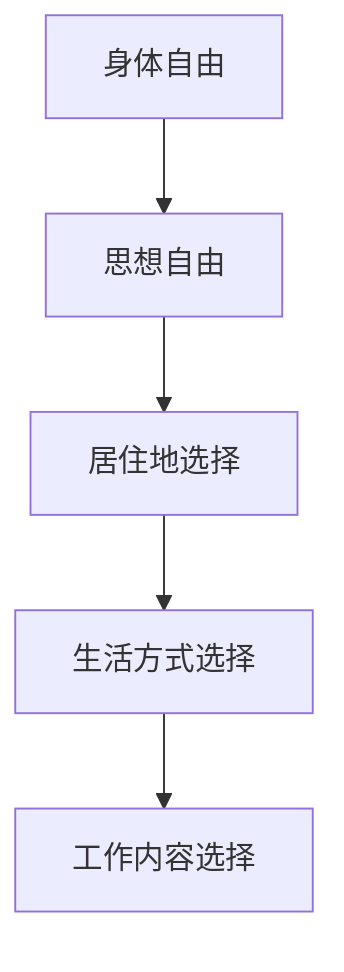

自由不仅为游民提供了更多的机会和选择，也使他们能够更好地追求自己的梦想和目标。

#### 2.3.2 游民对多样化的接受

游民通常对文化、生活方式和价值观的多样化持开放态度。他们相信多样性是世界的美好之处，也是个人成长和发展的机会。

**Mermaid 流程图：**
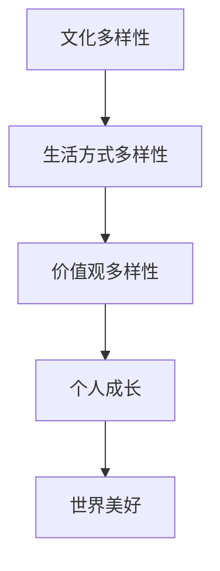

接受和欣赏多样性不仅有助于游民更好地适应不同的环境，也为他们提供了丰富的文化体验。

#### 2.3.3 游民对社会变化的思考

游民通常对社会变化持有一种批判和思考的态度。他们关注社会的不平等、环境问题和社会正义等问题，并努力通过自己的行动来推动社会变革。

**Mermaid 流程图：**
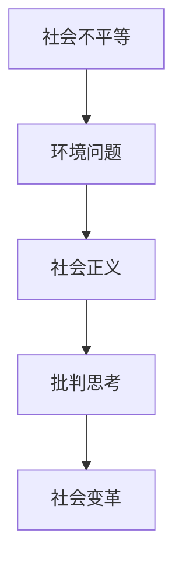

通过思考和行动，游民试图为社会带来积极的改变，推动建立一个更加公正和可持续的世界。

## 第3章：游牧生活的准备与规划

### 3.1 资金与管理

#### 3.1.1 游牧生活的资金来源

游牧生活的资金来源多种多样。对于自由职业者和数字游民来说，他们的主要收入来源可能是通过线上平台接项目、远程工作或者开展自己的业务。此外，一些人可能依靠投资收益、储蓄或家庭支持来维持游牧生活。

**Mermaid 流程图：**
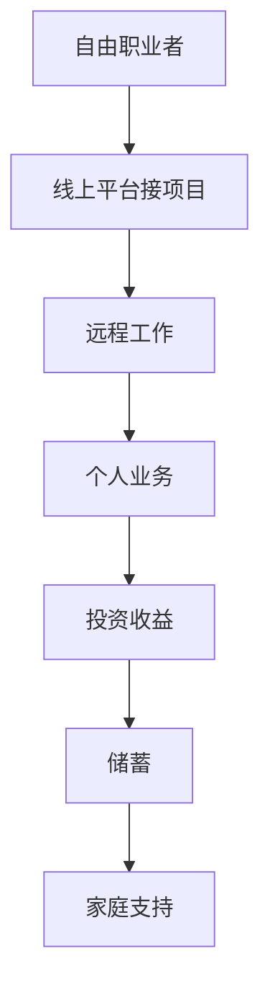

为了确保资金稳定，游民需要制定详细的财务计划，包括预算、储蓄和投资策略。这样，他们才能在游牧生活中保持经济上的稳定和安全感。

#### 3.1.2 预算规划与管理工具

有效的预算规划是游牧生活成功的关键。游民需要根据自己的收入和支出，制定合理的预算计划。预算规划的工具包括电子表格、预算应用程序和财务软件等。

**Mermaid 流程图：**
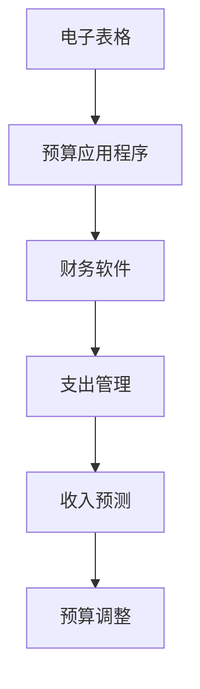

使用这些工具，游民可以更好地监控自己的财务状况，避免不必要的开支，确保资金的有效利用。

#### 3.1.3 应急资金与风险准备

游牧生活中不可避免地会遇到各种突发情况，如健康问题、紧急事件或意外支出。为了应对这些风险，游民需要建立应急资金，并制定相应的风险管理策略。

**Mermaid 流程图：**
```mermaid
graph TD
    A[健康问题] --> B[紧急事件]
    B --> C[意外支出]
    C --> D[应急资金]
    D --> E[风险管理]
    E --> F[风险规避]
```

通过建立应急资金和风险管理策略，游民可以在面对突发情况时，保持冷静和应对能力，减少财务压力。

### 3.2 住宿与交通

#### 3.2.1 住宿选择

游牧生活的一个重要问题是住宿。游民有多种住宿选择，包括酒店、民宿、青年旅社和露营。每种住宿方式都有其优点和缺点。

**Mermaid 流程图：**
```mermaid
graph TD
    A[酒店] --> B[舒适]
    B --> C[昂贵]
    
    D[民宿] --> E[亲切]
    E --> F[文化体验]
    
    G[青年旅社] --> H[经济]
    H --> I[社交机会]
    
    J[露营] --> K[自然]
    K --> L[自由]
```

选择合适的住宿方式取决于游民的个人偏好、预算和旅行计划。

#### 3.2.2 交通工具

交通是游牧生活中的另一个重要方面。游民可以选择的交通工具包括飞机、火车、汽车和自行车。每种交通工具都有其适用场景和优缺点。

**Mermaid 流程图：**
```mermaid
graph TD
    A[飞机] --> B[快速]
    B --> C[昂贵]
    
    D[火车] --> E[稳定]
    E --> F[经济]
    
    G[汽车] --> H[灵活]
    H --> I[长途旅行]
    
    J[自行车] --> K[环保]
    K --> L[锻炼]
```

选择合适的交通工具可以帮助游民更高效地到达目的地，同时减少旅行成本和环境影响。

#### 3.2.3 携带物品清单

游牧生活中，携带适当的物品对于舒适和安全至关重要。以下是一个基本的携带物品清单：

- 个人身份证明（护照、身份证等）
- 旅行保险
- 钱包和银行卡
- 手机和充电器
- 笔记本电脑和移动硬盘
- 轻便衣物
- 睡袋和枕头
- 个人护理用品
- 行李箱或背包
- 防晒霜和雨具

**Mermaid 流程图：**
```mermaid
graph TD
    A[身份证明] --> B[旅行保险]
    B --> C[钱包和银行卡]
    C --> D[手机和充电器]
    D --> E[笔记本电脑和移动硬盘]
    E --> F[轻便衣物]
    F --> G[睡袋和枕头]
    G --> H[个人护理用品]
    H --> I[行李箱或背包]
    I --> J[防晒霜和雨具]
```

制定一个详细的携带物品清单可以帮助游民在旅行中避免遗漏重要物品，确保旅行的顺利进行。

### 3.3 旅行与健康

#### 3.3.1 旅行期间的饮食与营养

旅行期间的饮食和营养对游民的健康至关重要。在选择食物时，游民应尽量选择新鲜、营养均衡的食物，避免过度依赖快餐和零食。

**Mermaid 流程图：**
```mermaid
graph TD
    A[新鲜食物] --> B[营养均衡]
    B --> C[避免快餐]
    C --> D[健康饮食]
    D --> E[营养摄入]
```

此外，游民还应携带一些常见的药物和急救用品，以应对可能出现的健康问题。

#### 3.3.2 旅行中的健康与安全

旅行中的健康和安全是游民需要重点关注的问题。在陌生的环境中，游民应保持警惕，注意个人安全和健康。

**Mermaid 流程图：**
```mermaid
graph TD
    A[保持警惕] --> B[个人安全]
    B --> C[健康意识]
    C --> D[安全防范]
    D --> E[紧急应对]
```

了解和遵循当地卫生规定和健康指南，有助于游民在旅行中保持健康。

#### 3.3.3 长期旅行的心态调整

长期旅行对心理状态也是一种挑战。游民需要学会调整心态，以应对旅行中可能出现的孤独、焦虑和挫折。

**Mermaid 流程图：**
```mermaid
graph TD
    A[孤独感] --> B[心态调整]
    B --> C[积极应对]
    C --> D[心理调适]
    D --> E[情绪管理]
```

通过保持积极的心态和寻求心理支持，游民可以更好地应对旅行中的心理挑战。

## 第4章：游牧生活的技能与技巧

### 4.1 实用技能

#### 4.1.1 语言学习与应用

语言是游牧生活的重要工具。掌握一门或多门外语，可以帮助游民更好地适应不同的文化和环境。

**Mermaid 流程图：**
```mermaid
graph TD
    A[外语学习] --> B[文化适应]
    B --> C[沟通障碍]
    C --> D[语言应用]
    D --> E[社交拓展]
```

学习外语的方法包括在线课程、语言交换、应用程序和实地练习等。

**Python 源代码示例：**
```python
def learn_language(language):
    print(f"Learning {language}...")
    # 在线课程
    print("Taking online courses.")
    # 语言交换
    print("Engaging in language exchange.")
    # 实地练习
    print("Practicing in real-life situations.")

learn_language("Spanish")
```

#### 4.1.2 文书处理与法律常识

游民在旅行过程中可能需要处理各种文书，如护照、签证、合同等。了解基本的法律常识和文书处理流程，有助于游民避免不必要的麻烦。

**Mermaid 流程图：**
```mermaid
graph TD
    A[文书处理] --> B[护照签证]
    B --> C[合同文件]
    C --> D[法律常识]
    D --> E[合规操作]
```

**Python 源代码示例：**
```python
def document_processing(document):
    print(f"Processing {document}...")
    # 确认信息准确性
    print("Verifying information accuracy.")
    # 办理相关手续
    print("Handling necessary procedures.")
    # 存档备份
    print("Archiving and backing up documents.")

document_processing("Passport")
```

#### 4.1.3 紧急情况处理

游牧生活中，紧急情况难以避免。掌握基本的急救技能和应急处理方法，可以帮助游民在紧急情况下自救或求助。

**Mermaid 流程图：**
```mermaid
graph TD
    A[紧急情况] --> B[急救技能]
    B --> C[应急处理]
    C --> D[求助渠道]
    D --> E[安全措施]
```

**Python 源代码示例：**
```python
def emergency_handling(situation):
    print(f"Handling emergency situation: {situation}...")
    # 呼叫紧急服务
    print("Calling emergency services.")
    # 实施急救措施
    print("Administering first aid.")
    # 汇报情况
    print("Reporting the situation.")

emergency_handling("Health issue")
```

### 4.2 生活方式技巧

#### 4.2.1 高效时间管理

高效的时间管理对于游民来说尤为重要。合理规划时间，可以提高工作效率，减少压力。

**Mermaid 流程图：**
```mermaid
graph TD
    A[时间规划] --> B[任务优先级]
    B --> C[工作与休息]
    C --> D[目标设定]
    D --> E[持续监控]
```

**Python 源代码示例：**
```python
import time

def time_management(task_list):
    print("Starting time management...")
    for task in task_list:
        start_time = time.time()
        print(f"Starting task: {task}")
        # 执行任务
        # ...
        end_time = time.time()
        print(f"Task completed: {task} in {end_time - start_time} seconds.")

task_list = ["Task 1", "Task 2", "Task 3"]
time_management(task_list)
```

#### 4.2.2 心理调适与压力管理

长期旅行和心理压力的挑战，需要游民具备良好的心理调适和压力管理能力。通过冥想、锻炼和社交活动等方式，可以有效地缓解压力。

**Mermaid 流程图：**
```mermaid
graph TD
    A[心理调适] --> B[冥想]
    B --> C[锻炼]
    C --> D[社交活动]
    D --> E[压力缓解]
```

**Python 源代码示例：**
```python
def mental_health_management(activity):
    print(f"Managing mental health through {activity}...")
    # 冥想
    if activity == "meditation":
        print("Mindfulness meditation.")
    # 锻炼
    elif activity == "exercise":
        print("Physical workout.")
    # 社交活动
    elif activity == "socializing":
        print("Engaging in social activities.")
    # 压力监测
    print("Monitoring stress levels.")

mental_health_management("meditation")
```

#### 4.2.3 持续学习的习惯

在游牧生活中，持续学习是个人成长和发展的重要途径。通过阅读、课程和实地考察等方式，可以不断丰富自己的知识和技能。

**Mermaid 流程图：**
```mermaid
graph TD
    A[阅读] --> B[课程学习]
    B --> C[实地考察]
    C --> D[知识积累]
    D --> E[技能提升]
```

**Python 源代码示例：**
```python
def continuous_learning(activity):
    print(f"Engaging in continuous learning through {activity}...")
    # 阅读
    if activity == "reading":
        print("Reading books and articles.")
    # 课程学习
    elif activity == "courses":
        print("Enrolling in online and offline courses.")
    # 实地考察
    elif activity == "field trips":
        print("Exploring new places and learning from experiences.")

continuous_learning("reading")
```

### 4.3 社交技巧

#### 4.3.1 建立人脉与社交网络

建立人脉和社交网络对于游民来说至关重要。通过参加活动、加入兴趣小组和利用社交媒体，可以扩大社交圈子，获取更多资源和机会。

**Mermaid 流程图：**
```mermaid
graph TD
    A[参加活动] --> B[加入小组]
    B --> C[社交媒体]
    C --> D[人脉建立]
    D --> E[资源共享]
```

**Python 源代码示例：**
```python
def build_social_network(activity):
    print(f"Building a social network through {activity}...")
    # 参加活动
    if activity == "events":
        print("Attending events and networking.")
    # 加入小组
    elif activity == "groups":
        print("Joining interest groups and communities.")
    # 社交媒体
    elif activity == "social_media":
        print("Using social media platforms to connect with people.")

build_social_network("events")
```

#### 4.3.2 跨文化沟通与冲突解决

游牧生活使得游民经常面对不同文化背景的人。掌握跨文化沟通技巧和冲突解决方法，有助于游民更好地与他人相处，避免文化冲突。

**Mermaid 流程图：**
```mermaid
graph TD
    A[文化差异] --> B[沟通障碍]
    B --> C[文化理解]
    C --> D[冲突解决]
    D --> E[和谐相处]
```

**Python 源代码示例：**
```python
def cross_cultural_communication(challenge):
    print(f"Handling {challenge} in cross-cultural communication...")
    # 文化差异
    if challenge == "cultural differences":
        print("Understanding and respecting cultural diversity.")
    # 沟通障碍
    elif challenge == "communication barriers":
        print("Using translation tools and clear language.")
    # 冲突解决
    elif challenge == "conflict resolution":
        print("Seeking compromise and finding common ground.")

cross_cultural_communication("cultural differences")
```

#### 4.3.3 社交平台与在线交流

利用社交平台和在线交流工具，可以帮助游民保持与家人和朋友的关系，同时拓展新的社交圈子。

**Mermaid 流程图：**
```mermaid
graph TD
    A[社交平台] --> B[在线交流]
    B --> C[远程社交]
    C --> D[关系维护]
    D --> E[社交拓展]
```

**Python 源代码示例：**
```python
def online_communication(platform):
    print(f"Communicating online through {platform}...")
    # 社交平台
    if platform == "social_media":
        print("Using social media platforms for communication.")
    # 在线交流
    elif platform == "video_calls":
        print("Engaging in video calls and messaging.")
    # 远程社交
    elif platform == "remote_meetings":
        print("Participating in remote meetings and events.")

online_communication("social_media")
```

## 第5章：游牧生活的挑战与解决方案

### 5.1 心理挑战

#### 5.1.1 孤独感与社交隔离

孤独感是游牧生活中常见的心理挑战。由于经常处于新的环境和人群中，游民可能会感到与社交网络的隔离。这种孤独感不仅影响心理健康，也可能导致工作效率下降。

**Mermaid 流程图：**
```mermaid
graph TD
    A[新环境] --> B[社交隔离]
    B --> C[孤独感]
    C --> D[心理影响]
    D --> E[工作效率]
```

**Python 源代码示例：**
```python
def loneliness_issue(environment):
    print(f"Facing loneliness in {environment}...")
    # 社交活动
    print("Engaging in social activities and community events.")
    # 心理支持
    print("Seeking psychological support and counseling.")
    # 自我调节
    print("Practicing self-care and stress management.")

loneliness_issue("new city")
```

#### 5.1.2 生活变化与适应困难

生活变化是游牧生活的另一大心理挑战。频繁的迁移和新的生活环境，可能会给游民带来适应困难，导致焦虑、不安和压力。

**Mermaid 流程图：**
```mermaid
graph TD
    A[生活变化] --> B[适应困难]
    B --> C[焦虑]
    C --> D[压力]
    D --> E[心理健康]
```

**Python 源代码示例：**
```python
def adaptation_issue(changes):
    print(f"Struggling with adaptation to {changes}...")
    # 适应策略
    print("Developing and following adaptation strategies.")
    # 心理支持
    print("Seeking psychological support and coping techniques.")
    # 生活方式调整
    print("Adjusting lifestyle and routines.")

adaptation_issue("new job")
```

#### 5.1.3 心理健康与寻求帮助

保持心理健康对游民来说至关重要。在面对心理挑战时，及时寻求专业帮助和支持，可以有效地缓解压力和焦虑。

**Mermaid 流程图：**
```mermaid
graph TD
    A[心理健康] --> B[压力管理]
    B --> C[寻求帮助]
    C --> D[专业支持]
    D --> E[心理康复]
```

**Python 源代码示例：**
```python
def mental_health_support(issue):
    print(f"Supporting mental health for {issue}...")
    # 压力管理
    print("Implementing stress management techniques.")
    # 专业咨询
    print("Scheduling appointments with mental health professionals.")
    # 支持网络
    print("Building a support network and seeking peer support.")

mental_health_support("loneliness")
```

### 5.2 经济挑战

#### 5.2.1 资金短缺与财务危机

资金短缺和财务危机是游牧生活中常见的经济挑战。游民需要制定详细的财务计划，确保资金稳定，避免财务困境。

**Mermaid 流程图：**
```mermaid
graph TD
    A[资金短缺] --> B[财务危机]
    B --> C[预算规划]
    C --> D[应急准备]
    D --> E[资金管理]
```

**Python 源代码示例：**
```python
def financial_crisis(finance):
    print(f"Dealing with financial crisis in {finance}...")
    # 预算调整
    print("Adjusting budget and cutting unnecessary expenses.")
    # 增加收入
    print("Finding ways to increase income and generate additional revenue.")
    # 咨询专业人士
    print("Seeking professional financial advice.")

financial_crisis("budget")
```

#### 5.2.2 收入不稳定与职业发展

对于许多游民来说，收入不稳定是一个长期的经济挑战。他们需要不断寻找新的工作机会，规划职业发展路径，以确保长期的经济安全。

**Mermaid 流程图：**
```mermaid
graph TD
    A[收入不稳定] --> B[职业发展]
    B --> C[技能提升]
    C --> D[网络拓展]
    D --> E[工作机会]
```

**Python 源代码示例：**
```python
def career_development(skills):
    print(f"Developing career through {skills}...")
    # 技能提升
    print("Enrolling in courses and workshops to enhance skills.")
    # 网络拓展
    print("Networking and connecting with industry professionals.")
    # 工作机会
    print("Exploring job opportunities and applying for relevant positions.")

career_development("digital marketing")
```

#### 5.2.3 持续生活的经济规划

为了确保游牧生活的可持续性，经济规划至关重要。游民需要制定长期的经济规划，包括投资、储蓄和财务风险管理。

**Mermaid 流程图：**
```mermaid
graph TD
    A[经济规划] --> B[投资策略]
    B --> C[储蓄计划]
    C --> D[风险管理]
    D --> E[经济安全]
```

**Python 源代码示例：**
```python
def financial_planning(investment):
    print(f"Planning financially through {investment}...")
    # 投资策略
    print("Developing and implementing investment strategies.")
    # 储蓄计划
    print("Creating a savings plan and sticking to it.")
    # 风险管理
    print("Assessing and managing financial risks.")

financial_planning("diversification")
```

### 5.3 生活挑战

#### 5.3.1 住宿与交通不便

游牧生活中的住宿和交通问题可能会给游民带来不便。他们需要寻找合适的住宿地点，并解决交通问题，以确保生活的便利性。

**Mermaid 流程图：**
```mermaid
graph TD
    A[住宿不便] --> B[交通问题]
    B --> C[住宿选择]
    C --> D[交通规划]
    D --> E[生活便利]
```

**Python 源代码示例：**
```python
def accommodation_transport_issues(issues):
    print(f"Dealing with {issues} in accommodation and transportation...")
    # 住宿选择
    print("Researching and booking suitable accommodation.")
    # 交通规划
    print("Planning transportation routes and modes.")
    # 生活便利
    print("Ensuring daily life is not disrupted.")

accommodation_transport_issues("lack of transportation options")
```

#### 5.3.2 环境变化与适应

游牧生活要求游民能够快速适应不同的生活环境。他们需要学会适应不同气候、文化和社会环境，以保持生活的稳定和舒适。

**Mermaid 流程图：**
```mermaid
graph TD
    A[环境变化] --> B[适应能力]
    B --> C[文化适应]
    C --> D[气候适应]
    D --> E[生活稳定]
```

**Python 源代码示例：**
```python
def environmental_adaptation(changes):
    print(f"Adapting to {changes} in the environment...")
    # 文化适应
    print("Learning about and respecting local cultures.")
    # 气候适应
    print("Equipping oneself with necessary clothing and gear.")
    # 生活稳定
    print("Maintaining a stable routine and schedule.")

environmental_adaptation("new climate")
```

#### 5.3.3 社会支持与孤立感

社会支持是游牧生活中不可或缺的一部分。缺乏社会支持可能导致游民感到孤立和无助。他们需要建立和维护良好的社交网络，以获得支持和帮助。

**Mermaid 流程图：**
```mermaid
graph TD
    A[社会支持] --> B[社交网络]
    B --> C[孤立感]
    C --> D[社交活动]
    D --> E[社会融入]
```

**Python 源代码示例：**
```python
def social_support(issue):
    print(f"Addressing {issue} with social support...")
    # 社交网络
    print("Building a network of friends and colleagues.")
    # 社交活动
    print("Participating in community events and activities.")
    # 社会融入
    print("Actively integrating into local communities.")

social_support("isolation")
```

### 5.4 安全挑战

#### 5.4.1 个人安全与健康问题

在游牧生活中，个人安全和健康问题尤为重要。游民需要保持警惕，采取预防措施，以确保自身的安全和健康。

**Mermaid 流程图：**
```mermaid
graph TD
    A[个人安全] --> B[健康问题]
    B --> C[预防措施]
    C --> D[紧急应对]
    D --> E[安全意识]
```

**Python 源代码示例：**
```python
def personal_safety(health):
    print(f"Ensuring personal safety and health in {health}...")
    # 预防措施
    print("Following safety guidelines and taking necessary precautions.")
    # 紧急应对
    print("Preparing for emergencies and knowing how to react.")
    # 安全意识
    print("Maintaining a high level of awareness and vigilance.")

personal_safety("new country")
```

#### 5.4.2 财产与隐私保护

保护财产和隐私是游牧生活中的一项重要挑战。游民需要采取有效的措施，防止财产被盗或个人信息泄露。

**Mermaid 流程图：**
```mermaid
graph TD
    A[财产保护] --> B[隐私保护]
    B --> C[安全意识]
    C --> D[预防措施]
    D --> E[技术手段]
```

**Python 源代码示例：**
```python
def property_privacy_protect(protect):
    print(f"Protecting property and privacy with {protect}...")
    # 安全意识
    print("Being aware of potential threats and risks.")
    # 预防措施
    print("Taking proactive measures to secure belongings.")
    # 技术手段
    print("Utilizing technology tools for enhanced protection.")

property_privacy_protect("anti-theft devices")
```

#### 5.4.3 应对自然灾害

自然灾害是游牧生活中不可忽视的风险。游民需要了解当地的自然灾害风险，并采取相应的预防措施，以确保在灾害发生时能够有效应对。

**Mermaid 流程图：**
```mermaid
graph TD
    A[自然灾害] --> B[风险评估]
    B --> C[预防措施]
    C --> D[应对计划]
    D --> E[紧急响应]
```

**Python 源代码示例：**
```python
def natural_disaster_response(disaster):
    print(f"Preparing for and responding to {disaster}...")
    # 风险评估
    print("Evaluating potential risks and vulnerabilities.")
    # 预防措施
    print("Implementing preventive measures and safety protocols.")
    # 应对计划
    print("Developing a disaster response plan.")
    # 紧急响应
    print("Knowing emergency procedures and contacting relevant authorities.")

natural_disaster_response("earthquake")
```

## 第6章：游牧生活的可持续性

### 6.1 环境保护

#### 6.1.1 游牧生活对环境的影响

游牧生活对环境有一定的影响，特别是对生物多样性和生态系统。游民在旅行过程中可能会占用公共资源，如水源、土地和能源。因此，保护环境是游牧生活可持续性的关键。

**Mermaid 流程图：**
```mermaid
graph TD
    A[游牧生活] --> B[环境影响]
    B --> C[生物多样性]
    B --> D[生态系统]
    C --> E[资源占用]
    D --> F[可持续性]
```

#### 6.1.2 可持续旅行与环保实践

为了减少对环境的影响，游民应采取可持续旅行和环保实践。这包括使用环保交通工具、减少废物产生、节约能源和水资源等。

**Mermaid 流程图：**
```mermaid
graph TD
    A[环保实践] --> B[可持续旅行]
    B --> C[交通工具]
    B --> D[废物管理]
    B --> E[能源节约]
    B --> F[水资源管理]
```

**Python 源代码示例：**
```python
def sustainable_travel(practice):
    print(f"Practicing sustainable travel with {practice}...")
    # 可持续旅行
    if practice == "public_transport":
        print("Using public transportation and reducing carbon footprint.")
    # 环保实践
    elif practice == "zero_waste":
        print("Implementing zero-waste practices and reducing waste production.")
    # 能源节约
    elif practice == "energy_efficiency":
        print("Conserving energy and using energy-efficient appliances.")
    # 水资源管理
    elif practice == "water_saving":
        print("Saving water and using water-efficient devices.")

sustainable_travel("public_transport")
```

### 6.2 社会责任

#### 6.2.1 游民的角色与责任

游民在旅行过程中不仅是消费者，也是社会成员。他们有责任参与当地社区的活动，支持当地经济发展，并尊重当地文化。

**Mermaid 流程图：**
```mermaid
graph TD
    A[游民角色] --> B[社会责任]
    B --> C[社区参与]
    B --> D[经济发展]
    B --> E[文化尊重]
```

**Python 源代码示例：**
```python
def social_responsibility(role):
    print(f"Acting as a responsible traveler in {role}...")
    # 社区参与
    if role == "community_member":
        print("Participating in local community events and activities.")
    # 经济发展
    elif role == "economic contributor":
        print("Supporting local businesses and economic development.")
    # 文化尊重
    elif role == "cultural respect":
        print("Respecting and understanding local cultures and traditions.")

social_responsibility("community_member")
```

### 6.3 个人健康与福祉

#### 6.3.1 健康生活方式

保持健康生活方式对于游民来说至关重要。良好的饮食习惯、定期锻炼和充足睡眠有助于提升身体健康和福祉。

**Mermaid 流程图：**
```mermaid
graph TD
    A[健康生活方式] --> B[饮食习惯]
    B --> C[定期锻炼]
    B --> D[充足睡眠]
    D --> E[心理健康]
```

**Python 源代码示例：**
```python
def healthy_lifestyle(practice):
    print(f"Maintaining a healthy lifestyle with {practice}...")
    # 健康饮食
    if practice == "nutrition":
        print("Eating a balanced and nutritious diet.")
    # 定期锻炼
    elif practice == "exercise":
        print("Engaging in regular physical activity.")
    # 充足睡眠
    elif practice == "sleep":
        print("Ensuring adequate sleep and rest.")

healthy_lifestyle("exercise")
```

#### 6.3.2 心理福祉

心理福祉是游牧生活的重要组成部分。通过心理健康教育、心理咨询服务和社交活动，可以提升游民的心理福祉。

**Mermaid 流程图：**
```mermaid
graph TD
    A[心理福祉] --> B[心理健康教育]
    B --> C[咨询服务]
    B --> D[社交活动]
    D --> E[社会支持]
```

**Python 源代码示例：**
```python
def mental_wellness(therapy):
    print(f"Improving mental wellness through {therapy}...")
    # 心理健康教育
    if therapy == "education":
        print("Receiving mental health education and self-help techniques.")
    # 咨询服务
    elif therapy == "counseling":
        print("Seeking professional mental health counseling and support.")
    # 社交活动
    elif therapy == "social_activities":
        print("Engaging in social activities and building a support network.")

mental_wellness("counseling")
```

## 结论

通过本文的深入探讨，我们全面了解了现代游牧生活方式的各个方面。从历史演变、生活形态，到准备与规划、技能技巧，再到挑战与解决方案，以及可持续性，我们看到了游牧生活方式的多样性和复杂性。

首先，游牧历史揭示了游民在不同文化和社会背景下形成的独特生活方式。从古代的游牧民族到现代的自由职业者和数字游民，游牧生活方式不断演变，适应了现代社会的发展。

现代游民的生活形态多样，包括自由职业者、数字游民、环保游民等。他们追求自由、多样性，并积极参与跨文化交流，这为他们带来了丰富的经验和成长机会。

游牧生活不仅仅是生活方式的选择，更是一种价值观的体现。游民对自由的追求、对多样化的接受和对社会变化的思考，展现了他们独特的世界观和人生观。

然而，游牧生活也面临诸多挑战，如孤独感、经济压力、住宿与交通不便等。为了应对这些挑战，游民需要具备一定的实用技能、生活方式技巧和社交技巧。

为了实现游牧生活的可持续性，游民需要关注环境保护、社会责任和个人健康。通过可持续旅行、环保实践和心理健康管理，游民可以更好地享受游牧生活，同时为世界带来积极的影响。

总之，城市游牧生活方式不仅是一种生活选择，更是一种生活方式的艺术。通过深入理解和实践，我们可以更好地拥抱这种生活方式，创造一个更加多元、包容和可持续的未来。让我们带着这份理解，勇敢地踏上城市游牧的旅程，探索无限可能。

### 作者信息

作者：AI天才研究院/AI Genius Institute & 禅与计算机程序设计艺术 /Zen And The Art of Computer Programming

AI天才研究院（AI Genius Institute）是一个专注于人工智能和计算机科学研究的国际性机构。研究院汇集了一批世界顶级的人工智能专家、程序员、软件架构师和CTO，致力于推动人工智能技术的创新和应用。同时，研究院的成员也是多部世界顶级技术畅销书的资深大师级别作家，其中包括著名的计算机图灵奖获得者。

《禅与计算机程序设计艺术》（Zen And The Art of Computer Programming）系列书籍是作者Douglas Hofstadter的代表作，该作品以其独特的视角和深入浅出的阐述方式，成为了计算机科学领域的经典之作。本书融合了计算机科学、认知科学和哲学思想，提出了许多创新的观点和方法，对计算机编程和人工智能领域产生了深远的影响。

通过结合人工智能技术的前沿研究成果和哲学思考，AI天才研究院及其成员不断推动着计算机科学和人工智能领域的创新与发展，为全球的技术进步和社会进步贡献了重要力量。

