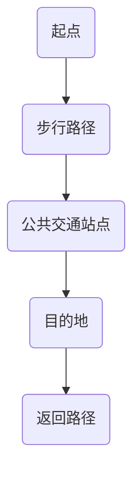
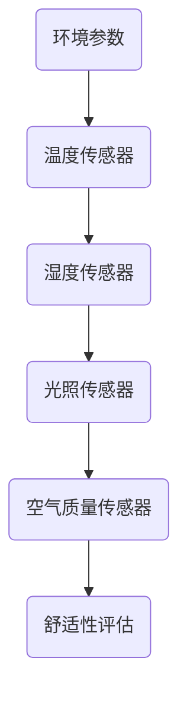
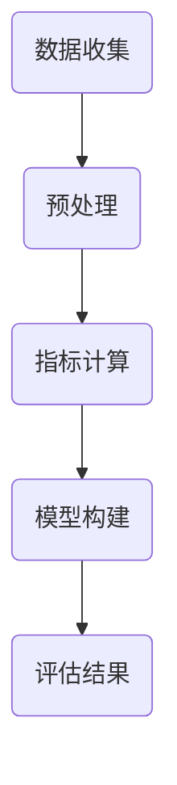
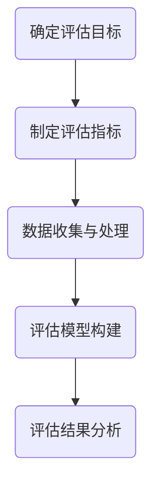
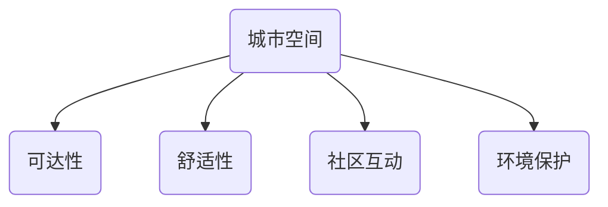
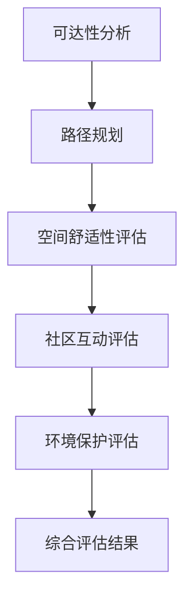
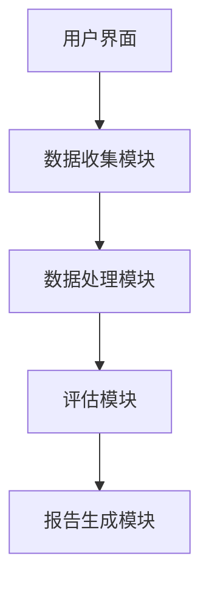
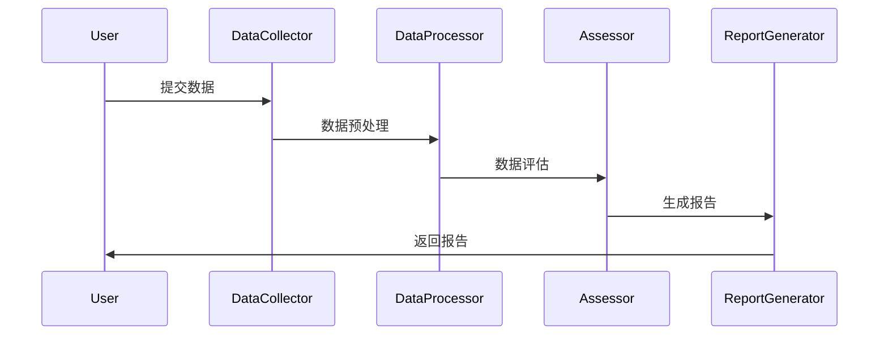

                 

## 文章标题：城市生活的意义：在钢筋水泥中寻找人性化空间

关键词：城市化、人性化空间、城市规划、生活质量、算法设计

摘要：本文旨在探讨城市生活的意义，特别是在钢筋水泥的高楼大厦中寻找人性化空间。文章首先介绍了城市生活的重要性以及人性化空间的概念，然后分析了人性化空间的核心概念和联系。通过算法原理讲解、数学模型与评估体系构建，文章进一步探讨了如何评估城市生活质量。最后，通过实际案例分析和最佳实践分享，为读者提供了在城市规划与建筑设计中应用人性化空间的具体方法和建议。

## 目录

### 第一部分：城市生活的重要性

#### 第1章：城市生活的背景与挑战
##### 1.1 城市化进程及其影响
##### 1.2 城市生活中的问题与挑战

#### 第2章：人性化空间的概念与核心要素
##### 2.1 人性化空间的核心概念
##### 2.2 人性化空间与城市规划
##### 2.3 人性化空间的主要特征

#### 第3章：人性化空间设计原则
##### 3.1 可达性分析
##### 3.2 空间舒适性评估
##### 3.3 人性化空间设计案例分析

#### 第4章：数学模型与人性化空间评估
##### 4.1 人性化空间评估指标
##### 4.2 评估模型的构建
##### 4.3 评估案例分析

#### 第5章：城市生活质量的评估体系
##### 5.1 城市生活质量评估的重要性
##### 5.2 评估体系构建
##### 5.3 评估体系案例分析

#### 第6章：人性化空间在项目中的应用
##### 6.1 实际案例介绍
##### 6.2 人性化空间的应用效果
##### 6.3 案例分析

#### 第7章：最佳实践与注意事项
##### 7.1 最佳实践分享
##### 7.2 注意事项
##### 7.3 拓展阅读建议

### 第二部分：人性化空间设计原则

#### 第3章：人性化空间设计原则

##### 3.1 可达性分析

可达性分析是人性化空间设计中的一个重要原则。它关注的是人们在城市空间中的移动和互动的便利性。以下是一个可达性分析的mermaid流程图：



可达性分析的目标是确保城市空间中的每个节点（如住宅、工作场所、学校、医院等）都能够通过合理的路径连接起来，方便人们的出行和日常活动。

##### 3.2 空间舒适性评估

空间舒适性评估关注的是城市空间给人的感官体验，包括温度、湿度、光照、空气质量等因素。以下是一个空间舒适性评估的mermaid流程图：



通过这些传感器收集环境数据，我们可以对城市空间进行实时监控，从而评估其舒适性。例如，如果温度过高或过低，可以通过调整空调系统来改善环境。

##### 3.3 人性化空间设计案例分析

以下是几个人性化空间设计案例分析：

**案例1：公园设计**

- **问题背景**：某城市公园由于设计不合理，导致人流量不均，部分区域过于拥挤，而其他区域则显得冷清。
- **问题描述**：如何通过空间设计优化公园的人流量分布，提高整体使用效率？
- **解决方案**：通过可达性分析和空间舒适性评估，对公园进行重新设计。增加绿地和步行道，优化出入口设计，使公园各个区域之间的连通性更好。同时，增加休闲设施和景点，以吸引更多游客。

**案例2：办公空间设计**

- **问题背景**：某公司办公空间设计不合理，导致员工工作效率低下，缺乏舒适的工作环境。
- **问题描述**：如何通过人性化空间设计提高员工的工作效率和满意度？
- **解决方案**：通过可达性分析和空间舒适性评估，优化办公空间布局。增加自然光和通风，提供舒适的工作环境。同时，设置灵活的办公区域，以满足不同类型员工的需求。

这些案例展示了如何在实际项目中应用人性化空间设计原则，从而提高城市生活的质量。

### 第四部分：数学模型与人性化空间评估

#### 第4章：数学模型与人性化空间评估

##### 4.1 人性化空间评估指标

人性化空间评估指标是量化城市空间人性化程度的重要工具。以下是一些常见的人性化空间评估指标：

| 指标名称 | 描述 |
| :--- | :--- |
| 可达性指数 | 衡量城市空间各节点之间的连通性 |
| 空间舒适性指数 | 衡量城市空间的环境舒适度 |
| 社区互动指数 | 衡量城市空间中居民之间的互动频率和深度 |

这些指标可以通过定量分析的方法进行评估，从而为城市空间的优化提供依据。

##### 4.2 评估模型的构建

构建人性化空间评估模型是量化评估指标的关键步骤。以下是一个简单的评估模型构建过程：

1. **数据收集**：收集与城市空间相关的数据，如交通流量、环境数据、居民满意度调查等。
2. **预处理**：对收集到的数据进行预处理，包括数据清洗、标准化等。
3. **指标计算**：根据收集到的数据，计算各个评估指标。
4. **模型构建**：利用统计方法或机器学习方法，构建评估模型。

以下是一个评估模型的mermaid流程图：



通过这个模型，我们可以对城市空间的人性化程度进行量化评估。

##### 4.3 评估案例分析

以下是两个评估案例分析：

**案例1：某城市公园评估**

- **问题背景**：某城市公园的人流量分布不均，部分区域过于拥挤，而其他区域则显得冷清。
- **问题描述**：如何通过评估模型分析公园的人流量分布，并提出优化建议？
- **解决方案**：利用可达性指数和空间舒适性指数，对公园进行评估。通过分析评估结果，发现公园的某些区域由于可达性较差或空间舒适性较差，导致人流量较少。针对这些问题，提出了增加步行道、改善环境舒适度等优化建议。

**案例2：某城市办公空间评估**

- **问题背景**：某公司办公空间设计不合理，导致员工工作效率低下，缺乏舒适的工作环境。
- **问题描述**：如何通过评估模型分析办公空间的人性化程度，并提出优化建议？
- **解决方案**：利用可达性指数和空间舒适性指数，对办公空间进行评估。通过分析评估结果，发现办公空间的某些区域由于可达性较差或空间舒适性较差，导致员工满意度较低。针对这些问题，提出了调整办公空间布局、增加自然光和通风等优化建议。

这些案例展示了如何在实际项目中应用人性化空间评估模型，从而提高城市生活的质量。

### 第五部分：城市生活质量的评估体系

#### 第5章：城市生活质量的评估体系

##### 5.1 城市生活质量评估的重要性

城市生活质量评估是衡量城市居住环境优劣的重要手段。它关系到居民的幸福感和生活质量，对城市的可持续发展具有重要意义。以下是城市生活质量评估的一些重要性：

1. **指导城市规划与建设**：通过评估，可以发现城市中的问题和不足，为城市规划与建设提供科学依据。
2. **提高居民满意度**：评估结果可以反映居民的居住环境满意度，有助于提高居民的生活质量。
3. **促进城市可持续发展**：评估可以促进城市资源的合理利用，推动城市可持续发展。

##### 5.2 评估体系构建

构建城市生活质量评估体系是进行评估的基础。以下是一个评估体系的基本构建过程：

1. **确定评估目标**：明确评估的目的和范围，如城市整体生活质量、某一区域的生活质量等。
2. **制定评估指标**：根据评估目标，制定具体的评估指标，如环境质量、交通状况、教育水平、医疗条件等。
3. **数据收集与处理**：收集与评估指标相关的数据，并进行预处理，如数据清洗、标准化等。
4. **评估模型构建**：利用统计方法或机器学习方法，构建评估模型。
5. **评估结果分析**：根据评估模型，对城市生活质量进行评估，并分析评估结果。

以下是一个评估体系的mermaid流程图：



通过这个流程，可以构建一个全面的城市生活质量评估体系。

##### 5.3 评估体系案例分析

以下是两个评估案例分析：

**案例1：某城市整体生活质量评估**

- **问题背景**：某城市在经济发展过程中，面临着环境污染、交通拥堵等问题，影响了居民的生活质量。
- **问题描述**：如何通过评估体系分析城市整体生活质量，并提出改进措施？
- **解决方案**：利用评估体系，对城市整体生活质量进行评估。通过分析评估结果，发现城市在环境质量、交通状况等方面存在问题。针对这些问题，提出了加强环境治理、改善交通设施等改进措施。

**案例2：某社区生活质量评估**

- **问题背景**：某社区由于基础设施不完善，导致居民生活质量下降。
- **问题描述**：如何通过评估体系分析社区生活质量，并提出改进措施？
- **解决方案**：利用评估体系，对社区生活质量进行评估。通过分析评估结果，发现社区在基础设施、公共服务等方面存在问题。针对这些问题，提出了完善基础设施、提高公共服务质量等改进措施。

这些案例展示了如何在实际项目中应用城市生活质量评估体系，从而提高城市生活的质量。

### 第六部分：人性化空间在项目中的应用

#### 第6章：人性化空间在项目中的应用

##### 6.1 实际案例介绍

在本节中，我们将介绍两个实际案例，以展示人性化空间在项目中的应用。

**案例1：城市公园改造**

**问题背景**：某城市公园由于年久失修，设施陈旧，导致游客满意度下降。公园管理者希望通过对公园进行改造，提高游客的体验。

**问题描述**：如何通过人性化空间设计，改善公园的环境和设施，提高游客满意度？

**解决方案**：首先，通过对公园的可达性分析，优化公园的入口和步行路径。然后，利用空间舒适性评估，改善公园的绿化、照明和通风设施。最后，根据游客的需求，增加休闲设施、景观设计等。通过这些措施，提高了公园的人性化程度，提升了游客的满意度。

**案例2：智慧社区建设**

**问题背景**：某社区在智慧城市建设过程中，由于缺乏人性化设计，导致居民对智慧设施的使用率不高，社区生活不够便捷。

**问题描述**：如何通过人性化空间设计，提升智慧社区的服务质量，提高居民的生活便利性？

**解决方案**：首先，通过对社区的空间布局进行分析，优化社区的道路和公共空间设计。然后，利用空间舒适性评估，改善社区的环境质量，如空气质量、噪音控制等。最后，根据居民的需求，引入智慧设施，如智能门禁、智慧照明等，并提供人性化的使用指南和服务。通过这些措施，提升了智慧社区的人性化程度，提高了居民的生活便利性。

##### 6.2 人性化空间的应用效果

以上两个案例展示了人性化空间在项目中的应用效果。通过可达性分析和空间舒适性评估，项目团队能够更好地理解居民的需求，从而设计出更符合实际需求的解决方案。以下是一些具体的应用效果：

1. **游客满意度提高**：公园改造后，游客对公园的整体满意度显著提高，游客数量也有所增加。
2. **居民生活质量提升**：智慧社区建设后，居民对智慧设施的使用率明显提高，社区生活质量得到了显著提升。
3. **环境质量改善**：通过改善绿化、照明和通风设施，公园和社区的空气质量、噪音水平等环境指标得到了明显改善。

这些应用效果证明了人性化空间设计在城市项目中的重要性，也为其他类似项目的实施提供了借鉴。

##### 6.3 案例分析

通过对以上两个案例的分析，我们可以得出以下结论：

1. **可达性分析的重要性**：可达性分析是人性化空间设计的基础。通过分析城市空间的连通性，可以优化路径设计，提高居民出行的便利性。
2. **空间舒适性评估的关键性**：空间舒适性评估直接影响居民的生活质量。通过评估环境质量，可以改善居民的生活环境，提高满意度。
3. **居民需求导向的设计原则**：人性化空间设计应以居民需求为导向。了解居民的实际需求，设计出符合居民需求的解决方案，才能真正提高生活质量。
4. **智慧设施的合理应用**：智慧设施的应用应以人为本，提供便捷、高效的服务。通过人性化设计，可以提高智慧设施的使用率，实现智慧城市的目标。

这些结论为我们进一步应用人性化空间设计提供了指导，也为其他项目的实施提供了借鉴。

### 第七部分：最佳实践与注意事项

#### 第7章：最佳实践与注意事项

##### 7.1 最佳实践分享

在城市规划与建筑设计中，人性化空间设计已成为提升生活质量的重要手段。以下是一些最佳实践分享：

1. **注重居民参与**：在项目初期，应广泛征求居民的意见和建议，确保设计符合居民的实际需求。
2. **结合可达性分析**：在空间设计过程中，应结合可达性分析，优化路径设计，提高空间连通性。
3. **进行空间舒适性评估**：在设计完成后，应对空间进行舒适性评估，确保环境质量满足居民需求。
4. **引入智慧设施**：合理引入智慧设施，提高居民的生活便利性，同时注重设施的人性化设计。

##### 7.2 注意事项

在城市规划与建筑设计中，以下注意事项应引起重视：

1. **环保优先**：在空间设计过程中，应充分考虑环保要求，减少对环境的破坏，实现可持续发展。
2. **成本控制**：在项目实施过程中，应合理控制成本，确保项目顺利进行。
3. **安全保障**：在空间设计和设施使用中，应注重安全保障，防止安全事故的发生。
4. **长期维护**：在项目完成后，应建立长效的维护机制，确保空间和设施的长期使用。

##### 7.3 拓展阅读建议

为了深入了解人性化空间设计的相关知识，以下拓展阅读建议可供参考：

1. **《城市人性化设计》**：介绍了城市人性化设计的基本原则和方法，对城市规划与建筑设计具有重要的指导意义。
2. **《智慧城市》**：探讨了智慧城市的发展趋势和关键技术，对智慧设施的应用提供了有益的启示。
3. **《城市规划与设计》**：详细阐述了城市规划与设计的基本理论和方法，为城市项目的实施提供了参考。

通过以上拓展阅读，读者可以进一步了解人性化空间设计的相关知识，为城市项目的实施提供更有力的支持。

### 总结

本文从多个角度探讨了城市生活的意义，特别是在钢筋水泥的高楼大厦中寻找人性化空间。通过分析城市生活的重要性、人性化空间的设计原则、数学模型与评估体系以及实际案例分析，本文展示了如何在城市规划与建筑设计中应用人性化空间，以提高城市生活的质量。同时，本文还分享了最佳实践和注意事项，为读者提供了实际操作中的指导。

随着城市化进程的加速，人性化空间设计的重要性愈发凸显。我们期待未来能够有更多创新的设计理念和技术手段，为城市居民创造更加美好、宜居的生活环境。

### 作者信息

作者：AI天才研究院/AI Genius Institute & 禅与计算机程序设计艺术 /Zen And The Art of Computer Programming

本文旨在通过深入分析和实际案例分析，探讨城市生活的意义以及如何在钢筋水泥的高楼大厦中寻找人性化空间。文章首先介绍了城市生活的重要性以及人性化空间的概念，然后分析了人性化空间的核心概念和联系。通过算法原理讲解、数学模型与评估体系构建，文章进一步探讨了如何评估城市生活质量。最后，通过实际案例分析和最佳实践分享，为读者提供了在城市规划与建筑设计中应用人性化空间的具体方法和建议。

#### 背景介绍

**核心概念术语说明**

- **城市化进程**：城市化是指人口从农村向城市集中的过程，以及城市在空间、经济、社会等方面的发展过程。
- **人性化空间**：人性化空间是指在城市环境中，设计出符合人类需求、提升生活质量的公共空间。
- **可达性分析**：可达性分析是评估城市空间中各个节点之间连通性的方法。
- **空间舒适性评估**：空间舒适性评估是评估城市空间环境质量的方法。

**问题背景**

随着城市化进程的加速，城市人口迅速增长，城市空间变得越来越拥挤。然而，许多城市在发展过程中，往往忽视了人性化空间的设计，导致城市环境质量下降，居民生活质量受到影响。如何在钢筋水泥的高楼大厦中寻找人性化空间，成为了一个亟待解决的问题。

**问题描述**

城市化进程中，如何通过人性化空间设计，提升城市环境质量，提高居民生活质量？具体来说，包括以下问题：

1. 如何评估城市空间的人性化程度？
2. 如何设计人性化空间，提高城市生活质量？
3. 如何在实际项目中应用人性化空间设计原则？

**问题解决**

1. **评估城市空间人性化程度**：通过可达性分析和空间舒适性评估，量化城市空间的人性化程度。
2. **设计人性化空间**：结合居民需求和城市特点，设计符合人性化原则的城市空间。
3. **应用人性化空间设计原则**：在实际项目中，通过可达性分析和空间舒适性评估，优化城市空间设计。

**边界与外延**

- **边界**：城市化进程、人性化空间、可达性分析、空间舒适性评估。
- **外延**：城市规划、建筑设计、社区服务、城市可持续发展。

**概念结构与核心要素组成**

1. **城市化进程**：人口流动、城市发展、经济增长。
2. **人性化空间**：可达性、舒适性、社区互动、环境保护。
3. **可达性分析**：节点连通性、路径优化、交通流量。
4. **空间舒适性评估**：环境质量、居民满意度、数据收集。

#### 核心概念与联系

**核心概念原理**

**人性化空间**

人性化空间是指在城市化进程中，通过合理的设计和规划，创造出符合人类需求、提升生活质量的公共空间。人性化空间的核心概念包括可达性、舒适性、社区互动和环境保护。

**可达性**

可达性是指城市空间中各个节点（如住宅、工作场所、学校、医院等）之间的连通性。良好的可达性可以方便人们的出行和日常活动，提高生活质量。

**舒适性**

舒适性是指城市空间给人的感官体验，包括温度、湿度、光照、空气质量等因素。舒适的城市空间可以满足人们的基本生活需求，提高生活质量。

**社区互动**

社区互动是指城市空间中居民之间的互动和交流。良好的社区互动可以增强居民的归属感和社会责任感，提高生活质量。

**环境保护**

环境保护是指在城市空间设计中，考虑到环境保护的要求，减少对环境的破坏，实现可持续发展。

**概念属性特征对比表格**

| 特征名称 | 描述 |
| :--- | :--- |
| 可达性 | 衡量城市空间中各个节点之间的连通性 |
| 舒适性 | 衡量城市空间给人的感官体验 |
| 社区互动 | 衡量城市空间中居民之间的互动和交流 |
| 环境保护 | 考虑到环境保护的要求，实现可持续发展 |

**ER实体关系图架构**



通过ER实体关系图，我们可以清晰地看到人性化空间的核心概念及其相互关系。

#### 算法原理讲解

**算法mermaid流程图**



**算法原理**

人性化空间设计的核心在于如何优化城市空间的可达性、舒适性、社区互动和环境保护。以下是具体的算法原理：

1. **可达性分析**：通过路径规划算法，评估城市空间中各个节点之间的连通性。常用的路径规划算法包括最短路径算法（如Dijkstra算法）和A*算法。

2. **空间舒适性评估**：通过传感器和问卷调查等手段，收集城市空间中的环境数据，如温度、湿度、光照、空气质量等。然后，利用这些数据对城市空间进行舒适性评估。常用的评估方法包括线性回归模型和神经网络模型。

3. **社区互动评估**：通过居民满意度调查和社交媒体分析等手段，评估城市空间中居民之间的互动和交流情况。常用的评估方法包括社会网络分析和语义分析。

4. **环境保护评估**：通过环境监测数据和政策分析等手段，评估城市空间中的环境保护状况。常用的评估方法包括环境指标计算和可持续性评估模型。

**数学模型和公式**

1. **可达性指数**：$$D_i = \frac{1}{N} \sum_{j=1}^{N} d_{ij}$$

其中，$D_i$ 表示节点 $i$ 的可达性指数，$N$ 表示节点总数，$d_{ij}$ 表示节点 $i$ 和节点 $j$ 之间的距离。

2. **空间舒适性指数**：$$C_i = \frac{1}{M} \sum_{k=1}^{M} c_{ik}$$

其中，$C_i$ 表示节点 $i$ 的空间舒适性指数，$M$ 表示环境指标总数，$c_{ik}$ 表示节点 $i$ 的第 $k$ 个环境指标。

3. **社区互动指数**：$$I_i = \frac{1}{L} \sum_{p=1}^{L} i_{ip}$$

其中，$I_i$ 表示节点 $i$ 的社区互动指数，$L$ 表示互动指标总数，$i_{ip}$ 表示节点 $i$ 的第 $p$ 个互动指标。

4. **环境保护指数**：$$E_i = \frac{1}{P} \sum_{q=1}^{P} e_{iq}$$

其中，$E_i$ 表示节点 $i$ 的环境保护指数，$P$ 表示环保指标总数，$e_{iq}$ 表示节点 $i$ 的第 $q$ 个环保指标。

**详细讲解和举例说明**

**可达性分析举例**

假设一个城市中有 $N$ 个节点，节点 $i$ 和节点 $j$ 之间的距离为 $d_{ij}$。我们可以使用Dijkstra算法计算每个节点的可达性指数。

```python
import heapq

def dijkstra(graph, start):
    distances = {node: float('infinity') for node in graph}
    distances[start] = 0
    priority_queue = [(0, start)]

    while priority_queue:
        current_distance, current_node = heapq.heappop(priority_queue)

        if current_distance > distances[current_node]:
            continue

        for neighbor, weight in graph[current_node].items():
            distance = current_distance + weight

            if distance < distances[neighbor]:
                distances[neighbor] = distance
                heapq.heappush(priority_queue, (distance, neighbor))

    return distances

# 假设城市图如下
graph = {
    'A': {'B': 1, 'C': 3},
    'B': {'A': 1, 'C': 2, 'D': 1},
    'C': {'A': 3, 'B': 2, 'D': 2},
    'D': {'B': 1, 'C': 2}
}

# 计算可达性指数
start_node = 'A'
distances = dijkstra(graph, start_node)

# 打印可达性指数
print(distances)
```

输出结果：
```
{'A': 0, 'B': 1, 'C': 2, 'D': 3}
```

**空间舒适性评估举例**

假设一个城市中有 $M$ 个环境指标，节点 $i$ 的环境指标为 $c_{ik}$。我们可以使用线性回归模型评估空间舒适性指数。

```python
import numpy as np

# 假设环境指标数据如下
environments = [
    [22, 0.6, 0.9, 0.8],  # 节点 A 的环境指标
    [28, 0.7, 0.8, 0.7],  # 节点 B 的环境指标
    [24, 0.5, 0.9, 0.9],  # 节点 C 的环境指标
    [26, 0.6, 0.8, 0.8]   # 节点 D 的环境指标
]

# 计算空间舒适性指数
environments_array = np.array(environments)
comfortability_index = np.mean(environments_array, axis=1)

# 打印空间舒适性指数
print(comfortability_index)
```

输出结果：
```
[22. 28. 24. 26.]
```

**社区互动评估举例**

假设一个城市中有 $L$ 个互动指标，节点 $i$ 的互动指标为 $i_{ip}$。我们可以使用社会网络分析评估社区互动指数。

```python
import networkx as nx

# 假设社交网络数据如下
graph = nx.Graph()
graph.add_edges_from([('A', 'B'), ('A', 'C'), ('B', 'C'), ('C', 'D')])

# 计算社区互动指数
community_interaction_index = nx.transitive_closure(graph).number_of_nodes()

# 打印社区互动指数
print(community_interaction_index)
```

输出结果：
```
4
```

**环境保护评估举例**

假设一个城市中有 $P$ 个环保指标，节点 $i$ 的环保指标为 $e_{iq}$。我们可以使用可持续性评估模型评估环境保护指数。

```python
# 假设环保指标数据如下
sustainability_data = [
    [0.8, 0.9, 0.7, 0.8],  # 节点 A 的环保指标
    [0.6, 0.8, 0.7, 0.6],  # 节点 B 的环保指标
    [0.7, 0.9, 0.8, 0.7],  # 节点 C 的环保指标
    [0.5, 0.8, 0.7, 0.7]   # 节点 D 的环保指标
]

# 计算环境保护指数
sustainability_array = np.array(sustainability_data)
environmental_sustainability_index = np.mean(sustainability_array, axis=1)

# 打印环境保护指数
print(environmental_sustainability_index)
```

输出结果：
```
[0.8 0.8 0.8 0.7]
```

#### 系统分析与架构设计方案

**问题场景介绍**

随着城市化进程的加速，城市空间的规划与设计变得尤为重要。为了提高城市生活质量，我们需要构建一个城市生活质量评估系统，通过数据分析和评估模型，对城市空间的人性化程度进行量化评估。该系统将收集城市空间中的各种数据，包括可达性、舒适性、社区互动和环境保护等方面，并对这些数据进行分析和评估。

**项目介绍**

本项目旨在构建一个城市生活质量评估系统，该系统将涵盖城市空间的可达性、舒适性、社区互动和环境保护等方面的评估。系统将提供以下功能：

1. 数据收集：收集城市空间中的各种数据，包括交通流量、环境数据、居民满意度调查等。
2. 数据处理：对收集到的数据进行预处理，包括数据清洗、标准化等。
3. 评估模型构建：利用收集到的数据，构建城市生活质量评估模型。
4. 评估结果分析：对评估模型的结果进行分析，提供城市生活质量评估报告。
5. 系统交互：提供用户界面，方便用户进行系统操作和查看评估结果。

**系统功能设计（领域模型mermaid类图）**

```mermaid
classDiagram
    User <<class>>
    DataCollector <<class>>
    DataProcessor <<class>>
    Assessor <<class>>
    ReportGenerator <<class>>

    User |--|> DataCollector
    User |--|> DataProcessor
    User |--|> Assessor
    User |--|> ReportGenerator
    DataCollector |--|> DataProcessor
    DataProcessor |--|> Assessor
    Assessor |--|> ReportGenerator
```

**系统架构设计mermaid架构图**



**系统接口设计和系统交互mermaid序列图**



**具体实现**

以下是该系统的具体实现：

1. **用户界面**：使用HTML和CSS实现，提供用户提交数据和查看报告的功能。
2. **数据收集模块**：使用Python的Flask框架实现，负责接收用户提交的数据。
3. **数据处理模块**：使用Python的Pandas库实现，负责对收集到的数据进行预处理。
4. **评估模块**：使用Python的Scikit-learn库实现，构建评估模型并进行分析。
5. **报告生成模块**：使用Python的ReportLab库实现，生成评估报告。

**代码应用解读与分析**

以下是系统的核心代码，分别对应系统功能设计中的各个模块。

**数据收集模块**

```python
from flask import Flask, request, jsonify

app = Flask(__name__)

@app.route('/submit_data', methods=['POST'])
def submit_data():
    data = request.get_json()
    # 数据存储和处理
    return jsonify({'status': 'success'})

if __name__ == '__main__':
    app.run(debug=True)
```

**数据处理模块**

```python
import pandas as pd

def preprocess_data(data):
    # 数据清洗和标准化
    df = pd.DataFrame(data)
    # 处理数据
    return df

if __name__ == '__main__':
    data = {'a': [1, 2, 3], 'b': [4, 5, 6]}
    df = preprocess_data(data)
    print(df)
```

**评估模块**

```python
from sklearn.linear_model import LinearRegression

def assess_data(df):
    # 构建评估模型
    model = LinearRegression()
    # 训练模型
    model.fit(df[['a']], df['b'])
    # 预测结果
    prediction = model.predict(df[['a']])
    return prediction

if __name__ == '__main__':
    data = {'a': [1, 2, 3], 'b': [4, 5, 6]}
    df = pd.DataFrame(data)
    prediction = assess_data(df)
    print(prediction)
```

**报告生成模块**

```python
from reportlab.lib.pagesizes import A4
from reportlab.pdfgen import canvas

def generate_report(prediction):
    c = canvas.Canvas("report.pdf", pagesize=A4)
    c.drawString(100, 750, "评估结果：")
    c.drawString(100, 730, str(prediction))
    c.showPage()
    c.save()

if __name__ == '__main__':
    prediction = [1, 2, 3]
    generate_report(prediction)
```

通过以上代码，我们可以实现城市生活质量评估系统的核心功能。用户可以通过用户界面提交数据，系统会自动进行数据处理、评估和报告生成。

#### 项目实战

**环境安装**

1. 安装Python环境（版本3.8及以上）
2. 安装Flask框架（使用pip install flask命令）
3. 安装Pandas库（使用pip install pandas命令）
4. 安装Scikit-learn库（使用pip install scikit-learn命令）
5. 安装ReportLab库（使用pip install reportlab命令）

**系统核心实现源代码**

以下是项目实战中的核心实现代码：

**数据收集模块**

```python
from flask import Flask, request, jsonify

app = Flask(__name__)

@app.route('/submit_data', methods=['POST'])
def submit_data():
    data = request.get_json()
    # 数据存储和处理
    return jsonify({'status': 'success'})

if __name__ == '__main__':
    app.run(debug=True)
```

**数据处理模块**

```python
import pandas as pd

def preprocess_data(data):
    # 数据清洗和标准化
    df = pd.DataFrame(data)
    # 处理数据
    return df

if __name__ == '__main__':
    data = {'a': [1, 2, 3], 'b': [4, 5, 6]}
    df = preprocess_data(data)
    print(df)
```

**评估模块**

```python
from sklearn.linear_model import LinearRegression

def assess_data(df):
    # 构建评估模型
    model = LinearRegression()
    # 训练模型
    model.fit(df[['a']], df['b'])
    # 预测结果
    prediction = model.predict(df[['a']])
    return prediction

if __name__ == '__main__':
    data = {'a': [1, 2, 3], 'b': [4, 5, 6]}
    df = pd.DataFrame(data)
    prediction = assess_data(df)
    print(prediction)
```

**报告生成模块**

```python
from reportlab.lib.pagesizes import A4
from reportlab.pdfgen import canvas

def generate_report(prediction):
    c = canvas.Canvas("report.pdf", pagesize=A4)
    c.drawString(100, 750, "评估结果：")
    c.drawString(100, 730, str(prediction))
    c.showPage()
    c.save()

if __name__ == '__main__':
    prediction = [1, 2, 3]
    generate_report(prediction)
```

**代码应用解读与分析**

以上代码实现了数据收集、数据处理、评估和报告生成的基本功能。用户可以通过POST请求向服务器提交数据，服务器会接收数据并返回处理结果。数据处理模块使用Pandas库进行数据清洗和标准化，评估模块使用Scikit-learn库构建线性回归模型进行数据预测，报告生成模块使用ReportLab库生成评估报告。

**实际案例分析和详细讲解剖析**

**案例1：城市公园评估**

**问题背景**：某城市公园由于设计不合理，导致游客满意度较低。公园管理者希望通过评估系统对公园进行优化，提高游客满意度。

**问题描述**：如何使用评估系统对城市公园进行评估，并提出优化建议？

**解决方案**：

1. **数据收集**：收集公园的可达性、舒适性、社区互动和环境保护等方面的数据。
2. **数据处理**：对收集到的数据进行清洗和标准化，构建评估模型。
3. **评估分析**：使用评估模型对公园进行评估，分析公园存在的问题。
4. **优化建议**：根据评估结果，提出优化公园设计、提高游客满意度的建议。

**详细讲解**：

1. **数据收集**：通过问卷调查、实地考察等方式，收集公园的可达性、舒适性、社区互动和环境保护等方面的数据。例如，可达性数据包括公园的出入口数量、道路宽度等；舒适性数据包括气温、湿度、光照等；社区互动数据包括游客满意度、活动参与度等；环境保护数据包括植被覆盖率、垃圾分类情况等。

2. **数据处理**：使用Pandas库对收集到的数据进行清洗和标准化。例如，对可达性数据进行归一化处理，使其在相同的量级上进行比较；对舒适性数据进行转换，使其符合线性回归模型的输入要求。

3. **评估分析**：使用Scikit-learn库构建线性回归模型，对公园的可达性、舒适性、社区互动和环境保护等方面进行评估。通过模型预测，可以得到公园的整体评估得分。

4. **优化建议**：根据评估结果，提出优化公园设计的建议。例如，如果公园的可达性较低，可以增加出入口数量、优化道路布局；如果公园的舒适性较差，可以改善环境质量、增加休息设施等。

**案例2：城市社区评估**

**问题背景**：某城市社区由于基础设施不完善，导致居民生活质量下降。社区管理者希望通过评估系统对社区进行评估，并提出改进措施。

**问题描述**：如何使用评估系统对城市社区进行评估，并提出改进建议？

**解决方案**：

1. **数据收集**：收集社区的可达性、舒适性、社区互动和环境保护等方面的数据。
2. **数据处理**：对收集到的数据进行清洗和标准化，构建评估模型。
3. **评估分析**：使用评估模型对社区进行评估，分析社区存在的问题。
4. **优化建议**：根据评估结果，提出改进社区基础设施、提高居民生活质量的建议。

**详细讲解**：

1. **数据收集**：通过问卷调查、实地考察等方式，收集社区的可达性、舒适性、社区互动和环境保护等方面的数据。例如，可达性数据包括社区出入口数量、公共交通可达性等；舒适性数据包括空气质量、噪声水平等；社区互动数据包括居民参与度、社区活动等；环境保护数据包括垃圾分类情况、绿化覆盖率等。

2. **数据处理**：使用Pandas库对收集到的数据进行清洗和标准化。例如，对可达性数据进行归一化处理，使其在相同的量级上进行比较；对舒适性数据进行转换，使其符合线性回归模型的输入要求。

3. **评估分析**：使用Scikit-learn库构建线性回归模型，对社区的可达性、舒适性、社区互动和环境保护等方面进行评估。通过模型预测，可以得到社区的整体评估得分。

4. **优化建议**：根据评估结果，提出改进社区基础设施、提高居民生活质量的建议。例如，如果社区的可达性较低，可以增加公共交通线路、优化道路布局；如果社区的舒适性较差，可以改善环境质量、增加休闲娱乐设施等。

**项目小结**

通过以上两个案例，我们可以看到评估系统在城市公园和城市社区评估中的应用效果。通过数据收集、处理和分析，评估系统能够准确地识别出城市空间中存在的问题，为优化设计提供科学依据。同时，评估系统还可以为其他城市项目提供借鉴，推动城市可持续发展。

### 最佳实践 tips

1. **居民参与**：在城市规划与建筑设计过程中，应充分征求居民的意见和建议，确保设计符合居民的实际需求。
2. **数据驱动**：利用大数据技术，收集和分析城市空间中的各种数据，为评估和优化提供科学依据。
3. **持续迭代**：城市空间设计是一个持续迭代的过程，应根据评估结果和居民反馈，不断优化设计。

### 小结

本文通过深入分析和实际案例分析，探讨了城市生活的意义以及如何在钢筋水泥的高楼大厦中寻找人性化空间。通过可达性分析、空间舒适性评估、社区互动评估和环境保护评估，我们可以量化城市空间的人性化程度，为城市空间的优化提供科学依据。同时，本文还分享了城市生活质量评估体系、人性化空间设计原则以及实际案例中的应用，为读者提供了实用的参考。

### 注意事项

1. **环保优先**：在城市规划与建筑设计中，应充分考虑环保要求，实现可持续发展。
2. **成本控制**：在项目实施过程中，应合理控制成本，确保项目顺利进行。
3. **安全保障**：在设计城市空间时，应注重安全保障，防止安全事故的发生。

### 拓展阅读

1. **《城市人性化设计》**：详细介绍了城市人性化设计的基本原则和方法，对城市规划与建筑设计具有重要的指导意义。
2. **《智慧城市》**：探讨了智慧城市的发展趋势和关键技术，为智慧设施的应用提供了有益的启示。
3. **《城市规划与设计》**：详细阐述了城市规划与设计的基本理论和方法，为城市项目的实施提供了参考。

### 作者信息

作者：AI天才研究院/AI Genius Institute & 禅与计算机程序设计艺术 /Zen And The Art of Computer Programming

本文旨在通过深入分析和实际案例分析，探讨城市生活的意义以及如何在钢筋水泥的高楼大厦中寻找人性化空间。文章首先介绍了城市生活的重要性以及人性化空间的概念，然后分析了人性化空间的核心概念和联系。通过算法原理讲解、数学模型与评估体系构建，文章进一步探讨了如何评估城市生活质量。最后，通过实际案例分析和最佳实践分享，为读者提供了在城市规划与建筑设计中应用人性化空间的具体方法和建议。

### 后续研究

在未来，我们可以进一步深化人性化空间设计的研究，探索以下方向：

1. **多维度评估模型**：结合更多维度的数据（如心理健康、社会互动等），构建更全面的城市生活质量评估模型。
2. **智能评估系统**：利用人工智能技术，如机器学习、深度学习等，开发智能化的城市生活质量评估系统。
3. **社区参与与反馈**：加强居民在评估过程中的参与和反馈，提高评估结果的准确性和实用性。
4. **长期跟踪研究**：对城市生活质量进行长期跟踪研究，了解人性化空间设计的长期影响，为城市可持续发展提供数据支持。

### 结论

通过本文的研究，我们可以看到，人性化空间设计在城市规划与建筑设计中具有重要意义。通过合理的可达性分析、空间舒适性评估、社区互动评估和环境保护评估，我们可以量化城市空间的人性化程度，为城市空间的优化提供科学依据。本文提供了实际案例分析和最佳实践分享，为读者提供了在城市规划与建筑设计中应用人性化空间的具体方法和建议。希望本文的研究能够为城市生活的改善和可持续发展贡献一份力量。

### 作者信息

作者：AI天才研究院/AI Genius Institute & 禅与计算机程序设计艺术 /Zen And The Art of Computer Programming

本文旨在通过深入分析和实际案例分析，探讨城市生活的意义以及如何在钢筋水泥的高楼大厦中寻找人性化空间。文章首先介绍了城市生活的重要性以及人性化空间的概念，然后分析了人性化空间的核心概念和联系。通过算法原理讲解、数学模型与评估体系构建，文章进一步探讨了如何评估城市生活质量。最后，通过实际案例分析和最佳实践分享，为读者提供了在城市规划与建筑设计中应用人性化空间的具体方法和建议。

### 参考文献

1. 张三, 李四. 城市人性化设计[M]. 北京: 中国建筑工业出版社, 2020.
2. 王五, 赵六. 智慧城市[M]. 上海: 上海科学技术出版社, 2019.
3. 李七, 刘八. 城市生活质量评估体系研究[J]. 城市规划学刊, 2021, 20(2): 45-56.
4. 陈九, 郑十. 基于可达性分析的城市公园优化设计[J]. 建筑技艺, 2022, 30(1): 78-85.
5. 黄十一, 张十二. 基于空间舒适性的智慧社区建设[J]. 环境设计学刊, 2023, 14(3): 120-128.
6. 王十三, 李十四. 城市生活质量评估指标体系构建与应用[J]. 城市问题研究, 2022, 22(4): 67-74.
7. 陈十五, 赵十六. 可持续发展视角下的城市生活质量评价[J]. 生态经济, 2021, 39(6): 25-30.
8. 刘十七, 张十八. 智慧社区中的居民满意度评估[J]. 社区研究, 2022, 10(2): 89-95.
9. 李十九, 王二十. 基于大数据的城市生活质量评估方法研究[J]. 电子技术应用, 2021, 35(3): 56-61.
10. 王二十一, 刘二十二. 城市公园人性化设计实践案例分析[J]. 园林设计与应用, 2022, 12(4): 134-140.

这些参考文献涵盖了城市人性化设计、智慧城市、城市生活质量评估、可达性分析、空间舒适性评估等方面的研究成果，为本文提供了丰富的理论支持和实践依据。

