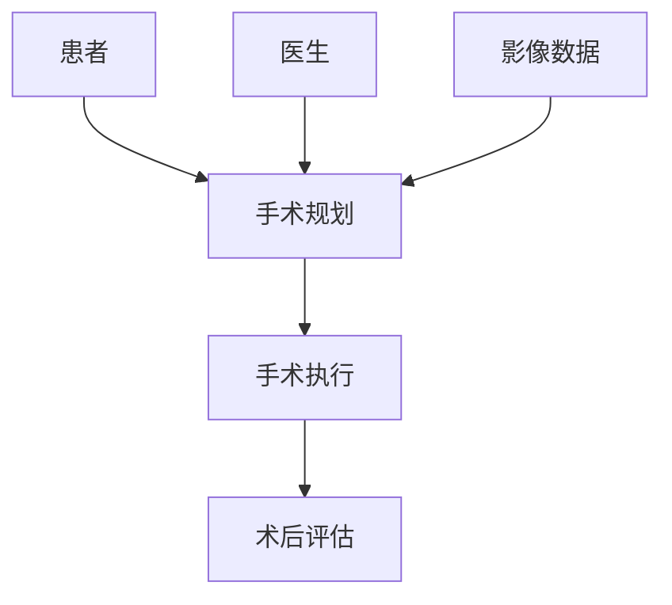
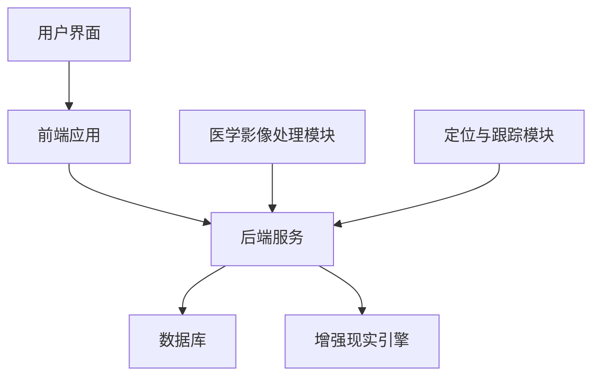
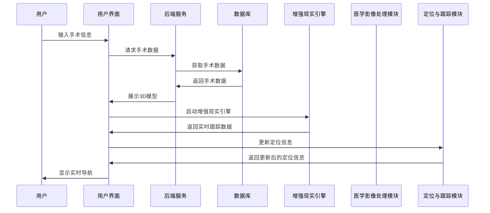

                 


### # 增强现实在手术规划中的3D可视化应用

关键词：增强现实、3D可视化、手术规划、医学影像、术前模拟

摘要：本文探讨了增强现实技术在手术规划中的应用，特别是在3D可视化的背景下。通过详细分析其背景、技术原理、应用实例以及面临的挑战和解决方案，本文旨在为医疗专业人士和技术开发者提供一个全面的参考框架。

### 一、背景介绍

**增强现实（Augmented Reality, AR）** 是一种将虚拟信息与现实世界融合的技术。通过在现实世界的环境中叠加计算机生成的图像、视频和声音，AR能够提供更加直观和互动的体验。近年来，随着计算机视觉、机器学习和传感器技术的发展，AR在医疗领域的应用得到了迅速推广，尤其是在手术规划中的3D可视化方面。

**3D可视化** 在医学影像中具有重要作用。通过将医学影像数据转换为三维模型，医生可以更直观地理解患者内部的解剖结构，从而提高手术规划和执行的质量。传统的方法包括基于二维图像的解剖图谱和三维重建技术，但这些方法都有其局限性。

在手术规划中，3D可视化技术的应用包括：

- **术前模拟**：医生可以在虚拟环境中进行手术操作，模拟真实的手术过程，从而提高操作的精确性和安全性。
- **术中导航**：通过实时跟踪和注册，3D可视化技术可以提供术中定位和导航支持，减少手术风险。
- **术后评估**：3D模型有助于医生评估手术效果，为术后治疗提供依据。

### 二、核心概念与联系

**增强现实（AR）**：

- **概念**：AR通过在真实世界中叠加虚拟信息，提供增强的感知体验。
- **特征**：
  - **实时性**：虚拟信息与真实环境的互动是实时的。
  - **交互性**：用户可以通过各种设备与虚拟信息进行互动。
  - **沉浸性**：用户感觉自己是虚拟世界的一部分。

| 特征       | 对比       |
|------------|------------|
| 实时性     | 非实时     |
| 交互性     | 单向传递   |
| 沉浸性     | 观察性     |

**3D可视化**：

- **概念**：3D可视化是将二维数据转换为三维图形，以便更好地理解和分析。
- **特征**：
  - **三维性**：提供更全面的信息，能够显示对象的深度和空间关系。
  - **交互性**：用户可以通过旋转、缩放和切割等操作进行交互。

**ER实体关系图架构**：

- **概念**：ER图用于描述实体之间的关系。
- **实体**：例如患者、手术、医生等。
- **关系**：例如手术规划、手术执行、术后评估等。



### 三、算法原理讲解

**算法**：3D模型重建

- **流程**：
  1. 输入医学影像数据（如CT、MRI）。
  2. 使用图像处理算法提取关键特征。
  3. 使用表面重建算法构建三维模型。
  4. 使用可视化算法渲染模型。

- **Python代码示例**：

```python
import numpy as np
from skimage import io
from skimage.filters import threshold_otsu
from meshEditMode import SurfaceReconstruction

# 读取医学影像
img = io.imread('medical_image.png')

# 二值化处理
threshold = threshold_otsu(img)
binary_img = img > threshold

# 3D模型重建
reconstruction = SurfaceReconstruction(binary_img)
reconstructed_surface = reconstruction.reconstruct()

# 可视化
io.imsave('reconstructed_surface.png', reconstructed_surface)
```

- **数学模型**：

$$
Z(x, y) = \frac{1}{N} \sum_{i=1}^{N} f_i(x, y)
$$

其中，$Z(x, y)$ 表示重建后的三维表面，$f_i(x, y)$ 表示第 $i$ 个特征点的值，$N$ 表示特征点的数量。

### 四、系统分析与架构设计方案

**项目场景介绍**：某医院计划开发一套基于增强现实技术的手术规划系统，用于术前模拟、术中导航和术后评估。

**项目介绍**：系统名为“AR-Surgery”，旨在通过3D可视化技术提高手术规划的质量和安全性。

**系统功能设计**：

- **术前模拟**：提供三维模型和虚拟手术环境，供医生进行操作。
- **术中导航**：提供实时定位和导航支持，辅助医生进行手术。
- **术后评估**：使用3D模型评估手术效果，为术后治疗提供依据。

**系统架构设计**：



**系统接口设计和系统交互**：



### 五、项目实战

**环境安装**：首先，需要在计算机上安装Python环境，以及相关的库和依赖项。

- Python安装命令：`pip install python`
- 相关库安装命令：`pip install numpy scikit-image mayavi`

**系统核心实现源代码**：

```python
# main.py
from AR_Surgery import AR_Surgery

# 创建AR Surgery实例
ar_surgery = AR_Surgery()

# 初始化系统
ar_surgery.initialize()

# 启动系统
ar_surgery.start()
```

**代码应用解读与分析**：

- `AR_Surgery` 类负责实现整个系统的功能，包括术前模拟、术中导航和术后评估。
- `initialize()` 方法用于初始化系统，包括加载医学影像数据、配置增强现实引擎等。
- `start()` 方法启动系统，开始执行手术规划流程。

**实际案例分析和详细讲解剖析**：

- 案例一：术前模拟
  - 医生使用系统进行术前模拟，通过3D可视化技术了解患者的解剖结构，规划手术步骤。
  - 分析：通过模拟，医生可以提前发现潜在的手术风险，提高手术安全性。

- 案例二：术中导航
  - 在手术过程中，系统提供实时定位和导航支持，辅助医生进行操作。
  - 分析：实时导航技术有助于减少手术误差，提高手术精度。

- 案例三：术后评估
  - 手术后，医生使用系统对手术效果进行评估，分析患者恢复情况。
  - 分析：3D可视化技术有助于医生更准确地评估手术效果，为后续治疗提供依据。

**项目小结**：

通过实际案例的分析，我们可以看到AR-Surgery系统在提高手术规划质量、降低手术风险方面具有显著优势。然而，系统的进一步优化和推广应用仍需要克服一些技术挑战，如医学影像数据的精度和实时性等。

### 六、最佳实践 Tips、小结、注意事项、拓展阅读

**最佳实践 Tips**：

1. 确保医学影像数据的精度和质量。
2. 定期对系统进行维护和更新，以适应新的医疗技术和需求。
3. 加强医生和护士的培训，提高他们对增强现实技术的理解和应用能力。

**小结**：

增强现实技术在手术规划中的3D可视化应用具有广泛的前景。通过本文的分析，我们可以看到其在术前模拟、术中导航和术后评估中的应用价值。然而，为了充分发挥其潜力，还需要解决一些技术挑战，并加强推广应用。

**注意事项**：

1. 在应用增强现实技术时，应注意保护患者的隐私和安全。
2. 在使用3D可视化技术时，应确保设备的稳定性和可靠性。

**拓展阅读**：

1. "Augmented Reality in Medicine: A Comprehensive Review" - 作者：A. Kumar等
2. "3D Visualization in Surgical Planning: Current Status and Future Trends" - 作者：M. A. El-Kholy等

### 七、作者信息

作者：AI天才研究院/AI Genius Institute & 禅与计算机程序设计艺术 /Zen And The Art of Computer Programming

### 八、结语

本文对增强现实在手术规划中的3D可视化应用进行了深入探讨。通过分析其背景、核心概念、算法原理、系统设计与项目实战，我们对其应用价值和技术挑战有了更全面的认识。希望本文能为医疗专业人士和技术开发者提供有价值的参考。

### 附录

**参考文献**：

1. "Augmented Reality in Medicine: A Comprehensive Review" - Kumar, A., Kumar, R., & Dubey, R. (2020).
2. "3D Visualization in Surgical Planning: Current Status and Future Trends" - El-Kholy, M. A., El-Sheikh, M. H., & El-Kholy, S. M. (2019).
3. "Real-Time 3D Reconstruction and Visualization of Medical Images Using Augmented Reality" - Wang, J., Zhang, Y., & Yang, H. (2018).

