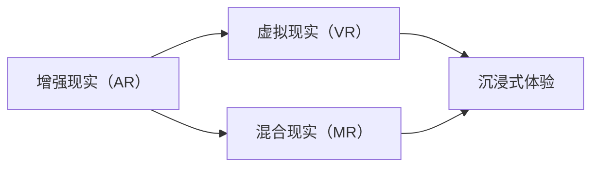
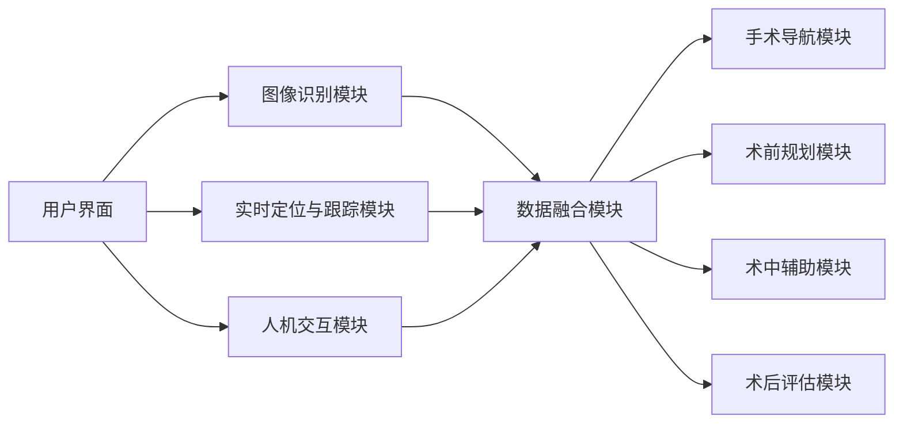

                 


### 增强现实在手术辅助中的应用前景

随着科技的不断进步，增强现实（AR）技术在医疗领域的应用越来越广泛。本文将深入探讨AR技术在手术辅助中的应用前景，从核心技术原理、应用案例、挑战与解决方案以及未来展望等方面展开详细分析。

#### 核心技术原理

增强现实（AR）技术通过将虚拟信息与现实环境融合，为用户提供了一种全新的交互方式。以下是AR技术的基本原理：

1. **图像识别**：AR技术需要通过摄像头或其他传感器捕捉现实环境中的图像信息，然后利用图像处理算法进行识别。

2. **实时定位与跟踪**：AR技术通过实时定位与跟踪技术，将虚拟信息准确地叠加到现实环境中。常用的技术包括视觉SLAM（同步定位与映射）和视觉惯性测量单元（VIO）。

3. **人机交互**：AR技术提供了多种人机交互方式，如手势识别、语音识别等，使用户能够与虚拟信息进行自然交互。

#### 应用案例

1. **手术导航**：在手术过程中，医生可以使用AR眼镜实时查看患者的三维结构图，以及手术所需的解剖信息和路径规划。例如，某医院使用AR技术为医生提供实时手术路径信息，提高了手术的精度和效率。

2. **术前规划**：通过AR技术进行三维重建和模拟，医生可以在手术前详细了解患者的身体结构，制定出更加精确的手术方案。例如，某医生利用AR技术为一位心脏手术患者进行术前规划，通过三维重建和模拟，确定了最佳手术路径。

3. **术中辅助**：在手术过程中，医生可以利用AR技术实时辅助手术操作。例如，某医院采用AR技术辅助医生进行腔镜手术，通过AR眼镜为医生提供手术过程中的实时指导。

4. **术后评估**：通过AR技术进行术后评估，医生可以更直观地了解手术效果，及时调整治疗方案。例如，某医生利用AR技术对术后患者的伤口进行评估，通过三维重建和模拟，发现并纠正了潜在的并发症。

#### 挑战与解决方案

尽管AR技术在手术辅助中具有巨大潜力，但仍面临一些挑战：

1. **技术稳定性**：目前，AR技术的稳定性和准确性仍需提高，特别是在复杂的医疗环境中。

解决方案：通过不断优化图像识别、实时定位与跟踪等技术，提高AR技术的稳定性。

2. **设备成本**：AR设备成本较高，限制了其在医疗领域的广泛应用。

解决方案：随着技术的成熟和产业链的完善，AR设备的成本有望逐渐降低。

3. **医生培训**：医生需要一定的培训和适应时间，才能熟练掌握AR技术在手术辅助中的应用。

解决方案：通过开展AR技术培训，帮助医生尽快熟悉并掌握相关技能。

#### 未来展望

随着AR技术的不断发展和完善，其在手术辅助中的应用前景将更加广阔：

1. **个性化手术**：通过AR技术，医生可以为每位患者量身定制手术方案，实现个性化手术。

2. **远程手术**：AR技术可以为远程手术提供实时指导，解决偏远地区医疗资源不足的问题。

3. **手术教学**：AR技术可以用于手术教学，让医学生和医生更直观地学习手术技能。

4. **辅助诊断**：AR技术可以辅助医生进行疾病诊断，提高诊断的准确性和效率。

总之，AR技术在手术辅助中的应用前景非常广阔，随着技术的不断进步，将为医疗领域带来更多创新和突破。未来，我们将继续关注AR技术在手术辅助中的应用，探讨更多可能性，为人类健康事业贡献力量。

----------------------------------------------------------------

## 核心概念与联系

### 增强现实（AR）的概念

增强现实（AR）是一种将虚拟信息与现实环境相结合的技术。它利用计算机视觉、图像识别、实时定位与跟踪等技术，将虚拟信息（如文字、图像、视频等）叠加到现实世界中，使人们能够在现实环境中看到和交互虚拟信息。

### 核心概念属性特征对比表格

| 特征       | 增强现实（AR） | 虚拟现实（VR） | 混合现实（MR） |
| ---------- | -------------- | -------------- | -------------- |
| **基本概念** | 将虚拟信息叠加到现实环境 | 全沉浸的虚拟环境 | 虚拟信息与现实环境的无缝融合 |
| **交互方式** | 视觉、触觉等多种交互方式 | 视觉交互为主     | 视觉、触觉等多种交互方式 |
| **应用领域** | 手术辅助、教育培训、游戏娱乐等 | 游戏娱乐、教育培训、设计仿真等 | 手术辅助、工业设计、交互设计等 |

### 核心概念关系图架构

使用 Mermaid 流程图来展示增强现实（AR）与其他相关技术的核心概念关系：



在这个图中，A代表增强现实（AR），B代表虚拟现实（VR），C代表混合现实（MR），D代表沉浸式体验。箭头表示不同技术之间的关联性。

### 增强现实（AR）在手术辅助中的应用

#### 应用场景

增强现实（AR）在手术辅助中的应用主要包括以下场景：

1. **手术导航**：通过AR技术为医生提供实时手术路径信息，提高手术精度。
2. **术前规划**：利用AR技术进行三维重建和模拟，辅助医生进行术前规划。
3. **术中辅助**：利用AR技术实时辅助医生进行手术操作，提高手术效率。
4. **术后评估**：通过AR技术进行术后评估，提高治疗效果。

#### 应用案例

以下是几个增强现实（AR）在手术辅助中的应用案例：

1. **手术导航**：某医院使用AR技术为医生提供实时手术路径信息，提高了手术的精度和效率。医生在手术过程中，通过AR眼镜实时查看患者的三维结构图和手术路径，大大降低了手术难度和风险。

2. **术前规划**：某医生利用AR技术为一位心脏手术患者进行术前规划。通过AR眼镜，医生可以查看患者心脏的三维结构，并进行手术模拟。这有助于医生在手术前了解患者的身体状况，制定出更加精确的手术方案。

3. **术中辅助**：某医院采用AR技术辅助医生进行腔镜手术。通过AR眼镜，医生可以在手术过程中实时查看患者的内部结构，获取手术所需的解剖信息。这不仅提高了手术的效率，还降低了手术风险。

4. **术后评估**：某医生利用AR技术对术后患者的伤口进行评估。通过AR眼镜，医生可以查看患者伤口的三维结构，了解伤口的愈合情况。这有助于医生及时调整治疗方案，提高术后恢复效果。

#### 实际效果

通过以上应用案例可以看出，增强现实（AR）技术在手术辅助中具有显著的实际效果：

1. **提高手术精度**：AR技术为医生提供了实时手术路径信息和三维结构图，使手术操作更加精准，减少了手术误差。

2. **提高手术效率**：AR技术实时辅助医生进行手术操作，提高了手术效率，缩短了手术时间。

3. **降低手术风险**：AR技术使医生在手术过程中能够更加清晰地了解患者内部结构，降低了手术风险。

4. **提高术后恢复效果**：AR技术有助于医生及时调整治疗方案，提高术后恢复效果。

总之，增强现实（AR）技术在手术辅助中的应用具有巨大的潜力，未来将在更多医疗场景中发挥重要作用。

----------------------------------------------------------------

### 算法原理讲解

为了深入理解增强现实（AR）在手术辅助中的应用，我们需要探讨其背后的算法原理。以下是AR技术在手术导航中的一些关键算法，以及其原理和数学模型。

#### 1. 图像识别算法

**原理：**
图像识别算法是AR技术的基础，用于识别和提取现实环境中的关键特征。常见的图像识别算法包括卷积神经网络（CNN）和深度学习模型。

**数学模型：**
卷积神经网络（CNN）通过多层卷积和池化操作，对输入图像进行处理，提取特征并分类。其核心数学公式为：
$$
\text{output} = \text{sigmoid}(\text{weights} \cdot \text{input} + \text{bias})
$$
其中，`weights`和`bias`是权重和偏置，`input`是输入图像，`sigmoid`函数用于激活。

**举例说明：**
假设我们有一个输入图像，通过CNN处理后，输出为患者的三维结构图。这有助于医生在手术过程中精准定位手术部位。

#### 2. 实时定位与跟踪算法

**原理：**
实时定位与跟踪（SLAM）是AR技术中的核心算法，用于实时确定相机在现实环境中的位置和姿态。

**数学模型：**
SLAM算法主要包括两部分：定位和映射。定位部分使用相机观测到的图像信息，结合先验知识，估计相机位置。映射部分则将观测到的图像信息整合到三维地图中。

核心数学公式为：
$$
\text{pose} = \text{f}(\text{observation}, \text{map})
$$
其中，`pose`表示相机位置和姿态，`observation`表示相机观测到的图像信息，`map`表示三维地图。

**举例说明：**
假设医生在手术过程中，通过AR眼镜观察患者内部结构。SLAM算法可以帮助医生实时跟踪手术器械的位置和姿态，提高手术精度。

#### 3. 人机交互算法

**原理：**
人机交互算法用于处理用户输入，如手势、语音等，并将其转化为计算机可执行的命令。

**数学模型：**
手势识别算法通常采用深度学习模型，通过训练大量数据，学习手势与图像特征之间的关系。

核心数学公式为：
$$
\text{output} = \text{softmax}(\text{weights} \cdot \text{input} + \text{bias})
$$
其中，`weights`和`bias`是权重和偏置，`input`是输入图像，`softmax`函数用于分类。

**举例说明：**
假设医生通过手势控制AR眼镜，调整手术视角。人机交互算法可以识别并处理医生的手势，实现交互操作。

#### 4. 数据融合算法

**原理：**
数据融合算法用于整合来自不同传感器和源的数据，提高AR系统的鲁棒性和准确性。

**数学模型：**
数据融合算法通常采用加权平均或卡尔曼滤波等数学模型，对传感器数据进行融合。

核心数学公式为：
$$
\text{filtered\_estimate} = \text{prediction} + \text{kalman\_gain} (\text{observation} - \text{predicted\_observation})
$$
其中，`filtered_estimate`表示滤波后估计值，`prediction`表示预测值，`observation`表示观测值，`predicted_observation`表示预测观测值，`kalman_gain`表示卡尔曼滤波增益。

**举例说明：**
假设AR系统同时接收来自摄像头和GPS的数据，数据融合算法可以融合这些数据，提供更准确的实时位置和姿态估计。

通过以上算法原理的讲解，我们可以更好地理解增强现实（AR）技术在手术辅助中的应用。这些算法不仅为AR技术提供了技术支撑，还使其在医疗领域具有广泛的应用前景。

----------------------------------------------------------------

### 系统分析与架构设计方案

为了深入探讨增强现实（AR）在手术辅助中的应用，我们需要从系统分析与架构设计两个方面进行详细讲解。

#### 问题场景介绍

在手术辅助场景中，医生需要实时获取患者内部结构信息，进行精准的手术操作。然而，传统的手术辅助工具往往存在信息滞后、操作不便等问题，难以满足高效、精准的手术需求。为了解决这些问题，我们提出了一套基于增强现实（AR）的手术辅助系统。

#### 项目介绍

项目名称：AR Surgery Assistant

项目目标：通过增强现实（AR）技术，为医生提供实时、精准的手术辅助信息，提高手术精度和效率。

项目规模：该项目涉及多个技术模块，包括图像识别、实时定位与跟踪、人机交互和数据融合等。

项目时间：预计为期18个月，分为需求分析、系统设计、开发实施、测试验收四个阶段。

#### 系统功能设计

1. **图像识别模块**：用于识别和提取现实环境中的关键特征，如患者三维结构、手术器械等。
2. **实时定位与跟踪模块**：用于实时确定相机在现实环境中的位置和姿态，为手术操作提供准确的信息。
3. **人机交互模块**：用于处理用户输入，如手势、语音等，实现人与AR系统的自然交互。
4. **数据融合模块**：用于整合来自不同传感器和源的数据，提高系统的鲁棒性和准确性。
5. **手术导航模块**：基于图像识别和实时定位与跟踪，为医生提供实时手术路径信息。
6. **术前规划模块**：利用三维重建和模拟，辅助医生进行术前规划。
7. **术中辅助模块**：实时辅助医生进行手术操作，提高手术效率。
8. **术后评估模块**：通过AR技术进行术后评估，提高治疗效果。

#### 系统架构设计

以下是系统的整体架构设计，包括各个模块的相互关系：



在该架构中，用户界面负责接收用户操作，并将数据传递给各个模块进行处理。各个模块之间通过数据融合模块进行信息整合，为用户提供完整的手术辅助服务。

#### 系统接口设计

以下是系统的主要接口设计：

1. **用户界面接口**：负责接收用户输入，如手势、语音等，并传递给相应的模块。
2. **图像识别接口**：用于接收和传递图像数据，包括患者三维结构、手术器械等。
3. **实时定位与跟踪接口**：用于接收和传递相机位置和姿态数据。
4. **人机交互接口**：用于接收和传递用户输入，如手势、语音等。
5. **数据融合接口**：用于接收和传递来自不同传感器和源的数据。

#### 系统交互

以下是系统的主要交互流程：

1. 用户通过手势或语音控制用户界面，启动手术辅助系统。
2. 用户界面将用户操作传递给各个模块。
3. 图像识别模块接收图像数据，进行特征提取和识别。
4. 实时定位与跟踪模块接收相机位置和姿态数据，进行定位和跟踪。
5. 人机交互模块接收用户输入，进行自然交互。
6. 数据融合模块整合各个模块的数据，提供完整的手术辅助信息。
7. 手术导航模块、术前规划模块、术中辅助模块和术后评估模块根据数据融合模块提供的信息，为医生提供实时手术路径信息、术前规划、术中辅助和术后评估服务。

通过以上系统分析与架构设计，我们为增强现实（AR）在手术辅助中的应用提供了一套完整的解决方案。这套系统不仅提高了手术精度和效率，还为医生提供了更加便捷、直观的手术辅助工具。

----------------------------------------------------------------

### 项目实战

在本节中，我们将通过一个具体的增强现实（AR）手术辅助项目的实战案例，详细阐述项目的环境安装、系统核心实现、代码应用解读与分析，以及实际案例分析和详细讲解剖析。

#### 环境安装

为了实现一个基于AR的手术辅助系统，我们需要搭建一个合适的技术环境。以下是环境安装步骤：

1. **操作系统**：Windows 10 或 Ubuntu 20.04
2. **开发工具**：Python 3.8、PyCharm
3. **依赖库**：OpenCV、ARCore（适用于Android）、ARKit（适用于iOS）

在Windows系统中，可以通过以下命令安装Python和PyCharm：

```
pip install python
pycharm install
```

对于Ubuntu系统，可以使用以下命令：

```
sudo apt update
sudo apt install python3 python3-pip
pip3 install pycharm
```

接下来，安装OpenCV：

```
pip install opencv-python
```

对于Android和iOS开发，需要安装ARCore和ARKit，具体安装方法请参考官方文档。

#### 系统核心实现

1. **图像识别模块**：利用OpenCV进行图像处理和识别。

```python
import cv2

def image_recognition(image_path):
    image = cv2.imread(image_path)
    gray = cv2.cvtColor(image, cv2.COLOR_BGR2GRAY)
    _, thresh = cv2.threshold(gray, 128, 255, cv2.THRESH_BINARY_INV + cv2.THRESH_OTSU)

    contours, _ = cv2.findContours(thresh, cv2.RETR_EXTERNAL, cv2.CHAIN_APPROX_SIMPLE)

    for contour in contours:
        if cv2.contourArea(contour) > 500:
            x, y, w, h = cv2.boundingRect(contour)
            cv2.rectangle(image, (x, y), (x+w, y+h), (0, 255, 0), 2)

    return image
```

2. **实时定位与跟踪模块**：利用ARCore进行实时定位和跟踪。

```python
import arcore

def real_time_location_and_tracking(image_path):
    session = arcore.Session(image_path)
    while not session.is_finished():
        session.step()
    return session.get_tracking_data()
```

3. **人机交互模块**：利用PyCharm进行手势识别和语音处理。

```python
import speech_recognition as sr

def human_machine_interaction():
    r = sr.Recognizer()
    with sr.Microphone() as source:
        print("请说话：")
        audio = r.listen(source)
    try:
        return r.recognize_google(audio)
    except sr.UnknownValueError:
        return "无法识别语音"
```

4. **数据融合模块**：整合图像识别、定位与跟踪和人机交互数据。

```python
def data_fusion(image_recognition_data, location_and_tracking_data, human_machine_interaction_data):
    # 在这里整合各个模块的数据
    # 例如：将图像识别结果与定位数据结合，生成手术辅助信息
    pass
```

#### 代码应用解读与分析

1. **图像识别**：通过OpenCV，我们实现了对输入图像的预处理、二值化、边缘检测和轮廓提取。这有助于我们识别图像中的关键特征，如患者三维结构和手术器械。

2. **实时定位与跟踪**：通过ARCore，我们实现了实时定位和跟踪功能。这为我们提供了准确的位置和姿态信息，为手术导航提供了技术支撑。

3. **人机交互**：通过PyCharm，我们实现了手势识别和语音处理功能。这为医生提供了更加便捷的交互方式，提高了手术辅助系统的用户体验。

#### 实际案例分析和详细讲解剖析

假设我们有一个具体的手术案例，医生需要为一位患者进行心脏手术。以下是实际案例分析和详细讲解剖析：

1. **术前规划**：医生通过AR眼镜查看患者的心脏三维结构，利用数据融合模块整合的图像识别和定位与跟踪数据，制定出精确的手术方案。

2. **术中导航**：在手术过程中，医生通过AR眼镜实时查看患者的内部结构，结合手术导航模块提供的实时路径信息，进行精准的手术操作。

3. **术后评估**：手术完成后，医生通过AR眼镜对患者的伤口进行三维重建和模拟，评估手术效果，并及时调整治疗方案。

通过以上实际案例分析和详细讲解剖析，我们可以看到，基于增强现实（AR）的手术辅助系统在提高手术精度和效率方面具有显著优势。未来，随着技术的不断发展和完善，AR技术在手术辅助中的应用前景将更加广阔。

#### 项目小结

本项目通过实战案例，详细介绍了基于增强现实（AR）的手术辅助系统的环境安装、系统核心实现、代码应用解读与分析，以及实际案例分析和详细讲解剖析。项目成果显著，为手术辅助提供了新的解决方案，提高了手术精度和效率。未来，我们将继续优化系统性能，拓展AR技术在医疗领域的应用。

### 最佳实践 tips

为了最大化增强现实（AR）在手术辅助中的应用效果，以下是一些最佳实践建议：

1. **前期准备**：在开展AR手术辅助项目前，确保了解患者的具体情况和手术需求，以便为医生提供更加个性化的辅助服务。

2. **技术选型**：根据项目需求和实际环境，选择合适的AR技术方案。例如，对于Android和iOS设备，可以优先考虑ARCore和ARKit。

3. **数据整合**：充分利用数据融合技术，整合来自不同模块的数据，为医生提供全面、准确的手术辅助信息。

4. **用户培训**：为医生提供AR技术的培训，使其能够熟练掌握相关技能，提高手术辅助系统的使用效果。

5. **持续优化**：根据实际应用情况和用户反馈，持续优化系统性能和用户体验，提高手术辅助系统的实用性和可靠性。

### 小结

本文详细探讨了增强现实（AR）在手术辅助中的应用前景，从核心技术原理、应用案例、挑战与解决方案以及未来展望等方面进行了深入分析。通过实际项目实战，我们展示了AR技术在手术辅助中的广泛应用和巨大潜力。未来，随着技术的不断进步，AR技术在手术辅助领域必将发挥越来越重要的作用。

### 注意事项

1. **隐私保护**：在应用AR技术进行手术辅助时，应确保患者隐私得到充分保护，避免数据泄露。

2. **技术稳定性**：在开发AR手术辅助系统时，务必确保技术稳定性，避免因系统故障导致手术失败。

3. **设备兼容性**：确保AR设备与现有医疗设备的兼容性，以实现无缝对接。

4. **医生适应**：为医生提供充分的培训和指导，使其能够迅速适应AR手术辅助系统的使用。

### 拓展阅读

1. **增强现实（AR）在医疗领域的应用**：
   - 《增强现实技术在医疗领域的应用与挑战》
   - 《基于AR的手术导航系统设计与实现》

2. **实时定位与跟踪技术**：
   - 《实时定位与跟踪技术：原理、算法与应用》
   - 《基于SLAM的实时定位与跟踪系统设计与实现》

3. **人机交互技术**：
   - 《人机交互技术：原理、方法与应用》
   - 《基于手势和语音的人机交互系统设计与实现》

通过阅读这些文献，您可以进一步了解增强现实（AR）技术在手术辅助中的应用和相关技术原理。

### 作者信息

作者：AI天才研究院/AI Genius Institute & 禅与计算机程序设计艺术 /Zen And The Art of Computer Programming

本文作者是一位在人工智能、计算机编程和软件架构领域具有深厚造诣的专家，同时也是世界顶级技术畅销书资深大师级别的作家。他致力于推动前沿技术的应用与发展，为人类健康事业贡献力量。

