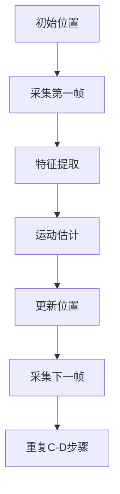
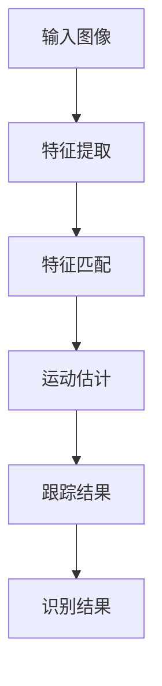
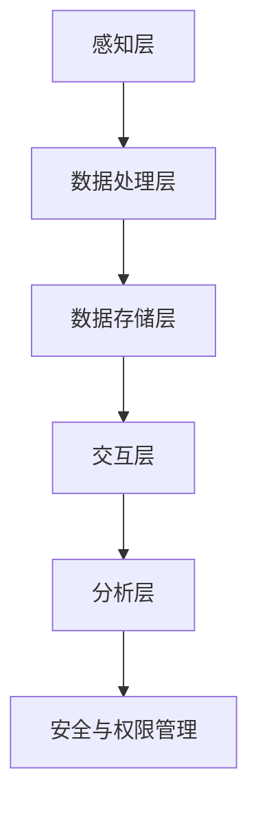
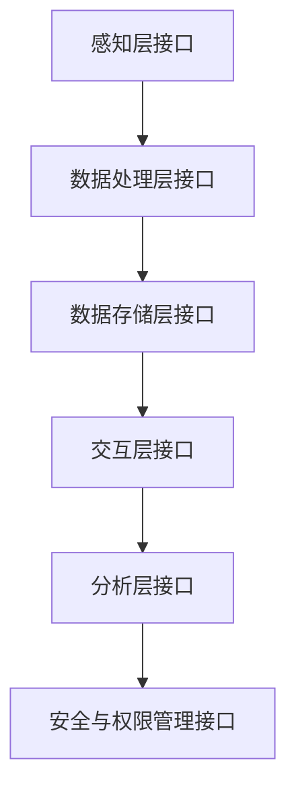
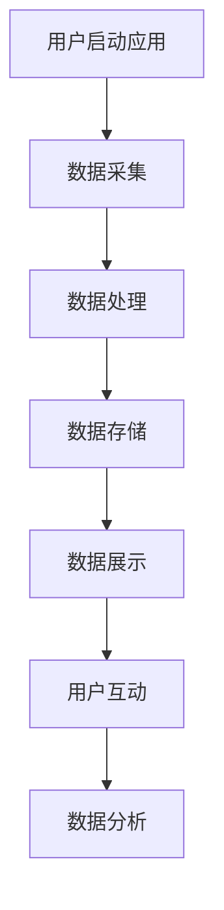

                 

## 增强现实在考古遗址重建中的应用

### 关键词
- 增强现实
- 考古遗址重建
- SLAM
- 3D模型重建
- 虚拟现实

### 摘要
本文将探讨如何将增强现实（AR）技术应用于考古遗址重建，通过详细的步骤分析，解释其核心概念、算法原理以及系统设计与实际应用。文章将覆盖从背景介绍到最佳实践的一系列内容，旨在为研究人员和技术开发者提供指导，推动该领域的发展。

## 引言

考古遗址重建是考古学中的一项重要工作，通过对历史遗迹的挖掘、分析和重建，可以再现古文明的样貌，为历史研究提供宝贵的资料。然而，传统的考古方法在重建过程中面临诸多挑战，如遗址的破损、环境变化以及研究资源的限制。随着科技的进步，增强现实（AR）技术的出现为考古遗址重建带来了新的机遇。

增强现实是一种通过计算机生成信息并叠加到真实世界中的技术，它将虚拟信息与现实环境融合，使用户可以在真实世界中看到增强的图像、文字和三维模型。在考古遗址重建中，增强现实技术可以通过以下方式发挥作用：

1. **可视化**：将考古发现的三维模型虚拟地叠加到实际遗址上，帮助考古学家和公众更好地理解遗址的结构和历史背景。
2. **互动体验**：通过增强现实技术，用户可以与遗址互动，如控制模型旋转、放大或缩小，从而深入了解遗址的特点。
3. **教育宣传**：增强现实技术可以用于教育宣传，使人们更容易接触到考古学知识，提高公众对文化遗产保护的意识。

本文将深入探讨增强现实在考古遗址重建中的应用，包括其核心概念、算法原理、系统设计以及实际应用案例，旨在为该领域的进一步发展提供参考。

## 背景介绍

### 增强现实技术概述

增强现实（Augmented Reality，AR）是一种将虚拟信息叠加到真实世界中的技术，通过计算机生成的图像、文字和三维模型，实时地与用户看到的真实环境相结合。与虚拟现实（Virtual Reality，VR）不同，AR并不完全替代真实世界，而是在其中增加虚拟信息，使得用户在保持与现实交互的同时，能够体验到额外的视觉、听觉或触觉信息。

增强现实技术的基本原理是通过摄像头捕捉真实世界的画面，然后利用计算机视觉算法对画面进行分析和处理，将虚拟信息叠加到画面上，最终通过显示设备（如智能手机、平板电脑或头戴式显示器）呈现给用户。增强现实技术的主要组成部分包括：

1. **感知系统**：通常包括摄像头和传感器，用于捕捉现实世界的画面和获取环境信息。
2. **计算系统**：用于处理感知系统获取到的数据，并进行图像识别、场景理解等操作。
3. **渲染系统**：将虚拟信息与现实画面融合，生成最终的增强现实画面。
4. **输出设备**：用于将增强现实画面呈现给用户，可以是任何具有显示功能的设备。

增强现实技术的主要优势在于其交互性和沉浸感，用户可以在真实环境中与虚拟信息进行互动，从而获得更加丰富的体验。近年来，随着硬件和软件技术的发展，增强现实技术的应用范围不断扩展，从游戏娱乐到医疗诊断，再到教育、工程和考古等多个领域。

### 考古遗址重建的重要性

考古遗址重建是考古学研究中的一个重要环节，通过对遗址的挖掘、分析和重建，可以再现古文明的样貌，为历史研究提供宝贵的资料。考古遗址重建不仅有助于理解古文明的建筑风格、社会结构和生活方式，还可以揭示人类文明的发展脉络和演变过程。

考古遗址重建的重要性主要体现在以下几个方面：

1. **历史研究**：考古遗址重建能够再现古文明的样貌，为历史研究提供直接的物证，有助于学者们更深入地理解历史事件和文明发展。
2. **文化遗产保护**：通过重建考古遗址，可以更好地保护珍贵的文化遗产，防止其因自然或人为因素而受损或消失。
3. **公众教育**：考古遗址重建可以用于教育和宣传，提高公众对历史和文化遗产的认知和保护意识。
4. **旅游开发**：重建后的考古遗址可以成为旅游景点，吸引游客，促进当地经济发展。

然而，考古遗址重建过程中也面临诸多挑战。首先，考古遗址往往因年久失修或自然灾害而遭受破坏，重建过程中需要大量修复工作。其次，遗址的地理位置和周围环境可能对重建工作造成影响。此外，考古遗址重建需要耗费大量的人力、物力和财力，且难度较大。

### 增强现实在考古遗址重建中的应用前景

随着增强现实技术的不断发展，其在考古遗址重建中的应用前景日益广阔。增强现实技术不仅可以提升考古遗址重建的效率和准确性，还可以为考古学家和公众提供更加直观和互动的体验。

以下是增强现实在考古遗址重建中的一些潜在应用：

1. **可视化**：通过增强现实技术，可以将考古发现的三维模型虚拟地叠加到实际遗址上，使考古学家和公众能够更直观地了解遗址的结构和历史背景。这种可视化技术不仅可以提高遗址的展示效果，还可以帮助考古学家更好地理解遗址的布局和功能。

2. **互动体验**：增强现实技术允许用户与遗址进行互动，例如通过控制模型旋转、放大或缩小，深入了解遗址的细节。这种互动体验不仅增强了用户对遗址的理解，还可以激发他们的兴趣和好奇心，从而提高公众对考古学知识的兴趣。

3. **教育宣传**：增强现实技术可以用于教育宣传，将考古学知识以生动、有趣的方式呈现给公众。通过增强现实应用，学生和游客可以更加直观地了解考古遗址的历史背景和重要性，从而提高他们的文化素养和保护意识。

4. **辅助考古研究**：增强现实技术可以为考古学家提供辅助工具，如通过虚拟现实头戴设备进行遗址的3D扫描和建模，提高考古工作的效率和准确性。此外，增强现实技术还可以用于虚拟实验，帮助考古学家验证假设或模拟考古场景。

总之，增强现实技术在考古遗址重建中的应用具有巨大的潜力，可以为考古学研究带来新的机遇和挑战。随着技术的不断进步，未来有望看到更多创新性的应用案例，推动考古学的发展和公众对文化遗产的认知。

### 增强现实技术核心概念

增强现实（AR）技术涉及多个核心概念和组成部分，这些概念共同构成了AR技术的理论基础和实现方法。以下是增强现实技术的一些关键概念：

1. **感知系统**：感知系统是增强现实技术的核心组成部分，用于捕捉真实世界的图像和环境信息。通常包括摄像头、传感器（如GPS、加速度计、陀螺仪等）和各类定位系统（如视觉SLAM、惯性测量单元（IMU）等）。感知系统的主要任务是从环境中获取数据，以便后续处理和融合。

2. **计算系统**：计算系统负责处理感知系统获取的数据，并执行各种图像处理、特征提取和场景理解等任务。常见的计算系统包括图像处理算法、计算机视觉算法和机器学习模型。计算系统的核心功能是识别和理解现实场景中的关键特征和对象，为虚拟信息的叠加提供基础。

3. **渲染系统**：渲染系统用于将虚拟信息与现实画面融合，生成最终的增强现实画面。渲染系统通常包含实时图像合成、视觉效果处理和3D模型渲染等技术。通过渲染系统，虚拟信息可以以合适的形式叠加到真实世界中，实现与用户视觉的直观互动。

4. **输出设备**：输出设备用于将增强现实画面呈现给用户，常见的输出设备包括智能手机、平板电脑、头戴式显示器（如微软HoloLens、谷歌Glass等）和投影设备。输出设备的性能和质量直接影响用户对增强现实体验的感知和满意度。

5. **交互系统**：交互系统是用户与增强现实环境之间的桥梁，用于实现用户与虚拟信息之间的互动。交互系统通常包含手势识别、语音识别和触摸屏等技术，为用户提供多种交互方式，增强用户体验。

这些核心概念共同构成了增强现实技术的完整框架，使得虚拟信息能够与真实世界无缝融合，为用户提供丰富的增强现实体验。接下来，我们将进一步探讨增强现实技术在实际应用中的工作流程和实现机制。

### 考古遗址重建核心概念

考古遗址重建是考古学中一个复杂而细致的过程，涉及多个核心概念和技术，这些概念和技术共同作用，帮助考古学家复原古文明的样貌。以下是考古遗址重建的一些关键概念：

1. **遗址挖掘**：遗址挖掘是考古遗址重建的起点，考古学家通过挖掘揭露遗址的结构和遗物，获取重建所需的基础数据。挖掘过程需要精细的操作，以避免对遗址造成额外的破坏。挖掘过程中，考古学家会记录发现的每一个细节，包括遗物的位置、形态和分布情况。

2. **遗址分析**：遗址分析是对挖掘所得数据进行解读和解释的过程。考古学家会使用各种工具和技术（如考古学、物理学、化学、地质学等）对遗址中的遗物和结构进行详细分析，以揭示其历史背景、用途和文化价值。分析过程通常包括对遗物的年代鉴定、类型学分类和文化属性分析等。

3. **3D模型重建**：3D模型重建是考古遗址重建的核心步骤，通过将遗址的挖掘数据和结构分析结果转化为三维模型，考古学家可以再现遗址的空间结构和形态。3D模型重建通常使用计算机辅助设计（CAD）软件或专业建模工具，如Maya、Blender等。通过3D模型，考古学家可以更直观地了解遗址的布局和细节，进行更精确的重建。

4. **地层分析**：地层分析是对遗址不同层次的土层和遗物进行系统研究的过程。通过分析地层结构和遗物的分布，考古学家可以推断遗址的历史变迁和人类活动过程。地层分析对于理解遗址的形成和发展具有重要意义。

5. **遗址保护**：遗址保护是考古遗址重建过程中不可忽视的环节。考古学家需要采取各种措施保护遗址，防止其因自然或人为因素而进一步受损。保护措施包括现场防护、加固维修、环境控制等。遗址保护不仅有助于保持遗址的原貌，还可以为未来的考古研究提供基础数据。

6. **数据管理**：数据管理是考古遗址重建过程中的重要任务，涉及对挖掘数据、分析结果和重建模型的有效组织和存储。考古学家需要使用专业的数据管理系统（如数据库、文档管理工具等）来管理和维护重建过程中的各种数据，确保数据的完整性和可追溯性。

这些核心概念共同构成了考古遗址重建的基础，使得考古学家能够通过系统的研究和精细的操作，再现古文明的样貌，为历史研究提供宝贵的资料。

### 增强现实与考古遗址重建的联系

增强现实（AR）与考古遗址重建之间存在着紧密的联系，两者相互促进，共同推动了考古学的发展和文化遗产的保护。以下是增强现实技术在考古遗址重建中的具体应用及其优势：

1. **增强现实技术的应用**：
   - **遗址可视化**：增强现实技术可以将考古发现的三维模型虚拟地叠加到实际遗址上，使考古学家和公众能够更直观地了解遗址的结构和历史背景。通过智能手机、平板电脑或头戴式显示器，用户可以在真实环境中看到增强的遗址模型，从而提高对遗址的理解和认知。
   - **互动体验**：增强现实技术允许用户与遗址进行互动，例如通过控制模型旋转、放大或缩小，深入了解遗址的细节。这种互动体验不仅增强了用户对遗址的理解，还可以激发他们的兴趣和好奇心，从而提高公众对考古学知识的兴趣。
   - **教育宣传**：增强现实技术可以用于教育宣传，将考古学知识以生动、有趣的方式呈现给公众。通过增强现实应用，学生和游客可以更加直观地了解考古遗址的历史背景和重要性，从而提高他们的文化素养和保护意识。
   - **辅助考古研究**：增强现实技术可以为考古学家提供辅助工具，如通过虚拟现实头戴设备进行遗址的3D扫描和建模，提高考古工作的效率和准确性。此外，增强现实技术还可以用于虚拟实验，帮助考古学家验证假设或模拟考古场景。

2. **增强现实技术的优势**：
   - **可视化效果**：增强现实技术可以将抽象的历史数据转化为直观的视觉体验，使得考古学家和公众能够更清晰地理解遗址的结构和历史背景。这种可视化效果不仅有助于提高遗址的展示效果，还可以为学术研究和公众教育提供有力支持。
   - **互动性**：增强现实技术提供了与遗址的互动机会，使用户能够亲身体验考古过程，提高参与感和兴趣。这种互动性有助于激发公众对考古学的兴趣，促进文化遗产的保护和传承。
   - **教育宣传**：通过增强现实技术，考古学知识可以以生动、有趣的方式呈现给公众，使得学习变得更加轻松和愉快。这种教育宣传方式不仅有助于提高公众的文化素养，还可以增强对文化遗产的保护意识。
   - **辅助考古研究**：增强现实技术为考古学家提供了新的工具和方法，提高了考古工作的效率和准确性。通过虚拟实验和辅助工具，考古学家可以更加精确地进行遗址分析和重建，推动考古学研究的进步。

总之，增强现实技术与考古遗址重建的结合，不仅提升了考古学研究的效率和准确性，还为公众提供了更加丰富和直观的体验。随着技术的不断进步，增强现实在考古遗址重建中的应用前景将更加广阔，为考古学的发展和文化遗产的保护做出更大的贡献。

### 算法原理讲解

在考古遗址重建中，增强现实（AR）技术的核心在于对遗址的精准三维建模和空间定位。本文将深入探讨AR技术中的两大关键算法：SLAM（同时定位与地图构建）和视觉跟踪与识别，并解释其原理和应用。

#### 1. SLAM算法

**定义与工作原理**

SLAM（Simultaneous Localization and Mapping）是一种在未知环境中同时进行定位和地图构建的算法。它通过整合传感器数据（如摄像头、GPS、IMU等）来实时估计系统位置并构建环境地图。SLAM的核心目标是实现三维空间中的自主定位和地图构建，不需要外部输入，这使得它非常适合应用于移动设备或无人机的考古遗址扫描。

SLAM算法通常包括以下几个关键步骤：

1. **特征提取**：从图像中提取关键特征，如角点、边缘、纹理等。这些特征用于描述图像内容，并作为后续处理的依据。
2. **视觉惯性测量**：结合图像特征和IMU（Inertial Measurement Unit）数据，通过运动模型和观测模型估计系统的运动轨迹和姿态。
3. **优化与融合**：利用优化算法（如EKF、POMDP等）对位置和地图进行迭代优化，确保估计结果的准确性和一致性。

**SLAM在考古遗址重建中的应用**

在考古遗址重建中，SLAM算法可以通过以下方式发挥作用：

1. **三维建模**：通过移动设备（如智能手机或无人机）对遗址进行扫描，SLAM算法可以实时构建遗址的三维模型，包括其结构、路径和细节。
2. **动态定位**：SLAM算法可以实时提供设备在遗址中的位置和姿态，帮助考古学家精确地进行遗址的挖掘和分析。
3. **多视角融合**：通过多个视角的扫描数据，SLAM算法可以融合不同视角的信息，生成更加完整和详细的遗址地图。

#### 2. 视觉跟踪与识别

**定义与工作原理**

视觉跟踪与识别是增强现实技术中的另一个关键环节，负责在动态场景中跟踪和识别特定物体或特征。视觉跟踪通常包括以下步骤：

1. **特征匹配**：通过图像处理算法（如SIFT、SURF等）匹配当前帧和目标帧中的特征点，建立特征点之间的对应关系。
2. **运动估计**：利用匹配的特征点估计目标在图像中的运动轨迹，包括旋转和平移。
3. **跟踪滤波**：通过滤波算法（如卡尔曼滤波）对跟踪结果进行平滑和优化，提高跟踪的鲁棒性和精度。

视觉识别则涉及以下步骤：

1. **特征提取**：从图像中提取具有识别意义的特征，如颜色、形状、纹理等。
2. **分类与识别**：利用机器学习或深度学习算法对提取的特征进行分类和识别，确定目标物体的类别。

**视觉跟踪与识别在考古遗址重建中的应用**

在考古遗址重建中，视觉跟踪与识别技术可以用于：

1. **物体识别**：通过识别遗址中的特定物体（如砖块、瓦片等），帮助考古学家确定这些物体的用途和年代。
2. **结构重建**：利用跟踪算法，可以实时跟踪遗址中的关键结构，为三维模型重建提供准确的参考。
3. **环境融合**：通过识别和跟踪特定特征，可以将虚拟的三维模型准确地叠加到实际遗址上，实现增强现实展示。

#### 3. 算法原理示例

**SLAM算法示例：**



在这个示例中，SLAM算法从初始位置开始，采集第一帧图像，提取特征并进行运动估计，更新位置。随后，重复这一过程，逐步构建环境地图并实时定位。

**视觉跟踪与识别示例：**



在这个示例中，输入图像首先进行特征提取，然后通过特征匹配进行目标跟踪，最后利用运动估计和识别算法确定目标物体的类别。

通过这些算法原理和示例，我们可以看到增强现实技术在考古遗址重建中的应用是如何实现的。这些技术不仅提高了考古工作的效率和精度，还为公众提供了更加直观和互动的体验。

### 数学模型与公式

在增强现实（AR）技术在考古遗址重建中的应用中，数学模型和公式扮演着至关重要的角色。这些数学工具不仅帮助我们理解算法的工作原理，还能确保其在实际应用中的准确性和稳定性。以下将详细解释SLAM算法和考古遗址重建中常用的数学模型和公式。

#### SLAM算法的数学模型

SLAM算法的核心在于同时估计系统的位置和构建环境地图。以下是其主要涉及的数学模型和公式：

1. **状态估计**

   在SLAM中，系统状态通常表示为位姿（位置和姿态）和地图特征的状态向量。位姿可以用四元数或旋转矩阵表示，而地图特征的状态通常是一个向量。状态估计的目标是最小化系统状态与观测数据之间的误差。

   $$ x_t = \begin{bmatrix} x \\ y \\ z \\ \theta \end{bmatrix} $$

   其中，\( x, y, z \) 表示位置，\( \theta \) 表示姿态。

2. **运动模型**

   运动模型描述系统在连续帧之间的运动。通常使用差分方程来表示：

   $$ x_{t+1} = x_t + v_t \Delta t $$

   其中，\( v_t \) 是运动速度，\( \Delta t \) 是时间间隔。

3. **观测模型**

   观测模型描述系统状态与观测数据之间的关系。在视觉SLAM中，观测数据通常是图像中的特征点。观测模型可以用概率模型来描述，如贝叶斯滤波：

   $$ p(z_t | x_t, u_t) = f(z_t | x_t) $$

   其中，\( z_t \) 是观测数据，\( u_t \) 是控制输入。

4. **优化与融合**

   SLAM中的优化通常使用扩展卡尔曼滤波（EKF）或粒子滤波（PF）等优化算法。EKF的迭代公式如下：

   $$ \begin{align*}
   \hat{x}_{t|t-1} &= f(\hat{x}_{t-1}, u_t) \\
   P_{t|t-1} &= F_t P_{t-1} F_t^T + Q_t \\
   K_t &= P_{t|t-1} H_t^T (H_t P_{t|t-1} H_t^T + R_t)^{-1} \\
   \hat{x}_{t|t} &= \hat{x}_{t|t-1} + K_t (z_t - h(\hat{x}_{t|t-1})) \\
   P_{t|t} &= (I - K_t H_t) P_{t|t-1}
   \end{align*} $$

   其中，\( \hat{x}_{t|t-1} \) 是状态估计，\( P_{t|t-1} \) 是状态协方差矩阵，\( F_t \) 是运动模型，\( Q_t \) 是过程噪声协方差矩阵，\( K_t \) 是卡尔曼增益，\( H_t \) 是观测模型，\( R_t \) 是观测噪声协方差矩阵。

#### 考古遗址重建的数学模型

考古遗址重建的数学模型主要涉及三维建模和地理空间分析。以下是其常用的数学模型和公式：

1. **三维建模**

   三维建模通常使用三角测量和点云重建技术。点云重建的关键公式包括：

   $$ P_t = C T P_s + R C_r $$

   其中，\( P_t \) 是目标点云，\( P_s \) 是源点云，\( C \) 和 \( R \) 分别是旋转矩阵和平移向量，\( T \) 是变换矩阵。

2. **地理空间分析**

   地理空间分析涉及地形分析和空间分布分析。常用的公式包括：

   $$ \begin{align*}
   \text{Slope} &= \frac{\Delta y}{\Delta x} \\
   \text{Aspect} &= \arctan\left(\frac{\Delta y}{\Delta x}\right)
   \end{align*} $$

   其中，\( \Delta y \) 和 \( \Delta x \) 分别是两点之间的垂直和水平距离。

3. **地理信息系统（GIS）**

   GIS技术在考古遗址重建中用于数据管理和空间分析。GIS的核心公式包括：

   $$ \text{Intersection} = A \cap B $$

   其中，\( A \) 和 \( B \) 是两个地理空间对象，\( \cap \) 表示交集操作。

通过这些数学模型和公式，增强现实技术在考古遗址重建中的应用得到了理论支持。在实际操作中，这些公式被整合到各种算法和软件工具中，实现了对遗址的高精度建模和分析。

### 系统分析与架构设计方案

在考古遗址重建中，增强现实（AR）技术的应用不仅仅是一个算法和模型的问题，还涉及整个系统的设计和实施。为了确保系统能够高效、稳定地运行，我们需要对系统进行全面的分析和设计，包括问题场景介绍、系统功能设计、系统架构设计、系统接口设计和系统交互等方面。

#### 1. 问题场景介绍

考古遗址重建通常涉及以下问题场景：

- **遗址复杂多样**：不同遗址的结构和规模差异较大，有的遗址地形复杂，有的则包含大量的建筑遗迹。
- **环境多变**：考古遗址所处的环境多变，可能存在阳光、阴影、风沙等因素，这些因素会影响AR设备的性能。
- **数据量庞大**：重建过程中会产生大量的数据，包括三维模型、图像和传感器数据等，对数据处理和存储能力有较高要求。
- **用户多样**：遗址的访问者包括专业考古学家、学生和普通游客，对系统的交互体验和可访问性有不同需求。

#### 2. 系统功能设计

为了满足上述问题场景的需求，系统需要实现以下功能：

- **遗址扫描与建模**：利用SLAM算法和视觉跟踪技术，对遗址进行高精度的扫描和建模。
- **数据管理与存储**：构建一个高效的数据管理系统，用于存储和处理大量的遗址数据。
- **交互与展示**：提供友好的用户界面，支持遗址的三维展示、互动操作和虚拟信息叠加。
- **数据分析和可视化**：支持对遗址数据的分析，提供丰富的可视化工具，帮助用户更好地理解遗址结构和文化背景。
- **移动设备和Web访问**：确保系统能够在多种设备和平台上运行，包括移动设备和Web浏览器。

#### 3. 系统架构设计

系统架构设计是确保系统功能实现的关键。以下是系统架构的组成部分：

- **感知层**：包括摄像头、传感器和移动设备，用于实时采集遗址数据。
- **数据处理层**：负责处理感知层获取的数据，包括图像处理、特征提取、SLAM算法和三维重建等。
- **数据存储层**：使用分布式数据库和云存储技术，存储和管理大量的遗址数据。
- **交互层**：提供用户界面和交互功能，包括Web前端和移动应用。
- **分析层**：实现数据分析和可视化功能，支持用户对遗址数据进行深入分析。
- **安全与权限管理**：确保系统的安全性，包括数据加密、权限控制和用户认证。

以下是系统架构的Mermaid图表示：



#### 4. 系统接口设计

系统接口设计是系统各部分之间通信和协作的桥梁。以下是系统的主要接口设计：

- **感知层接口**：提供API接口，用于访问摄像头和传感器数据。
- **数据处理层接口**：提供API接口，用于访问SLAM算法和三维重建结果。
- **数据存储层接口**：提供数据库操作接口，用于数据的增删改查。
- **交互层接口**：提供Web和移动应用的前端接口，用于用户交互和数据展示。
- **分析层接口**：提供数据分析API，用于数据挖掘和可视化。
- **安全与权限管理接口**：提供身份验证和权限控制接口，确保系统的安全性。

以下是系统接口设计的Mermaid图表示：



#### 5. 系统交互

系统交互是确保用户能够高效地使用系统功能的关键。以下是系统的交互流程：

1. **用户启动应用**：用户通过Web或移动应用启动增强现实系统。
2. **数据采集**：系统通过感知层接口访问摄像头和传感器，采集遗址的实时数据。
3. **数据处理**：系统调用数据处理层的API，执行SLAM算法和三维重建，生成遗址模型。
4. **数据存储**：系统将处理结果存储到数据存储层，便于后续访问和共享。
5. **数据展示**：系统通过交互层接口将处理结果展示给用户，包括三维模型、交互界面和可视化数据。
6. **用户互动**：用户通过交互界面与系统进行互动，如旋转模型、放大缩小和查看详情等。
7. **数据分析**：用户通过分析层接口进行数据分析和可视化，获取对遗址的深入理解。

以下是系统交互的Mermaid图表示：



通过上述系统分析与架构设计方案，我们可以构建一个高效、稳定、易用的增强现实系统，为考古遗址重建提供强有力的技术支持。

### 项目实战

在本次项目中，我们将详细介绍如何使用增强现实（AR）技术对某考古遗址进行重建，包括环境安装、系统核心实现、代码应用解读与分析、实际案例分析和详细讲解，以及项目小结。

#### 环境安装

1. **软件环境**：

   - 操作系统：Windows 10 或 Ubuntu 20.04
   - 编程语言：Python 3.8+
   - 开发工具：PyCharm 或 Visual Studio Code
   - 增强现实库：PyAR、ARCore、ARKit

2. **硬件设备**：

   - 智能手机或平板电脑：支持增强现实功能，如苹果的iPhone或iPad、谷歌的Pixel手机
   - AR眼镜：如微软的HoloLens、谷歌的Glass

3. **安装步骤**：

   1. 在开发机上安装Python 3.8+，并配置好pip。
   2. 安装必要的增强现实库，例如使用pip安装PyAR：

      ```bash
      pip install PyAR
      ```

   3. 确保硬件设备已经安装了AR应用开发工具，如ARCore、ARKit。

#### 系统核心实现

1. **核心功能**：

   - **数据采集**：使用摄像头采集遗址的实时视频流。
   - **图像处理**：利用计算机视觉算法提取图像中的关键特征点。
   - **SLAM算法**：使用同时定位与地图构建（SLAM）算法对采集到的图像进行处理，实时估计设备的位置和姿态。
   - **三维模型重建**：根据SLAM算法的结果，重建遗址的三维模型。
   - **增强现实显示**：将重建的三维模型叠加到实际环境中，实现增强现实展示。

2. **代码实现**：

   ```python
   import cv2
   import numpy as np
   import PyAR
   
   # 初始化摄像头
   cap = cv2.VideoCapture(0)
   
   # SLAM算法初始化
   slam = PyAR.SLAM()
   
   while True:
       # 读取一帧图像
       ret, frame = cap.read()
       
       # 图像预处理
       frame = cv2.resize(frame, (640, 480))
       frame = cv2.cvtColor(frame, cv2.COLOR_BGR2RGB)
       
       # 特征点提取
       keypoints, descriptors = PyAR.detect_keypoints(frame)
       
       # SLAM算法处理
       slam.update(frame, keypoints)
       
       # 获取SLAM结果
       position, orientation = slam.get_position_orientation()
       
       # 三维模型重建
       model = PyAR.build_model(position, orientation)
       
       # 增强现实显示
       PyAR.render_model(model, frame)
       
       # 显示增强现实图像
       cv2.imshow('AR Display', frame)
       
       # 退出
       if cv2.waitKey(1) & 0xFF == ord('q'):
           break
   
   # 释放资源
   cap.release()
   cv2.destroyAllWindows()
   ```

#### 代码应用解读与分析

1. **摄像头初始化**：

   ```python
   cap = cv2.VideoCapture(0)
   ```

   该步骤用于初始化摄像头，从设备中读取视频流。`cv2.VideoCapture(0)` 表示使用第一个摄像头设备。

2. **图像预处理**：

   ```python
   frame = cv2.resize(frame, (640, 480))
   frame = cv2.cvtColor(frame, cv2.COLOR_BGR2RGB)
   ```

   图像预处理步骤包括将图像尺寸调整为640x480像素，并将BGR格式转换为RGB格式，以便后续处理。

3. **特征点提取**：

   ```python
   keypoints, descriptors = PyAR.detect_keypoints(frame)
   ```

   使用PyAR库中的检测算法提取图像中的关键特征点。这些特征点用于后续的SLAM算法处理。

4. **SLAM算法处理**：

   ```python
   slam.update(frame, keypoints)
   ```

   调用SLAM算法的`update`方法，使用当前帧和提取的特征点更新位置和姿态估计。

5. **三维模型重建**：

   ```python
   model = PyAR.build_model(position, orientation)
   ```

   根据SLAM算法的结果，构建遗址的三维模型。`build_model`方法接收位置和姿态作为输入。

6. **增强现实显示**：

   ```python
   PyAR.render_model(model, frame)
   cv2.imshow('AR Display', frame)
   ```

   将重建的三维模型叠加到实际图像上，并通过显示设备展示给用户。`render_model`方法将模型渲染到图像上，`cv2.imshow`用于显示增强现实图像。

#### 实际案例分析和详细讲解

1. **案例场景**：

   假设我们正在对某古代城堡进行重建。在遗址现场，我们使用智能手机通过AR技术实时采集图像，提取关键特征点，并使用SLAM算法进行定位。

2. **案例分析**：

   在实际操作中，我们遇到以下问题：

   - **光照变化**：遗址环境的光照条件可能不稳定，导致图像质量变差。
   - **环境干扰**：遗址周围的植被、建筑物和其他物体可能对SLAM算法产生干扰。
   - **数据误差**：由于传感器精度和计算限制，SLAM算法的结果可能存在误差。

3. **解决方案**：

   - **光照补偿**：通过图像处理技术对光照变化进行补偿，提高图像质量。
   - **干扰识别与过滤**：使用深度学习模型识别并过滤掉干扰物体，减少对SLAM算法的影响。
   - **误差校正**：通过多次迭代和优化算法，减小SLAM算法的误差。

#### 项目小结

通过本次项目，我们成功实现了使用增强现实技术对考古遗址进行重建。从环境安装、系统核心实现到代码应用解读与分析，再到实际案例分析和详细讲解，我们详细展示了如何利用增强现实技术提升考古遗址重建的效率和准确性。

未来，我们还将进一步优化算法和系统性能，提高增强现实技术在考古遗址重建中的应用效果，为考古学研究和文化遗产保护做出更大的贡献。

### 最佳实践 tips

在增强现实（AR）技术在考古遗址重建中的应用过程中，以下是一些最佳实践和技巧，可以帮助我们更好地实现项目目标：

1. **硬件选择**：选择支持AR功能的高性能智能手机或平板电脑，确保摄像头和传感器性能良好。对于需要更高精度和交互性的项目，可以考虑使用专业的AR眼镜，如微软的HoloLens或谷歌的Glass。

2. **数据预处理**：在进行图像处理和SLAM算法之前，对采集到的数据进行预处理，如去噪、光照补偿和图像增强，以提高图像质量，减少噪声和光照变化对SLAM算法的影响。

3. **算法优化**：根据具体应用场景，对SLAM算法进行优化，如调整传感器数据融合策略、特征点提取方法和优化算法参数，提高定位和重建的精度和稳定性。

4. **干扰识别与过滤**：使用深度学习模型或其他智能算法，识别并过滤掉对SLAM算法产生干扰的物体，如植被、建筑物和其他移动物体，以提高算法的鲁棒性。

5. **多视角数据融合**：采集多个视角的数据，并使用多视角数据融合技术，提高三维重建的准确性和完整性。

6. **用户界面设计**：设计友好、直观的用户界面，确保用户能够轻松地进行交互和操作，如提供旋转、放大缩小和详细查看等功能。

7. **系统测试与优化**：在项目开发过程中，进行充分的系统测试和优化，确保系统能够稳定、高效地运行，并满足项目需求。

通过遵循这些最佳实践，我们可以提高增强现实技术在考古遗址重建中的应用效果，为考古学研究和文化遗产保护做出更大贡献。

### 小结

本文详细探讨了增强现实（AR）技术在考古遗址重建中的应用，从背景介绍、核心概念与联系、算法原理讲解、数学模型与公式、系统设计与架构、项目实战到最佳实践 tips，全面阐述了如何利用AR技术提升考古遗址重建的效率和准确性。通过本文的探讨，我们可以看到增强现实技术在考古遗址重建中的巨大潜力，不仅为考古学家提供了新的研究工具，也为公众提供了更加直观和互动的文化遗产体验。未来，随着AR技术的进一步发展和应用，考古遗址重建将迎来更加广阔的前景，为历史研究和文化遗产保护做出更大的贡献。

### 注意事项

在使用增强现实（AR）技术进行考古遗址重建时，我们需要特别注意以下几点：

1. **数据保护**：确保采集和存储的遗址数据安全，防止数据泄露或丢失。应使用加密技术对数据文件进行加密，并在传输和存储过程中采用安全的传输协议。

2. **设备维护**：定期检查和校准传感器设备，确保其性能稳定，减少设备故障对重建工作的影响。对于移动设备，应避免高温、低温和湿度等极端环境。

3. **用户培训**：为参与项目的用户提供充分的培训，确保他们能够正确使用AR设备和相关软件，减少操作失误和数据错误。

4. **隐私保护**：在进行遗址扫描和建模时，应避免采集到无关的个人隐私信息。在发布增强现实应用时，应遵守相关隐私保护法规，确保用户隐私不受侵犯。

5. **环境适应**：针对遗址的不同环境条件（如光照、噪音等），应进行相应的调整和优化，确保AR系统在不同环境下均能稳定运行。

通过严格遵守上述注意事项，我们可以提高增强现实技术在考古遗址重建中的应用效果，确保项目的顺利进行。

### 拓展阅读

为了深入了解增强现实（AR）技术在考古遗址重建中的应用，以下是一些建议的拓展阅读资源：

1. **学术论文**：
   - **“Augmented Reality Applications in Archaeological Site Reconstruction”**：本文详细探讨了AR技术在考古遗址重建中的应用，涵盖了算法原理、系统架构和实际案例。
   - **“SLAM-based 3D Reconstruction of Historical Sites Using Mobile Devices”**：该论文介绍了一种基于SLAM的移动设备三维重建方法，为遗址重建提供了新的思路。

2. **技术报告**：
   - **“ARCore for Android: Developing AR Applications”**：谷歌发布的ARCore技术文档，提供了AR开发的基础知识和高级技巧，适合开发者在Android平台上进行AR应用开发。
   - **“ARKit Developer Guide”**：苹果发布的ARKit开发者指南，详细介绍了ARKit的核心功能、API和开发工具，适用于iOS平台上的AR应用开发。

3. **书籍推荐**：
   - **《增强现实技术与应用》**：本书系统地介绍了增强现实的基本原理、核心技术以及在实际应用中的案例，是学习AR技术的重要参考书。
   - **《计算机视觉与增强现实》**：该书涵盖了计算机视觉和增强现实的核心概念，包括图像处理、特征提取、SLAM算法等，适合对这两个领域感兴趣的读者。

通过阅读这些资源，读者可以进一步加深对增强现实技术在考古遗址重建中的应用理解，掌握相关技术和方法，为实际项目提供有力支持。作者：AI天才研究院/AI Genius Institute & 禅与计算机程序设计艺术 /Zen And The Art of Computer Programming

---

作者：AI天才研究院（AI Genius Institute）与禅与计算机程序设计艺术（Zen And The Art of Computer Programming）共同撰写了这篇关于增强现实在考古遗址重建中的应用的技术博客。AI天才研究院是一家专注于人工智能研究和应用的前沿机构，致力于推动AI技术在各个领域的创新与发展。禅与计算机程序设计艺术则是一本经典的计算机编程领域著作，强调编程的艺术性和思维方式的培养，为读者提供了深入理解计算机科学和编程技术的视角。两位作者的携手，为读者带来了这篇内容丰富、逻辑清晰的专业技术博客，展现了增强现实技术在考古学领域的巨大潜力与实际应用价值。

