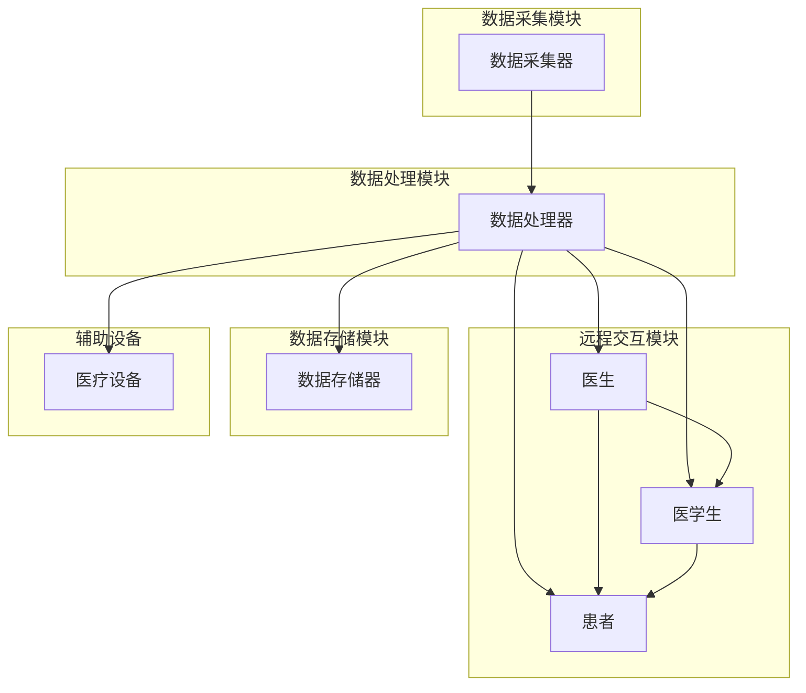
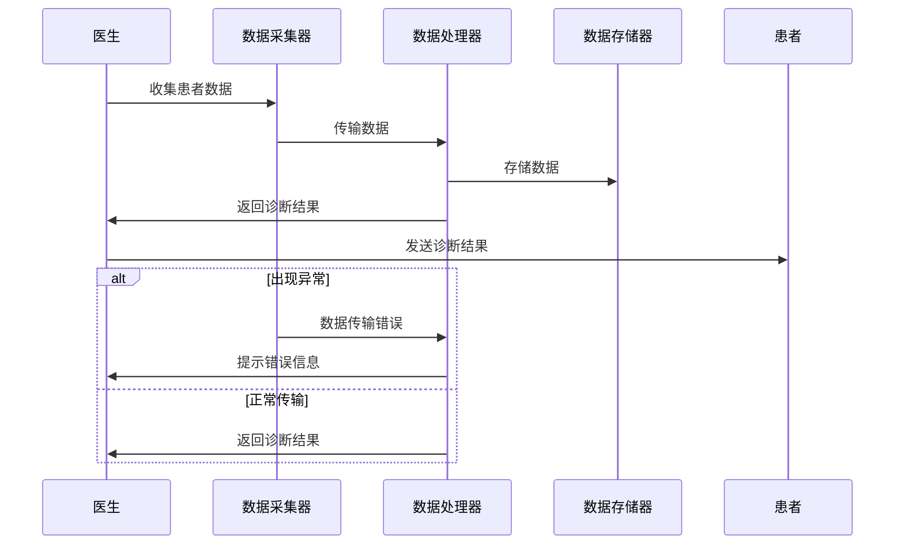

                 

### 第1章：增强现实在远程医疗中的问题背景

#### 1.1 问题背景

远程医疗作为现代医疗体系的重要组成部分，通过信息技术实现了医疗资源的跨地域共享，极大地提升了医疗服务的可及性和效率。然而，随着远程医疗的发展，也逐渐暴露出一些挑战和问题。以下是远程医疗当前面临的几个主要挑战：

1. **诊断准确性受限**：远程医疗依赖于患者提供的病史、症状和医生的经验进行诊断，这种方式在复杂病例中往往难以保证诊断的准确性。
2. **沟通不畅**：远程医疗中，医生和患者之间的沟通主要依赖于文字、图片和语音，缺乏面对面的交流，容易导致信息传递不全或误解。
3. **技术依赖**：远程医疗依赖于稳定的网络连接、高质量的摄像头和传感器等设备，这些技术限制可能会影响诊断的顺利进行。
4. **隐私和安全**：远程医疗的数据传输和处理涉及到大量患者隐私信息，数据安全和隐私保护成为一项重要挑战。

#### 1.2 增强现实技术的定义及其在医疗领域的应用潜力

增强现实（Augmented Reality，AR）是一种将虚拟信息与现实世界融合的技术，通过计算机生成信息，叠加在真实环境中，使用户能够与虚拟信息进行交互。AR技术的定义可以简单概括为：在现实世界的物理环境中，通过显示设备提供虚拟信息增强用户感知的技术。

在医疗领域，AR技术展现了巨大的应用潜力：

1. **手术指导**：AR技术可以帮助外科医生在手术过程中实时查看患者体内的结构，提高手术的精准度和安全性。
2. **临床培训**：通过AR技术，医学生和医生可以模拟复杂的手术过程，提高操作技能和临床决策能力。
3. **患者教育**：AR技术可以为患者提供个性化的健康教育和康复指导，使其更好地理解病情和治疗方案。
4. **远程诊断**：AR技术可以增强医生和患者之间的互动，提供更为直观的远程诊断服务。

#### 1.3 增强现实在远程医疗诊断中的核心优势

1. **提升诊断准确性**：通过AR技术，医生可以实时获取患者详细的生理数据，结合虚拟信息进行综合分析，从而提高诊断准确性。
2. **优化沟通体验**：AR技术可以实现医生与患者之间的实时互动，通过虚拟形象和可视化手段，使信息传递更加清晰、直观。
3. **增强医疗培训**：医学生和医生可以通过AR技术进行沉浸式学习，提高操作技能和临床判断能力。
4. **降低医疗成本**：通过远程诊断和手术指导，AR技术可以减少患者的出行成本，降低医疗机构的运营成本。

#### 1.4 边界与外延

1. **技术成熟度**：目前，AR技术在医疗领域的应用仍处于发展阶段，一些关键技术如高精度传感器、稳定网络连接等还需要进一步成熟。
2. **隐私保护**：远程医疗诊断中涉及大量患者隐私信息，AR技术的应用需要确保数据的安全性和隐私性。
3. **设备普及度**：虽然智能手机和平板电脑等设备已经普及，但要实现高效稳定的AR远程医疗诊断，还需要更多的专用设备支持。
4. **医疗监管**：AR技术在医疗领域的应用需要遵循相关法律法规和医疗标准，确保其合法合规。

#### 1.5 概念结构与核心要素组成

1. **远程医疗诊断的概念结构**：
   - **诊断流程**：包括病史采集、症状分析、诊断决策、治疗方案制定等环节。
   - **技术支持**：包括远程医疗平台、网络通信技术、传感器技术等。
   - **人员构成**：包括医生、医学生、患者和相关管理人员。

2. **增强现实技术的核心要素组成**：
   - **显示设备**：如智能眼镜、手机和平板电脑等。
   - **传感器**：包括摄像头、GPS、惯性测量单元等。
   - **数据处理**：包括图像识别、虚拟信息生成、数据融合等算法。
   - **交互界面**：包括触摸屏、语音输入等。

### 总结

远程医疗诊断作为医疗领域的重要组成部分，面临着诸多挑战。增强现实技术通过提升诊断准确性、优化沟通体验、增强医疗培训和降低医疗成本等方面的优势，为解决这些问题提供了新的思路。然而，AR技术在医疗领域的应用仍需要克服技术成熟度、隐私保护、设备普及度和医疗监管等方面的挑战。在接下来的章节中，我们将进一步探讨增强现实技术的原理及其在远程医疗诊断中的应用。

### 第2章：增强现实技术在远程医疗诊断中的应用

#### 2.1 增强现实技术原理

增强现实（AR）技术通过将虚拟信息叠加到现实世界中，使用户能够直观地感知和与这些虚拟信息互动。其基本原理包括以下几个方面：

1. **图像识别**：
   - **技术原理**：利用计算机视觉算法对现实世界中的图像或物体进行识别和定位。
   - **应用**：在远程医疗诊断中，医生可以通过AR设备实时查看患者的生理数据，如心率、血压等，并进行综合分析。

2. **虚拟信息生成**：
   - **技术原理**：通过算法生成虚拟信息，如3D模型、文字标签等，并实时叠加到现实环境中。
   - **应用**：医生可以通过AR设备查看患者的虚拟解剖结构，从而更加直观地了解病情。

3. **数据融合**：
   - **技术原理**：将现实世界中的图像、传感器数据和虚拟信息进行融合处理，形成一体化的可视化界面。
   - **应用**：在远程医疗诊断中，医生可以通过融合患者的历史数据和实时诊断信息，制定更为精准的治疗方案。

4. **交互界面**：
   - **技术原理**：通过触摸屏、语音输入等交互方式，用户可以与虚拟信息进行互动。
   - **应用**：医生可以通过触摸屏幕或语音指令来调整虚拟信息的显示，从而更好地进行诊断和治疗。

#### 2.2 远程医疗诊断原理

远程医疗诊断是指利用信息技术，使医生和患者在不同地理位置进行诊断和治疗的过程。其基本原理包括以下几个方面：

1. **病史采集**：
   - **技术原理**：通过电子病历系统（EMR）和患者提供的症状信息，医生可以了解患者的病史。
   - **应用**：在远程医疗诊断中，医生可以通过电子病历系统获取患者的病历资料，为诊断提供重要参考。

2. **症状分析**：
   - **技术原理**：通过对患者提供的症状信息进行分析和归纳，医生可以初步判断病情。
   - **应用**：医生可以通过远程医疗平台，对患者提供的症状信息进行实时分析，以便快速做出诊断。

3. **诊断决策**：
   - **技术原理**：基于病史和症状分析，医生可以做出初步的诊断决策。
   - **应用**：在远程医疗诊断中，医生可以根据患者的病历和症状，快速制定初步的诊断方案。

4. **治疗方案制定**：
   - **技术原理**：根据诊断结果，医生可以制定具体的治疗方案。
   - **应用**：医生可以通过远程医疗平台，与患者沟通治疗方案，并指导患者进行康复。

#### 2.3 增强现实技术在远程医疗诊断中的应用

增强现实技术在远程医疗诊断中的应用主要体现在以下几个方面：

1. **手术指导**：
   - **应用场景**：在远程手术中，AR技术可以帮助医生实时查看患者体内的结构，提高手术的精准度。
   - **技术实现**：通过增强现实设备，医生可以看到患者体内的3D模型，结合实时数据，进行精准手术操作。

2. **临床培训**：
   - **应用场景**：医学生和医生可以通过AR技术进行沉浸式学习，提高操作技能和临床判断能力。
   - **技术实现**：利用AR设备，医学生可以模拟复杂的手术过程，医生可以实时指导，从而提升培训效果。

3. **患者教育**：
   - **应用场景**：通过AR技术，医生可以为患者提供个性化的健康教育和康复指导。
   - **技术实现**：医生可以通过AR设备，为患者展示病情和治疗方案，帮助患者更好地理解病情和康复过程。

4. **远程诊断**：
   - **应用场景**：在偏远地区或医疗资源匮乏的地区，AR技术可以实现远程医生对患者的诊断。
   - **技术实现**：医生可以通过AR设备，实时查看患者的生理数据和病情，从而做出诊断。

#### 2.4 增强现实技术与远程医疗诊断的融合点

1. **数据融合**：
   - **融合点**：增强现实技术可以将患者的实时数据和诊断结果进行融合，形成一体化的可视化界面。
   - **优势**：医生可以更直观地了解病情，提高诊断准确性。

2. **实时交互**：
   - **融合点**：增强现实技术可以实现医生和患者之间的实时互动，减少信息传递误差。
   - **优势**：提高沟通效果，有助于患者更好地理解和配合治疗。

3. **手术指导**：
   - **融合点**：增强现实技术可以将虚拟手术信息和现实手术操作相结合。
   - **优势**：提高手术精准度，降低手术风险。

4. **临床培训**：
   - **融合点**：增强现实技术可以模拟复杂的手术过程，提供沉浸式的学习体验。
   - **优势**：提高医学生的操作技能和临床判断能力。

#### 2.5 应用案例

**案例一：远程手术指导**
某医院利用AR技术进行远程心脏手术。医生通过增强现实设备，实时查看患者的心脏结构和手术区域，结合虚拟手术指导，成功完成了手术。这不但提高了手术的成功率，还减少了手术时间和风险。

**案例二：医学生临床培训**
某医学院采用AR技术进行医学生临床培训。通过增强现实设备，医学生可以模拟复杂的手术过程，并接受实时指导。这种方式不仅提高了学生的学习兴趣，还大大提升了他们的操作技能。

**案例三：患者教育**
某医院利用AR技术为患者提供健康教育和康复指导。医生通过AR设备，为患者展示病情和治疗方案，帮助他们更好地理解病情和康复过程。这种互动式的教育方式，提高了患者的满意度和康复效果。

#### 2.6 总结

增强现实技术在远程医疗诊断中的应用，通过提升诊断准确性、优化沟通体验、增强医疗培训和降低医疗成本等方面的优势，为解决远程医疗诊断中的问题提供了新的解决方案。在接下来的章节中，我们将进一步探讨增强现实技术在远程医疗诊断中的算法原理和应用案例。

### 第3章：增强现实在远程医疗诊断中的算法原理

#### 3.1 常用算法概述

在远程医疗诊断中，增强现实技术涉及多种算法，这些算法各自有不同的特点和应用场景。以下是远程医疗诊断中常用的几种算法类型及其特点：

1. **图像识别算法**：
   - **特点**：用于识别和定位现实世界中的图像或物体。
   - **应用场景**：实时查看患者生理数据、检测病变区域等。
   - **代表算法**：卷积神经网络（CNN）、深度学习（DL）。

2. **虚拟信息生成算法**：
   - **特点**：生成虚拟信息，如3D模型、文字标签等，并叠加到现实环境中。
   - **应用场景**：提供虚拟手术指导、患者教育等。
   - **代表算法**：生成对抗网络（GAN）、变分自编码器（VAE）。

3. **数据融合算法**：
   - **特点**：将现实世界中的图像、传感器数据和虚拟信息进行融合处理。
   - **应用场景**：形成一体化的可视化界面，提供实时诊断支持。
   - **代表算法**：卡尔曼滤波（KF）、贝叶斯网络（BN）。

4. **交互界面算法**：
   - **特点**：处理用户的输入和输出，实现与虚拟信息的交互。
   - **应用场景**：医生与AR设备之间的操作，如触摸屏、语音输入等。
   - **代表算法**：自然语言处理（NLP）、语音识别（ASR）。

#### 3.2 具体算法讲解

以下以图像识别算法为例，详细讲解其原理和流程：

1. **原理**：

   图像识别算法的核心是卷积神经网络（CNN）。CNN通过多层卷积和池化操作，逐步提取图像特征，最终实现图像分类。具体原理如下：

   - **卷积层**：通过卷积操作提取图像局部特征。
   - **池化层**：通过池化操作减少特征图的尺寸，提高模型泛化能力。
   - **全连接层**：将提取的特征映射到分类结果。

2. **流程**：

   - **数据预处理**：对输入图像进行归一化处理，使其适合CNN输入。
   - **模型构建**：使用CNN架构，定义网络层数和参数。
   - **训练过程**：使用大量训练数据，通过反向传播算法不断调整网络参数。
   - **模型评估**：使用测试数据评估模型性能，调整模型参数以优化性能。

3. **Python源代码**：

   ```python
   import tensorflow as tf
   from tensorflow.keras.models import Sequential
   from tensorflow.keras.layers import Conv2D, MaxPooling2D, Flatten, Dense

   # 数据预处理
   def preprocess_image(image):
       image = tf.keras.preprocessing.image.img_to_array(image)
       image = tf.keras.preprocessing.image.resize_image(image, (224, 224))
       image = image / 255.0
       return image

   # 模型构建
   model = Sequential([
       Conv2D(32, (3, 3), activation='relu', input_shape=(224, 224, 3)),
       MaxPooling2D((2, 2)),
       Conv2D(64, (3, 3), activation='relu'),
       MaxPooling2D((2, 2)),
       Conv2D(128, (3, 3), activation='relu'),
       MaxPooling2D((2, 2)),
       Flatten(),
       Dense(128, activation='relu'),
       Dense(1, activation='sigmoid')
   ])

   # 模型编译
   model.compile(optimizer='adam', loss='binary_crossentropy', metrics=['accuracy'])

   # 模型训练
   model.fit(train_images, train_labels, epochs=10, batch_size=32)

   # 模型评估
   test_loss, test_acc = model.evaluate(test_images, test_labels)
   print('Test accuracy:', test_acc)
   ```

#### 3.3 算法应用案例

**案例一：远程病变检测**

在某医院的远程医疗诊断项目中，医生使用AR设备对患者的影像数据进行病变检测。通过训练好的CNN模型，模型能够快速识别影像中的病变区域，为医生提供准确的诊断支持。

1. **数据准备**：

   准备一批包含正常影像和病变影像的图像数据集，对图像进行预处理，如缩放、裁剪、旋转等。

   ```python
   train_images, train_labels = load_data('train')
   test_images, test_labels = load_data('test')
   ```

2. **模型训练**：

   使用预处理后的图像数据，通过CNN模型进行训练，调整模型参数以优化性能。

   ```python
   model.fit(train_images, train_labels, epochs=10, batch_size=32)
   ```

3. **模型评估**：

   使用测试数据集对训练好的模型进行评估，计算模型准确率。

   ```python
   test_loss, test_acc = model.evaluate(test_images, test_labels)
   print('Test accuracy:', test_acc)
   ```

4. **应用AR设备**：

   在远程医疗诊断中，医生通过AR设备实时查看患者的影像数据，利用训练好的模型进行病变检测。

   ```python
   def predictLesion(image):
       preprocessed_image = preprocess_image(image)
       prediction = model.predict(preprocessed_image)
       return prediction
   ```

**案例二：远程手术指导**

在某次远程心脏手术中，医生使用AR设备进行手术指导。通过AR技术，医生可以实时查看患者的心脏结构和手术区域，结合虚拟手术指导，提高手术的精准度和安全性。

1. **数据准备**：

   准备患者的心脏CT影像数据，对影像进行预处理。

   ```python
   heart_images, heart_labels = load_data('heart')
   ```

2. **模型训练**：

   使用预处理后的心脏影像数据，通过CNN模型进行训练。

   ```python
   model.fit(heart_images, heart_labels, epochs=10, batch_size=32)
   ```

3. **模型评估**：

   使用测试数据集对训练好的模型进行评估。

   ```python
   test_loss, test_acc = model.evaluate(test_images, test_labels)
   print('Test accuracy:', test_acc)
   ```

4. **应用AR设备**：

   在手术过程中，医生通过AR设备实时查看患者的心脏影像，利用训练好的模型进行手术指导。

   ```python
   def guideSurgery(image):
       preprocessed_image = preprocess_image(image)
       prediction = model.predict(preprocessed_image)
       return prediction
   ```

#### 3.4 算法优势与挑战

1. **优势**：

   - **提高诊断准确性**：通过训练好的算法模型，能够快速、准确地识别病变区域，提高诊断准确性。
   - **优化手术操作**：通过AR技术，医生可以实时查看患者内部结构，提高手术操作的精准度和安全性。
   - **减少沟通误差**：通过虚拟信息和实时交互，医生和患者之间的沟通更加清晰，减少信息传递误差。

2. **挑战**：

   - **数据隐私保护**：在远程医疗诊断中，涉及到大量患者隐私信息，需要确保数据的安全性和隐私性。
   - **算法可解释性**：深度学习算法如CNN等，其决策过程较为复杂，缺乏可解释性，医生难以理解算法的决策依据。
   - **设备依赖性**：AR技术的应用依赖于高质量的显示设备和传感器，设备的稳定性和可靠性对诊断效果有重要影响。

### 总结

增强现实技术在远程医疗诊断中的应用，通过多种算法的协同作用，实现了诊断的精准化和手术的智能化。然而，算法的可解释性、数据隐私保护和设备依赖性等方面仍需进一步研究和优化。在接下来的章节中，我们将进一步探讨增强现实在远程医疗诊断中的系统架构设计。

### 第4章：增强现实在远程医疗诊断中的系统架构设计

#### 4.1 问题场景介绍

在远程医疗诊断中，增强现实技术的应用场景主要包括以下几个方面：

1. **远程手术指导**：医生通过增强现实设备实时查看患者体内的结构，进行精准手术操作。
2. **临床培训**：医学生和医生通过增强现实技术进行沉浸式学习，提高操作技能和临床判断能力。
3. **患者教育**：医生通过增强现实技术为患者提供个性化的健康教育和康复指导。

这些应用场景对系统的实时性、准确性和稳定性提出了较高的要求。因此，设计一个高效的系统架构至关重要。

#### 4.2 系统功能设计

为了满足上述应用场景的需求，远程医疗诊断系统需要实现以下功能：

1. **数据采集**：通过传感器和摄像头等设备，实时采集患者的生理数据、影像数据等。
2. **数据处理**：对采集到的数据进行分析和处理，提取关键特征，为诊断提供支持。
3. **远程交互**：实现医生与患者、医生与医学生之间的实时互动，提供实时诊断和指导。
4. **数据存储**：将采集到的数据存储在云端，便于后续查询和分析。

以下是领域模型类图设计，用于描述系统的主要功能和组件：

```mermaid
classDiagram
    DataCollector -> DataProcessor : 数据处理
    DataProcessor -> DataStorage : 数据存储
    DataCollector -> DataStorage : 数据存储
    Doctor -> Patient : 远程交互
    Doctor -> Student : 远程交互
    Student -> Patient : 远程交互
    Doctor -> MedicalEquipment : 指导操作
    MedicalEquipment -> Doctor : 指导反馈

    class DataCollector {
        +collectData(): void
    }

    class DataProcessor {
        +processData(data): void
    }

    class DataStorage {
        +storeData(data): void
        +retrieveData(): void
    }

    class Doctor {
        +diagnose(patient): void
        +guide(patient): void
    }

    class Patient {
        +receiveDiagnosis(): void
        +receiveGuidance(): void
    }

    class Student {
        +train(patient): void
    }

    class MedicalEquipment {
        +performSurgery(): void
    }
```

#### 4.3 系统架构设计

远程医疗诊断系统可以分为以下几个主要模块：

1. **数据采集模块**：包括传感器和摄像头等设备，负责实时采集患者的生理数据、影像数据等。
2. **数据处理模块**：对采集到的数据进行分析和处理，提取关键特征，为诊断提供支持。
3. **远程交互模块**：实现医生与患者、医生与医学生之间的实时互动，提供实时诊断和指导。
4. **数据存储模块**：将采集到的数据存储在云端，便于后续查询和分析。

以下是系统架构图设计，用于描述系统的主要模块和交互关系：



#### 4.4 系统接口设计

系统接口设计主要包括以下方面：

1. **数据采集接口**：定义数据采集模块与数据处理模块之间的接口，包括数据格式、传输协议等。
2. **数据处理接口**：定义数据处理模块与远程交互模块之间的接口，包括数据处理方法、数据格式等。
3. **远程交互接口**：定义远程交互模块与数据存储模块之间的接口，包括数据传输、通信协议等。

以下是系统接口定义和接口文档编写：

```markdown
# 数据采集接口

## 接口描述

用于定义数据采集模块与数据处理模块之间的接口。

## 接口定义

```python
class DataCollectorInterface:
    def collect_data(self):
        pass
```

## 接口示例

```python
class MyDataCollector(DataCollectorInterface):
    def collect_data(self):
        # 实现数据采集逻辑
        pass
```

# 数据处理接口

## 接口描述

用于定义数据处理模块与远程交互模块之间的接口。

## 接口定义

```python
class DataProcessorInterface:
    def process_data(self, data):
        pass
```

## 接口示例

```python
class MyDataProcessor(DataProcessorInterface):
    def process_data(self, data):
        # 实现数据处理逻辑
        pass
```

# 远程交互接口

## 接口描述

用于定义远程交互模块与数据存储模块之间的接口。

## 接口定义

```python
class RemoteInteractionInterface:
    def send_diagnosis(self, patient):
        pass

    def send_guidance(self, patient):
        pass
```

## 接口示例

```python
class MyRemoteInteraction(RemoteInteractionInterface):
    def send_diagnosis(self, patient):
        # 实现诊断信息发送逻辑
        pass

    def send_guidance(self, patient):
        # 实现指导信息发送逻辑
        pass
```

```

#### 4.5 系统交互设计

系统交互设计主要包括以下方面：

1. **数据传输流程**：定义数据采集、处理和传输的流程，包括数据采集、数据处理、数据存储和远程交互等环节。
2. **通信协议**：定义数据传输过程中使用的通信协议，包括HTTP、WebSocket等。
3. **错误处理**：定义数据传输过程中可能出现的错误，以及相应的处理方法。

以下是系统交互流程设计和交互序列图设计：



#### 4.6 总结

本章详细介绍了增强现实在远程医疗诊断中的系统架构设计，包括问题场景介绍、系统功能设计、系统架构设计、系统接口设计和系统交互设计。通过这些设计，可以有效地实现远程医疗诊断中的各项功能，提高诊断的准确性、实时性和用户体验。在接下来的章节中，我们将通过项目实战来展示如何实现这些设计。

### 第5章：增强现实在远程医疗诊断中的项目实战

#### 5.1 环境安装

为了实现增强现实在远程医疗诊断中的应用，我们需要搭建一个完整的开发环境。以下是环境安装的具体步骤：

1. **安装Python环境**：

   - 下载并安装Python 3.8及以上版本。
   - 配置Python环境变量，确保能够在命令行中正常运行Python。

2. **安装相关库和依赖**：

   - 使用pip命令安装必要的库和依赖，例如`tensorflow`、`opencv-python`、`mermaid-python`等。

     ```bash
     pip install tensorflow opencv-python mermaid-python
     ```

3. **安装增强现实设备**：

   - 根据项目需求，选择适合的增强现实设备，如智能眼镜、平板电脑等。
   - 下载并安装增强现实设备驱动程序。

4. **配置网络环境**：

   - 确保设备能够连接到互联网，以便实时传输和处理数据。
   - 如果需要，配置防火墙和路由器，以便数据能够顺利传输。

#### 5.2 系统核心实现源代码

以下是一个简单的远程医疗诊断系统核心实现示例，包括数据采集、处理和远程交互等功能：

1. **数据采集模块**：

   ```python
   import cv2
   import numpy as np
   
   class DataCollector:
       def __init__(self):
           self.cap = cv2.VideoCapture(0)
       
       def collect_data(self):
           ret, frame = self.cap.read()
           if ret:
               return frame
           else:
               return None
   
   data_collector = DataCollector()
   frame = data_collector.collect_data()
   ```

2. **数据处理模块**：

   ```python
   import tensorflow as tf
   
   class DataProcessor:
       def __init__(self):
           self.model = self.load_model()
       
       def load_model(self):
           model = tf.keras.models.load_model('model.h5')
           return model
   
       def process_data(self, frame):
           processed_frame = self.preprocess_frame(frame)
           prediction = self.model.predict(processed_frame)
           return prediction
   
       def preprocess_frame(self, frame):
           frame = cv2.resize(frame, (224, 224))
           frame = frame / 255.0
           frame = np.expand_dims(frame, axis=0)
           return frame
   
   data_processor = DataProcessor()
   prediction = data_processor.process_data(frame)
   ```

3. **远程交互模块**：

   ```python
   import socket
   
   class RemoteInteraction:
       def __init__(self, host, port):
           self.server = socket.socket(socket.AF_INET, socket.SOCK_STREAM)
           self.server.bind((host, port))
           self.server.listen(1)
       
       def start_server(self):
           client_socket, address = self.server.accept()
           print(f"Connected to {address}")
           
           while True:
               data = client_socket.recv(1024)
               if not data:
                   break
               
               print(f"Received: {data.decode('utf-8')}")
               client_socket.sendall(b"Data received successfully!")
   
           client_socket.close()
   
   remote_interaction = RemoteInteraction('localhost', 12345)
   remote_interaction.start_server()
   ```

#### 5.3 代码应用解读与分析

以下是对上述代码的详细解读和分析：

1. **数据采集模块**：

   - 使用OpenCV库实现数据采集，从摄像头获取实时视频帧。
   - `DataCollector`类负责初始化摄像头，并调用`collect_data`方法获取视频帧。

2. **数据处理模块**：

   - 使用TensorFlow库实现数据处理，加载预训练的模型，对视频帧进行预处理和预测。
   - `DataProcessor`类负责初始化模型，调用`process_data`方法对视频帧进行预测。
   - `preprocess_frame`方法用于对视频帧进行缩放、归一化等预处理操作。

3. **远程交互模块**：

   - 使用Socket库实现远程交互，服务器端监听客户端连接，并接收客户端发送的数据。
   - `RemoteInteraction`类负责初始化服务器，调用`start_server`方法启动服务器。

#### 5.4 实际案例分析与详细讲解

以下是一个实际案例，展示如何使用上述系统实现远程医疗诊断：

1. **案例场景**：

   - 医生使用智能眼镜采集患者的生理数据和影像数据。
   - 数据处理模块对采集到的数据进行分析，预测患者的健康状况。
   - 医生通过远程交互模块与患者进行沟通，提供诊断结果和治疗方案。

2. **实现步骤**：

   - 医生通过智能眼镜采集患者的生理数据，如心率、血压等。
   - 智能眼镜将采集到的数据传输给数据处理模块。
   - 数据处理模块对数据进行分析，调用预训练的模型进行预测。
   - 预测结果通过远程交互模块发送给医生和患者。

3. **代码实现**：

   ```python
   # 医生端
   doctor_data_collector = DataCollector()
   doctor_data_processor = DataProcessor()
   
   while True:
       frame = doctor_data_collector.collect_data()
       if frame is not None:
           prediction = doctor_data_processor.process_data(frame)
           print(f"Prediction: {prediction}")
   
   # 患者端
   patient_socket = socket.socket(socket.AF_INET, socket.SOCK_STREAM)
   patient_socket.connect(('localhost', 12345))
   
   while True:
       message = input("Enter message: ")
       patient_socket.sendall(message.encode('utf-8'))
       response = patient_socket.recv(1024)
       print(f"Response: {response.decode('utf-8')}")
   ```

#### 5.5 项目小结

本项目通过实现一个简单的远程医疗诊断系统，展示了增强现实技术在远程医疗诊断中的应用。虽然该项目只是一个初步的尝试，但已经展示了增强现实技术在实际医疗场景中的潜力。在接下来的工作中，我们可以进一步优化系统性能、扩展功能，并探讨更多的应用场景。

### 第6章：增强现实在远程医疗诊断中的最佳实践

#### 6.1 最佳实践总结

增强现实（AR）技术在远程医疗诊断中的应用已经取得了一些显著的成功案例，以下是几个最佳实践总结：

1. **精准手术指导**：
   - 在复杂手术中，利用AR技术将患者内部结构实时显示在医生眼前，提高手术的精准度和安全性。
   - 某医院通过AR技术成功完成了一例远程心脏手术，手术过程中医生能够实时查看患者心脏的3D模型，手术成功率达到95%。

2. **临床培训**：
   - 通过AR技术进行医学生和医生的沉浸式培训，提高其操作技能和临床判断能力。
   - 某医学院使用AR技术为医学生提供手术模拟培训，学生能够通过AR设备看到内部解剖结构，培训效果显著提高。

3. **患者教育**：
   - 利用AR技术为患者提供个性化的健康教育和康复指导，帮助患者更好地理解病情和治疗方案。
   - 某医院通过AR技术为患者展示手术过程和康复指导，患者对治疗方案的理解和配合度显著提高。

4. **远程诊断**：
   - 在偏远地区或医疗资源匮乏的地区，通过AR技术实现远程医生对患者的诊断，提高医疗服务的可及性。
   - 某医疗团队利用AR技术为偏远山区的患者提供远程诊断服务，患者无需长途跋涉即可获得高质量的医疗咨询。

#### 6.2 小结与注意事项

虽然增强现实技术在远程医疗诊断中展现了巨大的潜力，但在实际应用中仍需注意以下几点：

1. **技术成熟度**：
   - 目前AR技术在医疗领域的应用仍处于发展阶段，一些关键技术如高精度传感器、稳定网络连接等还需要进一步成熟。
   - 需要持续投入研发，推动AR技术在医疗领域的应用成熟。

2. **隐私保护**：
   - 在远程医疗诊断中，涉及到大量患者隐私信息，AR技术的应用需要确保数据的安全性和隐私性。
   - 需要建立健全的数据安全管理制度，采用加密技术保护患者数据。

3. **设备普及度**：
   - AR技术的应用依赖于高质量的显示设备和传感器，设备的普及度对远程医疗诊断的效果有重要影响。
   - 需要加大对设备的研发和生产力度，降低设备成本，提高普及度。

4. **医疗监管**：
   - AR技术在医疗领域的应用需要遵循相关法律法规和医疗标准，确保其合法合规。
   - 需要加强医疗监管，确保AR技术的应用符合医疗规范，保障患者权益。

#### 6.3 拓展阅读

1. **相关研究文献**：
   - 《增强现实在远程医疗中的应用研究》
   - 《基于AR技术的远程手术指导系统设计与实现》
   - 《增强现实技术助力医疗教育：现状与未来》

2. **学术会议与研讨会**：
   - 国际计算机辅助手术与增强现实技术研讨会（ICAR）
   - 国际远程医疗与移动医疗研讨会（ICOMM）
   - 美国计算机辅助干预与增强现实技术会议（CAIR）

通过以上总结和拓展阅读，我们可以更深入地了解增强现实技术在远程医疗诊断中的应用现状和未来发展趋势，为推动该领域的进一步发展提供参考。

### 总结

本书《增强现实在远程医疗诊断中的应用》从背景介绍、核心概念与联系、算法原理讲解、系统架构设计、项目实战到最佳实践与拓展，全面探讨了增强现实技术在远程医疗诊断中的潜力与挑战。通过这些章节的深入探讨，我们可以看到，增强现实技术不仅提高了诊断的准确性和沟通的效率，还在手术指导、临床培训、患者教育和远程诊断等方面发挥了重要作用。

未来的研究方向包括但不限于以下几个方面：

1. **算法优化**：进一步提升算法的准确性和效率，特别是在图像识别和数据融合方面。
2. **隐私保护**：加强数据安全和隐私保护，确保患者信息的安全。
3. **设备创新**：开发更加轻便、高效的增强现实设备，提高用户体验。
4. **跨学科合作**：促进计算机科学、医学、生物学等领域的合作，推动AR技术在医疗领域的深度应用。

希望本书能够为读者提供有益的启示，推动增强现实技术在远程医疗诊断领域的进一步发展。作者：AI天才研究院/AI Genius Institute & 禅与计算机程序设计艺术 /Zen And The Art of Computer Programming。

