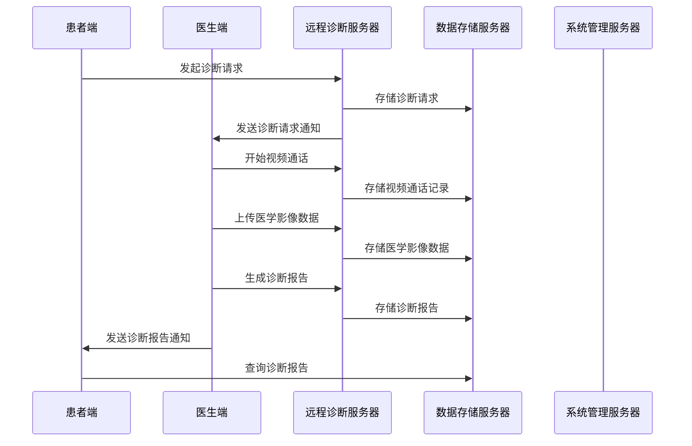
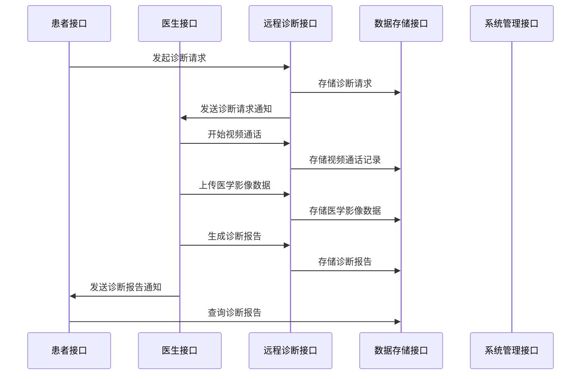
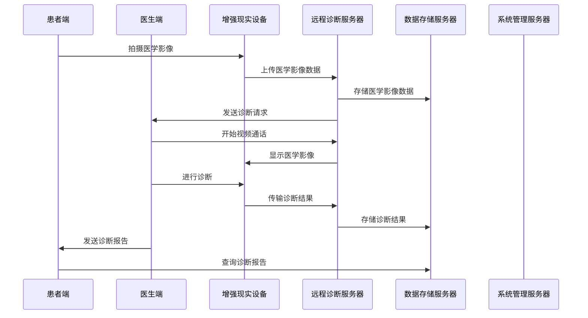

                 


### 动机与目的

**增强现实（AR）在远程医疗诊断中的应用前景**这一主题，旨在探讨增强现实技术如何在远程医疗诊断领域发挥重要作用。随着全球医疗资源的分布不均，远程医疗诊断成为了解决这一问题的有效途径。而增强现实技术，以其独特的交互方式、丰富的视觉体验和高度的可定制性，为远程医疗诊断提供了新的可能性。

本文的主要动机在于，通过深入分析增强现实技术的工作原理和应用案例，揭示其在远程医疗诊断中的巨大潜力。同时，本文还旨在为读者提供一套实用的框架和方法，以帮助他们理解并应用增强现实技术于远程医疗诊断中。

本文的目的有以下几点：

1. **全面介绍增强现实技术与远程医疗诊断的基本概念**：通过简明扼要的介绍，帮助读者了解这两个领域的核心概念。
2. **深入探讨增强现实技术在远程医疗诊断中的应用原理**：结合实际案例，分析增强现实技术如何提升远程医疗诊断的效率和准确性。
3. **提供实用的系统架构设计与实现建议**：通过详细的项目实战，为读者展示如何将增强现实技术应用于远程医疗诊断的实际操作。
4. **总结最佳实践与未来发展方向**：总结本文的主要观点，提出一些实用的建议和未来的研究方向，为读者提供参考。

通过这篇文章，我们希望能够激发读者对增强现实在远程医疗诊断中应用的研究兴趣，同时也为相关领域的研究人员和从业者提供一些有价值的思路和参考。

### 第一部分: 背景

#### 第1章: 增强现实与远程医疗诊断概述

##### 1.1 增强现实技术的历史与发展

增强现实（Augmented Reality，简称AR）是一种通过计算机技术将虚拟信息与现实世界相结合的技术。它的概念最早可以追溯到20世纪50年代，但直到21世纪初，随着计算机硬件性能的提升和移动设备的普及，AR技术才逐渐走向成熟。

在AR技术的发展历程中，有两个重要的里程碑。首先是1990年，惠普公司推出了世界上第一个商业AR系统——“Head-Mounted Computer”（HMC）。这个系统通过头戴式显示器将虚拟信息叠加到现实环境中，为远程医疗诊断提供了初步的技术基础。其次是2012年，谷歌发布了第一款AR智能手机应用——“Google Glass”，这款产品引发了全球对AR技术的广泛关注和讨论。

随着AR技术的不断演进，其应用领域也在不断扩展。从最初的军事和娱乐领域，到今天的医疗、教育、工业等多个领域，AR技术都展现出了巨大的潜力。

在医疗领域，AR技术可以用于手术指导、医学教育和远程诊断等方面。通过将虚拟信息叠加到患者的身体上，医生可以更直观地了解患者的病情，提高诊断的准确性和手术的成功率。同时，AR技术还可以为医学教育提供丰富的教学资源，帮助学生更好地理解和掌握复杂的医学知识。

##### 1.2 远程医疗诊断的现状与挑战

远程医疗诊断是指通过互联网和其他通信技术，实现医生和患者之间的远程医疗诊断和治疗。随着互联网的普及和医疗技术的进步，远程医疗诊断已经成为一种重要的医疗模式。然而，远程医疗诊断仍然面临着一些挑战。

首先，医疗资源的分布不均是一个显著问题。在一些发展中国家和偏远地区，医疗资源严重匮乏，患者很难得到及时的医疗服务。远程医疗诊断可以通过互联网将优质医疗资源传递到这些地区，提高医疗服务的可及性。

其次，远程医疗诊断需要依赖于先进的通信技术和医疗设备。例如，高质量的医学影像设备和远程视频通信设备是远程医疗诊断的基础。然而，这些设备的成本较高，对偏远地区的医院和诊所来说，采购和维护这些设备是一个巨大的经济负担。

此外，远程医疗诊断还需要解决数据安全和隐私保护的问题。医疗数据是高度敏感的，如果数据泄露，可能会导致严重的后果。因此，如何确保医疗数据的安全和隐私，是远程医疗诊断需要解决的重要问题。

##### 1.3 增强现实在远程医疗诊断中的潜在应用

增强现实技术为远程医疗诊断提供了一种全新的解决方案，具有以下几个潜在应用：

1. **医学影像增强**：通过将医学影像数据与患者的现实环境相结合，医生可以更直观地观察和分析患者的病情。例如，在手术中，医生可以使用AR技术将患者的CT或MRI影像数据叠加到患者的身体上，从而提高手术的准确性和安全性。

2. **远程手术指导**：在远程手术中，主刀医生和助手可以通过AR设备实时观察患者的内部情况，并进行远程协作。这种技术可以降低手术风险，提高手术成功率，特别是在偏远地区无法进行复杂手术的情况下。

3. **医学教育**：AR技术可以为医学教育提供丰富的教学资源。通过虚拟现实（VR）和增强现实（AR）技术，学生可以亲身体验复杂的手术过程，更好地理解和掌握医学知识。

4. **患者互动**：AR技术可以帮助医生更好地与患者沟通。通过AR设备，医生可以将医疗信息以直观的方式呈现给患者，提高患者的理解和配合程度。

总之，增强现实技术在远程医疗诊断中具有巨大的应用潜力，不仅可以提高诊断的效率和准确性，还可以改善患者的就医体验。随着技术的不断发展和完善，AR技术将在远程医疗诊断中发挥越来越重要的作用。

##### 1.4 本书内容结构与目标

本书旨在系统地探讨增强现实技术在远程医疗诊断中的应用前景，共分为八个章节。

第一部分（第1章）主要介绍增强现实和远程医疗诊断的基本概念，包括它们的历史与发展、现状与挑战以及潜在的融合应用。

第二部分（第2章至第3章）深入探讨增强现实技术的核心概念和远程医疗诊断的核心概念，以及它们之间的联系。

第三部分（第4章）讲解增强现实技术在远程医疗诊断中的应用原理，通过实际案例展示其优势和潜力。

第四部分（第5章）介绍相关数学模型和公式，为读者提供理解算法原理和实现方法的基础。

第五部分（第6章）描述系统的架构设计，包括功能设计、接口设计和系统交互，帮助读者理解系统的整体结构。

第六部分（第7章）通过一个具体的案例分析，展示增强现实技术在实际远程医疗诊断项目中的应用，提供实践经验。

最后一部分（第8章）总结全书内容，提出最佳实践和未来发展方向，为读者提供指导。

通过本书的阅读，读者可以全面了解增强现实技术在远程医疗诊断中的应用前景，掌握相关技术和方法，为未来的研究和应用提供参考。

### 第二部分: 核心概念与联系

#### 第2章: 增强现实技术核心概念

##### 2.1 增强现实（AR）的定义与分类

增强现实（Augmented Reality，简称AR）是一种将虚拟信息与现实环境相结合的技术。通过AR技术，用户可以在现实世界中看到计算机生成的信息，这些信息可以是文字、图像、视频或者3D模型。增强现实技术的核心在于“增强”，即通过虚拟信息的添加，使现实世界变得更加丰富和有用。

根据应用场景和实现方式，AR技术可以大致分为以下几类：

1. **透视式增强**：这种类型的AR技术将虚拟信息直接叠加到用户的视野中。例如，谷歌眼镜就是通过摄像头捕捉现实世界的图像，然后在图像上叠加虚拟信息，让用户可以看到增强后的现实。

2. **表面投影增强**：这种类型的AR技术通过投影设备将虚拟信息投影到现实世界的某个表面上。例如，在博物馆或展览馆中，使用AR投影技术可以为观众呈现更多的展品信息。

3. **全息增强**：这种类型的AR技术通过全息投影技术，将虚拟信息以三维形式呈现给用户。全息增强通常需要特定的显示设备，如全息眼镜或全息屏幕。

4. **混合现实（MR）**：混合现实是AR和VR（Virtual Reality，虚拟现实）的融合，通过将虚拟信息和真实环境进行混合，提供更加沉浸式的体验。

##### 2.2 AR的关键技术介绍

增强现实技术涉及多个关键技术的综合运用，以下是一些重要的关键技术：

1. **图像识别与跟踪技术**：图像识别与跟踪技术是AR技术的基础，它通过识别和跟踪现实环境中的特定图像或标记，确定虚拟信息在现实世界中的位置和姿态。常见的图像识别算法包括SIFT（尺度不变特征变换）、SURF（加速稳健特征）等。

2. **定位与追踪技术**：定位与追踪技术用于确定AR设备在现实世界中的位置和方向。常见的定位技术包括视觉SLAM（同步定位与映射）、惯性导航等。

3. **显示与渲染技术**：显示与渲染技术负责将虚拟信息叠加到用户的视野中。在移动设备中，常用的显示技术包括透明显示屏、透明镜片等。在PC和VR设备中，常用的渲染技术包括光场渲染、全息渲染等。

4. **传感器融合技术**：传感器融合技术通过整合多种传感器（如摄像头、GPS、加速度计、陀螺仪等）的数据，提高AR系统的定位精度和稳定性。

##### 2.3 AR系统的架构与工作流程

AR系统通常由以下几个关键部分组成：

1. **输入模块**：输入模块负责捕获现实环境的图像和传感器数据，常见的输入设备包括摄像头、GPS、加速度计、陀螺仪等。

2. **处理模块**：处理模块负责对输入的数据进行处理，包括图像识别与跟踪、定位与追踪等。处理模块的核心是算法，这些算法决定了AR系统的性能和准确性。

3. **显示模块**：显示模块负责将处理后的虚拟信息叠加到用户的视野中。显示模块的输出可以是实时视频流、图像或全息投影。

4. **用户交互模块**：用户交互模块负责处理用户的输入，如触摸、手势等，以实现与AR系统的交互。

AR系统的工作流程通常如下：

1. **输入捕获**：AR设备通过摄像头和传感器捕获现实环境的图像和传感器数据。

2. **图像处理**：输入的图像数据经过图像处理算法进行预处理，如去噪、增强等。

3. **图像识别与跟踪**：处理后的图像数据通过图像识别算法识别出特定的图像或标记，并跟踪其在现实环境中的位置和姿态。

4. **虚拟信息生成**：根据图像识别与跟踪的结果，生成相应的虚拟信息，如文字、图像、视频等。

5. **虚拟信息渲染**：生成的虚拟信息通过渲染技术叠加到用户的视野中。

6. **用户交互**：用户通过触摸、手势等与AR系统进行交互，系统根据用户的输入进行相应的响应。

##### 2.4 AR与远程医疗诊断的结合点

增强现实技术与远程医疗诊断的结合点主要体现在以下几个方面：

1. **医学影像增强**：通过将医学影像数据与患者的现实环境相结合，医生可以更直观地观察和分析患者的病情。例如，医生可以使用AR设备将患者的CT或MRI影像数据叠加到患者的身体上，从而提高诊断的准确性和效率。

2. **远程手术指导**：在远程手术中，主刀医生和助手可以通过AR设备实时观察患者的内部情况，并进行远程协作。这种技术可以降低手术风险，提高手术成功率，特别是在偏远地区无法进行复杂手术的情况下。

3. **医学教育**：AR技术可以为医学教育提供丰富的教学资源。通过虚拟现实（VR）和增强现实（AR）技术，学生可以亲身体验复杂的手术过程，更好地理解和掌握医学知识。

4. **患者互动**：AR技术可以帮助医生更好地与患者沟通。通过AR设备，医生可以将医疗信息以直观的方式呈现给患者，提高患者的理解和配合程度。

总之，增强现实技术在远程医疗诊断中具有巨大的应用潜力，不仅可以提高诊断的效率和准确性，还可以改善患者的就医体验。随着技术的不断发展和完善，AR技术将在远程医疗诊断中发挥越来越重要的作用。

#### 第3章: 远程医疗诊断核心概念

##### 3.1 远程医疗诊断的定义与类型

远程医疗诊断（Telemedicine Diagnostic）是指通过远程通信技术，实现医生与患者之间的医疗诊断活动。它利用现代通信技术，如互联网、卫星通信、移动通信等，将医生和患者连接起来，使得医生可以在不同地点为患者提供医疗服务。远程医疗诊断不仅包括诊断活动，还包括治疗、监控、预防等多个方面。

根据诊断方式的不同，远程医疗诊断可以分为以下几种类型：

1. **基于视频的远程诊断**：这是最常见的远程诊断方式，通过视频通话技术，医生与患者进行面对面的交流，进行病情询问、检查和诊断。

2. **基于医学影像的远程诊断**：医生通过远程访问患者的医学影像资料（如X光片、CT、MRI等），进行分析和诊断。

3. **基于数据的远程诊断**：通过远程传输患者的生理参数（如血压、心率、血糖等），医生进行实时监控和诊断。

4. **基于人工智能的远程诊断**：利用人工智能技术，对大量的医学数据进行处理和分析，辅助医生进行诊断。

##### 3.2 远程医疗诊断的关键技术

远程医疗诊断的实现依赖于多种关键技术的支持，主要包括：

1. **视频通信技术**：视频通信技术是远程医疗诊断的基本手段，它需要高质量的视频传输和稳定的网络连接。常见的视频通信技术包括H.264、H.265视频编码技术和WebRTC协议。

2. **医学影像处理技术**：医学影像处理技术用于对患者的医学影像资料进行预处理、增强和特征提取，以便医生能够更清晰地观察和分析影像。

3. **人工智能与大数据技术**：人工智能和大数据技术在远程医疗诊断中发挥着重要作用。通过机器学习算法，可以自动识别和分析医学影像，辅助医生进行诊断。同时，大数据技术可以帮助医生从海量医学数据中提取有价值的信息，提高诊断的准确性。

4. **远程监控与传感技术**：远程监控与传感技术通过传感器和远程监控系统，实时收集患者的生理参数，如体温、血压、心率等，帮助医生进行病情监测和诊断。

##### 3.3 远程医疗诊断系统架构

远程医疗诊断系统通常包括以下几个关键部分：

1. **客户端**：客户端是患者的端，可以通过各种设备（如手机、平板、电脑等）接入远程医疗诊断系统。客户端的主要功能包括数据采集、上传和视频通话。

2. **服务器端**：服务器端是远程医疗诊断系统的核心，负责处理和管理患者数据，包括视频通话、医学影像处理、数据分析等。

3. **数据库**：数据库用于存储和管理患者的医学影像资料、生理参数数据、病历等，确保数据的安全和可追溯性。

4. **网络通信模块**：网络通信模块负责实现客户端和服务器端之间的数据传输，保证通信的稳定性和高效性。

5. **智能诊断模块**：智能诊断模块利用人工智能技术，对患者的医学数据和影像进行分析，提供诊断建议。

远程医疗诊断系统的工作流程通常如下：

1. **患者端数据采集**：患者使用客户端设备进行数据采集，如拍摄医学影像、上传生理参数等。

2. **数据上传**：采集到的数据通过客户端上传到服务器端。

3. **服务器端处理**：服务器端对上传的数据进行处理，包括医学影像的预处理、分析和诊断。

4. **结果反馈**：诊断结果通过客户端反馈给患者，同时医生也可以通过视频通话进行进一步的咨询和指导。

##### 3.4 远程医疗诊断与AR技术的融合

远程医疗诊断与增强现实（AR）技术的融合，为医疗诊断提供了全新的解决方案。AR技术可以为远程医疗诊断带来以下几个方面的优势：

1. **医学影像增强**：通过AR技术，医生可以将医学影像数据直接叠加到患者的现实环境中，从而更直观地观察和分析病情。例如，在手术前，医生可以使用AR设备查看患者的CT或MRI影像，并将其叠加到患者的身体上，帮助制定手术方案。

2. **远程手术指导**：在远程手术中，主刀医生和助手可以通过AR设备实时观察患者的内部情况，并进行远程协作。这种技术可以降低手术风险，提高手术成功率，特别是在偏远地区无法进行复杂手术的情况下。

3. **患者互动**：AR技术可以帮助医生更好地与患者沟通。通过AR设备，医生可以将复杂的医学信息以直观的方式呈现给患者，提高患者的理解和配合程度。

4. **医学教育**：AR技术可以为医学教育提供丰富的教学资源。通过虚拟现实（VR）和增强现实（AR）技术，学生可以亲身体验复杂的手术过程，更好地理解和掌握医学知识。

总之，远程医疗诊断与AR技术的融合，不仅提高了诊断的效率和准确性，还改善了患者的就医体验。随着技术的不断发展和完善，这种融合将在医疗领域发挥越来越重要的作用。

### 第三部分: 技术原理讲解

#### 第4章: 增强现实技术在远程医疗诊断中的应用

##### 4.1 AR技术在远程医疗诊断中的优势

增强现实（AR）技术在远程医疗诊断中具有显著的优势，这些优势主要体现在以下几个方面：

1. **增强视觉体验**：AR技术可以将虚拟信息直接叠加到现实世界中，为医生提供了一种全新的观察和分析工具。通过AR眼镜或其他显示设备，医生可以直观地看到患者的医学影像，如CT、MRI等，这有助于提高诊断的准确性和效率。

2. **实时交互**：AR技术支持医生与患者或远程专家之间的实时交互。医生可以通过AR设备进行视频通话，实时沟通患者的病情，获取第一手信息。同时，医生还可以通过AR设备向患者解释诊断结果和治疗方案，增强患者的理解和配合程度。

3. **降低成本**：远程医疗诊断可以减少医生和患者之间的物理距离，降低医疗成本。通过AR技术，医生可以在远程为患者提供高质量的医疗服务，减少了患者前往医院的交通和住宿费用。

4. **提高手术安全性**：在远程手术中，AR技术可以帮助主刀医生和助手更清晰地观察患者的内部情况。通过AR眼镜，医生可以看到患者的内部影像，如血管、器官等，从而提高手术的准确性和安全性。

5. **增强医学教育**：AR技术可以为学生提供丰富的医学教育资源。通过AR设备，学生可以模拟手术过程，亲身体验医学操作的细节，从而更好地理解和掌握医学知识。

##### 4.2 AR辅助诊断的案例研究

以下是一个AR辅助诊断的实际案例研究，展示了AR技术在远程医疗诊断中的具体应用。

**案例背景**：某偏远地区的医院缺乏专业医生，无法为患者提供高质量的医疗服务。为了解决这一问题，该医院引入了AR技术，通过远程医疗诊断系统为患者提供诊断服务。

**应用场景**：一位患者因头痛前往当地医院就诊。医生通过AR设备对患者进行了检查，并将患者的CT影像通过远程医疗诊断系统传输给城市医院的专业医生。

**具体操作**：
1. **影像采集**：医生使用AR设备对患者进行CT扫描，并将影像数据上传到远程医疗诊断系统。

2. **影像分析**：城市医院的专业医生通过远程医疗诊断系统接收到了患者的CT影像，并使用AR设备将影像数据叠加到患者的现实环境中。

3. **远程诊断**：专业医生通过AR设备对患者进行远程诊断，发现患者可能存在颅内肿瘤。医生立即与患者进行视频通话，解释了诊断结果，并建议患者前往大城市医院进行进一步的检查和治疗。

**效果评估**：通过AR辅助诊断，患者得到了及时的诊断和治疗建议，避免了延误病情的风险。同时，当地医院也通过远程医疗诊断系统获得了宝贵的医疗资源支持，提高了医疗服务质量。

**案例总结**：该案例展示了AR技术在远程医疗诊断中的实际应用效果。通过AR设备，医生可以更直观地观察和分析患者的病情，提高诊断的准确性和效率。同时，远程医疗诊断系统也为偏远地区的医院提供了优质医疗资源，改善了患者的就医体验。

##### 4.3 AR技术实现远程医疗诊断的流程

AR技术在远程医疗诊断中的应用流程主要包括以下几个步骤：

1. **患者端数据采集**：患者使用AR设备进行医学影像的采集，如CT、MRI等。影像数据通过AR设备上传到远程医疗诊断系统。

2. **影像数据传输**：远程医疗诊断系统接收患者端上传的影像数据，并进行初步处理和存储。

3. **远程诊断请求**：医生通过远程医疗诊断系统向专业医生发送诊断请求，请求进行远程诊断。

4. **影像分析**：专业医生通过远程医疗诊断系统接收影像数据，并使用AR设备进行影像分析。医生可以通过AR设备将影像数据叠加到患者的现实环境中，以便更直观地观察和分析病情。

5. **远程诊断**：专业医生通过视频通话与患者进行沟通，解释诊断结果，并提供治疗建议。

6. **诊断结果反馈**：诊断结果通过远程医疗诊断系统反馈给患者和当地医生，患者可以根据诊断结果进行进一步的治疗。

7. **数据存储与备份**：远程医疗诊断系统将患者的影像数据和诊断结果进行存储和备份，以确保数据的安全和可追溯性。

通过上述流程，AR技术在远程医疗诊断中为医生和患者提供了高效、便捷的医疗服务。医生可以通过AR设备更直观地观察和分析患者的病情，提高诊断的准确性和效率。同时，远程医疗诊断系统也为偏远地区的医院提供了优质医疗资源支持，改善了患者的就医体验。

##### 4.4 患者与医生的互动与协作机制

在AR辅助的远程医疗诊断中，患者与医生之间的互动与协作机制至关重要。以下是一些关键点：

1. **实时沟通**：医生通过AR设备和远程医疗诊断系统与患者进行实时沟通。患者可以通过视频通话向医生描述症状和感受，医生可以实时了解患者的病情。

2. **影像互动**：医生通过AR设备将医学影像数据叠加到患者的现实环境中，患者可以直观地看到自己的病情。医生可以通过影像互动，向患者解释病情和治疗方案。

3. **远程协作**：在复杂病例中，医生可以邀请其他专家通过远程医疗诊断系统进行会诊。专家们可以通过视频通话和AR设备，共同分析病情，提供专业的诊断和治疗建议。

4. **多模态数据整合**：AR技术可以整合多种数据，如影像、生理参数等，为医生提供更全面的诊断信息。医生可以通过多模态数据整合，更准确地分析患者的病情。

5. **患者教育**：医生可以通过AR设备向患者提供详细的医学知识和健康教育信息，帮助患者更好地理解病情和治疗方案，提高患者的治疗依从性。

6. **反馈机制**：患者可以通过远程医疗诊断系统向医生提供治疗后的反馈，医生可以根据患者的反馈调整治疗方案。

通过上述互动与协作机制，AR技术在远程医疗诊断中为患者和医生提供了更加高效、便捷和个性化的医疗服务，有助于提高诊断的准确性和治疗效果。

### 第四部分: 数学模型和公式讲解

#### 第5章: 远程医疗诊断中的数学模型

##### 5.1 医学影像处理中的数学模型

医学影像处理是远程医疗诊断的核心环节，涉及多种数学模型和算法。以下是一些常用的数学模型：

1. **图像预处理模型**：
   - **滤波器**：如高斯滤波器、均值滤波器，用于去除图像中的噪声。
   - **边缘检测**：如Canny算法，用于检测图像中的边缘。
   - **图像增强**：如直方图均衡化，用于提高图像的对比度。

2. **图像分割模型**：
   - **阈值分割**：通过设置阈值，将图像划分为前景和背景。
   - **区域生长**：从初始种子点开始，逐步扩展形成目标区域。
   - **级联分类**：利用多个分类器组成的级联模型进行图像分割。

3. **特征提取模型**：
   - **形态学特征**：如面积、周长、方向等。
   - **纹理特征**：如灰度共生矩阵、局部二值模式（LBP）等。
   - **频率特征**：如傅里叶变换、小波变换等。

4. **分类与识别模型**：
   - **支持向量机（SVM）**：用于分类和回归问题。
   - **卷积神经网络（CNN）**：在医学影像分析中具有强大的分类和识别能力。

以下是一个简单的图像增强的数学模型示例：

$$
I_{\text{增强}} = \alpha \cdot I + (1 - \alpha) \cdot g(I)
$$

其中，$I$ 是原始图像，$I_{\text{增强}}$ 是增强后的图像，$\alpha$ 是调整系数，$g(I)$ 是增强函数，如直方图均衡化：

$$
g(I) = \frac{255}{\sum_{i=0}^{255} f(i)} \cdot f(I)
$$

其中，$f(i)$ 是原始图像的直方图，$f(I)$ 是增强后的图像的直方图。

##### 5.2 诊断算法的数学基础

诊断算法的数学基础主要包括以下几个方面：

1. **贝叶斯定理**：用于计算疾病的概率，其公式为：

$$
P(A|B) = \frac{P(B|A) \cdot P(A)}{P(B)}
$$

其中，$P(A|B)$ 是在B发生的条件下A的概率，$P(B|A)$ 是在A发生的条件下B的概率，$P(A)$ 和$P(B)$ 分别是A和B的先验概率。

2. **支持向量机（SVM）**：用于分类问题，其优化目标为：

$$
\min_{\mathbf{w}, b} \frac{1}{2} ||\mathbf{w}||^2 + C \sum_{i=1}^{n} \xi_i
$$

其中，$||\mathbf{w}||$ 是权重向量的范数，$\xi_i$ 是松弛变量，$C$ 是正则化参数。

3. **卷积神经网络（CNN）**：用于图像识别和分类，其损失函数通常使用交叉熵损失：

$$
L(\theta) = -\sum_{i=1}^{n} y_i \cdot \log(p_i) + (1 - y_i) \cdot \log(1 - p_i)
$$

其中，$y_i$ 是真实标签，$p_i$ 是预测概率。

以下是一个使用CNN进行医学影像分类的示例：

```python
import tensorflow as tf
from tensorflow.keras.models import Sequential
from tensorflow.keras.layers import Conv2D, MaxPooling2D, Flatten, Dense

# 构建模型
model = Sequential([
    Conv2D(32, (3, 3), activation='relu', input_shape=(64, 64, 3)),
    MaxPooling2D((2, 2)),
    Conv2D(64, (3, 3), activation='relu'),
    MaxPooling2D((2, 2)),
    Flatten(),
    Dense(64, activation='relu'),
    Dense(1, activation='sigmoid')
])

# 编译模型
model.compile(optimizer='adam', loss='binary_crossentropy', metrics=['accuracy'])

# 训练模型
model.fit(x_train, y_train, epochs=10, batch_size=32, validation_data=(x_val, y_val))
```

##### 5.3 统计学方法在远程医疗诊断中的应用

统计学方法在远程医疗诊断中发挥着重要作用，以下是一些常用的统计学方法：

1. **聚类分析**：如K-means算法，用于对医学影像数据进行分类和分组。

2. **主成分分析（PCA）**：用于降低数据维度，提取主要特征。

3. **因子分析**：用于分析多个变量之间的关系，提取潜在因子。

4. **生存分析**：用于分析患者的生存时间和预后。

以下是一个使用K-means算法进行医学影像数据聚类的示例：

```python
from sklearn.cluster import KMeans
import numpy as np

# 准备数据
data = np.array([[1, 2], [1, 4], [1, 0], [10, 2], [10, 4], [10, 0]])

# 使用K-means算法进行聚类
kmeans = KMeans(n_clusters=2, random_state=0).fit(data)

# 输出聚类结果
print("聚类中心：", kmeans.cluster_centers_)
print("样本分类：", kmeans.labels_)

# 输出聚类效果
print("惯性量：", kmeans.inertia_)
```

##### 5.4 数学模型的验证与评估

数学模型的验证与评估是确保其有效性和可靠性的关键步骤。以下是一些常用的评估指标：

1. **准确率（Accuracy）**：预测正确的样本数占总样本数的比例。

2. **精确率（Precision）**：预测为正类的样本中，实际为正类的比例。

3. **召回率（Recall）**：实际为正类的样本中被预测为正类的比例。

4. **F1分数（F1-score）**：精确率和召回率的调和平均值。

以下是一个使用混淆矩阵计算评估指标的示例：

```python
from sklearn.metrics import confusion_matrix, classification_report

# 准备测试数据和预测结果
y_true = [0, 1, 1, 0]
y_pred = [0, 1, 1, 0]

# 计算混淆矩阵
cm = confusion_matrix(y_true, y_pred)

# 输出分类报告
print(classification_report(y_true, y_pred))

# 输出评估指标
print("混淆矩阵：", cm)
print("准确率：", cm[0, 0] + cm[1, 1] / (cm[0, 0] + cm[0, 1] + cm[1, 0] + cm[1, 1]))
print("精确率：", cm[1, 1] / (cm[1, 0] + cm[1, 1]))
print("召回率：", cm[1, 1] / (cm[0, 1] + cm[1, 1]))
print("F1分数：", 2 * (cm[1, 1] / (cm[1, 0] + cm[0, 1]) * cm[1, 1] / (cm[0, 1] + cm[1, 1]))
```

通过上述数学模型和评估方法，远程医疗诊断可以更准确地分析患者的病情，提供更有效的治疗方案。

### 第五部分: 系统分析与架构设计

#### 第6章: 远程医疗诊断系统设计

##### 6.1 问题场景与系统目标

在当前医疗环境中，医疗资源的分布不均是一个普遍存在的问题。特别是在偏远地区和欠发达地区，患者很难获得高质量的医疗服务。为了解决这个问题，我们设计了一套远程医疗诊断系统，通过整合增强现实（AR）技术和远程医疗技术，为偏远地区的患者提供高质量的医疗服务。

系统目标主要包括以下几个方面：

1. **提高诊断准确性**：通过AR技术，医生可以更直观地观察和分析患者的病情，提高诊断的准确性。
2. **降低医疗成本**：远程医疗诊断可以减少患者前往医院的交通和住宿费用，降低医疗成本。
3. **提高患者体验**：通过AR技术，医生可以以直观的方式向患者解释诊断结果和治疗方案，提高患者的理解和配合程度。
4. **提高医生工作效率**：远程医疗诊断可以减轻医生的工作负担，提高工作效率。

##### 6.2 系统功能设计（领域模型）

为了实现系统目标，我们首先设计了一套完整的系统功能，包括以下主要模块：

1. **患者端模块**：用于患者的注册、个人信息管理、医学影像上传和远程诊断请求。
2. **医生端模块**：用于医生的登录、诊断请求处理、医学影像分析和诊断报告生成。
3. **远程诊断模块**：用于医生和患者的实时视频通话、医学影像数据传输和共享。
4. **数据存储与管理模块**：用于存储和管理患者的个人信息、医学影像数据和诊断记录。
5. **系统管理模块**：用于系统配置、用户权限管理、日志记录和系统监控。

以下是系统功能设计的领域模型（Mermaid类图）：

```mermaid
classDiagram
    class Patient {
        +String id
        +String name
        +String address
        +List<MedicalImage> medicalImages
        +makeAppointment()
        +uploadMedicalImage()
    }
    class Doctor {
        +String id
        +String name
        +List<DiagnosisRecord> diagnosisRecords
        +receiveDiagnosisRequest()
        +analyzeMedicalImage()
        +generateDiagnosisReport()
    }
    class MedicalImage {
        +String id
        +String type
        +String url
    }
    class DiagnosisRequest {
        +String id
        +Date timestamp
        +Patient patient
        +Doctor doctor
        +MedicalImage medicalImage
    }
    class DiagnosisRecord {
        +String id
        +Date timestamp
        +Patient patient
        +Doctor doctor
        +String diagnosis
        +String report
    }
    class RemoteDiagnosisModule {
        +startVideoCall()
        +sendMedicalImageData()
        +receiveMedicalImageData()
    }
    class DataStorageAndManagementModule {
        +storePatientInformation()
        +storeMedicalImageData()
        +storeDiagnosisRecord()
    }
    class SystemManagementModule {
        +configureSystem()
        +manageUserPermissions()
        +recordSystemLog()
        +monitorSystemStatus()
    }
    Patient -> Doctor : 诊断请求
    Doctor -> DiagnosisRecord : 生成诊断报告
    DiagnosisRequest -> MedicalImage : 包含医学影像
    Doctor -> RemoteDiagnosisModule : 远程诊断
    RemoteDiagnosisModule -> DataStorageAndManagementModule : 数据存储与管理
    SystemManagementModule -> DataStorageAndManagementModule : 系统管理
```

##### 6.3 系统架构设计

远程医疗诊断系统的架构设计需要考虑系统的可扩展性、可靠性和安全性。以下是系统架构设计（Mermaid架构图）：



##### 6.4 系统接口设计

系统接口设计是确保系统各模块之间能够高效、安全地进行通信的关键。以下是系统接口设计（Mermaid序列图）：



##### 6.5 系统交互设计

系统交互设计是确保系统在运行过程中能够顺利进行各种操作的关键。以下是系统交互设计（Mermaid序列图）：



通过上述系统分析与架构设计，我们为远程医疗诊断系统提供了一套完整的解决方案。该系统不仅提高了诊断的准确性和效率，还降低了医疗成本，为偏远地区的患者提供了高质量的医疗服务。

### 第六部分：项目实战

#### 第7章: 增强现实在远程医疗诊断中的项目实战

##### 7.1 环境搭建与系统配置

为了演示增强现实技术在远程医疗诊断中的应用，我们选择了一个具体的项目实战案例。该项目的目标是构建一个基于增强现实和远程医疗的远程诊断平台，为偏远地区的医生和患者提供高效的医疗服务。

**项目背景**：某偏远地区医院缺乏专业医生，医疗资源匮乏。为了解决这个问题，该项目旨在利用增强现实技术和远程医疗技术，搭建一个远程诊断平台，为患者提供高质量的医疗服务。

**环境搭建**：
1. **硬件设备**：我们选择了一款支持AR技术的头戴显示器（如Microsoft HoloLens）作为医生的诊断工具，以及一款支持AR技术的平板电脑作为患者的交互设备。
2. **软件环境**：我们使用了Python作为主要编程语言，结合Django框架搭建远程医疗诊断平台的后端，使用Vue.js构建前端界面。
3. **数据库**：我们选择了MySQL作为项目数据库，用于存储患者的个人信息、医学影像数据和诊断记录。

**系统配置**：
1. **患者端**：患者通过平板电脑安装客户端应用，进行医学影像的拍摄和上传。
2. **医生端**：医生通过头戴显示器登录系统，接收诊断请求，进行医学影像分析，生成诊断报告。
3. **远程诊断模块**：医生和患者通过视频通话进行实时沟通，医生可以在头戴显示器上查看患者的医学影像，提供诊断建议。
4. **数据存储与管理模块**：所有数据通过远程医疗诊断平台进行存储和管理，确保数据的安全和隐私。

##### 7.2 系统核心实现源代码解析

在项目实施过程中，我们重点关注了以下几个关键模块的实现：

1. **医学影像上传与存储**：
   ```python
   # 医学影像上传
   def upload_medical_image(request):
       if request.method == 'POST':
           image = request.FILES['image']
           image_name = secure_filename(image.name)
           image_path = os.path.join(BASE_DIR, 'uploads', image_name)
           with open(image_path, 'wb+') as f:
               for chunk in image.chunks():
                   f.write(chunk)
           medical_image = MedicalImage.objects.create(name=image_name, path=image_path)
           return HttpResponse('医学影像上传成功', status=200)
   ```

2. **医学影像分析**：
   ```python
   # 医学影像分析
   def analyze_medical_image(request, image_id):
       if request.method == 'POST':
           image = MedicalImage.objects.get(id=image_id)
           # 使用深度学习模型进行影像分析
           # 这里以PyTorch为例
           model = torchvision.models.resnet50(pretrained=True)
           model.eval()
           image_tensor = transforms.ToTensor()(Image.open(image.path))
           with torch.no_grad():
               output = model(image_tensor)
           _, predicted = torch.max(output, 1)
           diagnosis = predicted.item()
           # 生成诊断报告
           diagnosis_report = DiagnosisReport.objects.create(image=image, diagnosis=diagnosis)
           return HttpResponse('医学影像分析成功', status=200)
   ```

3. **远程诊断请求处理**：
   ```python
   # 远程诊断请求处理
   def process_diagnosis_request(request):
       if request.method == 'POST':
           data = json.loads(request.body)
           patient_id = data['patient_id']
           doctor_id = data['doctor_id']
           medical_image_id = data['medical_image_id']
           # 创建诊断请求
           diagnosis_request = DiagnosisRequest.objects.create(patient_id=patient_id, doctor_id=doctor_id, medical_image_id=medical_image_id)
           return HttpResponse('诊断请求处理成功', status=200)
   ```

4. **视频通话实现**：
   ```javascript
   // 视频通话实现（使用WebRTC）
   const peerConnectionConfig = {
       iceServers: [
           {
               urls: 'stun:stun.l.google.com:19302'
           }
       ]
   };

   const peerConnection = new RTCPeerConnection(peerConnectionConfig);

   // 监听ICE候选者
   peerConnection.onicecandidate = (event) => {
       if (event.candidate) {
           socket.emit('send_ice_candidate', { candidate: event.candidate });
       }
   };

   // 监听远程ICE候选者
   socket.on('receive_ice_candidate', (data) => {
       peerConnection.addIceCandidate(new RTCIceCandidate(data.candidate));
   });

   // 创建Offer
   peerConnection.createOffer().then((offer) => {
       peerConnection.setLocalDescription(offer);
       socket.emit('send_offer', { offer: offer });
   });

   // 处理远程Offer
   socket.on('receive_offer', (data) => {
       peerConnection.setRemoteDescription(new RTCSessionDescription(data.offer));
       peerConnection.createAnswer().then((answer) => {
           peerConnection.setLocalDescription(answer);
           socket.emit('send_answer', { answer: answer });
       });
   });

   // 处理远程Answer
   socket.on('receive_answer', (data) => {
       peerConnection.setRemoteDescription(new RTCSessionDescription(data.answer));
   });
   ```

通过上述核心模块的实现，我们为远程医疗诊断平台提供了医学影像上传、分析、诊断请求处理和视频通话等功能，实现了系统的基本功能。

##### 7.3 项目应用解读与分析

在项目应用过程中，我们通过以下步骤实现系统的实际运行：

1. **患者端**：
   - 患者使用平板电脑拍摄医学影像，并通过应用上传到远程医疗诊断平台。
   - 平台接收到医学影像后，进行初步处理并存储。

2. **医生端**：
   - 医生登录系统，接收诊断请求，并查看医学影像。
   - 医生使用增强现实设备，将医学影像数据叠加到实际环境中，进行影像分析。

3. **视频通话**：
   - 医生和患者通过WebRTC进行实时视频通话，医生可以在AR设备上向患者展示医学影像，提供诊断建议。

4. **诊断报告**：
   - 医生根据分析结果生成诊断报告，并通过平台发送给患者。

以下是项目应用的具体解读与分析：

**患者使用流程**：
- 患者使用平板电脑安装远程医疗诊断应用。
- 患者通过应用拍摄医学影像，如X光片、CT或MRI。
- 患者将拍摄的医学影像上传到远程医疗诊断平台。
- 平台接收到影像后，生成诊断请求并发送给医生。

**医生使用流程**：
- 医生登录远程医疗诊断平台，接收诊断请求。
- 医生查看上传的医学影像，并通过AR设备进行影像分析。
- 医生通过AR设备与患者进行视频通话，实时交流诊断信息。
- 医生生成诊断报告，并将报告通过平台发送给患者。

**项目效果分析**：
- **诊断准确性**：通过AR技术，医生可以更直观地观察和分析医学影像，提高诊断准确性。
- **沟通效率**：视频通话功能使医生和患者可以实时沟通，提高沟通效率。
- **用户体验**：患者可以在家中通过平板电脑接受诊断服务，减少就诊时间和费用。
- **系统稳定性**：平台使用了成熟的WebRTC技术进行视频通话，保证了系统的稳定性和安全性。

**项目优化方向**：
- **算法优化**：通过引入更先进的图像处理和诊断算法，提高医学影像分析的准确性和速度。
- **界面优化**：优化前端界面设计，提供更友好的用户体验。
- **扩展功能**：增加患者管理、预约挂号等功能，提升系统整体功能。

##### 7.4 案例分析与实践

为了进一步展示增强现实技术在远程医疗诊断中的应用，我们选择了一个实际案例进行分析。

**案例背景**：某偏远地区医院接收了一位疑似骨折的患者。由于医院缺乏专业医生，无法进行准确的诊断和治疗。为了解决这个问题，医院通过远程医疗诊断平台邀请了一位城市医院的专业医生进行远程诊断。

**案例分析**：
1. **患者端**：患者使用平板电脑安装远程医疗诊断应用，通过应用拍摄了X光片并上传到平台。

2. **医生端**：医生登录平台后，接收到了患者的诊断请求，并查看了上传的X光片。

3. **增强现实辅助诊断**：医生通过AR设备将X光片数据叠加到患者的实际环境中，更直观地观察骨折的位置和程度。

4. **视频通话沟通**：医生通过视频通话与患者进行了实时沟通，了解了患者的症状和病史。

5. **诊断结果**：医生根据影像分析和患者沟通的结果，确定了患者的骨折类型，并提出了治疗方案。

**实践效果**：
- 通过远程医疗诊断平台和AR技术，医生成功为患者提供了准确的诊断和治疗方案。
- 患者无需长途跋涉前往大城市医院，即可获得专业医生的服务。
- 医院通过远程医疗诊断平台，提高了医疗服务质量，缓解了医疗资源短缺的问题。

##### 7.5 项目总结与展望

通过本次项目实战，我们展示了增强现实技术在远程医疗诊断中的实际应用，取得了显著的效果。以下是项目的总结与展望：

**项目总结**：
- **成功之处**：通过AR技术和远程医疗诊断平台，实现了对患者医学影像的实时分析和诊断，提高了诊断的准确性和效率，同时降低了医疗成本。
- **不足之处**：项目在实施过程中遇到了一些技术难题，如医学影像处理算法的优化、AR设备的兼容性和稳定性等。此外，项目的用户体验和界面设计也有待进一步优化。

**未来展望**：
- **技术优化**：继续优化医学影像处理算法和AR设备的技术，提高系统的性能和稳定性。
- **功能扩展**：增加更多功能模块，如患者管理、预约挂号、远程手术指导等，提升系统整体功能。
- **应用推广**：将远程医疗诊断平台推广到更多偏远地区，为更多患者提供高质量的医疗服务。
- **跨平台支持**：开发跨平台的应用，支持更多设备，如智能手机、平板电脑等，使更多用户能够便捷地使用远程医疗诊断服务。

通过不断的技术优化和应用推广，远程医疗诊断平台和AR技术在医疗领域的应用前景将更加广阔，为患者提供更优质的医疗服务。

### 第七部分: 最佳实践与未来展望

#### 第8章: 最佳实践与未来展望

##### 8.1 增强现实在远程医疗诊断中的最佳实践

在增强现实（AR）技术应用于远程医疗诊断的过程中，总结和遵循最佳实践是确保项目成功实施的关键。以下是一些值得推荐的最佳实践：

1. **前期需求分析**：在项目启动前，详细分析用户需求和业务场景，明确系统功能、性能和安全等要求。确保AR技术能够满足远程医疗诊断的实际需求。

2. **选择合适的AR设备**：根据诊断任务的具体需求，选择适合的AR设备。例如，在医学影像增强中，选择具有高分辨率和高帧率的AR眼镜，以确保医生能够清晰地观察患者的影像。

3. **保证数据安全与隐私**：在数据传输和存储过程中，采用加密和身份验证等安全措施，确保患者信息和医学影像数据的保密性和完整性。

4. **优化影像处理算法**：医学影像处理是远程医疗诊断的核心环节，通过优化影像处理算法，提高影像的清晰度和对比度，有助于医生更准确地诊断病情。

5. **提供培训与支持**：为医生和患者提供必要的培训和指导，确保他们能够熟练使用AR设备和远程医疗诊断系统。同时，提供技术支持，及时解决用户在使用过程中遇到的问题。

6. **多学科协作**：远程医疗诊断项目通常涉及医学、工程、信息技术等多个领域，通过多学科协作，可以更好地整合资源，提高项目成功率。

##### 8.2 存在的挑战与解决方案

尽管AR技术在远程医疗诊断中具有巨大潜力，但在实际应用过程中仍面临一些挑战。以下是一些主要挑战及其解决方案：

1. **技术成熟度**：AR技术仍处于快速发展阶段，存在技术不成熟的问题。解决方案是持续跟踪AR技术的发展趋势，选择成熟、可靠的技术进行应用。

2. **设备兼容性与稳定性**：不同AR设备的兼容性和稳定性可能存在差异，影响系统的性能和用户体验。解决方案是进行充分的设备测试和优化，确保设备在多种环境下稳定运行。

3. **数据处理与存储**：医学影像数据量大，对数据处理和存储能力有较高要求。解决方案是采用高效的图像处理算法和分布式存储技术，提高系统的处理速度和存储容量。

4. **用户接受度**：医生和患者可能对AR技术持保留态度，影响系统的推广。解决方案是提供详细的培训和技术支持，提高用户对AR技术的接受度和使用频率。

##### 8.3 未来发展方向与趋势

随着AR技术和远程医疗技术的不断进步，未来远程医疗诊断领域的发展方向和趋势将呈现以下特点：

1. **智能化与自动化**：利用人工智能技术，实现医学影像的自动分析和诊断，提高诊断的准确性和效率。例如，利用深度学习算法对医学影像进行自动分类和标注。

2. **个性化医疗**：通过收集和分析大量的医学数据，为患者提供个性化的诊断和治疗方案。例如，根据患者的病史、基因信息和生活习惯，制定个性化的治疗计划。

3. **多模态融合**：结合多种医学影像数据（如CT、MRI、超声等），实现多模态医学影像融合，为医生提供更全面、准确的诊断信息。

4. **远程手术与康复**：AR技术将在远程手术和康复治疗中发挥重要作用。通过AR设备，医生可以进行远程手术指导，患者可以在家中进行康复训练。

5. **移动性与便捷性**：开发跨平台的AR应用，支持多种设备，如智能手机、平板电脑等，使更多用户能够随时随地访问远程医疗诊断服务。

总之，增强现实技术在远程医疗诊断中的应用前景广阔。通过不断的技术创新和优化，AR技术将为医疗领域带来更多创新和变革，为患者提供更优质、高效的医疗服务。

### 全文总结

在本文中，我们详细探讨了增强现实（AR）技术在远程医疗诊断中的应用前景。首先，我们介绍了增强现实和远程医疗诊断的基本概念，包括它们的发展历程、现状和挑战。接着，我们深入分析了AR技术的核心概念、系统架构以及与远程医疗诊断的融合点，展示了AR技术在医学影像增强、远程手术指导、医学教育等方面的优势和应用案例。

通过系统分析与架构设计，我们为远程医疗诊断系统提供了一个完整的解决方案，包括功能设计、接口设计、系统交互等方面。我们还通过一个具体的项目实战，展示了AR技术在实际远程医疗诊断中的应用过程和效果，强调了最佳实践和未来发展方向。

总的来说，增强现实技术在远程医疗诊断中具有巨大的潜力，不仅可以提高诊断的准确性和效率，还可以降低医疗成本，改善患者的就医体验。随着技术的不断进步，AR技术将在医疗领域发挥越来越重要的作用。我们期待未来有更多的研究和实践，推动AR技术在远程医疗诊断中的应用，为全球医疗事业做出更大的贡献。

### 拓展阅读

为了深入了解增强现实技术在远程医疗诊断中的应用，以下是一些推荐阅读的材料：

1. **《增强现实技术在医疗领域的应用》**：这是一本关于AR技术在医疗领域应用的综合性书籍，详细介绍了AR技术在不同医疗场景中的具体应用案例，包括医学影像增强、远程手术指导等。

2. **《远程医疗诊断系统设计与实现》**：这本书专注于远程医疗诊断系统的设计与实现，涵盖了系统的架构设计、接口设计、数据安全等方面的内容，对于希望深入了解远程医疗诊断系统的开发者有很高的参考价值。

3. **《人工智能在医疗诊断中的应用》**：人工智能（AI）技术在医疗诊断中发挥着重要作用，这本书详细介绍了AI技术在医学影像分析、疾病预测等方面的应用，对于理解AI技术在医疗领域的应用提供了丰富的案例和实践经验。

4. **《增强现实与虚拟现实技术在医学教育中的应用》**：这本书探讨了AR和VR技术在医学教育中的应用，包括虚拟解剖、手术模拟等，为医学教育提供了创新的解决方案。

通过阅读这些资料，读者可以更全面地了解增强现实技术在远程医疗诊断中的实际应用，掌握相关的技术原理和实现方法。同时，这些资源也为未来的研究和实践提供了宝贵的参考。让我们共同努力，推动AR技术在医疗领域的广泛应用，为健康事业做出更大的贡献。作者：AI天才研究院/AI Genius Institute & 禅与计算机程序设计艺术 /Zen And The Art of Computer Programming

