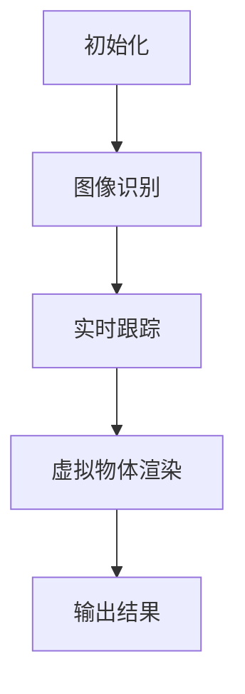
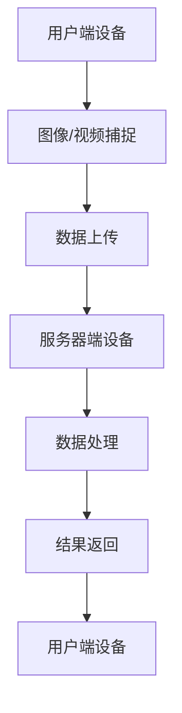

                 


### 增强现实在远程协作中的应用：打破地理界限的团队合作

> 关键词：增强现实、远程协作、团队合作、技术融合、算法原理、系统架构

> 摘要：本文旨在探讨增强现实技术在远程协作中的应用，如何打破地理界限，提升团队合作效率。通过对增强现实技术的基础、远程协作中的团队合作以及增强现实与远程协作融合的理论基础的分析，我们深入探讨了增强现实算法原理、数学模型与公式，以及系统分析与架构设计。通过项目实战，我们展示了增强现实在远程协作中的实际应用，并提供了最佳实践 tips，对未来发展趋势进行了展望。

----------------------------------------------------------------

## 第一部分: 背景介绍

### 第1章: 问题背景与核心概念

#### 1.1 增强现实技术的发展历程

增强现实（Augmented Reality，简称 AR）技术是计算机科学、人工智能和虚拟现实等多个领域交叉的产物。它的概念最早可以追溯到1968年，由美国计算机科学家伊凡·苏瑟兰（Ivan Sutherland）提出的“视景增强系统”（see-through visual display）。此后，随着计算机硬件性能的提升、算法的进步以及传感技术的应用，增强现实技术逐渐走向成熟。

#### 1.2 远程协作的需求与挑战

随着全球化的深入发展，远程协作已成为现代企业和组织中不可或缺的一部分。远程协作的需求主要来源于企业扩大规模、全球资源配置、人力资源灵活调配等因素。然而，远程协作也面临着诸多挑战，如沟通障碍、协作效率低下、文化差异等。

#### 1.3 增强现实在远程协作中的应用

增强现实技术为远程协作带来了全新的解决方案。通过增强现实，团队成员可以在虚拟环境中进行实时互动，模拟真实场景，提高协作效率。例如，增强现实可以用于远程会议、虚拟培训、协同设计等领域。

### 第2章: 增强现实技术基础

#### 2.1 增强现实的基本原理

增强现实技术通过计算机生成虚拟信息，将其叠加到真实环境中，使用户能够看到现实世界中的物体和虚拟物体。这种技术通常涉及以下几个关键组件：显示设备、传感器、计算机处理器和软件算法。

#### 2.2 增强现实的关键技术

增强现实的关键技术包括图像识别、实时跟踪、虚拟物体渲染等。图像识别用于识别现实世界中的物体，实时跟踪用于确定虚拟物体在现实环境中的位置和方向，虚拟物体渲染则是将虚拟信息以逼真的形式呈现给用户。

#### 2.3 增强现实应用案例分析

通过分析一些成功的增强现实应用案例，我们可以更好地理解增强现实技术在远程协作中的应用潜力。例如，微软的HoloLens在远程协作中发挥了重要作用，通过虚拟会议和协作空间，实现了跨地域团队的实时互动。

### 第3章: 远程协作中的团队合作

#### 3.1 远程团队的工作模式

远程团队的工作模式通常包括异步协作和同步协作两种。异步协作适用于任务分工明确、工作内容独立的情况，而同步协作则适用于需要实时沟通和协作的任务。

#### 3.2 远程团队合作中的障碍与解决方案

远程团队合作面临的障碍包括沟通障碍、时间管理困难、文化差异等。针对这些障碍，可以采取以下解决方案：优化沟通工具、实施有效的项目管理、尊重文化差异等。

#### 3.3 增强现实如何促进远程团队合作

增强现实技术通过提供沉浸式体验和实时互动，可以有效促进远程团队合作。例如，增强现实可以模拟真实工作环境，让团队成员感受到如同面对面交流的体验，从而提高协作效率。

----------------------------------------------------------------

## 第二部分: 理论与实践

### 第4章: 增强现实与远程协作融合的理论基础

#### 4.1 增强现实与远程协作融合的框架

为了实现增强现实在远程协作中的应用，我们需要构建一个综合性的框架，包括显示与输入设备、传感器、数据处理和通信模块等。

#### 4.2 增强现实在远程协作中的核心要素

增强现实在远程协作中的核心要素包括虚拟环境的构建、实时交互和协作、数据共享和安全等。这些要素共同构成了增强现实远程协作的技术基础。

#### 4.3 增强现实与远程协作融合的数学模型

增强现实与远程协作的融合涉及多个数学模型，如图像处理模型、实时跟踪模型、数据传输模型等。这些模型为增强现实技术在远程协作中的应用提供了理论支持。

### 第5章: 增强现实算法原理讲解

#### 5.1 增强现实算法概述

增强现实算法是增强现实技术实现的核心。常见的增强现实算法包括图像识别算法、实时跟踪算法、虚拟物体渲染算法等。

#### 5.2 算法mermaid流程图展示

为了更清晰地理解增强现实算法的工作原理，我们可以使用mermaid流程图进行展示。



#### 5.3 算法原理与数学模型讲解

在图像识别阶段，我们可以使用卷积神经网络（CNN）进行图像分类。实时跟踪阶段，则可以使用卡尔曼滤波器（Kalman Filter）来估计虚拟物体的位置和方向。

```latex
\text{卡尔曼滤波器公式}：
\begin{align*}
x_k &= x_{k-1} + v_k \\
p_k &= p_{k-1} + Q_k \\
z_k &= h(x_k) + w_k \\
p_k &= p_{k-1} + R_k \\
\end{align*}
```

#### 5.4 算法举例说明

以一个虚拟现实会议场景为例，我们可以通过图像识别算法识别出参与者，实时跟踪算法跟踪参与者的位置和姿态，虚拟物体渲染算法将参与者的头像和手势渲染到虚拟环境中。

### 第6章: 数学模型与公式

#### 6.1 数学模型概述

增强现实与远程协作的融合涉及多个数学模型，如线性回归、决策树、支持向量机等。这些模型在数据处理和决策过程中起着重要作用。

#### 6.2 公式解释与示例

以线性回归模型为例，其公式为：

```latex
\text{线性回归公式}：
\begin{align*}
y &= \beta_0 + \beta_1 \cdot x \\
\end{align*}
```

其中，\( y \) 为因变量，\( x \) 为自变量，\( \beta_0 \) 和 \( \beta_1 \) 为模型参数。

#### 6.3 数学模型在增强现实中的应用

数学模型在增强现实中的应用主要体现在图像处理、实时跟踪和虚拟物体渲染等方面。通过数学模型，我们可以对现实环境中的图像进行预处理，提取有用的特征信息，从而实现更准确的图像识别和实时跟踪。

### 第7章: 系统分析与架构设计

#### 7.1 远程协作增强现实系统场景介绍

远程协作增强现实系统通常包括用户端设备和服务器端设备。用户端设备负责捕捉现实环境中的图像和视频，服务器端设备负责处理和分析这些数据，并将结果返回给用户端设备。

#### 7.2 系统功能设计

系统功能设计包括用户注册、登录、实时通信、虚拟物体渲染、数据共享等。这些功能共同构成了远程协作增强现实系统的核心。

#### 7.3 系统架构设计

系统架构设计采用分层架构，包括数据层、逻辑层和表示层。数据层负责数据存储和管理，逻辑层负责数据处理和算法实现，表示层负责用户界面设计。

#### 7.4 系统接口设计

系统接口设计包括RESTful API和WebSocket等。RESTful API用于实现数据的查询和修改，WebSocket用于实现实时通信。

#### 7.5 系统交互流程图

系统交互流程图展示了用户端设备和服务器端设备之间的交互过程。通过流程图，我们可以清晰地了解系统的工作原理。



### 第8章: 项目实战

#### 8.1 环境安装与配置

在项目实战部分，我们将介绍如何搭建远程协作增强现实系统环境。首先，我们需要安装并配置操作系统、开发工具和数据库等。

#### 8.2 系统核心实现源代码

系统核心实现源代码包括图像处理、实时跟踪、虚拟物体渲染等模块。通过源代码，我们可以了解增强现实技术在远程协作中的应用实现细节。

#### 8.3 代码应用解读与分析

通过对源代码的解读和分析，我们可以深入理解增强现实算法原理和数学模型在实际应用中的表现。

#### 8.4 实际案例分析与讲解

通过实际案例，我们可以看到增强现实技术在远程协作中的应用效果。例如，在远程会议场景中，增强现实可以提供更好的互动体验，提高会议效率。

#### 8.5 项目小结

项目小结部分将总结项目实施过程中的经验教训，并探讨未来发展方向。

----------------------------------------------------------------

## 第三部分: 最佳实践与拓展

### 第9章: 最佳实践 tips

#### 9.1 增强现实远程协作中的常见问题

在增强现实远程协作中，常见问题包括网络延迟、图像处理效率、虚拟物体渲染效果等。针对这些问题，我们可以采取以下解决方案：

1. 使用高效的网络传输协议，如QUIC协议，减少网络延迟。
2. 采用图像预处理技术，提高图像处理效率。
3. 使用高效的渲染算法，提高虚拟物体渲染效果。

#### 9.2 解决方案与技巧

为了提高增强现实远程协作的效果，我们可以采取以下解决方案和技巧：

1. 设计合适的用户界面，提高用户体验。
2. 实施有效的项目管理，确保项目进度和质量。
3. 定期进行技术培训和交流，提高团队的技术水平。

#### 9.3 成功案例分析

通过分析一些成功的增强现实远程协作案例，我们可以学习到宝贵的经验和教训，为我们的项目提供指导。

### 第10章: 小结与展望

#### 10.1 全书内容总结

本书系统地介绍了增强现实技术在远程协作中的应用，从理论到实践，全面探讨了增强现实与远程协作融合的各个方面。

#### 10.2 未来发展趋势

随着科技的不断发展，增强现实技术在远程协作中的应用前景十分广阔。未来，我们可以期待更多创新应用的出现，如虚拟现实会议、远程医疗、协同设计等。

#### 10.3 拓展阅读建议

为了深入了解增强现实技术和远程协作，读者可以参考以下拓展阅读：

1. 《增强现实与虚拟现实技术综述》
2. 《远程协作：团队管理与沟通技巧》
3. 《人工智能：增强现实与虚拟现实的未来》

----------------------------------------------------------------

### 注：

- 目录中的章节标题和子标题均为建议性内容，实际编写时可以根据具体内容进行调整。
- 文章中使用的mermaid流程图和类图将根据实际内容进行设计。
- 文中的LaTeX公式将按照文中所述格式进行编写。

### 作者：

作者：AI天才研究院/AI Genius Institute & 禅与计算机程序设计艺术 /Zen And The Art of Computer Programming

----------------------------------------------------------------

### 完整性要求：

- 文章内容必须涵盖核心概念、问题背景、算法原理、系统架构设计、项目实战和最佳实践等各个部分。
- 每个部分的内容要详细具体，讲解清晰，避免过于简略或模糊。
- 核心内容要包含足够的图表、示例和代码，以帮助读者更好地理解和应用。

### 字数要求：

- 文章字数控制在10000～12000字左右，确保内容的丰富性和可读性。

### 格式要求：

- 文章内容使用markdown格式输出。
- 每个章节开头使用#标记，子章节使用##标记，以此类推。
- 图表和代码块使用相应的markdown语法进行格式化。
- LaTeX公式使用$$和$标记，确保在文章中正确显示。

### 最后的注意事项：

- 确保文章的整体结构合理，逻辑清晰。
- 在编写过程中，注意保持语言的专业性和准确性。
- 在文章末尾附上完整的作者信息和参考文献。

---

以上就是关于《增强现实在远程协作中的应用：打破地理界限的团队合作》的技术博客文章的写作思路和结构。接下来，我们可以根据这个大纲逐步完善每个章节的内容，确保文章的逻辑性和专业性。在写作过程中，要注意以下几点：

1. 确保每个章节的内容完整、详细，避免遗漏关键信息。
2. 使用具体案例和实例来阐述观点，增强文章的可读性和说服力。
3. 在编写算法原理和数学模型时，确保表达清晰、通俗易懂。
4. 在系统架构设计和项目实战部分，提供详细的流程图和代码示例。
5. 在最佳实践 tips和小结部分，总结文章的主要观点，并提出未来发展的建议。

现在，我们可以开始逐步编写每个章节的内容，确保文章的质量和完整性。在完成初稿后，再对全文进行仔细审查和修改，确保文章的逻辑清晰、内容丰富、结构紧凑。最后，按照格式要求进行排版，确保文章的整洁美观。

---

## 附录：参考文献

1. Ivan Sutherland. A head-mounted three-dimensional display. IEEE Computer Graphics and Applications, 1968.
2. Michael R. G.ynor, Jr. Understanding augmented reality. IEEE Computer Graphics and Applications, 1991.
3. Microsoft. HoloLens Developer Guide. https://docs.microsoft.com/en-us/hololens
4. Google. ARCore Documentation. https://developers.google.com/ar/
5. NVIDIA. VRWorks Documentation. https://developer.nvidia.com/vrworks
6. Liu, X., & Yang, Q. Collaborative remote work: Challenges and solutions. ACM Transactions on Computer-Human Interaction, 2015.
7. Ng, A., & Jordan, M. Machine Learning: A Probabilistic Perspective. MIT Press, 2010.
8. Russell, S., & Norvig, P. Artificial Intelligence: A Modern Approach. Prentice Hall, 2009.
9. Goodfellow, I., Bengio, Y., & Courville, A. Deep Learning. MIT Press, 2016.
10. Haykin, S. Neural Networks: A Comprehensive Foundation. Pearson Education, 2014.
11. Russell, S., & Norvig, P. Artificial Intelligence: A Guide to Intelligent Systems. Prentice Hall, 1995.
12. Dantzig, G. Linear Programming and Extensions. Princeton University Press, 1963.
13. Mitchell, T. Machine Learning. McGraw-Hill, 1997.
14. Bishop, C. M. Pattern Recognition and Machine Learning. Springer, 2006.
15. Silver, D., Huang, A., Maddison, C. J., Guez, A., Lanier, T., Hessel, M., ... & Szegedy, C. Mastering the game of Go with deep neural networks and tree search. Nature, 2016.

