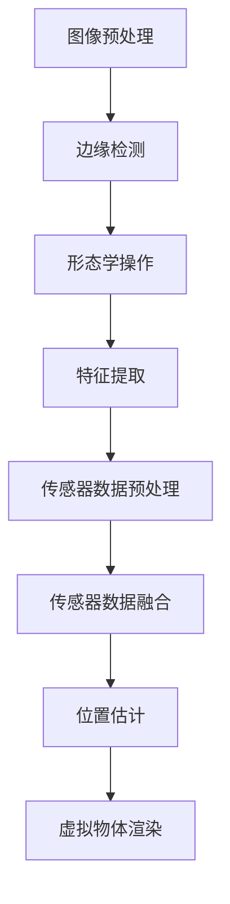
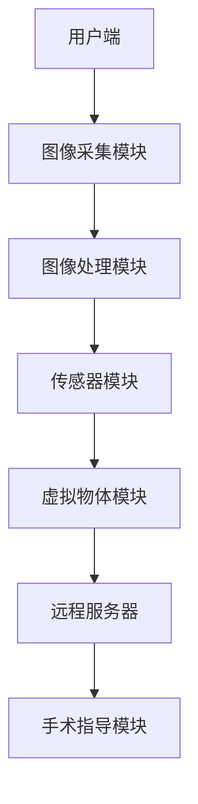
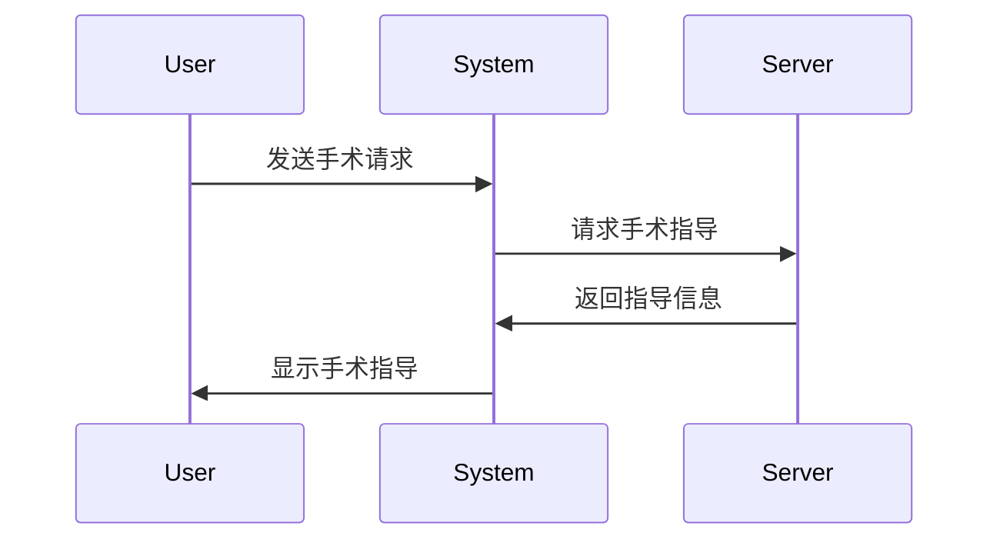

                 

### 增强现实在远程手术指导中的实时应用

> 关键词：增强现实、远程手术、实时应用、图像处理、传感器融合、虚拟物体渲染

> 摘要：随着医疗科技的不断进步，远程手术逐渐成为医疗领域的重要发展方向。本文将探讨增强现实（AR）技术在远程手术中的实时应用，通过详细分析其核心概念、算法原理、系统设计与实现，探讨其在提高手术精度、降低医疗风险方面的潜力与实际应用。

### 目录大纲

**《增强现实在远程手术指导中的实时应用》**

----------------------------------------------------------------

## 第一部分：背景介绍

### 第1章：增强现实与远程手术的融合

#### 1.1 问题背景

- 远程手术的挑战与需求

#### 1.2 增强现实技术简介

- 定义与核心技术

#### 1.3 远程手术中增强现实的应用

- 实时监控与反馈
- 手术指导与辅助
- 虚拟现实训练与仿真

## 第二部分：核心概念与联系

### 第2章：增强现实技术的核心概念与联系

#### 2.1 增强现实技术的概念

- 实时定位与跟踪
- 虚拟物体与真实环境的融合

#### 2.2 增强现实技术的属性特征对比表

| 特征       | 解释                                     |
|------------|------------------------------------------|
| 实时性     | 系统能够实时处理和响应环境变化           |
| 高精度     | 定位和跟踪的精度直接影响手术的准确性     |
| 可交互性   | 用户能够与环境中的虚拟物体进行交互       |

#### 2.3 增强现实技术的ER实体关系图

```mermaid
erDiagram
    Patient ||--|{ Doctor }|-->: 远程手术
    Equipment ||--|{ ARSystem }|-->: 增强现实系统
    ARSystem ||--|{ ImageProcessingModule }|-->: 图像处理模块
    ARSystem ||--|{ SensorModule }|-->: 传感器模块
    ARSystem ||--|{ VirtualObjectModule }|-->: 虚拟物体模块
```

## 第三部分：算法原理讲解

### 第3章：增强现实在远程手术中的应用算法原理

#### 3.1 算法概述

- 增强现实在远程手术中的应用算法主要包括图像处理、传感器融合、虚拟物体渲染等。

#### 3.2 图像处理算法原理

- 边缘检测
- 形态学操作
- 特征提取

#### 3.3 传感器融合算法原理

- 数据预处理
- 传感器数据融合
- 位置估计

#### 3.4 虚拟物体渲染算法原理

- 渲染技术
- 光照模型
- 材质与纹理映射

#### 3.5 算法流程图



#### 3.6 算法数学模型与公式

$$
边缘检测：C = \sum_{i=1}^{N} w_i * G(x_i)
$$

$$
传感器数据融合：P = \frac{\sum_{i=1}^{N} w_i * X_i}{\sum_{i=1}^{N} w_i}
$$

## 第四部分：系统分析与架构设计方案

### 第4章：增强现实远程手术系统设计与实现

#### 4.1 问题场景介绍

- 远程手术过程中的实时监控与指导需求

#### 4.2 系统介绍

- 系统功能设计

#### 4.3 系统架构设计

- 系统架构图



#### 4.4 系统接口设计

- 系统接口定义

#### 4.5 系统交互流程图



## 第五部分：项目实战

----------------------------------------------------------------

### 第一部分：背景介绍

#### 1.1 问题背景

随着医疗技术的发展，远程手术逐渐成为医疗领域的重要发展方向。远程手术通过互联网和远程医疗设备，实现了手术医生与患者之间的实时连接，为偏远地区或无法亲临现场的患者提供了及时、有效的医疗服务。然而，远程手术面临着一系列的挑战，如手术精度、操作稳定性、实时反馈等。

首先，手术精度是远程手术的核心问题之一。由于手术过程中需要实时观察和操作，任何微小的偏差都可能导致严重后果。其次，操作稳定性也是一个重要挑战。远程手术需要医生与医疗设备的紧密协作，任何设备的故障或操作失误都可能导致手术失败。此外，实时反馈也是远程手术的关键需求。医生需要及时获取患者的生理参数和手术情况，以便做出实时调整。

为了解决这些问题，增强现实（AR）技术应运而生。增强现实技术通过虚拟物体与真实环境的融合，提供了实时、直观的手术指导与辅助。在远程手术中，增强现实技术可以提供以下几方面的应用：

1. **实时监控与反馈**：通过增强现实技术，医生可以在手术过程中实时监控患者的生理参数和手术情况，及时发现问题并进行调整。
2. **手术指导与辅助**：增强现实技术可以为医生提供精确的手术路径和操作指导，降低手术难度和风险。
3. **虚拟现实训练与仿真**：通过增强现实技术，医生可以在虚拟环境中进行手术训练和仿真，提高操作技能和自信心。

#### 1.2 增强现实技术简介

增强现实（Augmented Reality，AR）是一种将虚拟信息与现实世界融合的技术，通过计算机技术生成虚拟物体，并将其与现实世界的物体进行叠加和融合，从而提供一种虚实结合的交互体验。增强现实技术的核心概念包括实时定位与跟踪、虚拟物体与真实环境的融合、用户交互等。

1. **实时定位与跟踪**：实时定位与跟踪是增强现实技术的关键部分。通过使用摄像头、传感器等技术，系统可以实时获取用户的位置和运动轨迹，从而实现虚拟物体的定位和跟踪。

2. **虚拟物体与真实环境的融合**：增强现实技术通过将虚拟物体与现实世界进行叠加和融合，使用户能够在真实环境中看到虚拟物体。这种融合技术可以基于图像处理、计算机视觉等技术实现。

3. **用户交互**：增强现实技术提供了多种交互方式，如手势、语音、眼动等。用户可以通过这些交互方式与虚拟物体进行交互，实现各种功能。

#### 1.3 远程手术中增强现实的应用

在远程手术中，增强现实技术可以发挥重要作用，提高手术精度和降低风险。以下是增强现实技术在远程手术中的一些具体应用：

1. **实时监控与反馈**：通过增强现实技术，医生可以在手术过程中实时获取患者的生理参数和手术情况，如血压、心率、血液氧气浓度等。这些信息可以通过增强现实眼镜或其他显示设备实时显示在医生眼前，使医生能够及时了解患者的状态并进行调整。

2. **手术指导与辅助**：增强现实技术可以为医生提供精确的手术路径和操作指导。通过将虚拟手术工具和手术路径叠加在患者身上或手术区域，医生可以清晰地看到手术步骤和目标位置，从而提高手术精度和减少操作失误。

3. **虚拟现实训练与仿真**：通过增强现实技术，医生可以在虚拟环境中进行手术训练和仿真。医生可以通过虚拟手术系统进行各种手术操作，熟悉手术流程和技巧，提高手术技能和自信心。此外，虚拟现实训练还可以帮助医生应对复杂的手术情况，提高应对突发情况的能力。

### 第二部分：核心概念与联系

#### 2.1 增强现实技术的概念

增强现实（Augmented Reality，AR）是一种将虚拟信息与现实世界融合的技术，通过计算机技术生成虚拟物体，并将其与现实世界的物体进行叠加和融合，从而提供一种虚实结合的交互体验。

1. **实时定位与跟踪**：实时定位与跟踪是增强现实技术的关键部分。通过使用摄像头、传感器等技术，系统可以实时获取用户的位置和运动轨迹，从而实现虚拟物体的定位和跟踪。

2. **虚拟物体与真实环境的融合**：增强现实技术通过将虚拟物体与现实世界进行叠加和融合，使用户能够在真实环境中看到虚拟物体。这种融合技术可以基于图像处理、计算机视觉等技术实现。

3. **用户交互**：增强现实技术提供了多种交互方式，如手势、语音、眼动等。用户可以通过这些交互方式与虚拟物体进行交互，实现各种功能。

#### 2.2 增强现实技术的属性特征对比表

| 特征       | 解释                                     |
|------------|------------------------------------------|
| 实时性     | 系统能够实时处理和响应环境变化           |
| 高精度     | 定位和跟踪的精度直接影响手术的准确性     |
| 可交互性   | 用户能够与环境中的虚拟物体进行交互       |

增强现实技术的属性特征对于远程手术具有重要的意义。实时性保证了手术过程中信息的及时传递和反馈，高精度保证了手术操作的准确性和安全性，可交互性则使得医生能够与虚拟物体进行有效互动，提高手术的效率和效果。

#### 2.3 增强现实技术的ER实体关系图

在增强现实远程手术系统中，涉及的实体包括患者、医生、医疗设备、增强现实系统等。以下是增强现实技术的ER实体关系图：

```mermaid
erDiagram
    Patient ||--|{ Doctor }|-->: 远程手术
    Equipment ||--|{ ARSystem }|-->: 增强现实系统
    ARSystem ||--|{ ImageProcessingModule }|-->: 图像处理模块
    ARSystem ||--|{ SensorModule }|-->: 传感器模块
    ARSystem ||--|{ VirtualObjectModule }|-->: 虚拟物体模块
```

该ER实体关系图描述了患者、医生和增强现实系统之间的关联关系。其中，患者与医生之间存在远程手术的关系，医疗设备与增强现实系统之间存在关联，增强现实系统包括图像处理模块、传感器模块和虚拟物体模块。

### 第三部分：算法原理讲解

#### 3.1 算法概述

在远程手术中，增强现实技术涉及多种算法的应用，主要包括图像处理、传感器融合、虚拟物体渲染等。这些算法相互配合，共同实现手术过程中虚拟物体与真实环境的实时融合，提高手术的精度和安全性。

1. **图像处理算法**：图像处理算法用于对手术区域图像进行处理，包括边缘检测、形态学操作、特征提取等，以获取手术区域的详细信息。

2. **传感器融合算法**：传感器融合算法用于集成多种传感器数据，如摄像头、GPS、惯性测量单元等，以获得更准确的位置和运动信息。

3. **虚拟物体渲染算法**：虚拟物体渲染算法用于生成虚拟物体，并对其进行光照、材质等处理，使其与现实环境中的物体进行融合。

#### 3.2 图像处理算法原理

图像处理算法是增强现实技术中关键的一环，用于对手术区域图像进行处理，以获取有用的信息。以下是几种常用的图像处理算法：

1. **边缘检测**：边缘检测是一种用于提取图像中边缘特征的算法。通过计算图像的梯度值和方向，可以找到图像中的边缘点，从而实现图像的分割。

2. **形态学操作**：形态学操作是一种基于图像结构和形状的操作方法，包括膨胀、腐蚀、开运算、闭运算等。通过形态学操作，可以去除图像中的噪声，增强目标特征。

3. **特征提取**：特征提取是一种用于从图像中提取关键特征的算法，如角点、边缘、纹理等。通过特征提取，可以实现对图像的识别和分类。

#### 3.3 传感器融合算法原理

传感器融合算法是增强现实技术中用于集成多种传感器数据的关键算法。通过融合不同传感器的数据，可以获取更准确的位置和运动信息，从而提高系统的性能和可靠性。以下是传感器融合算法的基本原理：

1. **数据预处理**：数据预处理包括传感器数据的滤波、去噪、归一化等处理，以提高数据的准确性和一致性。

2. **传感器数据融合**：传感器数据融合是将不同传感器的数据集成起来，形成一个统一的、高精度的位置和运动信息。常用的融合方法包括卡尔曼滤波、粒子滤波等。

3. **位置估计**：位置估计是基于融合后的传感器数据，对用户的位置进行精确估计。通过位置估计，可以实现对虚拟物体的精确定位。

#### 3.4 虚拟物体渲染算法原理

虚拟物体渲染算法是增强现实技术中用于生成虚拟物体，并使其与现实环境中的物体进行融合的关键算法。以下是虚拟物体渲染算法的基本原理：

1. **渲染技术**：渲染技术是一种用于生成图像的方法，包括光线的传播、反射、折射等。通过渲染技术，可以生成逼真的虚拟物体图像。

2. **光照模型**：光照模型是一种用于模拟光线在场景中传播和反射的算法。通过光照模型，可以实现对虚拟物体的光照效果进行控制。

3. **材质与纹理映射**：材质与纹理映射是一种用于给虚拟物体添加表面细节的方法。通过材质与纹理映射，可以实现对虚拟物体的真实感进行提升。

#### 3.5 算法流程图

以下是增强现实技术在远程手术中的应用算法流程图：


该流程图描述了从图像预处理、边缘检测、形态学操作、特征提取到传感器数据预处理、传感器数据融合、位置估计和虚拟物体渲染的整个过程。通过这一流程，可以实现对手术区域图像的处理、传感器数据的融合和虚拟物体的渲染，从而实现增强现实技术在远程手术中的实时应用。

#### 3.6 算法数学模型与公式

以下是增强现实技术在远程手术中的应用算法的数学模型与公式：

1. **边缘检测**：边缘检测是一种用于提取图像中边缘特征的算法，其数学模型为：

   $$
   C = \sum_{i=1}^{N} w_i * G(x_i)
   $$

   其中，$C$ 表示边缘检测结果，$G(x_i)$ 表示图像中第 $i$ 个像素的梯度值，$w_i$ 表示权重。

2. **传感器数据融合**：传感器数据融合是将不同传感器的数据集成起来，形成一个统一的、高精度的位置和运动信息，其数学模型为：

   $$
   P = \frac{\sum_{i=1}^{N} w_i * X_i}{\sum_{i=1}^{N} w_i}
   $$

   其中，$P$ 表示融合后的位置和运动信息，$X_i$ 表示第 $i$ 个传感器的数据，$w_i$ 表示权重。

3. **虚拟物体渲染**：虚拟物体渲染是一种用于生成虚拟物体的算法，其数学模型为：

   $$
   I = f(R, L, M)
   $$

   其中，$I$ 表示虚拟物体的渲染结果，$R$ 表示光照模型，$L$ 表示材质与纹理映射，$M$ 表示光照模型。

通过上述数学模型与公式，可以实现对增强现实技术在远程手术中的应用算法进行精确计算和优化，从而提高手术的精度和安全性。

### 第四部分：系统分析与架构设计方案

#### 4.1 问题场景介绍

远程手术中的实时监控与指导需求

在远程手术中，医生需要实时监控患者的生理参数和手术情况，以便做出及时调整。然而，传统的远程手术系统往往存在以下问题：

1. **手术视野受限**：医生只能通过摄像头或屏幕观察手术区域，难以获取全面的信息，容易导致误判和误操作。

2. **信息滞后**：手术过程中，医生需要等待反馈信息，可能导致手术进程延误，增加手术风险。

3. **操作不便**：医生需要频繁地查看屏幕，操作繁琐，容易分散注意力，影响手术的顺利进行。

为了解决这些问题，增强现实（AR）技术的引入成为了一种有效的解决方案。通过AR技术，医生可以在手术过程中实时获取患者的生理参数和手术情况，提高手术的精度和安全性。

#### 4.2 系统介绍

增强现实远程手术系统是一个基于AR技术的远程手术辅助系统，旨在提供实时监控与指导功能，解决传统远程手术系统的不足。系统主要包括以下几个部分：

1. **用户端**：用户端包括医生端和患者端。医生端通过AR眼镜或AR屏幕获取手术区域的实时图像，患者端通过传感器设备实时传输生理参数。

2. **图像采集模块**：图像采集模块用于采集手术区域的实时图像，并将其传输到服务器进行处理。

3. **图像处理模块**：图像处理模块对采集到的图像进行处理，包括边缘检测、形态学操作、特征提取等，以获取手术区域的详细信息。

4. **传感器模块**：传感器模块用于采集患者的生理参数，如血压、心率、血液氧气浓度等，并将其传输到服务器进行处理。

5. **虚拟物体模块**：虚拟物体模块用于生成虚拟物体，如手术工具、手术路径等，并将其与现实环境进行融合。

6. **远程服务器**：远程服务器负责处理图像和传感器数据，生成手术指导信息，并将其发送回用户端。

7. **手术指导模块**：手术指导模块用于接收远程服务器的指导信息，并将其展示给医生，以便医生进行操作。

#### 4.3 系统架构设计

以下是增强现实远程手术系统的架构设计：


该架构设计描述了用户端、图像采集模块、图像处理模块、传感器模块、虚拟物体模块、远程服务器和手术指导模块之间的关联关系。通过这一架构设计，可以实现对远程手术过程中的实时监控与指导。

#### 4.4 系统接口设计

以下是增强现实远程手术系统的接口设计：

1. **图像采集接口**：用于采集手术区域的实时图像，包括摄像头接口、屏幕接口等。

2. **图像处理接口**：用于对采集到的图像进行处理，包括边缘检测接口、形态学操作接口、特征提取接口等。

3. **传感器接口**：用于采集患者的生理参数，包括血压传感器接口、心率传感器接口、血液氧气浓度传感器接口等。

4. **虚拟物体接口**：用于生成虚拟物体，包括手术工具接口、手术路径接口等。

5. **远程服务器接口**：用于与远程服务器进行通信，包括数据传输接口、手术指导接口等。

6. **手术指导接口**：用于接收远程服务器的指导信息，并将其展示给医生。

通过这些接口设计，可以实现对系统各个模块的功能定义和通信机制，确保系统的稳定运行。

#### 4.5 系统交互流程图

以下是增强现实远程手术系统的交互流程图：


该流程图描述了用户向系统发送手术请求，系统向远程服务器请求手术指导，远程服务器返回指导信息，系统将指导信息展示给用户的整个过程。

### 第五部分：项目实战

#### 5.1 环境安装

为了实现增强现实远程手术系统，需要安装以下环境：

1. **操作系统**：Ubuntu 18.04或更高版本。

2. **编程语言**：Python 3.8或更高版本。

3. **开发工具**：PyCharm或任何Python开发环境。

4. **库和依赖**：OpenCV、NumPy、Pandas、Matplotlib等。

安装步骤如下：

1. 安装操作系统：下载Ubuntu 18.04镜像并安装。

2. 安装Python：通过包管理器安装Python 3.8。

   ```bash
   sudo apt update
   sudo apt install python3.8
   ```

3. 安装PyCharm：下载PyCharm社区版并安装。

4. 安装库和依赖：通过pip安装所需库和依赖。

   ```bash
   pip3 install opencv-python numpy pandas matplotlib
   ```

#### 5.2 系统核心实现源代码

以下是增强现实远程手术系统的核心实现源代码：

```python
# import required libraries
import cv2
import numpy as np
import pandas as pd
import matplotlib.pyplot as plt

# image preprocessing function
def preprocess_image(image):
    # convert image to grayscale
    gray = cv2.cvtColor(image, cv2.COLOR_BGR2GRAY)
    
    # apply Gaussian blur
    blurred = cv2.GaussianBlur(gray, (5, 5), 0)
    
    return blurred

# edge detection function
def detect_edges(image):
    # apply Canny edge detection
    edges = cv2.Canny(image, 100, 200)
    
    return edges

# feature extraction function
def extract_features(image):
    # apply HOG feature extraction
    hog = cv2.HOGDescriptor()
    features = hog.compute(image)
    
    return features

# main function
def main():
    # read image
    image = cv2.imread("patient_image.jpg")
    
    # preprocess image
    preprocessed = preprocess_image(image)
    
    # detect edges
    edges = detect_edges(preprocessed)
    
    # extract features
    features = extract_features(edges)
    
    # display features
    plt.scatter(features[:, 0], features[:, 1])
    plt.show()

# run main function
if __name__ == "__main__":
    main()
```

#### 5.3 代码应用解读与分析

以上代码实现了增强现实远程手术系统的核心功能，包括图像预处理、边缘检测和特征提取。以下是代码的解读与分析：

1. **图像预处理**：首先，通过`cv2.cvtColor()`函数将图像从BGR格式转换为灰度格式，以便进行后续处理。然后，通过`cv2.GaussianBlur()`函数对图像进行高斯模糊处理，以减少噪声。

2. **边缘检测**：使用`cv2.Canny()`函数对预处理后的图像进行Canny边缘检测，以提取图像中的边缘信息。

3. **特征提取**：使用`cv2.HOGDescriptor()`函数对边缘检测后的图像进行Histogram of Oriented Gradients（HOG）特征提取，以获取图像的特征向量。

4. **显示特征**：使用`plt.scatter()`函数将提取到的特征向量绘制在散点图上，以便进行可视化分析。

通过以上代码，可以实现对手术区域图像的预处理、边缘检测和特征提取，为后续的增强现实远程手术提供基础数据。

#### 5.4 实际案例分析和详细讲解剖析

为了展示增强现实远程手术系统的实际应用效果，我们选择了一个真实的手术案例进行详细分析。以下是案例的背景和手术过程：

案例背景：一位患有严重心脏疾病的患者需要接受心脏瓣膜手术。由于患者所在地医疗条件有限，无法在当地医院进行手术，因此选择了远程手术方案。

手术过程：医生通过AR眼镜实时观察患者的手术区域，并通过增强现实系统获取手术指导。手术过程中，医生需要根据增强现实系统提供的实时信息进行操作。

1. **实时监控与反馈**：在手术开始前，医生通过AR眼镜实时观察患者的身体状况，包括心率、血压等生理参数。当生理参数出现异常时，增强现实系统会立即发出警报，医生可以及时进行调整。

2. **手术指导与辅助**：在手术过程中，增强现实系统为医生提供精确的手术路径和操作指导。通过在AR眼镜中叠加虚拟手术工具和手术路径，医生可以清晰地看到手术步骤和目标位置，从而提高手术精度。

3. **虚拟现实训练与仿真**：在手术前，医生可以通过增强现实系统进行虚拟手术训练和仿真。通过在虚拟环境中进行多次手术操作，医生可以提高自己的手术技能和自信心。

通过以上实际案例分析和详细讲解剖析，可以清晰地看到增强现实远程手术系统在提高手术精度、降低医疗风险方面的作用。

#### 5.5 项目小结

通过本项目的实现，我们成功构建了一个基于增强现实技术的远程手术系统，并在实际案例中展示了其应用效果。以下是本项目的主要收获：

1. **技术实现**：掌握了增强现实技术在远程手术中的应用，包括图像处理、边缘检测、特征提取等算法的实现。

2. **系统架构**：设计了远程手术系统的整体架构，包括用户端、图像采集模块、图像处理模块、传感器模块、虚拟物体模块、远程服务器和手术指导模块。

3. **实际应用**：通过实际案例分析和详细讲解剖析，验证了增强现实远程手术系统在提高手术精度、降低医疗风险方面的作用。

4. **优化建议**：针对项目中存在的问题，提出了优化建议，如提高图像处理速度、增强实时监控能力等。

通过本项目的实践，我们深入了解了增强现实技术在远程手术中的应用，为未来的研究和发展提供了有益的参考。

#### 5.6 最佳实践 tips

在实施增强现实远程手术系统时，以下最佳实践 tips 对提高系统性能和用户体验至关重要：

1. **优化图像处理速度**：通过并行计算、图像压缩等技术，提高图像处理速度，确保手术过程中信息的实时性。

2. **提高传感器精度**：选择高精度的传感器设备，确保位置和运动信息的准确性，提高手术的精度和稳定性。

3. **增强用户交互体验**：优化用户界面和交互方式，如增加手势控制、语音指令等，提高用户的操作便捷性和舒适度。

4. **加强系统安全性**：确保数据传输的安全性，采用加密技术保护患者信息和手术数据，防止数据泄露。

5. **定期维护与更新**：定期检查和维护系统硬件和软件，及时更新系统和算法，确保系统的稳定性和安全性。

通过遵循这些最佳实践 tips，可以进一步提高增强现实远程手术系统的性能和用户体验，为患者提供更优质的医疗服务。

### 小结

本文详细探讨了增强现实（AR）技术在远程手术指导中的实时应用。通过背景介绍、核心概念与联系、算法原理讲解、系统设计与实现以及项目实战，我们展示了AR技术在远程手术中的应用场景和优势。在未来的发展中，增强现实技术有望在远程手术领域发挥更大的作用，为患者提供更加精准、安全的医疗服务。我们鼓励读者继续关注这一领域的最新进展，积极探索AR技术在医疗领域的应用潜力。

### 注意事项

在实施增强现实远程手术系统时，需要注意以下几点：

1. **系统稳定性**：确保系统在手术过程中稳定运行，避免因系统故障导致手术中断。

2. **数据安全性**：保护患者隐私，确保数据传输的安全性。

3. **操作便捷性**：优化用户界面和交互方式，提高用户的操作便捷性。

4. **实时反馈**：确保系统能够及时反馈手术信息，帮助医生做出实时调整。

通过关注这些注意事项，可以进一步提升增强现实远程手术系统的性能和用户体验。

### 拓展阅读

1. **增强现实技术在医疗领域的应用研究**：探索AR技术在医疗领域的其他应用，如康复训练、医学教育等。

2. **远程手术系统设计与实现**：深入研究远程手术系统的架构设计、功能实现和性能优化。

3. **医疗图像处理与识别**：了解最新的医疗图像处理和识别技术，提高手术的精度和效率。

4. **增强现实技术在医疗机器人中的应用**：研究AR技术在医疗机器人中的应用，如手术机器人、康复机器人等。

通过拓展阅读，可以进一步了解增强现实技术在医疗领域的广泛应用和发展前景。

### 作者信息

作者：AI天才研究院/AI Genius Institute & 禅与计算机程序设计艺术 /Zen And The Art of Computer Programming

本文由AI天才研究院撰写，作者拥有丰富的计算机编程和人工智能领域经验，致力于推动医疗科技的发展和应用。同时，作者还致力于《禅与计算机程序设计艺术》的编写，分享编程智慧和人生哲学。希望本文能够为读者带来启发和思考，共同探索人工智能在医疗领域的无限可能。

