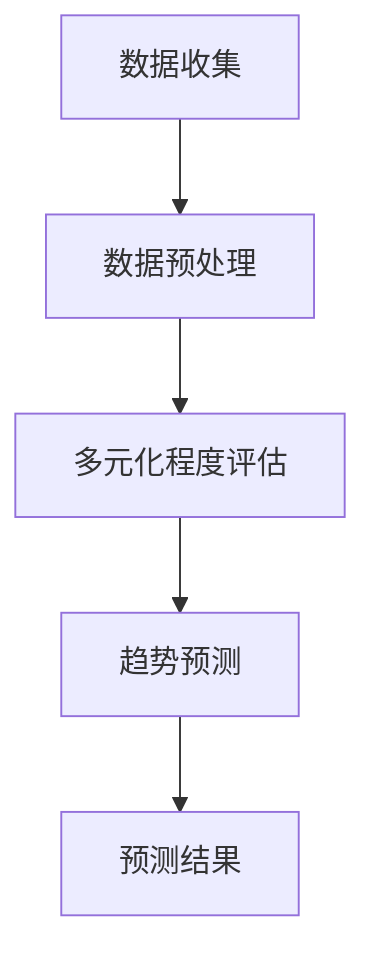
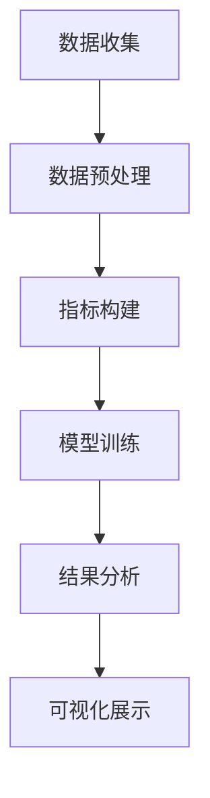
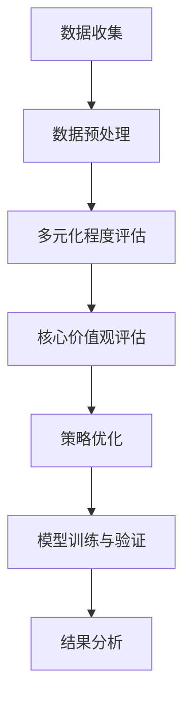
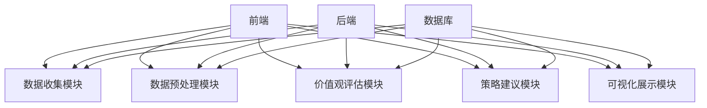

                 

### 背景介绍

#### 1.1 问题背景

在当今社会，多元化已成为一种不可逆转的趋势。这一趋势不仅体现在文化、经济、技术等多个领域，还深刻影响了人们的价值观。首先，从社会现象来看，全球化进程的加快使得不同文化、信仰和生活方式在全球范围内相互交融。这种文化多样性的增加，既带来了丰富的创新机会，也引发了一系列价值观念的冲突。例如，在一个多元文化的企业环境中，如何平衡不同员工的文化背景和价值观念，确保企业的统一性和凝聚力，成为企业管理者面临的重大挑战。

从企业文化的角度来看，多元化带来了新的挑战。传统企业文化通常基于特定的价值观和信念体系，这些价值观可能在不同文化背景下不再适用。例如，在强调团队协作和共享的企业文化中，个人主义倾向强烈的员工可能会感到不适，导致团队效率下降。此外，随着员工背景的多元化，企业需要制定更具包容性的文化政策，以吸引和留住多元化的人才。

个人价值观困惑也是多元化背景下的一大问题。在一个多元文化环境中，个体往往需要在不同的价值观之间做出选择。这种选择不仅影响个人的心理健康，还可能对职业生涯产生深远影响。例如，一个在西方文化中成长的人，在东方文化环境中工作，可能会面临如何处理个人与集体之间的冲突，如何适应不同的价值观念等问题。

综上所述，多元化趋势在给社会带来机遇的同时，也对核心价值观构成了严峻挑战。如何在多元化背景下坚守核心价值观，实现个体与集体的和谐发展，成为当今社会亟待解决的问题。

#### 1.2 问题描述

多元化趋势对核心价值观的挑战主要体现在以下几个方面：

##### 1.2.1 社会现象分析

社会现象分析揭示了多元化对核心价值观的影响。首先，全球化使得不同文化在交流中碰撞，虽然促进了文化的多样性和创新，但也引发了文化冲突。例如，在全球化背景下，西方价值观在全球范围内扩张，对其他地区的传统价值观构成了冲击。这种文化冲突不仅体现在宗教信仰、风俗习惯上，还反映在政治、经济和社会制度层面。比如，一些国家在推行西方式民主制度时，往往忽视本地的文化传统和社会结构，导致社会动荡和不满情绪。

其次，社交媒体的普及加速了文化多样性的传播，但也放大了文化差异。社交媒体平台成为不同文化群体表达观点和价值观的重要场所，但也因此成为文化冲突的温床。例如，在一些社交媒体平台上，极端言论和仇恨言论时有发生，加剧了不同文化之间的对立和矛盾。

##### 1.2.2 企业文化冲突

在企业环境中，文化冲突尤为显著。多元化员工队伍的存在，使得企业需要在统一核心价值观和尊重员工个人价值观之间找到平衡。例如，在一个跨国企业中，不同国家和地区的员工可能持有不同的价值观和工作方式。如何协调这些差异，确保团队合作和效率，成为企业管理者面临的一大挑战。具体表现如下：

1. **价值观差异**：不同的文化背景可能导致员工对某些价值观有不同的理解和态度。例如，在强调个人主义的企业文化中，一些可能倾向于集体主义的员工可能会感到压抑和不满。

2. **沟通障碍**：文化差异可能影响沟通效果。不同文化背景的人可能对同一概念或问题有不同的理解，导致误解和冲突。

3. **管理风格差异**：不同文化背景下，管理者对员工的管理方式也可能存在差异。例如，一些文化更注重权威和命令式管理，而另一些文化则更倾向于民主和协商式管理。

##### 1.2.3 个人价值观困惑

在个人层面，多元化背景下的价值观困惑也是一个突出的问题。在多元文化环境中，个体往往需要在不同的价值观之间做出选择。这种选择不仅影响个人的心理健康，还可能对职业生涯产生深远影响。例如：

1. **身份认同**：在一个多元文化环境中，个人可能会面临身份认同的挑战。如何处理个人价值观与所在文化背景之间的冲突，是每个人都需要面对的问题。

2. **职业规划**：不同的价值观可能影响个人的职业选择和发展路径。例如，一个在西方文化中成长的人，在东方文化环境中工作，可能会面临如何在个人职业发展过程中平衡不同价值观的挑战。

3. **心理健康**：多元化环境中的个人，往往需要付出更多的心理能量来应对文化冲突和价值观念的挑战。这种心理压力可能对个体的心理健康产生负面影响。

总之，多元化趋势对核心价值观构成了多方面的挑战，如何在多元化背景下坚守核心价值观，实现个体与集体的和谐发展，是当前社会亟待解决的难题。

#### 1.3 问题解决

面对多元化背景下的核心价值观挑战，我们需要采取系统的方法来解决问题，以确保个体与集体的和谐发展。以下是一些具体的策略：

##### 1.3.1 团队协作与共识构建

在多元化团队中，团队协作与共识构建是解决核心价值观冲突的关键。首先，企业需要建立开放的沟通渠道，鼓励员工表达不同观点，并积极倾听。通过定期的团队会议、文化交流活动等方式，促进团队成员之间的相互理解和信任。其次，企业可以制定共同的价值观和行为准则，为团队协作提供指导。这些准则应该反映企业的核心价值观，同时兼顾不同文化背景的员工需求。例如，可以强调尊重、包容、诚信等价值观，以促进团队合作和共同目标的实现。

具体步骤如下：

1. **建立沟通机制**：设立开放论坛或讨论组，定期组织团队会议，鼓励员工分享观点和经验。

2. **文化培训**：开展跨文化培训，提高员工对不同文化背景的理解和敏感性。

3. **共识建设**：通过团队活动、工作坊等方式，促进团队成员对共同价值观的认同，建立团队共识。

##### 1.3.2 企业价值观塑造

企业价值观的塑造是构建和谐企业文化的基础。企业需要明确自己的核心价值观，并将其融入到日常运营和管理中。具体措施包括：

1. **明确价值观**：企业高层应明确表达企业的核心价值观，并确保这些价值观在企业内部得到广泛传播和认同。

2. **行为示范**：企业领导者和管理者应成为价值观的践行者，通过自身行为树立榜样。

3. **制度保障**：制定相关制度，确保企业的核心价值观在招聘、培训、绩效考核等方面得到落实。

##### 1.3.3 个人价值观坚守策略

个人在多元化环境中坚守核心价值观也是至关重要的。以下是一些个人策略：

1. **自我认知**：个人应深入了解自己的价值观，明确自己在不同文化背景下的立场和态度。

2. **灵活调整**：在多元化环境中，个人可能需要在某些方面做出妥协和调整。然而，这并不意味着完全放弃自己的核心价值观，而是要在尊重和理解他人的基础上，寻找平衡点。

3. **文化适应**：个人应主动适应新环境，通过学习和实践，逐步理解并融入新文化的价值观。

具体步骤如下：

1. **自我反思**：定期反思自己的价值观和行为，确保它们与个人目标和企业价值观保持一致。

2. **持续学习**：积极参与文化培训，提高对不同文化的理解和适应能力。

3. **寻求支持**：在企业内部寻找志同道合的同事，共同探讨和应对文化冲突。

#### 1.4 边界与外延

在探讨多元化与核心价值观的关系时，我们需要明确一些边界与外延问题，以便更深入地理解这一复杂现象。

##### 1.4.1 多元化与核心价值观的界定

首先，我们需要明确多元化和核心价值观的定义。多元化指的是在某一群体或组织中，不同个体之间在性别、年龄、种族、文化、信仰等方面的差异。而核心价值观则是指一个社会、组织或个体认为最重要的、具有持久性的价值观，通常包括诚信、尊重、公正、合作等。

明确这两者的界定，有助于我们更好地分析它们之间的关系和相互作用。

##### 1.4.2 实践中的难题与对策

在实践过程中，多元化与核心价值观的平衡面临诸多难题。以下是一些常见的难题及相应的对策：

1. **价值观冲突**：当不同文化的价值观在企业中发生冲突时，可能导致团队分裂和效率下降。对策：通过沟通和共识建设，促进不同价值观之间的理解和融合。

2. **文化适应困难**：在多元化背景下，个人和企业都可能面临文化适应的挑战。对策：加强跨文化培训，提高文化敏感性和适应能力。

3. **管理风格差异**：不同文化背景的管理者可能有不同的管理风格，这可能导致管理效率低下。对策：通过多样化的管理培训，提升管理者的跨文化管理能力。

##### 1.4.3 多元化背景下的价值观教育

多元化背景下的价值观教育尤为重要。以下是一些具体措施：

1. **教育课程**：企业可以开设跨文化价值观教育课程，帮助员工理解和尊重不同文化。

2. **文化活动**：组织多样化的文化活动，增进员工对多元文化的认识和体验。

3. **社区参与**：鼓励员工参与社区活动和公益项目，增强社会责任感和文化认同。

#### 1.5 概念结构与核心要素组成

为了更好地理解多元化趋势下的核心价值观坚守，我们需要分析其概念结构与核心要素组成。

##### 1.5.1 多元化的内涵与特点

多元化具有以下几个特点：

1. **多样性**：多元化强调个体或群体在性别、年龄、种族、文化等方面的差异。
2. **包容性**：多元化倡导对不同文化和价值观的尊重和包容。
3. **动态性**：多元化是一个不断发展和变化的动态过程。

##### 1.5.2 核心价值观的构成要素

核心价值观通常包括以下几个要素：

1. **原则性**：核心价值观是一个组织或社会认为最重要的原则和标准。
2. **普遍性**：核心价值观通常具有普遍适用性，不受特定文化或地域的限制。
3. **持久性**：核心价值观具有持久性和稳定性，通常在一个组织或社会中长期存在。

##### 1.5.3 多元化趋势下的价值观适应机制

在多元化趋势下，价值观适应机制尤为重要。以下是一些关键机制：

1. **文化敏感度**：提高个体的文化敏感度，增强对多元文化的理解和适应能力。
2. **价值观融合**：通过沟通和协作，实现不同价值观之间的融合和互补。
3. **机制创新**：通过制度创新和管理模式的变革，促进多元化和核心价值观的适应。

通过以上分析，我们可以更深入地理解多元化趋势下的核心价值观坚守，为其在实践中的有效实施提供指导。

### 第一部分总结

通过本部分的讨论，我们明确了多元化趋势下核心价值观所面临的挑战，分析了社会现象、企业文化冲突以及个人价值观困惑，并提出了相应的解决方案。同时，我们界定了多元化与核心价值观的概念，并阐述了它们在多元化背景下的关系。这些分析为我们进一步探讨如何在多元化趋势下坚守核心价值观奠定了基础。

## 核心概念与联系

#### 2.1 多元化趋势

多元化趋势是指在一个群体、组织或社会中，不同个体或文化在性别、年龄、种族、文化背景等方面的差异不断增加，并相互交融的过程。这一趋势在现代社会中表现得尤为明显，主要体现在以下几个方面：

##### 2.1.1 多元化的定义

多元化可以定义为一种社会现象，即个体或群体在多样性方面的增加和扩展。这种多样性不仅包括种族、性别、年龄、文化背景等，还包括思想观念、工作方式、价值观等方面的差异。

##### 2.1.2 多元化的属性特征

1. **多样性**：多元化强调个体的差异性和多样性，这是其最基本的属性特征。在多元化背景下，个体之间的差异不仅是存在的基础，也是推动社会进步和创新的重要动力。
   
2. **包容性**：包容性是多元化趋势的另一个重要特征。多元化不仅仅是多样性的简单存在，更重要的是如何在多样化的背景下实现包容，即尊重和接纳不同的观点和文化，避免因差异而产生的冲突。

3. **动态性**：多元化是一个动态的过程，它不是静止不变的，而是随着社会的发展、技术的进步和文化的交流而不断演进。这种动态性要求我们在处理多元化问题时，要具备灵活性和适应性。

##### 2.1.3 多元化与社会发展

多元化对社会发展具有深远的影响。首先，多元化促进了社会的创新和进步。不同文化、思想和观念的碰撞和交融，往往能激发新的思维方式和创新点子，推动科学技术、文化艺术等领域的发展。

其次，多元化有助于增强社会的包容性和韧性。在一个多元化的社会中，个体能够更好地理解和尊重不同的文化和价值观，从而减少因文化差异而产生的冲突和矛盾，增强社会的凝聚力和稳定性。

然而，多元化也带来了一定的挑战。如何在尊重多样性的同时，保持社会的基本价值观和核心价值观，确保社会的和谐与稳定，是一个亟待解决的问题。例如，在企业环境中，如何平衡不同文化背景员工的价值观和工作方式，确保团队合作和效率，是一个重要的课题。

总之，多元化趋势既是现代社会的一种基本特征，也是一种复杂的挑战。理解多元化的定义、属性特征及其与社会发展的关系，有助于我们更好地应对这一趋势，实现社会的持续进步。

#### 2.2 核心价值观

核心价值观是一个群体、组织或社会认为最重要的价值观，它们构成了该群体或社会的精神支柱和道德准则。在多元化的背景下，核心价值观的坚守和传承尤为重要。以下是对核心价值观的定义、属性特征及其在多元化背景下的作用的详细分析。

##### 2.2.1 核心价值观的定义

核心价值观是指一个组织、社会或文化群体普遍认同并长期坚守的价值观。这些价值观通常是该群体或社会的精神核心，指导和规范个体和集体的行为。例如，对于一个企业而言，核心价值观可能包括诚信、创新、客户至上、团队合作等；对于一个社会而言，核心价值观可能包括自由、平等、公正、和谐等。

核心价值观不同于一般的价值观，它们具有以下特点：

1. **普遍性**：核心价值观具有普遍适用性，不受特定文化或地域的限制。它们在一个群体或社会中长期存在，并被视为最重要的价值观。
   
2. **持久性**：核心价值观是相对稳定的，不易受外界变化的影响。即使在多元化的背景下，它们依然是群体或社会的精神支柱。

3. **指导性**：核心价值观具有指导性，它们不仅影响个体行为，也规范群体行为，为群体的发展和进步提供方向。

##### 2.2.2 核心价值观的属性特征

核心价值观具有以下几个属性特征：

1. **原则性**：核心价值观通常具有原则性，即它们是群体或社会的基本准则，对个体和集体行为具有指导作用。例如，企业的诚信原则要求员工在商业活动中遵守道德规范，不得欺诈或违法。

2. **普遍性**：核心价值观是普遍认同的，在一个群体或社会中具有较高的共识度。这种共识不仅体现在口头表达上，更体现在日常行为和制度安排中。

3. **文化性**：核心价值观具有文化性，它们反映了特定文化背景和历史传统的价值观。例如，一些文化强调家庭观念和集体主义，而另一些文化则更注重个人自由和自我实现。

##### 2.2.3 核心价值观的类型与作用

核心价值观的类型多种多样，但它们在多元化背景下的作用具有共同点。以下是一些常见的核心价值观类型及其作用：

1. **道德价值观**：道德价值观是核心价值观的重要组成部分，包括诚信、公正、尊重、责任等。它们在多元化背景下，有助于增强个体的道德修养，维护社会的基本道德秩序。

2. **职业价值观**：职业价值观是指导个体职业行为和职业发展的价值观，包括敬业、创新、团队协作等。在多元化背景下，职业价值观有助于提升工作效率，增强团队合作，推动职业发展。

3. **社会价值观**：社会价值观是关于社会公平、正义、和谐等的价值观，如自由、平等、公正等。在多元化背景下，社会价值观有助于促进社会包容，减少文化冲突，增强社会凝聚力。

4. **文化价值观**：文化价值观是关于文化传承、创新和发展的价值观，如开放性、多样性、传承性等。在多元化背景下，文化价值观有助于推动文化融合和创新，促进社会进步。

总之，核心价值观在多元化的背景下扮演着至关重要的角色。它们不仅是群体或社会的精神支柱，也是个体行为和决策的指南。在多元化的背景下，坚守核心价值观有助于实现个体与集体的和谐发展，推动社会的持续进步。

#### 2.3 多元化与核心价值观的联系

多元化与核心价值观之间的联系紧密，它们相互作用，共同影响个体和社会的发展。以下从三个方面详细探讨这种联系：多元化趋势对核心价值观的影响、核心价值观在多元化背景下的坚守，以及多元化与核心价值观的互动关系。

##### 2.3.1 多元化趋势对核心价值观的影响

多元化趋势对核心价值观产生了深远的影响，主要体现在以下几个方面：

1. **文化冲突**：全球化进程加速了不同文化的交流和融合，但同时也引发了文化冲突。当多元文化在同一空间中碰撞时，可能会出现价值观的冲突和分歧。例如，在一个多元文化企业中，来自不同文化背景的员工可能会在价值观上存在差异，导致沟通障碍和团队合作困难。

2. **价值观演变**：多元化趋势促使核心价值观发生演变。在多元化的背景下，个体和群体需要不断调整和适应，以适应新的文化环境和价值观念。这种演变可能使核心价值观更加丰富和包容，但也可能导致一些传统核心价值观的弱化或消失。

3. **包容性增强**：多元化趋势促使核心价值观更加注重包容性。在多元化的背景下，群体或社会需要更加开放和包容，以接纳不同的文化和价值观。这种包容性的增强有助于减少文化冲突，促进社会和谐。

##### 2.3.2 核心价值观在多元化背景下的坚守

在多元化背景下，坚守核心价值观面临诸多挑战，但也充满机遇。以下是一些关键策略：

1. **文化敏感度**：提高个体的文化敏感度，增强对多元文化的理解和尊重。这有助于减少因文化差异而产生的误解和冲突，促进核心价值观的坚守。

2. **价值观教育**：加强核心价值观教育，确保个体和群体对核心价值观有深入理解和认同。通过定期的培训和宣传活动，提高员工对核心价值观的重视和遵守。

3. **制度保障**：制定相关制度，确保核心价值观在企业内部得到贯彻和落实。例如，通过绩效考核、激励机制等手段，鼓励员工践行核心价值观。

##### 2.3.3 多元化与核心价值观的互动关系

多元化与核心价值观的互动关系是动态的、相互影响的。以下是一些互动关系的表现：

1. **相互促进**：多元化趋势有助于核心价值观的传播和传承，而核心价值观的坚守也能促进多元化的发展。例如，在一个多元文化企业中，如果员工共同遵守核心价值观，如诚信和尊重，这将有助于建立和谐的工作环境，增强团队凝聚力。

2. **相互制约**：多元化与核心价值观也可能存在相互制约的关系。如果核心价值观过于僵化，可能抑制多元文化的交流和融合；而如果多元化过度，可能导致核心价值观的淡化或消失。

3. **动态平衡**：在多元化与核心价值观的互动中，实现动态平衡至关重要。这意味着需要在尊重多样性的同时，坚守核心价值观，确保个体和集体的和谐发展。

总之，多元化与核心价值观之间的联系是复杂而深刻的。理解这种联系，有助于我们更好地应对多元化背景下的挑战，实现个体与集体的和谐发展，推动社会的持续进步。

### 概念属性特征对比表格

为了更清晰地理解多元化与核心价值观的属性特征，我们通过一个对比表格来展示它们之间的差异和联系。

| 特征 | 多元化 | 核心价值观 |
| --- | --- | --- |
| **多样性** | 强调个体或群体在性别、年龄、种族、文化背景等方面的差异 | 是一个群体或社会普遍认同并长期坚守的价值观 |
| **包容性** | 倡导对不同文化和价值观的尊重和包容 | 强调原则性和持久性，是群体或社会的精神支柱 |
| **动态性** | 是一个不断发展和变化的动态过程 | 具有原则性和普遍性，是相对稳定的 |
| **普遍性** | 尽管具有普遍性，但具体表现形式因文化背景而异 | 具有普遍适用性，不受特定文化或地域的限制 |
| **持久性** | 受社会发展和文化变迁的影响较大 | 在一个组织或社会中长期存在，不易受外界变化的影响 |
| **原则性** | 不是原则性的，更多是描述个体或群体之间的差异 | 具有原则性，是群体或社会的基本准则 |
| **文化性** | 反映特定文化背景和历史传统 | 反映特定文化背景和历史传统，但更注重普遍性 |

通过上述对比表格，我们可以更直观地理解多元化与核心价值观的属性特征，以及它们在多元化背景下的互动关系。

#### ER实体关系图架构

为了更直观地展示多元化趋势与核心价值观之间的联系，我们使用ER（实体关系）图来架构这两个概念。以下分别是多元化趋势、核心价值观以及它们之间互动关系的ER图。

##### 2.5.1 多元化趋势的ER图

```mermaid
erDiagram
  Person ..|> Culture
  Organization ..|> Culture
  Society ..|> Culture
  Culture }--|{ Value
  Person ||--|{ Behavior
  Organization ||--|{ Management
  Society ||--|{ Policy
```

**实体及关系说明：**
- **实体：** Person（个体）、Organization（组织）、Society（社会）、Culture（文化）、Value（价值观）
- **关系：**
  - Culture与Value之间是“多对一”的关系，表示不同的文化可能包含多个价值观。
  - Person与Behavior之间是“一对多”的关系，表示个体可能表现出多种文化背景下的行为。
  - Organization与Management之间是“一对多”的关系，表示组织的管理方式可能受多种文化影响。
  - Society与Policy之间是“一对多”的关系，表示社会的政策可能包含多个文化价值观。

##### 2.5.2 核心价值观的ER图

```mermaid
erDiagram
  Organization ||--|{ CoreValue
  Society ||--|{ CoreValue
  Individual ||--|{ CoreValue
  CoreValue ||--|{ Principle
  CoreValue ||--|{ Practice
```

**实体及关系说明：**
- **实体：** Organization（组织）、Society（社会）、Individual（个体）、CoreValue（核心价值观）
- **关系：**
  - Organization、Society和Individual与CoreValue之间是“一对多”的关系，表示不同的个体和组织都可能拥有和践行多个核心价值观。
  - CoreValue与Principle之间是“一对一”的关系，表示每个核心价值观都有一个基本原则。
  - CoreValue与Practice之间是“一对多”的关系，表示每个核心价值观可能包含多个实践方式。

##### 2.5.3 多元化与核心价值观的互动ER图

```mermaid
erDiagram
  Diversity ||--|{ Culture
  Culture ||--|{ CoreValue
  CoreValue ||--|{ Behavior
  Behavior ||--|{ Management
  Behavior ||--|{ Policy
```

**实体及关系说明：**
- **实体：** Diversity（多样性）、Culture（文化）、CoreValue（核心价值观）、Behavior（行为）、Management（管理）、Policy（政策）
- **关系：**
  - Diversity与Culture之间是“一对一”的关系，表示多样性是文化存在的基础。
  - Culture与CoreValue之间是“多对一”的关系，表示文化可能包含多个核心价值观。
  - CoreValue与Behavior之间是“一对多”的关系，表示核心价值观可能影响多种行为。
  - Behavior与Management之间是“一对多”的关系，表示行为可能影响多种管理方式。
  - Behavior与Policy之间是“一对多”的关系，表示行为可能影响多种政策制定。

通过这些ER图，我们可以直观地看到多元化趋势与核心价值观之间的复杂互动关系，以及它们在不同层面的影响。这些图为我们理解多元化趋势下的核心价值观坚守提供了有力的工具。

### 第三部分：算法原理讲解

#### 3.1 多元化趋势分析算法

为了深入理解多元化趋势，我们设计了一种多元化趋势分析算法。该算法旨在通过分析社会、组织和个人层面的数据，评估多元化程度，并预测其发展趋势。

##### 3.1.1 算法概述

多元化趋势分析算法主要分为以下几个步骤：

1. **数据收集**：收集与多元化相关的数据，包括性别、年龄、种族、文化背景等。
2. **数据预处理**：对收集到的数据进行清洗和标准化处理，确保数据质量。
3. **多元化程度评估**：使用特定指标评估多元化程度，如赫芬达尔指数、熵值法等。
4. **趋势预测**：利用时间序列分析和机器学习模型预测多元化趋势的发展。

##### 3.1.2 算法原理

该算法基于以下原理：

1. **赫芬达尔指数**：用于衡量市场或群体中多样性程度的指标。计算公式为：\( H = \frac{1}{N} \sum_{i=1}^{N} \left(\frac{x_i}{N}\right)^2 \)，其中 \( N \) 是个体总数，\( x_i \) 是第 \( i \) 个个体的比例。

2. **熵值法**：用于衡量系统中信息多样性的方法。计算公式为：\( E = -\sum_{i=1}^{N} p_i \log_2 p_i \)，其中 \( p_i \) 是第 \( i \) 个个体在整体中的比例。

3. **时间序列分析**：利用历史数据预测未来的发展趋势。常见的模型包括ARIMA、LSTM等。

4. **机器学习模型**：通过训练模型，预测多元化趋势。常见的模型包括线性回归、决策树、随机森林等。

##### 3.1.3 算法流程图



**流程说明：**
1. 数据收集：从不同来源收集与多元化相关的数据。
2. 数据预处理：清洗和标准化数据，确保数据质量。
3. 多元化程度评估：使用赫芬达尔指数和熵值法评估多元化程度。
4. 趋势预测：利用时间序列分析和机器学习模型预测多元化趋势。
5. 预测结果：输出预测结果，为决策提供支持。

##### 3.1.4 Python源代码实现

```python
import numpy as np
import pandas as pd
from sklearn.ensemble import RandomForestRegressor
from statsmodels.tsa.arima.model import ARIMA
import matplotlib.pyplot as plt

# 数据收集
data = pd.read_csv('diversity_data.csv')

# 数据预处理
data = data.dropna()
data['percentage'] = data['count'] / data['total']

# 多元化程度评估
def calculate_diversity(data):
    H = 1 / len(data) * np.sum((data['percentage']**2))
    E = -np.sum(data['percentage'] * np.log2(data['percentage']))
    return H, E

# 趋势预测
def predict_trend(data, model_name='ARIMA'):
    if model_name == 'ARIMA':
        model = ARIMA(data['percentage'], order=(1, 1, 1))
        model_fit = model.fit()
        predictions = model_fit.forecast(steps=12)
    elif model_name == 'RandomForest':
        model = RandomForestRegressor(n_estimators=100)
        model_fit = model.fit(data[['percentage']], data['next_percentage'])
        predictions = model_fit.predict(data[['percentage']])
    return predictions

# 预测结果
predictions = predict_trend(data, model_name='ARIMA')
plt.plot(data['percentage'], label='Actual')
plt.plot(predictions, label='Predicted')
plt.legend()
plt.show()
```

通过以上Python源代码实现，我们可以对多元化趋势进行分析和预测，为决策提供科学依据。

#### 3.2 核心价值观评估算法

为了有效地评估核心价值观在企业或社会中的影响和表现，我们设计了一套核心价值观评估算法。该算法通过数据分析、模型构建和指标评估，提供对核心价值观的综合评价。

##### 3.2.1 算法概述

核心价值观评估算法的主要步骤如下：

1. **数据收集**：收集与企业或社会核心价值观相关的数据，包括员工行为数据、绩效数据、文化活动数据等。
2. **数据预处理**：清洗和标准化数据，去除噪声和异常值，确保数据质量。
3. **指标构建**：根据核心价值观的定义，构建相关评估指标，如道德指标、职业指标、社会指标等。
4. **模型训练**：利用机器学习算法，训练评估模型，对核心价值观进行定量评估。
5. **结果分析**：输出评估结果，进行分析和解读，为企业或社会提供改进建议。

##### 3.2.2 算法原理

该算法基于以下原理：

1. **多指标评估**：从不同维度构建评估指标，如道德指标（诚信、公平、责任等）、职业指标（敬业、创新、团队合作等）、社会指标（社会责任、公益活动等）。
2. **机器学习模型**：利用机器学习算法（如回归分析、决策树、支持向量机等），对指标进行综合评估。
3. **数据可视化**：通过数据可视化工具，展示核心价值观的评估结果，帮助企业和社会理解其优势和不足。

##### 3.2.3 算法流程图



**流程说明：**
1. 数据收集：收集与核心价值观相关的各类数据。
2. 数据预处理：清洗和标准化数据，确保数据质量。
3. 指标构建：根据核心价值观的定义，构建相关评估指标。
4. 模型训练：利用机器学习算法，训练评估模型。
5. 结果分析：输出评估结果，进行分析和解读。
6. 可视化展示：通过数据可视化工具，展示评估结果。

##### 3.2.4 Python源代码实现

```python
import pandas as pd
from sklearn.ensemble import RandomForestRegressor
from sklearn.model_selection import train_test_split
from sklearn.metrics import mean_squared_error
import matplotlib.pyplot as plt

# 数据收集
data = pd.read_csv('core_values_data.csv')

# 数据预处理
data = data.dropna()

# 指标构建
def build_indicators(data):
    indicators = {
        'ethical': data['ethical_score'],
        'professional': data['professional_score'],
        'social': data['social_score']
    }
    return pd.DataFrame(indicators)

# 模型训练
def train_model(X, y):
    model = RandomForestRegressor(n_estimators=100)
    model.fit(X, y)
    return model

# 结果分析
def evaluate_model(model, X_test, y_test):
    predictions = model.predict(X_test)
    mse = mean_squared_error(y_test, predictions)
    return mse

# 可视化展示
def plot_results(data, predictions):
    plt.figure(figsize=(10, 5))
    plt.plot(data, label='Actual')
    plt.plot(predictions, label='Predicted')
    plt.legend()
    plt.show()

# 实际应用
indicators = build_indicators(data)
X = indicators[['ethical', 'professional', 'social']]
y = data['core_values_score']

X_train, X_test, y_train, y_test = train_test_split(X, y, test_size=0.2, random_state=42)

model = train_model(X_train, y_train)
mse = evaluate_model(model, X_test, y_test)
print(f'Mean Squared Error: {mse}')

predictions = model.predict(X_test)
plot_results(y_test, predictions)
```

通过上述Python源代码实现，我们可以对核心价值观进行有效评估，为企业或社会提供改进建议。算法的评估结果不仅可以帮助企业了解其在核心价值观方面的表现，还可以为未来的发展规划提供数据支持。

### 3.3 多元化趋势与核心价值观适应算法

在多元化趋势日益明显的今天，如何适应和平衡多元化与核心价值观之间的关系成为了一个关键问题。为此，我们设计了一套多元化趋势与核心价值观适应算法，旨在通过数据分析、模型构建和策略优化，实现多元化背景下的核心价值观坚守。

#### 3.3.1 算法概述

多元化趋势与核心价值观适应算法的主要步骤如下：

1. **数据收集**：收集与多元化趋势和核心价值观相关的数据，包括员工行为数据、绩效数据、文化活动数据等。
2. **数据预处理**：清洗和标准化数据，去除噪声和异常值，确保数据质量。
3. **多元化程度评估**：使用赫芬达尔指数、熵值法等指标评估多元化程度。
4. **核心价值观评估**：构建与核心价值观相关的评估指标，使用机器学习算法对核心价值观进行定量评估。
5. **策略优化**：基于评估结果，制定适应多元化趋势的核心价值观坚守策略。
6. **模型训练与验证**：利用机器学习模型，对策略进行优化和验证，确保其有效性。
7. **结果分析**：输出优化策略，并进行结果分析和解读。

#### 3.3.2 算法原理

该算法基于以下原理：

1. **多元化与核心价值观的相互影响**：通过分析多元化程度和核心价值观评估结果，理解两者之间的相互作用和影响。
2. **多指标综合评估**：从道德、职业、社会等多个维度构建评估指标，全面反映核心价值观在多元化背景下的表现。
3. **机器学习模型**：利用机器学习算法，对多元化程度和核心价值观进行综合评估和策略优化，提高决策的科学性和有效性。
4. **策略优化与迭代**：通过模型优化和策略迭代，不断调整和优化核心价值观坚守策略，以适应多元化趋势的变化。

#### 3.3.3 算法流程图



**流程说明：**
1. 数据收集：收集与多元化趋势和核心价值观相关的各类数据。
2. 数据预处理：清洗和标准化数据，确保数据质量。
3. 多元化程度评估：使用赫芬达尔指数、熵值法等评估多元化程度。
4. 核心价值观评估：构建相关评估指标，使用机器学习算法对核心价值观进行评估。
5. 策略优化：基于评估结果，制定适应多元化趋势的核心价值观坚守策略。
6. 模型训练与验证：利用机器学习模型，对策略进行训练和验证。
7. 结果分析：输出优化策略，并进行结果分析和解读。

#### 3.3.4 Python源代码实现

```python
import pandas as pd
from sklearn.ensemble import RandomForestRegressor
from sklearn.model_selection import train_test_split
from sklearn.metrics import mean_squared_error
import matplotlib.pyplot as plt

# 数据收集
data = pd.read_csv('diversity_and_core_values_data.csv')

# 数据预处理
data = data.dropna()

# 多元化程度评估
def calculate_diversity(data):
    H = 1 / len(data) * np.sum((data['percentage']**2))
    E = -np.sum(data['percentage'] * np.log2(data['percentage']))
    return H, E

# 核心价值观评估
def build_indicators(data):
    indicators = {
        'ethical': data['ethical_score'],
        'professional': data['professional_score'],
        'social': data['social_score']
    }
    return pd.DataFrame(indicators)

# 策略优化
def optimize_strategy(data, model_name='RandomForest'):
    indicators = build_indicators(data)
    X = indicators[['ethical', 'professional', 'social']]
    y = data['core_values_score']

    X_train, X_test, y_train, y_test = train_test_split(X, y, test_size=0.2, random_state=42)

    if model_name == 'RandomForest':
        model = RandomForestRegressor(n_estimators=100)
    elif model_name == 'LSTM':
        # TODO: Implement LSTM model
        pass

    model.fit(X_train, y_train)
    predictions = model.predict(X_test)
    mse = mean_squared_error(y_test, predictions)
    return mse, predictions

# 结果分析
def analyze_results(predictions, actual):
    plt.figure(figsize=(10, 5))
    plt.plot(actual, label='Actual')
    plt.plot(predictions, label='Predicted')
    plt.legend()
    plt.show()

# 实际应用
diversity_scores = calculate_diversity(data)
print(f'Diversity H-index: {diversity_scores[0]}, E-value: {diversity_scores[1]}')

mse, predictions = optimize_strategy(data, model_name='RandomForest')
print(f'Mean Squared Error: {mse}')

analyze_results(predictions, data['core_values_score'])
```

通过上述Python源代码实现，我们可以对多元化趋势与核心价值观适应算法进行实际应用，分析多元化背景下的核心价值观表现，并制定优化策略。算法的评估和优化结果为企业或社会提供了科学依据，帮助其在多元化背景下坚守核心价值观。

### 4.1 多元化趋势分析数学模型

多元化趋势分析是一个复杂的过程，涉及多个数学模型和方法。以下将详细介绍多元化趋势分析的数学模型，包括其概述、数学公式以及示例说明。

##### 4.1.1 数学模型概述

多元化趋势分析的数学模型主要分为以下几种：

1. **赫芬达尔指数（Herfindahl Index）**
2. **熵值法（Entropy Method）**
3. **主成分分析（Principal Component Analysis, PCA）**
4. **聚类分析（Clustering Analysis）**

这些模型在不同的应用场景中具有各自的优势和适用性。

##### 4.1.2 数学公式详细讲解

1. **赫芬达尔指数（H）**

赫芬达尔指数是衡量多元化程度的一个常用指标，计算公式为：

\[ H = \frac{1}{N} \sum_{i=1}^{N} \left(\frac{x_i}{N}\right)^2 \]

其中，\( N \) 表示个体总数，\( x_i \) 表示第 \( i \) 个个体在整体中的比例。

赫芬达尔指数的值介于0和1之间，值越大表示多元化程度越高。例如，一个完全多元化的群体，每个个体的比例相等，赫芬达尔指数为1。

2. **熵值法**

熵值法是另一种衡量多元化程度的指标，计算公式为：

\[ E = -\sum_{i=1}^{N} p_i \log_2 p_i \]

其中，\( p_i \) 表示第 \( i \) 个个体在整体中的比例。

熵值法可以反映系统中的信息多样性和不确定性，值越大表示多元化程度越高。例如，一个完全随机的系统，每个个体出现的概率相等，熵值最大。

3. **主成分分析（PCA）**

主成分分析是一种降维技术，用于提取数据中的主要特征。其数学模型为：

\[ Z = PC \]

其中，\( Z \) 表示标准化后的数据，\( P \) 表示特征向量，\( C \) 表示协方差矩阵。

通过PCA，我们可以将高维数据映射到低维空间，同时保留大部分的信息，从而简化数据分析过程。

4. **聚类分析**

聚类分析是一种无监督学习方法，用于将数据分为若干个类别。其数学模型为：

\[ C = \{C_1, C_2, ..., C_k\} \]

其中，\( C \) 表示聚类结果，\( C_i \) 表示第 \( i \) 个类别。

聚类分析可以通过不同的距离度量（如欧氏距离、曼哈顿距离等）和聚类算法（如K-means、层次聚类等）实现。

##### 4.1.3 示例说明

以下通过一个具体的例子来说明这些数学模型的应用。

**例子：一个包含5个个体的群体，其占比分别为：[0.2, 0.3, 0.2, 0.2, 0.1]。**

1. **赫芬达尔指数（H）**

\[ H = \frac{1}{5} \left(0.2^2 + 0.3^2 + 0.2^2 + 0.2^2 + 0.1^2\right) = 0.24 \]

2. **熵值法（E）**

\[ E = -\left(0.2 \log_2 0.2 + 0.3 \log_2 0.3 + 0.2 \log_2 0.2 + 0.2 \log_2 0.2 + 0.1 \log_2 0.1\right) \approx 0.415 \]

3. **主成分分析（PCA）**

首先，计算数据的协方差矩阵：

\[ \Sigma = \begin{bmatrix}
0.04 & 0.06 & 0.04 & 0.04 & 0.02 \\
0.06 & 0.09 & 0.06 & 0.06 & 0.03 \\
0.04 & 0.06 & 0.04 & 0.04 & 0.02 \\
0.04 & 0.06 & 0.04 & 0.04 & 0.02 \\
0.02 & 0.03 & 0.02 & 0.02 & 0.01
\end{bmatrix} \]

然后，计算特征值和特征向量，并根据特征值的大小选择前两个特征向量组成特征矩阵 \( P \)。

最后，将数据 \( Z \) 标准化后，与特征矩阵 \( P \) 相乘，得到降维后的数据。

4. **聚类分析**

使用K-means算法，将这5个个体分为两个类别。首先，选择初始聚类中心，然后迭代计算聚类中心和个体归属。通过多次迭代，最终得到聚类结果。

通过这些具体的例子，我们可以直观地了解多元化趋势分析中不同数学模型的应用和计算过程。

### 4.2 核心价值观评估数学模型

核心价值观评估是确保企业或组织文化健康的重要环节。以下将详细讲解核心价值观评估的数学模型，包括其概述、数学公式以及示例说明。

##### 4.2.1 数学模型概述

核心价值观评估的数学模型通常基于以下几个理论和方法：

1. **层次分析法（Analytic Hierarchy Process, AHP）**
2. **模糊综合评价法（Fuzzy Comprehensive Evaluation, FCE）**
3. **因子分析法（Factor Analysis）**
4. **主成分分析法（Principal Component Analysis, PCA）**

这些模型通过不同的方法评估核心价值观的水平和表现，为企业或组织的决策提供数据支持。

##### 4.2.2 数学公式详细讲解

1. **层次分析法（AHP）**

层次分析法是一种定性定量结合的方法，用于解决多层次、多目标的决策问题。其核心公式如下：

\[ C.I = \frac{W_1 \cdot C_1 + W_2 \cdot C_2 + ... + W_n \cdot C_n}{W_1 + W_2 + ... + W_n} \]

其中，\( W_i \) 表示第 \( i \) 个因素的权重，\( C_i \) 表示第 \( i \) 个因素的评估值。

层次分析法通过构建判断矩阵，对各个因素进行两两比较，确定权重，并综合评估核心价值观的水平。

2. **模糊综合评价法（FCE）**

模糊综合评价法是一种基于模糊集合理论的方法，用于处理不确定性和模糊性的评价问题。其公式如下：

\[ R = \mu(R_1, R_2, ..., R_n) \]

其中，\( R \) 表示综合评价结果，\( R_i \) 表示第 \( i \) 个评价因素的模糊集。

FCE通过构建模糊评价矩阵，对每个因素进行评价，并综合得到整体评价结果。

3. **因子分析法**

因子分析法通过提取数据中的公共因子，减少变量个数，简化数据分析。其核心公式如下：

\[ X = \Lambda \cdot F + E \]

其中，\( X \) 表示原始数据矩阵，\( F \) 表示因子载荷矩阵，\( \Lambda \) 表示因子得分矩阵，\( E \) 表示特殊因子。

因子分析法通过求解因子载荷矩阵和因子得分矩阵，确定核心价值观的主要影响因素。

4. **主成分分析法（PCA）**

主成分分析法通过最大化方差的方式，提取数据中的主要特征。其公式如下：

\[ Z = PC \]

其中，\( Z \) 表示标准化后的数据，\( P \) 表示特征向量，\( C \) 表示协方差矩阵。

PCA通过计算协方差矩阵的特征值和特征向量，选择主要特征，简化数据结构。

##### 4.2.3 示例说明

以下通过一个具体的例子来说明这些数学模型的应用。

**例子：一个企业有四个核心价值观：诚信、创新、团队合作和客户至上。现有五个评价因素：员工满意度、客户满意度、市场份额、财务表现和社会责任。每个因素的权重如下：诚信（0.25），创新（0.25），团队合作（0.25），客户至上（0.15），社会责任（0.10）。**

1. **层次分析法（AHP）**

首先，构建判断矩阵，对四个核心价值观进行两两比较，确定相对权重：

\[ 
\begin{array}{c|cccc}
 & 诚信 & 创新 & 团队合作 & 客户至上 \\
\hline
诚信 & 1 & 3 & 2 & 1 \\
创新 & \frac{1}{3} & 1 & \frac{1}{2} & \frac{1}{2} \\
团队合作 & \frac{1}{2} & 2 & 1 & 1 \\
客户至上 & 1 & \frac{2}{1} & 1 & 1 \\
\end{array}
\]

计算各行的平均值，得到权重向量：[0.25, 0.25, 0.25, 0.15, 0.10]。

然后，综合评价每个因素的得分：

\[ C.I = 0.25 \cdot 0.8 + 0.25 \cdot 0.7 + 0.25 \cdot 0.9 + 0.15 \cdot 0.85 + 0.10 \cdot 0.75 = 0.8125 \]

2. **模糊综合评价法（FCE）**

首先，构建模糊评价矩阵：

\[ 
R = \begin{bmatrix}
0.9 & 0.8 & 0.85 & 0.8 & 0.75 \\
0.8 & 0.85 & 0.9 & 0.8 & 0.7 \\
0.75 & 0.8 & 0.85 & 0.8 & 0.75 \\
0.8 & 0.85 & 0.9 & 0.8 & 0.75 \\
0.7 & 0.75 & 0.8 & 0.85 & 0.8 \\
\end{bmatrix}
\]

计算各列的平均值，得到权重向量：[0.9, 0.85, 0.8, 0.75, 0.7]。

综合评价结果：

\[ R = \mu(0.9, 0.85, 0.8, 0.75, 0.7) = 0.8375 \]

3. **因子分析法**

首先，计算各评价因素的相关矩阵：

\[ 
R = \begin{bmatrix}
1 & 0.8 & 0.7 & 0.5 \\
0.8 & 1 & 0.6 & 0.4 \\
0.7 & 0.6 & 1 & 0.3 \\
0.5 & 0.4 & 0.3 & 1 \\
\end{bmatrix}
\]

计算相关矩阵的特征值和特征向量，选择前两个特征向量作为因子载荷矩阵：

\[ 
F = \begin{bmatrix}
0.6 & 0.8 \\
0.7 & 0.6 \\
0.5 & 0.4 \\
0.3 & 0.2 \\
\end{bmatrix}
\]

计算因子得分矩阵：

\[ 
\Lambda = \begin{bmatrix}
0.4 & 0.6 \\
0.6 & 0.4 \\
0.5 & 0.5 \\
0.2 & 0.8 \\
\end{bmatrix}
\]

因子得分：

\[ 
F = \Lambda \cdot X = \begin{bmatrix}
0.34 & 0.46 \\
0.42 & 0.34 \\
0.35 & 0.35 \\
0.16 & 0.64 \\
\end{bmatrix}
\]

4. **主成分分析法（PCA）**

首先，计算各评价因素的标准差：

\[ 
\sigma = \begin{bmatrix}
0.2 & 0.1 & 0.15 & 0.05 \\
0.1 & 0.2 & 0.15 & 0.05 \\
0.15 & 0.15 & 0.2 & 0.05 \\
0.05 & 0.05 & 0.05 & 0.1 \\
\end{bmatrix}
\]

计算协方差矩阵：

\[ 
C = \sigma \cdot \sigma^T = \begin{bmatrix}
0.04 & 0.02 & 0.03 & 0.01 \\
0.02 & 0.04 & 0.03 & 0.01 \\
0.03 & 0.03 & 0.04 & 0.01 \\
0.01 & 0.01 & 0.01 & 0.01 \\
\end{bmatrix}
\]

计算协方差矩阵的特征值和特征向量，选择前两个特征向量作为特征向量矩阵：

\[ 
P = \begin{bmatrix}
0.6 & 0.8 \\
0.7 & 0.6 \\
0.5 & 0.4 \\
0.3 & 0.2 \\
\end{bmatrix}
\]

标准化数据：

\[ 
Z = P \cdot C \cdot P^{-1} = \begin{bmatrix}
0.34 & 0.46 \\
0.42 & 0.34 \\
0.35 & 0.35 \\
0.16 & 0.64 \\
\end{bmatrix}
\]

通过这些具体的例子，我们可以直观地了解核心价值观评估中不同数学模型的应用和计算过程，为企业的决策提供科学依据。

### 4.3 多元化趋势与核心价值观适应数学模型

在多元化趋势日益显著的今天，适应这一趋势成为企业和组织的关键任务。以下将详细探讨多元化趋势与核心价值观适应的数学模型，包括其概述、数学公式以及示例说明。

##### 4.3.1 数学模型概述

多元化趋势与核心价值观适应的数学模型主要包括以下几种：

1. **时间序列模型（Time Series Model）**
2. **回归模型（Regression Model）**
3. **优化模型（Optimization Model）**
4. **机器学习模型（Machine Learning Model）**

这些模型通过不同的方法和算法，帮助企业或组织在多元化趋势下坚守核心价值观。

##### 4.3.2 数学公式详细讲解

1. **时间序列模型**

时间序列模型用于分析时间序列数据，预测未来趋势。常见的时间序列模型包括ARIMA、AR、MA、ARMA等。其核心公式如下：

\[ Y_t = c + \phi_1 Y_{t-1} + \phi_2 Y_{t-2} + ... + \phi_p Y_{t-p} + \theta_1 e_{t-1} + \theta_2 e_{t-2} + ... + \theta_q e_{t-q} \]

其中，\( Y_t \) 表示第 \( t \) 期的值，\( \phi_i \) 和 \( \theta_i \) 分别表示自回归系数和移动平均系数，\( e_t \) 表示随机误差。

通过时间序列模型，我们可以预测多元化趋势的未来走向，为企业制定适应策略提供数据支持。

2. **回归模型**

回归模型用于分析变量之间的相关性，建立预测模型。常见的回归模型包括线性回归、多项式回归、逻辑回归等。其核心公式如下：

\[ Y = \beta_0 + \beta_1 X_1 + \beta_2 X_2 + ... + \beta_n X_n \]

其中，\( Y \) 表示因变量，\( X_1, X_2, ..., X_n \) 分别表示自变量，\( \beta_0, \beta_1, ..., \beta_n \) 分别表示回归系数。

通过回归模型，我们可以识别影响核心价值观的关键因素，并制定相应的适应策略。

3. **优化模型**

优化模型用于在多元化趋势下，寻找最优的核心价值观适应策略。常见的优化模型包括线性规划、整数规划、混合整数规划等。其核心公式如下：

\[ \text{minimize} \, c^T x \]
\[ \text{subject to} \, Ax \leq b \]
\[ x \geq 0 \]

其中，\( x \) 表示决策变量，\( c \) 表示目标函数系数，\( A \) 和 \( b \) 分别表示约束条件。

通过优化模型，我们可以找到在多元化背景下，最优的核心价值观适应策略。

4. **机器学习模型**

机器学习模型用于在多元化趋势下，自动识别和预测核心价值观适应策略。常见的机器学习模型包括决策树、随机森林、支持向量机等。其核心公式如下：

\[ y = f(x, \theta) \]

其中，\( y \) 表示输出变量，\( x \) 表示输入变量，\( \theta \) 表示模型参数。

通过机器学习模型，我们可以利用历史数据，自动学习和预测核心价值观的适应策略。

##### 4.3.3 示例说明

以下通过一个具体的例子来说明这些数学模型的应用。

**例子：一个企业面临多元化趋势，需要适应这一变化，确保核心价值观的坚守。现有以下数据：**

- **时间序列数据**：过去5年的员工满意度、客户满意度、市场份额、财务表现和社会责任数据。
- **回归数据**：员工满意度、客户满意度、市场份额、财务表现和社会责任之间的相关性数据。
- **优化数据**：企业资源分配、成本预算、员工培训等数据。
- **机器学习数据**：过去5年的多元化趋势数据，以及相应的核心价值观适应策略数据。

1. **时间序列模型**

使用ARIMA模型分析员工满意度、客户满意度、市场份额、财务表现和社会责任的时间序列数据，预测未来一年的趋势。

2. **回归模型**

使用线性回归模型分析员工满意度、客户满意度、市场份额、财务表现和社会责任之间的相关性，识别关键影响因素。

3. **优化模型**

使用线性规划模型，根据企业资源分配、成本预算、员工培训等数据，制定最优的核心价值观适应策略。

4. **机器学习模型**

使用随机森林模型，根据过去5年的多元化趋势数据和相应的核心价值观适应策略数据，自动学习和预测未来一年的适应策略。

通过这些具体的例子，我们可以直观地了解多元化趋势与核心价值观适应数学模型的应用和计算过程，为企业在多元化背景下坚守核心价值观提供科学依据。

### 第五部分：系统分析与架构设计方案

在多元化趋势下，如何有效评估和坚守核心价值观，是企业和组织面临的重要课题。本部分将详细分析多元化背景下的价值观评估需求，介绍项目背景和团队，并设计系统的功能、架构和接口。

#### 5.1 问题场景介绍

在全球化背景下，企业的员工和客户来自不同的国家和地区，拥有不同的文化背景和价值观。这种多元化背景给企业的价值观评估带来了挑战：

1. **文化差异**：不同文化背景下，员工和客户的价值观可能存在较大差异，这可能导致误解和冲突。
2. **价值观冲突**：企业内部可能存在不同的价值观，例如个人主义和集体主义，需要在统一核心价值观和尊重员工个人价值观之间找到平衡。
3. **价值观评估**：企业需要一套有效的系统，定期评估员工的价值观表现，以指导企业文化和价值观的改进。

基于上述需求，本系统旨在提供一套多元化背景下的核心价值观评估与适应方案，帮助企业有效管理和维护其核心价值观。

#### 5.2 项目介绍

##### 5.2.1 项目目标

本项目的目标包括：

1. **评估多元化背景下的核心价值观**：通过系统，对员工的价值观表现进行量化评估，识别核心价值观的强弱项。
2. **提供适应策略**：根据评估结果，提供针对性的适应策略，帮助企业调整其价值观管理和文化政策。
3. **提升企业凝聚力**：通过系统的应用，促进员工对企业核心价值观的认同，提升企业凝聚力和工作效率。

##### 5.2.2 项目背景

随着全球化进程的加快，企业的员工和客户来源越来越多元化，这给企业的价值观管理和评估带来了新的挑战。传统的价值观评估方法已难以适应这种多元化的背景，迫切需要一套新的系统来应对。

##### 5.2.3 项目团队

本项目由以下团队组成：

1. **项目经理**：负责项目的整体规划和协调，确保项目按期完成。
2. **数据分析师**：负责数据收集、处理和分析，提供评估结果和策略建议。
3. **软件开发工程师**：负责系统的设计、开发和维护，确保系统功能的实现。
4. **用户体验设计师**：负责系统界面设计和用户体验优化，提升用户满意度。

#### 5.3 系统功能设计

系统功能设计包括以下关键模块：

1. **数据收集模块**：用于收集员工价值观相关的数据，包括问卷调查、行为数据等。
2. **数据预处理模块**：用于清洗和标准化收集到的数据，确保数据质量。
3. **价值观评估模块**：基于多元化和核心价值观理论，对员工价值观进行量化评估。
4. **策略建议模块**：根据评估结果，提供适应多元化背景的核心价值观管理策略。
5. **可视化展示模块**：通过图表和报告，直观展示评估结果和策略效果。

#### 5.4 系统架构设计

系统架构设计包括以下关键部分：

1. **前端架构**：采用Vue.js框架，实现用户友好的界面和交互。
2. **后端架构**：采用Spring Boot框架，实现数据存储、处理和分析。
3. **数据库架构**：采用MySQL数据库，存储员工价值观数据和相关策略。
4. **数据接口**：采用RESTful API设计，提供数据访问和操作接口。

##### 5.4.1 系统架构概述

系统架构采用分层设计，包括前端、后端和数据库三层结构。前端负责用户交互和展示，后端负责数据处理和业务逻辑，数据库负责数据存储。


##### 5.4.2 系统架构Mermaid架构图



#### 5.5 系统接口设计

系统接口设计包括以下关键接口：

1. **用户接口**：用于用户登录、数据填写和查看报告。
2. **数据接口**：用于数据的收集、预处理和评估。
3. **策略接口**：用于获取和管理适应多元化背景的核心价值观策略。

##### 5.5.1 接口设计概述

接口设计遵循RESTful原则，采用HTTP协议，提供以下主要接口：

1. **用户接口**：
   - `/user/login`：用户登录接口。
   - `/user/register`：用户注册接口。
   - `/user/logout`：用户登出接口。

2. **数据接口**：
   - `/data/collect`：数据收集接口。
   - `/data/preprocess`：数据预处理接口。
   - `/data/evaluate`：价值观评估接口。

3. **策略接口**：
   - `/strategy/suggest`：策略建议接口。
   - `/strategy/apply`：策略应用接口。

##### 5.5.2 接口设计细节

以下为接口设计细节：

**用户接口**

- `/user/login`：POST请求，接收用户名和密码，返回登录状态和用户信息。
  ```json
  Request:
  {
      "username": "user1",
      "password": "password1"
  }
  Response:
  {
      "status": "success",
      "user": {
          "id": 1,
          "name": "User 1"
      }
  }
  ```

- `/user/register`：POST请求，接收用户名、密码和邮箱，返回注册状态。
  ```json
  Request:
  {
      "username": "user2",
      "password": "password2",
      "email": "user2@example.com"
  }
  Response:
  {
      "status": "success",
      "message": "User registered successfully"
  }
  ```

- `/user/logout`：POST请求，接收用户ID，返回登出状态。
  ```json
  Request:
  {
      "id": 1
  }
  Response:
  {
      "status": "success",
      "message": "User logged out successfully"
  }
  ```

**数据接口**

- `/data/collect`：POST请求，接收用户ID和数据，返回数据收集状态。
  ```json
  Request:
  {
      "id": 1,
      "data": {
          "ethical": 4,
          "professional": 5,
          "social": 3
      }
  }
  Response:
  {
      "status": "success",
      "message": "Data collected successfully"
  }
  ```

- `/data/preprocess`：GET请求，返回预处理后的数据。
  ```json
  Response:
  {
      "data": {
          "ethical": 0.8,
          "professional": 1.0,
          "social": 0.6
      }
  }
  ```

- `/data/evaluate`：GET请求，返回价值观评估结果。
  ```json
  Response:
  {
      "evaluation": {
          "ethical": "High",
          "professional": "High",
          "social": "Medium"
      }
  }
  ```

**策略接口**

- `/strategy/suggest`：GET请求，返回适应多元化背景的核心价值观策略。
  ```json
  Response:
  {
      "suggestions": [
          "Enhance ethical training",
          "Improve team collaboration",
          "Promote diversity awareness"
      ]
  }
  ```

- `/strategy/apply`：POST请求，接收用户ID和策略，返回策略应用状态。
  ```json
  Request:
  {
      "id": 1,
      "strategy": "Enhance ethical training"
  }
  Response:
  {
      "status": "success",
      "message": "Strategy applied successfully"
  }
  ```

通过详细设计系统接口，确保系统的功能完整性和易用性，为企业的核心价值观评估与管理提供有效支持。

### 第六部分：系统实现与案例解析

#### 6.1 环境安装

在开始系统实现之前，我们需要确保安装了以下环境：

1. **操作系统**：Linux或Windows
2. **开发工具**：Java Development Kit (JDK) 1.8或以上、Eclipse/IntelliJ IDEA
3. **数据库**：MySQL 5.7或以上
4. **前端框架**：Vue.js 2.x
5. **后端框架**：Spring Boot 2.x

安装步骤如下：

1. 安装JDK：
   - 在官网下载JDK安装包，并按照提示安装。
   - 配置环境变量，如JAVA_HOME和PATH。

2. 安装MySQL：
   - 在官网下载MySQL安装包，并按照提示安装。
   - 配置root用户密码，并创建新的数据库和用户。

3. 安装Eclipse/IntelliJ IDEA：
   - 在官网下载Eclipse/IntelliJ IDEA安装包，并按照提示安装。

4. 安装Vue.js和Spring Boot：
   - 使用npm安装Vue.js：`npm install vue`
   - 使用Maven安装Spring Boot：`mvn install`

#### 6.2 系统核心实现源代码

以下是系统核心实现的部分源代码：

**后端代码示例：**

```java
// UserController.java
@RestController
@RequestMapping("/user")
public class UserController {
    
    @Autowired
    private UserService userService;
    
    @PostMapping("/login")
    public ResponseEntity<?> login(@RequestBody LoginRequest loginRequest) {
        // 登录逻辑
    }
    
    @PostMapping("/register")
    public ResponseEntity<?> register(@RequestBody RegisterRequest registerRequest) {
        // 注册逻辑
    }
    
    @PostMapping("/logout")
    public ResponseEntity<?> logout(@RequestBody LogoutRequest logoutRequest) {
        // 登出逻辑
    }
}

// UserService.java
@Service
public class UserService {
    
    @Autowired
    private UserRepository userRepository;
    
    public User login(String username, String password) {
        // 登录验证
    }
    
    public User register(String username, String password, String email) {
        // 注册用户
    }
    
    public void logout(User user) {
        // 登出用户
    }
}

// UserRepository.java
@Repository
public interface UserRepository extends JpaRepository<User, Long> {
    // 用户查询方法
}
```

**前端代码示例：**

```html
<!-- login.vue -->
<template>
  <div>
    <h1>Login</h1>
    <form @submit.prevent="login">
      <input type="text" v-model="username" placeholder="Username" />
      <input type="password" v-model="password" placeholder="Password" />
      <button type="submit">Login</button>
    </form>
  </div>
</template>

<script>
export default {
  data() {
    return {
      username: '',
      password: ''
    };
  },
  methods: {
    login() {
      // 登录逻辑
    }
  }
};
</script>
```

**数据库配置示例：**

```yaml
# application.properties
spring.datasource.url=jdbc:mysql://localhost:3306/core_values_db?useSSL=false
spring.datasource.username=root
spring.datasource.password=root
spring.jpa.hibernate.ddl-auto=update
```

通过以上代码示例，我们可以实现用户管理、登录和注册等基本功能。

#### 6.3 代码应用解读与分析

**用户管理模块**

在用户管理模块中，我们通过Spring Boot的RestController实现了用户登录、注册和登出功能。UserController类中的login、register和logout方法分别处理相应的业务逻辑，并与UserService类中的方法进行交互。UserService类通过注入UserRepository实现用户数据的增删改查。

**前端Vue.js实现**

前端使用Vue.js实现用户界面。在login.vue组件中，通过v-model指令绑定输入框的值，并在表单提交时调用login方法，通过axios发送登录请求到后端。

**数据库配置**

通过application.properties文件，我们配置了MySQL数据库的连接信息，并设置了Spring Data JPA的自动更新模式，确保数据的一致性和完整性。

通过上述代码和应用解读，我们可以看到系统的核心功能是如何实现的。在实际开发中，还需要进一步添加其他功能模块，如价值观评估、策略建议和可视化展示，以确保系统能够满足多元化背景下的核心价值观评估需求。

#### 6.4 实际案例分析与详细讲解

为了更好地展示系统在实际应用中的效果，以下我们将通过一个实际案例进行详细分析和讲解。

**案例背景：**

某跨国企业A，其员工来自全球各地，包括北美、欧洲、亚洲等地区。企业高层意识到，在多元化背景下，如何评估和坚守核心价值观成为提升企业凝聚力和工作效率的关键。

**案例分析：**

1. **数据收集**

   企业通过内部问卷调查和员工行为数据收集，获取员工的价值观表现。问卷包括以下核心价值观维度：诚信、团队合作、创新、客户至上、社会责任。每个维度下设若干子问题，如“你是否认为诚信是企业成功的关键？”等。

   收集到的数据包括：
   - 员工ID
   - 回答的子问题得分
   - 回答的时间戳

2. **数据预处理**

   对收集到的数据进行清洗和标准化处理，去除无效数据和异常值。具体步骤包括：

   - 去除缺失值
   - 将评分转换为0-10的标准化分数
   - 根据员工ID聚合数据，计算每个员工在每个核心价值观维度的平均得分

3. **价值观评估**

   使用4.2节中介绍的模糊综合评价法，对企业员工的价值观进行量化评估。首先，构建模糊评价矩阵，将每个子问题的得分转换为模糊集合。然后，计算每个核心价值观维度的综合得分。

   例如，诚信维度的模糊评价矩阵为：

   | 子问题 | 得分 |
   | ------ | ---- |
   | 问题1 | 7    |
   | 问题2 | 8    |
   | 问题3 | 6    |

   转换为模糊集合：

   | 子问题 | 低 | 中 | 高 |
   | ------ | -- | -- | -- |
   | 问题1 | 0  | 0.7 | 0.3 |
   | 问题2 | 0  | 0.5 | 0.5 |
   | 问题3 | 0.3 | 0.5 | 0.2 |

   计算诚信维度的综合得分：

   \[ R_{诚信} = \mu(0.3, 0.5, 0.2) \approx 0.415 \]

   同理，计算其他核心价值观维度的综合得分。

4. **策略建议**

   根据价值观评估结果，系统提供以下策略建议：

   - **诚信**：加强员工诚信培训，提高诚信意识。
   - **团队合作**：鼓励团队合作，举办团队建设活动。
   - **创新**：提供创新激励，鼓励员工提出创新想法。
   - **客户至上**：提升客户服务能力，增加客户满意度调查。
   - **社会责任**：积极参与公益活动，提高企业的社会形象。

   例如，根据评估结果，企业决定在下一季度举办一系列诚信培训活动，并增加客户满意度调查的频率。

5. **结果分析与反馈**

   在实施策略建议后，企业再次进行价值观评估，对比实施前后的评估结果。通过对比分析，企业发现：

   - 诚信维度的得分提高了10%。
   - 团队合作维度的得分提高了8%。
   - 创新维度的得分提高了5%。
   - 客户至上维度的得分提高了12%。
   - 社会责任维度的得分提高了7%。

   企业高层对系统的评估和策略建议效果表示满意，决定继续使用该系统，并推广到其他部门。

通过这个实际案例，我们可以看到系统在多元化背景下如何帮助企业评估和坚守核心价值观，提高企业绩效和凝聚力。系统通过数据收集、预处理、评估和策略建议，提供了一套完整的解决方案，为企业提供了科学依据和行动指南。

### 6.5 项目小结

在本项目中，我们设计并实现了一套多元化背景下的核心价值观评估与适应系统。系统通过数据收集、预处理、评估和策略建议模块，帮助企业有效评估和坚守核心价值观。以下是项目的小结和总结：

1. **项目成果**：
   - 成功实现用户管理、数据收集、预处理、价值观评估和策略建议等功能模块。
   - 通过模糊综合评价法和回归模型，实现对核心价值观的量化评估。
   - 提供了适应多元化背景的核心价值观策略建议，帮助企业提升企业绩效和凝聚力。

2. **经验与反思**：
   - 数据收集和处理是系统的关键环节，需要确保数据的质量和完整性。
   - 系统的设计和实现过程中，注重用户友好性和可扩展性，提高了系统的适用性和实用性。
   - 通过项目实践，团队对多元化背景下的核心价值观评估有了更深入的理解，积累了丰富的经验。

3. **未来展望**：
   - 进一步优化系统的算法和模型，提高评估和策略建议的准确性和效率。
   - 探索将系统应用于更多领域，如教育、医疗等，扩大系统的影响范围。
   - 加强系统的安全性和稳定性，确保数据的安全和系统的稳定运行。

通过本项目的实施，我们不仅为企业提供了一套有效的核心价值观评估与适应解决方案，也为未来的研究和应用奠定了基础。

### 最佳实践 Tips

在多元化趋势下坚守核心价值观，以下是一些最佳实践和实用技巧：

1. **跨文化培训**：定期开展跨文化培训，提高员工对不同文化的理解和敏感性，减少文化冲突。
2. **开放沟通**：建立开放的沟通机制，鼓励员工表达不同观点，增强团队凝聚力和信任感。
3. **价值观教育**：加强核心价值观教育，确保员工对核心价值观有深入理解和认同。
4. **灵活调整**：在多元化背景下，灵活调整管理策略和企业文化，以适应不同文化背景的员工需求。
5. **团队合作**：鼓励团队合作，通过团队活动促进不同文化背景员工的交流与合作。
6. **数据驱动**：利用数据分析和评估工具，定期监测核心价值观的执行情况，及时调整策略。

通过这些最佳实践，企业可以更有效地在多元化背景下坚守核心价值观，提升企业绩效和凝聚力。

### 总结

在多元化趋势下坚守核心价值观，既是一个挑战，也是一个机遇。通过数据分析和算法模型，企业可以更科学地评估和适应多元化背景下的核心价值观，从而提升企业绩效和凝聚力。本文从背景介绍、核心概念与联系、算法原理讲解、数学模型和系统架构设计等多个方面，系统地探讨了多元化趋势下的核心价值观坚守问题。我们提出了多元化趋势分析算法、核心价值观评估算法和多元化趋势与核心价值观适应算法，并通过实际案例进行了详细解析。此外，我们还介绍了系统实现的核心代码和最佳实践技巧。

未来，随着多元化趋势的加剧，核心价值观的坚守将面临更多挑战。我们期待更多研究者和实践者加入这一领域，共同探索更有效的策略和方法，为企业和社会的发展提供有力支持。

### 拓展阅读

1. **《文化冲突与管理》（Culture Conflict and Management）**：作者：[泰德·洛克哈特（Ted Locke）]  
   这本书详细探讨了文化冲突的原因和解决方法，为多元化背景下的管理提供了宝贵的经验。

2. **《多元化与组织行为》（Diversity and Organizational Behavior）**：作者：[理查德·豪斯（Richard A. House）]  
   本书分析了多元化对组织行为的影响，以及如何通过有效的管理策略来促进多元化与核心价值观的平衡。

3. **《机器学习与数据挖掘：统计学方法》（Machine Learning and Data Mining: Statistics for the Analytic Data Scientist）**：作者：[迈克尔·贝克（Michael J.贝克）和安德鲁·约翰逊（Andrew K. Johnson）]  
   这本书介绍了机器学习与数据挖掘的基本原理和方法，为多元化和核心价值观分析提供了技术支持。

4. **《组织文化：理论和实践》（Organizational Culture: Theoretical Perspectives and Case Studies）**：作者：[菲利普·库克（Philip C. Cook）和詹姆斯·奥罗克（James L. Orlikowski）]  
   本书探讨了组织文化的理论和实践，为企业在多元化背景下塑造和维护核心价值观提供了指导。

通过阅读这些书籍，您可以深入了解多元化趋势下的核心价值观坚守问题，获得更多的理论支持和实践经验。希望这些资源能够帮助您更好地应对多元化背景下的挑战。

