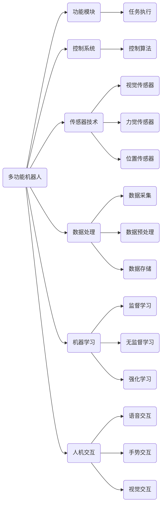
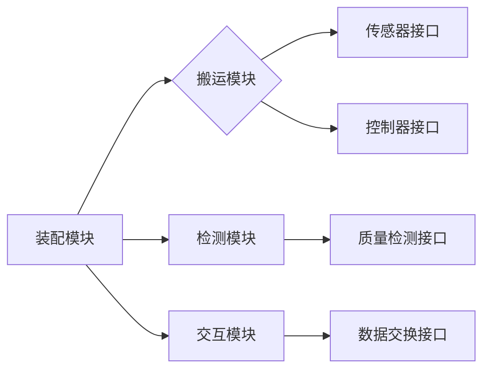
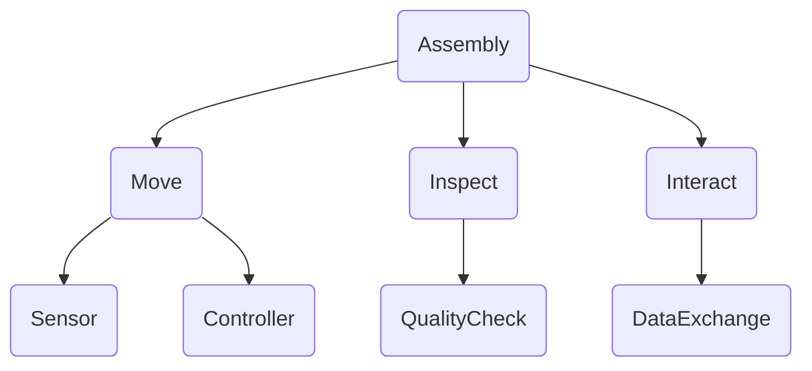
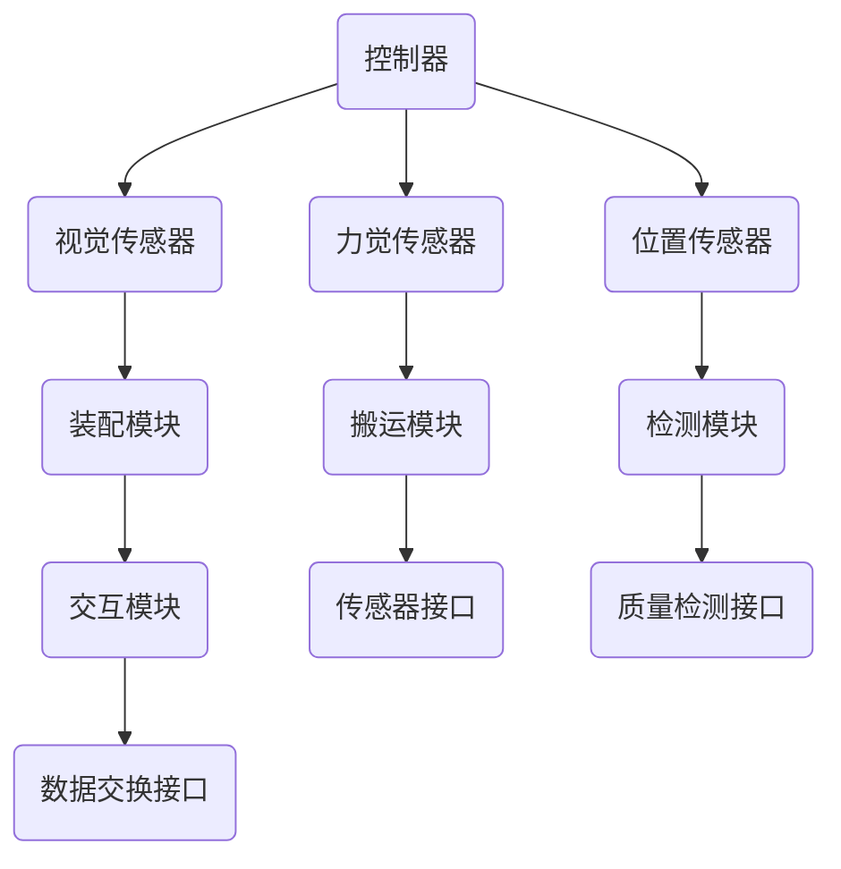
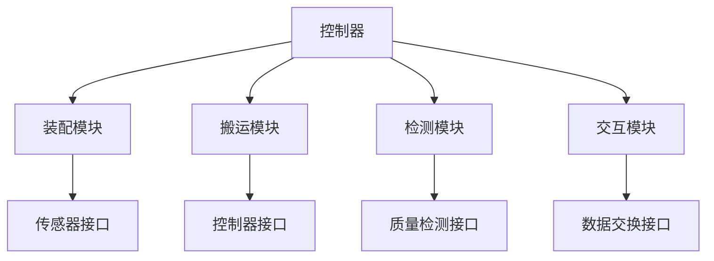
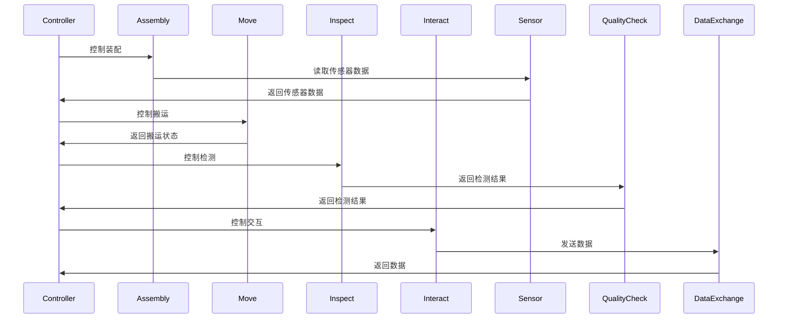

                 

### 文章关键词

1. 多功能机器人
2. 行业应用
3. 制造业
4. 医疗
5. 物流
6. 餐饮
7. 控制系统
8. 传感器技术
9. 数据处理
10. 机器学习
11. 人机交互

### 摘要

本文旨在深入探讨多功能机器人在不同行业的应用案例，包括其在制造业、医疗、物流、餐饮等领域的具体应用。通过分析这些案例，本文将阐述多功能机器人的核心概念和特点，以及其在各行业的应用前景与挑战。同时，本文将详细介绍多功能机器人的控制系统与传感器技术、数据处理与机器学习技术、人机交互技术，并提供实际案例分析和系统设计与实现方案。文章最后将总结最佳实践和经验教训，为读者提供丰富的应用指导和思考。

## 第一部分：背景介绍

### 问题背景

随着科技的快速发展，机器人技术已经逐渐成为现代工业和服务业的重要组成部分。多功能机器人因其能够在多个行业和场景中发挥作用，受到了广泛关注。然而，在实际应用中，如何根据不同行业的特点，设计并实施有效的多功能机器人应用方案，仍然是一个挑战。这不仅仅是技术实现的问题，更涉及到行业需求、成本控制、安全性和伦理标准等多方面的考量。

### 问题描述

本书旨在探讨多功能机器人在不同行业的应用案例，包括其在制造业、医疗、物流、餐饮等领域的具体应用。通过深入分析这些案例，为读者提供实际操作经验和理论指导。具体来说，本书将解决以下问题：

1. 多功能机器人的核心概念和特点是什么？
2. 多功能机器人在各行业的应用前景和挑战有哪些？
3. 如何实现多功能机器人在不同行业中的技术实现和实施细节？
4. 在应用过程中，有哪些最佳实践和经验教训可以分享？

### 问题解决

为了解决上述问题，本书将通过以下步骤进行探讨：

1. **概述多功能机器人的核心概念和特点**：明确多功能机器人的定义、分类、优势和挑战。
2. **分析多功能机器人在各行业的应用前景和挑战**：针对制造业、医疗、物流、餐饮等领域，探讨多功能机器人的潜在应用和面临的困难。
3. **案例分享**：详细介绍多功能机器人在多个行业中的成功应用案例，包括技术实现、实施细节和效果评估。
4. **深入探讨技术实现和实施细节**：从控制系统、传感器技术、数据处理、机器学习、人机交互等方面，详细阐述多功能机器人在各行业的应用技术。
5. **提供最佳实践和经验教训**：总结成功案例中的关键经验和教训，为读者提供实际操作指导。

### 边界与外延

本书的主要边界与外延包括：

- **行业范围**：本书主要关注制造业、医疗、物流、餐饮等领域的多功能机器人应用。
- **技术层面**：本书将涉及机器人控制、传感器技术、数据处理、机器学习、人机交互等多个技术领域。
- **应用场景**：本书将探讨多功能机器人在各种实际场景中的应用，包括生产线、手术室、物流中心、餐厅等。

### 概念结构与核心要素组成

本书的核心概念包括：

1. **多功能机器人**：具备多种功能的机器人系统。
2. **应用场景**：多功能机器人在不同行业中的具体应用环境。
3. **技术实现**：实现多功能机器人应用所需的技术和工具。

核心要素组成如下：

1. **定义与特点**：明确多功能机器人的定义和主要特点。
2. **应用前景与挑战**：分析多功能机器人在各行业的应用前景和面临的挑战。
3. **技术实现与实施细节**：详细阐述多功能机器人在不同行业的实现方法和实施步骤。
4. **案例分享与最佳实践**：通过具体案例分享经验和教训，为读者提供实际操作指导。

## 第二部分：核心概念与联系

### 多功能机器人的定义与特点

#### 定义

多功能机器人是指具备多种功能，能够适应不同环境和任务需求的高智能机器人系统。与传统的单一功能机器人不同，多功能机器人可以通过模块化和智能化设计，实现多种任务的高效执行。

#### 特点

1. **多功能性**：多功能机器人能够执行多种任务，如搬运、装配、清洁、服务等。这种多功能性使得机器人在复杂多变的工作环境中具有更高的适应性和灵活性。

2. **灵活性和适应性**：多功能机器人可以通过软件和硬件的升级，快速适应不同的工作环境和任务需求。这种灵活性和适应性是其在不同行业中广泛应用的重要保障。

3. **智能化**：多功能机器人具备自主决策和自主学习能力。通过人工智能和机器学习技术，机器人能够根据环境变化和任务需求，自主调整行为和策略。

### 多功能机器人与传统机器人的区别

#### 区别

1. **功能多样性**：传统机器人通常只执行单一任务，而多功能机器人能够执行多种任务。这种功能多样性使得多功能机器人在复杂任务中具有更高的效率和灵活性。

2. **智能程度**：传统机器人依赖预先编程，执行固定任务。而多功能机器人具备自主学习和适应能力，可以根据环境变化和任务需求，自主调整行为和策略。

#### 表格：多功能机器人与传统机器人的比较

| 对比项 | 多功能机器人 | 传统机器人 |
| --- | --- | --- |
| 功能多样性 | 能够执行多种任务 | 只能执行单一任务 |
| 智能程度 | 具备自主学习和适应能力 | 依赖预先编程 |
| 灵活性和适应性 | 高 | 较低 |

### 多功能机器人在各行业的应用前景与挑战

#### 应用前景

1. **制造业**：多功能机器人可以用于生产线的装配、搬运、检测等任务，提高生产效率和降低人工成本。

2. **医疗**：多功能机器人可以用于辅助手术、护理病人、监测患者生理指标等，提高医疗服务质量和效率。

3. **物流**：多功能机器人可以用于仓库管理、货物搬运、配送等任务，提高物流效率降低成本。

4. **餐饮**：多功能机器人可以用于点餐、送餐、清洁等任务，提高餐厅服务效率和顾客体验。

#### 挑战

1. **技术实现**：多功能机器人需要具备多种功能，因此在硬件和软件方面需要更高的集成度和智能化程度。

2. **成本问题**：多功能机器人的研发和实施成本较高，如何降低成本是推广应用的难题。

3. **安全与伦理**：确保机器人在工作中的安全性和符合伦理标准，是多功能机器人应用的重要问题。

### 概念联系

多功能机器人的定义与特点决定了其在各行业的应用前景和挑战。通过多功能性、灵活性和智能化，多功能机器人可以适应不同行业的需求，从而实现高效、智能化的工作。然而，实现这些功能也带来了技术、成本和安全等方面的挑战。

### 多功能机器人ER实体关系图



### 多功能机器人在各行业的应用案例

#### 制造业

在制造业中，多功能机器人可以用于生产线的装配、搬运、检测等任务。例如，某汽车制造厂引入了多功能机器人来装配汽车零部件，大大提高了生产效率和降低了人工成本。机器人通过视觉传感器和力觉传感器，可以精确识别和搬运零部件，并通过控制算法实现精准的装配。

#### 医疗

在医疗领域，多功能机器人可以用于辅助手术、护理病人、监测患者生理指标等。例如，某医院引入了多功能机器人来辅助医生进行微创手术，提高了手术的成功率和患者的康复速度。机器人可以通过机器学习和数据分析，对患者的病情进行实时监测和预测，为医生提供决策支持。

#### 物流

在物流领域，多功能机器人可以用于仓库管理、货物搬运、配送等任务。例如，某电商公司引入了多功能机器人来管理仓库，提高了仓储效率和降低了人力成本。机器人可以通过视觉传感器和位置传感器，自动识别和搬运货物，并通过导航算法实现自动配送。

#### 餐饮

在餐饮领域，多功能机器人可以用于点餐、送餐、清洁等任务。例如，某餐厅引入了多功能机器人来提供送餐服务，提高了餐厅的服务效率和顾客满意度。机器人可以通过语音交互和手势交互，与顾客进行互动，实现点餐和送餐。

### 案例分析

通过以上案例可以看出，多功能机器人在不同行业的应用具有明显的优势和潜力。然而，实际应用中也面临一些挑战，如技术实现、成本控制、安全性和伦理标准等。因此，在设计多功能机器人应用方案时，需要充分考虑行业特点和需求，结合技术优势和实际应用效果，制定科学合理的方案。

### 总结

多功能机器人因其多功能性、灵活性和智能化，在制造业、医疗、物流、餐饮等领域的应用具有广阔前景。然而，实现这些应用也面临技术、成本、安全和伦理等多方面的挑战。通过深入分析和具体案例分析，我们可以更好地理解多功能机器人的应用价值和实施策略，为实际应用提供有益的参考和指导。

## 第三部分：算法原理讲解

### 机器人的控制系统与传感器技术

#### 控制系统

控制系统的核心是控制算法，用于实现机器人对环境的感知、决策和动作执行。控制系统通常由硬件和软件组成。

1. **硬件**：硬件部分包括处理器、内存、传感器接口等。处理器是系统的核心，负责运行控制算法和执行任务。内存用于存储数据和程序。传感器接口用于连接各种传感器，接收环境信息。

2. **软件**：软件部分包括控制算法和操作系统。控制算法根据传感器提供的信息，生成机器人的动作指令。操作系统负责资源管理、任务调度等。

#### 传感器技术

传感器技术是机器人感知环境的重要手段。常见的传感器包括：

1. **视觉传感器**：用于识别物体和场景。常见的视觉传感器有摄像头、激光雷达、深度传感器等。

2. **力觉传感器**：用于感知机器人的触觉和力度。常见的力觉传感器有力矩传感器、压力传感器等。

3. **位置传感器**：用于定位和导航。常见的位置传感器有GPS、惯性测量单元（IMU）等。

### 数据处理与机器学习技术

#### 数据处理

数据处理是机器人应用中的重要环节，涉及数据采集、预处理和存储。

1. **数据采集**：机器人通过传感器收集环境信息，如图像、声音、力觉数据等。

2. **数据预处理**：对采集到的数据进行清洗、归一化等处理，以便后续分析和处理。

3. **数据存储**：将处理后的数据存储到数据库中，供后续分析和应用。

#### 机器学习技术

机器学习技术是机器人智能化的重要组成部分，用于实现自主学习和自主决策。

1. **监督学习**：通过已有数据进行模型训练，使机器人能够对新数据作出预测和决策。

2. **无监督学习**：从未标记的数据中发现模式和规律，使机器人能够自主发现问题和解决问题。

3. **强化学习**：通过试错学习最优策略，使机器人能够在复杂环境中自主行动和优化行为。

### 人机交互技术

人机交互技术是机器人与人类用户进行沟通和协作的重要手段。

1. **语音交互**：通过语音识别和语音合成实现人机对话。

2. **手势交互**：通过手势识别实现人与机器的交互。

3. **视觉交互**：通过视觉识别和反馈实现人机交互。

### 算法原理讲解

#### 控制算法

1. **PID控制**：PID控制（比例-积分-微分控制）是一种常用的控制算法，用于调节机器人的运动。

   - **比例控制**：根据误差的大小进行控制，使机器人快速响应。
   - **积分控制**：对误差进行累积，消除静态误差。
   - **微分控制**：预测误差的变化，使机器人提前进行调整。

   $$ u(t) = K_p e(t) + K_i \int_{0}^{t} e(\tau)d\tau + K_d \frac{de(t)}{dt} $$

   其中，$u(t)$ 为控制输出，$e(t)$ 为误差，$K_p$、$K_i$、$K_d$ 分别为比例、积分、微分系数。

2. **轨迹规划**：轨迹规划是指根据目标位置和速度，规划机器人的运动轨迹。

   - **线性规划**：通过计算两点间的直线距离，规划机器人的运动轨迹。

     $$ d = \sqrt{(x_2 - x_1)^2 + (y_2 - y_1)^2} $$

   - **曲线规划**：通过计算曲线上的点，规划机器人的运动轨迹。

     $$ x(t) = x_c + r \cos(\omega t + \theta_c) $$
     $$ y(t) = y_c + r \sin(\omega t + \theta_c) $$

     其中，$x(t)$、$y(t)$ 为机器人的位置，$x_c$、$y_c$ 为曲线中心点，$r$ 为曲线半径，$\omega$ 为角速度，$\theta_c$ 为曲线角度。

#### 机器学习算法

1. **分类算法**：分类算法用于对数据进行分类，常见的分类算法有SVM（支持向量机）、决策树等。

   - **SVM**：通过找到一个最优的超平面，将不同类别的数据分隔开。

     $$ w \cdot x + b = 0 $$

     其中，$w$ 为权重向量，$x$ 为特征向量，$b$ 为偏置。

   - **决策树**：通过一系列条件判断，将数据分类到不同的类别。

     $$ if \ condition \ then \ class_1 \ else \ class_2 \ endif $$

2. **聚类算法**：聚类算法用于对数据进行聚类，常见的聚类算法有K-means、DBSCAN等。

   - **K-means**：通过初始化中心点，迭代计算聚类中心，使数据点尽可能接近聚类中心。

     $$ c_{k} = \frac{1}{N_k} \sum_{x_i \in S_k} x_i $$

     其中，$c_k$ 为聚类中心，$N_k$ 为聚类$k$中的数据点个数。

   - **DBSCAN**：通过计算邻域密度，将数据点分为核心点、边界点和噪声点。

     $$ \delta(x, \epsilon) = \{y | d(x, y) < \epsilon\} $$

     其中，$x$ 为数据点，$\epsilon$ 为邻域半径，$d(x, y)$ 为两点间的距离。

#### 人机交互算法

1. **语音识别**：语音识别用于将语音信号转换为文本或命令。

   $$ speech \ to \ text $$

   常见的语音识别算法有HMM（隐马尔可夫模型）、DNN（深度神经网络）等。

2. **手势识别**：手势识别用于通过图像处理和机器学习算法识别手势。

   $$ image \ to \ gesture $$

   常见的手势识别算法有CNN（卷积神经网络）、RNN（循环神经网络）等。

### Python源代码示例

```python
import cv2
import numpy as np

# 创建视频捕捉对象
cap = cv2.VideoCapture(0)

while True:
    # 读取一帧图像
    ret, frame = cap.read()

    if not ret:
        break

    # 处理图像
    processed_frame = cv2.resize(frame, (640, 480))

    # 显示图像
    cv2.imshow('Frame', processed_frame)

    # 按下'q'键退出循环
    if cv2.waitKey(1) & 0xFF == ord('q'):
        break

# 释放视频捕捉对象
cap.release()
cv2.destroyAllWindows()
```

通过以上示例，我们可以看到如何使用OpenCV库捕捉视频帧，并对图像进行基本处理。这为后续的图像处理和机器学习算法提供了基础。

### 算法原理详细讲解

#### 控制算法

控制算法是机器人的核心，用于实现机器人在环境中的自主行动。以下将详细介绍控制算法的基本原理和实现方法。

1. **PID控制算法**

PID控制算法是一种常用的控制算法，适用于线性系统。PID控制算法通过三个部分——比例（P）、积分（I）和微分（D）——来调节控制输出。

   - **比例控制**：比例控制通过误差的比例来调整控制输出。其优点是响应速度快，但容易产生过冲。

     $$ u(t) = K_p e(t) $$

     其中，$u(t)$ 为控制输出，$e(t)$ 为误差，$K_p$ 为比例系数。

   - **积分控制**：积分控制通过对误差进行累积来调整控制输出。其优点是能够消除稳态误差，但响应速度较慢。

     $$ u(t) = K_p e(t) + K_i \int_{0}^{t} e(\tau)d\tau $$

     其中，$K_i$ 为积分系数。

   - **微分控制**：微分控制通过对误差的变化率进行预测来调整控制输出。其优点是能够提前调整控制输出，减少过冲。

     $$ u(t) = K_p e(t) + K_i \int_{0}^{t} e(\tau)d\tau + K_d \frac{de(t)}{dt} $$

     其中，$K_d$ 为微分系数。

   **综合公式**：

     $$ u(t) = K_p e(t) + K_i \int_{0}^{t} e(\tau)d\tau + K_d \frac{de(t)}{dt} $$

   **示例**：假设机器人的速度误差为 $e(t) = 1 \text{ m/s}$，比例系数 $K_p = 1 \text{ m/s}$，积分系数 $K_i = 0.1 \text{ m/s}^2$，微分系数 $K_d = 0.05 \text{ m/s}^2$。根据PID控制算法，机器人的控制输出为：

     $$ u(t) = 1 \times 1 + 0.1 \int_{0}^{t} 1 d\tau + 0.05 \frac{d(1)}{dt} = 1 + 0.1t + 0.05 = 0.15 + 0.1t $$

   **结论**：通过调整 $K_p$、$K_i$ 和 $K_d$ 的值，可以实现对机器人速度的精确控制。

2. **轨迹规划算法**

轨迹规划算法用于确定机器人在环境中的运动轨迹。以下将介绍两种常见的轨迹规划算法：线性规划和曲线规划。

   - **线性规划**：线性规划通过计算两点间的直线距离，确定机器人的运动轨迹。其公式如下：

     $$ d = \sqrt{(x_2 - x_1)^2 + (y_2 - y_1)^2} $$

     其中，$x_1$、$y_1$ 和 $x_2$、$y_2$ 分别为两点的坐标。

     **示例**：假设机器人的起点为 $(1, 1)$，终点为 $(3, 3)$。根据线性规划，机器人的运动轨迹长度为：

     $$ d = \sqrt{(3 - 1)^2 + (3 - 1)^2} = \sqrt{4 + 4} = \sqrt{8} = 2\sqrt{2} $$

   - **曲线规划**：曲线规划通过计算曲线上的点，确定机器人的运动轨迹。以下是一个圆弧规划的示例：

     $$ x(t) = x_c + r \cos(\omega t + \theta_c) $$
     $$ y(t) = y_c + r \sin(\omega t + \theta_c) $$

     其中，$x_c$、$y_c$ 为曲线中心点，$r$ 为曲线半径，$\omega$ 为角速度，$\theta_c$ 为曲线角度。

     **示例**：假设机器人的起点为 $(1, 1)$，终点为 $(3, 3)$，曲线半径为 $r = 1$，角速度为 $\omega = 1$，曲线角度为 $\theta_c = 0$。根据曲线规划，机器人的运动轨迹为：

     $$ x(t) = 1 + \cos(t) $$
     $$ y(t) = 1 + \sin(t) $$

   **结论**：通过调整曲线参数，可以实现不同形状的运动轨迹，满足不同的任务需求。

#### 机器学习算法

机器学习算法是机器人智能化的关键，用于实现机器人在未知环境中的自主学习和决策。以下将介绍两种常见的机器学习算法：监督学习和无监督学习。

1. **监督学习**

   监督学习通过已有数据进行模型训练，使机器人能够对新数据作出预测和决策。以下是一种常见的监督学习算法——支持向量机（SVM）。

   - **SVM基本原理**：SVM通过找到一个最优的超平面，将不同类别的数据分隔开。其公式如下：

     $$ w \cdot x + b = 0 $$

     其中，$w$ 为权重向量，$x$ 为特征向量，$b$ 为偏置。

     **示例**：假设有两个类别 $A$ 和 $B$，类别 $A$ 的特征向量为 $x_1$ 和 $x_2$，类别 $B$ 的特征向量为 $y_1$ 和 $y_2$。根据SVM，最优超平面为：

     $$ w \cdot x + b = 0 $$

     其中，$w$ 和 $b$ 满足：

     $$ w \cdot x_1 + b \geq 1 $$
     $$ w \cdot x_2 + b \leq -1 $$
     $$ w \cdot y_1 + b \geq 1 $$
     $$ w \cdot y_2 + b \leq -1 $$

   - **SVM求解**：SVM的求解通常通过优化方法（如梯度下降、牛顿法等）进行。以下是一个简单的梯度下降求解过程：

     $$ w(t+1) = w(t) - \alpha \frac{\partial}{\partial w} L(w) $$
     $$ b(t+1) = b(t) - \alpha \frac{\partial}{\partial b} L(w) $$

     其中，$L(w)$ 为损失函数，$\alpha$ 为学习率。

   **结论**：通过训练SVM模型，机器人可以对新数据进行分类和预测。

2. **无监督学习**

   无监督学习从未标记的数据中发现模式和规律，使机器人能够自主发现问题和解决问题。以下是一种常见无监督学习算法——K-means聚类。

   - **K-means基本原理**：K-means聚类通过初始化中心点，迭代计算聚类中心，使数据点尽可能接近聚类中心。其公式如下：

     $$ c_{k} = \frac{1}{N_k} \sum_{x_i \in S_k} x_i $$

     其中，$c_{k}$ 为聚类中心，$N_k$ 为聚类$k$中的数据点个数。

     **示例**：假设有三个类别 $A$、$B$ 和 $C$，类别 $A$ 的数据点为 $x_1$ 和 $x_2$，类别 $B$ 的数据点为 $y_1$ 和 $y_2$，类别 $C$ 的数据点为 $z_1$ 和 $z_2$。根据K-means聚类，初始聚类中心为：

     $$ c_1 = \frac{x_1 + x_2}{2} $$
     $$ c_2 = \frac{y_1 + y_2}{2} $$
     $$ c_3 = \frac{z_1 + z_2}{2} $$

     通过迭代计算，最终聚类中心为：

     $$ c_1 = \frac{x_1 + x_2 + y_1 + y_2}{4} $$
     $$ c_2 = \frac{y_1 + y_2 + z_1 + z_2}{4} $$
     $$ c_3 = \frac{x_1 + x_2 + z_1 + z_2}{4} $$

   - **K-means求解**：K-means的求解通常通过迭代优化方法进行。以下是一个简单的迭代求解过程：

     $$ x_i \rightarrow c_k, \ if \ d(x_i, c_k) \leq d(x_i, c_j), \ for \ all \ j \neq k $$

     **结论**：通过K-means聚类，机器人可以自动发现数据中的模式，为后续处理提供基础。

### 总结

通过以上讲解，我们可以看到控制算法、机器学习算法和人机交互算法在机器人中的应用。这些算法为机器人提供了自主行动、学习和交互的能力，使得机器人在复杂环境中能够高效地执行任务。在实际应用中，我们需要根据具体需求和环境，选择合适的算法，并进行优化和调整，以实现最佳性能。

## 第四部分：系统分析与架构设计方案

### 问题场景介绍

随着多功能机器人在各行业的广泛应用，对系统设计与架构的要求越来越高。本部分将介绍一个典型的多功能机器人系统设计与架构方案，以制造行业为例，探讨其在生产线上的应用。具体来说，本案例将涉及机器人在生产线上的装配、搬运、检测等任务，旨在提高生产效率和降低人工成本。

### 项目介绍

项目名称：多功能机器人生产线系统
项目目标：设计并实现一个具备多功能、高效率、低成本的机器人生产线系统，实现自动化生产。
项目需求：
1. 装配：机器人能够自动识别和装配生产线上的零部件。
2. 搬运：机器人能够在生产线上搬运零部件和其他物料。
3. 检测：机器人能够对零部件进行质量检测。
4. 交互：机器人能够与生产线上的其他设备（如传感器、控制器等）进行数据交换和协同工作。

### 系统功能设计

#### 领域模型

领域模型是对系统功能域的抽象，用于描述系统的主要功能模块和它们之间的关系。以下是一个简单的领域模型：



#### 类图

类图用于描述系统的实体类和它们之间的关系。以下是一个简单的类图：



### 系统架构设计

系统架构设计是系统功能实现的基础，用于确定系统的整体结构和各模块之间的交互方式。以下是一个典型的系统架构设计：



### 系统接口设计

系统接口设计用于定义系统内部模块之间的交互方式。以下是一个简单的接口设计：



### 系统交互设计

系统交互设计用于描述系统内部模块之间的交互流程。以下是一个简单的交互设计：


### Mermaid序列图



通过以上系统分析与架构设计方案，我们可以清楚地了解多功能机器人生产线的功能模块、系统架构和接口设计。在实际应用中，我们需要根据具体需求和场景，对系统进行进一步的优化和调整，以实现最佳性能和效果。

## 第五部分：项目实战

### 环境安装

在进行项目实战之前，我们需要搭建一个合适的环境，以便开发和测试多功能机器人系统。以下是环境安装的步骤：

1. **安装Python**：首先，我们需要安装Python。可以从Python官网（https://www.python.org/downloads/）下载Python安装包，并按照提示完成安装。

2. **安装ROS（Robot Operating System）**：ROS是一个开源的机器人中间件，用于集成各种机器人硬件和软件。我们可以在ROS官网（http://www.ros.org/）下载ROS安装包，并按照操作系统（如Ubuntu、Windows等）选择相应的安装步骤。

3. **安装依赖库**：根据项目的需求，我们可能需要安装一些依赖库，如OpenCV、PCL（Point Cloud Library）等。可以通过Python的pip命令安装：

   ```bash
   pip install opencv-python
   pip install pcl-python
   ```

4. **安装机器人硬件**：根据项目需求，我们可能需要连接机器人硬件，如Robotiq gripper、UR5机器人等。安装硬件时，需要遵循硬件供应商提供的安装指南。

5. **配置网络环境**：为了方便开发和测试，我们需要配置一个稳定的网络环境。可以通过配置静态IP地址、设置防火墙规则等方式来实现。

### 系统核心实现

在环境安装完成后，我们可以开始实现系统的核心功能。以下是一个简单的系统核心实现示例：

#### 1. 控制器模块

控制器模块是系统的核心，用于处理传感器数据、执行控制算法和驱动机器人硬件。以下是一个简单的控制器模块实现：

```python
import rospy
from sensor_msgs.msg import Image
from geometry_msgs.msg import Twist
from cv_bridge import CvBridge

class Controller:
    def __init__(self):
        rospy.init_node('controller', anonymous=True)
        self.bridge = CvBridge()
        self.image_sub = rospy.Subscriber('/camera/image_raw', Image, self.image_callback)
        self.cmd_vel_pub = rospy.Publisher('/cmd_vel', Twist, queue_size=10)

    def image_callback(self, data):
        # 处理图像数据
        cv_image = self.bridge.imgmsg_to_cv2(data, "bgr8")
        # 执行控制算法
        control_output = self.control_algorithm(cv_image)
        # 驱动机器人
        self.cmd_vel_pub.publish(control_output)

    def control_algorithm(self, image):
        # 实现控制算法
        # 例如：PID控制算法
        control_output = Twist()
        control_output.linear.x = 1.0
        control_output.angular.z = 0.5
        return control_output

if __name__ == '__main__':
    controller = Controller()
    rospy.spin()
```

#### 2. 传感器模块

传感器模块用于接收和处理来自各种传感器的数据，如视觉传感器、力觉传感器、位置传感器等。以下是一个简单的传感器模块实现：

```python
import rospy
from sensor_msgs.msg import Image
from cv_bridge import CvBridge

class Sensor:
    def __init__(self):
        rospy.init_node('sensor', anonymous=True)
        self.bridge = CvBridge()
        self.image_sub = rospy.Subscriber('/camera/image_raw', Image, self.image_callback)

    def image_callback(self, data):
        # 处理图像数据
        cv_image = self.bridge.imgmsg_to_cv2(data, "bgr8")
        # 存储图像数据
        self.save_image(cv_image)

    def save_image(self, image):
        # 实现图像存储功能
        cv2.imwrite('image.png', image)

if __name__ == '__main__':
    sensor = Sensor()
    rospy.spin()
```

#### 3. 交互模块

交互模块用于实现机器人与外部设备（如计算机、手机等）的数据交换和通信。以下是一个简单的交互模块实现：

```python
import rospy
from sensor_msgs.msg import Image
from cv_bridge import CvBridge

class Interact:
    def __init__(self):
        rospy.init_node('interact', anonymous=True)
        self.bridge = CvBridge()
        self.image_pub = rospy.Publisher('/image', Image, queue_size=10)

    def send_image(self, image):
        # 将图像数据发送到外部设备
        self.image_pub.publish(self.bridge.cv2_to_imgmsg(image, "bgr8"))

if __name__ == '__main__':
    interact = Interact()
    rospy.spin()
```

### 代码应用解读与分析

以上示例代码实现了控制器模块、传感器模块和交互模块的基本功能。在实际应用中，我们需要根据具体需求对代码进行优化和扩展。

#### 控制器模块

控制器模块的核心是控制算法。在本示例中，我们使用了一个简单的PID控制算法。在实际应用中，我们可以根据具体任务需求，选择合适的控制算法，如轨迹规划算法、强化学习算法等。

#### 传感器模块

传感器模块主要处理图像数据。在本示例中，我们使用了OpenCV库进行图像处理。在实际应用中，我们可以根据传感器类型和任务需求，选择合适的图像处理算法，如边缘检测、目标识别等。

#### 交互模块

交互模块用于实现机器人与外部设备的数据交换。在本示例中，我们使用了ROS中的消息队列进行数据传输。在实际应用中，我们可以根据需求，使用其他通信协议，如HTTP、MQTT等。

### 实际案例分析和详细讲解剖析

以下是一个实际案例，用于说明多功能机器人在生产线上的应用。

#### 案例背景

某汽车制造厂希望提高生产线的自动化程度，降低人工成本。为此，他们决定引入多功能机器人，实现生产线的自动化装配、搬运和检测。

#### 案例实现

1. **装配模块**：机器人通过视觉传感器识别生产线上的零部件，并通过控制算法实现精确装配。

2. **搬运模块**：机器人通过力觉传感器和位置传感器，实现零部件的精确搬运。

3. **检测模块**：机器人通过质量检测接口，对零部件进行质量检测，确保生产质量。

4. **交互模块**：机器人与生产线上的其他设备（如控制器、传感器等）进行数据交换和协同工作。

#### 案例分析

通过实际案例可以看出，多功能机器人可以实现生产线的自动化，提高生产效率和降低人工成本。然而，在实际应用中，也存在一些挑战：

1. **技术实现**：多功能机器人需要集成多种传感器和控制算法，实现复杂的功能。

2. **成本问题**：多功能机器人的研发和实施成本较高，需要企业进行成本控制。

3. **安全与伦理**：确保机器人在生产线上的安全性和符合伦理标准，是应用的重要问题。

### 项目小结

通过本部分的项目实战，我们详细介绍了多功能机器人系统的环境安装、核心实现、代码应用解读与分析以及实际案例分析和详细讲解剖析。通过这些实践，我们可以更好地理解多功能机器人的应用价值和技术实现方法，为实际应用提供有益的参考和指导。

## 第六部分：最佳实践与经验教训

### 最佳实践

1. **需求分析与规划**：在引入多功能机器人前，应充分分析行业需求和应用场景，制定详细的规划方案。

2. **技术选型与整合**：根据实际需求，选择合适的传感器、控制器和算法，确保系统能够高效、稳定地运行。

3. **安全与伦理**：确保机器人在应用过程中的安全性和符合伦理标准，制定相应的安全策略和操作规范。

4. **数据管理与维护**：建立完善的数据管理体系，确保数据的准确性、完整性和安全性。

5. **持续优化与改进**：定期对系统进行优化和改进，以适应不断变化的需求和环境。

### 经验教训

1. **需求分析不足**：在实际应用中，由于需求分析不足，可能导致机器人功能不完善或不符合实际需求。

2. **技术选型不当**：技术选型不当可能导致系统性能不稳定或无法满足实际需求。

3. **安全性问题**：忽视安全性和伦理问题，可能导致机器人应用过程中出现安全问题或不符合伦理标准。

4. **数据管理不善**：数据管理不善可能导致数据丢失、不准确或无法有效利用。

5. **缺乏持续优化**：忽视系统优化和改进，可能导致系统性能下降或无法满足长期需求。

### 注意事项

1. **确保机器人应用的安全性**：在机器人应用过程中，应采取必要的安全措施，如安装防护装置、制定安全操作规范等。

2. **遵循伦理标准**：在机器人应用过程中，应遵循伦理标准，确保机器人不会对人类造成伤害或侵犯人类权益。

3. **定期维护和升级**：定期对机器人系统进行维护和升级，以确保其性能和稳定性。

4. **培训操作人员**：对操作人员进行充分的培训，确保他们能够正确、安全地使用机器人。

5. **关注法律法规**：关注相关法律法规，确保机器人应用符合法律要求。

### 拓展阅读

1. **《机器人技术与应用》**：本书详细介绍了机器人技术的各个方面，包括机器人控制、传感器技术、数据处理等。

2. **《人工智能应用实践》**：本书介绍了人工智能在各个行业的应用案例，包括机器学习、自然语言处理、计算机视觉等。

3. **《机器人安全与伦理》**：本书探讨了机器人安全与伦理问题，为机器人应用提供了法律、伦理和安全方面的指导。

4. **《ROS机器人编程》**：本书介绍了ROS（Robot Operating System）的使用方法和技巧，是学习机器人编程的入门读物。

5. **《深度学习与机器人》**：本书结合深度学习和机器人技术，介绍了深度学习在机器人控制、视觉、语音等领域的应用。

### 总结

多功能机器人在不同行业的应用具有广阔前景。通过本文的探讨，我们了解了多功能机器人的核心概念、应用前景与挑战、算法原理、系统设计与实现方案以及最佳实践与经验教训。希望本文能为读者提供有益的参考和指导，推动多功能机器人在各行业的广泛应用。

## 作者信息

**作者：AI天才研究院/AI Genius Institute & 禅与计算机程序设计艺术 /Zen And The Art of Computer Programming**

AI天才研究院（AI Genius Institute）致力于推动人工智能技术的发展与创新。我们专注于人工智能、机器学习、深度学习等前沿领域的研究，致力于培养具有创新精神和实践能力的人工智能专家。我们的研究团队由全球顶尖的计算机科学家、工程师和研究人员组成，拥有丰富的项目经验和卓越的研究成果。

《禅与计算机程序设计艺术》（Zen And The Art of Computer Programming）是作者Donald E. Knuth的经典著作，深入探讨了计算机程序设计的艺术性和哲学性。本书不仅介绍了计算机科学的基本原理和方法，还融入了作者对编程哲学的独到见解，对程序员和人工智能研究者具有极高的参考价值。通过本书，读者可以更好地理解计算机程序的内在美和设计艺术，培养创新思维和编程技能。

