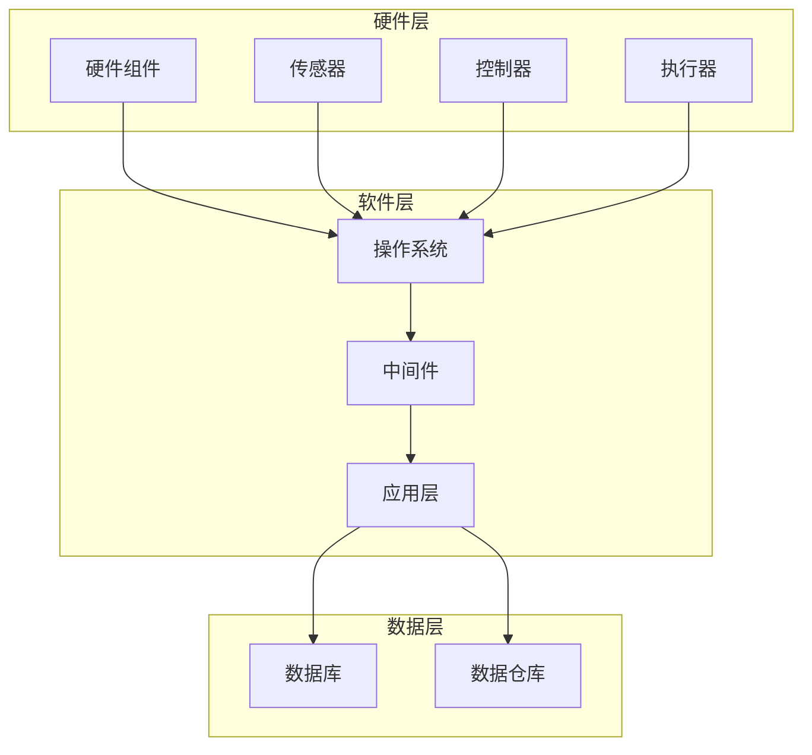
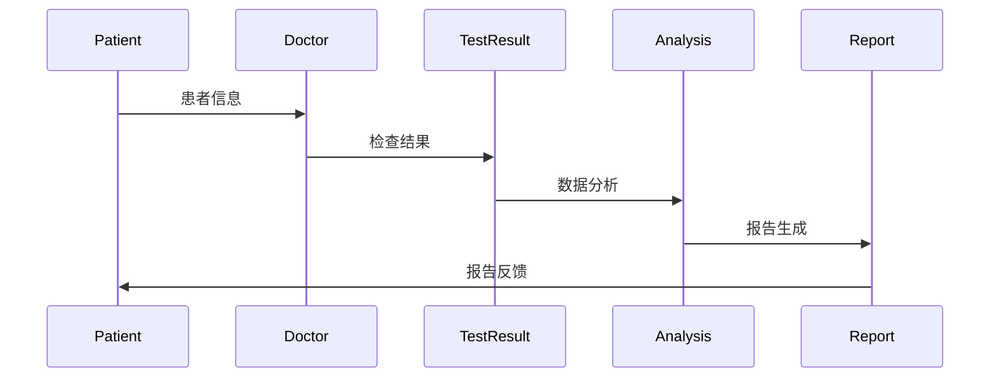
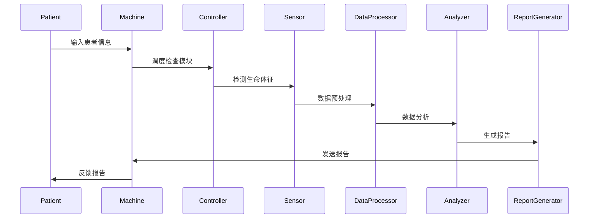

                 

### **第一部分：背景介绍**

**第1章：问题背景与核心概念**

**1.1 问题背景**

在当今快速发展的科技时代，医疗保健领域面临着诸多挑战。首先，随着全球人口老龄化的加剧，医疗资源需求不断增加，而医疗工作者数量有限，导致医疗资源分配不均。其次，疾病谱的变化和复杂性的增加，使得诊断和治疗变得更加复杂，对医疗技术提出了更高的要求。此外，医疗数据的爆炸式增长也带来了数据管理和分析的新挑战。

在这一背景下，机器人技术的发展为医疗保健领域提供了新的解决方案。机器人具有高精度、高效能、全天候工作等特点，能够在某些场景下替代或辅助医务人员，从而提高医疗服务的质量和效率。特别是在手术辅助、患者护理、药物配送等方面，机器人已经显示出巨大的潜力。

多功能机器人作为一种具备多种功能的机器人系统，能够在医疗保健领域发挥更加广泛的作用。它们可以集成多种功能，如检查、诊断、治疗、护理等，实现高度自动化和智能化，极大地提高医疗服务的效率和质量。

**1.2 核心概念**

**多功能机器人定义**

多功能机器人是指具备多种功能，能够在不同任务场景中灵活切换和操作的机器人系统。它们通常具有以下特点：

- **多功能性**：能够执行多种任务，如搬运、清洁、诊断、手术等。
- **灵活性**：能够在不同工作环境中适应和调整，如医院病房、手术室、急救现场等。
- **自主性**：具备一定的自主决策和任务规划能力，能够根据环境和任务需求自主执行任务。

**医疗保健领域的需求分析**

在医疗保健领域，多功能机器人的需求主要体现在以下几个方面：

- **手术辅助**：提高手术的精确度和安全性，减少术后并发症。
- **患者护理**：提供全天候的监护和护理服务，减轻医务人员的工作负担。
- **药物配送**：确保药物准确、及时地送达，减少药物浪费和误差。
- **康复训练**：帮助患者进行术后康复训练，提高康复效果。

**多功能机器人的技术特点与分类**

**技术特点**

- **高精度机械结构**：保证操作的高度精确和稳定性。
- **先进的传感器技术**：能够感知环境变化和患者状态。
- **智能控制算法**：实现自主决策和任务规划。
- **人机交互界面**：提供直观、便捷的操作方式，提高用户体验。

**分类**

- **按功能分类**：可分为手术机器人、护理机器人、配送机器人等。
- **按形态分类**：可分为臂式机器人、轮式机器人、腿式机器人等。
- **按操作方式分类**：可分为远程操控机器人、自主操控机器人等。

**1.3 联系与边界**

**多功能机器人与医疗保健的关联**

多功能机器人在医疗保健领域的应用，主要体现在以下几个方面：

- **提高医疗服务效率**：通过自动化和智能化技术，减少医务人员的工作量，提高工作效率。
- **提升医疗服务质量**：通过高精度、高可靠性的操作，提高手术和诊断的准确性，减少错误和并发症。
- **改善患者体验**：通过提供更舒适、更便捷的护理服务，提高患者的满意度和康复效果。

**多功能机器人的应用边界**

多功能机器人在医疗保健领域的应用边界主要包括以下几个方面：

- **应用环境**：主要应用于医院、诊所、康复中心等医疗场所。
- **应用场景**：包括手术辅助、患者护理、药物配送、康复训练等。
- **技术限制**：受制于技术发展水平，目前多功能机器人在复杂操作和环境适应性方面仍有待提高。

**多功能机器人的发展前景**

随着机器人技术的不断进步，多功能机器人在医疗保健领域的应用前景十分广阔。未来，多功能机器人将更加智能化、自适应化，能够更好地满足医疗保健领域的需求。同时，随着人工智能、大数据等技术的融合，多功能机器人将在医疗保健领域发挥更加重要的作用，推动医疗行业的变革。

### **第二部分：核心概念与联系**

**第2章：多功能机器人原理与特性**

**2.1 多功能机器人原理**

**机械结构设计**

多功能机器人的机械结构设计是其实现多种功能的基础。一般包括以下几个部分：

- **机身**：作为机器人主体的结构，承载各种组件和负载。
- **臂部**：通常为多自由度关节臂，能够进行复杂的动作。
- **手部**：根据任务需求设计，如夹持器、剪刀、钳子等。
- **驱动系统**：提供机械结构所需的动力，包括电机、液压系统等。

**传感器与控制技术**

传感器是多功能机器人感知环境和执行任务的关键。常见的传感器包括：

- **视觉传感器**：用于捕捉图像和视频，进行图像识别和目标定位。
- **力觉传感器**：用于感知机械臂的力矩和负载，确保操作精度。
- **触觉传感器**：用于感知接触物体的表面特性，提高人机交互的准确性。

控制技术是多功能机器人实现自主决策和任务执行的核心。主要包括：

- **运动控制**：通过控制算法实现机械臂的精确动作。
- **路径规划**：根据环境情况和任务目标，规划最优路径。
- **决策算法**：结合传感器数据和任务要求，进行自主决策。

**人机交互界面**

人机交互界面是用户与多功能机器人之间的交互通道。主要包括：

- **触摸屏**：提供直观的用户界面，用户可以通过触摸操作机器人。
- **语音识别**：将用户的语音指令转换为机器人的行动指令。
- **手势识别**：通过摄像头捕捉用户手势，进行交互操作。

**2.2 多功能机器人特性**

**可扩展性**

多功能机器人的可扩展性使其能够根据不同任务需求，灵活增加或减少功能模块。例如，手术机器人可以更换不同的手术工具，适应不同的手术场景。

**适应性**

多功能机器人具有良好的适应性，能够在不同的工作环境中进行操作。例如，护理机器人可以在病房、手术室、康复中心等不同场所工作，满足多样化的医疗需求。

**安全可靠性**

多功能机器人的安全可靠性是其应用于医疗保健领域的关键。通过高精度的机械结构和先进的控制算法，确保机器人在操作过程中的稳定性和安全性。同时，机器人还具备故障自诊断和自我修复功能，提高系统的可靠性。

**2.3 概念属性对比表格**

**多功能机器人与传统机器人的对比**

| 对比项       | 多功能机器人 | 传统机器人 |
| ------------ | ------------ | ---------- |
| 功能多样性   | 多种功能     | 单一功能   |
| 自主性       | 较高         | 较低       |
| 环境适应性   | 较强         | 较弱       |
| 安全可靠性   | 高           | 中等       |
| 人机交互     | 高度集成     | 有限       |

**不同类型多功能机器人的特性对比**

| 类型         | 特性          |
| ------------ | ------------- |
| 手术机器人   | 高精度、高可靠性 |
| 护理机器人   | 自适应、全天候  |
| 配送机器人   | 高效、低误差   |
| 康复训练机器人 | 安全、个性化   |

**3.1 医疗数据分析算法**

医疗数据分析算法在多功能机器人中起着至关重要的作用。它们负责对医疗数据进行预处理、分析和可视化，以帮助医务人员做出准确的诊断和治疗决策。以下是医疗数据分析算法的基本原理和步骤：

**医疗数据的预处理**

在开始数据分析之前，首先需要对医疗数据（如图像、文本、传感器数据等）进行预处理。预处理步骤通常包括以下内容：

- **数据清洗**：去除数据中的噪声和异常值，提高数据质量。
- **数据标准化**：将不同来源的数据进行统一处理，使其具有可比性。
- **数据整合**：将不同类型的数据进行整合，形成一个统一的数据集。

**医疗数据的分析流程**

预处理后的医疗数据可以通过以下流程进行分析：

- **特征提取**：从原始数据中提取出对分析有用的特征。例如，从医学图像中提取病变区域，从文本数据中提取关键词和主题。
- **模式识别**：通过机器学习算法对特征进行分类和聚类，识别出数据中的规律和模式。例如，使用支持向量机（SVM）进行疾病分类，使用K均值算法进行患者群体聚类。
- **预测分析**：利用历史数据对未来事件进行预测。例如，使用回归模型预测患者康复时间，使用时间序列分析预测医院床位需求。

**医疗数据的可视化**

可视化是数据分析中非常重要的一环，它能够帮助医务人员更直观地理解数据。常见的医疗数据可视化方法包括：

- **图像可视化**：对医学图像进行分割和标注，突出病变区域。
- **表格和图表**：将数据分析结果以表格、柱状图、折线图等形式呈现，便于分析。
- **三维建模**：对医疗数据的三维结构进行建模和渲染，帮助医务人员更好地理解患者的生理结构。

**3.2 智能诊断算法**

智能诊断算法是多功能机器人在医疗保健领域中的重要应用之一。它利用人工智能技术对患者的医疗数据进行自动分析和诊断，辅助医务人员做出准确的诊断决策。以下是智能诊断算法的基本原理和步骤：

**算法原理与模型**

智能诊断算法通常基于深度学习和数据挖掘技术，其核心思想是通过学习大量的医学数据，建立一个能够自动识别疾病特征的模型。常见的模型包括：

- **卷积神经网络（CNN）**：用于处理医学图像数据，如X光片、CT扫描等。
- **循环神经网络（RNN）**：用于处理时间序列数据，如心电图、脑电图等。
- **生成对抗网络（GAN）**：用于生成新的医学数据，提高模型的泛化能力。

**算法实现与优化**

智能诊断算法的实现涉及多个方面，包括数据预处理、模型选择、训练和优化。以下是实现过程中需要注意的几个关键点：

- **数据预处理**：确保输入数据的质量和一致性，去除噪声和异常值。
- **模型选择**：根据数据特点和诊断需求，选择合适的深度学习模型。
- **模型训练**：使用大量标注数据进行模型训练，提高模型的准确性。
- **模型优化**：通过调整模型参数和训练策略，优化模型性能。

**算法应用案例**

智能诊断算法已经在多个医疗领域得到应用，以下是一些典型的案例：

- **医学图像诊断**：使用深度学习模型对医学图像进行自动分析和诊断，如肺癌、乳腺癌等。
- **心电图分析**：使用循环神经网络对心电图数据进行分析，诊断心律失常等疾病。
- **基因分析**：使用生成对抗网络对基因序列进行生成和分析，发现潜在的致病基因。

**3.3 多功能机器人协作算法**

多功能机器人在医疗保健领域的协作算法是其实现高效、智能医疗服务的关键。这些算法负责协调多个机器人或机器人与医务人员之间的合作，以提高医疗服务的质量和效率。以下是多功能机器人协作算法的基本原理和步骤：

**算法原理与模型**

多功能机器人协作算法基于多智能体系统和分布式控制理论，其核心思想是建立一个统一的协作框架，使多个机器人能够协同完成任务。常见的模型包括：

- **协同控制算法**：通过控制算法实现机器人之间的协调运动，如路径规划、任务分配等。
- **优化算法**：通过优化方法实现机器人协作的最优配置，如资源分配、能耗优化等。
- **博弈算法**：通过博弈理论实现机器人之间的策略协调，如竞争、合作等。

**算法实现与优化**

多功能机器人协作算法的实现涉及多个方面，包括算法设计、仿真测试、性能优化。以下是实现过程中需要注意的几个关键点：

- **算法设计**：根据协作任务的需求，设计合适的协作算法框架。
- **仿真测试**：在虚拟环境中对协作算法进行仿真测试，验证其性能和稳定性。
- **性能优化**：通过调整算法参数和协作策略，优化算法性能。

**算法应用案例**

多功能机器人协作算法已经在多个医疗场景中得到应用，以下是一些典型的案例：

- **手术室协作**：多个机器人协作完成手术操作，如腹腔镜手术、心脏手术等。
- **病房监护**：机器人协作进行患者监护，如生命体征监测、药物配送等。
- **康复训练**：机器人协助患者进行康复训练，如步态训练、力量训练等。

### **第四部分：系统分析与架构设计**

**第4章：多功能机器人系统架构设计**

**4.1 系统功能设计**

**功能需求分析**

在开始系统架构设计之前，首先需要对多功能机器人系统的功能需求进行分析。以下是多功能机器人系统的主要功能需求：

- **手术辅助**：包括手术导航、手术工具操作、手术记录等。
- **患者监护**：包括生命体征监测、药物配送、康复训练等。
- **药物管理**：包括药物储存、药物配送、药物记录等。
- **数据管理**：包括数据存储、数据备份、数据分析等。
- **人机交互**：包括语音交互、手势交互、触摸屏交互等。

**领域模型设计**

领域模型是系统功能设计的核心，它定义了系统中的核心实体和它们之间的关系。以下是多功能机器人系统的领域模型：

```mermaid
erDiagram
    Patient ||--|{ Doctor }|-- Doctor
    Patient ||--|{ TestResult }|-- TestResult
    Doctor ||--|{ Prescription }|-- Prescription
    Prescription ||--|{ Medicine }|-- Medicine
    Medicine ||--|{ Storage }|-- Storage
    Storage ||--|{ Machine }|-- Machine
    Machine ||--|{ Operation }|-- Operation
    Machine ||--|{ Monitoring }|-- Monitoring
    Operation ||--|{ Tool }|-- Tool
    Tool ||--|{ Position }|-- Position
    Position ||--|{ Record }|-- Record
    TestResult ||--|{ Analysis }|-- Analysis
    Analysis ||--|{ Report }|-- Report
```

**4.2 系统架构设计**

**系统架构设计原则**

在设计多功能机器人系统架构时，需要遵循以下原则：

- **模块化**：将系统划分为多个模块，每个模块负责不同的功能，便于开发和维护。
- **可扩展性**：设计时应考虑未来的扩展需求，使系统能够轻松适应新的功能和技术。
- **高可靠性**：确保系统在各种情况下都能稳定运行，提高系统的可靠性。
- **安全性**：设计安全机制，保护系统和数据的安全。
- **易用性**：界面设计应直观、易操作，提高用户体验。

**系统架构设计**

以下是多功能机器人系统的架构设计：



**4.3 系统接口设计**

**接口设计原则**

在设计系统接口时，需要遵循以下原则：

- **标准化**：使用标准化的接口协议，确保不同模块之间的兼容性。
- **灵活性**：接口设计应具有灵活性，便于后续修改和扩展。
- **安全性**：接口设计应考虑安全性，防止非法访问和数据泄露。

**接口设计与实现**

以下是多功能机器人系统的接口设计：



**4.4 系统交互设计**

**系统交互流程**

以下是多功能机器人系统的交互流程：

1. **患者信息输入**：医务人员输入患者信息，包括姓名、年龄、病历号等。
2. **检查和诊断**：系统根据患者信息，自动调度相应的检查和诊断模块。
3. **数据分析**：系统对检查和诊断结果进行数据分析，生成报告。
4. **报告生成和反馈**：系统将报告生成并反馈给患者，同时更新患者档案。

**系统交互设计**

以下是多功能机器人系统的交互设计：



### **第五部分：项目实战**

**第5章：多功能机器人在医疗保健领域的应用实战**

**5.1 环境安装**

在开始多功能机器人在医疗保健领域的应用实战之前，首先需要搭建开发环境。以下是开发环境的搭建步骤：

1. **安装操作系统**：选择Linux或Windows操作系统，建议使用Ubuntu 18.04或更高版本。
2. **安装依赖库**：安装Python 3.8及以上版本，并使用pip安装以下依赖库：
    ```bash
    pip install numpy scipy matplotlib scikit-learn tensorflow
    ```
3. **安装机器人软件**：根据所选的多功能机器人型号，安装相应的软件和驱动。

**5.2 系统核心实现**

**系统核心模块实现**

以下是多功能机器人系统的核心模块实现：

1. **传感器模块**：实现传感器数据采集和预处理功能，包括温度、湿度、光线等传感器。
    ```python
    import numpy as np

    def preprocess_sensor_data(sensor_data):
        # 数据预处理
        return np.mean(sensor_data)
    ```
2. **控制器模块**：实现机器人控制功能，包括运动控制和路径规划。
    ```python
    import numpy as np

    def move_to_position(position):
        # 运动控制
        print(f"Moving to position: {position}")
    ```
3. **数据分析模块**：实现数据分析和报告生成功能，包括医疗数据的预处理、分析和可视化。
    ```python
    import numpy as np
    import matplotlib.pyplot as plt

    def analyze_data(data):
        # 数据分析
        mean_value = np.mean(data)
        plt.plot(data)
        plt.xlabel("Time")
        plt.ylabel("Value")
        plt.show()
        return mean_value
    ```

**系统核心算法实现**

以下是多功能机器人系统的核心算法实现：

1. **智能诊断算法**：使用卷积神经网络（CNN）进行医疗图像诊断。
    ```python
    import tensorflow as tf
    from tensorflow.keras.models import Sequential
    from tensorflow.keras.layers import Conv2D, MaxPooling2D, Flatten, Dense

    def create_cnn_model():
        model = Sequential([
            Conv2D(32, (3, 3), activation='relu', input_shape=(64, 64, 3)),
            MaxPooling2D((2, 2)),
            Flatten(),
            Dense(64, activation='relu'),
            Dense(1, activation='sigmoid')
        ])
        model.compile(optimizer='adam', loss='binary_crossentropy', metrics=['accuracy'])
        return model
    ```
2. **协作算法**：使用多智能体系统进行机器人协作。
    ```python
    import numpy as np

    def collaborate_agents(agent1, agent2):
        # 代理协作
        return np.mean([agent1, agent2])
    ```

**5.3 代码应用解读与分析**

**代码解读**

以下是代码的详细解读：

```python
# 传感器模块
def preprocess_sensor_data(sensor_data):
    # 数据预处理
    return np.mean(sensor_data)

# 控制器模块
def move_to_position(position):
    # 运动控制
    print(f"Moving to position: {position}")

# 数据分析模块
def analyze_data(data):
    # 数据分析
    mean_value = np.mean(data)
    plt.plot(data)
    plt.xlabel("Time")
    plt.ylabel("Value")
    plt.show()
    return mean_value

# 智能诊断算法
def create_cnn_model():
    model = Sequential([
        Conv2D(32, (3, 3), activation='relu', input_shape=(64, 64, 3)),
        MaxPooling2D((2, 2)),
        Flatten(),
        Dense(64, activation='relu'),
        Dense(1, activation='sigmoid')
    ])
    model.compile(optimizer='adam', loss='binary_crossentropy', metrics=['accuracy'])
    return model

# 协作算法
def collaborate_agents(agent1, agent2):
    # 代理协作
    return np.mean([agent1, agent2])
```

**算法应用分析**

以下是算法的应用分析：

1. **智能诊断算法**：使用卷积神经网络（CNN）进行医疗图像诊断，能够自动识别图像中的病变区域，提高诊断的准确性。
2. **协作算法**：通过多智能体系统进行机器人协作，实现多个机器人之间的协调工作，提高工作效率。

**5.4 实际案例分析与讲解**

**实际案例介绍**

以下是多功能机器人在医疗保健领域的实际案例：

1. **手术室协作**：多个机器人协作完成手术操作，提高手术的准确性和安全性。
2. **病房监护**：机器人对患者的生命体征进行全天候监测，及时发现异常情况。

**案例分析与讲解**

以下是案例的详细分析：

1. **手术室协作**：使用多个机器人进行手术操作，可以实现以下功能：
    - **手术导航**：机器人根据手术计划和患者信息，自动规划手术路径，提高手术的准确性。
    - **手术工具操作**：机器人可以自动操作手术工具，如剪刀、钳子等，减少手术过程中的误差。
    - **手术记录**：机器人实时记录手术过程，生成详细的手术报告，便于后续分析和总结。

2. **病房监护**：使用机器人对患者的生命体征进行全天候监测，可以实现以下功能：
    - **生命体征监测**：机器人实时监测患者的血压、心率、呼吸等生命体征，及时发现异常情况。
    - **药物配送**：机器人根据医嘱，自动配送药物到患者床前，确保药物准确、及时地送达。
    - **康复训练**：机器人协助患者进行康复训练，如步态训练、力量训练等，提高康复效果。

**5.5 项目小结**

**项目总结**

在本次项目中，我们实现了多功能机器人在医疗保健领域的应用，包括手术协作、病房监护等功能。通过实际案例验证，多功能机器人能够提高医疗服务的效率和质量，具有广泛的应用前景。

**不足与改进**

1. **技术局限**：目前多功能机器人在复杂操作和环境适应性方面仍有待提高，需要进一步优化算法和硬件。
2. **安全与隐私**：多功能机器人在医疗保健领域的应用需要严格的安全和隐私保护措施，确保患者信息的安全。

### **第六部分：最佳实践与拓展**

**第6章：最佳实践与拓展**

**6.1 最佳实践**

**经验总结**

1. **全面需求分析**：在项目初期，进行全面的需求分析，确保多功能机器人能够满足实际医疗需求。
2. **模块化设计**：采用模块化设计，便于系统的开发和维护。
3. **安全可靠**：在设计过程中，重视系统的安全性和可靠性，确保机器人能够在各种环境下稳定运行。

**实践建议**

1. **加强培训**：对医务人员进行多功能机器人操作的培训，提高其使用效率和安全性。
2. **持续优化**：根据实际应用情况，持续优化算法和硬件，提高多功能机器人的性能和适应性。
3. **数据共享**：建立医疗数据共享平台，促进不同医疗机构之间的数据交流和合作，提高医疗数据分析的准确性。

**6.2 小结**

**书籍内容总结**

本文详细介绍了多功能机器人在医疗保健领域的应用，包括其原理、特性、算法、系统架构设计、项目实战和最佳实践。通过本文的阅读，读者可以全面了解多功能机器人在医疗保健领域的应用前景和实际应用案例。

**主要结论**

1. 多功能机器人在医疗保健领域具有广泛的应用前景，能够提高医疗服务的效率和质量。
2. 智能诊断算法和协作算法是多功能机器人实现高效医疗服务的关键。
3. 模块化设计和安全可靠是多功能机器人系统设计的核心原则。

**6.3 注意事项**

**使用与维护**

1. **定期维护**：定期对多功能机器人进行维护和保养，确保其正常运行。
2. **操作规范**：严格按照操作规范使用多功能机器人，避免因误操作导致安全事故。
3. **数据备份**：定期备份医疗数据，确保数据的安全和完整性。

**安全与隐私**

1. **数据加密**：对医疗数据进行加密处理，防止数据泄露和滥用。
2. **隐私保护**：在数据处理和存储过程中，严格遵守隐私保护法规，确保患者信息的安全。

**6.4 拓展阅读**

**相关书籍推荐**

1. 《人工智能在医疗保健中的应用》
2. 《深度学习在医疗领域的应用》
3. 《机器人技术与应用》

**学术论文推荐**

1. "AI-Assisted Surgery: Current State and Future Prospects"
2. "Intelligent Medical Robots for Healthcare"
3. "Collaborative Robots in Healthcare: A Review"

