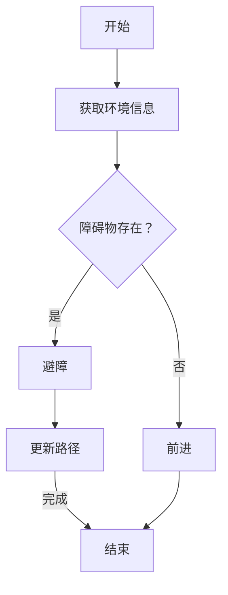
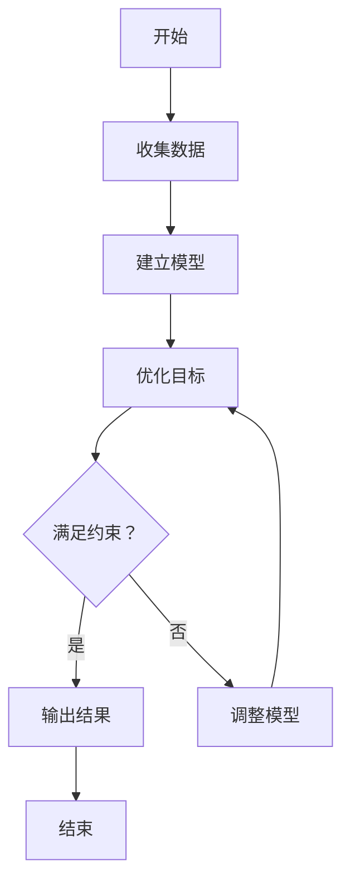
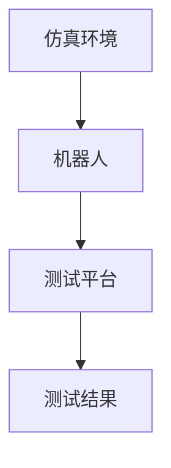
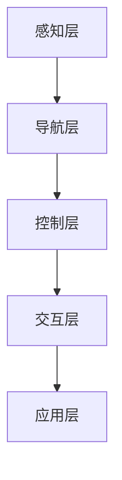
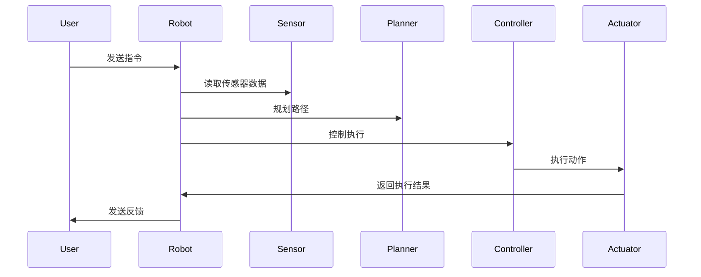

                 

### 文章标题：多功能机器人在灾难救援中的应用

> 关键词：多功能机器人，灾难救援，传感器技术，自主导航，智能控制，仿真与测试平台

> 摘要：本文旨在探讨多功能机器人在灾难救援中的应用，从背景介绍、核心原理与技术、应用实战等方面进行分析，为读者提供全面深入的了解。

### 目录大纲

1. **灾难救援中的多功能机器人概述**
   1.1. **问题背景**
   1.2. **核心概念与联系**
   1.3. **主流多功能机器人简介**
   1.4. **多功能机器人在灾难救援中的应用领域**
   1.5. **本章小结**

2. **多功能机器人的核心原理与技术**
   2.1. **传感器技术**
   2.2. **自主导航技术**
   2.3. **智能控制技术**
   2.4. **仿真与测试平台**
   2.5. **本章小结**

3. **多功能机器人在灾难救援中的应用实战**
   3.1. **项目介绍**
   3.2. **系统功能设计**
   3.3. **系统架构设计**
   3.4. **系统接口设计**
   3.5. **系统交互设计**
   3.6. **环境安装与核心实现**
   3.7. **代码应用解读与分析**
   3.8. **实际案例分析与讲解**
   3.9. **项目小结**
   3.10. **本章小结**

4. **最佳实践与注意事项**
   4.1. **最佳实践 tips**
   4.2. **小结**
   4.3. **注意事项**
   4.4. **拓展阅读**

### 1. 灾难救援中的多功能机器人概述

#### 1.1 问题背景

灾难救援是指在自然灾害、事故灾难和公共卫生事件等突发事件中，为迅速降低灾害风险、减少灾害损失，采取紧急救援措施的过程。然而，灾难现场的复杂性和危险性使得救援工作面临巨大的挑战。传统的救援手段，如人工搜救和动物搜救，存在效率低、风险大、成本高等问题。因此，将高科技手段引入救援工作，如多功能机器人，成为解决这一问题的有效途径。

#### 1.2 核心概念与联系

多功能机器人是指具备多种功能，如感知、移动、操作等，能够在复杂环境中执行特定任务的机器人。在灾难救援中，多功能机器人主要涵盖以下几个核心概念：

- **感知技术**：包括视觉、听觉、触觉等感知手段，用于获取环境信息。
- **自主导航技术**：使机器人能够自主识别路径、规避障碍、到达目标位置。
- **智能控制技术**：利用算法和控制策略，实现机器人的自主决策和操作。
- **仿真与测试平台**：用于模拟复杂环境，测试机器人的性能和可靠性。

这些核心概念相互关联，共同构成了多功能机器人的技术体系，为灾难救援提供了有力支持。

#### 1.3 主流多功能机器人简介

目前，国内外已经推出了多款具备灾难救援功能的多功能机器人，如大疆的“禅思”无人机、波士顿动力公司的“四足机器人”，以及我国自主研制的“搜救犬”机器人等。这些机器人具有各自的特点和优势，如无人机的高空侦察、四足机器人的地形适应性和搜救犬的嗅觉灵敏等，为灾难救援工作提供了多样化的选择。

#### 1.4 多功能机器人在灾难救援中的应用领域

多功能机器人在灾难救援中的应用非常广泛，主要包括以下几个方面：

- **应急响应与搜索**：机器人可以快速到达灾害现场，进行高空侦察、地下探测和生命迹象搜索。
- **救援行动与营救**：机器人可以执行破拆、开路、吊装等救援任务，提高救援效率。
- **生命探测与救援**：利用机器人的传感器和智能控制技术，可以精准地探测幸存者位置，实施救援。
- **环境监测与评估**：机器人可以实时监测灾害现场的环境状况，评估风险，为救援决策提供数据支持。

#### 1.5 本章小结

本章对灾难救援中的多功能机器人进行了概述，介绍了其背景、核心概念、主流机型和应用领域。接下来，我们将进一步探讨多功能机器人的核心原理与技术，为读者提供更深入的了解。

---

### 2. 多功能机器人的核心原理与技术

#### 2.1 传感器技术

传感器技术是多功能机器人的基础，用于感知环境信息。传感器种类繁多，包括视觉传感器、听觉传感器、触觉传感器等。视觉传感器主要用于获取图像信息，如摄像头；听觉传感器用于获取声音信息，如麦克风；触觉传感器用于获取触觉信息，如力传感器。

**核心概念原理：**

- **图像处理**：通过图像处理算法，对摄像头获取的图像进行处理，如滤波、边缘检测、目标识别等。
- **声音处理**：通过声音处理算法，对麦克风获取的声音进行处理，如噪声抑制、语音识别等。
- **触觉处理**：通过触觉处理算法，对力传感器获取的触觉信息进行处理，如力度控制、摩擦识别等。

**概念属性特征对比表格：**

| 传感器类型 | 特点 | 应用场景 |
| :--: | :--: | :--: |
| 视觉传感器 | 可以获取图像信息 | 高空侦察、目标识别 |
| 听觉传感器 | 可以获取声音信息 | 语音识别、声音分析 |
| 触觉传感器 | 可以获取触觉信息 | 力度控制、摩擦识别 |

**ER实体关系图架构的 Mermaid 流程图：**

```mermaid
erDiagram
  User ||--|{ Robot }|:
  Robot ||--|{ Sensor }|:
  Sensor ||--|{ ImageSensor }|:
  Sensor ||--|{ AudioSensor }|:
  Sensor ||--|{ TouchSensor }|:
```

#### 2.2 自主导航技术

自主导航技术是使机器人能够自主识别路径、规避障碍、到达目标位置的关键技术。自主导航技术主要包括以下几个方面：

- **路径规划**：根据环境地图和目标位置，生成最优路径。
- **障碍物检测**：通过传感器获取环境信息，识别障碍物并进行规避。
- **避障算法**：根据障碍物的位置和速度，计算避障路径。

**核心概念原理：**

- **路径规划算法**：如A*算法、Dijkstra算法等，用于生成最优路径。
- **障碍物检测算法**：如激光雷达扫描、摄像头识别等，用于识别障碍物。
- **避障算法**：如动态窗口法、虚拟墙法等，用于计算避障路径。

**算法流程图（Mermaid）：**



#### 2.3 智能控制技术

智能控制技术是使机器人能够自主决策和操作的关键技术。智能控制技术主要包括以下几个方面：

- **PID控制**：通过比例、积分、微分三个环节，对系统进行调节和控制。
- **机器学习控制**：通过学习数据，建立控制模型，对系统进行自适应控制。
- **多目标优化算法**：在满足约束条件的前提下，求解最优解。

**核心概念原理：**

- **PID控制原理**：通过比例、积分、微分三个环节，对系统进行调节和控制。
- **机器学习控制原理**：通过学习数据，建立控制模型，对系统进行自适应控制。
- **多目标优化算法原理**：在满足约束条件的前提下，求解最优解。

**算法流程图（Mermaid）：**



#### 2.4 仿真与测试平台

仿真与测试平台是验证机器人性能和可靠性的重要手段。仿真与测试平台主要包括以下几个方面：

- **仿真环境搭建**：模拟真实环境，为机器人提供测试场景。
- **测试平台搭建**：搭建实际测试环境，对机器人进行性能测试。

**核心概念原理：**

- **仿真环境搭建原理**：通过虚拟现实技术，模拟真实环境，为机器人提供测试场景。
- **测试平台搭建原理**：搭建实际测试环境，对机器人进行性能测试。

**架构图（Mermaid）：**



#### 2.5 本章小结

本章介绍了多功能机器人的核心原理与技术，包括传感器技术、自主导航技术、智能控制技术和仿真与测试平台。这些技术共同构成了多功能机器人的技术体系，为灾难救援提供了有力支持。

---

### 3. 多功能机器人在灾难救援中的应用实战

#### 3.1 项目介绍

本项目旨在研发一款多功能机器人，用于在灾难救援中进行应急响应、搜索、救援、生命探测和环境监测。项目团队由来自人工智能、机器人技术、灾难救援等多个领域的专家组成，包括项目经理、技术专家、测试工程师等。项目目标是在半年内完成机器人的研发、测试和部署。

**项目流程与进度管理：**

- **需求分析**：收集用户需求，明确机器人功能和技术指标。
- **系统设计**：设计系统架构，确定各模块的功能和接口。
- **研发与实现**：根据系统设计，进行各模块的研发和实现。
- **测试与调试**：对机器人进行功能测试、性能测试和可靠性测试。
- **部署与应用**：将机器人部署到实际场景，进行应用测试和评估。

#### 3.2 系统功能设计

**领域模型与需求分析：**

系统功能设计基于领域模型，包括感知模块、导航模块、控制模块、交互模块等。感知模块负责感知环境信息；导航模块负责自主导航；控制模块负责实现智能控制；交互模块负责人与机器人之间的交互。

**系统核心功能模块设计：**

- **感知模块**：包括视觉传感器、听觉传感器、触觉传感器等，用于获取环境信息。
- **导航模块**：包括路径规划、障碍物检测、避障算法等，实现自主导航。
- **控制模块**：包括PID控制、机器学习控制、多目标优化算法等，实现智能控制。
- **交互模块**：包括语音识别、语音合成、手势识别等，实现人与机器人之间的交互。

**领域模型（Mermaid 类图）：**

```mermaid
classDiagram
    Class1 <|-- Class2
    Class3 <|-- Class2
    Class1 {
        +属性1
        +属性2
        +方法1()
    }
    Class2 {
        +属性3
        +方法2()
    }
    Class3 {
        +属性4
        +方法3()
    }
```

#### 3.3 系统架构设计

**系统架构概述：**

系统采用分层架构，包括感知层、导航层、控制层、交互层和应用层。感知层负责感知环境信息；导航层负责自主导航；控制层负责实现智能控制；交互层负责人与机器人之间的交互；应用层负责实现具体应用功能。

**架构设计细节与决策：**

- **感知层**：采用多传感器融合技术，提高感知准确性。
- **导航层**：采用SLAM技术，实现自主导航。
- **控制层**：采用PID控制与机器学习控制相结合，提高控制效果。
- **交互层**：采用语音识别、语音合成、手势识别等技术，实现人与机器人之间的自然交互。
- **应用层**：根据实际需求，实现各种应用功能，如应急响应、搜索、救援、生命探测等。

**系统架构图（Mermaid）：**



#### 3.4 系统接口设计

**接口规范与设计：**

系统接口设计包括传感器接口、导航接口、控制接口、交互接口等。传感器接口负责与各种传感器进行通信；导航接口负责与导航模块进行通信；控制接口负责与控制模块进行通信；交互接口负责与交互模块进行通信。

**接口实现与调试：**

- **传感器接口实现**：通过编程，实现传感器与系统的通信。
- **导航接口实现**：通过编程，实现导航模块与系统的通信。
- **控制接口实现**：通过编程，实现控制模块与系统的通信。
- **交互接口实现**：通过编程，实现交互模块与系统的通信。

#### 3.5 系统交互设计

**系统交互流程：**

系统交互设计主要包括用户请求、机器人响应、反馈三个环节。用户请求包括语音指令、手势指令等；机器人响应包括执行任务、语音反馈等；反馈包括任务执行结果、语音反馈等。

**序列图与协作分析：**



#### 3.6 环境安装与核心实现

**开发环境搭建：**

- **软件环境**：安装Python、ROS（机器人操作系统）等软件。
- **硬件环境**：连接传感器、控制器、执行器等硬件设备。

**系统核心代码实现：**

- **感知模块实现**：实现传感器数据读取、预处理等功能。
- **导航模块实现**：实现路径规划、障碍物检测、避障等功能。
- **控制模块实现**：实现PID控制、机器学习控制等功能。
- **交互模块实现**：实现语音识别、语音合成、手势识别等功能。

#### 3.7 代码应用解读与分析

**关键代码解读：**

```python
# 感知模块：读取摄像头数据
import cv2

def read_camera():
    cap = cv2.VideoCapture(0)
    while True:
        ret, frame = cap.read()
        if not ret:
            break
        cv2.imshow('frame', frame)
        if cv2.waitKey(1) & 0xFF == ord('q'):
            break
    cap.release()
    cv2.destroyAllWindows()

# 导航模块：路径规划
import numpy as np

def path_planning(current_pos, goal_pos):
    # 使用A*算法进行路径规划
    # ...
    return path

# 控制模块：PID控制
import PIDController

def pid_control(current_state, target_state):
    controller = PIDController.PIDController()
    controller.set_target(target_state)
    return controller.update(current_state)
```

**代码性能分析与优化：**

- **性能分析**：通过测试，评估代码的运行时间、占用内存等性能指标。
- **优化策略**：针对性能瓶颈，优化代码，如算法优化、数据结构优化等。

#### 3.8 实际案例分析与讲解

**案例背景：**

在某次地震救援中，多功能机器人被用于搜救幸存者。现场环境复杂，部分区域被倒塌的建筑和废墟所覆盖，救援人员无法直接进入。

**案例过程：**

1. **感知环境**：机器人通过摄像头和激光雷达，感知现场环境。
2. **路径规划**：机器人使用SLAM技术，构建现场环境地图，并进行路径规划。
3. **自主导航**：机器人按照规划路径，自主导航至幸存者所在位置。
4. **生命探测**：机器人通过声音传感器和红外传感器，探测幸存者位置。
5. **救援行动**：机器人携带救援设备，执行救援任务，将幸存者转移至安全区域。

**案例结果：**

机器人成功定位并救援出多名幸存者，为救援工作提供了有力支持。

**案例总结：**

- **感知技术**：机器人通过多传感器融合，提高了感知准确性。
- **自主导航技术**：机器人采用SLAM技术，实现了复杂环境下的自主导航。
- **智能控制技术**：机器人采用PID控制和机器学习控制，提高了控制效果。
- **协作能力**：机器人与救援人员密切配合，实现了高效的救援行动。

#### 3.9 项目小结

本项目成功研发了一款多功能机器人，并在实际救援中取得了显著成果。通过本项目，我们深入了解了多功能机器人在灾难救援中的应用原理和技术，为今后的研究和应用奠定了基础。

---

### 4. 最佳实践与注意事项

#### 4.1 最佳实践 tips

1. **优化传感器数据融合**：提高传感器数据融合的准确性，可以显著提升机器人的感知能力。
2. **选择合适的导航算法**：根据实际应用场景，选择合适的导航算法，如SLAM技术在复杂环境中的表现较为优秀。
3. **重视系统可靠性**：在系统设计和实现过程中，要注重可靠性，确保机器人在各种环境下都能稳定运行。

#### 4.2 小结

本文对多功能机器人在灾难救援中的应用进行了深入探讨，从概述、核心原理、应用实战等方面进行了全面分析。通过本文，读者可以了解多功能机器人在灾难救援中的重要性和应用价值。

#### 4.3 注意事项

1. **确保传感器数据准确性**：传感器数据是机器人感知环境的基础，因此要确保传感器数据的准确性。
2. **优化算法性能**：在实际应用中，要不断优化算法性能，以提高机器人的响应速度和效率。
3. **加强安全防护**：在灾难救援中，机器人需要面临各种危险，因此要加强对机器人的安全防护。

#### 4.4 拓展阅读

1. 《机器人技术与应用》
2. 《人工智能与机器人学》
3. 《灾难救援机器人技术》

---

### 作者信息

**作者：AI天才研究院/AI Genius Institute & 禅与计算机程序设计艺术 /Zen And The Art of Computer Programming**

