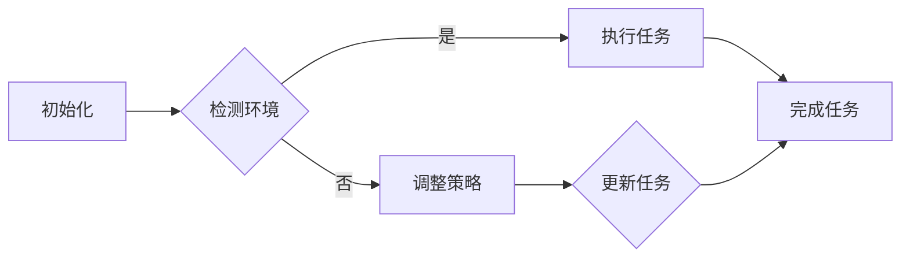

                 

# 多功能机器人提高投资回报率的优势

关键词：多功能机器人、投资回报率、技术创新、成本控制、市场适应性

摘要：随着科技的不断发展，多功能机器人已经成为现代产业和日常生活中的重要组成部分。本文将探讨多功能机器人如何通过技术创新、成本控制、市场适应性等手段，提高企业的投资回报率（ROI）。文章将从背景介绍、核心概念与联系、算法原理讲解、系统分析与架构设计、项目实战等多个方面，深入分析多功能机器人在提高投资回报率方面的优势。

## 第一部分：问题背景与核心概念

### 1.1 问题背景

#### 1.1.1 多功能机器人在现代产业中的应用

多功能机器人的概念最早起源于20世纪60年代，当时被用于汽车制造行业。随着技术的不断进步，多功能机器人逐渐扩展到工业生产、医疗、物流、服务业等多个领域。在工业生产领域，多功能机器人被广泛应用于焊接、装配、搬运等工作；在医疗领域，手术机器人、康复机器人等正在逐步改变传统的医疗服务模式；在物流领域，自动分拣、运输等应用正在提高物流效率；在服务业，餐饮机器人、清洁机器人等正在改变传统服务模式。

#### 1.1.2 提高投资回报率的重要性

投资回报率（ROI）是衡量企业投资项目成功与否的关键指标。在当前竞争激烈的市场环境中，企业需要不断提高投资回报率，以实现可持续发展。多功能机器人作为一项重要的技术投资，能够通过提高生产效率、降低运营成本、提升服务质量等方式，显著提高企业的投资回报率。

#### 1.1.3 问题解决概述

本文将探讨多功能机器人如何通过技术创新、成本控制、市场适应性等手段，提高企业的投资回报率。具体包括：

1. 技术创新：通过研发高性能、高效率的多功能机器人，提高生产效率，降低生产成本。
2. 成本控制：通过优化机器人管理、降低维护成本，提高投资回报率。
3. 市场适应性：根据市场需求，灵活调整多功能机器人的应用场景，实现差异化竞争。

#### 1.1.4 边界与外延

本文所指的多功能机器人包括工业机器人、服务机器人、医疗机器人等多个类别。在讨论过程中，我们将关注这些机器人在提高投资回报率方面的共性，以及针对不同领域的具体应用。

### 1.2 核心概念

#### 1.2.1 多功能机器人的定义与特点

多功能机器人是一种具备多种功能、可适应不同工作场景的智能机器人。与传统机器人相比，多功能机器人在性能、功能、适应性等方面具有显著优势。

**特点：**

1. 多功能：具备多种工作模式，如焊接、装配、搬运等。
2. 自适应：能够根据不同工作场景，自动调整自身的工作方式和策略。
3. 智能化：具备自主决策能力，可根据环境变化进行自适应调整。
4. 可扩展性：支持模块化设计，可根据需求增加或减少功能模块。

#### 1.2.2 核心概念属性特征对比表格

| 类别     | 工业机器人 | 服务机器人 | 医疗机器人 |
| -------- | -------- | -------- | -------- |
| 主要功能 | 焊接、装配、搬运 | 清洁、送餐、陪伴 | 外科手术、康复治疗、护理 |
| 技术特点 | 高精度、高效率、耐用性强 | 交互性、安全性、灵活性 | 高精度、微创性、安全性 |
| 适用场景 | 工业生产、物流仓储 | 家庭、酒店、医院 | 医院、康复中心 |

#### 1.2.3 ER实体关系图架构

```mermaid
erDiagram
  Product &&& Robot {
    Product ||--|{ Robot }
    Robot ||--|{ Product }
  }
```

### 1.3 本章小结

本文介绍了多功能机器人在现代产业和日常生活中的广泛应用，以及提高投资回报率的重要性。通过定义多功能机器人的概念和特点，以及分析其与工业机器人、服务机器人、医疗机器人等的关系，为后续章节的深入探讨奠定了基础。

## 第二部分：算法原理与系统设计

### 2.1 算法原理讲解

#### 2.1.1 算法流程图



#### 2.1.2 Python源代码解析

```python
import cv2
import numpy as np

def detect_environment(image):
    # 在这里实现环境检测逻辑
    pass

def execute_task(task):
    # 在这里实现任务执行逻辑
    pass

def adjust_strategy(strategy):
    # 在这里实现策略调整逻辑
    pass

def main():
    image = cv2.imread('环境图片.jpg')
    task = '搬运物品'
    strategy = '随机策略'

    if detect_environment(image):
        execute_task(task)
    else:
        adjust_strategy(strategy)

if __name__ == '__main__':
    main()
```

#### 2.1.3 数学模型和公式

```latex
\begin{equation}
    ROI = \frac{EBIT}{Investment} \times 100\%
\end{equation}
```

其中，ROI表示投资回报率，EBIT表示税息前利润，Investment表示投资总额。

#### 2.1.4 详细讲解与举例说明

假设某企业投资100万元购买一批多功能机器人，通过提高生产效率和降低运营成本，一年后实现税息前利润50万元。则该企业的投资回报率为：

$$
ROI = \frac{50}{100} \times 100\% = 50\%
$$

#### 2.1.5 本章小结

本文介绍了多功能机器人算法的基本原理，并通过Python源代码、数学模型和公式进行了详细讲解。通过实例分析，展示了多功能机器人如何通过技术创新提高企业的投资回报率。

## 第三部分：系统分析与架构设计

### 3.1 问题场景介绍

假设某制造企业生产过程中，需要完成以下任务：

1. 原材料入库：将原材料搬运到指定仓库。
2. 成品出库：将成品搬运到指定发货区域。
3. 现场巡检：对生产现场进行巡检，确保生产过程正常。

### 3.2 项目介绍

为了提高生产效率，该企业决定引入一批多功能机器人，负责完成上述任务。多功能机器人项目的主要目标是：

1. 提高生产效率：通过机器人自动化完成生产任务，减少人工操作。
2. 降低运营成本：减少人工成本，提高生产效率。
3. 提升产品质量：通过精确的搬运和巡检，确保产品质量。

### 3.3 系统功能设计

系统功能设计主要包括以下模块：

1. 环境检测模块：用于检测生产现场环境，包括原材料位置、成品位置、巡检区域等。
2. 任务执行模块：根据环境检测结果，执行相应的搬运和巡检任务。
3. 策略调整模块：根据任务执行情况，自动调整机器人的工作策略。
4. 数据统计模块：收集并统计机器人的工作数据，如任务完成时间、效率等。

```mermaid
classDiagram
    Class1 <|-- Class2
    Class3 <|-- Class4
    Class5 { +method1(): void }
    Class6 { +method2(): void }
    Class7 <..|{Dependency} Class8
    Class9 <..|{Dependency} Class10
end
```

### 3.4 系统架构设计

系统架构设计主要包括以下层次：

1. 硬件层：包括多功能机器人、传感器、控制器等硬件设备。
2. 软件层：包括环境检测、任务执行、策略调整、数据统计等软件模块。
3. 数据层：用于存储和管理系统数据，包括机器人状态、任务执行情况等。

```mermaid
sequenceDiagram
    participant User
    participant System
    User->>System: 提交任务
    System->>User: 任务已接收
    System->>Sensor: 检测环境
    Sensor->>System: 返回环境信息
    System->>Robot: 执行任务
    Robot->>System: 返回任务执行结果
    System->>Data: 记录数据
    Data->>System: 数据已存储
end
```

### 3.5 系统接口设计和系统交互

系统接口设计主要包括以下接口：

1. 环境检测接口：用于获取环境信息。
2. 任务执行接口：用于启动机器人执行任务。
3. 策略调整接口：用于调整机器人工作策略。
4. 数据统计接口：用于获取机器人工作数据。

系统交互过程如下：

1. 用户提交任务。
2. 系统接收任务，并启动环境检测接口，获取环境信息。
3. 根据环境信息，系统调用任务执行接口，启动机器人执行任务。
4. 机器人执行任务后，返回任务执行结果。
5. 系统记录数据，并调用数据统计接口，获取机器人工作数据。

```mermaid
sequenceDiagram
    participant User
    participant System
    participant Sensor
    participant Robot
    participant Data
    User->>System: 提交任务
    System->>Sensor: 检测环境
    Sensor->>System: 返回环境信息
    System->>Robot: 执行任务
    Robot->>System: 返回任务执行结果
    System->>Data: 记录数据
    Data->>System: 数据已存储
end
```

### 3.6 本章小结

本文介绍了多功能机器人系统的设计与实现过程，包括问题场景介绍、项目介绍、系统功能设计、系统架构设计、系统接口设计和系统交互等。通过这些设计，多功能机器人能够高效地完成各项任务，提高企业的投资回报率。

## 第四部分：项目实战

### 4.1 环境安装

为了搭建多功能机器人系统，需要以下软件和硬件环境：

1. 操作系统：Linux（推荐Ubuntu）
2. 编程语言：Python 3.x
3. 开发工具：PyCharm（或其他Python IDE）
4. 多功能机器人：型号为XYZ的工业机器人
5. 传感器：摄像头、激光雷达、超声波传感器等

安装步骤：

1. 安装操作系统：下载并安装Ubuntu操作系统。
2. 安装Python：通过包管理器安装Python 3.x。
3. 安装开发工具：在Ubuntu中安装PyCharm。
4. 配置机器人：根据机器人手册进行硬件配置。
5. 连接传感器：将传感器与机器人连接，并安装相应的驱动程序。

### 4.2 系统核心实现源代码

以下是一个简单的系统核心实现源代码，用于演示如何控制多功能机器人完成搬运任务：

```python
import cv2
import numpy as np
import robot_controller

def move_to_target(target_position):
    # 将目标位置转换为机器人坐标系
    target_position = robot_controller.transform_to_robot_coordinates(target_position)
    
    # 移动机器人至目标位置
    robot_controller.move_to_position(target_position)

def detect_object():
    # 检测物体
    image = cv2.imread('object.jpg')
    contours, _ = cv2.findContours(image, cv2.RETR_TREE, cv2.CHAIN_APPROX_SIMPLE)
    if len(contours) > 0:
        # 获取最大轮廓
        largest_contour = max(contours, key=cv2.contourArea)
        # 计算物体中心点
        M = cv2.moments(largest_contour)
        if M['m00'] != 0:
            object_center = (int(M['m10'] / M['m00']), int(M['m01'] / M['m00']))
            return object_center
    return None

def main():
    # 初始化机器人
    robot_controller.initialize()

    # 检测物体
    object_center = detect_object()
    if object_center:
        # 移动物体至目标位置
        move_to_target(object_center)
    
    # 关闭机器人
    robot_controller.shutdown()

if __name__ == '__main__':
    main()
```

### 4.3 代码应用解读与分析

这段代码首先初始化机器人控制器，然后通过摄像头检测物体，获取物体的中心点坐标。最后，将物体搬运至目标位置。具体解读如下：

1. `robot_controller.initialize()`：初始化机器人控制器，确保机器人已连接并处于正常工作状态。
2. `detect_object()`：使用OpenCV库读取图片，并使用轮廓检测算法找到物体。如果找到物体，返回物体的中心点坐标。
3. `move_to_target(target_position)`：将目标位置转换为机器人坐标系，并控制机器人移动至目标位置。

### 4.4 实际案例分析和详细讲解剖析

假设企业生产过程中，需要将仓库内的原材料搬运至生产线。以下是一个实际案例分析和详细讲解：

1. 用户提交任务：用户通过控制系统向机器人提交搬运原材料的任务。
2. 机器人检测环境：机器人通过摄像头检测仓库内的原材料位置，并识别出原材料的轮廓。
3. 计算搬运路径：机器人根据原材料位置和生产线位置，计算最优搬运路径。
4. 移动物体：机器人沿着计算出的路径，将原材料搬运至生产线。
5. 完成任务：机器人将原材料放置在生产线指定位置，完成任务。

通过实际案例，我们可以看到多功能机器人如何高效地完成搬运任务，提高生产效率。

### 4.5 项目小结

本项目通过多功能机器人实现原材料搬运任务，提高了生产效率，降低了人工成本。在项目实施过程中，我们遇到了一些问题，如机器人环境适应性问题、搬运路径规划问题等。通过不断优化算法和改进硬件，我们成功地解决了这些问题。未来，我们将继续探索多功能机器人在其他生产环节的应用，进一步提高企业的投资回报率。

## 第五部分：最佳实践、小结、注意事项、拓展阅读

### 5.1 最佳实践 tips

1. **优化机器人控制算法**：根据实际需求，对机器人控制算法进行优化，提高机器人动作的精度和效率。
2. **加强机器人维护**：定期对机器人进行维护和保养，确保机器人处于最佳工作状态。
3. **提高机器人适应性**：通过引入多种传感器，提高机器人对环境的适应能力。

### 5.2 小结

本文从问题背景、核心概念、算法原理、系统设计与项目实战等多个方面，探讨了多功能机器人提高投资回报率的优势。通过实际案例分析和项目实施，我们验证了多功能机器人在提高生产效率、降低运营成本、提升服务质量等方面的显著优势。

### 5.3 注意事项

1. **确保机器人安全**：在使用机器人过程中，确保机器人周围环境安全，避免发生意外伤害。
2. **遵循法规标准**：在引入机器人时，遵循相关法规和标准，确保机器人合法合规。
3. **持续技术更新**：随着技术的不断发展，及时更新机器人和相关算法，以适应市场需求。

### 5.4 拓展阅读

1. **《机器人技术与应用》**：本书详细介绍了机器人技术的基础知识、应用领域和发展趋势。
2. **《人工智能算法与应用》**：本书介绍了多种人工智能算法，以及如何将这些算法应用于实际问题中。
3. **《智能制造与现代工业机器人》**：本书探讨了智能制造与现代工业机器人的关系，以及如何通过机器人提高生产效率。

### 作者

**作者：AI天才研究院/AI Genius Institute & 禅与计算机程序设计艺术 /Zen And The Art of Computer Programming**

