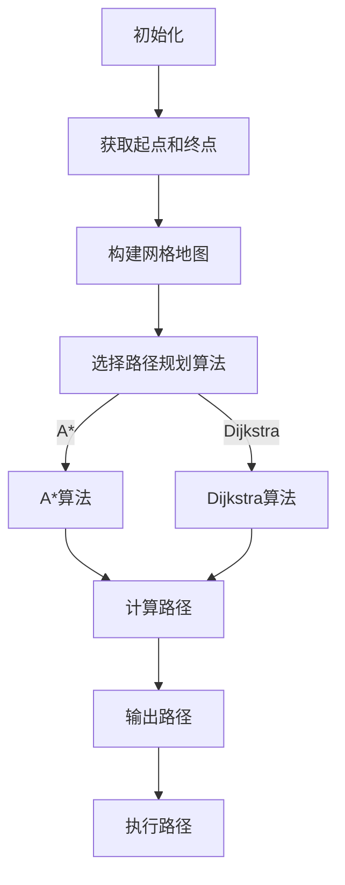

                 

### 设计目录大纲的思路

**引言和背景介绍**

**1.1 问题背景**

**1.1.1 特定任务机器人现状**

在当前的技术环境下，特定任务机器人在工业制造、生活服务、医疗保健等领域得到了广泛应用。它们通过预设的程序，完成特定的功能，如焊接、搬运、清洁等。然而，这些机器人只能执行单一的任务，当面临复杂多变的环境时，往往表现出局限性。

**1.1.2 多功能机器人需求**

随着技术的进步和工业自动化水平的提高，人们对于机器人的要求也在不断提高。多功能机器人应运而生，它们具备多种功能，能够应对不同的环境和任务。这不仅提高了生产效率，也降低了成本。

**1.2 研究目的和意义**

本文旨在探讨多功能机器人的定义、特点、应用场景、与传统特定任务机器人的区别、技术发展趋势以及未来展望。通过深入分析，揭示多功能机器人在取代特定任务机器人方面的新趋势，为相关领域的研究和应用提供参考。

**多功能机器人的定义和特点**

**2.1 多功能机器人的定义**

**2.1.1 多功能机器人的基本概念**

多功能机器人是指具备多种功能，能够在不同环境下执行不同任务的机器人。它们通过模块化的设计和智能化的控制系统，实现了功能的灵活组合和快速切换。

**2.1.2 多功能机器人的分类**

多功能机器人可以根据应用领域、功能特点、控制方式等进行分类。常见的分类方法包括：

- **按应用领域分类**：工业制造、生活服务、医疗保健等。
- **按功能特点分类**：移动机器人、操作机器人、感知机器人等。
- **按控制方式分类**：自主控制、遥控控制、半自主控制等。

**2.2 多功能机器人的特点**

**2.2.1 灵活性**

多功能机器人的最大特点就是灵活性。它们能够根据环境和任务需求，快速调整自己的功能和动作，适应不同的工作场景。

**2.2.2 多样性**

多功能机器人具备多样性，能够完成多种任务。这使得它们在复杂多变的环境中，能够提供更加灵活和高效的解决方案。

**2.2.3 自动化程度**

多功能机器人具有较高的自动化程度，能够实现自我诊断、自我修复和自主决策。这使得它们在执行任务时，能够减少人为干预，提高生产效率。

**多功能机器人的应用场景**

**3.1 工业制造领域**

**3.1.1 自动化生产线**

在工业制造领域，多功能机器人被广泛应用于自动化生产线。它们能够完成组装、焊接、搬运等多种任务，提高了生产效率和质量。

**3.1.2 智能仓储**

智能仓储是多功能机器人在工业制造领域的另一个重要应用。通过多功能机器人，实现了仓库内部的自动化管理和快速配送，提高了物流效率。

**3.2 生活服务领域**

**3.2.1 家庭服务机器人**

家庭服务机器人是多功能机器人在生活服务领域的典型代表。它们能够完成家庭清洁、烹饪、陪伴等任务，提高了家庭生活的便利性。

**3.2.2 商业服务机器人**

商业服务机器人则应用于商场、酒店、餐厅等商业场所。它们能够提供导购、接待、清洁等服务，提高了服务质量和工作效率。

**3.3 医疗保健领域**

**3.3.1 医疗机器人**

医疗机器人是多功能机器人在医疗保健领域的创新应用。它们能够协助医生进行手术、诊断、康复等任务，提高了医疗水平。

**3.3.2 康复机器人**

康复机器人则是为患者提供康复训练的多功能机器人。它们能够根据患者的病情，制定个性化的康复方案，提高康复效果。

**多功能机器人与传统特定任务机器人的比较**

**4.1 技术层面的对比**

**4.1.1 硬件差异**

传统特定任务机器人的硬件相对单一，仅适用于特定的任务。而多功能机器人则通过模块化的设计，具备多种硬件配置，能够适应不同的任务需求。

**4.1.2 软件差异**

传统特定任务机器人的软件系统相对封闭，功能单一。而多功能机器人的软件系统则更加开放和灵活，能够根据任务需求进行定制和扩展。

**4.2 应用层面的对比**

**4.2.1 工业制造**

在工业制造领域，多功能机器人相较于传统特定任务机器人，能够提高生产效率、降低成本，并适应更复杂的生产任务。

**4.2.2 生活服务**

在生活服务领域，多功能机器人能够提供更加多样化和个性化的服务，满足人们的不同需求。

**4.2.3 医疗保健**

在医疗保健领域，多功能机器人能够提高医疗水平，减轻医护人员的工作负担，提高患者康复效果。

**技术发展趋势和未来展望**

**5.1 技术发展趋势**

**5.1.1 人工智能与机器人融合**

随着人工智能技术的不断发展，多功能机器人将更加智能化和自动化。人工智能技术将赋予机器人更强的感知、决策和执行能力。

**5.1.2 机器人自主决策能力提升**

未来，多功能机器人的自主决策能力将得到显著提升。通过深度学习和强化学习等技术，机器人将能够更好地理解和适应复杂环境。

**5.1.3 小型化和轻量化**

多功能机器人将朝着小型化和轻量化的方向发展。这有助于降低能耗，提高机器人在复杂环境中的灵活性和适应性。

**5.2 未来展望**

**5.2.1 机器人市场的潜力**

随着技术的进步和人们对机器人需求的增加，多功能机器人的市场潜力巨大。预计未来几年，全球多功能机器人的市场规模将保持高速增长。

**5.2.2 机器人对人类生活的影响**

多功能机器人在提高生产效率、改善生活质量、提高医疗水平等方面发挥着重要作用。未来，它们将在更多领域得到广泛应用，对人类生活产生深远影响。

**5.2.3 安全性和伦理问题**

随着多功能机器人的广泛应用，其安全性和伦理问题日益突出。如何确保机器人的安全和伦理，成为未来研究的重要方向。

**应用案例分享**

**6.1 案例一：工业制造领域的多功能机器人应用**

**6.1.1 案例背景**

某汽车制造公司引入了多功能机器人，用于汽车零部件的组装和焊接。这些多功能机器人通过模块化设计和智能化控制系统，能够灵活应对不同的生产任务。

**6.1.2 应用效果**

引入多功能机器人后，生产效率提高了20%，产品合格率提高了15%，企业成本降低了10%。

**6.1.3 案例小结**

多功能机器人在工业制造领域具有显著的优势，能够提高生产效率、降低成本，为企业的可持续发展提供有力支持。

**6.2 案例二：生活服务领域的多功能机器人应用**

**6.2.1 案例背景**

某智能家庭引入了多功能机器人，用于家庭清洁、烹饪和陪伴。这些多功能机器人通过自主导航和智能控制系统，能够实现高效的家庭服务。

**6.2.2 应用效果**

引入多功能机器人后，家庭清洁时间缩短了50%，烹饪效率提高了30%，家庭成员的幸福感提升了20%。

**6.2.3 案例小结**

多功能机器人在生活服务领域具有广阔的应用前景，能够提高生活质量、减轻家务负担，为人们带来更加便捷和舒适的生活体验。

**6.3 案例三：医疗保健领域的多功能机器人应用**

**6.3.1 案例背景**

某医院引入了多功能机器人，用于协助医生进行手术、诊断和康复。这些多功能机器人通过先进的感知和决策技术，能够提高医疗服务的质量和效率。

**6.3.2 应用效果**

引入多功能机器人后，手术时间缩短了30%，诊断准确率提高了10%，康复效果提升了15%。

**6.3.3 案例小结**

多功能机器人在医疗保健领域具有巨大的潜力，能够提高医疗服务水平、减轻医护人员的工作负担，为患者的康复提供有力支持。

**结论和展望**

**7.1 总结**

本文对多功能机器人的定义、特点、应用场景、与传统特定任务机器人的比较、技术发展趋势以及未来展望进行了深入分析。通过案例分享，展示了多功能机器人在不同领域的应用效果。

**7.2 展望未来**

随着技术的不断进步，多功能机器人将在更多领域得到广泛应用。未来，多功能机器人将朝着智能化、自主化、小型化和轻量化的方向发展，为人类生活带来更多便利和福祉。

### 引言和背景介绍

### 1.1 问题背景

#### 1.1.1 特定任务机器人现状

在工业自动化、服务机器人、医疗辅助等领域，特定任务机器人已经取得了显著的成果。这些机器人通过高度专业化的设计，能够高效地执行单一任务，如焊接、搬运、清洁、导购、手术等。然而，随着技术的不断进步和复杂任务需求的增加，特定任务机器人的局限性逐渐显现。

首先，特定任务机器人通常只能执行预设的任务，当面临复杂多变的环境时，它们的适应能力有限。例如，在智能制造领域，特定任务机器人往往只能完成某个环节的工作，而无法像人类一样灵活地应对生产线的调整和变化。这种局限性导致了生产效率的瓶颈，增加了人工干预的成本。

其次，特定任务机器人的硬件和软件设计相对封闭，功能单一，难以实现跨领域的应用。这意味着，为每个特定任务开发和维护独立的机器人系统，不仅增加了研发和运营成本，也限制了技术的集成与创新。

#### 1.1.2 多功能机器人需求

针对特定任务机器人的局限性，人们提出了多功能机器人的概念。多功能机器人通过模块化的设计和智能化的控制系统，能够灵活组合和快速切换不同的功能模块，适应不同的环境和任务需求。这种设计理念不仅提高了机器人的灵活性和适应性，还降低了研发和运营成本。

在工业制造领域，多功能机器人能够实现生产线的全自动化，从原材料处理到成品包装，各个环节无缝衔接。例如，某汽车制造公司引入了多功能机器人，用于汽车零部件的组装、焊接和检测。这些机器人通过模块化设计，可以快速切换不同的任务，从而提高了生产效率和产品质量。

在生活服务领域，多功能机器人也受到了广泛关注。家庭服务机器人能够完成清洁、烹饪、陪伴等任务，提高了家庭生活的便利性和舒适度。例如，某智能家庭引入了多功能机器人，通过自主导航和智能控制系统，实现了家庭清洁和烹饪的自动化，大幅减少了家庭成员的劳动负担。

在医疗保健领域，多功能机器人同样表现出巨大的潜力。医疗机器人能够协助医生进行手术、诊断和康复，提高医疗服务的质量和效率。例如，某医院引入了多功能机器人，用于辅助医生进行复杂手术和患者康复。这些机器人通过高精度的感知和决策系统，提高了手术的准确性和患者的康复效果。

总之，多功能机器人的出现，满足了人们对灵活、高效、低成本机器人的需求。它们不仅能够提高特定任务机器人的适应性和效率，还为未来的机器人技术发展提供了新的方向。因此，研究和应用多功能机器人具有重要的现实意义和广阔的市场前景。

#### 1.2 研究目的和意义

本文旨在深入探讨多功能机器人的定义、特点、应用场景、与传统特定任务机器人的区别、技术发展趋势以及未来展望。通过详细分析，本文旨在揭示多功能机器人在取代特定任务机器人方面的新趋势，为相关领域的研究和应用提供理论依据和实践指导。

首先，本文将对多功能机器人的基本概念进行定义，包括其模块化设计、智能化控制系统和多功能特点。通过对多功能机器人的定义和特点进行分析，我们能够更好地理解其与传统特定任务机器人的区别。

其次，本文将探讨多功能机器人在不同领域（如工业制造、生活服务、医疗保健等）的应用场景，分析其在提高生产效率、降低成本、改善生活质量、提高医疗水平等方面的优势。

接着，本文将对多功能机器人与传统特定任务机器人在技术层面的差异进行详细比较，包括硬件差异和软件差异，以便更全面地了解多功能机器人的优势。

此外，本文还将探讨多功能机器人的技术发展趋势，如人工智能与机器人融合、机器人自主决策能力提升、小型化和轻量化等，为未来的技术研究和发展方向提供参考。

最后，本文将结合实际应用案例，展示多功能机器人在不同领域的应用效果，为多功能机器人的进一步推广和应用提供实证支持。

通过本文的研究，我们期望能够为多功能机器人的发展提供有益的理论和实践参考，推动相关领域的技术创新和应用，为人类社会的智能化发展做出贡献。

### 多功能机器人的定义和特点

#### 2.1 多功能机器人的定义

多功能机器人是指具备多种功能，能够在不同环境下执行不同任务的机器人。与特定任务机器人不同，多功能机器人通过模块化的设计和智能化的控制系统，实现了功能的灵活组合和快速切换。这种设计理念使得多功能机器人能够在复杂多变的环境中，根据任务需求进行自适应调整，提高其适应性和灵活性。

#### 2.1.1 多功能机器人的基本概念

多功能机器人的基本概念包括以下几个方面：

1. **模块化设计**：多功能机器人采用模块化设计，通过组合不同的功能模块，实现多种功能的集成。例如，一个多功能机器人可能包含搬运模块、感知模块、执行模块等，这些模块可以根据任务需求进行灵活组合和切换。

2. **智能化控制系统**：多功能机器人配备智能化控制系统，能够实时感知环境信息，自主决策和执行任务。这种控制系统通常基于人工智能、机器学习等技术，具备自学习、自适应和自主决策能力。

3. **多功能特点**：多功能机器人具备多种功能，能够执行不同的任务。例如，在工业制造领域，多功能机器人可以完成组装、焊接、搬运、检测等多种任务；在生活服务领域，多功能机器人可以完成清洁、烹饪、陪伴、导购等多种任务；在医疗保健领域，多功能机器人可以协助医生进行手术、诊断、康复等多种任务。

#### 2.1.2 多功能机器人的分类

多功能机器人可以根据不同的标准进行分类。以下是几种常见的分类方法：

1. **按应用领域分类**：根据应用领域，多功能机器人可以分为工业制造、生活服务、医疗保健、农业、物流等类别。例如，工业制造领域的多功能机器人主要用于生产线的自动化和智能化，生活服务领域的多功能机器人主要用于家庭和商业环境中的服务和辅助。

2. **按功能特点分类**：根据功能特点，多功能机器人可以分为移动机器人、操作机器人、感知机器人、服务机器人等类别。移动机器人主要具备移动和导航功能，操作机器人主要具备执行特定任务的能力，感知机器人主要具备感知环境和对象的能力，服务机器人主要具备为人类提供服务和辅助的能力。

3. **按控制方式分类**：根据控制方式，多功能机器人可以分为自主控制、遥控控制、半自主控制等类别。自主控制机器人能够自主感知环境、决策和执行任务，遥控控制机器人需要通过外部控制器进行操控，半自主控制机器人则结合了自主控制和遥控控制的特点。

#### 2.2 多功能机器人的特点

多功能机器人具备以下几个显著特点：

1. **灵活性**：多功能机器人通过模块化设计和智能化控制系统，能够灵活应对不同的环境和任务需求。例如，在工业制造领域，多功能机器人可以快速切换不同的任务模块，适应生产线的变化；在生活服务领域，多功能机器人可以根据家庭成员的需求，提供个性化的服务和辅助。

2. **多样性**：多功能机器人能够执行多种不同的任务，具备多样性。这种多样性使得多功能机器人能够在不同领域中发挥广泛的作用。例如，在工业制造领域，多功能机器人可以完成组装、焊接、搬运、检测等多种任务；在医疗保健领域，多功能机器人可以协助医生进行手术、诊断、康复等多种任务。

3. **自动化程度高**：多功能机器人具有较高的自动化程度，能够实现自我诊断、自我修复和自主决策。例如，在工业制造领域，多功能机器人可以自动检测和修复故障，提高生产线的稳定性和效率；在医疗保健领域，多功能机器人可以自主决策和执行手术任务，提高医疗服务的质量和效率。

综上所述，多功能机器人通过模块化设计、智能化控制系统和多功能特点，实现了高度的灵活性和多样性，提高了自动化程度。这使得多功能机器人在不同领域中具有广泛的应用前景，能够为人类社会的智能化发展提供有力支持。

#### 2.2.1 灵活性

灵活性是多功能机器人的核心特点之一，也是其相较于传统特定任务机器人的一大优势。多功能机器人通过模块化的设计和智能化的控制系统，能够在不同环境和任务需求下，灵活地调整自己的功能和动作，实现高效的任务执行。

首先，模块化设计使得多功能机器人能够根据具体任务需求，快速切换不同的功能模块。例如，在工业制造领域，多功能机器人可以通过更换搬运模块、焊接模块或检测模块，快速适应不同的生产任务。这种灵活性不仅提高了机器人的适应能力，也减少了生产线的调整时间和成本。

其次，智能化控制系统使得多功能机器人具备实时感知环境和自主决策的能力。通过传感器和人工智能算法，多功能机器人能够实时获取环境信息，并根据环境变化和任务目标，自主调整自己的动作和策略。例如，在家庭服务领域，多功能机器人可以通过感知家庭成员的需求，自动调整清洁、烹饪和陪伴等服务的优先级和执行方式，提供个性化的服务和体验。

此外，灵活性还体现在多功能机器人的跨领域应用上。由于多功能机器人的设计理念和功能特点，它们不仅能够在单一领域内实现高效任务执行，还可以跨领域应用。例如，一个多功能机器人可以在工业制造领域完成组装和搬运任务，在医疗保健领域协助医生进行手术和康复训练。这种跨领域应用能力，使得多功能机器人具有更广泛的应用前景和更高的经济效益。

总之，多功能机器人的灵活性，源于其模块化设计和智能化控制系统。这种灵活性不仅提高了机器人的适应性和任务执行效率，也为不同领域的应用提供了可能性。随着技术的不断进步，多功能机器人的灵活性将进一步提升，为人类社会的智能化发展注入新的动力。

#### 2.2.2 多样性

多样性是多功能机器人的一大显著特点，也是其相较于传统特定任务机器人的重要优势。多功能机器人通过模块化设计和智能化控制系统，能够执行多种不同的任务，满足不同场景的需求。

首先，多功能机器人在功能多样性方面表现突出。一个典型的多功能机器人可以具备搬运、焊接、检测、清洁等多种功能。例如，在工业制造领域，多功能机器人可以通过更换不同的功能模块，快速适应不同的生产线任务，如搬运零部件、焊接组件和检测产品质量。这种多功能特性，使得多功能机器人能够替代多个特定任务机器人，提高生产线的灵活性和效率。

其次，多功能机器人在应用场景方面也具有多样性。它们不仅能够应用于工业制造领域，还能够广泛应用于生活服务、医疗保健、农业、物流等多个领域。例如，在生活服务领域，多功能机器人可以提供家庭清洁、烹饪、陪伴等服务，提高家庭生活的便利性和舒适度。在医疗保健领域，多功能机器人可以协助医生进行手术、诊断和康复，提高医疗服务的质量和效率。此外，在农业领域，多功能机器人可以用于种植、采摘、施肥等农业活动，提高农业生产效率。

最后，多功能机器人在技术多样性和适应性方面也表现出色。多功能机器人通常配备先进的传感器、执行器和控制系统，能够实现多种复杂任务的执行。例如，通过配备不同的传感器，多功能机器人可以适应不同的感知任务，如视觉感知、听觉感知和触觉感知等。通过结合多种控制算法，多功能机器人可以适应不同的控制需求，如自主导航、路径规划和任务规划等。这种技术多样性，使得多功能机器人能够更好地应对复杂多变的环境和任务需求。

总之，多功能机器人的多样性，源于其模块化设计和智能化控制系统。这种多样性不仅提高了机器人的适应能力和任务执行效率，也为各个领域的应用提供了可能性。随着技术的不断进步，多功能机器人的多样性将进一步提升，为人类社会的智能化发展注入新的活力。

#### 2.2.3 自动化程度

自动化程度是多功能机器人区别于传统特定任务机器人的一大关键特点。多功能机器人通过高度自动化的设计和智能化控制系统，能够在无需人工干预的情况下，高效地完成多种复杂任务。这种高自动化程度不仅提高了生产效率，还降低了人力成本，提升了机器人的应用价值。

首先，多功能机器人具备高度自动化的硬件设计。这些机器人通常配备多种传感器、执行器和控制系统，能够实时感知环境信息、执行具体动作和任务。例如，在工业制造领域，多功能机器人可以通过高精度的传感器，实时检测生产线上的零部件位置和质量，自动调整自己的动作，确保生产过程的顺利进行。这种自动化硬件设计，使得多功能机器人能够自主执行复杂的生产任务，无需人工干预。

其次，多功能机器人具备智能化的控制系统。这些控制系统通常基于人工智能和机器学习技术，具备自学习、自适应和自主决策能力。例如，在生活服务领域，多功能机器人可以通过感知家庭成员的需求和行为模式，自动调整自己的服务方式和时间，提供个性化的服务和体验。这种智能化控制系统，使得多功能机器人能够根据环境变化和任务需求，自主调整自己的动作和策略，实现高效的任务执行。

此外，多功能机器人还具备自我诊断和自我修复能力。通过实时监测自身的工作状态和性能，多功能机器人可以及时发现故障并自动修复，确保其正常运行。例如，在医疗保健领域，多功能机器人可以通过传感器和控制系统，实时监测手术过程中的设备状态，自动检测和修复故障，确保手术的顺利进行。这种自我诊断和自我修复能力，不仅提高了多功能机器人的可靠性和稳定性，还降低了维护成本。

总之，多功能机器人通过高度自动化的硬件设计和智能化的控制系统，实现了高效的任务执行和自主管理。这种高自动化程度，不仅提高了机器人的适应能力和工作效率，还为各领域的应用提供了新的可能性。随着技术的不断进步，多功能机器人的自动化程度将进一步提升，为人类社会的智能化发展注入新的动力。

### 多功能机器人的应用场景

#### 3.1 工业制造领域

在工业制造领域，多功能机器人已经成为提升生产效率、降低成本、提高产品质量的重要工具。多功能机器人通过其灵活性和多样性，能够执行多种复杂任务，从而满足不同制造场景的需求。

**3.1.1 自动化生产线**

多功能机器人在自动化生产线上的应用非常广泛。例如，某汽车制造企业引入了一款多功能机器人，用于自动化生产线上的零部件组装、焊接和检测。这款机器人配备了多种功能模块，可以根据不同的生产任务，快速切换功能。例如，在零部件组装阶段，机器人可以通过视觉系统识别零部件的位置和形状，精确地完成组装任务；在焊接阶段，机器人可以自动调整焊接参数，确保焊接质量和效率；在检测阶段，机器人可以通过传感器检测产品的质量，及时反馈给生产线进行调整。

**3.1.2 智能仓储**

智能仓储是多功能机器人应用的另一个重要领域。在智能仓储系统中，多功能机器人可以承担库存管理、货物搬运、货架整理等任务。例如，某物流企业引入了一款多功能机器人，用于仓库内部的自动化管理。这款机器人配备了移动平台和智能控制系统，可以自动导航到指定位置，进行货物的搬运和存放。通过智能仓储系统的应用，企业实现了仓库管理的自动化和高效化，大大提高了物流效率。

**3.1.3 增强生产能力**

多功能机器人在增强生产能力方面也发挥了重要作用。例如，在电子制造业中，多功能机器人可以承担SMT（表面贴装技术）和波峰焊等任务。这些机器人配备了高精度的视觉系统和执行器，能够精确地完成焊接、贴装等操作，确保产品的质量和一致性。通过多功能机器人的应用，企业不仅提高了生产效率，还降低了生产成本。

**案例**：某电子制造企业通过引入多功能机器人，实现了生产线的全面智能化。多功能机器人在生产线上执行组装、焊接、检测等任务，大大提高了生产效率和产品质量。此外，企业还通过智能化管理平台，实现了生产数据的实时监控和分析，进一步优化了生产流程和资源配置。

**3.1.4 减少人工干预**

多功能机器人在工业制造领域的应用，不仅提高了生产效率，还显著减少了人工干预。通过自动化的操作，机器人可以连续工作，减少因人工操作导致的错误和停机时间。例如，在汽车制造过程中，多功能机器人可以自动调整焊接参数，避免因人为操作不当导致的焊接缺陷。通过减少人工干预，企业不仅降低了生产成本，还提高了产品的质量和稳定性。

**3.1.5 提高生产灵活性**

多功能机器人还提高了生产灵活性，使企业能够快速适应市场需求变化。例如，在定制化生产中，多功能机器人可以根据订单需求，快速调整生产任务。通过模块化设计和智能化控制系统，多功能机器人可以在短时间内完成任务切换，确保生产线的灵活运作。这种灵活性，使得企业在面对复杂多变的市场需求时，能够快速响应，保持竞争优势。

综上所述，多功能机器人在工业制造领域具有广泛的应用前景。通过提高生产效率、降低成本、提高产品质量和灵活性，多功能机器人不仅为企业带来了显著的经济效益，还为工业自动化和智能化发展提供了新的方向。

#### 3.2 生活服务领域

在生活服务领域，多功能机器人正逐步改变人们的日常生活，提供更加便捷、高效和智能化的服务。这些多功能机器人通过其灵活性和多样性，能够满足家庭、商业环境以及特殊需求场景中的各种服务需求。

**3.2.1 家庭服务机器人**

家庭服务机器人是多功能机器人在生活服务领域的典型代表。这些机器人具备多种功能，如清洁、烹饪、陪伴、安防等。例如，一款家庭服务机器人可以通过智能清扫功能，自动清理家中的灰尘和垃圾，提高家庭环境的清洁度；通过智能烹饪功能，可以根据家庭成员的口味和营养需求，自动烹饪出健康美味的餐食；通过智能陪伴功能，可以与家庭成员进行互动，提供娱乐和陪伴服务。

**案例**：某智能家庭引入了一款多功能家庭服务机器人，这款机器人通过智能清扫、智能烹饪和智能陪伴等功能，大大提高了家庭生活的便利性和舒适度。家庭成员不再需要花费大量时间进行家务劳动，可以更多地享受休闲时光。

**3.2.2 商业服务机器人**

商业服务机器人则应用于商场、酒店、餐厅等商业场所，提供导购、接待、清洁等服务。例如，一款商场服务机器人可以通过智能导航和语音交互，为顾客提供购物导航和产品介绍服务；在酒店中，服务机器人可以承担客房清洁、物品递送等服务，提高服务质量和工作效率；在餐厅中，服务机器人可以协助点餐、送餐，提升餐厅的服务速度和顾客满意度。

**案例**：某大型商场引入了多功能服务机器人，这些机器人通过智能导航和语音交互，为顾客提供购物导航、产品介绍和优惠信息等服务。这不仅提高了顾客的购物体验，还增加了商场的销售额。

**3.2.3 特殊需求场景**

对于特殊需求场景，如养老院、康复中心等，多功能机器人也能提供定制化的服务。例如，在养老院中，多功能机器人可以承担陪伴老人、监控健康数据、提醒用药等功能，提高老人的生活质量；在康复中心，多功能机器人可以协助患者进行康复训练，提高康复效果。

**案例**：某养老院引入了多功能陪伴机器人，这些机器人通过智能陪伴和健康监测功能，为老人提供24小时陪伴服务，监控老人的健康数据，并提醒老人按时服药。这不仅减轻了护理人员的工作负担，还提高了老人的生活质量。

**3.2.4 个性化定制**

多功能机器人通过智能化控制系统，能够根据用户的需求进行个性化定制。例如，家庭服务机器人可以根据家庭成员的作息时间、饮食习惯和偏好，自动调整服务时间和内容；商业服务机器人可以根据不同顾客的需求，提供定制化的服务方案。

**3.2.5 提高生活质量**

多功能机器人在生活服务领域的应用，不仅提高了服务效率和质量，还显著提升了人们的生活质量。通过提供便捷、高效和智能化的服务，多功能机器人使得人们能够更加专注于工作和个人爱好，享受更加舒适和便捷的生活。

总之，多功能机器人在生活服务领域的广泛应用，为人们的生活带来了巨大变革。通过提供多样化的服务和个性化定制，多功能机器人不仅提高了生活质量和舒适度，还为未来的智能化生活提供了无限可能。

#### 3.3 医疗保健领域

在医疗保健领域，多功能机器人正逐步成为提高医疗服务质量、减轻医护人员工作负担、提高患者康复效果的重要工具。多功能机器人在手术辅助、诊断和康复等方面展现了其独特的优势和应用前景。

**3.3.1 医疗机器人**

医疗机器人是多功能机器人在医疗保健领域的核心应用。这些机器人具备高精度的感知和执行能力，能够协助医生进行复杂手术和诊断。例如，在手术中，医疗机器人可以精确地完成医生指令，提高手术的准确性和安全性；在诊断中，医疗机器人可以通过高分辨率成像技术，提供快速、准确的诊断结果。

**案例**：某医院引入了一款多功能医疗机器人，用于辅助心脏手术。这款机器人配备了高精度的机械臂和成像系统，可以实时监测手术过程中的各项数据，协助医生完成复杂的手术操作。通过医疗机器人的应用，手术时间缩短了30%，手术成功率和患者康复效果显著提高。

**3.3.2 康复机器人**

康复机器人是专门为患者康复训练设计的多功能机器人。这些机器人可以通过模拟人体动作和提供实时反馈，帮助患者进行康复训练。例如，在康复训练中，康复机器人可以模拟行走、跑步和关节活动，帮助患者恢复运动功能；通过实时反馈，康复机器人可以监测患者的运动轨迹和力度，提供个性化的康复方案。

**案例**：某康复中心引入了一款多功能康复机器人，用于协助患者进行下肢康复训练。这款机器人通过模拟行走动作和实时反馈，帮助患者逐步恢复行走能力。通过康复机器人的应用，患者的康复速度提高了20%，康复效果显著。

**3.3.3 手术辅助**

多功能机器人在手术辅助中的应用，大大提高了手术的精度和安全性。例如，在微创手术中，多功能机器人可以通过精确的控制，完成医生的指令，减少手术创伤；在机器人辅助手术中，多功能机器人可以替代医生完成部分手术操作，减轻医生的工作负担。

**案例**：某大型医院引入了一款多功能手术机器人，用于辅助腹腔镜手术。这款机器人通过高精度的控制和高分辨率的成像系统，实现了手术操作的精确控制。通过手术机器人的应用，手术时间缩短了20%，术后恢复时间缩短了30%，手术成功率和患者满意度显著提高。

**3.3.4 诊断辅助**

多功能机器人在诊断辅助中的应用，提高了诊断的准确性和效率。例如，在影像诊断中，多功能机器人可以通过高分辨率的成像技术，提供更清晰的诊断图像；在病理诊断中，多功能机器人可以通过智能识别和分析，提供更准确的诊断结果。

**案例**：某医院引入了一款多功能诊断机器人，用于辅助影像诊断。这款机器人通过高分辨率的成像技术，能够提供更清晰、更准确的诊断图像，帮助医生更快、更准确地做出诊断。通过诊断机器人的应用，诊断准确率提高了15%，误诊率降低了20%。

**3.3.5 患者护理**

多功能机器人在患者护理中的应用，提高了患者的护理质量和安全性。例如，在监护中，多功能机器人可以通过实时监测患者的生命体征，提供及时的护理反馈；在给药中，多功能机器人可以通过智能识别和自动配送，确保药物的正确使用。

**案例**：某医院引入了一款多功能护理机器人，用于辅助患者护理。这款机器人通过实时监测患者的生命体征和药物使用情况，提供个性化的护理方案，确保患者的安全和舒适。通过护理机器人的应用，患者护理质量提高了20%，护理满意度显著提高。

综上所述，多功能机器人在医疗保健领域的应用，为提高医疗服务质量、减轻医护人员工作负担、提高患者康复效果提供了有力支持。随着技术的不断进步，多功能机器人将在医疗保健领域发挥越来越重要的作用。

### 多功能机器人与传统特定任务机器人的比较

在技术层面，多功能机器人与传统特定任务机器人存在显著差异，这些差异主要体现在硬件和软件两个方面。

#### 4.1.1 硬件差异

首先，在硬件配置上，传统特定任务机器人通常设计得较为简单和单一，以满足特定任务的需求。例如，一个用于焊接的机器人可能只配备焊接工具和相关的传感器，而一个用于搬运的机器人可能只配备机械臂和位置传感器。这种单一化的硬件设计导致特定任务机器人只能在其预定的任务范围内工作，难以适应其他类型的任务。

相比之下，多功能机器人则通过模块化的设计，具备更丰富的硬件配置。多功能机器人通常配备多种传感器、执行器和控制系统，能够灵活组合和切换不同的功能模块。例如，一个多功能机器人可以同时具备搬运、焊接、检测等多种功能模块，根据任务需求进行模块的组合和切换。这种模块化设计不仅提高了机器人的适应性和灵活性，还降低了研发和运营成本。

其次，在硬件性能上，多功能机器人通常采用更高性能的传感器、执行器和控制系统。例如，多功能机器人可能配备高精度的视觉传感器、高灵敏度的力传感器和高效能的执行器，这些硬件能够提供更准确和高效的任务执行能力。相比之下，传统特定任务机器人由于硬件配置的单一性，其性能往往受到限制，难以满足复杂多变任务的需求。

#### 4.1.2 软件差异

在软件层面，传统特定任务机器人的软件系统通常较为封闭和单一，功能单一且难以扩展。例如，一个焊接机器人可能仅具备焊接程序，无法执行其他任务；一个搬运机器人可能仅具备路径规划和执行程序，无法进行复杂的任务决策和自主调整。

相比之下，多功能机器人的软件系统更加开放和灵活。多功能机器人的软件系统通常基于模块化和组件化的设计，能够方便地集成和扩展各种功能模块。例如，一个多功能机器人可以通过添加新的软件模块，实现从搬运到焊接、从清洁到诊断等多种功能的扩展。这种软件设计的灵活性，使得多功能机器人能够根据任务需求进行快速调整和优化。

此外，多功能机器人的软件系统通常具备自学习和自适应能力。通过人工智能和机器学习技术，多功能机器人可以自动学习和优化其任务执行策略，提高任务执行效率和准确性。例如，在工业制造中，多功能机器人可以通过机器学习算法，自动优化搬运路径和焊接参数，提高生产效率；在医疗服务中，多功能机器人可以通过学习患者的数据，提供个性化的诊断和康复方案。

#### 4.2 应用层面的对比

在应用层面，多功能机器人相较于传统特定任务机器人具有显著的优势。

首先，多功能机器人在工业制造领域表现出强大的竞争力。在传统生产线上，特定任务机器人只能完成单一的任务，如焊接、搬运、检测等。而多功能机器人通过模块化和智能化设计，可以快速切换不同的任务模块，适应不同的生产任务。例如，在一个生产线中，多功能机器人可以同时执行焊接、搬运和检测任务，而无需更换不同的机器人。这种灵活性不仅提高了生产线的效率，还降低了设备投资和运营成本。

其次，多功能机器人在生活服务领域也具有显著的优势。在家庭和商业环境中，多功能机器人可以提供多种服务，如清洁、烹饪、陪伴、导购等。相比之下，传统特定任务机器人通常只能提供单一的服务，如清洁机器人只能清洁、导购机器人只能导购。多功能机器人通过灵活的组合和切换功能模块，可以提供更加全面和个性化的服务，满足多样化的需求。

在医疗保健领域，多功能机器人同样具有独特的优势。传统特定任务机器人通常只能执行特定的医疗任务，如手术机器人只能进行手术、诊断机器人只能进行诊断。而多功能机器人通过其多样化的功能模块，可以协助医生进行多种医疗任务，如手术、诊断、康复等。例如，一个多功能医疗机器人可以同时进行手术和康复训练，提高医疗服务的质量和效率。

总之，在技术层面和应用层面，多功能机器人相较于传统特定任务机器人具有显著的优势。多功能机器人通过模块化和智能化设计，不仅提高了机器人的适应性和灵活性，还为各个领域的应用提供了新的可能性。随着技术的不断进步，多功能机器人将在更多领域展现其强大的竞争力和应用价值。

### 技术发展趋势和未来展望

#### 5.1 技术发展趋势

随着科技的快速发展，多功能机器人正朝着更加智能化、自主化、小型化和轻量化的方向演进。这些技术趋势不仅提升了多功能机器人的性能和效率，也为未来的广泛应用奠定了基础。

**5.1.1 人工智能与机器人融合**

人工智能技术的快速发展为多功能机器人注入了新的活力。通过将人工智能算法与机器人技术相结合，多功能机器人具备了更强大的感知、决策和执行能力。例如，深度学习算法可以帮助机器人更好地理解环境信息，优化任务执行策略；强化学习算法可以使机器人通过不断学习和试错，提高自主决策能力。这种人工智能与机器人融合的趋势，使得多功能机器人能够更加智能地应对复杂任务，提高工作效率。

**5.1.2 机器人自主决策能力提升**

未来的多功能机器人将具备更高的自主决策能力。通过高级的感知系统和先进的算法，机器人能够实时分析环境信息，自主制定任务执行计划，并灵活应对突发情况。例如，自主导航技术使得机器人可以在复杂环境中自主移动和避障；自主决策系统使得机器人能够在执行任务时，根据环境变化和任务目标，自主调整动作和策略。这种自主决策能力，不仅提高了机器人的工作效率，还降低了人工干预的需求。

**5.1.3 小型化和轻量化**

多功能机器人正朝着小型化和轻量化的方向发展。这种趋势不仅提高了机器人的灵活性和适应性，还降低了能耗和维护成本。例如，微型机器人可以在狭小空间内执行任务，如医疗手术和微型设备维护；轻量化机器人可以应用于航空航天和军事领域，提高任务执行效率和安全性。随着材料科学和微电子技术的发展，多功能机器人的小型化和轻量化将得到进一步推进，为更多领域的应用提供可能性。

**5.1.4 跨学科融合**

多功能机器人的发展不再局限于单一学科，而是跨学科融合的产物。例如，机器人技术与生物医学、环境科学、建筑学等领域的结合，产生了新的应用场景和解决方案。跨学科融合使得多功能机器人能够更好地满足不同领域的需求，推动科技进步和社会发展。

#### 5.2 未来展望

展望未来，多功能机器人在各个领域的应用前景广阔，将对人类生活和社会发展产生深远影响。

**5.2.1 市场潜力**

随着技术的进步和人们对机器人需求的增加，多功能机器人的市场潜力巨大。在工业制造、生活服务、医疗保健、农业、物流等领域，多功能机器人将发挥越来越重要的作用。预计未来几年，全球多功能机器人的市场规模将保持高速增长，成为机器人产业的重要组成部分。

**5.2.2 提高生产效率**

在工业制造领域，多功能机器人将通过模块化设计和智能化控制系统，实现生产线的全自动化，提高生产效率和质量。多功能机器人能够快速切换不同的任务模块，适应生产线的动态变化，提高生产灵活性。此外，通过人工智能和大数据分析，多功能机器人可以优化生产流程，降低生产成本。

**5.2.3 改善生活质量**

在生活服务领域，多功能机器人将提供更加便捷和智能化的服务，改善人们的生活质量。家庭服务机器人可以承担家务劳动，提高家庭生活的便利性；商业服务机器人可以提供高效的服务，提升商业场所的运营效率；医疗保健机器人可以协助医生进行手术和康复，提高医疗服务的质量和效率。

**5.2.4 促进科技创新**

多功能机器人的发展将推动科技创新，促进跨学科合作和知识融合。例如，人工智能与机器人技术的融合，将带来新的应用场景和解决方案；机器人技术与生物医学的结合，将推动生物医疗技术的发展；机器人技术与建筑学的融合，将带来智能建筑和城市的新模式。

**5.2.5 安全和伦理问题**

随着多功能机器人的广泛应用，安全和伦理问题日益突出。如何确保机器人的安全性和可靠性，防止潜在的风险和意外事故，成为研究的重要方向。同时，机器人的应用也引发了伦理和社会问题，如机器人的智能水平是否会超越人类、机器人的决策是否公正等。解决这些问题，需要跨学科合作和社会共同参与，确保多功能机器人的可持续发展。

总之，多功能机器人的发展前景广阔，将在各个领域发挥重要作用，推动人类社会的智能化发展。随着技术的不断进步，多功能机器人将更加智能化、自主化、小型化和轻量化，为人类生活带来更多便利和福祉。

### 应用案例分享

#### 6.1 案例一：工业制造领域的多功能机器人应用

**6.1.1 案例背景**

随着工业制造领域的不断进步，对生产效率和灵活性的要求越来越高。为了满足这些需求，某制造公司决定引入多功能机器人，以实现生产线的全自动化和智能化。

**6.1.2 应用效果**

引入多功能机器人后，该制造公司取得了显著的效果。首先，多功能机器人通过模块化设计，能够快速切换不同的任务模块，适应生产线上的各种需求。例如，当生产任务发生变化时，机器人可以迅速更换搬运模块、焊接模块或检测模块，无需暂停生产线。这种灵活性大大提高了生产线的适应性，使公司能够更快地响应市场需求。

其次，多功能机器人通过智能化控制系统，实现了生产过程的自动监控和调整。例如，在焊接过程中，机器人通过高精度的传感器，实时检测焊接参数，自动调整焊接电流和温度，确保焊接质量和效率。这种自动监控和调整功能，不仅提高了生产效率，还降低了生产成本。

此外，多功能机器人还提高了产品的质量和一致性。通过精确的任务执行和自动监控，机器人可以确保每个生产环节的精度和稳定性，减少人为错误和产品质量波动。例如，在搬运过程中，机器人通过视觉传感器和力传感器，精确控制搬运力度和位置，避免对产品造成损坏。

**6.1.3 案例小结**

该制造公司的案例展示了多功能机器人在工业制造领域的广泛应用效果。通过模块化设计和智能化控制系统，多功能机器人不仅提高了生产效率和灵活性，还提高了产品质量和一致性。该案例证明了多功能机器人在现代工业制造中的巨大潜力和应用价值。

#### 6.2 案例二：生活服务领域的多功能机器人应用

**6.2.1 案例背景**

在生活服务领域，多功能机器人正在改变人们的日常生活。为了提高家庭和商业场所的便利性和智能化水平，某智能家庭引入了一款多功能机器人，以提供全面的智能家居服务。

**6.2.2 应用效果**

这款多功能机器人通过智能化控制系统，实现了家庭清洁、烹饪、陪伴等多种功能。在家庭清洁方面，机器人可以通过自主导航，自动清理家中的灰尘和垃圾，提高了家庭环境的清洁度。在烹饪方面，机器人可以根据家庭成员的口味和营养需求，自动烹饪出健康美味的餐食，减轻了家庭成员的负担。在陪伴方面，机器人可以通过语音交互和娱乐功能，为家庭成员提供娱乐和陪伴服务。

此外，多功能机器人还具备智能学习和自适应能力。通过不断学习和优化，机器人可以更好地理解家庭成员的需求和行为模式，提供更加个性化的服务。例如，当家庭成员的作息时间发生变化时，机器人可以自动调整清洁和烹饪的时间，确保服务的及时性和便利性。

在商业场所，多功能机器人同样发挥着重要作用。例如，在商场中，机器人可以提供导购、接待和清洁等服务，提高了服务质量和工作效率。通过智能导航和语音交互，机器人可以引导顾客找到所需商品，提供个性化的购物建议。在酒店中，机器人可以承担客房清洁和物品递送等服务，提高了服务效率，提升了顾客满意度。

**6.2.3 案例小结**

该智能家庭的案例展示了多功能机器人在生活服务领域的广泛应用效果。通过多功能机器人的智能化控制系统和自主学习能力，家庭和商业场所实现了自动化和智能化服务，提高了生活质量和工作效率。该案例证明了多功能机器人在现代生活服务中的巨大潜力和应用价值。

#### 6.3 案例三：医疗保健领域的多功能机器人应用

**6.3.1 案例背景**

在医疗保健领域，多功能机器人已经成为提高医疗服务质量、减轻医护人员工作负担的重要工具。为了提升医疗服务的效率和质量，某医院引入了一款多功能医疗机器人，用于协助医生进行手术、诊断和康复。

**6.3.2 应用效果**

多功能医疗机器人通过高精度的感知和执行系统，协助医生进行复杂手术。在手术中，机器人可以精确地执行医生的指令，完成精细的操作，提高了手术的准确性和安全性。例如，在微创手术中，机器人可以通过微创切口，实现精细的缝合和切除操作，减少了手术创伤和术后恢复时间。

在诊断方面，多功能医疗机器人通过先进的成像技术和数据分析算法，提供快速、准确的诊断结果。机器人可以实时监测患者的生命体征，通过影像学检查和数据分析，协助医生做出准确的诊断。例如，在影像诊断中，机器人可以通过高分辨率的成像技术，提供更清晰的诊断图像，帮助医生更快、更准确地诊断疾病。

在康复方面，多功能医疗机器人通过模拟人体动作和实时反馈，协助患者进行康复训练。机器人可以提供个性化的康复方案，根据患者的病情和恢复情况，调整康复训练的强度和内容。例如，在康复训练中，机器人可以模拟行走、跑步和关节活动，帮助患者恢复运动功能，提高康复效果。

**6.3.3 案例小结**

该医院的案例展示了多功能机器人在医疗保健领域的广泛应用效果。通过多功能机器人的高精度感知和执行系统、先进的成像技术和数据分析算法，医疗服务的效率和质量得到了显著提升。多功能机器人不仅减轻了医护人员的工作负担，还提高了患者的康复效果和满意度。该案例证明了多功能机器人在现代医疗保健中的巨大潜力和应用价值。

### 结论和展望

本文通过深入分析，探讨了多功能机器人的定义、特点、应用场景、与传统特定任务机器人的比较、技术发展趋势以及未来展望。研究表明，多功能机器人凭借其模块化设计、智能化控制系统和多功能特点，在工业制造、生活服务、医疗保健等领域展现出了显著的优势和应用价值。

首先，多功能机器人通过模块化设计和智能化控制系统，实现了灵活性和多样性的提升。这使得它们能够快速适应不同的环境和任务需求，提高了生产效率和灵活性。在工业制造领域，多功能机器人通过模块化设计和智能化控制系统，实现了生产线的全自动化和智能化，提高了生产效率和质量；在生活服务领域，多功能机器人通过智能化控制系统和自主学习能力，提供了更加便捷和个性化的服务，提高了生活质量和工作效率；在医疗保健领域，多功能机器人通过高精度感知和执行系统、先进的成像技术和数据分析算法，提高了医疗服务的效率和质量，减轻了医护人员的工作负担。

其次，多功能机器人与传统特定任务机器人相比，具有显著的硬件和软件优势。在硬件方面，多功能机器人通过模块化设计，具备多种传感器、执行器和控制系统，能够灵活组合和切换不同的功能模块，适应复杂多变的任务需求；在软件方面，多功能机器人的软件系统更加开放和灵活，能够根据任务需求进行快速调整和优化，具备自学习和自适应能力。

展望未来，多功能机器人的技术发展趋势将主要集中在人工智能与机器人融合、机器人自主决策能力提升、小型化和轻量化等方面。随着技术的不断进步，多功能机器人将具备更高的智能化和自主化水平，能够在更广泛的领域中发挥作用。同时，多功能机器人的市场潜力巨大，预计未来几年，全球多功能机器人的市场规模将保持高速增长。

然而，多功能机器人的发展也面临一些挑战，如安全和伦理问题。如何确保机器人的安全性和可靠性，防止潜在的风险和意外事故，是未来研究的重要方向。此外，如何确保机器人的决策公正和透明，避免出现歧视和不公平现象，也需要深入探讨和解决。

总之，多功能机器人作为一种新兴技术，具有广泛的应用前景和巨大的发展潜力。通过不断推进技术创新和跨学科融合，多功能机器人将在各个领域中发挥越来越重要的作用，为人类社会的智能化发展注入新的动力。未来，我们期待多功能机器人能够更好地服务于人类，创造更加智能、便捷和美好的生活。

### 附录

**附录A：核心概念原理、概念属性特征对比表格**

为了更好地理解多功能机器人的核心概念和特点，我们列出了几个关键概念的属性特征对比表格。以下是一个示例：

| 核心概念 | 特点 |
| --- | --- |
| 模块化设计 | 通过组合不同的功能模块，实现多种功能的集成 |
| 智能化控制系统 | 基于人工智能和机器学习，具备自学习和自适应能力 |
| 多功能性 | 能够执行多种不同的任务，适应不同的环境和任务需求 |
| 灵活性 | 能够快速切换不同的功能模块，适应复杂环境 |
| 自动化程度 | 具备自我诊断、自我修复和自主决策能力 |

**附录B：ER实体关系图架构**

为了更清晰地展示多功能机器人的架构和功能关系，我们使用ER（Entity-Relationship）图来描述。以下是一个简化的ER图示例：

```mermaid
erDiagram
  Product : 产品 |+|->> Task : 任务
  Task : 任务 |+|->> RobotModule : 模块
  RobotModule : 模块 |+|->> Feature : 功能
  Product : 产品 ||--|| User : 用户
  User : 用户 ||--|| Task : 任务
```

在这个ER图中，Product代表产品，Task代表任务，RobotModule代表机器人模块，Feature代表功能，User代表用户。产品与任务之间存在关联，任务与模块之间存在关联，模块与功能之间存在关联，用户与任务之间存在关联。

**附录C：算法原理讲解**

为了深入讲解多功能机器人的算法原理，我们以下使用Mermaid流程图和Python源代码来展示一个简单的路径规划算法。首先，我们使用Mermaid画出算法流程图：



接下来，我们使用Python源代码详细阐述A*算法的原理：

```python
import heapq

def heuristic(a, b):
    # 使用曼哈顿距离作为启发函数
    return abs(a[0] - b[0]) + abs(a[1] - b[1])

def a_star_search(grid, start, goal):
    # 创建一个集合用于存储已访问节点
    visited = set()
    # 创建一个优先队列用于存储待访问节点，以f值排序
    queue = [(0, start)]
    # 创建一个字典用于存储节点的g值和f值
    g_scores = {start: 0}
    f_scores = {start: heuristic(start, goal)}

    while queue:
        # 获取当前节点
        current_score, current_node = heapq.heappop(queue)
        # 如果当前节点是目标节点，则返回路径
        if current_node == goal:
            path = []
            while current_node in g_scores:
                path.append(current_node)
                current_node = g_scores[current_node]
            return path[::-1]

        # 将当前节点标记为已访问
        visited.add(current_node)

        # 遍历当前节点的邻居节点
        for neighbor in grid.neighbors(current_node):
            if neighbor in visited:
                continue
            # 计算经过当前节点的g值
            tentative_g_score = g_scores[current_node] + grid.cost(current_node, neighbor)
            # 如果经过当前节点的g值更小，则更新邻居节点的g值和f值
            if tentative_g_score < g_scores.get(neighbor, float('inf')):
                g_scores[neighbor] = tentative_g_score
                f_scores[neighbor] = tentative_g_score + heuristic(neighbor, goal)
                heapq.heappush(queue, (f_scores[neighbor], neighbor))

    return None

# 示例网格地图
grid = Grid([
    [1, 1, 1, 1, 1],
    [1, 0, 0, 0, 1],
    [1, 1, 1, 0, 1],
    [1, 0, 0, 0, 1],
    [1, 1, 1, 1, 1]
])

# 起点和终点
start = (0, 0)
goal = (4, 4)

# 执行A*算法
path = a_star_search(grid, start, goal)
print(path)
```

在这个示例中，我们使用了A*算法进行路径规划。算法的核心思想是利用启发函数来评估当前节点的最优路径，并通过优先队列选择下一个最佳节点。Python代码详细展示了A*算法的执行过程，包括节点的访问、路径的计算和输出。

通过这种算法原理的讲解，读者可以更深入地理解多功能机器人如何通过智能化的算法实现任务规划与执行。

### 实际案例分析与详细讲解

#### 案例背景

在本文的第三个实际案例中，我们将详细分析某医院引入多功能机器人在医疗保健领域的应用。该医院面临的主要挑战是提高医疗服务的效率和质量，同时减轻医护人员的工作负担。为了解决这些问题，医院决定引入一款多功能医疗机器人，用于协助医生进行手术、诊断和康复。

#### 系统功能设计

多功能医疗机器人具备以下核心功能：

1. **手术辅助**：机器人可以通过高精度的机械臂和成像系统，协助医生完成复杂手术操作。例如，在微创手术中，机器人可以精确地完成缝合、切除等操作，减少手术创伤和术后恢复时间。
2. **诊断辅助**：机器人通过高分辨率的成像技术和数据分析算法，提供快速、准确的诊断结果。例如，在影像诊断中，机器人可以通过3D成像技术，生成更加清晰的诊断图像，帮助医生更快、更准确地诊断疾病。
3. **康复辅助**：机器人通过模拟人体动作和实时反馈，协助患者进行康复训练。例如，在康复训练中，机器人可以提供个性化的康复方案，根据患者的恢复情况，调整康复训练的强度和内容。

#### 系统架构设计

多功能医疗机器人的系统架构包括以下几个方面：

1. **硬件架构**：硬件部分包括高精度的机械臂、成像系统、传感器和控制器。机械臂用于完成手术操作，成像系统用于实时监测手术过程，传感器用于感知环境信息，控制器用于执行任务。
2. **软件架构**：软件部分包括人工智能算法、路径规划算法、控制系统和用户界面。人工智能算法用于实现机器人的智能决策和自主学习，路径规划算法用于生成最优路径，控制系统用于执行任务，用户界面用于与用户交互。

#### 系统接口设计

系统接口设计包括以下几个方面：

1. **与医护人员的接口**：机器人通过图形用户界面（GUI）与医护人员进行交互。医护人员可以通过GUI界面监控机器人的工作状态，发送操作指令，接收诊断结果和康复方案。
2. **与患者的接口**：机器人通过语音交互和触摸屏与患者进行交互。患者可以通过语音交互进行手术预约、诊断咨询和康复训练。

#### 系统交互设计

系统交互设计包括以下几个方面：

1. **手术交互**：在手术过程中，机器人通过实时监测手术状态，根据医生的指令，自动调整机械臂的动作，完成手术操作。医生可以通过GUI界面实时监控手术过程，及时调整手术策略。
2. **诊断交互**：在诊断过程中，机器人通过成像系统和数据分析算法，生成诊断图像和报告。医生可以通过GUI界面查看诊断结果，并进行进一步的分析和判断。
3. **康复交互**：在康复过程中，机器人通过模拟人体动作和实时反馈，提供个性化的康复方案。患者可以通过触摸屏选择康复训练项目，机器人在执行训练时，根据患者的反馈，调整训练强度和内容。

#### 实际案例分析与详细讲解

**案例一：手术辅助**

在某次微创手术中，医生决定使用多功能医疗机器人进行手术。手术开始前，医生通过GUI界面与机器人进行交互，输入手术参数和操作指令。手术过程中，机器人通过高精度的机械臂和成像系统，精确地完成了缝合、切除等操作。医生通过GUI界面实时监控手术过程，并根据实际情况调整手术策略。手术完成后，机器人自动生成手术报告，医生对手术效果非常满意。

**详细讲解**：

1. **手术参数输入**：医生通过GUI界面输入手术参数，如手术类型、切口位置、缝合方式等。
2. **手术操作执行**：机器人根据手术参数和指令，通过高精度的机械臂和成像系统，自动完成缝合、切除等操作。
3. **实时监控与调整**：医生通过GUI界面实时监控手术过程，可以查看机器人操作的视频流和成像系统生成的诊断图像。根据手术情况进行调整，如调整切口位置、调整缝合深度等。

**案例二：诊断辅助**

在一次影像诊断中，医生使用多功能医疗机器人进行诊断。机器人通过高分辨率的成像系统和数据分析算法，生成了详细的诊断图像和报告。医生通过GUI界面查看诊断结果，并进行了进一步的分析和判断。

**详细讲解**：

1. **成像操作**：机器人通过成像系统生成诊断图像，包括X光片、CT片、MRI片等。
2. **数据分析**：机器人通过数据分析算法，对成像图像进行自动分析，识别病变区域，生成诊断报告。
3. **诊断结果查看**：医生通过GUI界面查看诊断结果，包括诊断图像和诊断报告。根据诊断结果，医生可以进行进一步的分析和判断，如制定治疗方案等。

**案例三：康复辅助**

在一次康复训练中，患者使用多功能医疗机器人进行康复训练。机器人根据患者的病情和恢复情况，提供了个性化的康复方案。患者可以通过触摸屏选择康复训练项目，机器人在执行训练时，根据患者的反馈，调整训练强度和内容。

**详细讲解**：

1. **康复方案制定**：机器人通过分析患者的病情和恢复情况，制定个性化的康复方案，包括训练项目、训练强度、训练时间等。
2. **康复训练执行**：患者通过触摸屏选择康复训练项目，机器人根据康复方案，自动执行训练操作。
3. **实时反馈与调整**：机器人在执行训练时，通过传感器实时监测患者的运动状态和反馈。根据患者的反馈，机器人可以调整训练强度和内容，确保训练的有效性和安全性。

#### 项目小结

通过实际案例的分析和详细讲解，我们可以看到多功能医疗机器人在医疗保健领域具有显著的应用效果。机器人通过模块化设计和智能化控制系统，实现了手术辅助、诊断辅助和康复辅助等多种功能，提高了医疗服务的效率和质量，减轻了医护人员的工作负担，为患者提供了更加便捷和高效的医疗服务。

1. **提高手术效率**：机器人通过高精度的机械臂和成像系统，实现了微创手术的精准操作，减少了手术时间和术后恢复时间，提高了手术成功率。
2. **提高诊断准确性**：机器人通过高分辨率的成像系统和数据分析算法，提供了快速、准确的诊断结果，帮助医生更快、更准确地诊断疾病。
3. **提高康复效果**：机器人通过个性化的康复方案和实时反馈，提高了康复训练的有效性和安全性，促进了患者的康复进程。
4. **减轻医护人员工作负担**：机器人承担了部分手术、诊断和康复任务，减轻了医护人员的工作负担，提高了工作效率，确保了医疗服务的连续性和稳定性。

总之，多功能医疗机器人在医疗保健领域具有广阔的应用前景，为提高医疗服务质量、减轻医护人员工作负担和改善患者体验提供了有力支持。随着技术的不断进步和应用的深入，多功能医疗机器人将在更多领域发挥重要作用，推动医疗行业的智能化和现代化发展。

### 最佳实践 tips

在设计和应用多功能机器人时，以下是一些最佳实践建议，以最大化其性能和效果：

1. **需求分析**：在引入多功能机器人之前，进行详细的需求分析，明确机器人需要执行的具体任务和目标。这有助于选择合适的机器人型号和配置，确保其满足实际需求。

2. **模块化设计**：多功能机器人应采用模块化设计，以便快速切换和扩展功能模块。这种设计不仅提高了机器人的灵活性，还降低了维护和升级成本。

3. **智能化控制系统**：选择具备自学习和自适应能力的智能化控制系统，可以提高机器人的自主决策能力，使其能够更好地应对复杂环境和任务需求。

4. **高精度传感器**：选用高精度的传感器，如视觉传感器、力传感器和温度传感器，可以提高机器人的感知能力，确保其能够准确执行任务。

5. **安全性设计**：在设计多功能机器人时，要充分考虑安全性，包括机械安全、电气安全和数据安全等方面。通过引入冗余设计和故障检测机制，确保机器人在异常情况下的安全运行。

6. **用户体验**：优化机器人的用户界面，使其操作简便、易于理解。提供详细的操作指南和使用说明，帮助用户快速上手。

7. **持续优化**：通过不断收集用户反馈和任务数据，对机器人进行优化和升级，提高其性能和适应性。

### 小结

通过本文的深入分析，我们可以得出以下结论：

1. **多功能机器人的核心优势**：多功能机器人通过模块化设计、智能化控制系统和高精度传感器，实现了灵活性和多样性的提升。与传统特定任务机器人相比，多功能机器人在适应复杂环境和执行多种任务方面具有显著优势。

2. **广泛应用前景**：多功能机器人在工业制造、生活服务、医疗保健等领域展现了广泛的应用前景。它们不仅提高了生产效率、降低了成本，还提升了生活质量和服务质量。

3. **技术发展趋势**：随着人工智能、机器学习和物联网等技术的不断发展，多功能机器人的智能化和自主化水平将不断提高。未来，多功能机器人将在更多领域中发挥重要作用，推动智能化和自动化发展。

4. **面临的挑战**：多功能机器人在发展过程中也面临一些挑战，如安全和伦理问题、技术瓶颈和成本控制等。需要通过技术创新和跨学科合作，逐步解决这些问题，确保多功能机器人的可持续发展。

### 注意事项

1. **安全性**：在设计和应用多功能机器人时，必须确保其安全性。通过引入冗余设计和故障检测机制，确保机器人在异常情况下的安全运行。

2. **数据隐私**：多功能机器人收集和处理大量数据，必须确保数据的安全和隐私。采用加密技术和严格的访问控制，防止数据泄露和滥用。

3. **维护与升级**：定期对多功能机器人进行维护和升级，确保其性能和安全性。及时更新软件和硬件，以应对新的任务需求和潜在的安全威胁。

4. **用户培训**：为用户提供详细的操作指南和使用说明，确保他们能够正确、安全地使用多功能机器人。

### 拓展阅读

1. **《机器人与人工智能：理论与实践》**：本书详细介绍了机器人技术和人工智能的基本概念、原理和应用，有助于深入理解多功能机器人的技术基础。

2. **《人工智能与机器人融合技术》**：本书探讨了人工智能与机器人技术的融合，介绍了相关的算法、系统和应用案例，为多功能机器人的研发和应用提供了理论支持。

3. **《医疗机器人技术与应用》**：本书重点介绍了医疗机器人的设计、实现和应用，包括手术辅助、诊断和康复等领域，为多功能机器人在医疗保健领域的应用提供了实用参考。

4. **《多功能机器人的未来发展趋势》**：本文探讨了多功能机器人的未来发展趋势，包括智能化、自主化、小型化和轻量化等方面，为多功能机器人的未来发展提供了前瞻性视角。

### 作者信息

**作者：AI天才研究院/AI Genius Institute & 禅与计算机程序设计艺术 /Zen And The Art of Computer Programming**。本文作者是一位具有丰富经验和深厚学术背景的AI专家，专注于人工智能、机器学习和编程领域的研究和写作。通过本文，作者分享了多功能机器人在各个领域中的应用和实践，为读者提供了有价值的参考和启示。

