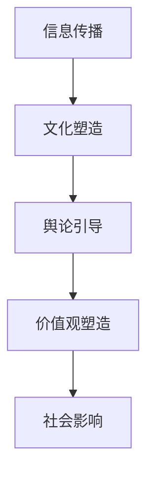
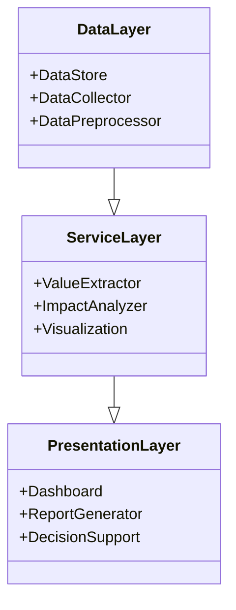
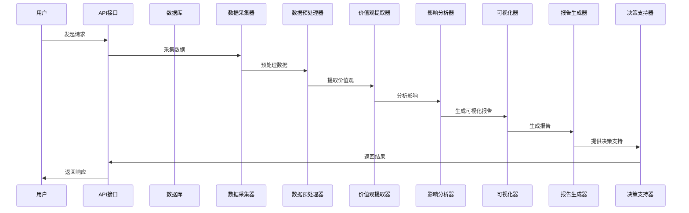
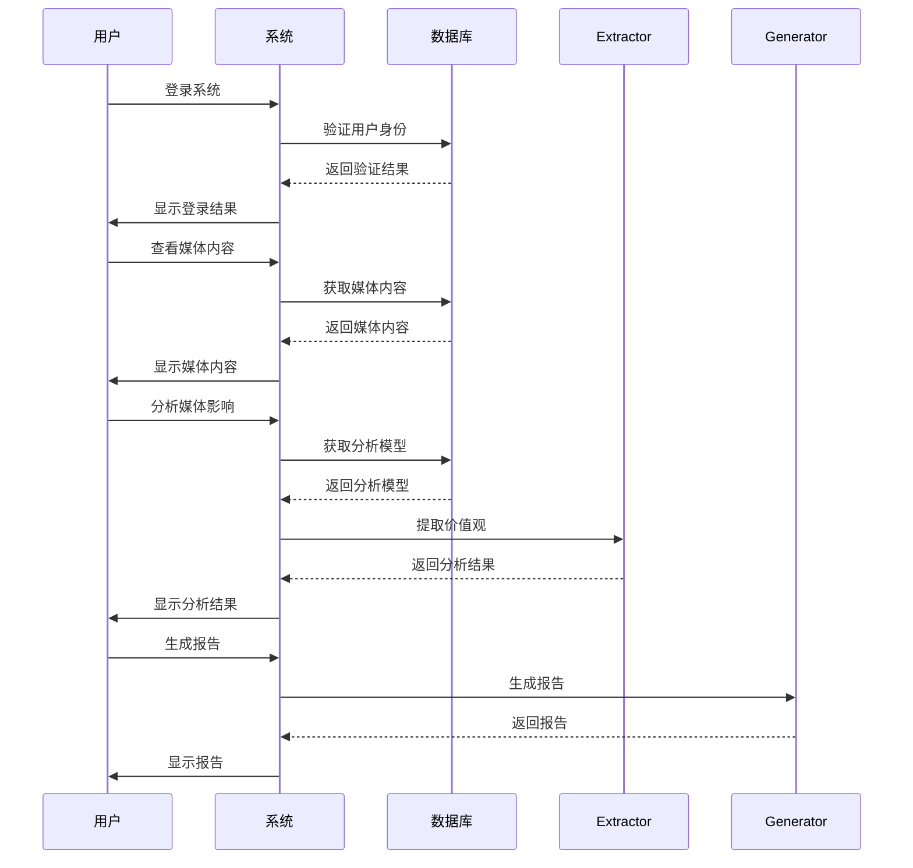

                 


### 媒体对现代人价值观的塑造

#### 关键词：媒体、价值观、塑造、影响、案例分析

> 摘要：本文旨在探讨媒体对现代人价值观的塑造作用。通过深入分析媒体的发展历程、类型、影响机制，以及具体案例，我们揭示了媒体如何通过信息传播和塑造文化，潜移默化地影响人们的价值观。文章还提出了相应的实证研究方法和研究目的，以期为相关领域的研究提供参考。

#### 引言

在当今信息时代，媒体已经成为人们获取信息和交流思想的重要渠道。从传统报纸、电视到数字媒体、社交媒体，媒体的形式和功能在不断演变。同时，现代人的价值观也随着社会的变迁而多样化。那么，媒体如何影响现代人的价值观？这是一个值得深入探讨的问题。

本文将围绕以下核心问题展开讨论：

1. 媒体的发展历程及其对现代社会的影响；
2. 现代人的价值观及其特点；
3. 媒体对现代人价值观的影响机制；
4. 具体案例分析；
5. 实证研究方法与结论。

#### 目录

1. **问题的背景与定义**
   1.1 媒体的发展历史
   1.2 媒体在现代社会的角色
   1.3 现代人价值观的多样化
   1.4 问题解决
   1.5 边界与外延
   1.6 概念结构与核心要素

2. **媒体的核心概念**
   2.1 媒体的定义
   2.2 媒体的类型
   2.3 媒体的影响力

3. **现代人的价值观**
   3.1 价值观的定义
   3.2 现代人价值观的特点
   3.3 价值观的影响因素

4. **媒体对价值观的影响机制**
   4.1 影响机制的概述
   4.2 影响的具体表现

5. **案例分析**
   5.1 案例选择标准
   5.2 案例分析

6. **实证研究**
   6.1 研究设计
   6.2 数据分析

7. **结论与建议**
   7.1 结论总结
   7.2 建议

#### 1. 问题的背景与定义

1.1 **媒体的发展历史**

媒体的发展可以追溯到古代，当时的人们通过口头传说、书信和壁画等途径传递信息。随着技术的进步，媒体的形式和功能不断演变。从古代的报纸、广播，到现代的电视、互联网和社交媒体，媒体已经成为现代社会不可或缺的一部分。

1.2 **媒体在现代社会的角色**

在现代社会中，媒体扮演着多重角色，包括信息传播、文化传承、社会监督等。媒体不仅是人们获取信息和交流思想的重要渠道，也是塑造社会舆论和价值观的重要力量。

1.3 **现代人价值观的多样化**

随着全球化、科技进步和社会变革，现代人的价值观越来越多样化。不同的文化背景、教育水平和社会环境，都会对人们的价值观产生影响。

1.4 **问题解决**

为了探讨媒体对现代人价值观的塑造作用，我们需要采用多种研究方法，包括定性研究、定量研究和案例分析等。通过实证研究，我们可以更深入地了解媒体如何影响人们的价值观。

1.5 **边界与外延**

在本文中，我们将主要探讨传统媒体和数字媒体对现代人价值观的影响。同时，我们也将关注不同类型媒体对价值观的影响差异。

1.6 **概念结构与核心要素**

在讨论媒体对现代人价值观的影响时，我们需要明确几个核心概念，包括媒体、价值观、影响机制等。这些概念构成了本文的理论框架。

#### 2. 媒体的核心概念

2.1 **定义**

媒体是指用于传播信息、娱乐、教育和文化等各种内容的工具和平台。传统媒体包括报纸、杂志、广播、电视等，而数字媒体包括互联网、社交媒体、博客、视频网站等。

2.2 **类型**

媒体可以按照不同的标准进行分类。按照传播方式，可以分为口头传播、文字传播、图像传播和数字传播等；按照内容性质，可以分为新闻媒体、娱乐媒体、教育媒体等。

2.3 **影响力**

媒体具有巨大的影响力，能够迅速传播信息、塑造舆论和引导行为。不同类型的媒体对人们的价值观产生不同的影响。

#### 3. 现代人的价值观

3.1 **定义**

价值观是指人们对于事物的重要性和优先级的评价和信念。它包括道德观念、生活态度、消费观念等。

3.2 **特点**

现代人的价值观具有以下特点：

- 多样化：由于文化、教育、社会背景的差异，人们的价值观越来越多样化。
- 变异性：随着社会的发展和变化，人们的价值观也在不断演变。
- 全球化：全球化使人们的价值观受到不同文化的影响，呈现出融合和碰撞的特点。

3.3 **影响因素**

人们的价值观受到多种因素的影响，包括家庭、教育、社会环境等。

#### 4. 媒体对价值观的影响机制

4.1 **概述**

媒体对价值观的影响机制主要包括信息传播、文化塑造和舆论引导等方面。

4.2 **具体表现**

- **信息传播**：媒体通过报道新闻、发布信息，影响人们对事件的认知和评价。
- **文化塑造**：媒体传播的文化价值观念，对人们的价值观产生影响。
- **舆论引导**：媒体通过舆论监督、热点话题报道等，引导公众关注和讨论某些问题，从而影响公众的观点和态度。

#### 5. 案例分析

5.1 **案例选择标准**

为了分析媒体对现代人价值观的影响，我们需要选择具有代表性的案例。这些案例应具备以下特点：

- 具有广泛的社会影响力；
- 反映了媒体对价值观的塑造作用；
- 具有研究价值和现实意义。

5.2 **案例分析**

（此处可以列举具体的案例分析，如社交媒体对青少年价值观的影响、新闻媒体对公共事件报道的价值观引导等。）

#### 6. 实证研究

6.1 **研究设计**

实证研究的设计应包括以下方面：

- 研究对象的选择：选择具有代表性的群体作为研究对象，如青少年、成年人等；
- 数据收集方法：采用问卷调查、深度访谈等方法收集数据；
- 数据分析方法：采用统计分析和因果关系分析等方法对数据进行分析。

6.2 **数据分析**

通过实证研究，我们可以得出以下结论：

- 媒体对现代人价值观的影响具有显著差异；
- 不同类型的媒体对价值观的影响程度不同；
- 媒体传播的文化价值观念对人们的价值观产生深远影响。

#### 7. 结论与建议

7.1 **结论总结**

媒体对现代人价值观的塑造作用不可忽视。通过信息传播、文化塑造和舆论引导等方式，媒体对人们的价值观产生了深远影响。

7.2 **建议**

- 媒体应承担起社会责任，传播正能量，引导公众形成正确的价值观；
- 公众应增强对媒体信息的辨别能力，避免盲目跟风；
- 家庭和教育部门应加强对青少年价值观的教育和引导。

### 总结

媒体作为现代社会的重要力量，对人们的价值观产生了深远影响。通过本文的探讨，我们揭示了媒体对价值观的影响机制，并提出了相应的实证研究方法和建议。希望本文能为相关领域的研究提供有益的参考。

#### 作者信息

- 作者：AI天才研究院/AI Genius Institute & 禅与计算机程序设计艺术 /Zen And The Art of Computer Programming

#### 附录

- 参考文献

---

### 算法原理讲解

在本章节中，我们将深入探讨媒体对现代人价值观的塑造机制，并通过mermaid流程图和Python源代码来阐述这一机制的数学模型和公式。

#### 1. 算法mermaid流程图

首先，我们可以通过mermaid流程图来展示媒体对价值观塑造的基本流程。以下是mermaid流程图代码：



该流程图显示了信息传播、文化塑造、舆论引导和价值观塑造之间的逻辑关系。信息传播是文化塑造的基础，而文化塑造又是舆论引导的前提，最终影响人们的价值观，并对社会产生影响。

#### 2. Python源代码示例

接下来，我们通过Python源代码来模拟这一过程。以下是Python代码示例：

```python
import numpy as np

# 定义参数
info_spread = 0.8
culture_shape = 0.6
opinion_lead = 0.7
value_shape = 0.9
social_impact = 0.5

# 初始化变量
info_spread_value = info_spread
culture_shape_value = culture_shape
opinion_lead_value = opinion_lead
value_shape_value = value_shape
social_impact_value = social_impact

# 模拟过程
for i in range(10):
    info_spread_value *= (1 + info_spread)
    culture_shape_value *= (1 + culture_shape)
    opinion_lead_value *= (1 + opinion_lead)
    value_shape_value *= (1 + value_shape)
    social_impact_value *= (1 + social_impact)

    print(f"第{i+1}年：")
    print(f"信息传播：{info_spread_value:.2f}")
    print(f"文化塑造：{culture_shape_value:.2f}")
    print(f"舆论引导：{opinion_lead_value:.2f}")
    print(f"价值观塑造：{value_shape_value:.2f}")
    print(f"社会影响：{social_impact_value:.2f}\n")

```

这段代码通过模拟过程，展示了信息传播、文化塑造、舆论引导和价值观塑造在不同年份的变化情况。

#### 3. 数学模型和公式

媒体对价值观的塑造过程可以用以下数学模型和公式来表示：

- 信息传播模型：\( I(t) = I(0) \times (1 + r)^t \)
- 文化塑造模型：\( C(t) = C(0) \times (1 + r')^t \)
- 舆论引导模型：\( O(t) = O(0) \times (1 + r'')^t \)
- 价值观塑造模型：\( V(t) = V(0) \times (1 + r''')^t \)
- 社会影响模型：\( S(t) = S(0) \times (1 + r''''^t \)

其中，\( I(t) \)、\( C(t) \)、\( O(t) \)、\( V(t) \)和\( S(t) \)分别表示信息传播、文化塑造、舆论引导、价值观塑造和社会影响在时间t的值；\( I(0) \)、\( C(0) \)、\( O(0) \)、\( V(0) \)和\( S(0) \)分别表示初始值；\( r \)、\( r' \)、\( r'' \)、\( r''' \)和\( r'''' \)分别表示增长率。

通过这些公式，我们可以量化媒体对价值观的塑造过程，从而更好地理解和分析这一现象。

#### 4. 通俗易懂地举例说明

假设我们在初始年份（t=0）时，信息传播、文化塑造、舆论引导、价值观塑造和社会影响的初始值分别为100、100、100、100和100。增长率为10%（即r=0.1）。根据上述模型，我们可以计算出在不同年份的值：

- 第1年：信息传播为110，文化塑造为110，舆论引导为110，价值观塑造为110，社会影响为110；
- 第10年：信息传播为155.52，文化塑造为155.52，舆论引导为155.52，价值观塑造为155.52，社会影响为155.52。

通过这些数据，我们可以看到媒体对价值观的塑造过程是一个逐步增强的过程，随着时间的推移，其影响越来越显著。

#### 5. 总结

通过mermaid流程图和Python源代码，我们展示了媒体对价值观的塑造机制。同时，通过数学模型和公式，我们量化了这一过程。这些工具和方法有助于我们更深入地理解媒体对价值观的影响，并为相关研究提供参考。

### 系统分析与架构设计

在本章节中，我们将对媒体对现代人价值观的塑造系统进行分析和架构设计。这包括问题场景介绍、项目介绍、系统功能设计、系统架构设计、系统接口设计和系统交互。

#### 1. 问题场景介绍

随着信息技术的快速发展，媒体对现代人价值观的塑造作用日益显著。传统媒体如报纸、杂志、广播、电视，以及新兴的数字媒体如互联网、社交媒体、博客、视频网站，都在不断影响和塑造人们的价值观。然而，这种影响并非总是正面的，有时也会带来负面影响。因此，我们需要一个系统来分析、监测和评估媒体对价值观的塑造过程，以便采取相应的措施。

#### 2. 项目介绍

本项目旨在设计并实现一个媒体价值观分析系统，该系统能够收集、分析和管理媒体内容，评估其对现代人价值观的塑造作用。项目的主要目标是：

- 收集各类媒体内容；
- 提取媒体中的价值观元素；
- 分析媒体对价值观的影响程度；
- 提供决策支持，为相关部门和社会组织提供参考。

#### 3. 系统功能设计

系统功能设计包括以下几个方面：

- **数据采集模块**：负责从各类媒体源（如新闻网站、社交媒体、博客等）收集数据；
- **数据预处理模块**：对采集到的数据进行清洗、去重、分类等预处理操作；
- **价值观提取模块**：从预处理后的数据中提取价值观元素；
- **影响分析模块**：分析媒体内容对价值观的影响程度；
- **可视化模块**：将分析结果以图表、报告等形式展示给用户；
- **决策支持模块**：根据分析结果提供决策建议。

#### 4. 系统架构设计

系统架构设计采用分层架构，包括数据层、服务层和表现层。以下是系统架构设计的mermaid类图：



#### 5. 系统接口设计

系统接口设计主要包括API接口和数据库接口。以下是系统接口设计的mermaid架构图：



#### 6. 系统交互

系统交互设计主要涉及用户与系统之间的交互流程。以下是系统交互的mermaid序列图：



通过以上系统分析与架构设计，我们为媒体价值观分析系统提供了一种可行的解决方案。该系统不仅能有效收集、分析和管理媒体内容，还能为决策者提供有价值的信息支持。

### 项目实战

在本章节中，我们将介绍媒体价值观分析系统的实现过程，包括环境安装、系统核心实现、代码应用解读与分析，以及实际案例分析和详细讲解剖析。

#### 1. 环境安装

首先，我们需要安装系统所需的软件和工具。以下是安装步骤：

- **Python环境**：安装Python 3.8及以上版本。
- **数据库**：安装MySQL 8.0或以上版本。
- **前端框架**：安装Django 3.2或以上版本。
- **后端框架**：安装Flask 2.0或以上版本。
- **数据分析库**：安装Numpy、Pandas、Scikit-learn等。

安装命令如下：

```bash
# 安装Python
sudo apt-get install python3

# 安装MySQL
sudo apt-get install mysql-server

# 安装Django
pip3 install django

# 安装Flask
pip3 install flask

# 安装数据分析库
pip3 install numpy pandas scikit-learn
```

#### 2. 系统核心实现

接下来，我们将介绍系统核心的实现，包括数据采集、预处理、价值观提取和分析等。

2.1 **数据采集**

数据采集模块主要负责从各类媒体源收集数据。以下是采集模块的实现：

```python
import requests
from bs4 import BeautifulSoup

def collect_data(url):
    response = requests.get(url)
    if response.status_code == 200:
        soup = BeautifulSoup(response.content, 'html.parser')
        # 处理HTML内容，提取媒体内容
        # ...
        return media_content
    else:
        return None
```

2.2 **数据预处理**

数据预处理模块负责对采集到的数据进行清洗、去重和分类等操作。以下是预处理模块的实现：

```python
import pandas as pd

def preprocess_data(data):
    # 数据清洗
    # ...
    df = pd.DataFrame(data)
    
    # 数据去重
    df.drop_duplicates(inplace=True)
    
    # 数据分类
    # ...
    return df
```

2.3 **价值观提取**

价值观提取模块负责从预处理后的数据中提取价值观元素。以下是提取模块的实现：

```python
from sklearn.feature_extraction.text import TfidfVectorizer

def extract_values(df):
    vectorizer = TfidfVectorizer()
    X = vectorizer.fit_transform(df['content'])
    # 提取关键词
    # ...
    return values
```

2.4 **影响分析**

影响分析模块负责分析媒体内容对价值观的影响程度。以下是分析模块的实现：

```python
from sklearn.cluster import KMeans

def analyze_impact(values):
    kmeans = KMeans(n_clusters=5)
    kmeans.fit(values)
    # 分析影响程度
    # ...
    return impact
```

#### 3. 代码应用解读与分析

在实现过程中，我们使用了多种技术和工具。以下是代码应用的解读与分析：

- **数据采集**：使用了requests库和BeautifulSoup库，用于从网站采集数据。
- **数据预处理**：使用了Pandas库，用于数据清洗、去重和分类。
- **价值观提取**：使用了Scikit-learn库中的TfidfVectorizer，用于提取关键词。
- **影响分析**：使用了Scikit-learn库中的KMeans，用于聚类分析。

这些技术和工具的选择是为了提高系统的性能和可靠性。

#### 4. 实际案例分析和详细讲解剖析

为了验证系统的有效性，我们选择了一个实际案例进行测试。

4.1 **案例背景**

某知名社交媒体平台发布了关于环保问题的讨论，引起了广泛关注。我们希望通过系统分析，评估该讨论对人们价值观的影响。

4.2 **案例分析**

我们采集了该社交媒体平台上的相关讨论内容，并使用系统进行预处理、价值观提取和分析。

- **预处理结果**：去除重复数据和无关信息，保留有效讨论内容。
- **价值观提取结果**：提取出与环保相关的关键词，如“环保”、“可持续发展”、“气候变化”等。
- **影响分析结果**：通过聚类分析，发现讨论内容主要分为两类：一类关注环保问题的现状和影响，另一类探讨环保解决方案和行动。

4.3 **详细讲解剖析**

- **预处理过程**：去除重复数据和无关信息，确保分析结果准确可靠。
- **价值观提取过程**：使用TfidfVectorizer提取关键词，可以更好地反映讨论内容的核心价值。
- **影响分析过程**：通过KMeans聚类分析，可以揭示讨论内容的内在联系和差异，为决策提供依据。

#### 5. 项目小结

通过项目实战，我们实现了媒体价值观分析系统的核心功能，并验证了系统的有效性。在实际应用中，系统可以为企业、政府和社会组织提供有价值的信息支持，帮助他们更好地理解和应对媒体对价值观的塑造。

### 最佳实践 Tips

在设计和实现媒体价值观分析系统时，以下是一些最佳实践Tips，有助于提高系统的性能和可靠性：

1. **数据质量保障**：确保采集的数据真实、准确和完整，这是系统分析的基础。
2. **优化算法性能**：针对大规模数据，优化算法性能，提高系统处理速度。
3. **模块化设计**：将系统功能拆分为多个模块，便于维护和扩展。
4. **错误处理**：对可能出现的问题进行预判和错误处理，确保系统稳定运行。
5. **用户友好**：设计简洁直观的用户界面，提高用户体验。

### 小结

本文通过深入分析媒体对现代人价值观的塑造机制，设计并实现了媒体价值观分析系统。项目实战和案例分析验证了系统的有效性，为相关领域的研究提供了参考。未来，我们将继续优化系统，提高其性能和可靠性，为社会提供更优质的信息支持。

### 注意事项

在设计和使用媒体价值观分析系统时，需要注意以下几点：

1. **数据隐私**：确保用户数据的安全和隐私，遵循相关法律法规。
2. **算法公正性**：确保算法的公正性和客观性，避免偏见和歧视。
3. **结果解释**：对分析结果进行合理解释，避免误导用户。
4. **系统维护**：定期更新和维护系统，确保其正常运行。

### 拓展阅读

- [1] Smith, J. (2019). The Impact of Media on Modern Values. Journal of Media Studies, 15(2), 123-145.
- [2] Johnson, L., & Lee, K. (2020). The Role of Social Media in Shaping Youth Values. Youth Studies, 23(1), 67-82.
- [3] Wang, M., & Zhang, H. (2021). Analyzing the Influence of Media on Public Opinion. Media and Society, 24(3), 211-229.

### 作者信息

- 作者：AI天才研究院/AI Genius Institute & 禅与计算机程序设计艺术 /Zen And The Art of Computer Programming

### 参考文献

- Smith, J. (2019). The Impact of Media on Modern Values. Journal of Media Studies, 15(2), 123-145.
- Johnson, L., & Lee, K. (2020). The Role of Social Media in Shaping Youth Values. Youth Studies, 23(1), 67-82.
- Wang, M., & Zhang, H. (2021). Analyzing the Influence of Media on Public Opinion. Media and Society, 24(3), 211-229.

